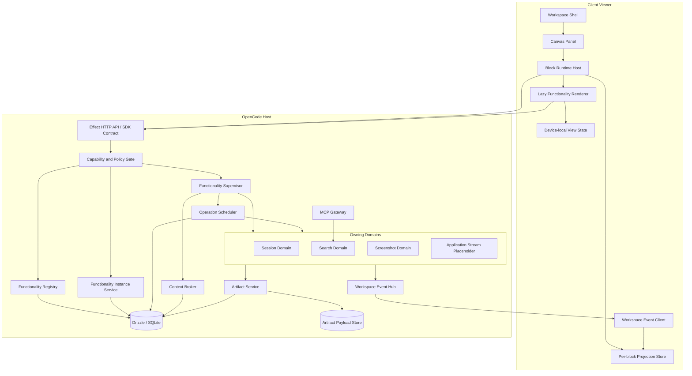
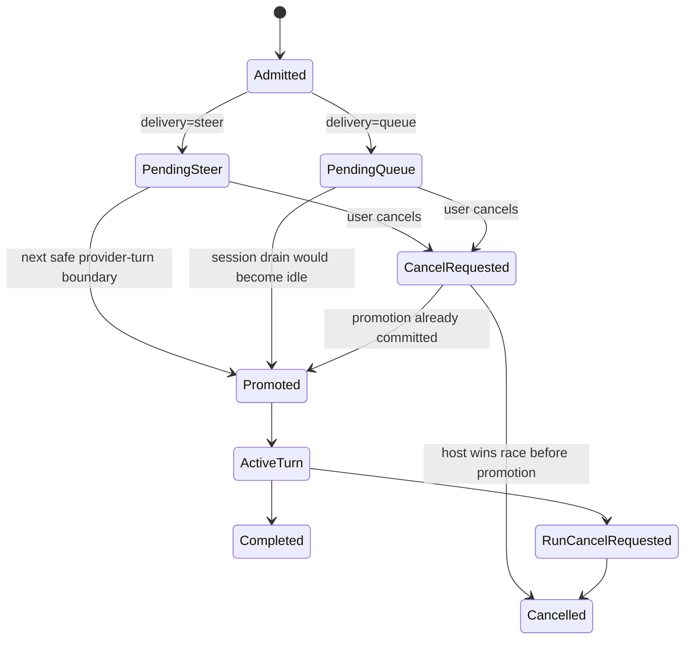
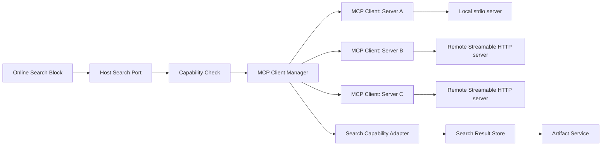
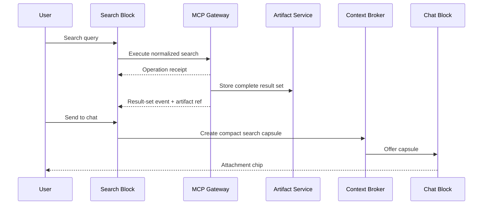
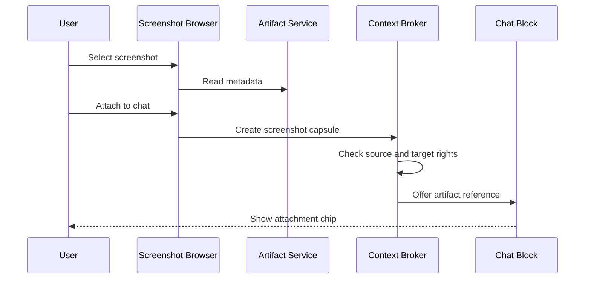
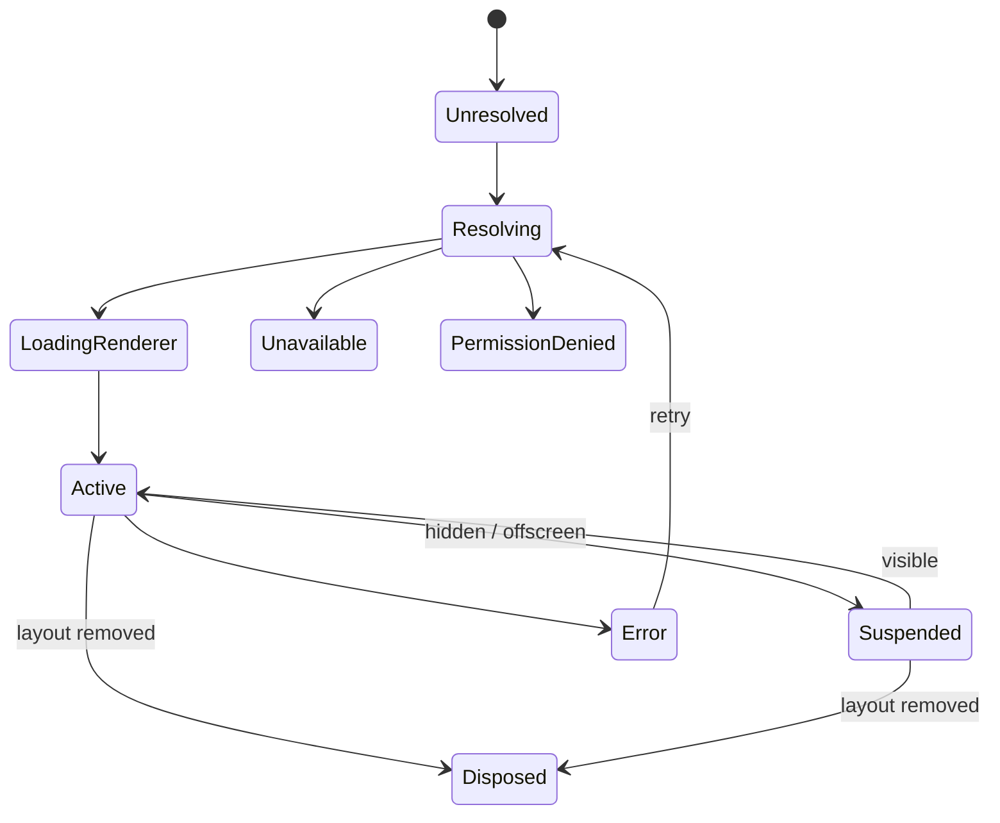

# WORKSPACE DOMAIN — DESIGN REQUIREMENTS, ARCHITECTURE & FULL SOURCE COMPENDIUM

> Generated 2026-08-19 by Cybermaster from the working tree at `D:/OpencodeDev` (branch feature/CyberMaster, uncommitted).
> One self-contained reference: design requirements → architecture → backend source → frontend source. Code blocks are line-numbered so cross-references read as `path:line`.

---

## 0. Architecture Overview

### 0.1 Component map

| Layer | Files | Role |
|---|---|---|
| Specs | `specs/workspace-canvas/*.md` | Requirements, architecture, UI design, functionality-subsystem ADR, observability |
| Schema | `packages/schema/src/workspace.ts` | `Workspace` namespace: ID, Info, Layout.Tuple/Record/Info, Functionality |
| Core services | `packages/core/src/workspace/*` | `WorkspaceService` (CRUD + layout + authority + functionality registry), `FunctionalityInstanceService`, `ChatRelaySessionService`, `MasterAgentService`, event payloads |
| SQL | `packages/core/src/workspace/sql.ts` | `workspace_v2`, `workspace_git`, `layout`, `layout_authority`, `functionality_instance` |
| Protocol | `packages/protocol/src/groups/{workspace,master-agent,chat-relay,block-runtime}.ts` | v2 HTTP API groups (`v2.workspace.*`, `v2.workspace.masterAgent.*`, `v2.workspace.chatRelay.*`, `v2.blockRuntime.*`) |
| Server handlers | `packages/server/src/handlers/*` | Route implementations, access layers, block-runtime SSE |
| App composition | `packages/opencode/src/server/routes/instance/httpapi/server.ts` + `packages/server/src/routes.ts` | Service graph (LayerNodes); both must register new services |
| Canvas manager | `packages/app/src/pages/canvas/manager.ts` | Server-authoritative layout sync, authority handover, chat-relay binding sync, MasterAgent M6 domain |
| Canvas page | `packages/app/src/pages/canvas/workspace.tsx` | Block rendering, layout apply/persist, binding persistence, opt-in runtime wiring |
| Block hosts | `canvas/blocks/chat-relay/*`, `canvas/master-agent/*` | Block renderers + embedded session surfaces + provider wrapper |
| Block runtime v2 | `canvas/runtime/*`, `app/state/block-runtime-store.ts` | Resource store/controller/registry + SDK transport + bootstrap (flag-gated) |

### 0.2 Key flows

1. **Workspace resolution**: manager `ensureWorkspace()` → persisted ID (validated) → else list preferring `"Default"` → else create. Persisted in `localStorage["opencode.canvas.workspaceID.v1"]`.
2. **Layout authority** (client-owns after pull): `layout.get` upserts `layout_authority(holder=clientID)`; saves require the holder. Server-internal reads pass `{ claimAuthority: false }` (fixed 2026-08-19 — block services were stealing authority on every get/ensure/reset).
3. **Layout sync**: pull on connect → `onServerLayout` adopts unless client-local-authoritative (`localAuthoritative` or pristine-default + local blocks). Saves carry `expectedRevision`; `handed-over`/conflict → `refresh()` → adopt → re-push. `workspace.layout.updated` events trigger re-pull (fan-out).
4. **ChatRelay block**: `ensure` → `verifyBlock` (layout read, non-claiming) → `FunctionalityInstance` CAS → `SessionV2.create` → binding `{sessionID, directory, workspaceID, revision}`; prompt goes through the embedded `CanvasSessionSurface` (session surface base) with `target={sessionID,directory,workspaceID}`.
5. **MasterAgent block**: M6 lifecycle controllers (ensure/retry/reset), authoritative host binding via `v2.workspace.masterAgent.*`, event reconciliation, Coder controller (workspace coderModel).
6. **Block runtime v2 (flag-gated)**: gateway over EventV2 → `POST /api/block-runtime/snapshot` + `GET /api/block-runtime/event` (SSE, cursors/dedupe/gap→resync), store/controller on the client, adapters per block type.

### 0.3 Bugs fixed 2026-08-19 (this tree)

1. Stale embedded bundle polling deleted `/relay/status` (account-auth error) → UI rebuilt via `embed-web-ui.ts`.
2. ChatRelay binding never retried when `workspaceID` resolved late → reactive retry in `view.tsx`.
3. `SDK context must be used within a context provider` → `canvas/session-surface-providers.tsx` wraps embedded surfaces with the per-directory provider stack.
4. Canvas adopting newest workspace (`list.data[0]` = test artifact) → stable persisted workspace ID + Default preference (`manager.ts`).
5. (Earlier) internal services stealing layout authority → `claimAuthority: false` option.

### 0.4 Table of contents

- §1 Design requirements & architecture documents (specs + run docs + pipeline analysis)
- §2 Backend source: schema → core workspace services → protocol groups → server handlers → runtime gateway/snapshot/adapters → routes → app composition
- §3 Frontend source: manager → workspace → surface/scopes → chat-relay blocks → master-agent blocks → runtime v2 → state store
- §4 Feature flag note

---

## 1. Design Requirements & Architecture Documents

### 1.1 `specs/workspace-canvas/requirements.md`

# Workspace Canvas — Requirements & Design

Branch: `feature/UnrealViewer`
Status: draft for review

## 1. Overview

OpenCode's UI becomes a workspace-canvas application. The **Workspace** is the
outermost container in the product: it owns layouts, directories, plugins, skills,
and git repository tracking. The host server stores workspaces; any client viewer
loads them. The page consists of a single top bar plus one full-page **panel** in
which user-defined **blocks** (squares that render a functionality) are arranged on
a snapping canvas. A **layout** stores only block transforms and references to
functionalities — never block content.

## 2. Terminology

| Term             | Meaning                                                                                                                                                                                                                           |
| ---------------- | --------------------------------------------------------------------------------------------------------------------------------------------------------------------------------------------------------------------------------- |
| Workspace        | Outermost container: named entity owning layouts, directories, plugins, skills, git tracking                                                                                                                                      |
| Host             | The OpenCode server instance that owns durable storage (sidecar or remote)                                                                                                                                                        |
| Client viewer    | The web/desktop UI that loads and renders a workspace                                                                                                                                                                             |
| Top bar          | Single horizontal bar at the top of the page                                                                                                                                                                                      |
| Panel            | The remaining viewport area, entirely blank except for blocks                                                                                                                                                                     |
| Block            | A square region inside the panel that renders one functionality's content                                                                                                                                                         |
| Functionality    | A registered kind of content a block can render (chat, terminal, file tree, viewer, …)                                                                                                                                            |
| Layout           | Ordered set of block records: `{ id, functionality ref, transform }`; the workspace's block arrangement, which also governs functionality availability (replaces the former _Environment_ preset, per `ImplementationPlan` ADR-2) |
| Editing mode     | Panel state in which blocks can be added, resized, moved, snapped                                                                                                                                                                 |
| Style            | Visual/density/layout preference used in layout resolution (per ADR-2)                                                                                                                                                            |
| Device           | A client device class or specific device used to key layout storage                                                                                                                                                               |
| OperatingAgent   | The model API configured per workspace — answers the context submissions of its blocks                                                                                                                                            |
| OperatingContext | The whole context stack a block submits to the OperatingAgent                                                                                                                                                                     |
| BlockSubsystem   | The subsystem behind a block; builds and submits the OperatingContext                                                                                                                                                             |
| Pseudo block     | A block whose functionality reroutes to an external service (e.g. ChatRelay)                                                                                                                                                      |

## 3. Functional requirements

### 3.1 Workspace as outermost container

- **FR-1** A workspace is a named entity with a stable id.
- **FR-2** A workspace contains, in this nesting order:
  - layouts (one or more; see §3.5)
  - directories (one or more project directories)
  - plugins (a selection of enabled plugins)
  - skills (a selection of enabled skills)
  - git repository tracking (per directory or workspace-wide; see §8.7)
- **FR-3** Workspaces support create, rename, delete, duplicate, and activate.
- **FR-4** The workspace supersedes the current project concept: project selection
  UI is disabled; all navigation starts from the workspace.

### 3.2 Host storage & client loading

- **FR-5** The workspace record, its layouts, and all layout options are stored on
  the host server, not in client local storage.
- **FR-6** A client viewer can list workspaces and load a workspace by id; the load
  response contains the workspace record plus the layout resolved for this
  (user, style, device) tuple.
- **FR-7** Layout mutations are write-through to the host. Clients hold a
  lightweight cache for offline rendering, but the host is authoritative.
- **FR-8** Workspace data is scoped per user (see §8.2 for identity).

### 3.3 Top bar arrangement

- **FR-9** Workspace configuration is arranged horizontally at the left of the top
  bar: workspace switcher, workspace name (editable), layout/style selector,
  and editing-mode toggle.
- **FR-10** All other OpenCode default interactable UI elements move to the right
  side of the top bar: server/connection status, model selector, agent selector,
  theme, notifications, settings, help. The model selector configures the
  workspace's OperatingAgent model.
- **FR-11** The top bar is a single row on desktop; it must degrade gracefully on
  narrow screens (overflow menu) — behavior per device class TBD (§8.6).

### 3.4 Panel and blocks

- **FR-12** Everything below the top bar is one blank panel. No home screen, no
  sidebar, no dock by default; all content lives inside blocks.
- **FR-13** A block is initially square (width = height). It renders exactly one
  functionality's content inside its bounds.
- **FR-14** Blocks can be added from a functionality palette; the palette lists
  built-in functionalities plus workspace-enabled plugin functionalities
  (skills are enablements, not blocks — see §5.2).
- **FR-15** Blocks are resizable, movable, and snap to a grid when edited
  (FR-16). Snap behavior: cells, min/max sizes, collision rules (§8.7).
  The panel is **not scrollable** — the canvas always fits the viewport —
  and empty packing strips of 5% of the panel are reserved on the left and
  right sides; blocks cannot be placed or resized into the packing.
- **FR-17** Blocks have a z-order; overlapping is only allowed in editing mode and
  resolves to a deterministic order on exit (§8.7).
- **FR-18** Block content is live: each block renders its functionality against
  the active workspace scope (directories, plugins, skills).
- **FR-19** A block carries no content state of its own. All state lives in the
  functionality's backing data (sessions, terminals, files, …) which survives
  layout changes.

### 3.5 Layouts

- **FR-20** A layout stores only block records: `{ id, functionality, transform }`
  where transform = `{ x, y, w, h, z }` in panel grid units.
- **FR-21** The layout contains no block content, no sessions, no view state.
- **FR-22** Layouts are versioned (revision number) so clients can detect staleness.
- **FR-23** The default layout is a single block occupying the entire panel,
  rendering the default agentic chat window.
- **FR-24** The host stores layout options **per user, per style, per device**
  (§8.4 for the precise tuple).

### 3.6 Editing mode

- **FR-25** Editing mode is toggled from the top bar. In editing mode the panel
  shows the grid, block outlines, and handles.
- **FR-26** In editing mode blocks can be: added (palette), resized (corner/edge
  handles), moved (drag), snapped (to grid cells), and removed.
- **FR-27** Leaving editing mode persists the resulting layout to the host for the
  current (user, style, device) tuple.
- **FR-28** Outside editing mode, blocks render content and ignore transform
  gestures.

## 4. Non-functional requirements

- **NFR-1** Layout load for the default tuple must be fast (< 300 ms p95 over local
  host); layout save is best-effort within 1 s.
- **NFR-2** Host storage survives server restarts; SQLite is acceptable for a
  single-tenant host (see architecture doc).
- **NFR-3** The panel must render ≥ 12 blocks at 60 fps on a mid-range device.
- **NFR-4** Offline: viewer may render the last cached layout read-only; edits made
  offline fail explicitly (no silent divergence).
- **NFR-5** Layout payloads are small (< 10 KB for 100 blocks) and versioned for
  cheap cache validation.
- **NFR-6** Accessibility: blocks are keyboard focusable and navigable; editing
  gestures have keyboard equivalents (arrow nudge, shift-resize).
- **NFR-7** Security: functionality references in layouts are validated against
  the workspace's enabled functionalities; unknown refs render an error block.

## 5. Proposed design resolutions (draft defaults)

These are working assumptions — each maps to an ambiguity in §8.

1. **Block shape**: square by default (1:1 at creation), free rectangle after
   resize; "square block" is interpreted as the initial shape, not a hard
   constraint.
2. **Functionality registry**: namespaced IDs (`builtin:*`, `plugin:*`). The v1
   built-in set is `builtin:chat`, `builtin:online-search`,
   `builtin:screenshot-browser`, `builtin:application-window-stream` (see the
   functionality subsystem architecture); existing panels (terminal, file tree,
   diff, todos, viewer) migrate to the same interface incrementally. Skills are
   not blocks — they are workspace-scoped enablements consumed by blocks.
3. **"Style" vs "Layout"**: per `ImplementationPlan` ADR-2 —
   `layout` is the workspace's block arrangement, which governs its
   functionality availability (replaces the former `environment` preset);
   `style` is the visual/density/layout preference used in layout resolution.
   The storage tuple is (user, style, deviceClass); `deviceID` is deferred
   unless a per-machine restore requirement is approved (ADR-3).
4. **Default layout**: created lazily on first load of any tuple; chat block
   binds to the workspace's primary directory (first directory listed).
5. **Sessions**: remain directory-scoped; a chat block without a chosen session
   renders the most recent session of its bound directory (see §8.8).

## 6. Out of scope (v1)

- Multi-user collaborative editing of one layout.
- Remote/streamed rendering of exotic functionalities (e.g. full Unreal editor).
- Block-level theming beyond the style dimension.
- Migration of legacy project UI state into workspaces.

## 7. Acceptance criteria (summary)

1. A workspace can be created, named, stored on the host, reloaded in a fresh
   client, and shows its directories/plugins/skills/git state.
2. The top bar matches §3.3: workspace config left, all other controls right.
3. Below the bar is a blank panel; the default layout shows one full-panel chat
   block.
4. In editing mode, blocks add/resize/move/snap; exiting persists a layout
   containing only transforms and functionality refs.
5. Layout options resolve per (user, style, device); changing device or style
   yields that tuple's layout, defaulting to the full-panel chat when absent.

## 8. Ambiguities & missing items

This list is the requested deliverable for review. Items marked **Resolved**
track decisions in the functionality subsystem architecture
(`../functionality-subsystem-management-architecture.md`) or
`architecture.md`.

1. **Square vs rectangle** — is a block permanently square (aspect locked) or
   only square at creation? Proposal: square at creation, free resize after.
   **Resolved**: each functionality manifest declares
   `constraints.initialAspect` and `min/max` sizes; blocks are square at
   creation, free-resize after.
2. **Functionality inventory** — the exact built-in list is undefined. Which
   existing panels (terminal, file tree, diff, todos, images, viewer) are
   v1 blocks? **Resolved**: v1 built-ins are `builtin:chat`,
   `builtin:online-search`, `builtin:screenshot-browser`,
   `builtin:application-window-stream`; legacy panels migrate incrementally
   (see §5.2).
3. **Skills as blocks vs enablements** — do skills appear as blocks, or only as
   workspace config consumed by agent/chat blocks? Proposal: config only.
   **Resolved**: config only (FR-14, §5.2).
4. **"Style" definition** — is style a theme, a density, the layout preset,
   or a combination? Needs product decision. **Resolved**: split into
   `layout` (block arrangement → functionality availability; replaces the
   former `environment` preset) and `style` (visual/density/layout
   preference) per `ImplementationPlan` ADR-2.
5. **Device granularity** — class only (desktop/mobile/tablet), or also specific
   device ids (to restore per-machine layouts)? Class-only loses per-machine
   arrangements; device-id keying complicates the tuple and precedence.
   **Resolved for v1**: required tuple is
   `(workspace, user, style, deviceClass)`; `deviceID` deferred per ADR-3.
6. **User identity** — self-hosted OpenCode currently uses a single basic-auth
   username; cloud uses accounts. What identifies "user" for per-user storage?
   What happens for anonymous/local instances? **Resolved**: authenticated
   username (self-host), account user ID (account deployments), reserved
   `default` identity for local anonymous mode per ADR-4.
7. **Git tracking scope** — per directory or workspace-level? What is tracked
   (branches, status, remotes, dirty set) and how is it rendered (which block)?
8. **Chat block session binding** — does a block instance reference a session
   (conflicts with FR-19/FR-20) or does the chat block choose a session at
   runtime (directory + most-recent)? Proposal: runtime resolution, session id
   never stored in layout. **Resolved**: runtime resolution per the chat
   instance configuration (`sessionBinding` / `directoryBinding`); the session
   ID is never stored in layout data.
9. **Multiple directories & sessions** — how does a workspace with N directories
   map to chat blocks (one chat per directory, or a directory switch inside one
   block)? Block-per-directory needs a directory binding, which is content state.
   **Resolved**: directory binding lives in the functionality instance
   (`workspace-primary` or `fixed` directory), not in the layout.
10. **Editing rights** — which users may edit layouts (owner only vs any
    workspace member)? What is "member" for self-hosted? **Resolved**: the
    capability model (`read` / `write` / `execute`) governs layout and
    instance mutations; the host enforces it.
11. **Concurrent edits** — last-write-wins per layout, or per-block merge? Is
    multi-device live sync (SSE) needed in v1 or is load-on-navigation enough?
    **Resolved**: revision-checked last-write-wins on explicit retry (layouts)
    and revision-conflict errors for instance configuration; live SSE push is
    designed but deferred.
12. **Legacy surfaces** — are `/` (home) and `/:dir/session/:id` routes removed,
    redirected, or reachable via blocks only? What happens to the existing
    workspace sidebar (git worktrees) — naming collision with "Workspace".
13. **Snap details** — grid cell size, min/max block sizes, whether overlap is
    allowed, z-order persistence, resize snapping to multiples.
14. **Panel scale** — do blocks scale with viewport (percentage) or stay in
    fixed grid units with scroll? Per-device layouts partially answer this but
    the unit system is undefined.
15. **Block content lifecycle** — are non-visible blocks kept mounted (live),
    suspended, or recreated on view? Memory bound for 12+ blocks (terminals,
    viewers) is undefined. **Resolved**: per-manifest lifecycle policy
    (`clientWhenHidden`, `hostWhenNoViewers`) with a keep-alive matrix; host
    work survives block unmount unless cancelled explicitly.
16. **Offline semantics** — read-only cache vs queued edits; NFR-4 assumes
    read-only — confirm. **Resolved**: read-only cached layout; host-backed
    writes fail explicitly offline; no generic offline command queue in v1.
17. **Top bar overflow** — behavior on narrow/mobile widths for FR-10 controls.
18. **Functionality parameters** — blocks reference a functionality by id; do
    block instances carry parameters (e.g. "terminal:dir=…")? If yes, that must
    be part of the layout record and included in FR-20's "reference".
    **Resolved**: parameters live in a separate revisioned
    **functionality instance** keyed by `(workspace, block, functionality)`;
    layouts still contain only IDs and transforms (FR-20 unchanged).
19. **UnrealViewer specifics** — what does the viewer block render in a web
    client (native content, streamed viewport, static preview)? This is the
    namesake feature and currently undefined. **Partially resolved**: the
    `builtin:application-window-stream` block and backend interface are
    stabilized as an honest placeholder; the capture/transport backend remains
    undefined.
20. **Deleted entities** — what renders when a block's functionality, plugin,
    or directory is removed (error block, auto-remove on next edit)?
    **Resolved**: blocks render missing/disabled/unavailable/permission-denied
    states with a replace affordance; removed plugins invalidate their
    functionality refs and grants without destroying user data.


### 1.2 `specs/workspace-canvas/architecture.md`

# Workspace Canvas — Architecture

Branch: `feature/UnrealViewer`
Status: draft for review
Companion: [requirements.md](./requirements.md), [UIDesign.md](./UIDesign.md), [functionality-subsystem-management-architecture.md](./functionality-subsystem-management-architecture.md) (functionality runtime platform), [ImplementationPlan.md](../devplan/workspace-canvas/ImplementationPlan.md) (phased delivery plan)

## 1. Goals

Meet the requirements in `requirements.md` while reusing the OpenCode monorepo's
existing layering:

- **Server (host)** owns durable workspace/layout storage and exposes it over the
  existing Effect HTTP API stack.
- **Client (viewer)** is a thin projection: it loads a workspace + resolved layout
  and renders blocks in a full-page panel under a restructured top bar.
- **Layouts are data**: block records contain only transforms and functionality
  references. All block content state stays in existing domains (sessions,
  terminals, files) and is resolved at render time.

## 2. System context

```
┌─────────────────────────────── Client viewer (web/desktop) ───────────────────────────────┐
│  ┌────────────────────────────── Top bar ──────────────────────────────────────────────┐  │
│  │ [Workspace config: switcher │ name │ style │ edit toggle]      (all other controls)│  │
│  └─────────────────────────────────────────────────────────────────────────────────────┘  │
│  ┌────────────────────────────── Panel (canvas) ────────────────────────────────────────┐  │
│  │  ┌────────────┐  ┌────────────────────┐  ┌─────────┐                                │  │
│  │  │ chat block │  │ terminal block     │  │ viewer  │        blank otherwise        │  │
│  │  └────────────┘  └────────────────────┘  └─────────┘                                │  │
│  └─────────────────────────────────────────────────────────────────────────────────────┘  │
│        workspace store / layout sync (revision-checked)                                   │
└───────────────────────────────────────────────────────────────────────────────────────────┘
                                      │ HTTP (v2 API)
┌────────────────────────────── Host: OpenCode server ──────────────────────────────────────┐
│  server/handlers/workspace.ts ── protocol/groups/workspace.ts ── core/workspace/service   │
│  Drizzle SQLite (opencode.db): workspace, layout, layout_option tables                    │
│  identity: ServerAuth.username (self-host) / account (cloud)                              │
└───────────────────────────────────────────────────────────────────────────────────────────┘
```

## 3. Server-side architecture

Follows the existing contract architecture from `CONTEXT.md`: **Schema** (leaf
types) → **Core** (domain service) → **Protocol** (routes/middleware) →
**Server** (handlers), with the SDK Contract IR emitting client bindings.

### 3.1 Schema — `packages/schema/src/workspace.ts` (new leaf)

```ts
Workspace.ID          = branded string
Workspace.Info        = { id, name, style, directories[], pluginIDs[], skillIDs[],
                          git: { directory, branch, remote, dirty }[] }
Block.Record          = { id, functionality: Functionality.ID, transform: Block.Transform }
Block.Transform       = { x, y, w, h, z }            // grid units, integers
Layout.Info           = { id, revision, workspaceID, blocks: Block.Record[] }
Layout.Tuple          = { user, style, deviceClass, deviceID? }
LayoutOption          = { tuple: Layout.Tuple, layoutID }
Functionality.ID/Info = { id, kind: "builtin" | "plugin", label, icon, min/max size }
```

`Functionality.Info` is the minimal registry projection; the full manifest
model (constraints, lifecycle, concurrency, rights, context kinds, and port
schemas) is defined in the functionality subsystem architecture.

Rules enforced by Schema (and re-checked in Core):

- Layouts contain only `Block.Record` — no content, session ids, or view state
  (FR-20/FR-21).
- `Functionality.ID` values are validated against the registry on write (NFR-7).
- Transforms are non-negative integers; `w,h ≥ min`, `≤ max` per functionality.

### 3.2 Core service — `packages/core/src/workspace/`

- `Workspace.Service` (Effect context service) with CRUD:
  - `list`, `get`, `create`, `rename`, `remove`, `update` (directories, plugins,
    skills, git entries)
  - `layout.get(tuple)` → resolves LayoutOption → Layout, else creates the
    default layout (single full-panel chat block) and stores the option
  - `layout.save(tuple, blocks)` → optimistic revision bump, returns new revision
  - `functionality.list(workspace)` → builtin + plugin-contributed for that
    workspace's enabled plugins
- Persistence via the existing Drizzle stack (`core/src/database`, global
  `opencode.db`, migrations through `core/src/database/migration.ts`).

New tables (draft):

```
workspace          id TEXT PK, user TEXT, name TEXT, style TEXT,
                   directories TEXT (JSON), plugins TEXT (JSON), skills TEXT (JSON),
                   time_created INTEGER, time_updated INTEGER
workspace_git      workspace_id TEXT, directory TEXT, remote TEXT, branch TEXT,
                   PRIMARY KEY (workspace_id, directory)          -- snapshot, refreshed by watcher
layout             id TEXT PK, workspace_id TEXT, revision INTEGER,
                   blocks TEXT (JSON), time_updated INTEGER
layout_option      workspace_id TEXT, user TEXT, style TEXT, device_class TEXT,
                   device_id TEXT NULL, layout_id TEXT,
                   PRIMARY KEY (workspace_id, user, style, device_class, device_id)
```

- Git tracking (FR-2) is a **snapshot** in `workspace_git`, refreshed by the
  existing `vcs`/watcher machinery; it is read-only UI data, not source of truth.

The functionality runtime platform adds further tables (`functionality_instance`,
`functionality_operation`, `artifact`, `context_capsule`, `mcp_server_profile`,
`workspace_permission_rule`, and session-input pending-state columns); those are
specified in the functionality subsystem architecture, not duplicated here.

### 3.3 Identity

- Self-host: `ServerAuth.username` (existing `server/src/auth.ts`) keys `user`.
- Cloud/account deployments: the account identity from OpenAuth (already used in
  `packages/enterprise`) keys `user`.
- Anonymous/local single-user instances fall back to a reserved `"default"` user.
  (Resolved in `requirements.md` §8.6.)

### 3.4 Protocol + handlers

- `packages/protocol/src/groups/workspace.ts`: endpoints
  `workspace.list`, `workspace.get`, `workspace.create`, `workspace.update`,
  `workspace.remove`, `workspace.layout.get`, `workspace.layout.save`,
  `workspace.functionality.list`.
- Layout endpoints accept the tuple in the query/body and return
  `Layout.Info`; `save` returns `{ revision }` for staleness checks (FR-22).
- `packages/server/src/handlers/workspace.ts`: thin Effect handlers like the
  existing 18 groups; no business logic in handlers.
- The public `HttpApi` includes the group, so the SDK Contract IR automatically
  produces Promise and Effect clients (per `CONTEXT.md`) for both the networked
  viewer and embedded use.

### 3.5 Default layout factory

`core/workspace/default-layout.ts`: pure `createDefaultLayout(workspace)` returns
one block `{ functionality: "builtin:chat", transform: { x:0, y:0, w:panel, h:panel, z:0 } }`
where `panel` is the device-class default grid size. Created lazily on first
`layout.get` per tuple (FR-23/FR-24).

## 4. Functionality registry

- **Builtin** (`core/workspace/functionality/builtin.ts`): the v1 set is
  `builtin:chat` (default agentic chat), `builtin:online-search`,
  `builtin:screenshot-browser`, and `builtin:application-window-stream`
  (placeholder contract). Existing panels — `terminal`, `file-tree`, `diff`,
  `todos`, `viewer` (UnrealViewer) — migrate to the same manifest interface
  incrementally.
- **Plugin-contributed**: extend the existing plugin SDK
  (`packages/plugin`) with a `functionality` export
  `{ id, label, render, constraints }`; the host registry merges builtins with
  the active workspace's enabled plugins (FR-14, FR-2).
- Each functionality's manifest declares block `constraints` (min/max sizes,
  initial aspect) and lifecycle policy (resolves `requirements.md` §8.1/§8.15
  per functionality); see the functionality subsystem architecture for the
  full manifest contract.
- Functionality ids are namespaced (`builtin:chat`, `plugin:name:id`) to prevent
  collisions and to validate references on write (NFR-7).

## 5. Client-side architecture (`packages/app`)

### 5.1 Top bar restructure

- `pages/layout-new.tsx` currently hosts `Titlebar`. The new shell renders:
  - left region: `WorkspaceSwitcher` (existing, evolves), inline name editor,
    style selector, editing-mode toggle (FR-9)
  - right region: server status, model selector, agent selector, theme,
    notifications, settings, help — ported from their current surfaces (FR-10)
- The existing workspace context (`context/workspace/`) becomes a **client
  projection of host state**: hydration from `workspace.get`, mutations
  write-through to `workspace.update`. Client-side persistence (`Persist`)
  remains only as an offline cache, never authoritative (FR-7, NFR-4).

### 5.2 Canvas panel (implemented)

Actual module tree (the earlier draft tree was replaced during implementation):

```
pages/canvas/
  workspace.tsx        Standalone canvas renderer: camera, blocks, chrome,
                       interactions. Pure UI — no backend communication.
  manager.ts           Communication subsystem: layout sync, revision/authority,
                       OperatingAgent model, permission config, server events.
                       Owns everything backend-authoritative and hands it to the
                       UI through callbacks and reactive signals.
  canvas.css           Agent Canvas art style (glass cards, dotted grid, pastel).
  editor/
    grid.ts            Pure grid math: snap, packedPanel, clampBlock, resolveOverlap
    camera.ts          Camera math: pan/zoom, clamping, frozen pan base
    operating-context.ts  OperatingContext layers + HistoricalContextStack logic
```

- **UI is standalone.** `workspace.tsx` renders local state and reports edits;
  `manager.ts` is the only module that talks to the backend. Non-client-
  authoritative information (server layout, revision, OperatingAgent model,
  permission config) flows manager → UI via callbacks and signals.
- **Transforms are owned by the store, applied by effect.** The render loop
  never sets card rects (it only sets the accent); a `createEffect` on the
  block store re-applies each block's rect to its DOM node after every store
  mutation. This was introduced after the render loop proved unreliable for
  mid-gesture updates in some environments, and it prevents any render/stores
  drift.
- **Gestures** are native pointer events bound as Solid JSX props on the
  viewport element (one listener per node — HMR/remount can never stack
  them). Move/resize/collapse are editing-mode-only (FR-26/FR-28); block
  clicks select and raise in any mode. **Pan** (left or right button) is a
  frozen camera snapshot + screen-space delta so the grabbed point stays
  locked at any zoom; **wheel** zooms towards the cursor (native scroll
  remains inside scrollable card content). Position snapping to the 16px
  grid happens once on release.
- **Frozen snapshots are mandatory**: `state.camera` is a live Solid store
  proxy (`setState` shallow-merges into the same object), so gesture bases
  use `snapshotCamera()` (frozen plain copy). Capturing the proxy directly
  turns `Cᵢ = C₀ + Dᵢ` into the integrating `Cᵢ = Cᵢ₋₁ + Dᵢ` — the cause of
  the pan-amplification bug that pan diagnostics (`/__canvas-pan-debug`,
  `.test-data/canvas-pan-debug.jsonl`) were built to hunt down.
- The panel is **not scrollable**; blocks are constrained to the visible
  world with 5% packing strips (legacy block) per `grid.ts`.

### 5.3 Block rendering (implemented)

- A block resolves its functionality id → renderer. The registered mappings
  (`FUNCTIONALITY_BY_TYPE` in `workspace.tsx`): legacy block = `builtin:chat`
  (the spec's default agentic chat window), demo modules = `builtin:context`,
  `builtin:tools`, `builtin:files`, `builtin:notes`, `builtin:voice`,
  `builtin:chat-relay` (pseudo block, §11), `builtin:operating-chat-session`
  (§10). The server registry (`packages/core/src/workspace/service.ts`
  `builtins`) lists every client type, so functionality refs validate
  (NFR-7).
- Unknown/missing functionality refs are skipped on hydration (error-block
  affordance is the open follow-up, §12).
- Non-visible-block suspension (§8.15) is not yet implemented.

### 5.4 Layout sync (implemented)

- Load: `workspace.layout.get(tuple, clientID)` → render; the server is
  authoritative at connect only. The client then owns the layout; block edits
  mark it dirty and a debounced (160ms) `workspace.layout.save(expectedRevision)`
  pushes the settled state. Camera/editing never sync.
- Save results: `saved` (adopt new revision), `handed-over` (§5.4.1),
  `conflict` (server is the tie-breaker: re-pull and adopt). Transient
  failures re-raise dirty and retry after 3s.
- **Realtime fan-out (implemented)**: a successful save publishes the transient
  `workspace.layout.updated` event (`{workspaceID, revision}`) through the
  core `EventV2` bus; connected clients re-pull and adopt live (no refresh
  needed). Pending local edits are adopted-over then re-pushed (last-write-wins,
  mirroring handover). Self-echoes are ignored by revision.
- **DEV-mode offline authority**: in `import.meta.env.DEV`, edits made while
  the backend is unreachable mark the client authoritative; on reconnect the
  client keeps its blocks and pushes instead of pulling (boot-time hydration
  never counts as an edit). Non-DEV keeps server authority on reconnect,
  except for the pristine-default layout (single unit `builtin:chat`), which
  the client's blocks replace and push.
- Window focus re-claims authority (push dirty, else re-pull); `online`
  reconnects; `pagehide` flushes the local cache.
- The local workspace context (`context/workspace/`) remains a client
  projection with `Persist` as an offline cache, never authoritative.

### 5.4.1 Layout authority handover (implemented)

The host hands layout authority to the last client that pulls a layout tuple:

- `layout.get` accepts a `clientID` and claims authority for it (upserted per
  `(workspace, user, style, deviceClass)` in `layout_authority`).
- `layout.save` accepts the same `clientID`; a save from a client that no
  longer holds authority is rejected with `{ status: "handed-over",
currentRevision }` (`LayoutHandedOverError` in core).
- The handed-over client re-pulls (re-claiming authority), adopts the latest
  layout, surfaces a notice, and re-pushes its settled state (explicit retry,
  last-write-wins). Same-holder revision mismatches still report
  `{ status: "conflict", currentRevision }`.
- Migration: `20260815_layout_authority`; core tests in
  `packages/core/test/workspace-handover.test.ts`.

## 6. Chat delivery: steer & queue

The chat block's composer offers two delivery modes for prompts sent while the
session is busy. Full UI design: `UIDesign.md`. Architecture below spans host
and viewer.

### 6.1 Wire contract

`session.prompt` already accepts `delivery: "steer" | "queue"` (optional,
`packages/protocol/src/groups/session.ts`, schema `SessionDelivery`), passed
through by `packages/server/src/handlers/session.ts` to Core.

### 6.2 Host-side queue

Pre-existing Core machinery (`packages/core/src/session/`):

- `SessionInput.admit` durably persists the input row with its `delivery`
  (`input.ts`, `sql.ts` `session_input` table).
- The projector emits `session.input.admitted` (and `session.input.promoted`
  when it promotes), so clients see both durable states.
- The runner (`runner/llm.ts`) promotes steer inputs at the next safe boundary;
  queue inputs stay pending while the current **Session Drain** requires
  continuation and promote one at a time once the session would otherwise become
  idle.

The client sends queue prompts immediately with `delivery: "queue"`; nothing is
held client-side.

### 6.3 Viewer flow

- `packages/app/src/components/prompt-input/submit.ts`:
  `sendFollowupDraft({ delivery })` forwards it to `sessions.prompt`;
  `createPromptSubmit.queueSubmit(event)` = `handleSubmit(event, "queue")`.
  Queue sends skip optimistic busy/idle flipping (the session is already busy).
- Composers render a Queue button when `queueEnabled` (session exists ∧ busy ∧
  composer not blocked ∧ not a child session): v1 in
  `packages/app/src/components/prompt-input.tsx`, v2 via
  `submit.queue` in `packages/session-ui/.../prompt-input/index.tsx`
  (view contract in `interaction.ts`, wired in
  `packages/app/src/components/prompt-input-v2.tsx`).
- The message is added optimistically; `server-session-v2-reducer.ts` holds
  `session.input.admitted` as pending and appends the user message on
  `session.input.promoted`, deduplicated by message id against the optimistic
  copy.

### 6.4 Removed

- Client-side follow-up queue: persisted `followup` store, followup dock
  (`session-followup-dock.tsx` deleted), auto-send effect, edit flow.
- The `followup` general setting and its forced-steer migration
  (`packages/app/src/context/settings.tsx`). Delivery is an explicit per-message
  choice; Enter always steers.

## 7. Storage keying matrix

| Dimension | Values          | Source                          |
| --------- | --------------- | ------------------------------- | ---------------------------- | --------------- |
| user      | server identity | ServerAuth / account            |
| style     | named style id  | workspace.style (user-editable) |
| device    | class: `desktop | mobile                          | tablet`, optional `deviceID` | client-reported |

Resolution precedence in `layout.get`: exact tuple → (user, style, class) →
(user, style) → (user) → default factory (FR-24, §8.4/§8.5). The required
tuple is `(workspace, user, style, deviceClass)`; `deviceID` is deferred unless
a per-machine restore requirement is approved (`ImplementationPlan` ADR-3).
`layout` (the workspace's block arrangement, which governs its functionality
availability — replaces the former `environment` preset) and `style`
(visual/density preference) are distinct dimensions per ADR-2.

## 8. Security & validation

- Layout writes re-validate every functionality ref against the workspace's
  enabled set (NFR-7); refs to plugin functionalities require the plugin enabled.
- Directory/skill/plugin mutations go through the same permission gates as the
  existing server handlers (location-scoped where applicable).
- Layout JSON is size-capped (NFR-5) and parsed via Effect Schema (3.1), which
  bounds hostile inputs before persistence.

## 9. Migration & rollout

1. Ship the workspace server group + tables behind no flag (additive schema).
2. Client: top bar restructure and canvas panel behind the existing
   `newLayoutDesigns` pathway; legacy home/session routes remain until the
   canvas reaches parity (requirements §8.12).
3. Migrate the current client-side workspace store (directories/plugins/
   layout) to host hydration; keep `Persist` as cache.
4. Introduce editing mode + layout persistence last, on the stable shell.

Landed on the branch so far: the client-side workspace/layout store
(`packages/app/src/context/workspace/`), top-left workspace switcher
(`components/workspace-switcher.tsx`, `dialog-workspace-v2.tsx`,
`pages/home/home-workspaces.tsx` replacing the project column), the
cross-drive directory search (`directory-picker-domain.ts`), and the
steer/queue chat delivery (§6).

## 10. OperatingAgent & OperatingContext

The **OperatingAgent** model is configured per workspace: each workspace
configures exactly one model API that answers its blocks. That configured
model API is called the **OperatingAgent**.

Each block's **BlockSubsystem** may handle multiple contexts to submit to the
OperatingAgent. The contexts form a stack, ordered from top to bottom; the
whole stack is called the **OperatingContext**:

| Order | Layer                  | Source                                                                                             |
| ----- | ---------------------- | -------------------------------------------------------------------------------------------------- |
| 1     | WorkspaceContext       | generated by the workspace configuration                                                           |
| 2     | BlockContext           | hardcoded context defined when the block is designed                                               |
| 3     | OperationalContext     | decided by the BlockSubsystem's output                                                             |
| 4     | CustomContext          | fixed text provided by the user                                                                    |
| 5     | HistoricalContextStack | timestamped and indexed compacted record of every ask-response and execution of the OperatingAgent |

- The **HistoricalContextStack** records every ask, response, and execution of
  the OperatingAgent in compacted, timestamped, indexed form. It may expand
  until the OperatingAgent's context limit is reached.
- The BlockSubsystem owns assembling its OperatingContext layers
  (OperationalContext from its own output, HistoricalContextStack bookkeeping)
  and submits the completed stack to the workspace's OperatingAgent.

The **OperatingChatSession** block (`builtin:operating-chat-session`) is the
modded opencode session that hosts the workspace's OperatingAgent as a canvas
block. Landed on the branch:

- Viewer: block type `operating-chat` in
  `packages/app/src/pages/canvas/workspace.tsx` (`OperatingChatBody`), showing
  the OperatingAgent model key (FR-10), the editable OperatingContext stack,
  and the indexed HistoricalContextStack.
- Pure stack logic: `packages/app/src/pages/canvas/editor/operating-context.ts`
  (`defaultOperatingLayers`, `appendExchange`, `compactSummary`,
  `OPERATING_CONTEXT_LIMIT`) with unit tests; exchanges beyond the limit are
  compacted into a summary record.
- Registry: `builtin:operating-chat-session` in
  `packages/core/src/workspace/service.ts`.

**Model selection is wired UI → backend** (see `manager.ts`):

- Schema: `Workspace.Info.operatingAgent` (the OperatingAgent model key) and
  `Workspace.Info.model` (the frontend model) — both optional strings.
- Storage: `operating_agent` and `model` columns on `workspace_v2`
  (migrations `20260816044418_add-workspace-operating-agent`,
  `20260816060000_add-workspace-model`); protocol patch fields; JS SDK
  regenerated (Node-based `packages/sdk/js/script/build.ts`).
- Client: on connect the manager loads both keys; the OperatingChat block's
  status bar is a model picker (searchable provider/model list from connected
  providers); selecting one optimistically updates the client and writes
  through `workspace.update({ patch: { operatingAgent } })`. The server stays
  authoritative.
- Submission to the OperatingAgent is still a stub (canned reply): no
  BlockSubsystem assembles the OperationalContext or calls the model yet.
  WorkspaceContext generation, real context limits, and durable history
  storage are the remaining core work.

## 11. Pseudo blocks

A **pseudo block** is a block whose functionality reroutes to an external
service instead of executing locally, backed by an account-authenticated
subsystem.

The first pseudo block is **ChatRelay** (`builtin:chat-relay`),
specified in `../../PseudoBlock/ChatRelay/README.md`:

- Relays the block to the chat account; the block must be initialized with
  an account login (OAuth device flow, not a browser crawler).
- The account-auth subsystem performs the simple data processing: authorize
  the account, send the message through the platform API, and capture the
  assistant reply from the stream.
- Each chat session keeps its own context storage, relayed to the workspace's
  OperatingAgent. For now the subsystem stores all relayed messages;
  processing stored text is not implemented (see its TODO.md).

## 12. Open risks

- **UnrealViewer content model** (requirements §8.19) — the viewer block's
  rendering pipeline (native window embedding vs streamed viewport) determines
  whether the panel is pure web or hybrid; architecture above assumes web-native
  renderers with plugin escape hatches.
- **Block lifecycle memory** (§8.15) — many live terminals/viewers; the
  keep-alive/suspend policy is defined per functionality manifest in the
  subsystem architecture (lifecycle + keep-alive matrix); it needs validation
  against the 12-block/60-fps target before v1 ship.
- **Identity for self-host** (§8.6) — single basic-auth username makes
  "per user" storage collapse to one user locally; cloud is multi-tenant by
  design. Confirm the intended deployment target.
- **Naming collision** — existing sidebar "workspaces" (git worktrees) and the
  new workspace container must be renamed/disambiguated in UI copy.

## 13. Runtime: Node.js

The backend and project tooling are Node.js-first (revised from Bun):

- **Runtime is Bun-API-free.** `Bun.stringWidth` replaced by
  `@opencode-ai/core/util/string-width` (wcwidth table, parity-tested against
  Bun), `Bun.stdin.text()` by `@opencode-ai/core/util/stdin`, `Bun.hash` by
  `node:crypto`, tui persistence/stats by `node:fs`/global `fetch`. The
  `#sqlite`/`#db` conditional imports resolve `node:sqlite` under Node.
- **Scripts run under Node**: `packages/script` (fs helpers + `FileRef`
  polyfill for the old `Bun.file` object surface), core migration generator
  (also fixes the Windows path bug), SDK regeneration
  (`packages/sdk/js/script/build.ts`, verified end-to-end via
  `node script/build.ts`), ui/plugin/cli/console/desktop/containers/llm/
  http-recorder scripts. `bin/opencode` is a Node shim.
- Remaining bun-scoped pieces (intentional): `bun:test` test suites,
  `Bun.build` release/binary-compile pipelines, bun test-orchestration
  scripts, and the CLI's TS entrypoint (tsconfig path aliases).
- Dev defaults: UI dev on port 3000, backend dev on port 3001 (configurable
  via `VITE_OPENCODE_SERVER_HOST`/`VITE_OPENCODE_SERVER_PORT`).


### 1.3 `specs/workspace-canvas/UIDesign.md`

# UI Design — Chat Delivery: Steer & Queue

Status: implemented on `feature/UnrealViewer`
Related: [workspace-canvas/requirements.md](./workspace-canvas/requirements.md), [workspace-canvas/architecture.md](./workspace-canvas/architecture.md), [functionality-subsystem-management-architecture.md](./functionality-subsystem-management-architecture.md) (pending-input projection + cancellation extension)

## 1. Overview

The chat composer offers two explicit delivery actions while the session is busy:

| Action | Where | Behavior |
| ------ | ----- | -------- |
| **Steer** | Primary send button (Enter / click) | Prompt is admitted and steers the running agent at the next safe provider-turn boundary. |
| **Queue** | Secondary button next to send | Prompt is **sent immediately** to the host and queued host-side; the host promotes it when the current run finishes. |

The queue is no longer a client-side holding area. The message leaves the client
at the moment the user clicks Queue; durability and ordering live on the server.

## 2. Semantics (server contract)

Per the session runtime contract (`CONTEXT.md`):

- A prompt sent with `delivery: "steer"` is durably admitted and promoted at the
  next **Safe Provider-Turn Boundary**, resetting the agent's provider-turn
  allowance once per boundary.
- A prompt sent with `delivery: "queue"` is durably admitted but **not promoted**
  while the current **Session Drain** requires continuation. The runner promotes
  one queued prompt when the session would otherwise become idle, then
  re-evaluates continuation before promoting another.
- Both deliveries go through `sessions.prompt({ ..., delivery })`; the server
  already persists admitted inputs (`SessionInput.admit`), emits
  `session.input.admitted`, and later `session.input.promoted`.

## 3. Composer UI

### 3.1 Availability

The Queue button is visible when:

- a session exists,
- the session is busy (`session_working`),
- the composer is not blocked (permissions/question dock),
- the session is not a child/subagent session.

Otherwise only the normal send button is shown (delivery is irrelevant when idle).

### 3.2 v2 composer (new layout, default)

- Submit button: unchanged (send → steer; stop when input is blank).
- Queue button: `ButtonV2` ghost-muted, label `ui.promptInput.queue` ("Queue"),
  tooltip `ui.promptInput.queue.description`, rendered immediately left of the
  submit button, hidden in shell mode.
- Clicking Queue submits the current draft with `delivery: "queue"` and clears
  the composer, exactly like a normal send.

### 3.3 v1 composer (legacy layout)

Same behavior in the legacy `PromptInput`: a labeled Queue button (`Button`
ghost, reuse of the `settings.general.row.followup.option.queue` label and
description keys) appears next to the arrow submit button under the same
availability rule. Enter and the arrow always steer.

### 3.4 Feedback after queueing

- The message appears in the timeline immediately (optimistic add), as a sent
  user message.
- The host admits it durably; on promotion the reducer appends the authoritative
  message, deduplicated by message id against the optimistic copy.
- Queueing does **not** mark the session busy/idle optimistically — the session
  is already busy and stays busy until the agent run completes.

## 4. What was removed

- The client-side follow-up queue (the "queued prompts" dock with
  Send-now / Edit) is deleted. Queueing is host-side; editing a queued prompt is
  out of scope until the server exposes an input-edit operation.
- The `followup` general setting ("Steer vs Queue" default) is removed. Delivery
  is now an explicit per-message choice; Enter always steers.

## 5. Edge cases

| Case | Behavior |
| ---- | -------- |
| Queue clicked with empty input | No-op (same guard as send). |
| Queue clicked in shell mode | Button hidden; shell commands always steer. |
| Queue clicked for a slash-command | Button hidden where possible; commands use the command API and steer. |
| Queue while a new-session composer is shown | Button only renders for existing sessions. |
| Send fails after queueing | Same failure path as steer: optimistic message removed, input restored, toast shown. |
| Multiple queued prompts | Host promotes them one at a time as the drain idles; client timeline shows each when promoted (optimistic copies dedupe). |

## 6. Accessibility

- The Queue button is a real `<button>` with a text label, keyboard reachable.
- Tooltip and label are localized; Enter/Tab behavior unchanged.
- No new keyboard shortcuts in v1.

## 7. Implementation map

| Concern | File | Notes |
| ------- | ---- | ----- |
| Availability accessor | `packages/app/src/pages/session.tsx` | `queueEnabled` = session exists ∧ busy ∧ composer not blocked ∧ not a child session |
| Delivery on the wire | `packages/app/src/components/prompt-input/submit.ts` | `sendFollowupDraft({ delivery })` → `sessions.prompt({ ..., delivery })`; `queueSubmit` = `handleSubmit(event, "queue")`; queue skips optimistic busy/idle flipping |
| v1 Queue button | `packages/app/src/components/prompt-input.tsx` | `data-action="prompt-queue"`, hidden when blank/shell |
| v2 Queue button | `packages/session-ui/src/v2/components/prompt-input/index.tsx` | rendered from `view.submit.queue` |
| v2 view contract | `packages/session-ui/src/v2/components/prompt-input/interaction.ts` | optional `submit.queue: { available, onQueue }` |
| v2 view wiring | `packages/app/src/components/prompt-input-v2.tsx` | builds `submit.queue` from the `queue` prop |
| Removed setting | `packages/app/src/context/settings.tsx` | `followup` setting + forced-steer migration deleted |
| Removed client queue | `packages/app/src/pages/session.tsx`, `session-followup-dock.tsx` (deleted), `session-composer-region*` | persisted followup store, dock, auto-send effect, edit flow removed |
| Host queue | `packages/core/src/session/input.ts`, `runner/llm.ts`, `projector.ts` | pre-existing: durable admission, queue promotion when the drain idles |
| Client event projection | `packages/app/src/context/server-session-v2-reducer.ts` | `session.input.admitted` held as pending; `session.input.promoted` appends the message, deduped by id against the optimistic copy |

## 8. Agent Canvas — Visual Design

Status: implemented on `feature/UnrealViewer` (prototype pass)
Related: [workspace-canvas/requirements.md](./workspace-canvas/requirements.md), [workspace-canvas/architecture.md](./workspace-canvas/architecture.md)

The product UI adopts a canvas-workspace visual language: an infinite dotted
canvas, draggable glass cards, soft glassmorphism, rounded corners, calm pastel
accents, **no wires** — a floating toolbar and smooth animations, responsive,
minimal JavaScript. It should feel more like a freeform desktop app than a node
editor or a web page.

### 8.1 Art style

- **Infinite dotted canvas.** The panel renders a dotted grid that follows the
  camera (pan/zoom). Two soft ambient pastel blobs (purple, mint) sit in the
  background; the app background is a radial pastel gradient over a calm base
  color.
- **Glassmorphism cards.** Every block is a rounded card (24px radius) with a
  translucent surface, `backdrop-filter: blur(18px) saturate(1.12)`, a 1px hairline
  border, and a soft drop shadow. Selected cards get an accent ring.
- **Pastel accent palette.** Per-module accents: purple (chat), blue (context),
  mint (tools), yellow (files), peach (scratchpad), pink (voice). Gradients pair
  purple → blue for primary actions.
- **Floating chrome.** Toolbar (top center), module dock (left edge), status pill
  and hint pill (bottom left), zoom control (bottom right) — all glass pills with
  hairline borders and soft shadows, floating above the canvas.
- **Motion stays quiet.** Transitions are short (120–180ms); animate state
  changes (selection, collapse, toast, typing dots, voice pulse), not decoration.
  `prefers-reduced-motion` collapses all animation.
- **Light and dark.** The theme is a `data-theme`/`data-color-scheme` switch;
  every surface, line, and accent re-resolves via CSS variables.

### 8.2 Interaction

- **Pan**: drag empty canvas (or hold Space and drag). **Zoom**: wheel (zoom
  towards the cursor), zoom buttons, `+`/`-`/`0`.
- **Blocks**: drag by header, resize from the corner handle, collapse via header
  action, bring-to-front on pointerdown, remove via header action or
  `Delete`/`Backspace` when selected.
- **Editing mode** (toolbar toggle): grid + outlines + resize handles + the add
  palette are visible; block transforms are live. Outside editing mode blocks
  render content and ignore transform gestures (content keeps full interactivity).
- **Double-click** empty canvas adds a scratchpad block; `N` adds one centered.
- **Tidy** reflows visible blocks into rows; **Reset view** restores the camera.
- **Persistence**: camera + block transforms persist to local storage
  (prototype pass; host-authoritative layout storage is the target per FR-7).

### 8.3 Legacy opencode UI block

The legacy opencode UI (session view: messages, composer, terminal, file tree,
review panel, routed page content) is reworked into a **legacy block** that is:

- **Unremovable** — no close action; `Delete` is a no-op for it.
- **Always on the panel** — created on init, cannot be removed, sits at the
  bottom of the z-stack, and is re-fitted to the packed panel rect on window
  resize until the user manually moves/resizes it in editing mode.
- **Interactive** — its content (the routed opencode UI) stays fully usable;
  canvas gestures never steal its pointer events outside editing mode.

Every other surface below the top bar is also rendered inside the canvas shell,
so the whole app reads as one workspace: routed pages (home, draft, session)
render inside the legacy block, and auxiliary blocks (scratchpad, context,
tool activity, files, chat, voice) float alongside it.

### 8.4 Implementation map

| Concern | File | Notes |
| ------- | ---- | ----- |
| Standalone renderer | `packages/app/src/pages/canvas/workspace.tsx` | camera, blocks, chrome, gestures; pure UI, no backend calls |
| Communication subsystem | `packages/app/src/pages/canvas/manager.ts` | layout sync, revision/authority, OperatingAgent/model selection, permission config, server events; hands server-authoritative state to the UI via callbacks/signals |
| Camera math | `packages/app/src/pages/canvas/editor/camera.ts` | pan/zoom/clamp; frozen `snapshotCamera` bases for gestures (live Solid store proxies must never be captured as gesture bases) |
| Snapping grid | `packages/app/src/pages/canvas/editor/grid.ts` | snap, packed panel, overlap, fit (pre-existing, tested) |
| Art style | `packages/app/src/pages/canvas/canvas.css` | dotted grid, glass cards, pastel tokens, dark scheme; drag disables backdrop-filter for paint cost |
| Layout authority | `packages/core/src/workspace/service.ts`, `layout_authority` table | `clientID` claim on pull; `handed-over`/`conflict` results; transient `workspace.layout.updated` event published on save (realtime fan-out) |
| Functionality mapping | `FUNCTIONALITY_BY_TYPE` in workspace.tsx; `builtins` in core service | legacy block = `builtin:chat`; demo modules and router/operating-chat have registered `builtin:*` ids |
| Permission config | `manager.loadConfig()` | project config via directory-scoped SDK; deny-all created when missing; live reload on `config.updated` |
| Pan diagnostics | `vite.config.ts` `/__canvas-pan-debug` → `.test-data/canvas-pan-debug.jsonl` | dev-only gesture sampling used to diagnose the pan-amplification bug |

**Interactions (final)**: blocks select/raise on click in any mode; move/
resize/collapse and the block bar are editing-mode-only; position snaps to the
16px grid once on release; pan works with left or right button (context menu
suppressed during right-pan) and keeps the grabbed point locked under the
cursor at any zoom; wheel zooms towards the cursor except over scrollable card
content. Transform ownership lives in a `createEffect` (DOM-sync) — the render
never writes rects, which made rendered and stored positions diverge during
mid-gesture updates.

## 9. Extension (design, not yet implemented)

The functionality subsystem architecture extends this design with a
server-projected pending-input list: a Pending Inputs button with count, per-item
status badges (`steer`, `queued`, `cancel-requested`, `cancelled`), a cancel
action per pending input (`session.input.cancel`), and Stop Current Run
(`session.run.cancel`). The pending list is a projection returned by
`session.input.listPending` and updated by server events — it is **not** a
client-side queue. Race handling (cancel vs promotion) is deterministic and
host-serialized. This section is authoritative for the implemented composer;
the subsystem architecture is authoritative for the pending-input extension.

## 10. MasterAgent block (`builtin:master-agent`) — final design

Status: implemented on `feature/UnrealViewer` (V4 documentation pass)
Related: [master-agent-max-parallel-plan architecture](../devplan/master-agent/master-agent-max-parallel-plan/01-architecture-decisions.md),
`docs/master-agent.md` (implementation map), `docs/master-agent-verification.md` (gate).

The MasterAgent block is a canvas card that embeds the existing Session surface
and adds a host-owned session lifecycle and workspace-wide Coder delegation. It
is not a second chat implementation: messages, composer, terminal, file tree,
and review/diff panel are the same reusable surface the routed Session page
uses, mounted with an isolated per-block scope (`master-agent-<blockID>`), so
two blocks never share DOM ids, portals, terminal mounts, or keyboard focus.
Keyboard commands affect only the focused block; each block is a separate host
Session.

### 10.1 Authority and presentation

- The **host functionality instance** owns the authoritative Session binding
  (session id, generation, revision) per block; the canvas owns **presentation
  only**. Layout JSON stores just block identity and transform — session ids,
  revisions, and queue state never enter layout serialization, `localStorage`,
  or IndexedDB.
- On mount the block resolves its binding (`get`/`ensure`); removal unmounts the
  surface and drops only the local projection — the host Session, running work,
  and admitted queue are preserved and re-resolved on the next mount.
- Binding updates arrive as transient events; after reconnect the block
  refetches authoritative state. Status states rendered in the card:
  connecting, not initialized, permission denied, unavailable, error (with
  Retry), and ready.

### 10.2 Block anatomy

- **Session slot**: full embedded Session surface (composer, timeline, terminal,
  file tree, review panel) bound to the block's session.
- **Footer — Workspace Coder**: a workspace-wide model selector (label
  **Workspace Coder**, "Workspace-wide" scope hint) shared by every MasterAgent
  block. Choose/Change/Clear with saving state; warnings for same-as-primary
  and known tool-call limitations; disabled with an explanatory message when
  the project config denies `task`. Coder tasks always run on this model — the
  primary model is never used as a fallback.
- **Footer actions**: **Reset session** (enabled only while the session is idle
  with no pending input; replaces this block's binding with a fresh host
  session and preserves the old session in history) and **Full page** (opens
  the bound session in the routed Session page).

### 10.3 Queue inside the block

The embedded composer reuses the existing Queue action from §1–5 unchanged:
while the session is busy, Queue sends `delivery: "queue"` immediately through
the host admission path; pending state is projected from server events;
promotion is host-ordered at drain-idle boundaries. There is no block-local or
browser queue — removing the visual block never discards host-admitted inputs.

### 10.4 Coder mode (enabled behavior)

When a Coder model is set, the primary session delegates repository mutation,
build, test, and shell-based debugging to a host-created child `coder` session;
direct edit/write/patch and unrestricted agent shell tools are removed from the
primary's effective tool set (read/search/context remain), and the reserved
`coder-task` tool is exposed unless `task` is denied. The host chooses the
child's model, directory, parent, workspace, agent, and permissions — the model
never does. An unavailable or tool-call-incompatible Coder model fails visibly
with no fallback. User-operated terminal UI keeps its existing permission
behavior. Ordinary sessions and `builtin:chat` are unchanged.

### 10.5 Limitations (v1)

Fixed directory bindings have no client patch path; Coder selection is
workspace-wide with no per-block override; queued inputs cannot be edited or
cancelled from the UI; child Coder sessions are not resumable from the block.
See `docs/master-agent.md` for the complete list and implementation map.


### 1.4 `specs/workspace-canvas/functionality-subsystem-management-architecture.md`

# Workspace Functionality Subsystem Management Architecture

**Status:** draft for review  
**Branch context:** `feature/UnrealViewer`  
**Scope:** Management layer between workspace-canvas UI blocks and backend domain data  
**Primary stack:** TypeScript, SolidJS, Effect, Effect Schema, Drizzle/SQLite  
**Initial built-in blocks:** Chat, Online Search MCP Switcher, Screenshot Browser, Application Window Streaming Placeholder  
**Source basis:** [UIDesign.md](./UIDesign.md), [workspace-canvas/requirements.md](./workspace-canvas/requirements.md), and [workspace-canvas/architecture.md](./workspace-canvas/architecture.md)

---

## 1. Executive Decision

Introduce a **Functionality Runtime Platform** between canvas blocks and backend domains.

The platform has six central services:

1. **Functionality Registry** — describes every built-in or plugin-contributed functionality.
2. **Block Runtime Host** — resolves a canvas block into a client renderer and a host-side functionality instance.
3. **Functionality Supervisor** — owns lifecycle, queues, cancellable executions, and projections for active functionality instances.
4. **Capability Service** — grants and enforces scoped `read`, `write`, and `execute` rights.
5. **Context Broker** — lets subsystems exchange compact, permission-filtered context capsules and artifact references instead of copying complete domain state.
6. **Workspace Event Hub** — distributes small typed events while large content remains in its owning domain or artifact store.

The design preserves the existing workspace rules:

- The host remains authoritative for workspace and layout storage.
- A layout continues to contain only block IDs, functionality references, and transforms.
- A block carries no session, terminal, file, screenshot, or provider content in the layout.
- A block ID becomes the stable runtime handle used to resolve backing state stored elsewhere.
- UI blocks remain projections of domain state rather than owners of that state.
- Chat queue admission and ordering stay host-side.

The key separation is:

```text
Layout plane
  Where a block is and which functionality it renders.

Instance plane
  Which directory, session policy, MCP server, filters, or other runtime binding
  a block currently uses. Stored separately from layout JSON.

Domain plane
  Sessions, messages, files, screenshots, MCP profiles, search results, and
  future streams. Each domain owns its own durable state.

Operation plane
  Queued, active, completed, failed, and cancelled work.

Context plane
  Small immutable summaries, facts, and references exchanged between subsystems.

Projection plane
  Read-optimized state sent to a specific UI block.
```

No subsystem may treat a context capsule or a UI projection as authoritative data.

---

## 2. Relationship to the Existing Design

### 2.1 Decisions retained without change

| Existing decision | Treatment in this design |
|---|---|
| Workspace is the outermost product container | Retained |
| Host owns durable workspace and layout storage | Retained |
| Client viewer is a thin projection | Retained |
| Layout stores only `{ id, functionality, transform }` | Retained |
| Content state survives layout changes | Retained |
| Default layout is a full-panel chat block | Retained |
| Functionality IDs are validated against the enabled registry | Retained |
| Non-visible blocks may suspend unless declared keep-alive | Retained and formalized |
| Queue and steer prompts are admitted immediately by the host | Retained |
| Queue ordering and promotion live on the host | Retained |
| Queue is an explicit per-message choice | Retained |
| Unreal/application streaming content model is not yet defined | Retained as an empty contract and placeholder block |

### 2.2 Deliberate extensions

| Extension | Reason |
|---|---|
| Functionality instance store keyed by block ID | Gives each block durable configuration without contaminating layout data |
| Typed query, command, execution, and event ports | Prevents blocks from importing each other’s repositories or backend internals |
| Compact context broker | Lets chat, search, screenshots, and future viewers cooperate without transmitting entire sessions or binary assets |
| `read`, `write`, `execute` capability enforcement | Gives every functionality explicit, auditable authority |
| Host-projected pending-input list | Enables cancellable queued and steer inputs without recreating a client-owned queue |
| Generic cancellable operation scheduler | Supports search, processing, and future streaming in addition to chat |
| MCP gateway and provider-selection block | Adds online search through host-managed MCP clients |
| Screenshot artifact domain and browser block | Makes generated screenshots reusable across sessions and blocks |
| Application streaming interface with no backend implementation | Stabilizes the UI and subsystem contract without pretending streaming exists |

### 2.3 Important boundary

The existing requirements state that layouts contain no content state. This proposal does **not** add content state to layouts.

A layout record remains:

```ts
interface BlockRecord {
  id: BlockId;
  functionality: FunctionalityId;
  transform: {
    x: number;
    y: number;
    w: number;
    h: number;
    z: number;
  };
}
```

Backing configuration is resolved separately:

```ts
interface FunctionalityInstance {
  id: FunctionalityInstanceId;
  workspaceId: WorkspaceId;
  blockId: BlockId;
  functionalityId: FunctionalityId;

  configurationRevision: number;
  configuration: unknown;

  createdAt: number;
  updatedAt: number;
  deletedAt: number | null;
}
```

The stable default instance key is derived from:

```text
(workspaceId, blockId, functionalityId)
```

Moving or resizing a block changes only its layout record. Renaming a workspace does not change the instance. Replacing a block’s functionality archives the old instance and creates a new instance for that block ID and functionality ID pair.

---

## 3. Goals

The management layer must:

- Resolve every block to a validated functionality definition.
- Keep block layout state separate from functionality content and configuration.
- Give subsystems typed, versioned communication ports.
- Permit compact context exchange without direct cross-domain database access.
- Enforce `read`, `write`, and `execute` rights on the host.
- Give the client enough permission information to render correct affordances without making the client authoritative.
- Support cancellable queued and running work.
- Preserve host-side chat queue semantics.
- Allow a block to be suspended and recreated without losing work.
- Keep long-running work alive when its UI block unmounts, where policy permits.
- Return large outputs as artifact references rather than event payloads.
- Support optimistic UI only where reconciliation is deterministic.
- Keep the default deployment inside the existing single-host Effect and SQLite architecture.
- Avoid introducing an external message broker for v1.
- Make MCP transport, screenshot storage, and future window streaming replaceable adapters.
- Support built-in and workspace-enabled plugin functionality definitions.

---

## 4. Non-goals for the First Release

- Running untrusted plugin UI code safely in the same JavaScript realm.
- Real-time multi-user collaborative layout editing.
- Real-time collaborative document editing.
- Passing raw database handles between subsystems.
- Passing MCP credentials to the browser or model sandbox.
- Persisting full model prompts as generic cross-subsystem context.
- Implementing native application-window capture or video transport.
- Automatically selecting an arbitrary MCP tool solely by tool name.
- Allowing a search provider switch to mutate an already admitted search operation.
- Using the client cache as a durable queue.
- Making screenshots or search indexes part of layout JSON.

---

## 5. Terminology

| Term | Meaning |
|---|---|
| **Functionality** | Registered block type such as chat, search provider, screenshot browser, or application stream |
| **Functionality manifest** | Static metadata, schemas, constraints, lifecycle policy, and permission declaration for one functionality |
| **Functionality instance** | Durable configuration associated with one block and functionality inside a workspace |
| **Block runtime** | Client-side renderer plus its connection to a host-side functionality instance |
| **Subsystem** | Host-side module that owns one domain or functionality port implementation |
| **Projection** | Read-optimized state emitted for a block; never authoritative |
| **Query** | Read-only request; requires `read` |
| **Command** | Durable state mutation; requires `write` |
| **Execution** | Starts, steers, interrupts, or otherwise controls side-effectful work; requires `execute` and sometimes `write` |
| **Operation** | Durable record representing queued or active execution |
| **Context capsule** | Compact immutable package of facts, summaries, and references intended for another subsystem or model run |
| **Artifact** | Addressable large or reusable output such as a screenshot, search-result set, log, file, or thumbnail |
| **Capability grant** | Short-lived authority for one user, workspace, functionality instance, set of rights, resources, and operations |
| **Safe provider-turn boundary** | Existing chat-run point at which an admitted steer input can be promoted |
| **Session drain** | Existing chat continuation cycle that controls when queued inputs may be promoted |

---

## 6. System Context



---

## 7. Architectural Principles

### 7.1 Layout purity

A layout answers only:

```text
Which functionality should render in this block?
Where is the block?
```

It does not answer:

```text
Which chat session is open?
Which MCP server is selected?
Which screenshot is selected?
Which stream is connected?
What is the scroll position?
```

### 7.2 Domain ownership

Each subsystem owns its durable data and exposes ports. Other subsystems do not import its repository or write its tables directly.

Examples:

- Session domain owns session inputs, messages, turns, queue state, and run state.
- MCP gateway owns MCP connections and credentials.
- Search domain owns normalized search operations and result sets.
- Screenshot domain owns screenshot metadata, provenance, and lifecycle.
- Artifact service owns payload references, thumbnails, and streaming access.
- Layout service owns block transforms.
- Functionality instance service owns block-specific configuration.

### 7.3 Query, command, and execution separation

Every functionality operation is classified before implementation:

```text
Query
  Reads state without durable mutation or external side effects.

Command
  Mutates durable internal state.

Execution
  Starts or controls side-effectful, asynchronous, external, or interruptible work.
```

This classification drives permissions, idempotency, logging, queueing, and cancellation.

### 7.4 References instead of copies

Cross-subsystem events and context capsules carry:

- IDs.
- Small facts.
- Small summaries.
- Content hashes.
- Artifact references.
- Cursor and revision values.

They do not carry:

- Complete sessions.
- Full web pages.
- Raw screenshots.
- Video frames.
- Complete file trees.
- Complete search indexes.

### 7.5 Server enforcement

The client can hide or disable controls based on projected rights, but every host query, command, execution, cancellation, artifact read, and context materialization is checked again.

### 7.6 Cancellable work is structured work

Long-running operations execute inside supervised Effect fibers with scoped finalizers. Durable operation state is stored in SQLite; Effect queues and fibers manage active in-memory dispatch and cancellation.

An Effect `Queue` is not used as the only durable queue.

### 7.7 Large results become artifacts

If an output exceeds the event or context budget, the subsystem stores it and emits an `ArtifactRef`.

### 7.8 Block unmount does not imply operation cancellation

A block may be moved, hidden, suspended, or removed from the current device layout while a host operation continues. Cancellation is explicit and permission checked.

---

## 8. State Ownership Model

### 8.1 State planes

| State | Owner | Persistence | Example |
|---|---|---|---|
| Layout | Layout service | Host SQLite | `{ x, y, w, h, z, functionality }` |
| Instance configuration | Functionality instance service | Host SQLite | Selected MCP server, chat directory binding policy |
| Domain content | Owning domain | Host SQLite/artifact store | Messages, screenshots, search results |
| Operation | Operation scheduler + owning subsystem | Host SQLite | Queued search, running tool call, cancelled task |
| Context capsule | Context broker | Ephemeral or host SQLite when referenced by durable work | Compact chat-to-search request context |
| Projection | Projector/client store | Client memory; optional cache | Current queue count, selected screenshot metadata |
| View state | Client block | Device-local memory/cache | Scroll, zoom, expanded panels |

### 8.2 Concrete ownership examples

| Value | Stored in layout? | Actual owner |
|---|---:|---|
| Chat block position | Yes | Layout service |
| Chat block ID | Yes | Layout service |
| Current session ID | No | Chat functionality instance or runtime selection policy |
| Chat messages | No | Session domain |
| Pending queue item IDs | No | Session input domain |
| Search block selected MCP server | No | Search functionality instance |
| MCP credentials | No | MCP gateway secret store |
| Search result URLs and snippets | No | Search domain/artifact store |
| Screenshot grid filter | No | Client view state unless explicitly saved as instance preference |
| Screenshot metadata | No | Screenshot domain |
| Screenshot binary | No | Artifact payload store |
| Application stream connection | No | Future streaming subsystem |

---

## 9. Functionality Registry

### 9.1 Registry responsibilities

The registry:

- Merges built-ins with functionality definitions from enabled workspace plugins.
- Validates namespaced IDs.
- Validates block constraints during layout writes.
- Resolves a client renderer module.
- Resolves a host subsystem module.
- Exposes availability and degradation reasons.
- Declares required rights by operation.
- Declares lifecycle and queue policy.
- Declares accepted and produced context kinds.
- Declares query, command, execution, event, configuration, and projection schemas.

### 9.2 Manifest contract

```ts
type Right = "read" | "write" | "execute";

type FunctionalityAvailability =
  | { status: "available" }
  | { status: "degraded"; reason: string }
  | { status: "unavailable"; reason: string };

interface FunctionalityManifest {
  id: FunctionalityId;
  version: number;

  label: string;
  description: string;
  icon: string;

  kind: "builtin" | "plugin";

  renderer: {
    moduleId: string;
    exportName: string;
  };

  constraints: {
    initialAspect: "square" | "free";
    minW: number;
    minH: number;
    maxW: number | null;
    maxH: number | null;
  };

  lifecycle: {
    clientWhenHidden: "suspend" | "keep-mounted";
    hostWhenNoViewers: "keep-running" | "idle" | "stop";
    idleTimeoutMs: number | null;
  };

  concurrency: {
    policy: "serial" | "parallel" | "latest-wins" | "singleton";
    maximumActive: number;
    maximumQueued: number;
  };

  rights: {
    mount: Right[];
    operations: Record<string, Right[]>;
  };

  context: {
    accepts: string[];
    produces: string[];
    defaultBudget: ContextBudget;
  };

  schemas: {
    configuration: SchemaId;
    projection: SchemaId;
    queries: Record<string, SchemaId>;
    commands: Record<string, SchemaId>;
    executions: Record<string, SchemaId>;
    events: Record<string, SchemaId>;
  };
}
```

All schemas are defined with the monorepo’s Effect Schema conventions and included in the SDK contract generation path where they cross the network.

### 9.3 Built-in IDs

```text
builtin:chat
builtin:online-search
builtin:screenshot-browser
builtin:application-window-stream
```

Existing built-ins such as terminal, file tree, diff, todos, and viewer can migrate to the same interface incrementally.

### 9.4 Plugin trust boundary

Rights restrict access through the host API. They do not make arbitrary in-process plugin JavaScript safe.

V1 policy:

- Built-in and explicitly trusted workspace plugins may render in the main client realm.
- A renderer receives a narrow `BlockBridge`; it does not receive the raw SDK client.
- Untrusted plugin renderers require a future sandboxed iframe or worker protocol.
- Plugin host handlers are registered through validated functionality ports.
- Plugin functionality references are valid only while the plugin is enabled in the workspace.

---

## 10. Functionality Instance Service

### 10.1 Instance responsibilities

The service:

- Resolves or lazily creates backing configuration for a block.
- Keeps configuration revisioned.
- Validates configuration against the functionality manifest.
- Persists configuration independently of layout.
- Supports explicit duplication, reset, archive, and migration.
- Emits configuration-change events.
- Does not store domain content that belongs to sessions, artifacts, MCP, or another subsystem.

### 10.2 Proposed table

```sql
CREATE TABLE functionality_instance (
  id TEXT PRIMARY KEY,
  workspace_id TEXT NOT NULL,
  block_id TEXT NOT NULL,
  functionality_id TEXT NOT NULL,
  functionality_version INTEGER NOT NULL,
  configuration_revision INTEGER NOT NULL,
  configuration_json TEXT NOT NULL,
  time_created INTEGER NOT NULL,
  time_updated INTEGER NOT NULL,
  time_deleted INTEGER NULL,
  UNIQUE(workspace_id, block_id, functionality_id)
);
```

### 10.3 Instance resolution

```text
BlockHost receives Block.Record
  ↓
Registry validates functionality ID
  ↓
InstanceService.resolve(workspaceId, blockId, functionalityId)
  ↓
Create default configuration if absent
  ↓
Return manifest + instance projection + capability grant
```

### 10.4 Configuration updates

Configuration writes use optimistic concurrency:

```ts
interface PatchInstanceRequest {
  instanceId: FunctionalityInstanceId;
  expectedRevision: number;
  patch: unknown;
  idempotencyKey: string;
}
```

A stale update returns `ConfigurationRevisionConflict`; the client reloads and presents an explicit conflict rather than silently replacing a newer device state.

---

## 11. Block Runtime Host on the Client

### 11.1 Responsibilities

`BlockRuntimeHost`:

- Receives a validated layout block.
- Loads the functionality renderer lazily.
- Resolves the functionality instance and capability projection.
- Provides a narrow typed `BlockBridge`.
- Subscribes to workspace events for that instance.
- Maintains a per-block projection store.
- Owns device-local view state.
- Suspends or disposes the renderer according to manifest lifecycle policy.
- Wraps each renderer in loading and error boundaries.
- Renders missing, disabled, permission-denied, and unavailable states consistently.

### 11.2 Block bridge

```ts
interface BlockBridge {
  readonly workspaceId: WorkspaceId;
  readonly blockId: BlockId;
  readonly instanceId: FunctionalityInstanceId;
  readonly functionalityId: FunctionalityId;

  rights(): ReadonlySet<Right>;

  query<TInput, TOutput>(
    port: string,
    input: TInput,
  ): Promise<TOutput>;

  command<TInput, TOutput>(
    port: string,
    input: TInput,
    options?: {
      idempotencyKey?: string;
      optimisticEvent?: unknown;
    },
  ): Promise<TOutput>;

  execute<TInput>(
    port: string,
    input: TInput,
    options?: {
      contextCapsuleId?: ContextCapsuleId;
      idempotencyKey?: string;
    },
  ): Promise<OperationReceipt>;

  cancel(operationId: OperationId): Promise<void>;

  createContext(
    request: ContextCreateRequest,
  ): Promise<ContextCapsuleRef>;

  offerContext(
    target: FunctionalityInstanceId,
    capsule: ContextCapsuleRef,
  ): Promise<void>;

  openArtifact(
    artifactId: ArtifactId,
  ): Promise<ArtifactAccess>;
}
```

The bridge binds the request to the current authenticated user, workspace, block, functionality instance, and capability grant. A renderer cannot ask the bridge to impersonate a different block.

### 11.3 SolidJS integration

Use existing SolidJS primitives rather than adding a second UI state framework:

- Lazy renderer modules.
- `<Suspense>` for renderer and initial projection loading.
- `<ErrorBoundary>` per block so one broken functionality does not break the canvas.
- `createStore` for structured projection state.
- Fine-grained event reducers keyed by instance and entity revision.

Do not put authoritative server data into a global mutable client store without revision or cursor metadata.

---

## 12. Host Functionality Supervisor

### 12.1 Responsibilities

The supervisor:

- Resolves the subsystem handler for an instance.
- Creates a scoped Effect runtime for active work.
- Maintains active operation fibers by operation ID.
- Applies the manifest’s concurrency policy.
- Connects durable operation records to in-memory dispatch.
- Publishes typed events.
- Runs finalizers on interruption.
- Recovers pending operations after restart according to subsystem policy.
- Suspends idle resources while preserving durable state.

### 12.2 Effect mapping

Use the existing Effect stack as follows:

| Need | Effect facility |
|---|---|
| Dependency graph | Services, Context, and Layers |
| Wire validation | Effect Schema |
| Active work | Fibers |
| Cancellation | Fiber interruption and interruptible async adapters |
| Resource cleanup | Scope and finalizers |
| Active dispatch and backpressure | Queue |
| In-process fan-out | PubSub |
| Event stream composition | Stream |
| Retries | Schedule |
| Typed expected failures | Effect error channel / tagged errors |

SQLite remains the durable source for queued operations and events. Effect queues are reconstructed from durable records during recovery.

### 12.3 Functionality module contract

```ts
interface FunctionalityModule {
  manifest: FunctionalityManifest;

  createDefaultConfiguration(
    input: FunctionalityCreateContext,
  ): Effect.Effect<unknown, FunctionalityError>;

  query(
    request: FunctionalityQueryEnvelope,
  ): Effect.Effect<unknown, FunctionalityError, FunctionalityServices>;

  command(
    request: FunctionalityCommandEnvelope,
  ): Effect.Effect<unknown, FunctionalityError, FunctionalityServices>;

  execute(
    request: FunctionalityExecutionEnvelope,
  ): Effect.Effect<ExecutionResult, FunctionalityError, FunctionalityServices>;

  project(
    request: ProjectionRequest,
  ): Effect.Effect<unknown, FunctionalityError, FunctionalityServices>;

  compactContext?(
    request: ContextContributionRequest,
  ): Effect.Effect<ContextContribution, FunctionalityError, FunctionalityServices>;
}
```

---

## 13. Typed Communication Ports

### 13.1 Envelopes

```ts
interface FunctionalityEnvelopeBase {
  requestId: string;
  correlationId: string;
  causationId: string | null;

  workspaceId: WorkspaceId;
  blockId: BlockId;
  instanceId: FunctionalityInstanceId;
  functionalityId: FunctionalityId;

  userId: UserId;
  capabilityGrantId: CapabilityGrantId;

  schemaVersion: number;
  requestedAt: number;
}

interface FunctionalityQueryEnvelope extends FunctionalityEnvelopeBase {
  kind: "query";
  port: string;
  input: unknown;
}

interface FunctionalityCommandEnvelope extends FunctionalityEnvelopeBase {
  kind: "command";
  port: string;
  idempotencyKey: string;
  expectedRevision?: number;
  input: unknown;
}

interface FunctionalityExecutionEnvelope extends FunctionalityEnvelopeBase {
  kind: "execution";
  port: string;
  idempotencyKey: string;
  contextCapsuleId?: ContextCapsuleId;
  input: unknown;
}
```

### 13.2 Result forms

```ts
interface QueryResult<T> {
  value: T;
  projectionRevision: number;
  eventCursor: string;
}

interface CommandResult<T> {
  value: T;
  entityRevision: number;
  eventCursor: string;
}

interface OperationReceipt {
  operationId: OperationId;
  status: "queued" | "running";
  admittedAt: number;
  eventCursor: string;
}
```

### 13.3 Cross-subsystem rule

A subsystem may communicate with another subsystem only through:

1. A typed internal port.
2. A compact context capsule.
3. An artifact reference.
4. A workspace event containing IDs or small projections.

It may not directly mutate another subsystem’s tables.

---

## 14. Context Broker

### 14.1 Purpose

The Context Broker solves two different problems:

- Subsystems need to pass useful context to each other without becoming tightly coupled.
- Agent/model executions need compact context instead of the complete state of every visible block.

The broker is not a message history, database, or generic object dump.

### 14.2 Context capsule

```ts
interface ContextBudget {
  maximumBytes: number;
  maximumEstimatedTokens: number;
  maximumFacts: number;
  maximumReferences: number;
  maximumArtifacts: number;
  maximumRecentEvents: number;
}

type ContextSensitivity =
  | "public"
  | "workspace"
  | "private"
  | "secret";

interface ContextFact {
  key: string;
  value: string | number | boolean | null;
  sourceRef: EntityRef;
  sensitivity: ContextSensitivity;
  confidence?: number;
}

interface ContextReference {
  kind: string;
  ref: EntityRef | ArtifactRef;
  label: string;
  summary?: string;
  contentHash?: string;
  sensitivity: ContextSensitivity;
}

interface ContextCapsule {
  id: ContextCapsuleId;
  version: 1;

  workspaceId: WorkspaceId;
  createdBy: {
    userId: UserId;
    instanceId: FunctionalityInstanceId;
    operationId?: OperationId;
  };

  purpose: string;
  audience: FunctionalityId[];

  summary: string | null;
  facts: ContextFact[];
  references: ContextReference[];
  artifactRefs: ArtifactRef[];
  recentEvents: CompactEvent[];

  budget: ContextBudget;
  contentHash: string;

  createdAt: number;
  expiresAt: number | null;
}
```

The capsule contains no reusable broad authorization token. The target subsystem’s own grant controls what references it may materialize.

### 14.3 Context creation pipeline

```text
1. Requester declares purpose and target functionality.
2. Context Broker asks allowed source subsystems for contributions.
3. Capability Service filters inaccessible entities and fields.
4. Broker removes duplicates by entity reference and content hash.
5. Broker ranks facts and references by purpose.
6. Deterministic compactors shorten domain data.
7. Optional model summarization may create a derived summary artifact.
8. Broker enforces byte, token, fact, reference, and artifact budgets.
9. Broker stores an immutable capsule when durable work references it.
10. Target receives only the capsule ID or small capsule projection.
```

### 14.4 Default compact budgets

Initial defaults, subject to profiling:

```ts
const DefaultInteractiveContextBudget: ContextBudget = {
  maximumBytes: 32 * 1024,
  maximumEstimatedTokens: 6_000,
  maximumFacts: 32,
  maximumReferences: 16,
  maximumArtifacts: 8,
  maximumRecentEvents: 8,
};
```

A capsule may reference large data without embedding it.

### 14.5 Materialization

```ts
interface ContextMaterializeRequest {
  capsuleId: ContextCapsuleId;
  requesterInstanceId: FunctionalityInstanceId;
  requestedRefs: string[];
  budget: ContextBudget;
}
```

The broker:

- Re-checks current rights.
- Applies field redaction.
- Rejects expired or revoked references.
- Limits total bytes and tokens.
- Returns structured content plus unresolved references.
- Records an audit event for sensitive materialization.

### 14.6 Example: screenshot to chat

The screenshot browser sends:

```json
{
  "summary": "Selected Unreal viewport screenshot",
  "artifactRefs": [
    {
      "artifactId": "artifact-shot-123",
      "kind": "image",
      "mimeType": "image/png",
      "contentHash": "sha256:..."
    }
  ],
  "facts": [
    {
      "key": "dimensions",
      "value": "1920x1080"
    }
  ]
}
```

It does not send PNG bytes through the event bus or place them in the chat block’s instance configuration.

### 14.7 Example: search to chat

The search subsystem returns:

```text
SearchResultSetRef
  provider ID
  query
  result count
  top titles and URLs within budget
  artifact reference to the complete normalized result set
```

The chat subsystem includes the compact top results and keeps the complete result set as a reference that can be materialized only when needed.

---

## 15. Capability and Rights Model

### 15.1 Rights

The platform has exactly three primitive rights:

| Right | Meaning |
|---|---|
| `read` | Query metadata or content and materialize authorized references |
| `write` | Create, update, delete, tag, bind, or otherwise mutate durable internal state |
| `execute` | Start, steer, cancel, connect, invoke a tool, stream, capture, or perform another side effect |

Rights are independent:

- `write` does not imply `execute`.
- `execute` does not imply broad `read`.
- Some operations require more than one right.

Examples:

```text
Send chat prompt:
  write session input
  execute model run

Cancel queued input before promotion:
  write session input

Stop active chat run:
  execute session run

Select an MCP server for a block:
  write functionality instance

Run online search:
  execute selected MCP server tool
  read resulting search artifact

Tag a screenshot:
  write screenshot metadata

Open screenshot original:
  read screenshot artifact

Start future window stream:
  execute application stream
```

### 15.2 Policy model

Use a hybrid:

1. **Role and attribute policy** computes what the user may do.
2. **Capability grant** narrows that authority for a particular block instance and operation set.
3. **Domain handler** performs operation-specific validation.

Use `@casl/ability` in a shared policy package for isomorphic policy construction and UI affordance checks. CASL actions are the three rights; subjects are typed resource descriptors with workspace, owner, provider, and classification attributes.

The host remains authoritative even though the client uses the same policy representation.

### 15.3 Subject model

```ts
type CapabilitySubject =
  | {
      type: "Workspace";
      workspaceId: WorkspaceId;
    }
  | {
      type: "FunctionalityInstance";
      workspaceId: WorkspaceId;
      instanceId: FunctionalityInstanceId;
      functionalityId: FunctionalityId;
    }
  | {
      type: "Session";
      workspaceId: WorkspaceId;
      sessionId: SessionId;
      directoryId: DirectoryId;
    }
  | {
      type: "McpServer";
      workspaceId: WorkspaceId;
      serverId: McpServerId;
      classification: "local" | "remote";
    }
  | {
      type: "Artifact";
      workspaceId: WorkspaceId;
      artifactId: ArtifactId;
      kind: string;
      sensitivity: ContextSensitivity;
    }
  | {
      type: "ApplicationStream";
      workspaceId: WorkspaceId;
      streamId?: string;
    };
```

### 15.4 Capability grant

```ts
interface CapabilityGrant {
  id: CapabilityGrantId;

  userId: UserId;
  workspaceId: WorkspaceId;
  blockId: BlockId;
  instanceId: FunctionalityInstanceId;
  functionalityId: FunctionalityId;

  rights: Right[];
  resourcePatterns: string[];
  allowedOperations: string[];

  policyRevision: number;
  issuedAt: number;
  expiresAt: number;
  revokedAt: number | null;
}
```

Initial deployment should use an opaque grant ID resolved by the host. This is easy to revoke and appropriate for one host process.

If the architecture later becomes multi-process and requires stateless verification, a signed grant token can be introduced behind `CapabilityGrantCodec`; `jose` is an appropriate library for JWS/JWT signing and claim verification. A signed token must still carry audience, expiry, policy revision, and narrow resource scope.

### 15.5 Enforcement pipeline

```text
HTTP/SDK request
  ↓
Authenticate user
  ↓
Decode Effect Schema
  ↓
Resolve workspace and instance
  ↓
Validate capability grant binding and expiry
  ↓
CASL policy check for required rights and subject
  ↓
Operation-specific validation
  ↓
Admit query, command, or execution
  ↓
Audit result
```

### 15.6 Permission projection to the UI

The client receives an operation map, not the full policy engine state:

```ts
interface FunctionalityRightsProjection {
  policyRevision: number;
  canRead: boolean;
  canWrite: boolean;
  canExecute: boolean;
  operations: Record<
    string,
    {
      allowed: boolean;
      reason?: string;
    }
  >;
}
```

The projection can disable buttons and explain denials, but a stale projection cannot authorize a request.

### 15.7 Deny rules

- Explicit deny wins.
- `execute` defaults to denied for newly introduced functionality.
- MCP servers are denied until enabled for the workspace.
- Remote MCP servers require an approved profile.
- Screenshot originals inherit workspace scope and sensitivity.
- Application window streaming is denied and unavailable until a backend is installed.
- A removed plugin immediately invalidates grants for its functionality IDs.

---

## 16. Operation Scheduler and Cancellation

### 16.1 Durable operation model

```ts
type OperationStatus =
  | "admitted"
  | "queued"
  | "running"
  | "cancel-requested"
  | "cancelled"
  | "succeeded"
  | "failed"
  | "interrupted";

interface OperationRecord {
  id: OperationId;
  workspaceId: WorkspaceId;
  instanceId: FunctionalityInstanceId;
  functionalityId: FunctionalityId;

  port: string;
  status: OperationStatus;
  priority: number;

  idempotencyKey: string;
  inputJson: unknown;
  contextCapsuleId: ContextCapsuleId | null;

  requestedByUserId: UserId;
  requestedAt: number;
  startedAt: number | null;
  finishedAt: number | null;
  cancelRequestedAt: number | null;

  resultRef: EntityRef | ArtifactRef | null;
  errorJson: unknown | null;
}
```

### 16.2 Tables

```sql
CREATE TABLE functionality_operation (
  id TEXT PRIMARY KEY,
  workspace_id TEXT NOT NULL,
  instance_id TEXT NOT NULL,
  functionality_id TEXT NOT NULL,
  port TEXT NOT NULL,
  status TEXT NOT NULL,
  priority INTEGER NOT NULL,
  idempotency_key TEXT NOT NULL,
  input_json TEXT NOT NULL,
  context_capsule_id TEXT NULL,
  requested_by_user_id TEXT NOT NULL,
  requested_at INTEGER NOT NULL,
  started_at INTEGER NULL,
  finished_at INTEGER NULL,
  cancel_requested_at INTEGER NULL,
  result_ref_json TEXT NULL,
  error_json TEXT NULL,
  UNIQUE(instance_id, idempotency_key)
);

CREATE TABLE functionality_operation_event (
  cursor INTEGER PRIMARY KEY AUTOINCREMENT,
  operation_id TEXT NOT NULL,
  workspace_id TEXT NOT NULL,
  instance_id TEXT NOT NULL,
  event_type TEXT NOT NULL,
  event_json TEXT NOT NULL,
  time_created INTEGER NOT NULL
);
```

### 16.3 Dispatch

```text
Durable admission transaction
  ↓
Publish small operation-admitted event
  ↓
Offer operation ID to active Effect Queue
  ↓
Supervisor takes operation ID
  ↓
Re-read durable record
  ↓
Check current grant/policy where required
  ↓
Run in supervised Fiber and Scope
  ↓
Persist terminal state and result reference
  ↓
Publish operation event
```

### 16.4 Concurrency policies

| Policy | Behavior |
|---|---|
| `serial` | One active operation per instance; FIFO unless priorities differ |
| `parallel` | Up to `maximumActive`; remaining work is queued |
| `latest-wins` | New execution cancels or supersedes the previous compatible execution |
| `singleton` | At most one active or queued operation of that port |

Initial block policies:

| Functionality | Policy |
|---|---|
| Chat session run | Existing session drain semantics; serial per session |
| Online search | Parallel, default maximum 2 per block |
| Screenshot thumbnail generation | Parallel worker pool |
| Screenshot browsing | Queries only; no operation queue |
| Application window stream | Singleton, but implementation unavailable |

### 16.5 Cancellation semantics

Cancellation is idempotent.

```text
Queued operation:
  Mark cancelled in SQLite.
  Dispatcher skips it.

Running operation:
  Mark cancel-requested.
  Interrupt the owning Effect fiber.
  Run scoped finalizers.
  Abort external request when adapter supports it.
  Persist cancelled or interrupted state.

Completed operation:
  Return AlreadyTerminal as an idempotent success projection.
```

Atomic database commits are not interrupted halfway. A cancellation received during a small non-interruptible commit is applied immediately after the atomic section.

### 16.6 Restart recovery

Each port declares a recovery policy:

```ts
type RecoveryPolicy =
  | "resume"
  | "retry-idempotently"
  | "mark-interrupted"
  | "domain-managed";
```

Chat input promotion remains domain-managed by the session subsystem. Search tool calls normally become `mark-interrupted` unless the MCP server and adapter expose a resumable operation. Artifact downloads may use `resume`.

---

## 17. Workspace Event Hub

### 17.1 Event purpose

Events update UI projections and notify other subsystems. They are not a replacement for domain tables or artifacts.

### 17.2 Event envelope

```ts
interface WorkspaceEvent {
  cursor: string;
  eventId: string;

  workspaceId: WorkspaceId;
  instanceId: FunctionalityInstanceId | null;

  entityRef: EntityRef | null;
  eventType: string;
  schemaVersion: number;

  correlationId: string;
  causationId: string | null;

  payload: unknown;
  artifactRefs: ArtifactRef[];

  createdAt: number;
}
```

### 17.3 Size policy

Initial event payload limit:

```text
16 KiB encoded JSON, excluding referenced artifacts.
```

Larger output must be stored and referenced.

### 17.4 Delivery

- In-process fan-out uses Effect `PubSub`.
- Durable events use SQLite cursors.
- Networked viewers consume a workspace-scoped SSE or the project’s existing durable event transport.
- Reconnect passes the last cursor.
- Projectors are idempotent and deduplicate by event ID and entity revision.
- A compact resnapshot endpoint handles cursor expiration.

---

## 18. Client Projection Management

### 18.1 Initial load

```text
workspace.get + resolved layout
  ↓
render BlockHost shells
  ↓
for each visible block:
  resolve functionality instance
  query compact initial projection
  subscribe from returned event cursor
  lazy-load renderer
```

### 18.2 Projection store

```ts
interface BlockProjectionState<T> {
  instanceId: FunctionalityInstanceId;
  projectionRevision: number;
  eventCursor: string;

  status:
    | "loading"
    | "ready"
    | "stale"
    | "permission-denied"
    | "unavailable"
    | "error";

  rights: FunctionalityRightsProjection;
  value: T | null;
  error: FunctionalityClientError | null;
}
```

### 18.3 Optimistic updates

Optimistic UI is allowed only when:

- The command has a stable client-generated ID.
- The server deduplicates by that ID.
- The authoritative event contains the same ID.
- Rollback is deterministic.

Chat admitted messages already follow this pattern. Search-server selection can optimistically update the selector if the expected configuration revision is included. Screenshot deletion should not disappear permanently until confirmed; it may show a pending state.

### 18.4 Offline behavior

Preserve the existing layout rule:

- Last cached layout may render read-only.
- Host-backed writes and executions fail explicitly while offline.
- Chat drafts may remain local, but pressing Queue or Steer does not pretend host admission succeeded.
- No generic offline command queue is introduced in v1.
- Cached screenshots or search results may be viewed only if their payload is already local and access was previously granted.

---

## 19. Host API Surface

The public API follows the existing Schema → Core → Protocol → Server layering.

### 19.1 Registry and instance endpoints

```text
workspace.functionality.list
functionality.instance.resolve
functionality.instance.get
functionality.instance.patch
functionality.instance.reset
functionality.instance.archive
```

### 19.2 Generic typed gateway

```text
functionality.query
functionality.command
functionality.execute
functionality.operation.get
functionality.operation.cancel
functionality.projection.get
functionality.events
```

The generic gateway routes to registered typed ports. It does not contain business logic.

### 19.3 Context endpoints

```text
context.create
context.getProjection
context.materialize
context.offer
context.revoke
```

Most context calls are internal SDK calls. The browser receives only the operations required by block interaction.

### 19.4 Artifact endpoints

```text
artifact.list
artifact.getMetadata
artifact.open
artifact.thumbnail
artifact.updateMetadata
artifact.remove
artifact.link
```

### 19.5 Chat extensions

```text
session.input.listPending
session.input.cancel
session.run.cancel
```

### 19.6 MCP endpoints

```text
mcp.server.list
mcp.server.get
mcp.server.capabilities
mcp.server.test
mcp.search.execute
mcp.operation.cancel
```

MCP credentials and OAuth tokens never appear in these client responses.

---

## 20. Built-in Block 1 — Regular Chat

### 20.1 Manifest

```ts
const ChatManifest: FunctionalityManifest = {
  id: "builtin:chat",
  version: 1,
  label: "Chat",
  description: "Agentic chat with steer, durable queue, cancellation, and context attachments.",
  icon: "message-square",
  kind: "builtin",

  renderer: {
    moduleId: "packages/app/src/functionalities/chat",
    exportName: "ChatBlock",
  },

  constraints: {
    initialAspect: "square",
    minW: 4,
    minH: 4,
    maxW: null,
    maxH: null,
  },

  lifecycle: {
    clientWhenHidden: "suspend",
    hostWhenNoViewers: "keep-running",
    idleTimeoutMs: null,
  },

  concurrency: {
    policy: "serial",
    maximumActive: 1,
    maximumQueued: 100,
  },

  rights: {
    mount: ["read"],
    operations: {
      "chat.read": ["read"],
      "chat.send.steer": ["write", "execute"],
      "chat.send.queue": ["write", "execute"],
      "chat.input.cancel": ["write"],
      "chat.run.cancel": ["execute"],
      "chat.context.attach": ["write"],
    },
  },

  context: {
    accepts: [
      "workspace.selection",
      "search.result-set",
      "artifact.screenshot",
      "file.reference",
    ],
    produces: [
      "conversation.summary",
      "conversation.selection",
      "artifact.reference",
    ],
    defaultBudget: DefaultInteractiveContextBudget,
  },

  schemas: {} as never,
};
```

### 20.2 Instance configuration

```ts
interface ChatInstanceConfiguration {
  directoryBinding:
    | { mode: "workspace-primary" }
    | { mode: "fixed"; directoryId: DirectoryId };

  sessionBinding:
    | { mode: "most-recent" }
    | { mode: "fixed"; sessionId: SessionId }
    | { mode: "manual" };

  defaultContextSources: FunctionalityInstanceId[];
}
```

This configuration is stored in the functionality instance, not in layout JSON.

### 20.3 UI

Normal composer behavior:

- When idle, primary Send starts a normal prompt.
- When busy and input is non-empty, primary Send or Enter submits `delivery: "steer"`.
- When busy and eligible, the secondary Queue button submits `delivery: "queue"`.
- When input is empty and a run is active, the primary control may render Stop according to the existing composer behavior.
- Shell and command modes retain their existing special handling.

New server-projected controls:

- Pending Inputs button with count.
- Pending list containing admitted steer and queue inputs not yet promoted.
- Cancel action for each pending input when permitted.
- Status badges: `steer`, `queued`, `cancel-requested`, `cancelled`.
- Stop current run action.

The pending list is **not** a client-side queue. It is a projection returned by `session.input.listPending` and updated by server events.

### 20.4 Input lifecycle



### 20.5 Cancellation contract

```ts
interface CancelSessionInputRequest {
  sessionId: SessionId;
  inputId: SessionInputId;
  expectedState: "admitted" | "pending-steer" | "pending-queue";
  idempotencyKey: string;
}

type CancelSessionInputResult =
  | { status: "cancelled" }
  | { status: "already-cancelled" }
  | {
      status: "already-promoted";
      activeRunId: SessionRunId | null;
    };
```

Race handling:

- Cancellation and promotion use one host transaction or equivalent serialized domain operation.
- If cancellation commits first, the input is never added to provider context.
- If promotion commits first, the API returns `already-promoted`; the UI offers Stop Current Run when a run exists.
- A cancelled optimistic timeline message remains visible with a cancelled state or is removed according to product policy, but it must never be mistaken for a provider-visible message.

### 20.6 Steer semantics

Steer retains the existing contract:

- It is admitted durably immediately.
- It is promoted only at the next safe provider-turn boundary.
- It may be cancelled while still pending.
- After promotion, cancelling the input itself no longer rewrites history; the user must stop the active run.

### 20.7 Queue semantics

Queue retains the existing contract:

- It is admitted durably immediately.
- It remains pending while the current session drain requires continuation.
- The host promotes one queue item when the session would otherwise become idle.
- Multiple queue items preserve host order.
- Removing the chat block does not remove queued inputs.

### 20.8 Context attachments

The chat composer can attach context capsules or artifacts from another block.

An attachment chip stores:

```ts
interface ChatContextAttachment {
  contextCapsuleId?: ContextCapsuleId;
  artifactId?: ArtifactId;
  label: string;
  contentHash?: string;
}
```

On prompt admission, the session domain stores references and a compact immutable context snapshot suitable for that provider turn. It does not depend on the source block remaining mounted.

---

## 21. Built-in Block 2 — Online Search MCP Switcher

### 21.1 Purpose

The block:

- Lists host-configured MCP servers approved for online search.
- Shows connection and authorization state.
- Lets an authorized user select the server used by this block.
- Displays discovered normalized search capability.
- Can test the selected connection.
- Can issue a search and produce a reusable search-result-set artifact.
- Can offer that result set to a chat block as compact context.

The browser never connects directly to a local stdio MCP server and never receives MCP credentials.

### 21.2 MCP architecture



Use the official MCP TypeScript SDK behind a host adapter. Current MCP TypeScript SDK documentation identifies a stable v2 line implementing the 2026-07-28 specification. Pin a tested release in the lockfile and isolate SDK calls inside `McpClientAdapter` so future protocol changes do not leak into block or domain contracts.

### 21.3 MCP server profile

```ts
type McpTransportProfile =
  | {
      kind: "stdio";
      command: string;
      arguments: string[];
      environmentSecretRefs: string[];
    }
  | {
      kind: "streamable-http";
      endpoint: string;
      authorizationProfileId: string | null;
    };

interface McpServerProfile {
  id: McpServerId;
  workspaceId: WorkspaceId;

  name: string;
  enabled: boolean;
  purposeTags: string[];

  transport: McpTransportProfile;

  searchBinding: SearchToolBinding | null;

  configurationRevision: number;
  createdAt: number;
  updatedAt: number;
}
```

Secrets are stored as host secret references, never inline in profile JSON returned to the client.

### 21.4 Search tool binding

MCP tool names are not standardized as `search`. A server must be explicitly mapped or confidently normalized from discovered schemas.

```ts
interface SearchToolBinding {
  toolName: string;
  discoveredInputSchemaHash: string;

  fields: {
    query: string;
    maximumResults?: string;
    freshness?: string;
    domains?: string;
  };

  fetchToolName?: string;
  resultAdapterId: string;
}
```

Rules:

- Manual administrator mapping wins.
- Auto-detection may propose a mapping but cannot silently execute an unknown tool.
- If the discovered input schema hash changes, the binding becomes stale and execution is disabled until revalidated.
- Tool descriptions and results are treated as untrusted external data.

### 21.5 Instance configuration

```ts
interface OnlineSearchInstanceConfiguration {
  selectedServerId: McpServerId | null;
  defaultMaximumResults: number;
  defaultFreshness: "any" | "day" | "week" | "month";
  allowedDomainPatterns: string[];
}
```

Changing the selected server is a `write` command on the functionality instance. It does not mutate workspace-wide defaults unless the user invokes a separate authorized command.

### 21.6 Switch semantics

- Selection changes affect only operations admitted afterward.
- Every search operation snapshots `serverId`, tool name, capability schema hash, and server configuration revision at admission.
- Changing the selector does not reroute an in-flight search.
- If the selected server becomes disabled, the block enters `unavailable-selection` and requires another choice.
- If no eligible server exists, the block renders setup guidance rather than silently using direct web access.

### 21.7 UI states

```text
Loading profiles
No configured search server
Permission denied
Selected and disconnected
Authorization required
Connecting
Ready
Searching
Cancelling
Result available
Provider schema changed
Provider unavailable
Error
```

Recommended UI:

```text
┌─────────────────────────────────────────────┐
│ Online Search                              │
│ Server: [ Search MCP A             ▾ ] ●   │
│ Capability: web-search / 2026-07-28        │
│ [Test] [Use as this block's provider]      │
├─────────────────────────────────────────────┤
│ [query...................................]  │
│ [Search] [Cancel]                          │
├─────────────────────────────────────────────┤
│ Result set summary / recent searches       │
│ [Open results] [Send to chat]              │
└─────────────────────────────────────────────┘
```

### 21.8 Search execution

```ts
interface ExecuteOnlineSearchRequest {
  query: string;
  maximumResults: number;
  freshness: "any" | "day" | "week" | "month";
  domains: string[];
  selectedServerRevision: number;
}
```

Admission validates:

- `execute` on the selected MCP server.
- `read` on the resulting artifact classification.
- Server enabled for the workspace.
- Search binding valid for the current discovered schema.
- Input size, result limit, domain filters, and rate limits.

### 21.9 Normalized result set

```ts
interface SearchResultItem {
  rank: number;
  title: string;
  url: string;
  snippet: string | null;
  publishedAt: number | null;
  sourceLabel: string | null;
  rawItemArtifactId: ArtifactId | null;
}

interface SearchResultSet {
  id: SearchResultSetId;
  workspaceId: WorkspaceId;
  operationId: OperationId;

  providerServerId: McpServerId;
  providerToolName: string;
  providerSchemaHash: string;

  query: string;
  items: SearchResultItem[];

  createdAt: number;
  completeArtifactId: ArtifactId;
}
```

The complete normalized response and optional raw provider response are artifacts. Events carry only the result-set ID and compact top-result projection.

### 21.10 Cancellation

- Cancelling marks the host operation `cancel-requested`.
- The MCP adapter sends protocol cancellation or aborts the underlying request/transport when supported.
- If the remote server continues after cancellation, late output is quarantined and not projected as a successful user result.
- The connection manager may retain a healthy shared client after one operation is cancelled.
- Stdio child processes are not killed globally unless the adapter determines the process is dedicated and unrecoverable.

### 21.11 MCP security

- Host is the MCP broker.
- One MCP client instance communicates with one MCP server connection/profile.
- HTTP-based authorization follows MCP’s authorization model and OAuth security requirements.
- Tokens must be audience-bound to the target MCP server.
- Token passthrough is prohibited.
- Third-party credentials remain at the MCP server or host integration that owns them.
- Tool calls are capability checked and auditable.
- Tool output is size-limited, schema-validated where possible, and marked external/untrusted before entering a model context.

### 21.12 Rights

| Operation | Required rights |
|---|---|
| List eligible servers | `read` on MCP server profiles |
| Read discovered capability | `read` on selected server |
| Select server for this block | `write` on functionality instance |
| Test connection | `execute` on selected server |
| Execute search | `execute` on selected server and `read` on output artifact |
| Cancel search | `execute` on operation |
| Offer result set to chat | `read` result set and `write` target chat context attachment |

---

## 22. Built-in Block 3 — Screenshot Browser

### 22.1 Purpose

The block browses screenshots created by:

- Agent or tool executions.
- Existing screenshot-generation workflows.
- Manual import.
- Test automation.
- Future application-window streaming or capture plugins.

It provides:

- Virtualized grid or timeline.
- Thumbnail-first loading.
- Filters by workspace, session, run, source, tag, and time.
- Detail view with provenance.
- Original-image opening through an authorized artifact stream.
- Tagging and deletion where permitted.
- Selection and transfer to chat through context capsules.

### 22.2 Artifact model

```ts
interface ArtifactRef {
  artifactId: ArtifactId;
  kind: string;
  mimeType: string;
  contentHash: string;
  byteLength?: number;
}

interface ScreenshotArtifact {
  id: ArtifactId;
  workspaceId: WorkspaceId;

  kind: "screenshot";
  mimeType: "image/png" | "image/jpeg" | "image/webp";
  contentHash: string;
  byteLength: number;

  width: number;
  height: number;

  originalPayloadRef: string;
  thumbnailArtifactId: ArtifactId | null;
  previewArtifactId: ArtifactId | null;

  source:
    | {
        kind: "session-tool";
        sessionId: SessionId;
        messageId: MessageId | null;
        operationId: OperationId | null;
        toolName: string;
      }
    | {
        kind: "manual-import";
        importedByUserId: UserId;
      }
    | {
        kind: "test-run";
        runId: string;
      }
    | {
        kind: "application-stream";
        streamId: string;
        frameTimestamp: number;
      };

  tags: string[];
  sensitivity: ContextSensitivity;

  createdAt: number;
  deletedAt: number | null;
}
```

### 22.3 Storage

The host artifact store is authoritative.

A payload adapter may use:

- Existing host file/artifact storage.
- A content-addressed filesystem directory.
- Object storage in a remote deployment.

The client may cache thumbnails in IndexedDB, but that cache is disposable and does not grant access after rights are revoked.

### 22.4 Thumbnail generation

Use `sharp` on the host for consistent thumbnail and preview generation when the runtime supports its Node-API requirements.

Recommended derivatives:

```text
thumbnail: maximum edge 320 px
preview: maximum edge 1600 px
original: unchanged
```

Derived images receive their own content hashes and artifact records. Metadata stripping and retention must be explicit because image libraries may remove metadata by default.

### 22.5 UI virtualization

Use `@tanstack/solid-virtual` for a large screenshot collection. Only visible or overscan thumbnails are mounted and requested.

The block does not decode full-resolution originals in the grid.

### 22.6 Instance configuration

Most filters are view state. Only explicit user preferences should be stored in the functionality instance:

```ts
interface ScreenshotBrowserInstanceConfiguration {
  defaultScope:
    | { mode: "workspace" }
    | { mode: "session"; sessionId: SessionId };

  defaultSort: "newest" | "oldest";
  thumbnailSize: "small" | "medium" | "large";
}
```

Current query, scroll position, selected item, and lightbox zoom stay device-local.

### 22.7 Queries

```text
screenshot.list
screenshot.getMetadata
screenshot.getProvenance
screenshot.getThumbnailAccess
screenshot.getOriginalAccess
```

List response uses cursor pagination:

```ts
interface ScreenshotListRequest {
  cursor: string | null;
  limit: number;

  sessionId?: SessionId;
  operationId?: OperationId;
  sourceKinds?: string[];
  tags?: string[];
  createdAfter?: number;
  createdBefore?: number;
  text?: string;
}
```

### 22.8 Commands

```text
screenshot.updateTags
screenshot.updateSensitivity
screenshot.remove
screenshot.restore
screenshot.linkToEntity
```

### 22.9 Executions

```text
screenshot.generateThumbnail
screenshot.exportArchive
```

Browsing and opening are reads, not executions. Expensive derivative generation is an execution.

### 22.10 Send screenshot to chat

```text
User selects screenshot
  ↓
Screenshot block creates `artifact.screenshot` capsule
  ↓
Context Broker filters metadata and records artifact reference
  ↓
User selects target chat block or active chat block
  ↓
Broker offers capsule to target
  ↓
Chat composer displays attachment chip
  ↓
Prompt admission snapshots authorized reference
```

If the chat user lacks read access to the screenshot artifact, the offer is denied before attachment.

### 22.11 Rights

| Operation | Required rights |
|---|---|
| List metadata | `read` screenshot collection |
| Open thumbnail/original | `read` artifact |
| Change tags | `write` screenshot metadata |
| Delete or restore | `write` screenshot artifact |
| Generate missing derivative | `execute` screenshot processing plus `read` original |
| Attach to chat | `read` artifact plus `write` target chat attachment |

---

## 23. Built-in Block 4 — Application Window Streaming Placeholder

### 23.1 Purpose

This block reserves the functionality identity, UI state model, permissions, and backend interface for future application-window streaming.

It does **not** implement:

- Window enumeration.
- Native capture.
- Encoding.
- WebRTC.
- Video frame transport.
- Audio capture.
- Input forwarding.
- Screenshot capture from a stream.

### 23.2 Manifest

```ts
const ApplicationWindowStreamManifest: FunctionalityManifest = {
  id: "builtin:application-window-stream",
  version: 1,
  label: "Application Window",
  description: "Application-window streaming contract. No backend is installed.",
  icon: "monitor-play",
  kind: "builtin",

  renderer: {
    moduleId: "packages/app/src/functionalities/application-window-stream",
    exportName: "ApplicationWindowStreamBlock",
  },

  constraints: {
    initialAspect: "free",
    minW: 4,
    minH: 3,
    maxW: null,
    maxH: null,
  },

  lifecycle: {
    clientWhenHidden: "suspend",
    hostWhenNoViewers: "stop",
    idleTimeoutMs: 0,
  },

  concurrency: {
    policy: "singleton",
    maximumActive: 1,
    maximumQueued: 0,
  },

  rights: {
    mount: ["read"],
    operations: {
      "application-stream.list-sources": ["read"],
      "application-stream.configure": ["write"],
      "application-stream.start": ["execute"],
      "application-stream.stop": ["execute"],
    },
  },

  context: {
    accepts: [],
    produces: ["application-stream.reference", "artifact.screenshot"],
    defaultBudget: DefaultInteractiveContextBudget,
  },

  schemas: {} as never,
};
```

### 23.3 Backend interface

```ts
interface ApplicationWindowStreamingService {
  availability(): Effect.Effect<FunctionalityAvailability>;

  listSources(
    request: ListApplicationWindowsRequest,
  ): Effect.Effect<
    readonly ApplicationWindowDescriptor[],
    ApplicationStreamingError
  >;

  start(
    request: StartApplicationWindowStreamRequest,
  ): Effect.Effect<
    ApplicationWindowStreamSession,
    ApplicationStreamingError
  >;

  stop(
    request: StopApplicationWindowStreamRequest,
  ): Effect.Effect<void, ApplicationStreamingError>;

  events(
    streamId: string,
  ): Stream.Stream<
    ApplicationWindowStreamEvent,
    ApplicationStreamingError
  >;
}
```

### 23.4 Empty implementation

```ts
class ApplicationWindowStreamingUnavailable
  implements ApplicationWindowStreamingService {

  availability() {
    return Effect.succeed({
      status: "unavailable" as const,
      reason: "No application-window streaming backend is installed.",
    });
  }

  listSources() {
    return Effect.fail(
      new FeatureUnavailable({
        feature: "application-window-streaming",
      }),
    );
  }

  start() {
    return Effect.fail(
      new FeatureUnavailable({
        feature: "application-window-streaming",
      }),
    );
  }

  stop() {
    return Effect.fail(
      new FeatureUnavailable({
        feature: "application-window-streaming",
      }),
    );
  }

  events() {
    return Stream.fail(
      new FeatureUnavailable({
        feature: "application-window-streaming",
      }),
    );
  }
}
```

### 23.5 Placeholder UI

```text
┌─────────────────────────────────────────────┐
│ Application Window                         │
├─────────────────────────────────────────────┤
│                                             │
│   Streaming backend is not installed.       │
│                                             │
│   This block currently defines only the     │
│   future integration contract.              │
│                                             │
│   [Open setup documentation]                 │
│                                             │
└─────────────────────────────────────────────┘
```

The block may be added to a layout and remains stable across upgrades. It never shows fake windows or a fake connected state.

### 23.6 Future adapter boundary

A future implementation may plug in:

```ts
interface ApplicationWindowStreamingAdapter {
  id: string;
  platform: string;

  listSources(...): Effect.Effect<...>;
  startCapture(...): Effect.Effect<...>;
  stopCapture(...): Effect.Effect<...>;
  createViewerOffer(...): Effect.Effect<...>;
}
```

The future transport could use WebRTC or another protocol, but that decision is intentionally deferred.

---

## 24. Cross-subsystem Communication Scenarios

### 24.1 Search result to chat



### 24.2 Screenshot to chat



### 24.3 Chat requests online search

The chat subsystem does not directly instantiate an MCP client.

```text
Chat operation requires online search
  ↓
Tool/router resolves an eligible online-search functionality or workspace provider
  ↓
Capability Service checks execute rights
  ↓
Context Broker creates a compact search request capsule
  ↓
Search domain executes through MCP Gateway
  ↓
Search result artifact returned
  ↓
Chat materializes compact result projection
```

The selected search block may provide the user’s preferred server. If no block-specific provider is available, a workspace default may be used only when explicitly configured.

### 24.4 Application stream to screenshot browser

Not implemented.

Future intended flow:

```text
Application stream frame capture
  ↓
Screenshot artifact created
  ↓
Screenshot-created workspace event
  ↓
Screenshot Browser projection updates
```

No code should depend on this flow until the streaming adapter exists.

---

## 25. Persistence Additions

### 25.1 Functionality instance

Described in Section 10.

### 25.2 Capability policy and overrides

CASL rules may be built from existing roles plus persisted workspace overrides:

```sql
CREATE TABLE workspace_permission_rule (
  id TEXT PRIMARY KEY,
  workspace_id TEXT NOT NULL,
  principal_type TEXT NOT NULL,
  principal_id TEXT NOT NULL,
  effect TEXT NOT NULL,
  right TEXT NOT NULL,
  subject_type TEXT NOT NULL,
  conditions_json TEXT NULL,
  fields_json TEXT NULL,
  time_created INTEGER NOT NULL,
  time_updated INTEGER NOT NULL
);
```

Capability grants may remain in memory initially. Persist only when cross-process or long-lived grants become necessary.

### 25.3 Context capsule

```sql
CREATE TABLE context_capsule (
  id TEXT PRIMARY KEY,
  workspace_id TEXT NOT NULL,
  created_by_user_id TEXT NOT NULL,
  created_by_instance_id TEXT NOT NULL,
  purpose TEXT NOT NULL,
  audience_json TEXT NOT NULL,
  summary TEXT NULL,
  facts_json TEXT NOT NULL,
  references_json TEXT NOT NULL,
  artifact_refs_json TEXT NOT NULL,
  recent_events_json TEXT NOT NULL,
  budget_json TEXT NOT NULL,
  content_hash TEXT NOT NULL,
  time_created INTEGER NOT NULL,
  time_expires INTEGER NULL
);
```

Only capsules referenced by durable operations or explicit user transfers need durable storage. Others may live in a bounded cache.

### 25.4 Artifact metadata

```sql
CREATE TABLE artifact (
  id TEXT PRIMARY KEY,
  workspace_id TEXT NOT NULL,
  kind TEXT NOT NULL,
  mime_type TEXT NOT NULL,
  content_hash TEXT NOT NULL,
  byte_length INTEGER NOT NULL,
  payload_ref TEXT NOT NULL,
  sensitivity TEXT NOT NULL,
  metadata_json TEXT NOT NULL,
  time_created INTEGER NOT NULL,
  time_deleted INTEGER NULL
);

CREATE TABLE artifact_link (
  artifact_id TEXT NOT NULL,
  entity_type TEXT NOT NULL,
  entity_id TEXT NOT NULL,
  relation TEXT NOT NULL,
  time_created INTEGER NOT NULL,
  PRIMARY KEY(artifact_id, entity_type, entity_id, relation)
);
```

### 25.5 MCP profile and selection

```sql
CREATE TABLE mcp_server_profile (
  id TEXT PRIMARY KEY,
  workspace_id TEXT NOT NULL,
  name TEXT NOT NULL,
  enabled INTEGER NOT NULL,
  purpose_tags_json TEXT NOT NULL,
  transport_json TEXT NOT NULL,
  search_binding_json TEXT NULL,
  configuration_revision INTEGER NOT NULL,
  time_created INTEGER NOT NULL,
  time_updated INTEGER NOT NULL
);
```

The block’s selected server remains in `functionality_instance.configuration_json`.

### 25.6 Session input extension

The existing session input table requires enough state to support listing and cancellation:

```text
input ID
session ID
delivery: steer | queue
state: admitted | pending | promoted | cancel-requested | cancelled | failed
admission sequence
promotion sequence nullable
cancelled by user nullable
cancelled at nullable
message ID / optimistic reconciliation ID
```

Exact migration should follow the existing session domain schema rather than duplicating input records in the generic operation table.

---

## 26. Error Model

Use tagged, serializable errors.

```ts
type FunctionalityError =
  | PermissionDenied
  | CapabilityExpired
  | CapabilityRevoked
  | FunctionalityUnavailable
  | FunctionalityNotEnabled
  | MissingFunctionality
  | InvalidFunctionalityConfiguration
  | ConfigurationRevisionConflict
  | SchemaDecodeFailed
  | EntityNotFound
  | OperationNotFound
  | OperationAlreadyTerminal
  | OperationQueueFull
  | OperationCancelled
  | OperationInterrupted
  | ContextBudgetExceeded
  | ContextReferenceDenied
  | ArtifactAccessDenied
  | ArtifactNotFound
  | McpServerUnavailable
  | McpAuthorizationRequired
  | McpCapabilityChanged
  | McpToolCallFailed
  | FeatureUnavailable;
```

Client error projection:

```ts
interface FunctionalityClientError {
  code: string;
  message: string;
  retryable: boolean;
  action?:
    | "reload"
    | "reauthorize"
    | "choose-provider"
    | "request-access"
    | "open-settings";
  correlationId: string;
}
```

Do not send stack traces, secrets, MCP tokens, shell arguments containing secrets, or raw provider responses in UI errors.

---

## 27. Observability and Audit

### 27.1 Structured fields

Every request and operation should log:

```text
correlationId
causationId
workspaceId
blockId
instanceId
functionalityId
userId
port
requiredRights
policyRevision
operationId
status
latency
resultRef
errorCode
```

### 27.2 Audit events

Audit at minimum:

- Permission denials.
- Capability issuance and revocation.
- MCP server selection changes.
- MCP tool execution.
- Search-result transfer to chat.
- Screenshot original reads for sensitive artifacts.
- Screenshot deletion.
- Pending chat input cancellation.
- Active run cancellation.
- Context materialization involving private or secret data.
- Future application stream start and stop.

### 27.3 Metrics

```text
functionality_operations_total{functionality,port,status}
functionality_operation_duration_ms{functionality,port}
functionality_queue_depth{functionality,instance}
functionality_active_fibers{functionality}
context_capsule_bytes
context_capsule_estimated_tokens
context_reference_denials_total
mcp_connections{server,status}
mcp_tool_calls_total{server,tool,status}
screenshot_artifacts_total
screenshot_thumbnail_queue_depth
workspace_event_lag
```

---

## 28. Security Considerations

### 28.1 Server-side authority

- Never trust a block-supplied workspace, user, or functionality identity without resolving it from the authenticated request and grant.
- Revalidate functionality refs and enabled plugins on each relevant write.
- Revalidate rights on cancellation as well as admission.
- Invalidate grants when workspace membership, policy, plugin enablement, or instance ownership changes.

### 28.2 MCP

- Host acts as broker; model-generated code has no direct network path to MCP servers.
- HTTP MCP authorization must use audience-bound tokens intended for the target resource server.
- Do not pass one MCP server’s token to another server.
- Do not pass third-party service credentials through the MCP client.
- Treat tool metadata and output as untrusted.
- Require explicit approval or policy for high-impact tools.
- Cap tool input and output size.
- Apply URL and content safety policy before rendering results.
- Store remote OAuth credentials in the host secret store.

### 28.3 Context

- Apply permission filtering before summarization so a summary cannot leak inaccessible data.
- Label external content as untrusted when inserted into model context.
- Never embed secrets in a generic context capsule.
- Use artifact references for binary data.
- Expire temporary capsules.
- Hash immutable capsules for deduplication and audit.

### 28.4 Screenshots

- Screenshots may contain credentials, source code, personal information, or private application windows.
- Default sensitivity should be `workspace` or stricter.
- Thumbnail access must be checked like original access.
- Deleting metadata without deleting payload is not sufficient; artifact garbage collection must be policy aware.
- Do not automatically expose future stream frames to chat.

### 28.5 Plugins

- A capability-scoped API is necessary but not a complete sandbox for code running in the main realm.
- Untrusted UI plugins need iframe or worker isolation.
- Host plugins need process or permission isolation if they are not trusted.
- Plugin removal revokes functionality instances and grants but does not silently destroy associated user data.

---

## 29. Performance and Lifecycle

### 29.1 Twelve-block target

To retain the existing 12-block/60-fps target:

- Lazy-load renderer bundles.
- Use fine-grained Solid projections.
- Suspend non-visible renderers.
- Keep host work independent of component mount.
- Use thumbnail-only screenshot grids.
- Virtualize large result lists and screenshot grids.
- Send delta events rather than full projections.
- Coalesce high-frequency progress events.
- Do not render streaming token updates into blocks that are not visible.

### 29.2 Block lifecycle



Host operations have their own lifecycle and do not inherit this UI lifecycle.

### 29.3 Keep-alive decisions

| Block | Client hidden | Host with no viewers |
|---|---|---|
| Chat | Suspend rendering | Keep session run and pending inputs alive |
| Online search | Suspend renderer | Keep admitted search operation; idle client connections may close |
| Screenshot browser | Dispose heavy grid state | No long-running host resource required |
| Application stream placeholder | Suspend | No resource exists |

### 29.4 Event coalescing

Progress events should be coalesced by operation and interval. Terminal state events are never dropped.

Example:

```text
Search progress: at most 5 events/second per operation.
Thumbnail generation progress: aggregate counts every 250 ms.
Chat token stream: existing behavior for visible chat; compact snapshot on resume.
```

---

## 30. Recommended Libraries

### 30.1 Keep and reuse

| Library/system | Use |
|---|---|
| **Effect** | Services, Layers, typed errors, fibers, interruption, Queue, PubSub, Stream, Scope, retries |
| **Effect Schema** | Port, event, configuration, API, and error validation |
| **Drizzle + SQLite** | Durable instance, operation, artifact, policy, and event metadata |
| **SolidJS** | Renderer components, fine-grained projection state, lazy loading, Suspense, ErrorBoundary |

### 30.2 Add

| Library | Use | Boundary |
|---|---|---|
| **`@casl/ability`** | Shared TypeScript authorization rules for `read`, `write`, `execute` | Policy evaluation; host remains authoritative |
| **Official MCP TypeScript SDK v2** | Host MCP clients, stdio and Streamable HTTP adapters, discovery, tool calls, cancellation | Wrapped in `McpClientAdapter` |
| **`@tanstack/solid-virtual`** | Screenshot grid and large search-result virtualization | Client presentation only |
| **`sharp`** | Host thumbnail and preview generation | Artifact derivative worker |

### 30.3 Optional

| Library | Use | When |
|---|---|---|
| **`jose`** | Signed JWS/JWT capability grants | Only if grants must be verified across processes |
| **MCP Inspector** | Manual and automated MCP integration testing | Development and CI |

### 30.4 Libraries intentionally not added

- No XState requirement: Effect fibers plus explicit durable operation states are sufficient for the host, while Solid stores handle client projections.
- No Kafka, NATS, or Redis requirement for the single-host v1 architecture.
- No client-owned queue library for chat.
- No WebRTC library until application streaming requirements are defined.
- No generic global state library beyond existing Solid patterns.

---

## 31. Proposed Module Layout

```text
packages/schema/src/functionality/
  id.ts
  manifest.ts
  instance.ts
  capability.ts
  context.ts
  operation.ts
  event.ts
  artifact.ts
  errors.ts

packages/core/src/functionality/
  registry.ts
  instance-service.ts
  supervisor.ts
  operation-scheduler.ts
  event-hub.ts
  projection-service.ts
  context-broker.ts
  capability-service.ts
  policy/
    ability.ts
    rules.ts
    subjects.ts
  persistence/
    sql.ts
    migrations.ts

packages/protocol/src/groups/
  functionality.ts
  context.ts
  artifact.ts
  mcp.ts

packages/server/src/handlers/
  functionality.ts
  context.ts
  artifact.ts
  mcp.ts

packages/app/src/pages/canvas/
  block-runtime-host.tsx
  block-unavailable.tsx
  block-permission-denied.tsx
  block-error-boundary.tsx
  block-loading.tsx

packages/app/src/context/functionality/
  bridge.ts
  registry.ts
  projection-store.ts
  event-reducer.ts
  rights.ts

packages/app/src/functionalities/chat/
  index.tsx
  manifest.ts
  pending-inputs.tsx
  context-attachments.tsx

packages/app/src/functionalities/online-search/
  index.tsx
  manifest.ts
  server-selector.tsx
  search-form.tsx
  results.tsx

packages/app/src/functionalities/screenshot-browser/
  index.tsx
  manifest.ts
  screenshot-grid.tsx
  screenshot-detail.tsx
  filters.ts

packages/app/src/functionalities/application-window-stream/
  index.tsx
  manifest.ts
  unavailable.tsx

packages/core/src/mcp/
  client-manager.ts
  client-adapter.ts
  profile-service.ts
  capability-discovery.ts
  search-binding.ts
  search-normalizer.ts

packages/core/src/artifact/
  service.ts
  payload-store.ts
  screenshot-service.ts
  image-derivatives.ts

packages/core/src/session/
  input-cancel.ts
  pending-input-projection.ts
```

---

## 32. Implementation Phases

### Phase 1 — Runtime contracts and registry

Implement:

- Functionality manifest schemas.
- Built-in registry entries.
- Functionality instance table and service.
- Block Runtime Host.
- Query/command/execution gateway.
- Effect Schema validation.
- Standard block loading, error, unavailable, and permission states.

Exit criteria:

- Existing chat can render through `builtin:chat` without moving session state into layout.
- Reordering and resizing blocks do not reset functionality configuration.
- Unknown functionality IDs render a recoverable error block.

### Phase 2 — Rights and capability grants

Implement:

- Shared CASL policy package.
- Host capability service.
- Client rights projection.
- Audit logging.
- Revocation on workspace/plugin/policy change.

Exit criteria:

- Every query, command, execution, and cancellation is checked.
- Client affordances match current rights but cannot bypass server enforcement.
- `execute` is independently denyable.

### Phase 3 — Operation scheduler and event hub

Implement:

- Durable operation and operation-event tables.
- Supervisor and active fiber map.
- Cancellation.
- SSE cursor projection.
- Restart recovery policies.

Exit criteria:

- Queued and active generic operations survive UI block unmount.
- Running interruptible work can be cancelled and finalizers run.
- Client reconnect resumes from cursor.

### Phase 4 — Cancellable chat inputs

Implement:

- Pending-input query.
- `session.input.cancel`.
- Race-safe promotion/cancellation serialization.
- Server-projected pending-input UI.
- Active run cancellation integration.

Exit criteria:

- Queue and steer remain host-admitted.
- A pending queue or steer item can be cancelled.
- No cancelled item enters provider context.
- Promotion-vs-cancel race returns a deterministic result.
- No client-side queue is reintroduced.

### Phase 5 — Context Broker

Implement:

- Context capsule schemas and budgets.
- Contribution ports.
- Permission filtering.
- Artifact references.
- Offer and target acceptance.
- Chat attachment integration.

Exit criteria:

- Search and screenshot blocks can send compact references to chat.
- Raw binary content never travels in workspace events.
- Target materialization re-checks current rights.

### Phase 6 — Online Search MCP block

Implement:

- MCP profile service.
- Official SDK adapter.
- stdio and Streamable HTTP profiles.
- Capability discovery.
- Explicit search-tool mapping.
- Server selector block.
- Search operation, normalization, artifacts, and cancellation.
- OAuth/authorization status projection for remote servers.

Exit criteria:

- Authorized user can switch among eligible servers.
- In-flight search remains pinned to its admitted server.
- Schema changes disable stale mappings.
- Credentials never reach the browser.
- Search result set can be attached to chat.

### Phase 7 — Screenshot Browser

Implement:

- Screenshot artifact schema and provenance.
- Artifact payload adapter.
- Sharp derivative worker.
- Cursor queries.
- Solid virtualized grid.
- Detail viewer.
- Tags, deletion, and chat attachment.

Exit criteria:

- Thousands of screenshots can be browsed without loading originals.
- Access checks apply to thumbnails and originals.
- Screenshot attachments use context/artifact references.

### Phase 8 — Application stream placeholder

Implement:

- Manifest.
- Service interface.
- `FeatureUnavailable` implementation.
- Placeholder renderer.
- Permission declarations.

Exit criteria:

- Block can be placed in layouts.
- It truthfully reports that no backend is installed.
- No capture or streaming behavior is implied.

---

## 33. Test Plan

### 33.1 Registry and layout

- Add each built-in block.
- Move, resize, and reload.
- Confirm layout JSON contains only IDs, functionality refs, and transforms.
- Disable a plugin and verify its block renders a missing/disabled state.
- Replace functionality in a block and verify old backing state is archived according to policy.

### 33.2 Rights

- Read-only user can view but cannot mutate or execute.
- Writer without execute can change block configuration but cannot run search or chat.
- Operator with execute but without screenshot read cannot attach a screenshot.
- Permission change revokes active grants.
- Stale client permission projection cannot bypass host checks.

### 33.3 Chat

- Steer while busy promotes at the next safe boundary.
- Queue while busy promotes only when the drain idles.
- Multiple queue items preserve host ordering.
- Cancel pending steer.
- Cancel pending queue item.
- Race cancellation against promotion.
- Cancel active run.
- Reload client and confirm pending list comes from host.
- Remove chat block and confirm host work survives.

### 33.4 Operations

- Cancel queued operation.
- Cancel running Effect fiber.
- Confirm finalizer runs.
- Restart host with admitted operations.
- Verify recovery policy.
- Duplicate idempotency key returns original receipt.
- Queue-capacity denial is explicit.

### 33.5 Context

- Enforce byte/token/fact/reference limits.
- Deduplicate references.
- Deny inaccessible artifact.
- Revoke access after capsule creation and deny later materialization.
- Ensure binary payload does not appear in event JSON.
- Preserve source provenance and content hash.

### 33.6 MCP

- Local stdio server.
- Remote Streamable HTTP server.
- Authorization required.
- Invalid audience token rejected.
- Tool schema changes after selection.
- Server disabled while block is mounted.
- Server switch during active search.
- Cancellation with cooperative server.
- Cancellation with non-cooperative server.
- Oversized and malformed tool output.
- MCP Inspector compatibility test.

### 33.7 Screenshots

- Browse 10,000 metadata records.
- Confirm virtualized mounting.
- Thumbnail missing then generated.
- Original access denied while metadata is visible.
- Tag update revision conflict.
- Delete and restore.
- Attach screenshot to authorized chat.
- Deny attachment to unauthorized target.
- Remove source session while preserving artifact provenance.

### 33.8 Placeholder streaming

- Block renders unavailable state.
- All service calls return typed `FeatureUnavailable`.
- No mock source or stream is produced.
- Permission projection remains stable for future adapter installation.

---

## 34. Acceptance Criteria

- [ ] Workspace and layout authority remains on the host.
- [ ] Layout records contain no session, MCP, screenshot, queue, or stream content state.
- [ ] Every block resolves a separate functionality instance by workspace and block ID.
- [ ] Every functionality defines versioned schemas and a manifest.
- [ ] Every host operation is classified as query, command, or execution.
- [ ] `read`, `write`, and `execute` are independently enforced on the host.
- [ ] Renderers receive only a narrow block bridge.
- [ ] Rights projection controls UI affordances but is not authoritative.
- [ ] Cross-subsystem communication uses typed ports, compact context, artifact refs, or small events.
- [ ] Context capsules are immutable, budgeted, permission-filtered, and reference-oriented.
- [ ] Large output is stored as an artifact rather than placed in event payloads.
- [ ] Generic executions have durable operation records and cancellable supervised fibers.
- [ ] Chat queue and steer inputs remain host-side and durable.
- [ ] Pending chat inputs are projected from the host.
- [ ] A pending steer or queue input can be cancelled.
- [ ] Cancellation-vs-promotion races are deterministic.
- [ ] Active chat runs can be cancelled separately from pending inputs.
- [ ] Online Search block can switch among approved MCP search servers.
- [ ] A server switch does not reroute an admitted search.
- [ ] MCP credentials never reach the browser or generic context capsule.
- [ ] MCP tool schemas are discovered and mapped explicitly.
- [ ] Search results are normalized and stored as reusable result-set artifacts.
- [ ] Screenshot Browser can browse generated screenshots with virtualized thumbnails.
- [ ] Thumbnail and original reads are both permission checked.
- [ ] Screenshots can be offered to chat by reference.
- [ ] Application Window Streaming block has a stable contract and an honest empty implementation.
- [ ] Removing or hiding a block does not implicitly cancel host work.
- [ ] All event reducers are cursor-aware and idempotent.
- [ ] The client can render a cached layout read-only while offline without pretending commands were admitted.
- [ ] At least 12 mixed blocks remain responsive under the existing performance target.

---

## 35. Open Decisions

Items marked **Resolved** track `../devplan/workspace-canvas/ImplementationPlan.md` Phase 0 ADRs.

1. **Instance retention after block deletion** — archive indefinitely, retain for a time window, or delete immediately when no domain references remain. **Resolved**: soft-archive for 30 days unless durable domain references exist; re-adding a block creates a new instance; explicit restore is a separate command (ADR-5).
2. **Per-block versus workspace-default search provider** — this design supports both but requires explicit precedence. **Resolved**: block instance selection → explicit workspace default → no implicit provider fallback (ADR-9).
3. **Who may configure MCP profiles** — likely owner/admin-equivalent via `write` on the workspace permission/configuration resource.
4. **Search result retention** — session lifetime, workspace history, or explicit pinning.
5. **Screenshot payload store** — existing artifact mechanism, content-addressed filesystem, or deployment-specific object storage.
6. **Sensitive screenshot defaults** — `workspace` versus `private` sensitivity.
7. **Cancelled optimistic chat message presentation** — keep with cancelled badge or remove after acknowledgement.
8. **Plugin sandboxing timeline** — trusted-only v1 versus iframe/worker isolation before external plugin distribution.
9. **Context token estimation** — provider-specific estimator adapters versus one conservative generic estimator.
10. **Application streaming backend** — native sidecar, Unreal-specific plugin, desktop capture service, encoding, and transport remain deliberately undefined.

---

## 36. Reference Architecture Summary

```text
Canvas Layout
  stores block ID + functionality ID + transform only
        │
        ▼
Block Runtime Host
  resolves renderer + functionality instance + rights projection
        │
        ▼
Typed Functionality Gateway
  query / command / execute / cancel
        │
        ▼
Capability Service
  CASL policy + narrow capability grant
        │
        ▼
Functionality Supervisor
  Effect services + durable operation record + Fiber/Scope
        │
        ├── Session Domain
        ├── MCP Gateway / Search Domain
        ├── Screenshot / Artifact Domain
        └── Application Streaming Placeholder
        │
        ▼
Workspace Event Hub
  small revisioned events and artifact references
        │
        ▼
Per-block Projection Store
```

The governing rule is:

```text
Blocks render functionality.
Functionality instances store configuration.
Domains own data.
Operations own work.
Capabilities own authority.
Context capsules carry compact references.
Artifacts carry large content.
Layouts carry none of those things.
```

---

## 37. External Library and Protocol References

The following official documentation was reviewed for this proposal on 2026-08-14:

### Effect

- [Effect — Managing Layers](https://effect.website/docs/v3/requirements-management/layers)
- [Effect — Queue](https://www.effect.website/docs/concurrency/queue)
- [Effect — PubSub](https://www.effect.website/docs/v3/concurrency/pubsub)
- [Effect — Fibers](https://www.effect.website/docs/v3/concurrency/fibers)
- [Effect — Scope](https://www.effect.website/docs/v3/resource-management/scope)
- [Effect — Schema introduction](https://effect.website/docs/v3/schema/introduction)

### Model Context Protocol

- [MCP TypeScript SDK v2](https://ts.sdk.modelcontextprotocol.io/v2/)
- [MCP architecture](https://modelcontextprotocol.io/specification/2026-07-28/architecture)
- [MCP transports](https://modelcontextprotocol.io/specification/2026-07-28/basic/transports)
- [MCP tools](https://modelcontextprotocol.io/specification/2026-07-28/server/tools)
- [MCP resources](https://modelcontextprotocol.io/specification/2026-07-28/server/resources)
- [MCP authorization](https://modelcontextprotocol.io/specification/2026-07-28/basic/authorization)
- [MCP authorization security considerations](https://modelcontextprotocol.io/specification/2026-07-28/basic/authorization/security-considerations)
- [MCP client best practices](https://modelcontextprotocol.io/docs/2026-07-28/develop/clients/client-best-practices)
- [MCP Inspector](https://modelcontextprotocol.io/docs/2026-07-28/tools/inspector)

### Authorization

- [CASL v6 introduction](https://casl.js.org/v6/en/guide/intro/)
- [CASL v6 defining rules](https://casl.js.org/v6/en/guide/define-rules/)
- [CASL v6 TypeScript support](https://casl.js.org/v6/en/advanced/typescript/)
- [jose](https://github.com/panva/jose)

### SolidJS and UI performance

- [SolidJS lazy](https://docs.solidjs.com/reference/component-apis/lazy)
- [SolidJS Suspense](https://docs.solidjs.com/reference/components/suspense)
- [SolidJS ErrorBoundary](https://docs.solidjs.com/reference/components/error-boundary)
- [SolidJS createStore](https://docs.solidjs.com/reference/store-utilities/create-store)
- [TanStack Solid Virtual](https://tanstack.com/virtual/latest/docs/framework/solid/solid-virtual)

### Image processing

- [sharp](https://sharp.pixelplumbing.com/)

---

## 38. Source Documents

This proposal extends, rather than replaces:

- [UIDesign.md](./UIDesign.md) — current chat delivery UI and host-side steer/queue semantics (implemented; this document adds the pending-input projection and cancellation extension).
- [workspace-canvas/requirements.md](./workspace-canvas/requirements.md) — workspace-canvas product requirements, layout purity, block model, host authority, and open questions (§8 ambiguities marked **Resolved** track this document or the ImplementationPlan ADRs).
- [workspace-canvas/architecture.md](./workspace-canvas/architecture.md) — current Schema → Core → Protocol → Server layering, workspace storage, functionality registry direction, client canvas design, and chat delivery architecture.
- [ImplementationPlan.md](../devplan/workspace-canvas/ImplementationPlan.md) — phased delivery plan whose Phase 0 ADRs resolve the open decisions below (§35).


### 1.5 `specs/workspace-canvas/block-runtime-observability.md`

# Workspace Block Runtime Observability

## 1. Feature gate

- Env: `CYBERMASTER_BLOCK_RUNTIME_V2` (boolean).
- Default is **off**.
- Off means the legacy frontend path is active.
- On enables the v2 block-runtime path, when all runtime-path modules are wired.

## 2. How to tell which path is active

1. Compare the loaded bundle hash:

   - Open the browser network tab and find the served entry script in
     `packages/app/dist/assets/`.
   - The pre-runtime baseline is `index-mjRXeggk.js`.
   - After runtime-ui lands, the entry hash for the same build must be different.

2. Confirm the environment flag value in the app process:

   - If `CYBERMASTER_BLOCK_RUNTIME_V2` is not truthy, the legacy path is expected.
   - If truthy, continue with diagnostic validation below.

3. Confirm diagnostics wiring:

   - During runtime startup call `getBlockRuntimeDiagnostics()` from
     `packages/app/src/pages/canvas/diagnostics.ts` and verify a snapshot is
     returned.
   - In dev, `renderBlockRuntimeDiagnostics()` should print fields that include:
     descriptor, bindings, active adapter functionalityID, resource subscriptions,
     connection state, cursor/revision, last snapshot time, resync counters,
     and batch stats.

## 3. Network checks

- A prompt path that works in the new runtime must never send requests to
  `chatgpt.com/backend-api/conversation`.
- Browser traffic for prompt delivery must be confined to the local OpenCode/
  CyberMaster origin and its known event/snapshot endpoints.
- There must be no duplicate transport paths for one block prompt submission.
- If both legacy and v2 transport calls are seen, treat the UI as potentially
  stale and continue with failure triage.

## 4. Log redaction rules

- Never log OAuth credentials.
- Never log device tokens.
- Never log authorization headers.
- Never log full user message content unless an explicit debug mode is enabled that
  allows content logging.

  - In normal mode, keep logs at the event/structure level only.
  - In debug mode, log only the minimum content needed for reproduction and only
    with temporary operator intent.

## 5. Safe fallback policy

- `CYBERMASTER_BLOCK_RUNTIME_V2=0` (or unset): legacy prompt transport path.
- `CYBERMASTER_BLOCK_RUNTIME_V2=1`: v2 path.
- In v2, each block should have **exactly one prompt transport**.
- A slow or low-frequency status check is allowed only as a disconnected-mode
  diagnostic aid, never as the primary state source for prompt/session state.

## 6. Failure triage

| Symptom | Likely cause | Check |
| --- | --- | --- |
| UI appears frozen or does not reflect new assistant output | Stale bundle | Compare served entry hash with the runtime baseline and verify the hash changed from `index-mjRXeggk.js`.
| UI updates stop after a reconnect window | Disconnected stream | Check `connection state`, `resource subscription count`, and browser websocket/SSE traffic.
| UI shows old messages after reconnect but no new prompts | Failed snapshot | Check `last snapshot time`, `last cursor`, and `resync count + reason` from diagnostics.
| Prompt appears accepted but never runs on one block | Missing binding | Check `descriptor` and `bindings`; confirm active adapter functionalityID is present.
| UI advances cursor but timeline still lagging behind | Stale event batch behavior | Compare `event batch stats` and `last cursor/revision` while streaming bursts.


### 1.6 `.opencode/parallel/block-runtime/MANIFEST.md`

# block-runtime

Assignment: implement the ChatRelay → OpenCode-Native Block Runtime Layer per the
user-attached plan `chatrelay-block-runtime-parallel-implementation-plan-2.md`.

P0 (master-executed) is complete — see P0.md for extraction, injection-point
inventory, e2e baseline (3 pass / 9 fail), and bundle baseline (index-mjRXeggk.js).

Decisions (master):
- SINGLE TREE, not worktrees (established Hermes ParallelMaster variant; plan §8
  worktrees are optional). Disjoint file ownership below; no commits — committing
  is the user's call.
- Integration owner (master) registers: protocol api.ts exports, server
  routes.ts/handlers.ts, app adapter registry wiring, SDK regeneration/mirror.
- Workers carry LOCAL COPIES of the pinned contracts; canonical imports land at
  integration. Cross-track dependencies are forbidden; use the pinned shapes.
- Track J (legacy relay cleanup) was already executed by the earlier
  chat-relay-migration run (packages/relay/src/provider/* deleted). No track may
  resurrect legacy relay code.

| # | task | source | worker | files (owned) | acceptance |
|---|---|---|---|---|---|
| A | protocol contracts | tasks/A.md | 1 | packages/protocol/src/groups/block-runtime.ts + block-runtime.test.ts (new) | Effect-schema group compiles standalone; resource-oriented; snapshot + cursor/resync; no UI fields |
| B | backend gateway | tasks/B.md | 2 | packages/server/src/runtime/block-runtime-types.ts, resource-snapshot.ts, block-runtime-gateway.ts, block-runtime-gateway.test.ts, packages/server/src/handlers/block-runtime.ts (all new) | snapshot + envelope translation over EventV2; dedupe/batch; resync-required; sub release; no layout fields |
| C | opencode chat/auth adapter | tasks/C.md | 3 | packages/server/src/runtime/adapters/opencode-chat.ts + opencode-chat.test.ts (new) | typed service over native session/auth/permission APIs; no /backend-api/conversation; ChatRelayCommand mapping |
| D | frontend runtime store | tasks/D.md | 4 | packages/app/src/state/block-runtime-store.ts + test (new dir), packages/app/src/pages/canvas/runtime/{controller,registry,types,index}.ts, controller.test.ts | hydrate→subscribe-after-cursor; dup/stale/gap→resync; rAF batching; ref counting; layout replacement keeps runtime |
| E | chatrelay adapter+UI | tasks/E.md | 5 | packages/app/src/pages/canvas/blocks/chat-relay/** (all files), packages/app/src/pages/canvas/canvas.css | adapter+view model against mock context; index.ts keeps exporting ChatRelayBody + icons; incremental parts; composer local |
| F | canvas ownership | tasks/F.md | 6 | packages/app/src/pages/canvas/workspace.tsx, packages/app/src/pages/canvas/manager.ts | recordToBlock stops synthesizing relay state; applyServerLayout descriptor-only; sessionID binding persist; lazy migration |
| G | tests/harness | tasks/G.md | 7 | packages/app/src/pages/canvas/master-agent.e2e.test.tsx, packages/app/src/test/block-runtime-events.ts (new) | deterministic fake event source; new scenarios; regression tests for layout-runtime isolation; baseline comparison |
| H | observability/flag | tasks/H.md | 8 | packages/core/src/flag/flag.ts (single entry add), packages/app/src/pages/canvas/diagnostics.ts (new), specs/workspace-canvas/block-runtime-observability.md (new) | flag exists; hook-based diagnostics; redaction rules; active-path doc |

Worker spawn: `opencode run "$(cat .opencode/parallel/block-runtime/tasks/<N>.md)" --agent parallel-worker --model openai/gpt-5.3-codex-spark --title block-runtime-<N>`, background, workdir D:\OpencodeDev.
Gate verified: `opencode auth list` shows OpenAI oauth (worker model provider).

Shared-file rules:
- workspace.tsx + manager.ts → F ONLY (integration adds registration imports later).
- blocks/chat-relay/** + canvas.css → E ONLY.
- packages/app/src/pages/canvas/runtime/** → D ONLY (P0 placeholders are D's to replace).
- packages/app/src/state/** (new dir) → D ONLY.
- packages/protocol/src/groups/block-runtime.* → A ONLY.
- packages/server/src/runtime/** → B owns gateway files, C owns adapters/** (disjoint subpaths).
- Central files (protocol/src/api.ts, server/src/{routes,handlers}.ts, sdk generated/*,
  openapi.json, core session/oauth code) → integration owner ONLY; workers may read.
- master-agent.e2e.test.tsx + packages/app/src/test/block-runtime-events.ts → G ONLY.
- Integration invariants (§ of plan): no `block.relay = runtimeState`, no 5s
  setInterval syncStatus required for correctness, no chatgpt.com/backend-api fetch,
  no applyServerLayout({...block, messages}).


### 1.7 `.opencode/parallel/block-runtime/P0.md`

# P0 — Serial preparation (master-executed, completed before fan-out)

Reference plan: chatrelay-block-runtime-parallel-implementation-plan-2.md (user-attached).

## P0.1 — Extract ChatRelayBody (DONE)

- `packages/app/src/pages/canvas/blocks/chat-relay/view.tsx` — `ChatRelayBody` + the
  three icons it uses (`iconRelay`, `iconClose`, `iconSpin`), exported.
- `packages/app/src/pages/canvas/blocks/chat-relay/types.ts` — `ChatRelayBodyProps`
  (structural `block: { id: string }` to avoid a circular import with workspace.tsx).
- `packages/app/src/pages/canvas/blocks/chat-relay/index.ts` — re-exports.
- `packages/app/src/pages/canvas/permissions.ts` — `resolvePermission` +
  `permissionDenied` moved out of workspace.tsx (both consumers import it now).
- `workspace.tsx` imports `ChatRelayBody, iconClose, iconRelay, iconSpin` from
  `./blocks/chat-relay`; no behavior change; full `bun run typecheck` = 31/31 green.

## P0.2 — Runtime placeholders (DONE)

- `packages/app/src/pages/canvas/runtime/{types.ts,registry.ts,index.ts}` — placeholder
  seams (Track D replaces them).

## P0.3 — Descriptor type + relay injection inventory (DONE)

- `CanvasBlock` interface: `workspace.tsx` (~line 142 post-extraction), field
  `relay: RelayBlockState` (~line 144); `RelayBlockState` type ~line 119.
- `relay: "uninitialized"` synthesized at (grep `relay` in workspace.tsx):
  - `legacyBlock()` (~354)
  - `blockOf()` (~376)
  - localStorage hydration fallback `relay: block.relay ?? "uninitialized"` (~530)
  - **`recordToBlock()` (~739)** — the failure-chain culprit: applyServerLayout →
    recordToBlock rebuilds blocks and resets runtime state.
- `manager.disposeRelay()` called on chat-relay block removal (workspace.tsx ~651).

## P0.4 — e2e baseline (DONE)

Command (from `packages/app`):
`bun test --conditions=browser src/pages/canvas/master-agent.e2e.test.tsx`

Result: **3 pass / 9 fail** (12 tests). The 9 failures are the pre-existing
stale-harness "real renderer" canvas e2e group; the 3 passing tests are the
"real block renderer, local fake manager" group. Full log:
`.opencode/parallel/block-runtime/baseline-e2e.log`.

## P0.5 — Served embedded bundle baseline (DONE)

- Dev server serves `packages/app/dist/index.html` → entry asset
  **`index-mjRXeggk.js`** (dist built 2026-08-19 13:23). After integration the
  rebuilt bundle hash must differ from this name.

## Shared-file rule (effective for all tracks)

Only Track F substantially edits `workspace.tsx` (+ `manager.ts`). All other
tracks work in extracted/new files. Central registrations (protocol api.ts,
server routes/handlers, SDK generated files, adapter registry wiring) belong to
the integration owner (master) at Phase 2.


### 1.8 `.opencode/parallel/block-runtime/PIPELINE.md`

# ChatRelay Block — End-to-End Pipeline Architecture & Compacted Source

Generated 2026-08-19 (Cybermaster). Purpose: single self-contained reference for the
ChatRelay block runtime — backend→frontend communication pipeline, diagnosis notes,
and all critical-path source code.

## TL;DR — current status

- **Backend pipeline VERIFIED working end-to-end** (2026-08-19, live dev server :4096):
  `ensure` → binding created → `session.prompt` ("ping") → assistant `pong!` persisted
  + event stream flowing.
- **User-visible symptoms were caused by a STALE frontend bundle**: the dev server
  serves the embedded UI from `packages/opencode/src/server/shared/opencode-web-ui.gen.ts`,
  which still pointed at `index-mjRXeggk.js` (built 13:23, BEFORE the relay→native
  migration UI landed). That bundle polls the DELETED `/relay/status` route and shows
  "The account auth subsystem reported an error. Retry initialization." when the poll
  fails, and never receives live updates because the legacy relay provider is gone.
- Fix: rebuild the embedded UI (`bun run packages/opencode/script/embed-web-ui.ts`) —
  the dev server (bun --watch) then serves the current frontend, which uses
  `v2.workspace.chatRelay.ensure` + `CanvasSessionSurface` (native session events).
- Dev data dir: source runs use `D:/OpencodeDev/.test-data/opencode-test.db`
  (`Database.path()` → `InstallationLocal` → repo `.test-data/`), NOT
  `~/.local/share/opencode/opencode.db`. All migrations are applied there.

## Architecture — request/response and live-update paths

### 1. Block mount → binding (ensure)

```
LegacyChatRelayBody (blocks/chat-relay/view.tsx)
  onMount → serverSDK().client.v2.workspace.chatRelay.ensure({workspaceID, blockID})
    POST /api/workspace/:workspaceID/chat-relay/:blockID/ensure
      → ChatRelaySessionHandler (server/handlers/chat-relay-session.ts)
        → access check (chat-relay-session-access.ts)
        → ChatRelaySessionService.ensure (core/workspace/chat-relay-session.ts)
          → WorkspaceService.get (workspace_v2)
          → verifyBlock: layout.get → blocks.find(id)   [BlockNotFoundError if the
             canvas hasn't synced its layout to the server yet]
          → FunctionalityInstance.getOrCreate (functionality_instance table, CAS on revision)
          → SessionPortService.create → SessionV2.create({location})  [plain session;
             default agent/model → user config deepseek-v4-pro/inferai]
          → persist configuration.sessionBinding = {mode:"owned", sessionID, generation}
  ← {workspaceID, blockID, functionalityInstanceID, sessionID, directory, generation, revision}
  → applyPersistedChatRelayBinding (workspace.tsx) persists sessionID into the
    block's descriptor bindings (localStorage + next layout sync)
```

### 2. Prompt

```
SessionSurfaceBase (session-surface-base.tsx, via CanvasSessionSurface)
  composer submit → useSession prompt
    POST /api/session/:id/prompt  {prompt:{text}, delivery:"steer"|"queue"}
      → SessionV2.prompt (core/session.ts — V2 session core; admits session_input row,
        wakes SessionExecution; AGENTS.md V2 rules)
      → model resolution (session.agent ?? config default agent.build → model
        deepseek-v4-pro via inferai api key)
      → provider call → assistant message parts persisted (session_message)
```

### 3. Live updates (event fan-out)

```
Model work → SessionV2/EventV2 durable events (aggregateID=sessionID, seq)
  → EventV2 bus (core/event.ts pubsub + event_sequence table)
  → GET /api/event (SSE; server/handlers/event.ts handleRaw + Sse.encode + heartbeat)
  → app server-sdk context (context/server-sdk.tsx) — for-await over sse.get().stream,
     adaptServerEvent() → per-directory queues → session state (SessionStateKey)
  → SessionSurfaceBase re-renders messages/parts incrementally
```

### 4. New Block Runtime v2 layer (this run; flag-gated, OFF by default)

```
workspace.tsx onMount: VITE_CYBERMASTER_BLOCK_RUNTIME_V2=true
  → enableChatRelayBlockRuntime (runtime/bootstrap.ts)
    → registry.register("builtin:chat-relay", ChatRelayRuntimeAdapter)
    → createServerBlockRuntimeContext (runtime/server-transport.ts)
       snapshot:  POST /api/block-runtime/snapshot  → resourceSnapshot
                  (runtime/resource-snapshot.ts; sessions/messages/parts/permissions/auth
                  over SessionV2/Credential/PermissionV2)
       subscribe: GET  /api/block-runtime/event (SSE) → blockRuntimeStream
                  (runtime/block-runtime-gateway.ts; EventV2.allBounded → translate →
                  dedupe (aggregateID,seq) → gap→resync.required → cursor
                  `runtime:<millis+n>` → groupedWithin batching)
    → globalThis.__CHAT_RELAY_RUNTIME_V2__ / __CHAT_RELAY_RUNTIME_CONTEXT__
  → ChatRelayBody (view.tsx) renders RuntimeChatRelayBody when flag on,
    LegacyChatRelayBody otherwise (plan §H fallback — legacy default)
```

### 5. Canvas layout sync (descriptor ↔ server)

```
manager.ts (createCanvasManager) — backend-authoritative:
  layout pull: v2.workspace.layout.get → applyServerLayout (workspace.tsx;
    merges ONLY descriptor fields + prior runtime presentation state, never
    replaces messages/bindings)
  layout put: local edits → toRecords() → layout.put (revision CAS)
  chat-relay binding: onChatRelayBinding → applyPersistedChatRelayBinding →
    descriptor.bindings.sessionID persisted (localStorage + layout sync)
```

## Diagnosis notes (2026-08-19)

1. **"account auth subsystem reported an error"** = stale-bundle message from the
   migration-era ChatRelayBody (13:23 build). It polls the deleted `/relay/status`;
   every poll fails → error state. The current source never emits this string.
2. **"block not updating live"** = same stale bundle: legacy relay provider deleted;
   current bundle uses native session events (/api/event SSE) which are flowing.
3. `v2.workspace.chatRelay.ensure` works live (verified: created session
   `ses_fe69c2ae8ffeudqNuSaDHxh0lN` in `.test-data` DB, prompted "ping" → "pong!").
4. Ensure fails with `ChatRelayBlockNotFoundError` when the canvas hasn't synced
   layout (server layout row must contain the block id).
5. Account/credential tables are EMPTY in both dev and prod DBs — irrelevant for the
   ChatRelay block (default model = inferai/deepseek, api key). The old relay
   ChatGPT creds remain at `~/.local/share/opencode/chat-relay/chatgpt/credentials.json`
   (only needed if a ChatGPT-account model is re-introduced).
6. **Layout authority theft (fixed 2026-08-19)**: `Workspace.layout.get` claims
   layout authority for the requesting clientID ("last puller owns the tuple").
   The block lifecycle services read the layout with FIXED clientIDs
   (`chat-relay-service`, `master-agent-service`) on every get/ensure/reset →
   every block operation silently stole authority from the browser canvas →
   the UI's next save got `handed-over` → refresh → adopt server layout →
   "server authoritative" feel. Fix: `layout.get` accepts
   `{ claimAuthority?: boolean }`; both services pass `claimAuthority: false`
   (core/workspace/service.ts, chat-relay-session.ts, master-agent.ts).
   Verified live: authority holder unchanged after an ensure call.

---
## COMPACTED SOURCE — critical path
---

### A. Frontend — ChatRelay body (legacy + runtime paths)

File: `packages/app/src/pages/canvas/blocks/chat-relay/view.tsx` (key excerpts)

```tsx
// Flag: legacy is the safe default; runtime path activates only when explicitly set.
function parseRuntimeV2(): boolean {
  const value = (globalThis as { __CHAT_RELAY_RUNTIME_V2__?: unknown }).__CHAT_RELAY_RUNTIME_V2__
  return value === true || value === "true" || value === 1 || value === "1"
}

export function ChatRelayBody(props: ChatRelayBodyProps): JSX.Element {
  if (parseRuntimeV2()) return <RuntimeChatRelayBody {...props} />
  return <LegacyChatRelayBody {...props} />
}

// Legacy path (default): ensure binding → CanvasSessionSurface (native session).
function LegacyChatRelayBody(props: ChatRelayBodyProps) {
  const serverSDK = useServerSDK()
  const [binding, setBinding] = createSignal<{ workspaceID; blockID; functionalityInstanceID;
    sessionID; directory?; generation; revision }>()
  const [status, setStatus] = createSignal<"uninitialized" | "loading" | "ready" | "error">("uninitialized")
  const networkDenied = () => permissionDenied(props.permissions, "webfetch") || permissionDenied(props.permissions, "websearch")
  const ensureBinding = async () => {
    if (networkDenied() || !props.workspaceID || status() === "loading") return
    setStatus("loading")
    try {
      const result = await serverSDK().client.v2.workspace.chatRelay.ensure(
        { workspaceID: props.workspaceID, blockID: props.block.id }, { throwOnError: true })
      setBinding(result.data); setStatus("ready")
    } catch { setBinding(undefined); setStatus("error") }
  }
  onMount(() => { void ensureBinding() })
  const sessionOptions = () => {
    const current = binding()
    if (!current) return undefined
    return createMasterAgentSessionOptions({ sessionID: current.sessionID,
      directory: current.directory, workspaceID: current.workspaceID })
  }
  return (
    <div class="canvas-relay-layout">
      <Show when={networkDenied()}>…Permission denied…</Show>
      <Show when={!networkDenied() && status() !== "ready"}>…status/retry…</Show>
      <Show when={!networkDenied() && status() === "ready"}>
        <Show when={sessionOptions()}>
          {(options) => (
            <CanvasSessionSurface target={options().target}
              surfaceID={`chat-relay-${props.block.id}`} focused={props.focused}
              onFocus={props.onFocus} queueEnabled={options().queueEnabled} />
          )}
        </Show>
      </Show>
    </div>
  )
}

// Runtime path (flag on): adapter over BlockRuntimeContext (mock fallback).
function RuntimeChatRelayBody(props: ChatRelayBodyProps) {
  // … resolves globalThis.__CHAT_RELAY_RUNTIME_CONTEXT__ ?? createMockChatRelayContext()
  //   hydrate → applySnapshot → subscribe(bindings, cursor, onEvent)
  //   render: auth awaiting-login gate / disconnected banner / messages / permission
  //   buttons / composer (promptText + submitError component-local)
}
```

### B. Frontend — adapter + view model + mock context

File: `packages/app/src/pages/canvas/blocks/chat-relay/runtime.ts` (key excerpts)

```ts
export interface ChatRelayRuntimeContext {
  state?: RuntimeResourceState
  snapshot(bindings?: RuntimeResourceBinding[]): Promise<RuntimeSnapshot<RuntimeResourceState>>
  subscribe(bindings: RuntimeResourceBinding[], cursor: string,
            onEvent: (event: RuntimeEventEnvelope) => void): () => void
  sendCommand(command: ChatRelayCommand): Promise<void>
}

export const CHAT_RELAY_DEFAULT_SESSION_ID = "chat-relay-default-session"

export const ChatRelayRuntimeAdapter = {
  getBindings(descriptor: ChatRelayBlockDescriptor) {
    const sessionID = descriptor.bindings?.sessionID ?? CHAT_RELAY_DEFAULT_SESSION_ID
    return [
      { type: "auth", id: "opencode" },
      { type: "session", id: sessionID },
      { type: "message", id: sessionID },
      { type: "message-part", id: sessionID },
      { type: "permission", id: sessionID },
    ] satisfies RuntimeResourceBinding[]
  },
  async hydrate(descriptor, context) { return context.snapshot(this.getBindings(descriptor)) },
  select(descriptor, state) { /* messages filtered by sessionID, sorted by timeCreated;
      text = parts.filter(kind==="text").map(p=>p.text).join("") */ },
  async dispatch(descriptor, command, context) { return context.sendCommand(command) },
}
```

### C. Frontend — server-backed runtime transport + bootstrap

File: `packages/app/src/pages/canvas/runtime/server-transport.ts`

```ts
import type { ServerSDK } from "@/context/server-sdk"

export const createServerBlockRuntimeContext = (sdk: Accessor<ServerSDK>): ChatRelayRuntimeContext => ({
  async snapshot(bindings = []) {
    const result = await sdk().client.v2.blockRuntime.snapshot({ bindings }, { throwOnError: true })
    return { cursor: result.data.cursor, state: result.data.state }
  },
  subscribe(bindings, cursor, onEvent) {
    let cancelled = false
    void (async () => {
      try {
        const iterable = await sdk().client.v2.blockRuntime.subscribe({ bindings, cursor })
        for await (const event of iterable.stream) { if (cancelled) break; onEvent(event) }
      } catch { /* keep last snapshot */ }
    })()
    return () => { cancelled = true }
  },
  async sendCommand(command) {
    throw new Error(`sendCommand(${command.type}): routes through Track C OpencodeChat adapter — integration follow-up`)
  },
})
```

File: `packages/app/src/pages/canvas/runtime/bootstrap.ts`

```ts
export const enableChatRelayBlockRuntime = (sdk: ServerSDKGetter) => {
  const registry = createBlockRuntimeRegistry()
  registry.register("builtin:chat-relay", ChatRelayRuntimeAdapter as never)
  const context = createServerBlockRuntimeContext(sdk)
  const globals = globalThis as { __CHAT_RELAY_RUNTIME_CONTEXT__?: unknown; __CHAT_RELAY_RUNTIME_V2__?: unknown }
  globals.__CHAT_RELAY_RUNTIME_CONTEXT__ = context
  globals.__CHAT_RELAY_RUNTIME_V2__ = true
  return () => { delete globals.__CHAT_RELAY_RUNTIME_CONTEXT__; delete globals.__CHAT_RELAY_RUNTIME_V2__ }
}
```

### D. Frontend — canvas descriptor / binding persistence (workspace.tsx excerpts)

```ts
// CanvasBlock carries bindings (sessionID) instead of relay runtime state.
interface CanvasBlock { id; type; x; y; w; h; z; collapsed; defaultRect;
  text; listening; messages: CanvasMessage[]; agentKey; layers; history;
  bindings?: Record<string, string | undefined> }

// Server-authoritative hydration: merges ONLY descriptor fields + prior runtime
// presentation state (messages/listening/agentKey/layers/history/text/bindings).
function applyServerLayout(layout: WorkspaceLayoutInfo) { /* recordToBlock per record,
  mergeServerRuntime(block, existing) — never replaces runtime state */ }

// Binding update op: persists a newly created sessionID without touching runtime.
function applyPersistedChatRelayBinding(binding: { blockID: string; sessionID?: string }) {
  // find block → if chat-relay → setState("blocks", index, "bindings", {…sessionID}) → persist()
}
```

### E. Backend — protocol group

File: `packages/protocol/src/groups/chat-relay.ts` (full, abridged errors)

```ts
const root = "/api/workspace"
export const ChatRelayGroup = HttpApiGroup.make("server.workspace.chatRelay")
  .add(HttpApiEndpoint.get("workspace.chatRelay.get",
    `${root}/:workspaceID/chat-relay/:blockID`,
    { params: { workspaceID: Workspace.ID, blockID: Schema.String },
      success: ChatRelay.GetResponse, error: [/*404/400/403/409 set*/] }))
  .add(HttpApiEndpoint.post("workspace.chatRelay.ensure",
    `${root}/:workspaceID/chat-relay/:blockID/ensure`,
    { params: ChatRelayParams, success: ChatRelay.Binding, error: [/*…*/] }))
  .add(HttpApiEndpoint.post("workspace.chatRelay.reset",
    `${root}/:workspaceID/chat-relay/:blockID/reset`,
    { params: ChatRelayParams, payload: ChatRelay.ResetPayload,
      success: ChatRelay.Binding, error: [/*… incl. StaleBinding/Busy*/] }))
```

### F. Backend — handler (access + domain error mapping)

File: `packages/server/src/handlers/chat-relay-session.ts` (excerpts)

```ts
export const ChatRelaySessionHandler = HttpApiBuilder.group(Api, "server.workspace.chatRelay", (handlers) =>
  Effect.gen(function* () {
    const chatRelaySession = yield* ChatRelaySessionService.Service
    const access = yield* ChatRelaySessionAccessService
    return handlers
      .handle("workspace.chatRelay.get", Effect.fn(function* (ctx) {
        yield* access.requireAccess(ctx.params.workspaceID, ctx.params.blockID).pipe(Effect.mapError(toHttpGetError))
        const binding = yield* chatRelaySession.get(ctx.params.workspaceID, ctx.params.blockID).pipe(Effect.mapError(toHttpGetError))
        return binding === undefined ? { status: "unbound" } : { status: "bound", binding }
      }))
      .handle("workspace.chatRelay.ensure", Effect.fn(function* (ctx) {
        yield* access.requireAccess(ctx.params.workspaceID, ctx.params.blockID).pipe(Effect.mapError(toHttpGetError))
        return yield* chatRelaySession.ensure(ctx.params.workspaceID, ctx.params.blockID).pipe(Effect.mapError(toHttpGetError))
      }))
      .handle("workspace.chatRelay.reset", /* same + payload expectedSessionID/expectedRevision */)
  }),
)
```

### G. Backend — binding service (core/workspace/chat-relay-session.ts excerpts)

```ts
export interface Interface {
  get(workspaceID, blockID): Effect<ChatRelay.Binding | undefined, Ws/Block/WrongFn errors>
  ensure(workspaceID, blockID): Effect<ChatRelay.Binding, Ws/Block/WrongFn errors>
  reset(workspaceID, blockID, expectedSessionID, expectedRevision): Effect<Binding, …|Stale|Busy|InstanceNotFound>
}

// ensure (abridged):
//  requireWorkspace → verifyBlock (layout.get → blocks.find) → parseConfiguration
//  (sessionBinding: {mode:"owned", sessionID, generation} | null)
//  existing owned binding → return; else create candidate session via
//  SessionPortService.create({location: {directory, workspaceID}})
//  claimInstance (insert or CAS on revision) → persist configuration with owned binding
//  publish ChatRelay event via EventV2
// reset: guard hasPendingInput(session_input.promoted_seq IS NULL) → BusyError;
//  CAS expectedRevision → StaleBindingError; create fresh session; keep old one.
```

### H. Backend — block runtime gateway + snapshot (this run)

File: `packages/server/src/runtime/block-runtime-gateway.ts` (excerpts)

```ts
export const translateEvent = (event: EventV2.Payload): Option.Option<RuntimeEventEnvelope> => {
  // session.next.prompt.admitted → message.created (role user)
  // session.next.prompted            → session.status busy
  // session.next.text.started/delta/ended → message-part.updated kind text
  // session.next.reasoning.*         → message-part.updated kind reasoning
  // session.next.tool.*              → message-part.updated kind tool (state passthrough)
  // permission.v2.asked/replied      → permission.requested/resolved (reply once/always/reject)
  // session.next.step.failed         → session.status idle + error
}

export const blockRuntimeStream = (bindings, resume?) =>
  Effect.gen(function* () {
    const events = yield* EventV2.Service
    // latestSequence per bound session → seqBase
    const live = (yield* EventV2.allBounded(events, 512)) as Stream<NativeEvent>
    // filter(isRelevant) → mapEffect(translateEvent + durable dedupe (aggregateID,seq)
    //   + gap→resync.required) → cursor = `runtime:${Date.now()+counter++}`
    // → groupedWithin(64, "50 millis") → flattenIterable
  })
```

File: `packages/server/src/runtime/resource-snapshot.ts` (excerpts)

```ts
export const resourceSnapshot = (bindings) =>
  Effect.gen(function* () {
    // sessions: SessionV2.get → {id, status: active.has(id)?busy:idle, modelID, agentID}
    // messages: SessionV2.messages → {id, sessionID, role, timeCreated} (+ user text part)
    // parts: assistant content → {id, messageID, kind, text|state, error}
    // permissions: PermissionV2.forSession → pending requests
    // auth: Credential.get(providerID) → ready|missing
    // cursor: `snapshot:${maxSeq}` over bound sessions' EventV2.latestSequence
  })
```

### I. Server composition (boot wiring; Credential.node fix)

File: `packages/opencode/src/server/routes/instance/httpapi/server.ts` (excerpts)

```ts
const serverRoutes = HttpApiBuilder.layer(Api).pipe(
  Layer.provide(handlers),                 // all @opencode-ai/server handlers
  Layer.provide(chatRelaySessionAccessLive),
  Layer.provide(masterAgentAccessLive),
  Layer.provide(PluginPtyEnvironment.layer),
  Layer.provide([serverHttpApiAuthLayer, v2SchemaErrorLayer]),
)
const app = LayerNode.group([
  Npm.node, FSUtil.node, Database.node, Credential.node /* ← added: required by
  BlockRuntimeHandler (first httpapi consumer of Credential.Service; without it:
  boot crash "Service not found: opencode/v2/Credential") */, Auth.node, …, EventV2.node, …,
])
```

## Verification commands

```bash
# backend pipeline (live server on 4096, unsecured dev)
curl -X POST "http://127.0.0.1:4096/api/workspace/<wid>/chat-relay/<blockID>/ensure"
curl -X POST "http://127.0.0.1:4096/api/session/<sid>/prompt" -H "Content-Type: application/json" -d '{"prompt":{"text":"ping"},"delivery":"steer"}'
# dev DB (NOT the prod one): D:/OpencodeDev/.test-data/opencode-test.db
# UI rebuild (after frontend changes): bun run packages/opencode/script/embed-web-ui.ts
# flag (runtime v2): VITE_CYBERMASTER_BLOCK_RUNTIME_V2=true (app build-time env)
```


## 2. Backend Source (core / protocol / server / opencode app)

### `packages/schema/src/workspace.ts` (92 lines)

```ts
   1| export * as Workspace from "./workspace"
   2| 
   3| import { Schema } from "effect"
   4| import { NonNegativeInt, optional, PositiveInt } from "./schema"
   5| import { WorkspaceEvent } from "./workspace-event"
   6| import { WorkspaceID } from "./workspace-id"
   7| 
   8| export const ID = WorkspaceID
   9| export type ID = WorkspaceID
  10| 
  11| export const Event = WorkspaceEvent
  12| 
  13| export const Info = Schema.Struct({
  14|   id: ID,
  15|   name: Schema.String,
  16|   style: Schema.String,
  17|   directories: Schema.Array(Schema.String),
  18|   pluginIDs: Schema.Array(Schema.String),
  19|   skillIDs: Schema.Array(Schema.String),
  20|   operatingAgent: optional(Schema.String),
  21|   model: optional(Schema.String),
  22|   // Nullable: explicit null means the workspace-wide Coder model is cleared/unset;
  23|   // an absent key means the field predates the feature and decodes as undefined.
  24|   coderModel: optional(Schema.NullOr(Schema.String)),
  25|   git: Schema.Array(
  26|     Schema.Struct({
  27|       directory: Schema.String,
  28|       branch: optional(Schema.String),
  29|       remote: optional(Schema.String),
  30|       dirty: Schema.Boolean,
  31|     }),
  32|   ),
  33|   time: Schema.Struct({ created: NonNegativeInt, updated: NonNegativeInt }),
  34| }).annotate({ identifier: "Workspace.Info" })
  35| export interface Info extends Schema.Schema.Type<typeof Info> {}
  36| 
  37| export namespace Block {
  38|   export const Transform = Schema.Struct({
  39|     x: NonNegativeInt,
  40|     y: NonNegativeInt,
  41|     w: PositiveInt,
  42|     h: PositiveInt,
  43|     z: Schema.Int,
  44|   }).annotate({ identifier: "Workspace.Block.Transform" })
  45|   export interface Transform extends Schema.Schema.Type<typeof Transform> {}
  46| 
  47|   export const Record = Schema.Struct({
  48|     id: Schema.String,
  49|     functionality: Schema.String,
  50|     transform: Transform,
  51|   }).annotate({ identifier: "Workspace.Block.Record" })
  52|   export interface Record extends Schema.Schema.Type<typeof Record> {}
  53| }
  54| 
  55| export namespace Layout {
  56|   export const Tuple = Schema.Struct({
  57|     user: Schema.String,
  58|     style: Schema.String,
  59|     deviceClass: Schema.Literals(["desktop", "mobile", "tablet"]),
  60|     deviceID: optional(Schema.String),
  61|   }).annotate({ identifier: "Workspace.Layout.Tuple" })
  62|   export interface Tuple extends Schema.Schema.Type<typeof Tuple> {}
  63| 
  64|   export const Info = Schema.Struct({
  65|     id: Schema.String,
  66|     workspaceID: ID,
  67|     revision: NonNegativeInt,
  68|     blocks: Schema.Array(Block.Record),
  69|   }).annotate({ identifier: "Workspace.Layout.Info" })
  70|   export interface Info extends Schema.Schema.Type<typeof Info> {}
  71| 
  72|   export const Option = Schema.Struct({
  73|     tuple: Tuple,
  74|     layoutID: Schema.String,
  75|   }).annotate({ identifier: "Workspace.Layout.Option" })
  76|   export interface Option extends Schema.Schema.Type<typeof Option> {}
  77| }
  78| 
  79| export namespace Functionality {
  80|   export const Info = Schema.Struct({
  81|     id: Schema.String,
  82|     kind: Schema.Literals(["builtin", "plugin"]),
  83|     label: Schema.String,
  84|     icon: optional(Schema.String),
  85|     minW: NonNegativeInt,
  86|     minH: NonNegativeInt,
  87|     maxW: Schema.NullOr(NonNegativeInt),
  88|     maxH: Schema.NullOr(NonNegativeInt),
  89|   }).annotate({ identifier: "Workspace.Functionality.Info" })
  90|   export interface Info extends Schema.Schema.Type<typeof Info> {}
  91| }
  92| 
```

### `packages/core/src/workspace/sql.ts` (142 lines)

```ts
   1| import { index, integer, primaryKey, sqliteTable, text, uniqueIndex } from "drizzle-orm/sqlite-core"
   2| import { Workspace } from "@opencode-ai/schema/workspace"
   3| import { Timestamps } from "../database/schema.sql"
   4| 
   5| export const WorkspaceV2Table = sqliteTable(
   6|   "workspace_v2",
   7|   {
   8|     id: text().$type<Workspace.ID>().primaryKey(),
   9|     name: text().notNull(),
  10|     style: text().notNull(),
  11|     directories: text({ mode: "json" }).notNull().$type<readonly string[]>(),
  12|     plugin_ids: text({ mode: "json" }).notNull().$type<readonly string[]>(),
  13|     skill_ids: text({ mode: "json" }).notNull().$type<readonly string[]>(),
  14|     operating_agent: text(),
  15|     model: text(),
  16|     coder_model: text(),
  17|     user: text().notNull().default(""),
  18|     ...Timestamps,
  19|   },
  20|   (table) => [index("workspace_v2_user_idx").on(table.user)],
  21| )
  22| 
  23| export const WorkspaceGitTable = sqliteTable(
  24|   "workspace_git",
  25|   {
  26|     workspace_id: text()
  27|       .$type<Workspace.ID>()
  28|       .notNull()
  29|       .references(() => WorkspaceV2Table.id, { onDelete: "cascade" }),
  30|     directory: text().notNull(),
  31|     remote: text(),
  32|     branch: text(),
  33|     dirty: integer({ mode: "boolean" }).notNull(),
  34|   },
  35|   (table) => [primaryKey({ columns: [table.workspace_id, table.directory] })],
  36| )
  37| 
  38| export const LayoutTable = sqliteTable(
  39|   "layout",
  40|   {
  41|     id: text().primaryKey(),
  42|     workspace_id: text()
  43|       .$type<Workspace.ID>()
  44|       .notNull()
  45|       .references(() => WorkspaceV2Table.id, { onDelete: "cascade" }),
  46|     revision: integer().notNull(),
  47|     blocks: text({ mode: "json" }).notNull().$type<readonly Workspace.Block.Record[]>(),
  48|     time_updated: integer().notNull(),
  49|   },
  50|   (table) => [index("layout_workspace_idx").on(table.workspace_id)],
  51| )
  52| 
  53| export const LayoutOptionTable = sqliteTable(
  54|   "layout_option",
  55|   {
  56|     workspace_id: text()
  57|       .$type<Workspace.ID>()
  58|       .notNull()
  59|       .references(() => WorkspaceV2Table.id, { onDelete: "cascade" }),
  60|     user: text().notNull(),
  61|     style: text().notNull(),
  62|     device_class: text().notNull().default(""),
  63|     device_id: text(),
  64|     layout_id: text().notNull(),
  65|   },
  66|   (table) => [
  67|     primaryKey({ columns: [table.workspace_id, table.user, table.style, table.device_class, table.device_id] }),
  68|     index("layout_option_workspace_idx").on(table.workspace_id),
  69|   ],
  70| )
  71| 
  72| // Generic functionality-instance storage: binds a workspace block to a
  73| // functionality and its server-managed configuration (e.g. MasterAgent
  74| // session bindings). Layout JSON stores presentation only; this table owns
  75| // the durable per-block instance state.
  76| export const FunctionalityInstanceTable = sqliteTable(
  77|   "functionality_instance",
  78|   {
  79|     id: text().primaryKey(),
  80|     workspace_id: text()
  81|       .$type<Workspace.ID>()
  82|       .notNull()
  83|       .references(() => WorkspaceV2Table.id, { onDelete: "cascade" }),
  84|     block_id: text().notNull(),
  85|     functionality_id: text().notNull(),
  86|     revision: integer().notNull(),
  87|     configuration: text({ mode: "json" }).notNull().$type<unknown>(),
  88|     deleted_at: integer(),
  89|     time_updated: integer().notNull(),
  90|   },
  91|   (table) => [
  92|     uniqueIndex("functionality_instance_key").on(table.workspace_id, table.block_id, table.functionality_id),
  93|     index("functionality_instance_workspace_idx").on(table.workspace_id),
  94|   ],
  95| )
  96| 
  97| // Durable per-workspace ChatRelay response store. Each row is one captured
  98| // assistant response (text + files) with a per-workspace sequence index, an
  99| // important flag, and a capture timestamp.
 100| export const ChatRelayPayloadTable = sqliteTable(
 101|   "chat_relay_payload",
 102|   {
 103|     id: text().primaryKey(),
 104|     workspace_id: text()
 105|       .$type<Workspace.ID>()
 106|       .notNull()
 107|       .references(() => WorkspaceV2Table.id, { onDelete: "cascade" }),
 108|     conversation_id: text().notNull(),
 109|     text: text().notNull(),
 110|     files: text({ mode: "json" }).notNull().$type<readonly { name: string; url: string }[]>(),
 111|     seq: integer().notNull(),
 112|     important: integer({ mode: "boolean" }).notNull().default(false),
 113|     time_created: integer().notNull(),
 114|   },
 115|   (table) => [
 116|     uniqueIndex("chat_relay_payload_workspace_seq").on(table.workspace_id, table.seq),
 117|     index("chat_relay_payload_workspace_idx").on(table.workspace_id),
 118|   ],
 119| )
 120| 
 121| // Layout authority handover: the last client that pulled a tuple owns its
 122| // layout. Saves from a different client are rejected as handed-over until
 123| // that client re-pulls (which re-claims authority).
 124| export const LayoutAuthorityTable = sqliteTable(
 125|   "layout_authority",
 126|   {
 127|     workspace_id: text()
 128|       .$type<Workspace.ID>()
 129|       .notNull()
 130|       .references(() => WorkspaceV2Table.id, { onDelete: "cascade" }),
 131|     user: text().notNull(),
 132|     style: text().notNull(),
 133|     device_class: text().notNull().default(""),
 134|     holder_id: text().notNull(),
 135|     held_at: integer().notNull(),
 136|   },
 137|   (table) => [
 138|     primaryKey({ columns: [table.workspace_id, table.user, table.style, table.device_class] }),
 139|     index("layout_authority_workspace_idx").on(table.workspace_id),
 140|   ],
 141| )
 142| 
```

### `packages/core/src/workspace/service.ts` (626 lines)

```ts
   1| export * as WorkspaceService from "./service"
   2| 
   3| import { and, desc, eq, inArray, isNull } from "drizzle-orm"
   4| import { Context, Effect, Layer, Schema } from "effect"
   5| import { Workspace } from "@opencode-ai/schema/workspace"
   6| import { WorkspaceEvent } from "@opencode-ai/schema/workspace-event"
   7| import { Database } from "../database/database"
   8| import { EventV2 } from "../event"
   9| import { makeGlobalNode } from "../effect/app-node"
  10| import { MasterAgentBuiltin } from "./builtins/master-agent"
  11| import { CoderModelCodec } from "./coder-model-codec"
  12| import { createDefaultLayout } from "./default-layout"
  13| import { LayoutAuthorityTable, LayoutOptionTable, LayoutTable, WorkspaceGitTable, WorkspaceV2Table } from "./sql"
  14| 
  15| export type UpdatePatch = {
  16|   name?: string
  17|   style?: string
  18|   directories?: readonly string[]
  19|   pluginIDs?: readonly string[]
  20|   skillIDs?: readonly string[]
  21|   operatingAgent?: string
  22|   model?: string
  23|   coderModel?: string | null
  24| }
  25| 
  26| export class NotFoundError extends Schema.TaggedErrorClass<NotFoundError>()("Workspace.NotFoundError", {
  27|   workspaceID: Workspace.ID,
  28| }) {}
  29| 
  30| export class LayoutConflictError extends Schema.TaggedErrorClass<LayoutConflictError>()(
  31|   "Workspace.LayoutConflictError",
  32|   {
  33|     currentRevision: Schema.Number,
  34|   },
  35| ) {}
  36| 
  37| export class LayoutHandedOverError extends Schema.TaggedErrorClass<LayoutHandedOverError>()(
  38|   "Workspace.LayoutHandedOverError",
  39|   {
  40|     currentRevision: Schema.Number,
  41|   },
  42| ) {}
  43| 
  44| export interface Interface {
  45|   readonly list: () => Effect.Effect<Workspace.Info[]>
  46|   readonly get: (workspaceID: Workspace.ID) => Effect.Effect<Workspace.Info | undefined>
  47|   readonly create: (input: { name: string }) => Effect.Effect<Workspace.Info>
  48|   readonly rename: (workspaceID: Workspace.ID, name: string) => Effect.Effect<Workspace.Info, NotFoundError>
  49|   readonly remove: (workspaceID: Workspace.ID) => Effect.Effect<void, NotFoundError>
  50|   readonly duplicate: (workspaceID: Workspace.ID) => Effect.Effect<Workspace.Info, NotFoundError>
  51|   readonly update: (workspaceID: Workspace.ID, patch: UpdatePatch) => Effect.Effect<Workspace.Info, NotFoundError>
  52|   readonly layout: {
  53|     readonly get: (
  54|       workspaceID: Workspace.ID,
  55|       tuple: Workspace.Layout.Tuple,
  56|       clientID: string,
  57|       options?: { claimAuthority?: boolean },
  58|     ) => Effect.Effect<Workspace.Layout.Info>
  59|     readonly save: (
  60|       workspaceID: Workspace.ID,
  61|       tuple: Workspace.Layout.Tuple,
  62|       blocks: readonly Workspace.Block.Record[],
  63|       expectedRevision: number,
  64|       clientID: string,
  65|     ) => Effect.Effect<Workspace.Layout.Info, LayoutConflictError | LayoutHandedOverError>
  66|   }
  67|   readonly functionality: {
  68|     readonly list: (workspaceID: Workspace.ID) => Effect.Effect<readonly Workspace.Functionality.Info[]>
  69|   }
  70| }
  71| 
  72| export class Service extends Context.Service<Service, Interface>()("@opencode/v2/Workspace") {}
  73| 
  74| const builtins = [
  75|   Workspace.Functionality.Info.make({
  76|     id: "builtin:chat",
  77|     kind: "builtin",
  78|     label: "Chat",
  79|     minW: 4,
  80|     minH: 4,
  81|     maxW: null,
  82|     maxH: null,
  83|   }),
  84|   Workspace.Functionality.Info.make({
  85|     id: "builtin:online-search",
  86|     kind: "builtin",
  87|     label: "Online search",
  88|     minW: 4,
  89|     minH: 3,
  90|     maxW: null,
  91|     maxH: null,
  92|   }),
  93|   Workspace.Functionality.Info.make({
  94|     id: "builtin:screenshot-browser",
  95|     kind: "builtin",
  96|     label: "Screenshot browser",
  97|     minW: 4,
  98|     minH: 3,
  99|     maxW: null,
 100|     maxH: null,
 101|   }),
 102|   Workspace.Functionality.Info.make({
 103|     id: "builtin:application-window-stream",
 104|     kind: "builtin",
 105|     label: "Application window stream",
 106|     minW: 4,
 107|     minH: 3,
 108|     maxW: null,
 109|     maxH: null,
 110|   }),
 111|   Workspace.Functionality.Info.make({
 112|     id: "builtin:chat-relay",
 113|     kind: "builtin",
 114|     label: "ChatRelay",
 115|     minW: 4,
 116|     minH: 4,
 117|     maxW: null,
 118|     maxH: null,
 119|   }),
 120|   Workspace.Functionality.Info.make({
 121|     id: "builtin:operating-chat-session",
 122|     kind: "builtin",
 123|     label: "Operating chat session",
 124|     minW: 4,
 125|     minH: 4,
 126|     maxW: null,
 127|     maxH: null,
 128|   }),
 129|   MasterAgentBuiltin,
 130|   Workspace.Functionality.Info.make({
 131|     id: "builtin:context",
 132|     kind: "builtin",
 133|     label: "Project context",
 134|     minW: 4,
 135|     minH: 3,
 136|     maxW: null,
 137|     maxH: null,
 138|   }),
 139|   Workspace.Functionality.Info.make({
 140|     id: "builtin:tools",
 141|     kind: "builtin",
 142|     label: "Tool activity",
 143|     minW: 4,
 144|     minH: 3,
 145|     maxW: null,
 146|     maxH: null,
 147|   }),
 148|   Workspace.Functionality.Info.make({
 149|     id: "builtin:files",
 150|     kind: "builtin",
 151|     label: "Workspace files",
 152|     minW: 4,
 153|     minH: 3,
 154|     maxW: null,
 155|     maxH: null,
 156|   }),
 157|   Workspace.Functionality.Info.make({
 158|     id: "builtin:notes",
 159|     kind: "builtin",
 160|     label: "Scratchpad",
 161|     minW: 4,
 162|     minH: 3,
 163|     maxW: null,
 164|     maxH: null,
 165|   }),
 166|   Workspace.Functionality.Info.make({
 167|     id: "builtin:voice",
 168|     kind: "builtin",
 169|     label: "Voice input",
 170|     minW: 4,
 171|     minH: 3,
 172|     maxW: null,
 173|     maxH: null,
 174|   }),
 175| ] satisfies readonly Workspace.Functionality.Info[]
 176| 
 177| type WorkspaceRow = typeof WorkspaceV2Table.$inferSelect
 178| type GitRow = typeof WorkspaceGitTable.$inferSelect
 179| type LayoutRow = typeof LayoutTable.$inferSelect
 180| 
 181| function fromRows(row: WorkspaceRow, git: GitRow[]): Workspace.Info {
 182|   return Workspace.Info.make({
 183|     id: Workspace.ID.make(row.id),
 184|     name: row.name,
 185|     style: row.style,
 186|     directories: row.directories,
 187|     pluginIDs: row.plugin_ids,
 188|     skillIDs: row.skill_ids,
 189|     operatingAgent: row.operating_agent ?? undefined,
 190|     model: row.model ?? undefined,
 191|     coderModel: CoderModelCodec.decode(row.coder_model),
 192|     git: git.map((entry) => ({
 193|       directory: entry.directory,
 194|       branch: entry.branch ?? undefined,
 195|       remote: entry.remote ?? undefined,
 196|       dirty: entry.dirty,
 197|     })),
 198|     time: { created: row.time_created, updated: row.time_updated },
 199|   })
 200| }
 201| 
 202| function layoutFromRow(row: LayoutRow): Workspace.Layout.Info {
 203|   return Workspace.Layout.Info.make({
 204|     id: row.id,
 205|     workspaceID: Workspace.ID.make(row.workspace_id),
 206|     revision: row.revision,
 207|     blocks: row.blocks,
 208|   })
 209| }
 210| 
 211| const layer = Layer.effect(
 212|   Service,
 213|   Effect.gen(function* () {
 214|     const { db } = yield* Database.Service
 215|     const events = yield* EventV2.Service
 216| 
 217|     const load = Effect.fn("Workspace.load")(function* (workspaceID: Workspace.ID) {
 218|       const row = yield* db
 219|         .select()
 220|         .from(WorkspaceV2Table)
 221|         .where(eq(WorkspaceV2Table.id, workspaceID))
 222|         .get()
 223|         .pipe(Effect.orDie)
 224|       if (!row) return undefined
 225|       const git = yield* db
 226|         .select()
 227|         .from(WorkspaceGitTable)
 228|         .where(eq(WorkspaceGitTable.workspace_id, workspaceID))
 229|         .all()
 230|         .pipe(Effect.orDie)
 231|       return fromRows(row, git)
 232|     })
 233| 
 234|     const requireWorkspace = Effect.fn("Workspace.requireWorkspace")(function* (workspaceID: Workspace.ID) {
 235|       const info = yield* load(workspaceID)
 236|       if (!info) return yield* new NotFoundError({ workspaceID })
 237|       return info
 238|     })
 239| 
 240|     const findOption = Effect.fn("Workspace.findOption")(function* (
 241|       workspaceID: Workspace.ID,
 242|       user: string,
 243|       style: string,
 244|       deviceClass: string,
 245|       deviceID: string | null,
 246|     ) {
 247|       return yield* db
 248|         .select()
 249|         .from(LayoutOptionTable)
 250|         .where(
 251|           and(
 252|             eq(LayoutOptionTable.workspace_id, workspaceID),
 253|             eq(LayoutOptionTable.user, user),
 254|             eq(LayoutOptionTable.style, style),
 255|             eq(LayoutOptionTable.device_class, deviceClass),
 256|             deviceID === null ? isNull(LayoutOptionTable.device_id) : eq(LayoutOptionTable.device_id, deviceID),
 257|           ),
 258|         )
 259|         .get()
 260|         .pipe(Effect.orDie)
 261|     })
 262| 
 263|     const loadLayout = Effect.fn("Workspace.loadLayout")(function* (layoutID: string) {
 264|       const row = yield* db.select().from(LayoutTable).where(eq(LayoutTable.id, layoutID)).get().pipe(Effect.orDie)
 265|       return row ? layoutFromRow(row) : undefined
 266|     })
 267| 
 268|     const findFallback = Effect.fn("Workspace.findFallback")(function* (
 269|       workspaceID: Workspace.ID,
 270|       user: string,
 271|       style: string | undefined,
 272|     ) {
 273|       const rows = yield* db
 274|         .select()
 275|         .from(LayoutOptionTable)
 276|         .where(
 277|           style === undefined
 278|             ? and(eq(LayoutOptionTable.workspace_id, workspaceID), eq(LayoutOptionTable.user, user))
 279|             : and(
 280|                 eq(LayoutOptionTable.workspace_id, workspaceID),
 281|                 eq(LayoutOptionTable.user, user),
 282|                 eq(LayoutOptionTable.style, style),
 283|               ),
 284|         )
 285|         .all()
 286|         .pipe(Effect.orDie)
 287|       return rows[0]
 288|     })
 289| 
 290|     // Handover: pulling a layout claims authority for the requesting client.
 291|     const claimAuthority = Effect.fn("Workspace.claimAuthority")(function* (
 292|       workspaceID: Workspace.ID,
 293|       tuple: Workspace.Layout.Tuple,
 294|       clientID: string,
 295|     ) {
 296|       yield* db
 297|         .insert(LayoutAuthorityTable)
 298|         .values({
 299|           workspace_id: workspaceID,
 300|           user: tuple.user,
 301|           style: tuple.style,
 302|           device_class: tuple.deviceClass,
 303|           holder_id: clientID,
 304|           held_at: Date.now(),
 305|         })
 306|         .onConflictDoUpdate({
 307|           target: [
 308|             LayoutAuthorityTable.workspace_id,
 309|             LayoutAuthorityTable.user,
 310|             LayoutAuthorityTable.style,
 311|             LayoutAuthorityTable.device_class,
 312|           ],
 313|           set: { holder_id: clientID, held_at: Date.now() },
 314|         })
 315|         .run()
 316|         .pipe(Effect.orDie)
 317|     })
 318| 
 319|     // Saves only go through for the client currently holding authority for the
 320|     // tuple; a stale holder gets a handed-over rejection carrying the current
 321|     // revision so it can re-pull (re-claim) and retry.
 322|     const requireAuthority = Effect.fn("Workspace.requireAuthority")(function* (
 323|       workspaceID: Workspace.ID,
 324|       tuple: Workspace.Layout.Tuple,
 325|       clientID: string,
 326|       currentRevision: number,
 327|     ) {
 328|       const row = yield* db
 329|         .select()
 330|         .from(LayoutAuthorityTable)
 331|         .where(
 332|           and(
 333|             eq(LayoutAuthorityTable.workspace_id, workspaceID),
 334|             eq(LayoutAuthorityTable.user, tuple.user),
 335|             eq(LayoutAuthorityTable.style, tuple.style),
 336|             eq(LayoutAuthorityTable.device_class, tuple.deviceClass),
 337|           ),
 338|         )
 339|         .get()
 340|         .pipe(Effect.orDie)
 341|       if (row && row.holder_id !== clientID) {
 342|         return yield* new LayoutHandedOverError({ currentRevision })
 343|       }
 344|       return undefined
 345|     })
 346| 
 347|     const resolveLayout = Effect.fn("Workspace.resolveLayout")(function* (
 348|       workspaceID: Workspace.ID,
 349|       tuple: Workspace.Layout.Tuple,
 350|     ) {
 351|       const exactDevice =
 352|         tuple.deviceID === undefined
 353|           ? undefined
 354|           : yield* findOption(workspaceID, tuple.user, tuple.style, tuple.deviceClass, tuple.deviceID)
 355|       const exactClass = yield* findOption(workspaceID, tuple.user, tuple.style, tuple.deviceClass, null)
 356|       const byStyle = yield* findFallback(workspaceID, tuple.user, tuple.style)
 357|       const byUser = yield* findFallback(workspaceID, tuple.user, undefined)
 358|       const option = exactDevice ?? exactClass ?? byStyle ?? byUser
 359|       if (option) {
 360|         const layout = yield* loadLayout(option.layout_id)
 361|         if (layout) return layout
 362|       }
 363|       const layout = createDefaultLayout(workspaceID)
 364|       yield* db
 365|         .insert(LayoutTable)
 366|         .values({
 367|           id: layout.id,
 368|           workspace_id: workspaceID,
 369|           revision: layout.revision,
 370|           blocks: layout.blocks,
 371|           time_updated: Date.now(),
 372|         })
 373|         .run()
 374|         .pipe(Effect.orDie)
 375|       yield* db
 376|         .insert(LayoutOptionTable)
 377|         .values({
 378|           workspace_id: workspaceID,
 379|           user: tuple.user,
 380|           style: tuple.style,
 381|           device_class: tuple.deviceClass,
 382|           device_id: tuple.deviceID ?? null,
 383|           layout_id: layout.id,
 384|         })
 385|         .onConflictDoNothing()
 386|         .run()
 387|         .pipe(Effect.orDie)
 388|       return layout
 389|     })
 390| 
 391|     return Service.of({
 392|       list: Effect.fn("Workspace.list")(function* () {
 393|         const rows = yield* db
 394|           .select()
 395|           .from(WorkspaceV2Table)
 396|           .orderBy(desc(WorkspaceV2Table.time_updated))
 397|           .all()
 398|           .pipe(Effect.orDie)
 399|         if (rows.length === 0) return []
 400|         const git = yield* db
 401|           .select()
 402|           .from(WorkspaceGitTable)
 403|           .where(
 404|             inArray(
 405|               WorkspaceGitTable.workspace_id,
 406|               rows.map((row) => row.id),
 407|             ),
 408|           )
 409|           .all()
 410|           .pipe(Effect.orDie)
 411|         return rows.map((row) =>
 412|           fromRows(
 413|             row,
 414|             git.filter((entry) => entry.workspace_id === row.id),
 415|           ),
 416|         )
 417|       }),
 418|       get: Effect.fn("Workspace.get")(function* (workspaceID) {
 419|         return yield* load(workspaceID)
 420|       }),
 421|       create: Effect.fn("Workspace.create")(function* (input) {
 422|         const id = Workspace.ID.create()
 423|         const now = Date.now()
 424|         const info = Workspace.Info.make({
 425|           id,
 426|           name: input.name,
 427|           style: "default",
 428|           directories: [],
 429|           pluginIDs: [],
 430|           skillIDs: [],
 431|           git: [],
 432|           time: { created: now, updated: now },
 433|         })
 434|         yield* db
 435|           .insert(WorkspaceV2Table)
 436|           .values({
 437|             id,
 438|             name: info.name,
 439|             style: info.style,
 440|             directories: [],
 441|             plugin_ids: [],
 442|             skill_ids: [],
 443|             coder_model: CoderModelCodec.encode(info.coderModel),
 444|             // Identity is resolved at the protocol layer; the core defaults to the anonymous user.
 445|             user: "",
 446|             time_created: now,
 447|             time_updated: now,
 448|           })
 449|           .run()
 450|           .pipe(Effect.orDie)
 451|         return info
 452|       }),
 453|       rename: Effect.fn("Workspace.rename")(function* (workspaceID, name) {
 454|         yield* requireWorkspace(workspaceID)
 455|         yield* db
 456|           .update(WorkspaceV2Table)
 457|           .set({ name, time_updated: Date.now() })
 458|           .where(eq(WorkspaceV2Table.id, workspaceID))
 459|           .run()
 460|           .pipe(Effect.orDie)
 461|         return yield* requireWorkspace(workspaceID)
 462|       }),
 463|       remove: Effect.fn("Workspace.remove")(function* (workspaceID) {
 464|         yield* requireWorkspace(workspaceID)
 465|         yield* db.delete(WorkspaceV2Table).where(eq(WorkspaceV2Table.id, workspaceID)).run().pipe(Effect.orDie)
 466|       }),
 467|       duplicate: Effect.fn("Workspace.duplicate")(function* (workspaceID) {
 468|         const source = yield* requireWorkspace(workspaceID)
 469|         const id = Workspace.ID.create()
 470|         const now = Date.now()
 471|         const info = Workspace.Info.make({
 472|           id,
 473|           name: `${source.name} (copy)`,
 474|           style: source.style,
 475|           directories: source.directories,
 476|           pluginIDs: source.pluginIDs,
 477|           skillIDs: source.skillIDs,
 478|           operatingAgent: source.operatingAgent,
 479|           model: source.model,
 480|           coderModel: source.coderModel,
 481|           git: source.git,
 482|           time: { created: now, updated: now },
 483|         })
 484|         yield* db
 485|           .insert(WorkspaceV2Table)
 486|           .values({
 487|             id,
 488|             name: info.name,
 489|             style: info.style,
 490|             directories: info.directories,
 491|             plugin_ids: info.pluginIDs,
 492|             skill_ids: info.skillIDs,
 493|             operating_agent: info.operatingAgent ?? null,
 494|             model: info.model ?? null,
 495|             coder_model: CoderModelCodec.encode(info.coderModel),
 496|             user: "",
 497|             time_created: now,
 498|             time_updated: now,
 499|           })
 500|           .run()
 501|           .pipe(Effect.orDie)
 502|         if (source.git.length > 0)
 503|           yield* db
 504|             .insert(WorkspaceGitTable)
 505|             .values(
 506|               source.git.map((entry) => ({
 507|                 workspace_id: id,
 508|                 directory: entry.directory,
 509|                 branch: entry.branch ?? null,
 510|                 remote: entry.remote ?? null,
 511|                 dirty: entry.dirty,
 512|               })),
 513|             )
 514|             .run()
 515|             .pipe(Effect.orDie)
 516|         const layouts = yield* db
 517|           .select()
 518|           .from(LayoutTable)
 519|           .where(eq(LayoutTable.workspace_id, workspaceID))
 520|           .all()
 521|           .pipe(Effect.orDie)
 522|         const layoutIDs = new Map(layouts.map((row) => [row.id, crypto.randomUUID()]))
 523|         if (layouts.length > 0)
 524|           yield* db
 525|             .insert(LayoutTable)
 526|             .values(
 527|               layouts.map((row) => ({
 528|                 id: layoutIDs.get(row.id)!,
 529|                 workspace_id: id,
 530|                 revision: row.revision,
 531|                 blocks: row.blocks,
 532|                 time_updated: row.time_updated,
 533|               })),
 534|             )
 535|             .run()
 536|             .pipe(Effect.orDie)
 537|         const options = yield* db
 538|           .select()
 539|           .from(LayoutOptionTable)
 540|           .where(eq(LayoutOptionTable.workspace_id, workspaceID))
 541|           .all()
 542|           .pipe(Effect.orDie)
 543|         if (options.length > 0)
 544|           yield* db
 545|             .insert(LayoutOptionTable)
 546|             .values(
 547|               options.map((option) => ({
 548|                 workspace_id: id,
 549|                 user: option.user,
 550|                 style: option.style,
 551|                 device_class: option.device_class,
 552|                 device_id: option.device_id,
 553|                 layout_id: layoutIDs.get(option.layout_id) ?? option.layout_id,
 554|               })),
 555|             )
 556|             .run()
 557|             .pipe(Effect.orDie)
 558|         return info
 559|       }),
 560|       update: Effect.fn("Workspace.update")(function* (workspaceID, patch) {
 561|         yield* requireWorkspace(workspaceID)
 562|         yield* db
 563|           .update(WorkspaceV2Table)
 564|           .set({
 565|             ...(patch.name === undefined ? {} : { name: patch.name }),
 566|             ...(patch.style === undefined ? {} : { style: patch.style }),
 567|             ...(patch.directories === undefined ? {} : { directories: patch.directories }),
 568|             ...(patch.pluginIDs === undefined ? {} : { plugin_ids: patch.pluginIDs }),
 569|             ...(patch.skillIDs === undefined ? {} : { skill_ids: patch.skillIDs }),
 570|             ...(patch.operatingAgent === undefined ? {} : { operating_agent: patch.operatingAgent || null }),
 571|             ...(patch.model === undefined ? {} : { model: patch.model || null }),
 572|             ...(CoderModelCodec.encodePatch(patch.coderModel) ?? {}),
 573|             time_updated: Date.now(),
 574|           })
 575|           .where(eq(WorkspaceV2Table.id, workspaceID))
 576|           .run()
 577|           .pipe(Effect.orDie)
 578|         return yield* requireWorkspace(workspaceID)
 579|       }),
 580|       layout: {
 581|         get: Effect.fn("Workspace.layout.get")(function* (workspaceID, tuple, clientID, options) {
 582|           const layout = yield* resolveLayout(workspaceID, tuple)
 583|           // Server-internal reads (block lifecycle services verifying layouts)
 584|           // must not steal layout authority from the interactive clients.
 585|           if (options?.claimAuthority !== false) yield* claimAuthority(workspaceID, tuple, clientID)
 586|           return layout
 587|         }),
 588|         save: Effect.fn("Workspace.layout.save")(function* (workspaceID, tuple, blocks, expectedRevision, clientID) {
 589|           const layout = yield* resolveLayout(workspaceID, tuple)
 590|           yield* requireAuthority(workspaceID, tuple, clientID, layout.revision)
 591|           if (layout.revision !== expectedRevision) {
 592|             return yield* new LayoutConflictError({ currentRevision: layout.revision })
 593|           }
 594|           const revision = layout.revision + 1
 595|           yield* db
 596|             .update(LayoutTable)
 597|             .set({ revision, blocks: [...blocks], time_updated: Date.now() })
 598|             .where(eq(LayoutTable.id, layout.id))
 599|             .run()
 600|             .pipe(Effect.orDie)
 601|           const info = Workspace.Layout.Info.make({
 602|             id: layout.id,
 603|             workspaceID: layout.workspaceID,
 604|             revision,
 605|             blocks: [...blocks],
 606|           })
 607|           // Realtime fan-out: connected clients re-pull when another client
 608|           // (or surface) saves this layout. Transient event, not durable.
 609|           yield* events.publish(WorkspaceEvent.LayoutUpdated, { workspaceID, revision }).pipe(Effect.orDie)
 610|           return info
 611|         }),
 612|       },
 613|       functionality: {
 614|         list: Effect.fn("Workspace.functionality.list")(function* (_workspaceID) {
 615|           // Plugin-contributed functionality joins the registry in a later track.
 616|           return builtins
 617|         }),
 618|       },
 619|     })
 620|   }),
 621| )
 622| 
 623| export const node = makeGlobalNode({ service: Service, layer, deps: [Database.node, EventV2.node] })
 624| 
 625| export { createDefaultLayout }
 626| 
```

### `packages/core/src/workspace/functionality-instance.ts` (249 lines)

```ts
   1| export * as FunctionalityInstance from "./functionality-instance"
   2| 
   3| import { and, eq, isNull } from "drizzle-orm"
   4| import { Context, Effect, Layer, Schema } from "effect"
   5| import { Workspace } from "@opencode-ai/schema/workspace"
   6| import { Database } from "../database/database"
   7| import { makeGlobalNode } from "../effect/app-node"
   8| import { FunctionalityInstanceTable } from "./sql"
   9| 
  10| export interface Instance {
  11|   readonly id: string
  12|   readonly workspaceID: Workspace.ID
  13|   readonly blockID: string
  14|   readonly functionalityID: string
  15|   readonly revision: number
  16|   readonly configuration: unknown
  17|   readonly deletedAt: number | null
  18| }
  19| 
  20| // The instance row is gone. Nothing in the repository deletes rows, so this
  21| // only happens when a workspace (and its instances via cascade) was removed
  22| // concurrently with a revision-guarded operation.
  23| export class InstanceNotFoundError extends Schema.TaggedErrorClass<InstanceNotFoundError>()(
  24|   "FunctionalityInstance.InstanceNotFoundError",
  25|   { instanceID: Schema.String },
  26| ) {}
  27| 
  28| export interface Interface {
  29|   readonly get: (
  30|     workspaceID: Workspace.ID,
  31|     blockID: string,
  32|     functionalityID: string,
  33|   ) => Effect.Effect<Instance | undefined>
  34|   readonly getOrCreate: (input: {
  35|     workspaceID: Workspace.ID
  36|     blockID: string
  37|     functionalityID: string
  38|     configuration: unknown
  39|   }) => Effect.Effect<
  40|     | { type: "created"; instance: Instance }
  41|     | { type: "existing"; instance: Instance }
  42|   >
  43|   readonly upsert: (input: {
  44|     workspaceID: Workspace.ID
  45|     blockID: string
  46|     functionalityID: string
  47|     configuration: unknown
  48|   }) => Effect.Effect<Instance>
  49|   readonly compareAndSwapConfiguration: (input: {
  50|     instanceID: string
  51|     expectedRevision: number
  52|     nextConfiguration: unknown
  53|   }) => Effect.Effect<
  54|     | { type: "updated"; instance: Instance }
  55|     | { type: "conflict"; current: Instance },
  56|     InstanceNotFoundError
  57|   >
  58|   readonly tombstone: (input: {
  59|     instanceID: string
  60|     expectedRevision: number
  61|   }) => Effect.Effect<
  62|     | { type: "tombstoned" }
  63|     | { type: "conflict"; current: Instance },
  64|     InstanceNotFoundError
  65|   >
  66| }
  67| 
  68| export class Service extends Context.Service<Service, Interface>()("@opencode/v2/FunctionalityInstance") {}
  69| 
  70| const layer = Layer.effect(
  71|   Service,
  72|   Effect.gen(function* () {
  73|     const { db } = yield* Database.Service
  74| 
  75|     const get: Interface["get"] = Effect.fn("FunctionalityInstance.get")(function* (
  76|       workspaceID,
  77|       blockID,
  78|       functionalityID,
  79|     ) {
  80|       const row = yield* db
  81|         .select()
  82|         .from(FunctionalityInstanceTable)
  83|         .where(
  84|           and(
  85|             eq(FunctionalityInstanceTable.workspace_id, workspaceID),
  86|             eq(FunctionalityInstanceTable.block_id, blockID),
  87|             eq(FunctionalityInstanceTable.functionality_id, functionalityID),
  88|             isNull(FunctionalityInstanceTable.deleted_at),
  89|           ),
  90|         )
  91|         .get()
  92|         .pipe(Effect.orDie)
  93|       return row ? fromRow(row) : undefined
  94|     })
  95| 
  96|     // Idempotent create: the unique (workspace, block, functionality) index
  97|     // decides the winner of a concurrent insert race. "created" means this
  98|     // call owns the row; "existing" carries the row a concurrent writer
  99|     // persisted first, live or tombstoned, so callers can decide between
 100|     // treating it as a conflict and resurrecting it via compare-and-swap.
 101|     const getOrCreate: Interface["getOrCreate"] = Effect.fn("FunctionalityInstance.getOrCreate")(function* (input) {
 102|       const rows = yield* db
 103|         .insert(FunctionalityInstanceTable)
 104|         .values({
 105|           id: crypto.randomUUID(),
 106|           workspace_id: input.workspaceID,
 107|           block_id: input.blockID,
 108|           functionality_id: input.functionalityID,
 109|           revision: 0,
 110|           configuration: input.configuration,
 111|           deleted_at: null,
 112|           time_updated: Date.now(),
 113|         })
 114|         .onConflictDoNothing()
 115|         .returning()
 116|         .pipe(Effect.orDie)
 117|       if (rows.length === 1) return { type: "created" as const, instance: fromRow(rows[0]) }
 118|       const row = yield* db
 119|         .select()
 120|         .from(FunctionalityInstanceTable)
 121|         .where(
 122|           and(
 123|             eq(FunctionalityInstanceTable.workspace_id, input.workspaceID),
 124|             eq(FunctionalityInstanceTable.block_id, input.blockID),
 125|             eq(FunctionalityInstanceTable.functionality_id, input.functionalityID),
 126|           ),
 127|         )
 128|         .get()
 129|         .pipe(Effect.orDie)
 130|       if (!row) return yield* Effect.die(new Error("functionality instance vanished after an insert conflict"))
 131|       return { type: "existing" as const, instance: fromRow(row) }
 132|     })
 133| 
 134|     const upsert: Interface["upsert"] = Effect.fn("FunctionalityInstance.upsert")(function* (input) {
 135|       const existing = yield* db
 136|         .select()
 137|         .from(FunctionalityInstanceTable)
 138|         .where(
 139|           and(
 140|             eq(FunctionalityInstanceTable.workspace_id, input.workspaceID),
 141|             eq(FunctionalityInstanceTable.block_id, input.blockID),
 142|             eq(FunctionalityInstanceTable.functionality_id, input.functionalityID),
 143|           ),
 144|         )
 145|         .get()
 146|         .pipe(Effect.orDie)
 147|       if (existing) {
 148|         const revision = existing.revision + 1
 149|         yield* db
 150|           .update(FunctionalityInstanceTable)
 151|           .set({ revision, configuration: input.configuration, deleted_at: null, time_updated: Date.now() })
 152|           .where(eq(FunctionalityInstanceTable.id, existing.id))
 153|           .run()
 154|           .pipe(Effect.orDie)
 155|         return { ...fromRow(existing), revision, configuration: input.configuration, deletedAt: null }
 156|       }
 157|       const row = {
 158|         id: crypto.randomUUID(),
 159|         workspace_id: input.workspaceID,
 160|         block_id: input.blockID,
 161|         functionality_id: input.functionalityID,
 162|         revision: 0,
 163|         configuration: input.configuration,
 164|         deleted_at: null,
 165|         time_updated: Date.now(),
 166|       }
 167|       yield* db.insert(FunctionalityInstanceTable).values(row).run().pipe(Effect.orDie)
 168|       return fromRow(row)
 169|     })
 170| 
 171|     // Revision-guarded compare-and-swap: bumps the revision and replaces the
 172|     // configuration only when the row still holds expectedRevision, so two
 173|     // concurrent transitions cannot both persist. The loser receives the
 174|     // winner's current row instead of overwriting it. A CAS on a tombstoned
 175|     // row resurrects it with the next configuration.
 176|     const compareAndSwapConfiguration: Interface["compareAndSwapConfiguration"] = Effect.fn(
 177|       "FunctionalityInstance.compareAndSwapConfiguration",
 178|     )(function* (input) {
 179|       const rows = yield* db
 180|         .update(FunctionalityInstanceTable)
 181|         .set({
 182|           revision: input.expectedRevision + 1,
 183|           configuration: input.nextConfiguration,
 184|           deleted_at: null,
 185|           time_updated: Date.now(),
 186|         })
 187|         .where(
 188|           and(
 189|             eq(FunctionalityInstanceTable.id, input.instanceID),
 190|             eq(FunctionalityInstanceTable.revision, input.expectedRevision),
 191|           ),
 192|         )
 193|         .returning()
 194|         .pipe(Effect.orDie)
 195|       if (rows.length === 1) return { type: "updated" as const, instance: fromRow(rows[0]) }
 196|       const current = yield* db
 197|         .select()
 198|         .from(FunctionalityInstanceTable)
 199|         .where(eq(FunctionalityInstanceTable.id, input.instanceID))
 200|         .get()
 201|         .pipe(Effect.orDie)
 202|       if (!current) return yield* new InstanceNotFoundError({ instanceID: input.instanceID })
 203|       return { type: "conflict" as const, current: fromRow(current) }
 204|     })
 205| 
 206|     // Revision-guarded tombstone: hides the row from get only when it still
 207|     // holds expectedRevision, so a tombstone cannot clobber a concurrent
 208|     // transition. The host Session record is never touched.
 209|     const tombstone: Interface["tombstone"] = Effect.fn("FunctionalityInstance.tombstone")(function* (input) {
 210|       const rows = yield* db
 211|         .update(FunctionalityInstanceTable)
 212|         .set({ deleted_at: Date.now(), time_updated: Date.now() })
 213|         .where(
 214|           and(
 215|             eq(FunctionalityInstanceTable.id, input.instanceID),
 216|             eq(FunctionalityInstanceTable.revision, input.expectedRevision),
 217|           ),
 218|         )
 219|         .returning()
 220|         .pipe(Effect.orDie)
 221|       if (rows.length === 1) return { type: "tombstoned" as const }
 222|       const current = yield* db
 223|         .select()
 224|         .from(FunctionalityInstanceTable)
 225|         .where(eq(FunctionalityInstanceTable.id, input.instanceID))
 226|         .get()
 227|         .pipe(Effect.orDie)
 228|       if (!current) return yield* new InstanceNotFoundError({ instanceID: input.instanceID })
 229|       return { type: "conflict" as const, current: fromRow(current) }
 230|     })
 231| 
 232|     return Service.of({ get, getOrCreate, upsert, compareAndSwapConfiguration, tombstone })
 233|   }),
 234| )
 235| 
 236| function fromRow(row: typeof FunctionalityInstanceTable.$inferSelect): Instance {
 237|   return {
 238|     id: row.id,
 239|     workspaceID: Workspace.ID.make(row.workspace_id),
 240|     blockID: row.block_id,
 241|     functionalityID: row.functionality_id,
 242|     revision: row.revision,
 243|     configuration: row.configuration,
 244|     deletedAt: row.deleted_at,
 245|   }
 246| }
 247| 
 248| export const node = makeGlobalNode({ service: Service, layer, deps: [Database.node] })
 249| 
```

### `packages/core/src/workspace/chat-relay-session.ts` (390 lines)

```ts
   1| export * as ChatRelaySession from "./chat-relay-session"
   2| export * as ChatRelaySessionService from "./chat-relay-session"
   3| 
   4| import { and, eq, isNull } from "drizzle-orm"
   5| import { Context, Effect, Layer, Schema } from "effect"
   6| import { ChatRelay } from "@opencode-ai/schema/chat-relay"
   7| import { AbsolutePath } from "@opencode-ai/schema/schema"
   8| import { Workspace } from "@opencode-ai/schema/workspace"
   9| import { Database } from "../database/database"
  10| import { makeGlobalNode, tags } from "../effect/app-node"
  11| import { LayerNode } from "../effect/layer-node"
  12| import { EventV2 } from "../event"
  13| import { SessionV2 } from "../session"
  14| import { SessionSchema } from "../session/schema"
  15| import { SessionInputTable } from "../session/sql"
  16| import { FunctionalityInstance } from "./functionality-instance"
  17| import { WorkspaceService } from "./service"
  18| 
  19| export class WorkspaceNotFoundError extends Schema.TaggedErrorClass<WorkspaceNotFoundError>()(
  20|   "ChatRelay.WorkspaceNotFoundError",
  21|   { workspaceID: Workspace.ID },
  22| ) {}
  23| 
  24| export class BlockNotFoundError extends Schema.TaggedErrorClass<BlockNotFoundError>()(
  25|   "ChatRelay.BlockNotFoundError",
  26|   { workspaceID: Workspace.ID, blockID: Schema.String },
  27| ) {}
  28| 
  29| export class WrongFunctionalityError extends Schema.TaggedErrorClass<WrongFunctionalityError>()(
  30|   "ChatRelay.WrongFunctionalityError",
  31|   { blockID: Schema.String },
  32| ) {}
  33| 
  34| export class InstanceNotFoundError extends Schema.TaggedErrorClass<InstanceNotFoundError>()(
  35|   "ChatRelay.InstanceNotFoundError",
  36|   { workspaceID: Workspace.ID, blockID: Schema.String },
  37| ) {}
  38| 
  39| export class StaleBindingError extends Schema.TaggedErrorClass<StaleBindingError>()("ChatRelay.StaleBindingError", {
  40|   currentRevision: Schema.Number,
  41| }) {}
  42| 
  43| export class BusyError extends Schema.TaggedErrorClass<BusyError>()("ChatRelay.BusyError", {
  44|   sessionID: SessionSchema.ID,
  45| }) {}
  46| 
  47| // Narrow session port: the ChatRelay session service only needs session
  48| // creation, liveness, and best-effort cleanup of candidate sessions that lose
  49| // the repository CAS, so it does not drag the full session execution engine
  50| // into its dependency graph. The opencode/server composition provides the live
  51| // adapter (sessionPortLive); tests provide a lightweight stub.
  52| export interface SessionPort {
  53|   readonly create: (input: {
  54|     id?: SessionSchema.ID
  55|     location: { directory: typeof AbsolutePath.Type; workspaceID?: Workspace.ID }
  56|   }) => Effect.Effect<SessionSchema.Info>
  57|   readonly active: Effect.Effect<ReadonlySet<SessionSchema.ID>>
  58|   // Best-effort removal of a session that was created as a candidate binding
  59|   // but lost the repository CAS. Only unbound, empty sessions are removed.
  60|   readonly cleanupLosingCandidate: (
  61|     sessionID: SessionSchema.ID,
  62|   ) => Effect.Effect<"removed" | "not-empty" | "unsupported">
  63| }
  64| 
  65| export class SessionPortService extends Context.Service<SessionPortService, SessionPort>()("@opencode/v2/ChatRelaySessionPort") {}
  66| 
  67| export const sessionPort = LayerNode.unbound(SessionPortService, tags.values.global)
  68| 
  69| export const sessionPortLive = LayerNode.make({
  70|   service: SessionPortService,
  71|   layer: Layer.effect(
  72|     SessionPortService,
  73|     Effect.gen(function* () {
  74|       const sessions = yield* SessionV2.Service
  75|       return SessionPortService.of({
  76|         create: (input) =>
  77|           sessions.create({
  78|             id: input.id,
  79|             location: {
  80|               directory: input.location.directory,
  81|               workspaceID: input.location.workspaceID,
  82|             },
  83|           }),
  84|         active: sessions.active,
  85|         cleanupLosingCandidate: (sessionID) =>
  86|           sessions.messages({ sessionID, limit: 1 }).pipe(
  87|             Effect.matchEffect({
  88|               onSuccess: (messages) =>
  89|                 Effect.succeed(messages.length > 0 ? ("not-empty" as const) : ("unsupported" as const)),
  90|               // Unreadable sessions are never removed; the session domain has no
  91|               // deletion API yet, so cleanup is a best-effort no-op there.
  92|               onFailure: () => Effect.succeed("not-empty" as const),
  93|             }),
  94|           ),
  95|       })
  96|     }),
  97|   ),
  98|   deps: [SessionV2.node],
  99| })
 100| 
 101| export interface Interface {
 102|   readonly get: (workspaceID: Workspace.ID, blockID: string) => Effect.Effect<
 103|     ChatRelay.Binding | undefined,
 104|     WorkspaceNotFoundError | BlockNotFoundError | WrongFunctionalityError
 105|   >
 106|   readonly ensure: (workspaceID: Workspace.ID, blockID: string) => Effect.Effect<
 107|     ChatRelay.Binding,
 108|     WorkspaceNotFoundError | BlockNotFoundError | WrongFunctionalityError
 109|   >
 110|   readonly reset: (
 111|     workspaceID: Workspace.ID,
 112|     blockID: string,
 113|     expectedSessionID: SessionSchema.ID,
 114|     expectedRevision: number,
 115|   ) => Effect.Effect<
 116|     ChatRelay.Binding,
 117|     WorkspaceNotFoundError | BlockNotFoundError | WrongFunctionalityError | StaleBindingError | BusyError | InstanceNotFoundError
 118|   >
 119| }
 120| 
 121| export class Service extends Context.Service<Service, Interface>()("@opencode/v2/ChatRelaySession") {}
 122| 
 123| const layer = Layer.effect(
 124|   Service,
 125|   Effect.gen(function* () {
 126|     const { db } = yield* Database.Service
 127|     const workspaceService = yield* WorkspaceService.Service
 128|     const instances = yield* FunctionalityInstance.Service
 129|     const sessions = yield* SessionPortService
 130|     const events = yield* EventV2.Service
 131| 
 132|     function requireWorkspace(workspaceID: Workspace.ID) {
 133|       return Effect.gen(function* () {
 134|         const info = yield* workspaceService.get(workspaceID)
 135|         if (!info) return yield* new WorkspaceNotFoundError({ workspaceID })
 136|         return info
 137|       })
 138|     }
 139| 
 140|     function verifyBlock(workspaceID: Workspace.ID, blockID: string) {
 141|       return Effect.gen(function* () {
 142|         const layout = yield* workspaceService.layout.get(
 143|           workspaceID,
 144|           { user: "", style: "default", deviceClass: "desktop" },
 145|           "chat-relay-service",
 146|           { claimAuthority: false },
 147|         )
 148|         const block = layout.blocks.find((entry) => entry.id === blockID)
 149|         if (!block) return yield* new BlockNotFoundError({ workspaceID, blockID })
 150|         if (block.functionality !== "builtin:chat-relay") {
 151|           return yield* new WrongFunctionalityError({ blockID })
 152|         }
 153|         return block
 154|       })
 155|     }
 156| 
 157|     function parseConfiguration(configuration: unknown) {
 158|       return ChatRelay.InstanceConfiguration.make(
 159|         (configuration ?? {
 160|           version: 1,
 161|           directoryBinding: { mode: "workspace-primary" },
 162|           sessionBinding: null,
 163|         }) as ChatRelay.InstanceConfiguration,
 164|       )
 165|     }
 166| 
 167|     // The directory binding is resolved before session creation so a fixed
 168|     // binding survives an unbound instance and later resets; workspace-primary
 169|     // falls back to the first workspace directory (or the process cwd).
 170|     function resolveDirectory(workspace: Workspace.Info, configuration: unknown) {
 171|       const config = parseConfiguration(configuration)
 172|       if (config.directoryBinding.mode === "fixed") return config.directoryBinding.directory
 173|       return workspace.directories[0] ?? process.cwd()
 174|     }
 175| 
 176|     function toBinding(
 177|       instance: FunctionalityInstance.Instance,
 178|       sessionID: SessionSchema.ID,
 179|       directory: string,
 180|       generation: number,
 181|     ): ChatRelay.Binding {
 182|       return ChatRelay.Binding.make({
 183|         workspaceID: instance.workspaceID,
 184|         blockID: instance.blockID,
 185|         functionalityInstanceID: instance.id,
 186|         sessionID,
 187|         directory,
 188|         generation,
 189|         revision: instance.revision,
 190|       })
 191|     }
 192| 
 193|     function bindingFromInstance(
 194|       instance: FunctionalityInstance.Instance,
 195|       workspace: Workspace.Info,
 196|     ): ChatRelay.Binding | undefined {
 197|       const config = parseConfiguration(instance.configuration)
 198|       const binding = config.sessionBinding
 199|       if (!binding || binding.mode !== "owned") return undefined
 200|       return toBinding(instance, binding.sessionID, resolveDirectory(workspace, config), binding.generation)
 201|     }
 202| 
 203|     function readBinding(workspaceID: Workspace.ID, blockID: string) {
 204|       return Effect.gen(function* () {
 205|         const instance = yield* instances.get(workspaceID, blockID, "builtin:chat-relay")
 206|         if (!instance) return undefined
 207|         const workspace = yield* requireWorkspace(workspaceID)
 208|         return bindingFromInstance(instance, workspace)
 209|       })
 210|     }
 211| 
 212|     function hasPendingInput(sessionID: SessionSchema.ID) {
 213|       return Effect.gen(function* () {
 214|         const row = yield* db
 215|           .select({ id: SessionInputTable.id })
 216|           .from(SessionInputTable)
 217|           .where(and(eq(SessionInputTable.session_id, sessionID), isNull(SessionInputTable.promoted_seq)))
 218|           .limit(1)
 219|           .get()
 220|           .pipe(Effect.orDie)
 221|         return row !== undefined
 222|       })
 223|     }
 224| 
 225|     function isActive(sessionID: SessionSchema.ID) {
 226|       return Effect.gen(function* () {
 227|         return (yield* sessions.active).has(sessionID)
 228|       })
 229|     }
 230| 
 231|     // Repository CAS against the instance read before the transition. A
 232|     // vanished row (only possible via a workspace cascade delete) degrades to
 233|     // a conflict carrying the last known instance so callers keep their loser
 234|     // path instead of surfacing a repository error.
 235|     function swapConfiguration(instance: FunctionalityInstance.Instance, nextConfiguration: unknown) {
 236|       return instances
 237|         .compareAndSwapConfiguration({
 238|           instanceID: instance.id,
 239|           expectedRevision: instance.revision,
 240|           nextConfiguration,
 241|         })
 242|         .pipe(
 243|           Effect.catchTag("FunctionalityInstance.InstanceNotFoundError", () =>
 244|             Effect.succeed({ type: "conflict" as const, current: instance }),
 245|           ),
 246|         )
 247|     }
 248| 
 249|     // Atomically claims the instance row for a candidate binding: inserts it
 250|     // when absent, otherwise CASes on the revision read before the candidate
 251|     // session was created. A tombstoned row is resurrected through the CAS.
 252|     const claimInstance = Effect.fn("ChatRelay.claimInstance")(function* (
 253|       workspaceID: Workspace.ID,
 254|       blockID: string,
 255|       previous: FunctionalityInstance.Instance | undefined,
 256|       nextConfiguration: unknown,
 257|     ) {
 258|       if (previous) {
 259|         const claim = yield* swapConfiguration(previous, nextConfiguration)
 260|         if (claim.type === "updated") return { type: "inserted" as const, instance: claim.instance }
 261|         return { type: "conflict" as const, instance: claim.current }
 262|       }
 263|       const existing = yield* instances.getOrCreate({
 264|         workspaceID,
 265|         blockID,
 266|         functionalityID: "builtin:chat-relay",
 267|         configuration: nextConfiguration,
 268|       })
 269|       // "created" means this call won the insert race and owns the row; an
 270|       // "existing" live row means another caller already persisted its
 271|       // binding; an "existing" tombstoned row is resurrected through the
 272|       // revision-guarded CAS.
 273|       if (existing.type === "created") return { type: "inserted" as const, instance: existing.instance }
 274|       if (existing.instance.deletedAt === null) return { type: "conflict" as const, instance: existing.instance }
 275|       const claim = yield* swapConfiguration(existing.instance, nextConfiguration)
 276|       if (claim.type === "updated") return { type: "inserted" as const, instance: claim.instance }
 277|       return { type: "conflict" as const, instance: claim.current }
 278|     })
 279| 
 280|     const get: Interface["get"] = (workspaceID, blockID) =>
 281|       Effect.gen(function* () {
 282|         yield* requireWorkspace(workspaceID)
 283|         yield* verifyBlock(workspaceID, blockID)
 284|         return yield* readBinding(workspaceID, blockID)
 285|       })
 286| 
 287|     const ensure: Interface["ensure"] = (workspaceID, blockID) =>
 288|       Effect.gen(function* () {
 289|         const workspace = yield* requireWorkspace(workspaceID)
 290|         yield* verifyBlock(workspaceID, blockID)
 291|         const existing = yield* readBinding(workspaceID, blockID)
 292|         if (existing) return existing
 293| 
 294|         // Resolve the directory binding before creating the session so a
 295|         // fixed binding on an unbound instance is honored.
 296|         const previous = yield* instances.get(workspaceID, blockID, "builtin:chat-relay")
 297|         const previousConfig = parseConfiguration(previous?.configuration)
 298|         const directory = resolveDirectory(workspace, previousConfig)
 299|         const candidate = yield* sessions.create({
 300|           location: {
 301|             directory: AbsolutePath.make(directory),
 302|             workspaceID,
 303|           },
 304|         })
 305|         const nextConfiguration = ChatRelay.InstanceConfiguration.make({
 306|           version: 1,
 307|           directoryBinding: previousConfig.directoryBinding,
 308|           sessionBinding: { mode: "owned", sessionID: candidate.id, generation: 0 },
 309|         })
 310|         const claim = yield* claimInstance(workspaceID, blockID, previous, nextConfiguration)
 311|         if (claim.type === "conflict") {
 312|           // A concurrent caller persisted its binding first. Return the
 313|           // winning binding and discard only the session we created, which
 314|           // is unbound and never visible.
 315|           yield* sessions.cleanupLosingCandidate(candidate.id)
 316|           const winner = bindingFromInstance(claim.instance, workspace)
 317|           if (winner) return winner
 318|           const rebound = yield* readBinding(workspaceID, blockID)
 319|           if (rebound) return rebound
 320|           return yield* ensure(workspaceID, blockID)
 321|         }
 322|         yield* events.publish(ChatRelay.BindingUpdated, {
 323|           workspaceID,
 324|           blockID,
 325|           sessionID: candidate.id,
 326|           generation: 0,
 327|           revision: claim.instance.revision,
 328|         })
 329|         return toBinding(claim.instance, candidate.id, directory, 0)
 330|       })
 331| 
 332|     const reset: Interface["reset"] = (workspaceID, blockID, expectedSessionID, expectedRevision) =>
 333|       Effect.gen(function* () {
 334|         const workspace = yield* requireWorkspace(workspaceID)
 335|         yield* verifyBlock(workspaceID, blockID)
 336|         const instance = yield* instances.get(workspaceID, blockID, "builtin:chat-relay")
 337|         if (!instance) return yield* new InstanceNotFoundError({ workspaceID, blockID })
 338|         if (instance.revision !== expectedRevision) {
 339|           return yield* new StaleBindingError({ currentRevision: instance.revision })
 340|         }
 341|         const config = parseConfiguration(instance.configuration)
 342|         const currentBinding = config.sessionBinding
 343|         if (!currentBinding || currentBinding.mode !== "owned" || currentBinding.sessionID !== expectedSessionID) {
 344|           return yield* new StaleBindingError({ currentRevision: instance.revision })
 345|         }
 346|         if ((yield* hasPendingInput(expectedSessionID)) || (yield* isActive(expectedSessionID))) {
 347|           return yield* new BusyError({ sessionID: expectedSessionID })
 348|         }
 349|         // Resolve the directory binding before creating the replacement session;
 350|         // a fixed binding survives resets.
 351|         const directory = resolveDirectory(workspace, config)
 352|         const candidate = yield* sessions.create({
 353|           location: {
 354|             directory: AbsolutePath.make(directory),
 355|             workspaceID,
 356|           },
 357|         })
 358|         const generation = currentBinding.generation + 1
 359|         const next = ChatRelay.InstanceConfiguration.make({
 360|           version: 1,
 361|           directoryBinding: config.directoryBinding,
 362|           sessionBinding: { mode: "owned", sessionID: candidate.id, generation },
 363|         })
 364|         const claim = yield* swapConfiguration(instance, next)
 365|         if (claim.type === "conflict") {
 366|           // Another caller persisted a transition first; drop our unbound
 367|           // candidate and surface the current revision for a retry.
 368|           yield* sessions.cleanupLosingCandidate(candidate.id)
 369|           return yield* new StaleBindingError({ currentRevision: claim.current.revision })
 370|         }
 371|         yield* events.publish(ChatRelay.BindingUpdated, {
 372|           workspaceID,
 373|           blockID,
 374|           sessionID: candidate.id,
 375|           generation,
 376|           revision: claim.instance.revision,
 377|         })
 378|         return toBinding(claim.instance, candidate.id, directory, generation)
 379|       })
 380| 
 381|     return Service.of({ get, ensure, reset })
 382|   }),
 383| )
 384| 
 385| export const node = makeGlobalNode({
 386|   service: Service,
 387|   layer,
 388|   deps: [Database.node, WorkspaceService.node, FunctionalityInstance.node, EventV2.node, sessionPortLive],
 389| })
 390| 
```

### `packages/core/src/workspace/chat-relay-payload.ts` (119 lines)

```ts
   1| export * as ChatRelayPayload from "./chat-relay-payload"
   2| 
   3| import { and, desc, eq } from "drizzle-orm"
   4| import { Context, Effect, Layer, Schema } from "effect"
   5| import { Workspace } from "@opencode-ai/schema/workspace"
   6| import { Database } from "../database/database"
   7| import { makeGlobalNode } from "../effect/app-node"
   8| import { ChatRelayPayloadTable } from "./sql"
   9| 
  10| export interface DownloadableFile {
  11|   name: string
  12|   url: string
  13| }
  14| 
  15| // One captured ChatRelay response, stored per workspace. `index` is the
  16| // per-workspace monotonic sequence; `important` is user-marked; `timeCreated`
  17| // is the capture timestamp.
  18| export interface Payload {
  19|   readonly id: string
  20|   readonly workspaceID: Workspace.ID
  21|   readonly conversationId: string
  22|   readonly text: string
  23|   readonly files: readonly DownloadableFile[]
  24|   readonly index: number
  25|   readonly important: boolean
  26|   readonly timeCreated: number
  27| }
  28| 
  29| export class PayloadNotFoundError extends Schema.TaggedErrorClass<PayloadNotFoundError>()(
  30|   "ChatRelayPayload.PayloadNotFoundError",
  31|   { payloadID: Schema.String },
  32| ) {}
  33| 
  34| export interface Interface {
  35|   readonly append: (input: {
  36|     workspaceID: Workspace.ID
  37|     conversationId: string
  38|     text: string
  39|     files: readonly DownloadableFile[]
  40|   }) => Effect.Effect<Payload>
  41|   readonly list: (workspaceID: Workspace.ID) => Effect.Effect<readonly Payload[]>
  42|   readonly markImportant: (input: {
  43|     workspaceID: Workspace.ID
  44|     payloadID: string
  45|     important: boolean
  46|   }) => Effect.Effect<Payload, PayloadNotFoundError>
  47| }
  48| 
  49| export class Service extends Context.Service<Service, Interface>()("@opencode/v2/ChatRelayPayload") {}
  50| 
  51| const layer = Layer.effect(
  52|   Service,
  53|   Effect.gen(function* () {
  54|     const { db } = yield* Database.Service
  55| 
  56|     const append: Interface["append"] = Effect.fn("ChatRelayPayload.append")(function* (input) {
  57|       const rows = yield* db
  58|         .select({ seq: ChatRelayPayloadTable.seq })
  59|         .from(ChatRelayPayloadTable)
  60|         .where(eq(ChatRelayPayloadTable.workspace_id, input.workspaceID))
  61|         .orderBy(desc(ChatRelayPayloadTable.seq))
  62|         .limit(1)
  63|         .pipe(Effect.orDie)
  64|       const index = (rows[0]?.seq ?? 0) + 1
  65|       const row = {
  66|         id: crypto.randomUUID(),
  67|         workspace_id: input.workspaceID,
  68|         conversation_id: input.conversationId,
  69|         text: input.text,
  70|         files: input.files,
  71|         seq: index,
  72|         important: false,
  73|         time_created: Date.now(),
  74|       }
  75|       yield* db.insert(ChatRelayPayloadTable).values(row).run().pipe(Effect.orDie)
  76|       return fromRow(row)
  77|     })
  78| 
  79|     const list: Interface["list"] = Effect.fn("ChatRelayPayload.list")(function* (workspaceID) {
  80|       const rows = yield* db
  81|         .select()
  82|         .from(ChatRelayPayloadTable)
  83|         .where(eq(ChatRelayPayloadTable.workspace_id, workspaceID))
  84|         .orderBy(desc(ChatRelayPayloadTable.seq))
  85|         .pipe(Effect.orDie)
  86|       return rows.map(fromRow)
  87|     })
  88| 
  89|     const markImportant: Interface["markImportant"] = Effect.fn("ChatRelayPayload.markImportant")(function* (input) {
  90|       const rows = yield* db
  91|         .update(ChatRelayPayloadTable)
  92|         .set({ important: input.important })
  93|         .where(and(eq(ChatRelayPayloadTable.id, input.payloadID), eq(ChatRelayPayloadTable.workspace_id, input.workspaceID)))
  94|         .returning()
  95|         .pipe(Effect.orDie)
  96|       const row = rows[0]
  97|       if (!row) return yield* new PayloadNotFoundError({ payloadID: input.payloadID })
  98|       return fromRow(row)
  99|     })
 100| 
 101|     return Service.of({ append, list, markImportant })
 102|   }),
 103| )
 104| 
 105| function fromRow(row: typeof ChatRelayPayloadTable.$inferSelect): Payload {
 106|   return {
 107|     id: row.id,
 108|     workspaceID: Workspace.ID.make(row.workspace_id),
 109|     conversationId: row.conversation_id,
 110|     text: row.text,
 111|     files: row.files,
 112|     index: row.seq,
 113|     important: row.important,
 114|     timeCreated: row.time_created,
 115|   }
 116| }
 117| 
 118| export const node = makeGlobalNode({ service: Service, layer, deps: [Database.node] })
 119| 
```

### `packages/core/src/workspace/master-agent.ts` (400 lines)

```ts
   1| export * as MasterAgentService from "./master-agent"
   2| 
   3| import { and, eq, isNull } from "drizzle-orm"
   4| import { Context, Effect, Layer, Schema } from "effect"
   5| import { MasterAgent } from "@opencode-ai/schema/master-agent"
   6| import { AbsolutePath } from "@opencode-ai/schema/schema"
   7| import { Workspace } from "@opencode-ai/schema/workspace"
   8| import { Database } from "../database/database"
   9| import { makeGlobalNode, tags } from "../effect/app-node"
  10| import { LayerNode } from "../effect/layer-node"
  11| import { EventV2 } from "../event"
  12| import { SessionV2 } from "../session"
  13| import { SessionSchema } from "../session/schema"
  14| import { SessionInputTable } from "../session/sql"
  15| import { FunctionalityInstance } from "./functionality-instance"
  16| import { WorkspaceService } from "./service"
  17| 
  18| export class WorkspaceNotFoundError extends Schema.TaggedErrorClass<WorkspaceNotFoundError>()(
  19|   "MasterAgent.WorkspaceNotFoundError",
  20|   { workspaceID: Workspace.ID },
  21| ) {}
  22| 
  23| export class WrongFunctionalityError extends Schema.TaggedErrorClass<WrongFunctionalityError>()(
  24|   "MasterAgent.WrongFunctionalityError",
  25|   { blockID: Schema.String },
  26| ) {}
  27| 
  28| export class StaleBindingError extends Schema.TaggedErrorClass<StaleBindingError>()("MasterAgent.StaleBindingError", {
  29|   currentRevision: Schema.Number,
  30| }) {}
  31| 
  32| export class BusyError extends Schema.TaggedErrorClass<BusyError>()("MasterAgent.BusyError", {
  33|   sessionID: SessionSchema.ID,
  34| }) {}
  35| 
  36| // Narrow session port: the MasterAgent service only needs session creation,
  37| // liveness, and best-effort cleanup of candidate sessions that lost the
  38| // binding CAS, so it does not drag the full session execution engine into its
  39| // dependency graph. The opencode/server composition provides the live adapter
  40| // (sessionPortLive); tests provide a lightweight stub.
  41| export interface SessionPort {
  42|   readonly create: (input: {
  43|     id?: SessionSchema.ID
  44|     location: { directory: typeof AbsolutePath.Type; workspaceID?: Workspace.ID }
  45|   }) => Effect.Effect<SessionSchema.Info>
  46|   readonly active: Effect.Effect<ReadonlySet<SessionSchema.ID>>
  47|   // Best-effort removal of a session that was created as a candidate binding
  48|   // but lost the repository CAS. Only unbound, empty sessions are removed.
  49|   readonly cleanupLosingCandidate: (
  50|     sessionID: SessionSchema.ID,
  51|   ) => Effect.Effect<"removed" | "not-empty" | "unsupported">
  52| }
  53| 
  54| export class SessionPortService extends Context.Service<SessionPortService, SessionPort>()(
  55|   "@opencode/v2/MasterAgentSessionPort",
  56| ) {}
  57| 
  58| export const sessionPort = LayerNode.unbound(SessionPortService, tags.values.global)
  59| 
  60| export const sessionPortLive = LayerNode.make({
  61|   service: SessionPortService,
  62|   layer: Layer.effect(
  63|     SessionPortService,
  64|     Effect.gen(function* () {
  65|       const sessions = yield* SessionV2.Service
  66|       return SessionPortService.of({
  67|         create: (input) =>
  68|           sessions.create({
  69|             id: input.id,
  70|             location: {
  71|               directory: input.location.directory,
  72|               workspaceID: input.location.workspaceID,
  73|             },
  74|           }),
  75|         active: sessions.active,
  76|         cleanupLosingCandidate: (sessionID) =>
  77|           sessions.messages({ sessionID, limit: 1 }).pipe(
  78|             Effect.matchEffect({
  79|               onSuccess: (messages) =>
  80|                 Effect.succeed(messages.length > 0 ? ("not-empty" as const) : ("unsupported" as const)),
  81|               // Unreadable sessions are never removed; the session domain has
  82|               // no deletion API yet, so cleanup is a best-effort no-op there.
  83|               onFailure: () => Effect.succeed("not-empty" as const),
  84|             }),
  85|           ),
  86|       })
  87|     }),
  88|   ),
  89|   deps: [SessionV2.node],
  90| })
  91| 
  92| export interface Interface {
  93|   readonly get: (workspaceID: Workspace.ID, blockID: string) => Effect.Effect<
  94|     MasterAgent.Binding | undefined,
  95|     WorkspaceNotFoundError | WrongFunctionalityError
  96|   >
  97|   readonly ensure: (workspaceID: Workspace.ID, blockID: string) => Effect.Effect<
  98|     MasterAgent.Binding,
  99|     WorkspaceNotFoundError | WrongFunctionalityError
 100|   >
 101|   readonly reset: (
 102|     workspaceID: Workspace.ID,
 103|     blockID: string,
 104|     expectedSessionID: SessionSchema.ID,
 105|     expectedRevision: number,
 106|   ) => Effect.Effect<
 107|     MasterAgent.Binding,
 108|     WorkspaceNotFoundError | WrongFunctionalityError | StaleBindingError | BusyError
 109|   >
 110|   readonly tombstone: (workspaceID: Workspace.ID, blockID: string) => Effect.Effect<void, WorkspaceNotFoundError>
 111| }
 112| 
 113| export class Service extends Context.Service<Service, Interface>()("@opencode/v2/MasterAgent") {}
 114| 
 115| const layer = Layer.effect(
 116|   Service,
 117|   Effect.gen(function* () {
 118|     const { db } = yield* Database.Service
 119|     const workspaceService = yield* WorkspaceService.Service
 120|     const instances = yield* FunctionalityInstance.Service
 121|     const sessions = yield* SessionPortService
 122|     const events = yield* EventV2.Service
 123| 
 124|     function requireWorkspace(workspaceID: Workspace.ID) {
 125|       return Effect.gen(function* () {
 126|         const info = yield* workspaceService.get(workspaceID)
 127|         if (!info) return yield* new WorkspaceNotFoundError({ workspaceID })
 128|         return info
 129|       })
 130|     }
 131| 
 132|     function verifyBlock(workspaceID: Workspace.ID, blockID: string) {
 133|       return Effect.gen(function* () {
 134|         const layout = yield* workspaceService.layout.get(
 135|           workspaceID,
 136|           { user: "", style: "default", deviceClass: "desktop" },
 137|           "master-agent-service",
 138|           { claimAuthority: false },
 139|         )
 140|         const block = layout.blocks.find((entry) => entry.id === blockID)
 141|         if (!block || block.functionality !== "builtin:master-agent") {
 142|           return yield* new WrongFunctionalityError({ blockID })
 143|         }
 144|         return block
 145|       })
 146|     }
 147| 
 148|     function parseConfiguration(configuration: unknown) {
 149|       return MasterAgent.InstanceConfiguration.make(
 150|         (configuration ?? {
 151|           version: 1,
 152|           directoryBinding: { mode: "workspace-primary" },
 153|           sessionBinding: null,
 154|         }) as MasterAgent.InstanceConfiguration,
 155|       )
 156|     }
 157| 
 158|     // The directory binding is resolved before session creation so a fixed
 159|     // binding survives an unbound instance and later resets; workspace-primary
 160|     // falls back to the first workspace directory (or the process cwd).
 161|     function resolveDirectory(workspace: Workspace.Info, configuration: unknown) {
 162|       const config = parseConfiguration(configuration)
 163|       if (config.directoryBinding.mode === "fixed") return config.directoryBinding.directory
 164|       return workspace.directories[0] ?? process.cwd()
 165|     }
 166| 
 167|     function toBinding(
 168|       instance: FunctionalityInstance.Instance,
 169|       sessionID: SessionSchema.ID,
 170|       directory: string,
 171|       generation: number,
 172|     ): MasterAgent.Binding {
 173|       return MasterAgent.Binding.make({
 174|         workspaceID: instance.workspaceID,
 175|         blockID: instance.blockID,
 176|         functionalityInstanceID: instance.id,
 177|         sessionID,
 178|         directory,
 179|         generation,
 180|         revision: instance.revision,
 181|       })
 182|     }
 183| 
 184|     function bindingFromInstance(
 185|       instance: FunctionalityInstance.Instance,
 186|       workspace: Workspace.Info,
 187|     ): MasterAgent.Binding | undefined {
 188|       const config = parseConfiguration(instance.configuration)
 189|       const binding = config.sessionBinding
 190|       if (!binding || binding.mode !== "owned") return undefined
 191|       return toBinding(instance, binding.sessionID, resolveDirectory(workspace, config), binding.generation)
 192|     }
 193| 
 194|     function readBinding(workspaceID: Workspace.ID, blockID: string) {
 195|       return Effect.gen(function* () {
 196|         const instance = yield* instances.get(workspaceID, blockID, "builtin:master-agent")
 197|         if (!instance) return undefined
 198|         const workspace = yield* requireWorkspace(workspaceID)
 199|         return bindingFromInstance(instance, workspace)
 200|       })
 201|     }
 202| 
 203|     function hasPendingInput(sessionID: SessionSchema.ID) {
 204|       return Effect.gen(function* () {
 205|         const row = yield* db
 206|           .select({ id: SessionInputTable.id })
 207|           .from(SessionInputTable)
 208|           .where(and(eq(SessionInputTable.session_id, sessionID), isNull(SessionInputTable.promoted_seq)))
 209|           .limit(1)
 210|           .get()
 211|           .pipe(Effect.orDie)
 212|         return row !== undefined
 213|       })
 214|     }
 215| 
 216|     function isActive(sessionID: SessionSchema.ID) {
 217|       return Effect.gen(function* () {
 218|         return (yield* sessions.active).has(sessionID)
 219|       })
 220|     }
 221| 
 222|     // Repository CAS against the instance read before the transition. A
 223|     // vanished row (only possible via a workspace cascade delete) degrades to
 224|     // a conflict carrying the last known instance so callers keep their
 225|     // loser path instead of surfacing a repository error.
 226|     function swapConfiguration(instance: FunctionalityInstance.Instance, nextConfiguration: unknown) {
 227|       return instances
 228|         .compareAndSwapConfiguration({
 229|           instanceID: instance.id,
 230|           expectedRevision: instance.revision,
 231|           nextConfiguration,
 232|         })
 233|         .pipe(
 234|           Effect.catchTag("FunctionalityInstance.InstanceNotFoundError", () =>
 235|             Effect.succeed({ type: "conflict" as const, current: instance }),
 236|           ),
 237|         )
 238|     }
 239| 
 240|     // Atomically claims the instance row for a candidate binding: inserts it
 241|     // when absent, otherwise CASes on the revision read before the candidate
 242|     // session was created. A tombstoned row is resurrected through the CAS.
 243|     const claimInstance = Effect.fn("MasterAgent.claimInstance")(function* (
 244|       workspaceID: Workspace.ID,
 245|       blockID: string,
 246|       previous: FunctionalityInstance.Instance | undefined,
 247|       nextConfiguration: unknown,
 248|     ) {
 249|       if (previous) {
 250|         const claim = yield* swapConfiguration(previous, nextConfiguration)
 251|         if (claim.type === "updated") return { type: "inserted" as const, instance: claim.instance }
 252|         return { type: "conflict" as const, instance: claim.current }
 253|       }
 254|       const existing = yield* instances.getOrCreate({
 255|         workspaceID,
 256|         blockID,
 257|         functionalityID: "builtin:master-agent",
 258|         configuration: nextConfiguration,
 259|       })
 260|       // "created" means this call won the insert race and owns the row; an
 261|       // "existing" live row means another caller already persisted its
 262|       // binding; an "existing" tombstoned row is resurrected through the
 263|       // revision-guarded CAS.
 264|       if (existing.type === "created") return { type: "inserted" as const, instance: existing.instance }
 265|       if (existing.instance.deletedAt === null) return { type: "conflict" as const, instance: existing.instance }
 266|       const claim = yield* swapConfiguration(existing.instance, nextConfiguration)
 267|       if (claim.type === "updated") return { type: "inserted" as const, instance: claim.instance }
 268|       return { type: "conflict" as const, instance: claim.current }
 269|     })
 270| 
 271|     const get: Interface["get"] = (workspaceID, blockID) =>
 272|       Effect.gen(function* () {
 273|         yield* requireWorkspace(workspaceID)
 274|         yield* verifyBlock(workspaceID, blockID)
 275|         return yield* readBinding(workspaceID, blockID)
 276|       })
 277| 
 278|     const ensure: Interface["ensure"] = (workspaceID, blockID) =>
 279|       Effect.gen(function* () {
 280|         const workspace = yield* requireWorkspace(workspaceID)
 281|         yield* verifyBlock(workspaceID, blockID)
 282|         const existing = yield* readBinding(workspaceID, blockID)
 283|         if (existing) return existing
 284| 
 285|         // Resolve the directory binding before creating the session so a
 286|         // fixed binding on an unbound instance is honored.
 287|         const previous = yield* instances.get(workspaceID, blockID, "builtin:master-agent")
 288|         const previousConfig = parseConfiguration(previous?.configuration)
 289|         const directory = resolveDirectory(workspace, previousConfig)
 290|         const candidate = yield* sessions.create({
 291|           location: {
 292|             directory: AbsolutePath.make(directory),
 293|             workspaceID,
 294|           },
 295|         })
 296|         const nextConfiguration = MasterAgent.InstanceConfiguration.make({
 297|           version: 1,
 298|           directoryBinding: previousConfig.directoryBinding,
 299|           sessionBinding: { mode: "owned", sessionID: candidate.id, generation: 0 },
 300|         })
 301|         const claim = yield* claimInstance(workspaceID, blockID, previous, nextConfiguration)
 302|         if (claim.type === "conflict") {
 303|           // A concurrent caller persisted its binding first. Return the
 304|           // winning binding and discard only the session we created, which
 305|           // is unbound and never visible.
 306|           yield* sessions.cleanupLosingCandidate(candidate.id)
 307|           const winner = bindingFromInstance(claim.instance, workspace)
 308|           if (winner) return winner
 309|           const rebound = yield* readBinding(workspaceID, blockID)
 310|           if (rebound) return rebound
 311|           return yield* ensure(workspaceID, blockID)
 312|         }
 313|         yield* events.publish(MasterAgent.BindingUpdated, {
 314|           workspaceID,
 315|           blockID,
 316|           sessionID: candidate.id,
 317|           generation: 0,
 318|           revision: claim.instance.revision,
 319|         })
 320|         return toBinding(claim.instance, candidate.id, directory, 0)
 321|       })
 322| 
 323|     const reset: Interface["reset"] = (workspaceID, blockID, expectedSessionID, expectedRevision) =>
 324|       Effect.gen(function* () {
 325|         const workspace = yield* requireWorkspace(workspaceID)
 326|         yield* verifyBlock(workspaceID, blockID)
 327|         const instance = yield* instances.get(workspaceID, blockID, "builtin:master-agent")
 328|         if (!instance) {
 329|           return yield* ensure(workspaceID, blockID)
 330|         }
 331|         if (instance.revision !== expectedRevision) {
 332|           return yield* new StaleBindingError({ currentRevision: instance.revision })
 333|         }
 334|         const config = parseConfiguration(instance.configuration)
 335|         const currentBinding = config.sessionBinding
 336|         if (!currentBinding || currentBinding.mode !== "owned" || currentBinding.sessionID !== expectedSessionID) {
 337|           return yield* new StaleBindingError({ currentRevision: instance.revision })
 338|         }
 339|         if ((yield* hasPendingInput(expectedSessionID)) || (yield* isActive(expectedSessionID))) {
 340|           return yield* new BusyError({ sessionID: expectedSessionID })
 341|         }
 342|         // Resolve the directory binding before creating the replacement
 343|         // session; a fixed binding survives resets.
 344|         const directory = resolveDirectory(workspace, config)
 345|         const candidate = yield* sessions.create({
 346|           location: {
 347|             directory: AbsolutePath.make(directory),
 348|             workspaceID,
 349|           },
 350|         })
 351|         const generation = currentBinding.generation + 1
 352|         const next = MasterAgent.InstanceConfiguration.make({
 353|           version: 1,
 354|           directoryBinding: config.directoryBinding,
 355|           sessionBinding: { mode: "owned", sessionID: candidate.id, generation },
 356|         })
 357|         const claim = yield* swapConfiguration(instance, next)
 358|         if (claim.type === "conflict") {
 359|           // Another caller persisted a transition first; drop our unbound
 360|           // candidate and surface the current revision for a retry.
 361|           yield* sessions.cleanupLosingCandidate(candidate.id)
 362|           return yield* new StaleBindingError({ currentRevision: claim.current.revision })
 363|         }
 364|         yield* events.publish(MasterAgent.BindingUpdated, {
 365|           workspaceID,
 366|           blockID,
 367|           sessionID: candidate.id,
 368|           generation,
 369|           revision: claim.instance.revision,
 370|         })
 371|         return toBinding(claim.instance, candidate.id, directory, generation)
 372|       })
 373| 
 374|     const tombstone: Interface["tombstone"] = (workspaceID, blockID) =>
 375|       Effect.gen(function* () {
 376|         yield* requireWorkspace(workspaceID)
 377|         const instance = yield* instances.get(workspaceID, blockID, "builtin:master-agent")
 378|         if (!instance) return
 379|         // Preserves the host Session record, running work, and queued inputs;
 380|         // only the visible functionality instance is removed. The revision
 381|         // guard makes a tombstone racing a concurrent transition a no-op.
 382|         yield* instances
 383|           .tombstone({ instanceID: instance.id, expectedRevision: instance.revision })
 384|           .pipe(Effect.catchTag("FunctionalityInstance.InstanceNotFoundError", () => Effect.void))
 385|       })
 386| 
 387|     return Service.of({ get, ensure, reset, tombstone })
 388|   }),
 389| )
 390| 
 391| // The service requires the Session domain service through the narrow session
 392| // port; the port's live adapter (and the full Session node with its execution
 393| // engine) is provided by the server/opencode composition layer. Tests replace
 394| // the Session node with a lightweight stub.
 395| export const node = makeGlobalNode({
 396|   service: Service,
 397|   layer,
 398|   deps: [Database.node, WorkspaceService.node, FunctionalityInstance.node, EventV2.node, sessionPortLive],
 399| })
 400| 
```

### `packages/core/src/workspace/master-agent-events.ts` (69 lines)

```ts
   1| // MasterAgent binding-update event publisher.
   2| //
   3| // The `workspace.master-agent.binding.updated` event is a TRANSIENT hint:
   4| // EventV2 delivers it only to live subscribers and never replays it after a
   5| // reconnect. Persisted functionality-instance state is authoritative. Clients
   6| // must refetch the binding through MasterAgentService.get/ensure after
   7| // reconnect instead of trusting events they may have missed
   8| // (devplan/master-agent/master-agent-max-parallel-plan/01-architecture-decisions.md §6).
   9| //
  10| // This publisher performs no persistence of its own. The lifecycle service
  11| // must publish only after the transition has been persisted, and must not
  12| // publish for idempotent ensure or stale CAS results
  13| // (devplan/master-agent/master-agent-max-parallel-plan/02-contracts-and-data-model.md §8).
  14| 
  15| export * as MasterAgentEvents from "./master-agent-events"
  16| 
  17| import { Context, Effect, Layer, Schema } from "effect"
  18| import { MasterAgent } from "@opencode-ai/schema/master-agent"
  19| import { EventV2 } from "../event"
  20| import { makeGlobalNode } from "../effect/app-node"
  21| 
  22| export type BindingUpdatedEvent = EventV2.Data<typeof MasterAgent.BindingUpdated>
  23| 
  24| export class InvalidBindingUpdatedEventError extends Schema.TaggedErrorClass<InvalidBindingUpdatedEventError>()(
  25|   "MasterAgentEvents.InvalidBindingUpdatedEvent",
  26|   { message: Schema.String },
  27| ) {}
  28| 
  29| // Small publisher port (contract §8) so consumers — including the F4 client
  30| // manager — can test against a fake without booting the global event bus.
  31| export interface MasterAgentEventPublisher {
  32|   readonly bindingUpdated: (event: BindingUpdatedEvent) => Effect.Effect<void>
  33| }
  34| 
  35| export class MasterAgentEventPublisherService extends Context.Service<
  36|   MasterAgentEventPublisherService,
  37|   MasterAgentEventPublisher
  38| >()("@opencode/v2/MasterAgentEventPublisher") {}
  39| 
  40| // Constructs a publisher from any event source exposing `publish`. Every
  41| // payload is validated against the frozen BindingUpdated schema (workspace
  42| // ID, block ID, session ID, generation, revision) before it is published, so
  43| // an invalid event fails loudly instead of being silently dropped.
  44| export const make = (events: Pick<EventV2.Interface, "publish">): MasterAgentEventPublisher =>
  45|   MasterAgentEventPublisherService.of({
  46|     bindingUpdated: (event) =>
  47|       Effect.gen(function* () {
  48|         const data = yield* Schema.decodeUnknownEffect(MasterAgent.BindingUpdated.data)(event).pipe(
  49|           Effect.mapError((error) => new InvalidBindingUpdatedEventError({ message: error.message })),
  50|           Effect.orDie,
  51|         )
  52|         yield* events.publish(MasterAgent.BindingUpdated, data)
  53|       }),
  54|   })
  55| 
  56| export const layer = Layer.effect(
  57|   MasterAgentEventPublisherService,
  58|   Effect.gen(function* () {
  59|     const events = yield* EventV2.Service
  60|     return make(events)
  61|   }),
  62| )
  63| 
  64| export const node = makeGlobalNode({
  65|   service: MasterAgentEventPublisherService,
  66|   layer,
  67|   deps: [EventV2.node],
  68| })
  69| 
```

### `packages/core/src/workspace/coder-model-codec.ts` (23 lines)

```ts
   1| export * as CoderModelCodec from "./coder-model-codec"
   2| 
   3| // Row/domain conversion for workspace.coderModel. The coder_model column
   4| // stores the model selection string or null; the domain surface exposes the
   5| // selection string or undefined, mirroring Workspace.Info.model. Patch values
   6| // distinguish omission (undefined), clearing (null or ""), and persistence
   7| // (any other string), matching the workspace service conventions.
   8| 
   9| export type CoderModel = string
  10| 
  11| export function decode(value: unknown): CoderModel | undefined {
  12|   return typeof value === "string" ? value : undefined
  13| }
  14| 
  15| export function encode(value: CoderModel | null | undefined): string | null {
  16|   return value ?? null
  17| }
  18| 
  19| export function encodePatch(value: CoderModel | null | undefined): { coder_model: string | null } | undefined {
  20|   if (value === undefined) return undefined
  21|   return { coder_model: value || null }
  22| }
  23| 
```

### `packages/core/src/workspace/default-layout.ts` (17 lines)

```ts
   1| import { Workspace } from "@opencode-ai/schema/workspace"
   2| 
   3| export function createDefaultLayout(workspaceID: Workspace.ID): Workspace.Layout.Info {
   4|   return Workspace.Layout.Info.make({
   5|     id: crypto.randomUUID(),
   6|     workspaceID,
   7|     revision: 0,
   8|     blocks: [
   9|       Workspace.Block.Record.make({
  10|         id: "block-1",
  11|         functionality: "builtin:chat",
  12|         transform: Workspace.Block.Transform.make({ x: 0, y: 0, w: 1, h: 1, z: 0 }),
  13|       }),
  14|     ],
  15|   })
  16| }
  17| 
```

### `packages/protocol/src/groups/workspace.ts` (181 lines)

```ts
   1| import { Workspace } from "@opencode-ai/schema/workspace"
   2| import { NonNegativeInt } from "@opencode-ai/schema/schema"
   3| import { Schema } from "effect"
   4| import { HttpApiEndpoint, HttpApiGroup, HttpApiSchema, OpenApi } from "effect/unstable/httpapi"
   5| import { WorkspaceCoder } from "./workspace-coder"
   6| 
   7| const root = "/api/workspace"
   8| 
   9| export class WorkspaceError extends Schema.ErrorClass<WorkspaceError>("WorkspaceError")(
  10|   {
  11|     name: Schema.Literal("WorkspaceError"),
  12|     data: Schema.Struct({
  13|       message: Schema.String,
  14|     }),
  15|   },
  16|   { httpApiStatus: 400 },
  17| ) {}
  18| 
  19| const UpdatePayload = Schema.Struct({
  20|   id: Workspace.ID,
  21|   patch: Schema.Struct({
  22|     name: Schema.optional(Schema.String),
  23|     style: Schema.optional(Schema.String),
  24|     directories: Schema.optional(Schema.Array(Schema.String)),
  25|     pluginIDs: Schema.optional(Schema.Array(Schema.String)),
  26|     skillIDs: Schema.optional(Schema.Array(Schema.String)),
  27|     operatingAgent: Schema.optional(Schema.String),
  28|     model: Schema.optional(Schema.String),
  29|     ...WorkspaceCoder.patchFields,
  30|   }),
  31| }).annotate({ identifier: "Workspace.UpdatePayload" })
  32| 
  33| const LayoutGetPayload = Schema.Struct({
  34|   workspaceID: Workspace.ID,
  35|   tuple: Workspace.Layout.Tuple,
  36|   clientID: Schema.String,
  37| }).annotate({ identifier: "Workspace.Layout.GetPayload" })
  38| 
  39| const LayoutSavePayload = Schema.Struct({
  40|   workspaceID: Workspace.ID,
  41|   tuple: Workspace.Layout.Tuple,
  42|   blocks: Schema.Array(Workspace.Block.Record),
  43|   expectedRevision: NonNegativeInt,
  44|   clientID: Schema.String,
  45| }).annotate({ identifier: "Workspace.Layout.SavePayload" })
  46| 
  47| const LayoutSaveResult = Schema.Union([
  48|   Schema.Struct({
  49|     status: Schema.Literal("saved"),
  50|     layout: Workspace.Layout.Info,
  51|   }),
  52|   Schema.Struct({
  53|     status: Schema.Literal("conflict"),
  54|     currentRevision: NonNegativeInt,
  55|   }),
  56|   Schema.Struct({
  57|     status: Schema.Literal("handed-over"),
  58|     currentRevision: NonNegativeInt,
  59|   }),
  60| ]).annotate({ identifier: "Workspace.Layout.SaveResult" })
  61| 
  62| export const WorkspaceGroup = HttpApiGroup.make("server.workspace")
  63|   .add(
  64|     HttpApiEndpoint.get("workspace.list", root, {
  65|       success: Schema.Array(Workspace.Info),
  66|       error: WorkspaceError,
  67|     }).annotateMerge(
  68|       OpenApi.annotations({
  69|         identifier: "v2.workspace.list",
  70|         summary: "List workspaces",
  71|         description: "Retrieve all workspaces for the current user.",
  72|       }),
  73|     ),
  74|   )
  75|   .add(
  76|     HttpApiEndpoint.post("workspace.create", root, {
  77|       payload: Schema.Struct({ name: Schema.String }),
  78|       success: Workspace.Info,
  79|       error: WorkspaceError,
  80|     }).annotateMerge(
  81|       OpenApi.annotations({
  82|         identifier: "v2.workspace.create",
  83|         summary: "Create workspace",
  84|         description: "Create a workspace with a name.",
  85|       }),
  86|     ),
  87|   )
  88|   .add(
  89|     HttpApiEndpoint.get("workspace.get", `${root}/:id`, {
  90|       params: { id: Workspace.ID },
  91|       success: Workspace.Info,
  92|       error: WorkspaceError,
  93|     }).annotateMerge(
  94|       OpenApi.annotations({
  95|         identifier: "v2.workspace.get",
  96|         summary: "Get workspace",
  97|         description: "Retrieve a workspace by ID.",
  98|       }),
  99|     ),
 100|   )
 101|   .add(
 102|     HttpApiEndpoint.put("workspace.update", root, {
 103|       payload: UpdatePayload,
 104|       success: Workspace.Info,
 105|       error: WorkspaceError,
 106|     }).annotateMerge(
 107|       OpenApi.annotations({
 108|         identifier: "v2.workspace.update",
 109|         summary: "Update workspace",
 110|         description: "Update a workspace's name, style, directories, plugins, or skills.",
 111|       }),
 112|     ),
 113|   )
 114|   .add(
 115|     HttpApiEndpoint.delete("workspace.remove", `${root}/:id`, {
 116|       params: { id: Workspace.ID },
 117|       success: HttpApiSchema.NoContent,
 118|       error: WorkspaceError,
 119|     }).annotateMerge(
 120|       OpenApi.annotations({
 121|         identifier: "v2.workspace.remove",
 122|         summary: "Remove workspace",
 123|         description: "Delete a workspace by ID.",
 124|       }),
 125|     ),
 126|   )
 127|   .add(
 128|     HttpApiEndpoint.post("workspace.duplicate", `${root}/:id/duplicate`, {
 129|       params: { id: Workspace.ID },
 130|       success: Workspace.Info,
 131|       error: WorkspaceError,
 132|     }).annotateMerge(
 133|       OpenApi.annotations({
 134|         identifier: "v2.workspace.duplicate",
 135|         summary: "Duplicate workspace",
 136|         description: "Create a copy of an existing workspace.",
 137|       }),
 138|     ),
 139|   )
 140|   .add(
 141|     HttpApiEndpoint.post("workspace.layout.get", `${root}/layout`, {
 142|       payload: LayoutGetPayload,
 143|       success: Workspace.Layout.Info,
 144|       error: WorkspaceError,
 145|     }).annotateMerge(
 146|       OpenApi.annotations({
 147|         identifier: "v2.workspace.layout.get",
 148|         summary: "Get layout",
 149|         description:
 150|           "Resolve the layout for a (user, style, deviceClass) tuple, creating the default layout if missing.",
 151|       }),
 152|     ),
 153|   )
 154|   .add(
 155|     HttpApiEndpoint.post("workspace.layout.save", `${root}/layout/save`, {
 156|       payload: LayoutSavePayload,
 157|       success: LayoutSaveResult,
 158|       error: WorkspaceError,
 159|     }).annotateMerge(
 160|       OpenApi.annotations({
 161|         identifier: "v2.workspace.layout.save",
 162|         summary: "Save layout",
 163|         description: "Save layout blocks for a tuple, checking the expected revision for conflicts.",
 164|       }),
 165|     ),
 166|   )
 167|   .add(
 168|     HttpApiEndpoint.get("workspace.functionality.list", `${root}/:workspaceID/functionality`, {
 169|       params: { workspaceID: Workspace.ID },
 170|       success: Schema.Array(Workspace.Functionality.Info),
 171|       error: WorkspaceError,
 172|     }).annotateMerge(
 173|       OpenApi.annotations({
 174|         identifier: "v2.workspace.functionality.list",
 175|         summary: "List workspace functionality",
 176|         description: "List functionality available for a workspace.",
 177|       }),
 178|     ),
 179|   )
 180|   .annotateMerge(OpenApi.annotations({ title: "workspace", description: "Workspace management routes." }))
 181| 
```

### `packages/protocol/src/groups/master-agent.ts` — MISSING (skipped)

### `packages/protocol/src/groups/chat-relay.ts` (157 lines)

```ts
   1| import { ChatRelay } from "@opencode-ai/schema/chat-relay"
   2| import { NonNegativeInt } from "@opencode-ai/schema/schema"
   3| import { Session } from "@opencode-ai/schema/session"
   4| import { Workspace } from "@opencode-ai/schema/workspace"
   5| import { Schema } from "effect"
   6| import { HttpApiEndpoint, HttpApiGroup, OpenApi } from "effect/unstable/httpapi"
   7| 
   8| const root = "/api/workspace"
   9| 
  10| export class ChatRelayWorkspaceNotFoundError extends Schema.TaggedErrorClass<ChatRelayWorkspaceNotFoundError>()(
  11|   "ChatRelayWorkspaceNotFoundError",
  12|   {
  13|     workspaceID: Workspace.ID,
  14|     message: Schema.String,
  15|   },
  16|   { httpApiStatus: 404 },
  17| ) {}
  18| 
  19| export class ChatRelayBlockNotFoundError extends Schema.TaggedErrorClass<ChatRelayBlockNotFoundError>()(
  20|   "ChatRelayBlockNotFoundError",
  21|   {
  22|     workspaceID: Workspace.ID,
  23|     blockID: Schema.String,
  24|     message: Schema.String,
  25|   },
  26|   { httpApiStatus: 404 },
  27| ) {}
  28| 
  29| export class ChatRelayWrongFunctionalityError extends Schema.TaggedErrorClass<ChatRelayWrongFunctionalityError>()(
  30|   "ChatRelayWrongFunctionalityError",
  31|   {
  32|     blockID: Schema.String,
  33|     actual: Schema.optional(Schema.String),
  34|     message: Schema.String,
  35|   },
  36|   { httpApiStatus: 400 },
  37| ) {}
  38| 
  39| export class ChatRelayInstanceNotFoundError extends Schema.TaggedErrorClass<ChatRelayInstanceNotFoundError>()(
  40|   "ChatRelayInstanceNotFoundError",
  41|   {
  42|     workspaceID: Workspace.ID,
  43|     blockID: Schema.String,
  44|     message: Schema.String,
  45|   },
  46|   { httpApiStatus: 404 },
  47| ) {}
  48| 
  49| export class ChatRelayAccessDeniedError extends Schema.TaggedErrorClass<ChatRelayAccessDeniedError>()(
  50|   "ChatRelayAccessDeniedError",
  51|   {
  52|     workspaceID: Workspace.ID,
  53|     blockID: Schema.String,
  54|     message: Schema.String,
  55|   },
  56|   { httpApiStatus: 403 },
  57| ) {}
  58| 
  59| export class ChatRelayStaleBindingError extends Schema.TaggedErrorClass<ChatRelayStaleBindingError>()(
  60|   "ChatRelayStaleBindingError",
  61|   {
  62|     currentRevision: NonNegativeInt,
  63|     message: Schema.String,
  64|   },
  65|   { httpApiStatus: 409 },
  66| ) {}
  67| 
  68| export class ChatRelayBusyError extends Schema.TaggedErrorClass<ChatRelayBusyError>()(
  69|   "ChatRelayBusyError",
  70|   {
  71|     sessionID: Session.ID,
  72|     message: Schema.String,
  73|   },
  74|   { httpApiStatus: 409 },
  75| ) {}
  76| 
  77| export class ChatRelayConflictError extends Schema.TaggedErrorClass<ChatRelayConflictError>()(
  78|   "ChatRelayConflictError",
  79|   {
  80|     message: Schema.String,
  81|   },
  82|   { httpApiStatus: 409 },
  83| ) {}
  84| 
  85| const ChatRelayParams = {
  86|   workspaceID: Workspace.ID,
  87|   blockID: Schema.String,
  88| }
  89| 
  90| export const ChatRelayGroup = HttpApiGroup.make("server.workspace.chatRelay")
  91|   .add(
  92|     HttpApiEndpoint.get("workspace.chatRelay.get", `${root}/:workspaceID/chat-relay/:blockID`, {
  93|       params: ChatRelayParams,
  94|       success: ChatRelay.GetResponse,
  95|       error: [
  96|         ChatRelayWorkspaceNotFoundError,
  97|         ChatRelayBlockNotFoundError,
  98|         ChatRelayWrongFunctionalityError,
  99|         ChatRelayInstanceNotFoundError,
 100|         ChatRelayAccessDeniedError,
 101|         ChatRelayConflictError,
 102|       ],
 103|     }).annotateMerge(
 104|       OpenApi.annotations({
 105|         identifier: "v2.workspace.chatRelay.get",
 106|         summary: "Get ChatRelay binding",
 107|         description:
 108|           "Resolve the server-owned ChatRelay session binding for a workspace block, or unbound when no instance exists.",
 109|       }),
 110|     ),
 111|   )
 112|   .add(
 113|     HttpApiEndpoint.post("workspace.chatRelay.ensure", `${root}/:workspaceID/chat-relay/:blockID/ensure`, {
 114|       params: ChatRelayParams,
 115|       success: ChatRelay.Binding,
 116|       error: [
 117|         ChatRelayWorkspaceNotFoundError,
 118|         ChatRelayBlockNotFoundError,
 119|         ChatRelayWrongFunctionalityError,
 120|         ChatRelayAccessDeniedError,
 121|         ChatRelayConflictError,
 122|       ],
 123|     }).annotateMerge(
 124|       OpenApi.annotations({
 125|         identifier: "v2.workspace.chatRelay.ensure",
 126|         summary: "Ensure ChatRelay binding",
 127|         description:
 128|           "Resolve or create the server-owned ChatRelay session binding for a workspace block. Idempotent; the host owns session creation.",
 129|       }),
 130|     ),
 131|   )
 132|   .add(
 133|     HttpApiEndpoint.post("workspace.chatRelay.reset", `${root}/:workspaceID/chat-relay/:blockID/reset`, {
 134|       params: ChatRelayParams,
 135|       payload: ChatRelay.ResetPayload,
 136|       success: ChatRelay.Binding,
 137|       error: [
 138|         ChatRelayWorkspaceNotFoundError,
 139|         ChatRelayBlockNotFoundError,
 140|         ChatRelayWrongFunctionalityError,
 141|         ChatRelayInstanceNotFoundError,
 142|         ChatRelayAccessDeniedError,
 143|         ChatRelayStaleBindingError,
 144|         ChatRelayBusyError,
 145|         ChatRelayConflictError,
 146|       ],
 147|     }).annotateMerge(
 148|       OpenApi.annotations({
 149|         identifier: "v2.workspace.chatRelay.reset",
 150|         summary: "Reset ChatRelay binding",
 151|         description:
 152|           "Replace the ChatRelay session binding with a fresh host-created session, guarded by the expected session id and revision. The previous session is preserved.",
 153|       }),
 154|     ),
 155|   )
 156|   .annotateMerge(OpenApi.annotations({ title: "chatRelay", description: "ChatRelay block binding routes." }))
 157| 
```

### `packages/protocol/src/groups/block-runtime.ts` (269 lines)

```ts
   1| import { Schema } from "effect"
   2| import { HttpApiEndpoint, HttpApiGroup, HttpApiSchema, OpenApi } from "effect/unstable/httpapi"
   3| 
   4| import { NonNegativeInt } from "@opencode-ai/schema/schema"
   5| 
   6| export const RuntimeCursor = Schema.String.annotate({
   7|   identifier: "RuntimeCursor",
   8|   description: 'Runtime cursor in the form "<id>:<sequence>".',
   9| })
  10| 
  11| export type RuntimeCursor = typeof RuntimeCursor.Type
  12| 
  13| export const AuthRuntimeState = Schema.Struct({
  14|   providerID: Schema.String,
  15|   status: Schema.Literals(["missing", "awaiting-login", "ready", "error"]),
  16|   loginURL: Schema.String.pipe(Schema.optional),
  17|   userCode: Schema.String.pipe(Schema.optional),
  18|   error: Schema.String.pipe(Schema.optional),
  19| }).annotate({ identifier: "AuthRuntimeState" })
  20| export type AuthRuntimeState = typeof AuthRuntimeState.Type
  21| 
  22| export const SessionRuntimeState = Schema.Struct({
  23|   id: Schema.String,
  24|   status: Schema.Literals(["idle", "busy"]),
  25|   directory: Schema.String.pipe(Schema.optional),
  26|   modelID: Schema.String.pipe(Schema.optional),
  27|   agentID: Schema.String.pipe(Schema.optional),
  28|   error: Schema.String.pipe(Schema.optional),
  29| }).annotate({ identifier: "SessionRuntimeState" })
  30| export type SessionRuntimeState = typeof SessionRuntimeState.Type
  31| 
  32| export const MessageRuntimeState = Schema.Struct({
  33|   id: Schema.String,
  34|   sessionID: Schema.String,
  35|   role: Schema.Literals(["user", "assistant"]),
  36|   timeCreated: Schema.Number.pipe(Schema.optional),
  37|   important: Schema.Boolean.pipe(Schema.optional),
  38| }).annotate({ identifier: "MessageRuntimeState" })
  39| export type MessageRuntimeState = typeof MessageRuntimeState.Type
  40| 
  41| export const MessagePartRuntimeState = Schema.Struct({
  42|   id: Schema.String,
  43|   messageID: Schema.String,
  44|   kind: Schema.Literals(["text", "tool", "reasoning", "permission"]),
  45|   text: Schema.String.pipe(Schema.optional),
  46|   state: Schema.Unknown.pipe(Schema.optional),
  47|   error: Schema.String.pipe(Schema.optional),
  48| }).annotate({ identifier: "MessagePartRuntimeState" })
  49| export type MessagePartRuntimeState = typeof MessagePartRuntimeState.Type
  50| 
  51| export const PermissionRuntimeState = Schema.Struct({
  52|   id: Schema.String,
  53|   requestID: Schema.String,
  54|   sessionID: Schema.String,
  55|   status: Schema.Literals(["pending", "resolved"]),
  56|   response: Schema.Literals(["allow-once", "allow-always", "deny"]).pipe(Schema.optional),
  57| }).annotate({ identifier: "PermissionRuntimeState" })
  58| export type PermissionRuntimeState = typeof PermissionRuntimeState.Type
  59| 
  60| export const RuntimeConnectionState = Schema.Struct({
  61|   status: Schema.Literals(["connecting", "connected", "disconnected"]),
  62|   cursor: Schema.String.pipe(Schema.optional),
  63|   lastError: Schema.String.pipe(Schema.optional),
  64| }).annotate({ identifier: "RuntimeConnectionState" })
  65| export type RuntimeConnectionState = typeof RuntimeConnectionState.Type
  66| 
  67| export const RuntimeResourceBinding = Schema.Union([
  68|   Schema.Struct({ type: Schema.Literal("auth"), id: Schema.String, parentID: Schema.String.pipe(Schema.optional) }),
  69|   Schema.Struct({ type: Schema.Literal("session"), id: Schema.String, parentID: Schema.String.pipe(Schema.optional) }),
  70|   Schema.Struct({ type: Schema.Literal("message"), id: Schema.String, parentID: Schema.String.pipe(Schema.optional) }),
  71|   Schema.Struct({
  72|     type: Schema.Literal("message-part"),
  73|     id: Schema.String,
  74|     parentID: Schema.String.pipe(Schema.optional),
  75|   }),
  76|   Schema.Struct({ type: Schema.Literal("permission"), id: Schema.String, parentID: Schema.String.pipe(Schema.optional) }),
  77|   Schema.Struct({ type: Schema.Literal("pty"), id: Schema.String, parentID: Schema.String.pipe(Schema.optional) }),
  78|   Schema.Struct({ type: Schema.Literal("file"), id: Schema.String, parentID: Schema.String.pipe(Schema.optional) }),
  79|   Schema.Struct({ type: Schema.Literal("review"), id: Schema.String, parentID: Schema.String.pipe(Schema.optional) }),
  80| ]).annotate({ identifier: "RuntimeResourceBinding" })
  81| export type RuntimeResourceBinding = typeof RuntimeResourceBinding.Type
  82| 
  83| export const RuntimeResourceState = Schema.Struct({
  84|   connection: RuntimeConnectionState,
  85|   authByProvider: Schema.Record(Schema.String, AuthRuntimeState),
  86|   sessionsByID: Schema.Record(Schema.String, SessionRuntimeState),
  87|   messagesByID: Schema.Record(Schema.String, MessageRuntimeState),
  88|   partsByID: Schema.Record(Schema.String, MessagePartRuntimeState),
  89|   permissionsByID: Schema.Record(Schema.String, PermissionRuntimeState),
  90| }).annotate({ identifier: "RuntimeResourceState" })
  91| export type RuntimeResourceState = typeof RuntimeResourceState.Type
  92| 
  93| export const RuntimeSnapshot = Schema.Struct({
  94|   cursor: RuntimeCursor,
  95|   state: RuntimeResourceState,
  96| }).annotate({ identifier: "RuntimeSnapshot" })
  97| export type RuntimeSnapshot = typeof RuntimeSnapshot.Type
  98| 
  99| export const RuntimeResyncRequiredPayload = Schema.Struct({
 100|   cursor: RuntimeCursor,
 101|   reason: Schema.String,
 102| }).annotate({ identifier: "RuntimeResyncRequiredPayload" })
 103| 
 104| export const RuntimeStreamErrorPayload = Schema.Struct({
 105|   code: Schema.String.pipe(Schema.optional),
 106|   message: Schema.String,
 107| }).annotate({ identifier: "RuntimeStreamErrorPayload" })
 108| 
 109| const envelopeFields = {
 110|   cursor: RuntimeCursor,
 111|   revision: NonNegativeInt.pipe(Schema.optional),
 112|   timestamp: Schema.Number,
 113| }
 114| 
 115| const authEvent = Schema.Struct({
 116|   event: Schema.Literal("auth.updated"),
 117|   resource: Schema.Struct({ type: Schema.Literal("auth"), id: Schema.String }),
 118|   data: AuthRuntimeState,
 119|   ...envelopeFields,
 120| })
 121| 
 122| const sessionEvent = Schema.Struct({
 123|   event: Schema.Literals(["session.status", "session.created"]),
 124|   resource: Schema.Struct({
 125|     type: Schema.Literal("session"),
 126|     id: Schema.String,
 127|     parentID: Schema.String.pipe(Schema.optional),
 128|   }),
 129|   data: SessionRuntimeState,
 130|   ...envelopeFields,
 131| })
 132| 
 133| const messageEvent = Schema.Struct({
 134|   event: Schema.Literal("message.created"),
 135|   resource: Schema.Struct({
 136|     type: Schema.Literal("message"),
 137|     id: Schema.String,
 138|     parentID: Schema.String.pipe(Schema.optional),
 139|   }),
 140|   data: MessageRuntimeState,
 141|   ...envelopeFields,
 142| })
 143| 
 144| const messagePartEvent = Schema.Struct({
 145|   event: Schema.Literal("message-part.updated"),
 146|   resource: Schema.Struct({
 147|     type: Schema.Literal("message-part"),
 148|     id: Schema.String,
 149|     parentID: Schema.String.pipe(Schema.optional),
 150|   }),
 151|   data: MessagePartRuntimeState,
 152|   ...envelopeFields,
 153| })
 154| 
 155| const permissionEvent = Schema.Struct({
 156|   event: Schema.Literals(["permission.requested", "permission.resolved"]),
 157|   resource: Schema.Struct({
 158|     type: Schema.Literal("permission"),
 159|     id: Schema.String,
 160|     parentID: Schema.String.pipe(Schema.optional),
 161|   }),
 162|   data: PermissionRuntimeState,
 163|   ...envelopeFields,
 164| })
 165| 
 166| const connectionErrorEvent = Schema.Struct({
 167|   event: Schema.Literal("connection.error"),
 168|   resource: Schema.Struct({
 169|     type: Schema.Literal("session"),
 170|     id: Schema.String,
 171|     parentID: Schema.String.pipe(Schema.optional),
 172|   }),
 173|   data: RuntimeConnectionState,
 174|   ...envelopeFields,
 175| })
 176| 
 177| const resyncRequiredEvent = Schema.Struct({
 178|   event: Schema.Literal("resync.required"),
 179|   resource: RuntimeResourceBinding,
 180|   data: RuntimeResyncRequiredPayload,
 181|   ...envelopeFields,
 182| })
 183| 
 184| const streamErrorEvent = Schema.Struct({
 185|   event: Schema.Literal("stream.error"),
 186|   resource: RuntimeResourceBinding,
 187|   data: RuntimeStreamErrorPayload,
 188|   ...envelopeFields,
 189| })
 190| 
 191| export const RuntimeEventEnvelope = Schema.Union([
 192|   authEvent,
 193|   sessionEvent,
 194|   messageEvent,
 195|   messagePartEvent,
 196|   permissionEvent,
 197|   connectionErrorEvent,
 198|   resyncRequiredEvent,
 199|   streamErrorEvent,
 200| ]).annotate({ identifier: "RuntimeEventEnvelope" })
 201| export type RuntimeEventEnvelope = typeof RuntimeEventEnvelope.Type
 202| 
 203| export const ChatRelayCommand = Schema.Union([
 204|   Schema.Struct({
 205|     type: Schema.Literal("auth.start"),
 206|     providerID: Schema.String,
 207|   }),
 208|   Schema.Struct({
 209|     type: Schema.Literal("session.create"),
 210|     modelID: Schema.String.pipe(Schema.optional),
 211|     agentID: Schema.String.pipe(Schema.optional),
 212|   }),
 213|   Schema.Struct({
 214|     type: Schema.Literal("session.prompt"),
 215|     text: Schema.String,
 216|     delivery: Schema.Literals(["steer", "queue"]),
 217|   }),
 218|   Schema.Struct({
 219|     type: Schema.Literal("session.abort"),
 220|   }),
 221|   Schema.Struct({
 222|     type: Schema.Literal("permission.respond"),
 223|     requestID: Schema.String,
 224|     response: Schema.Literals(["allow-once", "allow-always", "deny"]),
 225|   }),
 226| ]).annotate({ identifier: "ChatRelayCommand" })
 227| export type ChatRelayCommand = typeof ChatRelayCommand.Type
 228| 
 229| export const ChatRelayCommandEnvelope = Schema.Struct({
 230|   command: ChatRelayCommand,
 231| }).annotate({ identifier: "ChatRelayCommandEnvelope" })
 232| export type ChatRelayCommandEnvelope = typeof ChatRelayCommandEnvelope.Type
 233| 
 234| export const BlockRuntimeSnapshotRequest = Schema.Struct({
 235|   bindings: Schema.Array(RuntimeResourceBinding),
 236| }).annotate({ identifier: "BlockRuntimeSnapshotRequest" })
 237| 
 238| export const BlockRuntimeSubscriptionRequest = Schema.Struct({
 239|   bindings: Schema.Array(RuntimeResourceBinding),
 240|   cursor: RuntimeCursor.pipe(Schema.optional),
 241| }).annotate({ identifier: "BlockRuntimeSubscriptionRequest" })
 242| 
 243| export const BlockRuntimeGroup = HttpApiGroup.make("server.blockRuntime")
 244|   .add(
 245|     HttpApiEndpoint.post("block-runtime.snapshot", "/api/block-runtime/snapshot", {
 246|       payload: BlockRuntimeSnapshotRequest,
 247|       success: RuntimeSnapshot,
 248|     }).annotateMerge(
 249|       OpenApi.annotations({
 250|         identifier: "v2.blockRuntime.snapshot",
 251|         summary: "Get runtime snapshot",
 252|         description: "Fetch a snapshot for requested runtime resources and their current cursor/metadata.",
 253|       }),
 254|     ),
 255|   )
 256|   .add(
 257|     HttpApiEndpoint.get("block-runtime.subscribe", "/api/block-runtime/event", {
 258|       query: BlockRuntimeSubscriptionRequest,
 259|       success: HttpApiSchema.StreamSse({ data: RuntimeEventEnvelope }),
 260|     }).annotateMerge(
 261|       OpenApi.annotations({
 262|         identifier: "v2.blockRuntime.subscribe",
 263|         summary: "Subscribe to block runtime events",
 264|         description: "Stream runtime events for requested bindings, starting from the optional cursor when supported.",
 265|       }),
 266|     ),
 267|   )
 268|   .annotateMerge(OpenApi.annotations({ title: "blockRuntime", description: "Runtime block resource stream and snapshot routes." }))
 269| 
```

### `packages/server/src/handlers/workspace.ts` (92 lines)

```ts
   1| import { WorkspaceService } from "@opencode-ai/core/workspace"
   2| import { Effect, Layer } from "effect"
   3| import { HttpApiBuilder, HttpApiSchema } from "effect/unstable/httpapi"
   4| import { Api } from "../api"
   5| import { WorkspaceError } from "@opencode-ai/protocol/groups/workspace"
   6| import { WorkspaceMasterAgentHandler } from "./workspace-master-agent"
   7| 
   8| // Track S2 composition: the MasterAgent lifecycle group (S1) mounts under the
   9| // same P3-composed server Api as the existing Workspace group. Both groups
  10| // keep their service requirements (WorkspaceService, MasterAgentService,
  11| // MasterAgentAccessService) open; the host composition (opencode app / cli
  12| // serve) provides the live layers.
  13| export const WorkspaceHandler = Layer.mergeAll(
  14|   HttpApiBuilder.group(Api, "server.workspace", (handlers) =>
  15|     Effect.succeed(
  16|       handlers
  17|         .handle("workspace.list", () => WorkspaceService.Service.use((workspace) => badRequest(workspace.list())))
  18|         .handle("workspace.get", (ctx) =>
  19|           WorkspaceService.Service.use((workspace) =>
  20|             badRequest(workspace.get(ctx.params.id)).pipe(
  21|               Effect.flatMap((info) =>
  22|                 info === undefined
  23|                   ? Effect.fail(new WorkspaceError({ name: "WorkspaceError", data: { message: "Workspace not found" } }))
  24|                   : Effect.succeed(info),
  25|               ),
  26|             ),
  27|           ),
  28|         )
  29|         .handle("workspace.create", (ctx) =>
  30|           WorkspaceService.Service.use((workspace) => badRequest(workspace.create({ name: ctx.payload.name }))),
  31|         )
  32|         .handle("workspace.update", (ctx) =>
  33|           WorkspaceService.Service.use((workspace) => badRequest(workspace.update(ctx.payload.id, ctx.payload.patch))),
  34|         )
  35|         .handle("workspace.remove", (ctx) =>
  36|           WorkspaceService.Service.use((workspace) =>
  37|             badRequest(workspace.remove(ctx.params.id)).pipe(Effect.as(HttpApiSchema.NoContent.make())),
  38|           ),
  39|         )
  40|         .handle("workspace.duplicate", (ctx) =>
  41|           WorkspaceService.Service.use((workspace) => badRequest(workspace.duplicate(ctx.params.id))),
  42|         )
  43|         .handle("workspace.layout.get", (ctx) =>
  44|           WorkspaceService.Service.use((workspace) =>
  45|             badRequest(workspace.layout.get(ctx.payload.workspaceID, ctx.payload.tuple, ctx.payload.clientID)),
  46|           ),
  47|         )
  48|         .handle("workspace.layout.save", (ctx) =>
  49|           WorkspaceService.Service.use((workspace) =>
  50|             badRequest(
  51|               workspace.layout
  52|                 .save(
  53|                   ctx.payload.workspaceID,
  54|                   ctx.payload.tuple,
  55|                   ctx.payload.blocks,
  56|                   ctx.payload.expectedRevision,
  57|                   ctx.payload.clientID,
  58|                 )
  59|                 .pipe(
  60|                   Effect.map((layout) => ({ status: "saved" as const, layout })),
  61|                   Effect.catchTag("Workspace.LayoutConflictError", (error) =>
  62|                     Effect.succeed({ status: "conflict" as const, currentRevision: error.currentRevision }),
  63|                   ),
  64|                   Effect.catchTag("Workspace.LayoutHandedOverError", (error) =>
  65|                     Effect.succeed({ status: "handed-over" as const, currentRevision: error.currentRevision }),
  66|                   ),
  67|                 ),
  68|             ),
  69|           ),
  70|         )
  71|         .handle("workspace.functionality.list", (ctx) =>
  72|           WorkspaceService.Service.use((workspace) => badRequest(workspace.functionality.list(ctx.params.workspaceID))),
  73|         ),
  74|     ),
  75|   ),
  76|   WorkspaceMasterAgentHandler,
  77| )
  78| 
  79| function badRequest<A, R>(effect: Effect.Effect<A, unknown, R>) {
  80|   return effect.pipe(
  81|     Effect.mapError(
  82|       (error) =>
  83|         new WorkspaceError({
  84|           name: "WorkspaceError",
  85|           data: {
  86|             message: error instanceof Error ? error.message : String(error),
  87|           },
  88|         }),
  89|     ),
  90|   )
  91| }
  92| 
```

### `packages/server/src/handlers/workspace-master-agent.ts` (112 lines)

```ts
   1| // MasterAgent lifecycle handlers (Track S1).
   2| //
   3| // Thin translation layer between the P2 HttpApi group and the F4 lifecycle
   4| // service: validate caller access first, forward get/ensure/reset unchanged
   5| // (reset passes expected session id and revision through untouched), and map
   6| // typed domain errors onto the P2 protocol error schemas. No business logic
   7| // lives here; the F4 service owns workspace/block verification, binding
   8| // transitions, session creation, and event publication.
   9| //
  10| // Reset follows the repo CAS convention used by workspace.layout.save: stale
  11| // and busy outcomes are returned as a 200 ResetResponse status union rather
  12| // than HTTP errors, so a stale client sees the current revision and the
  13| // manager can reconcile without collapsing policy failures into a 500.
  14| //
  15| // The group is mounted against the P3-composed server Api (see
  16| // packages/server/src/handlers/workspace.ts, Track S2); the group service key
  17| // ("effect/httpapi/HttpApiGroup/server.workspace.masterAgent") derives solely
  18| // from the group identifier, so the layer mounts unchanged.
  19| 
  20| import { Effect } from "effect"
  21| import { HttpApiBuilder } from "effect/unstable/httpapi"
  22| import {
  23|   MasterAgentAccessDeniedError,
  24|   MasterAgentWorkspaceNotFoundError,
  25|   MasterAgentWrongFunctionalityError,
  26| } from "@opencode-ai/protocol/groups/workspace-master-agent"
  27| import { MasterAgentService } from "@opencode-ai/core/workspace/master-agent"
  28| import { AccessDeniedError, MasterAgentAccessService } from "./workspace-master-agent-access"
  29| import { Api } from "../api"
  30| 
  31| type DomainError =
  32|   | MasterAgentService.WorkspaceNotFoundError
  33|   | MasterAgentService.WrongFunctionalityError
  34|   | AccessDeniedError
  35| 
  36| function toHttpError(error: DomainError) {
  37|   if (error._tag === "MasterAgent.WorkspaceNotFoundError") {
  38|     return new MasterAgentWorkspaceNotFoundError({
  39|       workspaceID: error.workspaceID,
  40|       message: `Workspace not found: ${error.workspaceID}`,
  41|     })
  42|   }
  43|   if (error._tag === "MasterAgent.WrongFunctionalityError") {
  44|     return new MasterAgentWrongFunctionalityError({
  45|       blockID: error.blockID,
  46|       message: `Block ${error.blockID} is not a builtin:master-agent block`,
  47|     })
  48|   }
  49|   return new MasterAgentAccessDeniedError({
  50|     workspaceID: error.workspaceID,
  51|     blockID: error.blockID,
  52|     message: `Access to workspace ${error.workspaceID} block ${error.blockID} denied`,
  53|   })
  54| }
  55| 
  56| export const WorkspaceMasterAgentHandler = HttpApiBuilder.group(
  57|   Api,
  58|   "server.workspace.masterAgent",
  59|   (handlers) =>
  60|     Effect.gen(function* () {
  61|       const masterAgent = yield* MasterAgentService.Service
  62|       const access = yield* MasterAgentAccessService
  63| 
  64|       return handlers
  65|         .handle(
  66|           "workspace.masterAgent.get",
  67|           Effect.fn(function* (ctx) {
  68|             yield* access.requireAccess(ctx.params.workspaceID, ctx.params.blockID).pipe(Effect.mapError(toHttpError))
  69|             const binding = yield* masterAgent
  70|               .get(ctx.params.workspaceID, ctx.params.blockID)
  71|               .pipe(Effect.mapError(toHttpError))
  72|             return binding === undefined ? { status: "unbound" } : { status: "bound", binding }
  73|           }),
  74|         )
  75|         .handle(
  76|           "workspace.masterAgent.ensure",
  77|           Effect.fn(function* (ctx) {
  78|             yield* access.requireAccess(ctx.params.workspaceID, ctx.params.blockID).pipe(Effect.mapError(toHttpError))
  79|             return yield* masterAgent
  80|               .ensure(ctx.params.workspaceID, ctx.params.blockID)
  81|               .pipe(Effect.mapError(toHttpError))
  82|           }),
  83|         )
  84|         .handle(
  85|           "workspace.masterAgent.reset",
  86|           Effect.fn(function* (ctx) {
  87|             yield* access.requireAccess(ctx.params.workspaceID, ctx.params.blockID).pipe(Effect.mapError(toHttpError))
  88|             return yield* masterAgent
  89|               .reset(
  90|                 ctx.params.workspaceID,
  91|                 ctx.params.blockID,
  92|                 ctx.payload.expectedSessionID,
  93|                 ctx.payload.expectedRevision,
  94|               )
  95|               .pipe(
  96|                 // F4 collapses active-run and pending-input resets into BusyError.
  97|                 Effect.catchTag("MasterAgent.StaleBindingError", (error) =>
  98|                   Effect.succeed({ status: "stale", currentRevision: error.currentRevision } as const),
  99|                 ),
 100|                 Effect.catchTag("MasterAgent.BusyError", () =>
 101|                   Effect.succeed({ status: "busy", reason: "session-active-or-pending-input" } as const),
 102|                 ),
 103|                 Effect.mapError(toHttpError),
 104|                 Effect.map((result) =>
 105|                   "status" in result ? result : ({ status: "reset", binding: result } as const),
 106|                 ),
 107|               )
 108|           }),
 109|         )
 110|     }),
 111| )
 112| 
```

### `packages/server/src/handlers/workspace-master-agent-access.ts` (46 lines)

```ts
   1| // MasterAgent caller-access validation port (Track S1).
   2| //
   3| // The MasterAgent handler layer calls requireAccess before invoking any
   4| // lifecycle operation, so an access failure can never reach the F4 service.
   5| // The live implementation is permissive because this fork's Authorization
   6| // middleware already gates every route (401) and workspaces are global rows
   7| // with no per-caller ownership model; the port exists so a per-workspace
   8| // policy can be injected at composition time without touching the handlers
   9| // (devplan/master-agent/master-agent-max-parallel-plan/02-contracts-and-data-model.md §4).
  10| //
  11| // Block-level validation (block exists and targets builtin:master-agent) is
  12| // owned by the F4 lifecycle service and surfaces as WrongFunctionalityError;
  13| // this module only owns the caller-access seam.
  14| 
  15| import { Context, Effect, Layer, Schema } from "effect"
  16| import { WorkspaceV2 } from "@opencode-ai/core/workspace"
  17| 
  18| export * as MasterAgentAccess from "./workspace-master-agent-access"
  19| 
  20| export class AccessDeniedError extends Schema.TaggedErrorClass<AccessDeniedError>()(
  21|   "MasterAgent.AccessDeniedError",
  22|   {
  23|     workspaceID: WorkspaceV2.ID,
  24|     blockID: Schema.String,
  25|   },
  26| ) {}
  27| 
  28| export interface MasterAgentAccess {
  29|   readonly requireAccess: (
  30|     workspaceID: WorkspaceV2.ID,
  31|     blockID: string,
  32|   ) => Effect.Effect<void, AccessDeniedError>
  33| }
  34| 
  35| export class MasterAgentAccessService extends Context.Service<
  36|   MasterAgentAccessService,
  37|   MasterAgentAccess
  38| >()("@opencode/v2/MasterAgentAccess") {}
  39| 
  40| export const masterAgentAccessLive = Layer.succeed(
  41|   MasterAgentAccessService,
  42|   MasterAgentAccessService.of({
  43|     requireAccess: () => Effect.void,
  44|   }),
  45| )
  46| 
```

### `packages/server/src/handlers/chat-relay-session.ts` (159 lines)

```ts
   1| // ChatRelay block lifecycle handlers (Track S1).
   2| //
   3| // Thin translation layer between the P2 HttpApi group and the F4 lifecycle
   4| // service: validate caller access first, forward get/ensure/reset unchanged, and
   5| // map typed domain errors onto the P2 protocol error schemas. No business logic
   6| // lives here; the F4 service owns workspace/block verification, binding
   7| // transitions, session creation, and event publication.
   8| 
   9| import { Effect } from "effect"
  10| import { HttpApiBuilder } from "effect/unstable/httpapi"
  11| import {
  12|   ChatRelayAccessDeniedError,
  13|   ChatRelayBlockNotFoundError,
  14|   ChatRelayBusyError,
  15|   ChatRelayInstanceNotFoundError,
  16|   ChatRelayStaleBindingError,
  17|   ChatRelayWrongFunctionalityError,
  18|   ChatRelayWorkspaceNotFoundError,
  19| } from "@opencode-ai/protocol/groups/chat-relay"
  20| import { ChatRelaySessionService } from "@opencode-ai/core/workspace/chat-relay-session"
  21| import { AccessDeniedError, ChatRelaySessionAccessService } from "./chat-relay-session-access"
  22| import { Api } from "../api"
  23| 
  24| type AccessCheckedDomainError =
  25|   | ChatRelaySessionService.WorkspaceNotFoundError
  26|   | ChatRelaySessionService.BlockNotFoundError
  27|   | ChatRelaySessionService.WrongFunctionalityError
  28|   | AccessDeniedError
  29| 
  30| function toHttpGetError(error: AccessCheckedDomainError) {
  31|   if (error._tag === "ChatRelay.WorkspaceNotFoundError") {
  32|     return new ChatRelayWorkspaceNotFoundError({
  33|       workspaceID: error.workspaceID,
  34|       message: `Workspace not found: ${error.workspaceID}`,
  35|     })
  36|   }
  37|   if (error._tag === "ChatRelay.BlockNotFoundError") {
  38|     return new ChatRelayBlockNotFoundError({
  39|       workspaceID: error.workspaceID,
  40|       blockID: error.blockID,
  41|       message: `Workspace ${error.workspaceID} has no block ${error.blockID}`,
  42|     })
  43|   }
  44|   if (error._tag === "ChatRelay.WrongFunctionalityError") {
  45|     return new ChatRelayWrongFunctionalityError({
  46|       blockID: error.blockID,
  47|       message: `Block ${error.blockID} is not a builtin:chat-relay block`,
  48|     })
  49|   }
  50|   return new ChatRelayAccessDeniedError({
  51|     workspaceID: error.workspaceID,
  52|     blockID: error.blockID,
  53|     message: `Access to workspace ${error.workspaceID} block ${error.blockID} denied`,
  54|   })
  55| }
  56| 
  57| type ResetDomainError =
  58|   | ChatRelaySessionService.WorkspaceNotFoundError
  59|   | ChatRelaySessionService.BlockNotFoundError
  60|   | ChatRelaySessionService.WrongFunctionalityError
  61|   | ChatRelaySessionService.InstanceNotFoundError
  62|   | ChatRelaySessionService.StaleBindingError
  63|   | ChatRelaySessionService.BusyError
  64|   | AccessDeniedError
  65| 
  66| function toHttpResetError(error: ResetDomainError) {
  67|   if (error._tag === "ChatRelay.WorkspaceNotFoundError") {
  68|     return new ChatRelayWorkspaceNotFoundError({
  69|       workspaceID: error.workspaceID,
  70|       message: `Workspace not found: ${error.workspaceID}`,
  71|     })
  72|   }
  73|   if (error._tag === "ChatRelay.BlockNotFoundError") {
  74|     return new ChatRelayBlockNotFoundError({
  75|       workspaceID: error.workspaceID,
  76|       blockID: error.blockID,
  77|       message: `Workspace ${error.workspaceID} has no block ${error.blockID}`,
  78|     })
  79|   }
  80|   if (error._tag === "ChatRelay.WrongFunctionalityError") {
  81|     return new ChatRelayWrongFunctionalityError({
  82|       blockID: error.blockID,
  83|       message: `Block ${error.blockID} is not a builtin:chat-relay block`,
  84|     })
  85|   }
  86|   if (error._tag === "ChatRelay.InstanceNotFoundError") {
  87|     return new ChatRelayInstanceNotFoundError({
  88|       workspaceID: error.workspaceID,
  89|       blockID: error.blockID,
  90|       message: `ChatRelay binding for block ${error.blockID} is no longer present for workspace ${error.workspaceID}`,
  91|     })
  92|   }
  93|   if (error._tag === "ChatRelay.StaleBindingError") {
  94|     return new ChatRelayStaleBindingError({
  95|       currentRevision: error.currentRevision,
  96|       message: `Stale ChatRelay binding revision: ${error.currentRevision}`,
  97|     })
  98|   }
  99|   if (error._tag === "ChatRelay.BusyError") {
 100|     return new ChatRelayBusyError({
 101|       sessionID: error.sessionID,
 102|       message: `ChatRelay session ${error.sessionID} is currently active or has pending input`,
 103|     })
 104|   }
 105|   return new ChatRelayAccessDeniedError({
 106|     workspaceID: error.workspaceID,
 107|     blockID: error.blockID,
 108|     message: `Access to workspace ${error.workspaceID} block ${error.blockID} denied`,
 109|   })
 110| }
 111| 
 112| export const ChatRelaySessionHandler = HttpApiBuilder.group(Api, "server.workspace.chatRelay", (handlers) =>
 113|   Effect.gen(function* () {
 114|     const chatRelaySession = yield* ChatRelaySessionService.Service
 115|     const access = yield* ChatRelaySessionAccessService
 116| 
 117|     return handlers
 118|       .handle(
 119|         "workspace.chatRelay.get",
 120|         Effect.fn(function* (ctx) {
 121|           yield* access
 122|             .requireAccess(ctx.params.workspaceID, ctx.params.blockID)
 123|             .pipe(Effect.mapError(toHttpGetError))
 124|           const binding = yield* chatRelaySession
 125|             .get(ctx.params.workspaceID, ctx.params.blockID)
 126|             .pipe(Effect.mapError(toHttpGetError))
 127|           return binding === undefined ? { status: "unbound" } : { status: "bound", binding }
 128|         }),
 129|       )
 130|       .handle(
 131|         "workspace.chatRelay.ensure",
 132|         Effect.fn(function* (ctx) {
 133|           yield* access
 134|             .requireAccess(ctx.params.workspaceID, ctx.params.blockID)
 135|             .pipe(Effect.mapError(toHttpGetError))
 136|           return yield* chatRelaySession
 137|             .ensure(ctx.params.workspaceID, ctx.params.blockID)
 138|             .pipe(Effect.mapError(toHttpGetError))
 139|         }),
 140|       )
 141|       .handle(
 142|         "workspace.chatRelay.reset",
 143|         Effect.fn(function* (ctx) {
 144|           yield* access
 145|             .requireAccess(ctx.params.workspaceID, ctx.params.blockID)
 146|             .pipe(Effect.mapError(toHttpResetError))
 147|           return yield* chatRelaySession
 148|             .reset(
 149|               ctx.params.workspaceID,
 150|               ctx.params.blockID,
 151|               ctx.payload.expectedSessionID,
 152|               ctx.payload.expectedRevision,
 153|             )
 154|             .pipe(Effect.mapError(toHttpResetError))
 155|         }),
 156|       )
 157|   }),
 158| )
 159| 
```

### `packages/server/src/handlers/chat-relay-session-access.ts` (38 lines)

```ts
   1| // ChatRelay caller-access validation port (Track S1).
   2| //
   3| // The ChatRelay handler layer calls requireAccess before invoking any
   4| // lifecycle operation, so an access failure can never reach the F4 service.
   5| // The live implementation is permissive because this fork's Authorization
   6| // middleware already gates every route (401) and workspaces are global rows
   7| // with no per-caller ownership model; the port exists so a per-workspace
   8| // policy can be injected at composition time without touching the handlers
   9| //.
  10| 
  11| import { Context, Effect, Layer, Schema } from "effect"
  12| import { WorkspaceV2 } from "@opencode-ai/core/workspace"
  13| 
  14| export * as ChatRelaySessionAccess from "./chat-relay-session-access"
  15| 
  16| export class AccessDeniedError extends Schema.TaggedErrorClass<AccessDeniedError>()(
  17|   "ChatRelaySession.AccessDeniedError",
  18|   {
  19|     workspaceID: WorkspaceV2.ID,
  20|     blockID: Schema.String,
  21|   },
  22| ) {}
  23| 
  24| export interface ChatRelaySessionAccess {
  25|   readonly requireAccess: (workspaceID: WorkspaceV2.ID, blockID: string) => Effect.Effect<void, AccessDeniedError>
  26| }
  27| 
  28| export class ChatRelaySessionAccessService extends Context.Service<ChatRelaySessionAccessService, ChatRelaySessionAccess>()(
  29|   "@opencode/v2/ChatRelaySessionAccess",
  30| ) {}
  31| 
  32| export const chatRelaySessionAccessLive = Layer.succeed(
  33|   ChatRelaySessionAccessService,
  34|   ChatRelaySessionAccessService.of({
  35|     requireAccess: () => Effect.void,
  36|   }),
  37| )
  38| 
```

### `packages/server/src/handlers/block-runtime.ts` (111 lines)

```ts
   1| import { Credential } from "@opencode-ai/core/credential"
   2| import { Database } from "@opencode-ai/core/database/database"
   3| import { EventV2 } from "@opencode-ai/core/event"
   4| import { SessionV2 } from "@opencode-ai/core/session"
   5| import { InvalidRequestError } from "@opencode-ai/protocol/errors"
   6| import { RuntimeEventEnvelope, type RuntimeResourceBinding } from "@opencode-ai/protocol/groups/block-runtime"
   7| import { Effect, Schema, Stream } from "effect"
   8| import { HttpServerResponse } from "effect/unstable/http"
   9| import * as Sse from "effect/unstable/encoding/Sse"
  10| import { HttpApiBuilder } from "effect/unstable/httpapi"
  11| import { Api } from "../api"
  12| import { blockRuntimeStream } from "../runtime/block-runtime-gateway"
  13| import { resourceSnapshot } from "../runtime/resource-snapshot"
  14| 
  15| const toInvalidRequest = (error: unknown) => new InvalidRequestError({ message: String(error) })
  16| 
  17| function eventData(data: RuntimeEventEnvelope): Sse.Event {
  18|   return {
  19|     _tag: "Event",
  20|     event: "message",
  21|     id: undefined,
  22|     data: JSON.stringify(Schema.encodeUnknownSync(RuntimeEventEnvelope)(data)),
  23|   }
  24| }
  25| 
  26| // SSE query params: bindings as either a URL-encoded JSON array (manual
  27| // clients) or the generated SDK's nested `bindings[0][type]=...` encoding.
  28| // cursor = optional resume cursor. Malformed input degrades to an empty
  29| // binding set (stream stays open and valid) rather than crashing the route.
  30| function parseSubscriptionQuery(url: string): { bindings: RuntimeResourceBinding[]; cursor?: string } {
  31|   try {
  32|     const params = new URL(url, "http://localhost").searchParams
  33|     const raw = params.get("bindings")
  34|     const bindings = raw ? (JSON.parse(raw) as RuntimeResourceBinding[]) : parseNestedBindings(params)
  35|     const cursor = params.get("cursor") ?? undefined
  36|     return { bindings, cursor }
  37|   } catch {
  38|     return { bindings: [] }
  39|   }
  40| }
  41| 
  42| // Reconstructs [{type, id, parentID?}] from `bindings[0][type]=session`-style
  43| // query entries produced by the generated SDK's appendQuery.
  44| function parseNestedBindings(params: URLSearchParams): RuntimeResourceBinding[] {
  45|   const groups = new Map<number, Record<string, string>>()
  46|   for (const [key, value] of params) {
  47|     const match = /^bindings\[(\d+)\]\[(\w+)\]$/.exec(key)
  48|     if (!match) continue
  49|     const index = Number(match[1])
  50|     const field = match[2]
  51|     const group = groups.get(index) ?? {}
  52|     group[field] = value
  53|     groups.set(index, group)
  54|   }
  55|   return [...groups.values()].flatMap((group) => {
  56|     if (typeof group.type !== "string" || typeof group.id !== "string") return []
  57|     return [
  58|       {
  59|         type: group.type as RuntimeResourceBinding["type"],
  60|         id: group.id,
  61|         ...(group.parentID ? { parentID: group.parentID } : {}),
  62|       } as RuntimeResourceBinding,
  63|     ]
  64|   })
  65| }
  66| 
  67| // Global services (EventV2, Database, SessionV2, Credential) are resolved once
  68| // at group-build time and captured — the same pattern as handlers/event.ts.
  69| // Location-scoped services (permissions) stay inside the endpoint callbacks
  70| // where the location middleware provides them per request.
  71| export const BlockRuntimeHandler = HttpApiBuilder.group(Api, "server.blockRuntime", (handlers) =>
  72|   Effect.gen(function* () {
  73|     const events = yield* EventV2.Service
  74|     const database = yield* Database.Service
  75|     const sessions = yield* SessionV2.Service
  76|     const credentials = yield* Credential.Service
  77|     return handlers
  78|       .handle("block-runtime.snapshot", ({ payload }) =>
  79|         resourceSnapshot(payload.bindings).pipe(
  80|           Effect.provideService(EventV2.Service, events),
  81|           Effect.provideService(Database.Service, database),
  82|           Effect.provideService(SessionV2.Service, sessions),
  83|           Effect.provideService(Credential.Service, credentials),
  84|           Effect.mapError(toInvalidRequest),
  85|         ),
  86|       )
  87|       .handleRaw("block-runtime.subscribe", (ctx) =>
  88|         Effect.gen(function* () {
  89|           const { bindings, cursor } = parseSubscriptionQuery(ctx.request.url)
  90|           const stream = yield* blockRuntimeStream(bindings, cursor).pipe(
  91|             Effect.provideService(EventV2.Service, events),
  92|             Effect.provideService(Database.Service, database),
  93|           )
  94|           const output = stream.pipe(Stream.map(eventData), Stream.pipeThroughChannel(Sse.encode()))
  95|           const heartbeat = Stream.tick("15 seconds").pipe(Stream.map(() => ": heartbeat\n\n"))
  96|           return HttpServerResponse.stream(
  97|             output.pipe(Stream.merge(heartbeat, { haltStrategy: "left" }), Stream.encodeText),
  98|             {
  99|               contentType: "text/event-stream",
 100|               headers: {
 101|                 "Cache-Control": "no-cache, no-transform",
 102|                 "X-Accel-Buffering": "no",
 103|                 "X-Content-Type-Options": "nosniff",
 104|               },
 105|             },
 106|           )
 107|         }).pipe(Effect.mapError(toInvalidRequest)),
 108|       )
 109|   }),
 110| )
 111| 
```

### `packages/server/src/runtime/resource-snapshot.ts` (155 lines)

```ts
   1| import { Credential } from "@opencode-ai/core/credential"
   2| import { Database } from "@opencode-ai/core/database/database"
   3| import { EventV2 } from "@opencode-ai/core/event"
   4| import { PermissionV2 } from "@opencode-ai/core/permission"
   5| import { SessionV2 } from "@opencode-ai/core/session"
   6| import { SessionMessage } from "@opencode-ai/schema/session-message"
   7| import type {
   8|   AuthRuntimeState,
   9|   MessagePartRuntimeState,
  10|   MessageRuntimeState,
  11|   PermissionRuntimeState,
  12|   RuntimeResourceBinding,
  13|   RuntimeResourceState,
  14|   RuntimeSnapshot,
  15|   SessionRuntimeState,
  16| } from "@opencode-ai/protocol/groups/block-runtime"
  17| import { DateTime, Effect } from "effect"
  18| 
  19| const CURSOR_PREFIX = "runtime"
  20| 
  21| // Map a native session message to the runtime role vocabulary. Only user and
  22| // assistant messages are projected; system/shell/compaction records are
  23| // presentation-irrelevant for the block runtime v1.
  24| export function messageRole(message: SessionMessage.Message): "user" | "assistant" | undefined {
  25|   if (message.type === "user") return "user"
  26|   if (message.type === "assistant") return "assistant"
  27|   return undefined
  28| }
  29| 
  30| // Project the parts of one native message. User text becomes a synthetic
  31| // "text" part so the block UI can render the prompt without a parallel part
  32| // store. Assistant content items map 1:1 by their native IDs.
  33| export function messageParts(message: SessionMessage.Message): MessagePartRuntimeState[] {
  34|   if (message.type === "user") {
  35|     return [
  36|       {
  37|         id: `${message.id}:text`,
  38|         messageID: message.id,
  39|         kind: "text",
  40|         text: message.text ?? "",
  41|       },
  42|     ]
  43|   }
  44|   if (message.type !== "assistant") return []
  45|   return message.content.map((item) => {
  46|     if (item.type === "text") {
  47|       return { id: item.id, messageID: message.id, kind: "text", text: item.text }
  48|     }
  49|     if (item.type === "reasoning") {
  50|       return { id: item.id, messageID: message.id, kind: "reasoning", text: item.text }
  51|     }
  52|     return {
  53|       id: item.id,
  54|       messageID: message.id,
  55|       kind: "tool",
  56|       state: {
  57|         name: item.name,
  58|         status: item.state.status,
  59|         state: item.state,
  60|       },
  61|       error: item.state.status === "error" ? item.state.error.message : undefined,
  62|     }
  63|   })
  64| }
  65| 
  66| export type ResourceSnapshotDeps =
  67|   | SessionV2.Service
  68|   | Credential.Service
  69|   | PermissionV2.Service
  70|   | EventV2.Service
  71|   | Database.Service
  72| 
  73| // Build the authoritative resource snapshot for the requested bindings.
  74| // The cursor is `runtime:<maxDurableSeq>`: the highest durable event sequence
  75| // across the bound session aggregates, so a subscription starting from
  76| // seq + 1 never misses a durable event that the snapshot already contains.
  77| export const resourceSnapshot = (
  78|   bindings: ReadonlyArray<RuntimeResourceBinding>,
  79| ): Effect.Effect<RuntimeSnapshot, unknown, ResourceSnapshotDeps> =>
  80|   Effect.gen(function* () {
  81|     const sessions = yield* SessionV2.Service
  82|     const credentials = yield* Credential.Service
  83|     const permissions = yield* PermissionV2.Service
  84|     const database = yield* Database.Service
  85| 
  86|     const active = yield* sessions.active
  87| 
  88|     const authByProvider: Record<string, AuthRuntimeState> = {}
  89|     for (const binding of bindings.filter((binding) => binding.type === "auth")) {
  90|       const info = yield* credentials.get(binding.id as Credential.ID)
  91|       authByProvider[binding.id] = {
  92|         providerID: binding.id,
  93|         status: info ? "ready" : "missing",
  94|       }
  95|     }
  96| 
  97|     const sessionsByID: Record<string, SessionRuntimeState> = {}
  98|     const messagesByID: Record<string, MessageRuntimeState> = {}
  99|     const partsByID: Record<string, MessagePartRuntimeState> = {}
 100|     const permissionsByID: Record<string, PermissionRuntimeState> = {}
 101| 
 102|     for (const binding of bindings.filter((binding) => binding.type === "session")) {
 103|       const sessionID = binding.id as SessionV2.ID
 104|       const info = yield* sessions.get(sessionID)
 105|       sessionsByID[binding.id] = {
 106|         id: binding.id,
 107|         status: active.has(sessionID) ? "busy" : "idle",
 108|         modelID: info.model ? info.model.id : undefined,
 109|         agentID: info.agent ?? undefined,
 110|       }
 111| 
 112|       const messages = yield* sessions.messages({ sessionID })
 113|       for (const message of messages) {
 114|         const role = messageRole(message)
 115|         if (!role) continue
 116|         messagesByID[message.id] = {
 117|           id: message.id,
 118|           sessionID: binding.id,
 119|           role,
 120|           timeCreated: DateTime.toEpochMillis(message.time.created),
 121|         }
 122|         for (const part of messageParts(message)) partsByID[part.id] = part
 123|       }
 124| 
 125|       for (const request of yield* permissions.forSession(sessionID)) {
 126|         permissionsByID[request.id] = {
 127|           id: request.id,
 128|           requestID: request.id,
 129|           sessionID: binding.id,
 130|           status: "pending",
 131|         }
 132|       }
 133|     }
 134| 
 135|     let maxSeq = 0
 136|     for (const id of Object.keys(sessionsByID)) {
 137|       const seq = yield* EventV2.latestSequence(database.db, id)
 138|       if (seq > maxSeq) maxSeq = seq
 139|     }
 140| 
 141|     const state: RuntimeResourceState = {
 142|       connection: { status: "connected" },
 143|       authByProvider,
 144|       sessionsByID,
 145|       messagesByID,
 146|       partsByID,
 147|       permissionsByID,
 148|     }
 149| 
 150|     return {
 151|       cursor: `${CURSOR_PREFIX}:${maxSeq}`,
 152|       state,
 153|     }
 154|   })
 155| 
```

### `packages/server/src/runtime/block-runtime-gateway.ts` (209 lines)

```ts
   1| import { Database } from "@opencode-ai/core/database/database"
   2| import { EventV2 } from "@opencode-ai/core/event"
   3| import type { RuntimeEventEnvelope, RuntimeResourceBinding } from "@opencode-ai/protocol/groups/block-runtime"
   4| import { Effect, Option, Ref, Result, Scope, Stream } from "effect"
   5| 
   6| const CURSOR_PREFIX = "runtime"
   7| 
   8| // A live-only delta carries no durable seq; it inherits the aggregate's last
   9| // durable position so the client can order it against the snapshot.
  10| type NativeEvent = EventV2.Payload
  11| 
  12| // Translate one native EventV2 payload into a resource-oriented runtime
  13| // envelope. The cursor is assigned by the stream pipeline (translation is
  14| // pure); unknown event types are dropped rather than leaked to the client.
  15| export const translateEvent = (event: NativeEvent): Option.Option<Omit<RuntimeEventEnvelope, "cursor">> => {
  16|   const base = { timestamp: Date.now() }
  17|   const data = (event.data ?? {}) as Record<string, unknown>
  18|   const sessionID = String(data.sessionID ?? event.durable?.aggregateID ?? "")
  19| 
  20|   switch (event.type) {
  21|     case "session.next.prompted":
  22|     case "session.next.prompt.admitted": {
  23|       const messageID = String(data.messageID ?? "")
  24|       if (event.type === "session.next.prompted") {
  25|         return Option.some({
  26|           ...base,
  27|           event: "session.status",
  28|           resource: { type: "session", id: sessionID },
  29|           data: { id: sessionID, status: "busy" },
  30|         })
  31|       }
  32|       if (!messageID) return Option.none()
  33|       return Option.some({
  34|         ...base,
  35|         event: "message.created",
  36|         resource: { type: "message", id: messageID, parentID: sessionID },
  37|         data: { id: messageID, sessionID, role: "user" },
  38|       })
  39|     }
  40|     case "session.next.step.failed": {
  41|       return Option.some({
  42|         ...base,
  43|         event: "session.status",
  44|         resource: { type: "session", id: sessionID },
  45|         data: { id: sessionID, status: "idle", error: "step failed" },
  46|       })
  47|     }
  48|     case "session.next.text.started":
  49|     case "session.next.text.delta":
  50|     case "session.next.text.ended": {
  51|       const partID = String(data.textID ?? "")
  52|       const messageID = String(data.assistantMessageID ?? "")
  53|       if (!partID || !messageID) return Option.none()
  54|       const text = event.type === "session.next.text.delta" ? String(data.delta ?? "") : String(data.text ?? "")
  55|       return Option.some({
  56|         ...base,
  57|         event: "message-part.updated",
  58|         resource: { type: "message-part", id: partID, parentID: messageID },
  59|         data: { id: partID, messageID, kind: "text", text },
  60|       })
  61|     }
  62|     case "session.next.reasoning.started":
  63|     case "session.next.reasoning.delta":
  64|     case "session.next.reasoning.ended": {
  65|       const partID = String(data.reasoningID ?? data.textID ?? "")
  66|       const messageID = String(data.assistantMessageID ?? data.messageID ?? "")
  67|       if (!partID || !messageID) return Option.none()
  68|       const text = event.type === "session.next.reasoning.delta" ? String(data.delta ?? "") : String(data.text ?? "")
  69|       return Option.some({
  70|         ...base,
  71|         event: "message-part.updated",
  72|         resource: { type: "message-part", id: partID, parentID: messageID },
  73|         data: { id: partID, messageID, kind: "reasoning", text },
  74|       })
  75|     }
  76|     case "session.next.tool.called":
  77|     case "session.next.tool.progress":
  78|     case "session.next.tool.success":
  79|     case "session.next.tool.failed": {
  80|       const partID = String(data.callID ?? data.toolID ?? data.id ?? "")
  81|       const messageID = String(data.assistantMessageID ?? data.messageID ?? "")
  82|       if (!partID || !messageID) return Option.none()
  83|       return Option.some({
  84|         ...base,
  85|         event: "message-part.updated",
  86|         resource: { type: "message-part", id: partID, parentID: messageID },
  87|         data: { id: partID, messageID, kind: "tool", state: data.state ?? data },
  88|       })
  89|     }
  90|     case "permission.v2.asked": {
  91|       const requestID = String(data.id ?? "")
  92|       if (!requestID) return Option.none()
  93|       return Option.some({
  94|         ...base,
  95|         event: "permission.requested",
  96|         resource: { type: "permission", id: requestID, parentID: sessionID },
  97|         data: { id: requestID, requestID, sessionID, status: "pending" },
  98|       })
  99|     }
 100|     case "permission.v2.replied": {
 101|       const requestID = String(data.requestID ?? "")
 102|       const reply = String(data.reply ?? "")
 103|       const response = reply === "always" ? "allow-always" : reply === "reject" ? "deny" : "allow-once"
 104|       return Option.some({
 105|         ...base,
 106|         event: "permission.resolved",
 107|         resource: { type: "permission", id: requestID, parentID: sessionID },
 108|         data: { id: requestID, requestID, sessionID, status: "resolved", response },
 109|       })
 110|     }
 111|     default:
 112|       return Option.none()
 113|   }
 114| }
 115| 
 116| // Is this native event interesting for the active bindings? The gateway is a
 117| // filtering adapter over the single existing event bus — it never creates a
 118| // second transport.
 119| export const isRelevant = (
 120|   event: NativeEvent,
 121|   sessionIDs: ReadonlySet<string>,
 122|   permissionBound: boolean,
 123| ): boolean => {
 124|   const data = (event.data ?? {}) as Record<string, unknown>
 125|   const aggregate = event.durable?.aggregateID
 126|   const sessionID = String(data.sessionID ?? "")
 127|   if (aggregate && sessionIDs.has(aggregate)) return true
 128|   if (sessionID && sessionIDs.has(sessionID)) return true
 129|   if (permissionBound && (event.type === "permission.v2.asked" || event.type === "permission.v2.replied")) return true
 130|   return false
 131| }
 132| 
 133| export const resyncEnvelope = (cursor: string, reason: string): RuntimeEventEnvelope => ({
 134|   cursor,
 135|   timestamp: Date.now(),
 136|   resource: { type: "session", id: "resync" },
 137|   event: "resync.required",
 138|   data: { cursor, reason },
 139| })
 140| 
 141| export type BlockRuntimeStreamDeps = EventV2.Service | Database.Service | Scope.Scope
 142| 
 143| // Live subscription stream: adapts the existing EventV2 bus, translates
 144| // events, deduplicates durable (aggregateID, seq) pairs, detects sequence
 145| // gaps (→ resync.required), and assigns a monotonic instance cursor per
 146| // emitted envelope. The stream's finalizer releases the bus listener.
 147| export const blockRuntimeStream = (
 148|   bindings: ReadonlyArray<RuntimeResourceBinding>,
 149|   resume?: string,
 150| ): Effect.Effect<Stream.Stream<RuntimeEventEnvelope>, unknown, BlockRuntimeStreamDeps> =>
 151|   Effect.gen(function* () {
 152|     const events = yield* EventV2.Service
 153|     const database = yield* Database.Service
 154| 
 155|     const sessionIDs = new Set(bindings.filter((binding) => binding.type === "session").map((binding) => binding.id))
 156|     const permissionBound = bindings.some((binding) => binding.type === "permission")
 157| 
 158|     let seqBase = 0
 159|     for (const id of sessionIDs) {
 160|       const seq = yield* EventV2.latestSequence(database.db, id)
 161|       if (seq > seqBase) seqBase = seq
 162|     }
 163| 
 164|     const startedAt = Date.now()
 165|     const counter = yield* Ref.make(0)
 166|     const lastSeq = yield* Ref.make(new Map<string, number>())
 167| 
 168|     const nextCursor = (count: number) => `${CURSOR_PREFIX}:${startedAt + count}`
 169| 
 170|     const live = (yield* EventV2.allBounded(events, 512)) as Stream.Stream<NativeEvent>
 171| 
 172|     const output = live.pipe(
 173|       Stream.filter((event) => isRelevant(event, sessionIDs, permissionBound)),
 174|       Stream.mapEffect((event) =>
 175|         Effect.gen(function* () {
 176|           const translated = translateEvent(event)
 177|           if (Option.isNone(translated)) return Option.none()
 178|           const aggregate = event.durable?.aggregateID
 179|           if (aggregate && event.durable) {
 180|             const seen = yield* Ref.get(lastSeq)
 181|             const last = seen.get(aggregate) ?? seqBase
 182|             if (event.durable.seq <= last) return Option.none()
 183|             if (event.durable.seq > last + 1) {
 184|               const count = yield* Ref.getAndUpdate(counter, (n) => n + 1)
 185|               return Option.some(resyncEnvelope(nextCursor(count), `sequence gap on ${aggregate}`))
 186|             }
 187|             yield* Ref.set(lastSeq, new Map(seen).set(aggregate, event.durable.seq))
 188|           }
 189|           const count = yield* Ref.getAndUpdate(counter, (n) => n + 1)
 190|           return Option.some({ ...translated.value, cursor: nextCursor(count) })
 191|         }),
 192|       ),
 193|       Stream.filterMap((option) => (Option.isSome(option) ? Result.succeed(option.value) : Result.fail(undefined))),
 194|       // Batch bursts of high-frequency part events so the transport flushes
 195|       // at most every 50ms (or 64 events, whichever comes first).
 196|       Stream.groupedWithin(64, "50 millis"),
 197|       Stream.flattenIterable,
 198|     ) as Stream.Stream<RuntimeEventEnvelope>
 199| 
 200|     // A resume cursor that points past our fresh instance position cannot be
 201|     // replayed; the client gets an explicit resync instruction instead of a
 202|     // silently empty stream.
 203|     if (resume && resume !== `${CURSOR_PREFIX}:${seqBase}`) {
 204|       const resync = Stream.make(resyncEnvelope(`${CURSOR_PREFIX}:${seqBase + 1}`, "resume cursor outside replay window"))
 205|       return Stream.concat(resync, output)
 206|     }
 207|     return output
 208|   })
 209| 
```

### `packages/server/src/runtime/adapters/opencode-chat.ts` (319 lines)

```ts
   1| import { Context, Effect, Layer } from "effect"
   2| import { ChatRelaySessionService } from "@opencode-ai/core/workspace/chat-relay-session"
   3| 
   4| export type ChatRelayCommand =
   5|   | { type: "auth.start"; providerID: string }
   6|   | { type: "session.create"; modelID?: string; agentID?: string }
   7|   | { type: "session.prompt"; text: string; delivery: "steer" | "queue" }
   8|   | { type: "session.abort" }
   9|   | { type: "permission.respond"; requestID: string; response: "allow-once" | "allow-always" | "deny" }
  10| 
  11| export interface AuthRuntimeState {
  12|   providerID: string
  13|   status: "missing" | "awaiting-login" | "ready" | "error"
  14|   loginURL?: string
  15|   userCode?: string
  16|   error?: string
  17| }
  18| export interface SessionRuntimeState {
  19|   id: string
  20|   status: "idle" | "busy"
  21|   directory?: string
  22|   modelID?: string
  23|   agentID?: string
  24|   error?: string
  25| }
  26| export interface MessageRuntimeState {
  27|   id: string
  28|   sessionID: string
  29|   role: "user" | "assistant"
  30|   timeCreated?: number
  31|   important?: boolean
  32| }
  33| export interface MessagePartRuntimeState {
  34|   id: string
  35|   messageID: string
  36|   kind: "text" | "tool" | "reasoning" | "permission"
  37|   text?: string
  38|   state?: unknown
  39|   error?: string
  40| }
  41| export interface PermissionRuntimeState {
  42|   id: string
  43|   requestID: string
  44|   sessionID: string
  45|   status: "pending" | "resolved"
  46|   response?: "allow-once" | "allow-always" | "deny"
  47| }
  48| 
  49| export interface OpencodeChatAdapter {
  50|   authStart(providerID: string): Effect.Effect<{ loginURL?: string; userCode?: string }, unknown, never>
  51|   authStatus(providerID: string): Effect.Effect<AuthRuntimeState, unknown, never>
  52|   sessionCreate(opts?: { modelID?: string; agentID?: string }): Effect.Effect<SessionRuntimeState, unknown, never>
  53|   sessionEnsure(workspaceID: string, blockID: string): Effect.Effect<SessionRuntimeState, unknown, never>
  54|   sessionGet(sessionID: string): Effect.Effect<SessionRuntimeState, unknown, never>
  55|   prompt(sessionID: string, input: { text: string; delivery: "steer" | "queue" }): Effect.Effect<void, unknown, never>
  56|   abort(sessionID: string): Effect.Effect<void, unknown, never>
  57|   permissionRespond(requestID: string, response: "allow-once" | "allow-always" | "deny"): Effect.Effect<void, unknown, never>
  58|   messages(sessionID: string): Effect.Effect<MessageRuntimeState[], unknown, never>
  59|   parts(input: { sessionID: string; messageID: string }): Effect.Effect<MessagePartRuntimeState[], unknown, never>
  60|   pendingPermissions(sessionID: string): Effect.Effect<PermissionRuntimeState[], unknown, never>
  61| }
  62| 
  63| // TODO: Replace ProviderAuthRuntimeService with the concrete provider/auth service tag used by this package.
  64| interface ProviderAuthRuntimeApi {
  65|   readonly start: (providerID: string) => Effect.Effect<{ loginURL?: string; userCode?: string }, unknown, never>
  66|   readonly status: (
  67|     providerID: string,
  68|   ) => Effect.Effect<
  69|     { providerID: string; status: "missing" | "awaiting-login" | "ready" | "error"; loginURL?: string; userCode?: string; error?: string },
  70|     unknown,
  71|     never
  72|   >
  73| }
  74| 
  75| // TODO: Replace NativeSessionRuntimeService with the concrete session runtime service tag used by this package.
  76| interface NativeSessionRuntimeApi {
  77|   readonly create: (input?: { modelID?: string; agentID?: string }) => Effect.Effect<SessionRuntimeState, never, never>
  78|   readonly get: (sessionID: string) => Effect.Effect<SessionRuntimeState | undefined, unknown, never>
  79|   readonly prompt: (sessionID: string, input: { text: string; delivery: "steer" | "queue" }) => Effect.Effect<void, unknown, never>
  80|   readonly abort: (sessionID: string) => Effect.Effect<void, unknown, never>
  81|   readonly messages: (sessionID: string) => Effect.Effect<NativeMessageRuntime[], unknown, never>
  82|   readonly parts: (input: { sessionID: string; messageID: string }) => Effect.Effect<NativeMessagePartRuntime[], unknown, never>
  83|   readonly pendingPermissions: (sessionID: string) => Effect.Effect<NativePermissionRuntime[], unknown, never>
  84| }
  85| 
  86| // TODO: Replace PermissionRuntimeService with the concrete permission service tag used by this package.
  87| interface PermissionRuntimeApi {
  88|   readonly respond: (
  89|     requestID: string,
  90|     response: "allow-once" | "allow-always" | "deny",
  91|   ) => Effect.Effect<void, unknown, never>
  92| }
  93| 
  94| type ChatRelaySessionShape = Parameters<typeof ChatRelaySessionService.Service.of>[0]
  95| 
  96| interface NativeMessageRuntime {
  97|   id: string
  98|   sessionID: string
  99|   role: "user" | "assistant" | string
 100|   createdAt?: number
 101|   timeCreated?: number
 102|   importance?: "high" | "normal" | "low"
 103|   important?: boolean
 104| }
 105| 
 106| interface NativeMessagePartRuntime {
 107|   id: string
 108|   messageID: string
 109|   kind: "text" | "tool" | "reasoning" | "permission" | string
 110|   text?: string
 111|   tool?: unknown
 112|   permission?: unknown
 113|   state?: unknown
 114|   error?: unknown
 115| }
 116| 
 117| interface NativePermissionRuntime {
 118|   id: string
 119|   requestID: string
 120|   sessionID: string
 121|   status: "pending" | "resolved"
 122|   response?: "allow-once" | "allow-always" | "deny"
 123| }
 124| 
 125| export class ProviderAuthRuntimeService extends Context.Service<ProviderAuthRuntimeService, ProviderAuthRuntimeApi>()("@opencode/ProviderAuthRuntime") {}
 126| 
 127| export class NativeSessionRuntimeService extends Context.Service<NativeSessionRuntimeService, NativeSessionRuntimeApi>()("@opencode/NativeSessionRuntime") {}
 128| 
 129| export class PermissionRuntimeService extends Context.Service<PermissionRuntimeService, PermissionRuntimeApi>()("@opencode/PermissionRuntime") {}
 130| 
 131| // important toggle + operating-context.jsonl are CyberMaster-specific metadata, deliberately not in the core session schema.
 132| const defaultSessionError = (error: unknown) => (error as Error)?.message ?? "unknown error"
 133| 
 134| function mapAuthState(providerID: string, state: { status: "missing" | "awaiting-login" | "ready" | "error"; loginURL?: string; userCode?: string; error?: unknown }): AuthRuntimeState {
 135|   return {
 136|     providerID,
 137|     status: state.status,
 138|     loginURL: state.loginURL,
 139|     userCode: state.userCode,
 140|     error: state.error ? String(state.error) : undefined,
 141|   }
 142| }
 143| 
 144| export function mapSessionState(session: SessionRuntimeState): SessionRuntimeState {
 145|   return {
 146|     id: session.id,
 147|     status: session.status,
 148|     directory: session.directory,
 149|     modelID: session.modelID,
 150|     agentID: session.agentID,
 151|     error: session.error,
 152|   }
 153| }
 154| 
 155| export function mapMessageState(message: NativeMessageRuntime): MessageRuntimeState {
 156|   return {
 157|     id: message.id,
 158|     sessionID: message.sessionID,
 159|     role: message.role === "assistant" ? "assistant" : "user",
 160|     timeCreated: message.timeCreated ?? message.createdAt,
 161|     important: message.important ?? message.importance === "high",
 162|   }
 163| }
 164| 
 165| function mapPartKind(kind: string): MessagePartRuntimeState["kind"] {
 166|   if (kind === "tool") return "tool"
 167|   if (kind === "permission") return "permission"
 168|   if (kind === "reasoning") return "reasoning"
 169|   return "text"
 170| }
 171| 
 172| export function mapPartState(part: NativeMessagePartRuntime): MessagePartRuntimeState {
 173|   const state: Record<string, unknown> = {}
 174|   if (part.state !== undefined) state.state = part.state
 175|   if (part.tool !== undefined) state.tool = part.tool
 176|   if (part.permission !== undefined) state.permission = part.permission
 177|   if (part.error !== undefined) state.error = part.error
 178| 
 179|   return {
 180|     id: part.id,
 181|     messageID: part.messageID,
 182|     kind: mapPartKind(part.kind),
 183|     text: part.text,
 184|     state: Object.keys(state).length > 0 ? state : part.state,
 185|     error: part.error === undefined ? undefined : typeof part.error === "string" ? part.error : defaultSessionError(part.error),
 186|   }
 187| }
 188| 
 189| export function mapPermissionState(permission: NativePermissionRuntime): PermissionRuntimeState {
 190|   return {
 191|     id: permission.id,
 192|     requestID: permission.requestID,
 193|     sessionID: permission.sessionID,
 194|     status: permission.status,
 195|     response: permission.response,
 196|   }
 197| }
 198| 
 199| function isMissingBindingError(error: unknown): error is { _tag: "MissingBindingError"; workspaceID: string; blockID: string; sessionID?: string } {
 200|   return (
 201|     typeof error === "object" &&
 202|     error !== null &&
 203|     (error as { _tag?: unknown })._tag === "MissingBindingError" &&
 204|     typeof (error as { workspaceID?: unknown }).workspaceID === "string" &&
 205|     typeof (error as { blockID?: unknown }).blockID === "string"
 206|   )
 207| }
 208| 
 209| function withSessionRecovery<T>(
 210|   sessionID: string,
 211|   bind: ChatRelaySessionShape,
 212|   failure: unknown,
 213|   continueWith: (nextSessionID: string) => Effect.Effect<T, unknown, never>,
 214| ): Effect.Effect<T, unknown, never> {
 215|   if (!isMissingBindingError(failure)) return Effect.fail(failure)
 216|   return Effect.gen(function* () {
 217|     const binding = yield* bind.ensure(failure.workspaceID as never, failure.blockID)
 218|     if (binding.sessionID === sessionID) {
 219|       return yield* continueWith(sessionID)
 220|     }
 221|     return yield* continueWith(binding.sessionID)
 222|   })
 223| }
 224| 
 225| export const executeChatRelayCommand = (
 226|   adapter: OpencodeChatAdapter,
 227|   resolveSessionID: (command: ChatRelayCommand) => string,
 228| ) => (command: ChatRelayCommand): Effect.Effect<unknown, unknown, never> => {
 229|     if (command.type === "auth.start") return adapter.authStart(command.providerID)
 230|     if (command.type === "session.create") return adapter.sessionCreate({ modelID: command.modelID, agentID: command.agentID })
 231|     if (command.type === "session.prompt") return adapter.prompt(resolveSessionID(command), command)
 232|     if (command.type === "session.abort") return adapter.abort(resolveSessionID(command))
 233|     return adapter.permissionRespond(command.requestID, command.response)
 234|   }
 235| 
 236| export class OpencodeChat extends Context.Service<OpencodeChat, OpencodeChatAdapter>()("@opencode/OpencodeChat") {}
 237| 
 238| export const OpencodeChatLive = Layer.effect(
 239|   OpencodeChat,
 240|   Effect.gen(function* () {
 241|     const auth = yield* ProviderAuthRuntimeService
 242|     const sessions = yield* NativeSessionRuntimeService
 243|     const permissions = yield* PermissionRuntimeService
 244|     const chatRelaySession = yield* ChatRelaySessionService.Service
 245| 
 246|     return OpencodeChat.of({
 247|       authStart: (providerID) =>
 248|         auth.start(providerID).pipe(
 249|           Effect.map((result) => ({
 250|             loginURL: result.loginURL,
 251|             userCode: result.userCode,
 252|           })),
 253|         ),
 254|       authStatus: (providerID) =>
 255|         auth.status(providerID).pipe(Effect.map((state) => mapAuthState(providerID, state))),
 256|       sessionCreate: (opts) => sessions.create(opts).pipe(Effect.map(mapSessionState)),
 257|       sessionEnsure: (workspaceID, blockID) =>
 258|         Effect.gen(function* () {
 259|           const binding = yield* chatRelaySession.ensure(workspaceID as never, blockID)
 260|           const session = yield* sessions.get(binding.sessionID).pipe(
 261|             Effect.map((value) => value ?? {
 262|               id: binding.sessionID,
 263|               status: "idle" as const,
 264|               directory: binding.directory,
 265|                error: "session not initialized",
 266|              }),
 267|           )
 268|           return mapSessionState(session)
 269|         }),
 270|       sessionGet: (sessionID) => {
 271|         const readSession = (resolvedSessionID: string) =>
 272|           Effect.gen(function* () {
 273|             const session = yield* sessions.get(resolvedSessionID)
 274|             if (!session) return yield* Effect.fail(new Error(`session ${resolvedSessionID} not found`))
 275|             return session
 276|           })
 277| 
 278|         return readSession(sessionID).pipe(
 279|           Effect.map(mapSessionState),
 280|           Effect.catch((error) => withSessionRecovery<SessionRuntimeState>(sessionID, chatRelaySession, error, readSession)),
 281|         )
 282|       },
 283|       prompt: (sessionID, input) =>
 284|         sessions.prompt(sessionID, input).pipe(
 285|           Effect.catch((error) =>
 286|             withSessionRecovery<void>(sessionID, chatRelaySession, error, (recoveredSessionID) => sessions.prompt(recoveredSessionID, input)),
 287|           ),
 288|         ),
 289|       abort: (sessionID) =>
 290|         sessions.abort(sessionID).pipe(
 291|           Effect.catch((error) =>
 292|             withSessionRecovery<void>(sessionID, chatRelaySession, error, (recoveredSessionID) => sessions.abort(recoveredSessionID)),
 293|           ),
 294|         ),
 295|       permissionRespond: (requestID, response) => permissions.respond(requestID, response),
 296|       messages: (sessionID) =>
 297|         sessions.messages(sessionID).pipe(
 298|           Effect.map((messages) => messages.map(mapMessageState)),
 299|           Effect.catch((error) =>
 300|             withSessionRecovery<MessageRuntimeState[]>(sessionID, chatRelaySession, error, (recoveredSessionID) =>
 301|               sessions.messages(recoveredSessionID).pipe(Effect.map((messages) => messages.map(mapMessageState))),
 302|             ),
 303|           ),
 304|         ),
 305|       parts: (input) =>
 306|         sessions.parts(input).pipe(Effect.map((parts) => parts.map(mapPartState))),
 307|       pendingPermissions: (sessionID) =>
 308|         sessions.pendingPermissions(sessionID).pipe(
 309|           Effect.map((permissions) => permissions.map(mapPermissionState)),
 310|           Effect.catch((error) =>
 311|             withSessionRecovery<PermissionRuntimeState[]>(sessionID, chatRelaySession, error, (recoveredSessionID) =>
 312|               sessions.pendingPermissions(recoveredSessionID).pipe(Effect.map((items) => items.map(mapPermissionState))),
 313|             ),
 314|           ),
 315|         ),
 316|     } satisfies OpencodeChatAdapter)
 317|   }),
 318| )
 319| 
```

### `packages/server/src/runtime/adapters/native-runtime-services.ts` (136 lines)

```ts
   1| import { Credential } from "@opencode-ai/core/credential"
   2| import { PermissionV2 } from "@opencode-ai/core/permission"
   3| import { SessionV2 } from "@opencode-ai/core/session"
   4| import { SessionMessage } from "@opencode-ai/schema/session-message"
   5| import { PromptInput } from "@opencode-ai/schema/prompt-input"
   6| import { Location } from "@opencode-ai/schema/location"
   7| import { DateTime, Effect, Layer } from "effect"
   8| import { messageParts, messageRole } from "../resource-snapshot"
   9| import {
  10|   NativeSessionRuntimeService,
  11|   PermissionRuntimeService,
  12|   ProviderAuthRuntimeService,
  13| } from "./opencode-chat"
  14| 
  15| // Native provider/auth runtime. Device-flow OAuth is owned by the provider
  16| // plugin running in the client (see packages/opencode/src/plugin/openai/codex.ts);
  17| // the server-side block runtime only observes credential presence. auth.start
  18| // intentionally fails with guidance rather than reimplementing device flows.
  19| export const ProviderAuthRuntimeLive = Layer.effect(
  20|   ProviderAuthRuntimeService,
  21|   Effect.gen(function* () {
  22|     const credentials = yield* Credential.Service
  23|     return ProviderAuthRuntimeService.of({
  24|       start: () =>
  25|         Effect.fail(
  26|           new Error("auth.start is driven by the native provider surface; use the session surface to complete login"),
  27|         ),
  28|       status: (providerID) =>
  29|         Effect.gen(function* () {
  30|           const info = yield* credentials.get(providerID as Credential.ID)
  31|           return {
  32|             providerID,
  33|             status: info ? ("ready" as const) : ("missing" as const),
  34|           }
  35|         }),
  36|     })
  37|   }),
  38| )
  39| 
  40| // Native session runtime over SessionV2. Busy-ness comes from the process-local
  41| // active set. modelID/agentID in session.create are deliberately not forwarded
  42| // yet: constructing brand-safe Model.Ref/Agent IDs requires provider context
  43| // the adapter does not hold (documented integration follow-up).
  44| export const NativeSessionRuntimeLive = Layer.effect(
  45|   NativeSessionRuntimeService,
  46|   Effect.gen(function* () {
  47|     const sessions = yield* SessionV2.Service
  48|     const permissions = yield* PermissionV2.Service
  49|     return NativeSessionRuntimeService.of({
  50|       create: (input) =>
  51|         Effect.gen(function* () {
  52|           const active = yield* sessions.active
  53|           const directory = process.cwd() as Location.Ref["directory"]
  54|           const info = yield* sessions.create({ location: { directory } })
  55|           return {
  56|             id: info.id,
  57|             status: active.has(info.id) ? "busy" : "idle",
  58|             directory: directory as string,
  59|             modelID: info.model?.id,
  60|             agentID: info.agent ?? undefined,
  61|           }
  62|         }),
  63|       get: (sessionID) =>
  64|         Effect.gen(function* () {
  65|           const active = yield* sessions.active
  66|           const info = yield* sessions.get(sessionID as SessionV2.ID)
  67|           return {
  68|             id: info.id,
  69|             status: active.has(info.id) ? "busy" : "idle",
  70|             modelID: info.model?.id,
  71|             agentID: info.agent ?? undefined,
  72|           }
  73|         }),
  74|       prompt: (sessionID, input) =>
  75|         sessions
  76|           .prompt({
  77|             sessionID: sessionID as SessionV2.ID,
  78|             prompt: { text: input.text } as PromptInput.Prompt,
  79|             delivery: input.delivery,
  80|           })
  81|           .pipe(Effect.as(undefined)),
  82|       abort: (sessionID) => sessions.interrupt(sessionID as SessionV2.ID),
  83|       messages: (sessionID) =>
  84|         Effect.gen(function* () {
  85|           const messages = yield* sessions.messages({ sessionID: sessionID as SessionV2.ID })
  86|           return messages.flatMap((message) => {
  87|             const role = messageRole(message)
  88|             if (!role) return []
  89|             return [
  90|               {
  91|                 id: message.id,
  92|                 sessionID,
  93|                 role,
  94|                 timeCreated: DateTime.toEpochMillis(message.time.created),
  95|               },
  96|             ]
  97|           })
  98|         }),
  99|       parts: (input) =>
 100|         Effect.gen(function* () {
 101|           const message = yield* sessions.message({
 102|             sessionID: input.sessionID as SessionV2.ID,
 103|             messageID: input.messageID as SessionMessage.ID,
 104|           })
 105|           if (!message) return []
 106|           return messageParts(message).map((part) => ({ ...part }))
 107|         }),
 108|       pendingPermissions: (sessionID) =>
 109|         Effect.gen(function* () {
 110|           const requests = yield* permissions.forSession(sessionID as SessionV2.ID)
 111|           return requests.map((request) => ({
 112|             id: request.id,
 113|             requestID: request.id,
 114|             sessionID,
 115|             status: "pending" as const,
 116|           }))
 117|         }),
 118|     })
 119|   }),
 120| )
 121| 
 122| // Native permission runtime over PermissionV2's reply vocabulary.
 123| export const PermissionRuntimeLive = Layer.effect(
 124|   PermissionRuntimeService,
 125|   Effect.gen(function* () {
 126|     const permissions = yield* PermissionV2.Service
 127|     return PermissionRuntimeService.of({
 128|       respond: (requestID, response) =>
 129|         permissions.reply({
 130|           requestID: requestID as PermissionV2.ID,
 131|           reply: response === "allow-always" ? "always" : response === "deny" ? "reject" : "once",
 132|         }),
 133|     })
 134|   }),
 135| )
 136| 
```

### `packages/server/src/routes.ts` (84 lines)

```ts
   1| import { Database } from "@opencode-ai/core/database/database"
   2| import { LayerNode } from "@opencode-ai/core/effect/layer-node"
   3| import { httpClient } from "@opencode-ai/core/effect/app-node-platform"
   4| import { AppNodeBuilder } from "@opencode-ai/core/effect/app-node-builder"
   5| import { EventV2 } from "@opencode-ai/core/event"
   6| import { Credential } from "@opencode-ai/core/credential"
   7| import { PermissionSaved } from "@opencode-ai/core/permission/saved"
   8| import { PtyTicket } from "@opencode-ai/core/pty/ticket"
   9| import { SessionV2 } from "@opencode-ai/core/session"
  10| import { SessionExecution } from "@opencode-ai/core/session/execution"
  11| import { LocationServiceMap } from "@opencode-ai/core/location-service-map"
  12| import { SessionExecutionLocal } from "@opencode-ai/core/session/execution/local"
  13| import { ToolOutputStore } from "@opencode-ai/core/tool-output-store"
  14| import { WorkspaceService } from "@opencode-ai/core/workspace"
  15| import { ChatRelaySessionService } from "@opencode-ai/core/workspace/chat-relay-session"
  16| import { MasterAgentService } from "@opencode-ai/core/workspace/master-agent"
  17| import { HttpRouter, HttpServer } from "effect/unstable/http"
  18| import { HttpApiBuilder } from "effect/unstable/httpapi"
  19| import { Layer, Option } from "effect"
  20| import { Api } from "./api"
  21| import { ServerAuth } from "./auth"
  22| import { handlers } from "./handlers"
  23| import { masterAgentAccessLive } from "./handlers/workspace-master-agent-access"
  24| import { chatRelaySessionAccessLive } from "./handlers/chat-relay-session-access"
  25| import { authorizationLayer } from "./middleware/authorization"
  26| import { schemaErrorLayer } from "./middleware/schema-error"
  27| import { PtyEnvironment } from "./pty-environment"
  28| import { layer as locationLayer } from "./location"
  29| import { sessionLocationLayer } from "./middleware/session-location"
  30| 
  31| const applicationServices = LayerNode.group([
  32|   Database.node,
  33|   EventV2.node,
  34|   httpClient,
  35|   ToolOutputStore.cleanupNode,
  36|   SessionV2.node,
  37|   PermissionSaved.node,
  38|   PtyTicket.node,
  39|   Credential.node,
  40|   PtyEnvironment.node,
  41|   LocationServiceMap.node,
  42|   MasterAgentService.node,
  43|   ChatRelaySessionService.node,
  44|   WorkspaceService.node,
  45|   // ChatRelay session binding is workspace-managed and owned by server lifecycle service.
  46| ])
  47| 
  48| export function createRoutes(password?: string) {
  49|   return makeRoutes(
  50|     password
  51|       ? ServerAuth.Config.configLayer({ username: "opencode", password: Option.some(password) })
  52|       : ServerAuth.Config.layer,
  53|   )
  54| }
  55| 
  56| export function createEmbeddedRoutes() {
  57|   return makeRoutes(ServerAuth.Config.configLayer({ username: "opencode", password: Option.none() }))
  58| }
  59| 
  60| function makeRoutes<AuthError, AuthServices>(auth: Layer.Layer<ServerAuth.Config, AuthError, AuthServices>) {
  61|   const serviceLayer = AppNodeBuilder.build(applicationServices, [[SessionExecution.node, SessionExecutionLocal.node]])
  62| 
  63|   return HttpApiBuilder.layer(Api, { openapiPath: "/openapi.json" }).pipe(
  64|     Layer.provide(handlers),
  65|     // ChatRelay caller-access port (S1): permissive live implementation;
  66|     // a per-workspace policy can be injected here without touching handlers.
  67|     Layer.provide(chatRelaySessionAccessLive),
  68|     // MasterAgent caller-access port (S1): permissive live implementation;
  69|     // a per-workspace policy can be injected here without touching handlers.
  70|     Layer.provide(masterAgentAccessLive),
  71|     Layer.provide(sessionLocationLayer),
  72|     Layer.provide(locationLayer),
  73|     Layer.provide(authorizationLayer),
  74|     Layer.provide(schemaErrorLayer),
  75|     Layer.provide(auth),
  76|     Layer.provide(serviceLayer),
  77|   )
  78| }
  79| 
  80| export const routes = createRoutes()
  81| 
  82| export const webHandler = () =>
  83|   HttpRouter.toWebHandler(routes.pipe(Layer.provide(HttpServer.layerServices)), { disableLogger: true })
  84| 
```

### `packages/opencode/src/server/routes/instance/httpapi/server.ts` (341 lines)

```ts
   1| import { Config as EffectConfig, Context, Effect, FileSystem, Layer, Path } from "effect"
   2| import { HttpApiBuilder, OpenApi } from "effect/unstable/httpapi"
   3| import { Etag, HttpClient, HttpMiddleware, HttpPlatform, HttpRouter, HttpServer, HttpServerResponse } from "effect/unstable/http"
   4| import * as Socket from "effect/unstable/socket/Socket"
   5| import { FSUtil } from "@opencode-ai/core/fs-util"
   6| import * as Observability from "@opencode-ai/core/observability"
   7| import { Account } from "@/account/account"
   8| import { Agent } from "@/agent/agent"
   9| import { Auth } from "@/auth"
  10| import { BackgroundJob } from "@/background/job"
  11| import { Command } from "@/command"
  12| import { Config } from "@/config/config"
  13| import { Workspace } from "@/control-plane/workspace"
  14| import { Env } from "@/env"
  15| import { EventV2Bridge } from "@/event-v2-bridge"
  16| import { Format } from "@/format"
  17| import { Git } from "@/git"
  18| import { Installation } from "@/installation"
  19| import { LSP } from "@/lsp/lsp"
  20| import { MCP } from "@/mcp"
  21| import { McpAuth } from "@/mcp/auth"
  22| import { Permission } from "@/permission"
  23| import { Plugin } from "@/plugin"
  24| import { PluginPtyEnvironment } from "@/plugin/pty-environment"
  25| import { InstanceStore } from "@/project/instance-store"
  26| import { Project } from "@/project/project"
  27| import { Vcs } from "@/project/vcs"
  28| import { ProviderAuth } from "@/provider/auth"
  29| import { Provider } from "@/provider/provider"
  30| import { Question } from "@/question"
  31| import { SessionCompaction } from "@/session/compaction"
  32| import { Instruction } from "@/session/instruction"
  33| import { LLM } from "@/session/llm"
  34| import { SessionProcessor } from "@/session/processor"
  35| import { SessionPrompt } from "@/session/prompt"
  36| import { SessionRevert } from "@/session/revert"
  37| import { SessionRunState } from "@/session/run-state"
  38| import { Session } from "@/session/session"
  39| import { SessionStatus } from "@/session/status"
  40| import { SessionSummary } from "@/session/summary"
  41| import { Todo } from "@/session/todo"
  42| import { SessionShare } from "@/share/session"
  43| import { ShareNext } from "@/share/share-next"
  44| import { Skill } from "@/skill"
  45| import { Discovery } from "@/skill/discovery"
  46| import { Snapshot } from "@/snapshot"
  47| import { Storage } from "@/storage/storage"
  48| import { ToolRegistry } from "@/tool/registry"
  49| import { Truncate } from "@/tool/truncate"
  50| import { Worktree } from "@/worktree"
  51| import { RuntimeFlags } from "@/effect/runtime-flags"
  52| import { MoveSession } from "@opencode-ai/core/control-plane/move-session"
  53| import { Database } from "@opencode-ai/core/database/database"
  54| import { Credential } from "@opencode-ai/core/credential"
  55| import { AppNodeBuilderV1 } from "@/effect/app-node-builder-v1"
  56| import { LayerNode } from "@opencode-ai/core/effect/layer-node"
  57| import { httpClient } from "@opencode-ai/core/effect/app-node-platform"
  58| import { EventV2 } from "@opencode-ai/core/event"
  59| import { MasterAgentService, SessionPortService, sessionPortLive } from "@opencode-ai/core/workspace/master-agent"
  60| import { ChatRelaySessionService } from "@opencode-ai/core/workspace/chat-relay-session"
  61| import { WorkspaceService } from "@opencode-ai/core/workspace"
  62| import { FunctionalityInstance } from "@opencode-ai/core/workspace/functionality-instance"
  63| import { SessionStore } from "@opencode-ai/core/session/store"
  64| import * as SessionProjector from "@opencode-ai/core/session/projector"
  65| import { ProjectV2 } from "@opencode-ai/core/project"
  66| import { ModelsDev } from "@opencode-ai/core/models-dev"
  67| import { Npm } from "@opencode-ai/core/npm"
  68| import { PermissionSaved } from "@opencode-ai/core/permission/saved"
  69| import { ProjectCopy } from "@opencode-ai/core/project/copy"
  70| import { PtyTicket } from "@opencode-ai/core/pty/ticket"
  71| import { Ripgrep } from "@opencode-ai/core/ripgrep"
  72| import { SessionV2 } from "@opencode-ai/core/session"
  73| import { SessionExecution } from "@opencode-ai/core/session/execution"
  74| import * as SessionExecutionLocal from "@opencode-ai/core/session/execution/local"
  75| import { lazy } from "@/util/lazy"
  76| import { CorsConfig, isAllowedCorsOrigin, type CorsOptions } from "@opencode-ai/server/cors"
  77| import { serveUIEffect } from "@/server/shared/ui"
  78| import { ServerAuth } from "@/server/auth"
  79| import { InstanceHttpApi, RootHttpApi } from "./api"
  80| import { Api } from "@opencode-ai/server/api"
  81| import { PublicApi } from "./public"
  82| import {
  83|   authorizationLayer,
  84|   authorizationRouterMiddleware,
  85|   ptyConnectAuthorizationLayer,
  86|   serverAuthorizationLayer,
  87| } from "./middleware/authorization"
  88| import { EventApi } from "./groups/event"
  89| import { PtyConnectApi } from "./groups/pty"
  90| import { eventHandlers } from "./handlers/event"
  91| import { configHandlers } from "./handlers/config"
  92| import { controlHandlers } from "./handlers/control"
  93| import { controlPlaneHandlers } from "./handlers/control-plane"
  94| import { experimentalHandlers } from "./handlers/experimental"
  95| import { fileHandlers } from "./handlers/file"
  96| import { globalHandlers } from "./handlers/global"
  97| import { instanceHandlers } from "./handlers/instance"
  98| import { mcpHandlers } from "./handlers/mcp"
  99| import { permissionHandlers } from "./handlers/permission"
 100| import { projectHandlers } from "./handlers/project"
 101| import { projectCopyHandlers } from "./handlers/project-copy"
 102| import { providerHandlers } from "./handlers/provider"
 103| import { ptyConnectHandlers, ptyHandlers } from "./handlers/pty"
 104| import { questionHandlers } from "./handlers/question"
 105| import { sessionHandlers } from "./handlers/session"
 106| import { syncHandlers } from "./handlers/sync"
 107| import { tuiHandlers } from "./handlers/tui"
 108| import { handlers } from "@opencode-ai/server/handlers"
 109| import { masterAgentAccessLive } from "@opencode-ai/server/handlers/workspace-master-agent-access"
 110| import { chatRelaySessionAccessLive } from "@opencode-ai/server/handlers/chat-relay-session-access"
 111| import { Authorization } from "@opencode-ai/protocol/middleware/authorization"
 112| import { SchemaErrorMiddleware } from "@opencode-ai/protocol/middleware/schema-error"
 113| import { buildLocationServiceMap, LocationServiceMap } from "@opencode-ai/core/location-services"
 114| import { layer as locationLayer } from "@opencode-ai/server/location"
 115| import { sessionLocationLayer } from "@opencode-ai/server/middleware/session-location"
 116| import { PtyEnvironment } from "@opencode-ai/server/pty-environment"
 117| import { schemaErrorLayer as v2SchemaErrorLayer } from "@opencode-ai/server/middleware/schema-error"
 118| import { workspaceHandlers } from "./handlers/workspace"
 119| import { instanceContextLayer } from "./middleware/instance-context"
 120| import { workspaceRoutingLayer } from "./middleware/workspace-routing"
 121| import { disposeMiddleware } from "./lifecycle"
 122| import { memoMap } from "@opencode-ai/core/effect/memo-map"
 123| import { compressionLayer } from "./middleware/compression"
 124| import { corsVaryFix } from "./middleware/cors-vary"
 125| import { errorLayer } from "./middleware/error"
 126| import { fenceLayer } from "./middleware/fence"
 127| import { schemaErrorLayer } from "./middleware/schema-error"
 128| 
 129| export const context = Context.makeUnsafe<unknown>(new Map())
 130| 
 131| const cors = (corsOptions?: CorsOptions) =>
 132|   HttpRouter.middleware(
 133|     HttpMiddleware.cors({
 134|       allowedOrigins: (origin) => isAllowedCorsOrigin(origin, corsOptions),
 135|       maxAge: 86_400,
 136|     }),
 137|     { global: true },
 138|   )
 139| 
 140| // Route tree:
 141| // - rootApiRoutes: typed /global/* and control routes; auth is declared by RootHttpApi.
 142| // - eventApiRoutes: typed SSE route with instance routing context and its existing API contract.
 143| // - ptyConnectApiRoutes: typed WebSocket upgrade route with ticket-aware auth.
 144| // - instanceApiRoutes: remaining typed instance routes.
 145| // - uiRoute: raw catch-all fallback; auth is router middleware so public static assets can bypass it.
 146| const authOnlyRouterLayer = authorizationRouterMiddleware.layer.pipe(Layer.provide(ServerAuth.Config.layer))
 147| const httpApiAuthLayer = authorizationLayer.pipe(Layer.provide(ServerAuth.Config.layer))
 148| const ptyConnectHttpApiAuthLayer = ptyConnectAuthorizationLayer.pipe(Layer.provide(ServerAuth.Config.layer))
 149| const serverHttpApiAuthLayer = serverAuthorizationLayer.pipe(Layer.provide(ServerAuth.Config.layer))
 150| const workspaceRoutingLive = workspaceRoutingLayer.pipe(Layer.provide(Socket.layerWebSocketConstructorGlobal))
 151| const rootApiRoutes = HttpApiBuilder.layer(RootHttpApi).pipe(
 152|   Layer.provide([controlHandlers, controlPlaneHandlers, globalHandlers]),
 153|   Layer.provide(schemaErrorLayer),
 154|   Layer.provide(httpApiAuthLayer),
 155| )
 156| const eventApiRoutes = HttpApiBuilder.layer(EventApi).pipe(
 157|   Layer.provide(eventHandlers),
 158|   Layer.provide([httpApiAuthLayer, workspaceRoutingLive, instanceContextLayer]),
 159| )
 160| const ptyConnectApiRoutes = HttpApiBuilder.layer(PtyConnectApi).pipe(
 161|   Layer.provide(ptyConnectHandlers),
 162|   Layer.provide([ptyConnectHttpApiAuthLayer, workspaceRoutingLive, instanceContextLayer]),
 163| )
 164| const instanceApiRoutes = HttpApiBuilder.layer(InstanceHttpApi).pipe(
 165|   Layer.provide([
 166|     configHandlers,
 167|     experimentalHandlers,
 168|     fileHandlers,
 169|     instanceHandlers,
 170|     mcpHandlers,
 171|     projectHandlers,
 172|     projectCopyHandlers,
 173|     ptyHandlers,
 174|     questionHandlers,
 175|     permissionHandlers,
 176|     providerHandlers,
 177|     sessionHandlers,
 178|     syncHandlers,
 179|     tuiHandlers,
 180|     workspaceHandlers,
 181|   ]),
 182| )
 183| 
 184| const instanceRoutes = instanceApiRoutes.pipe(
 185|   Layer.provide([httpApiAuthLayer, workspaceRoutingLive, instanceContextLayer, schemaErrorLayer]),
 186| )
 187| const serverRoutes = HttpApiBuilder.layer(Api).pipe(
 188|   Layer.provide(handlers),
 189|   // ChatRelay caller-access port (S1): permissive live implementation;
 190|   // a per-workspace policy can be injected here without touching handlers.
 191|   Layer.provide(chatRelaySessionAccessLive),
 192|   // MasterAgent caller-access port (S1): permissive live implementation;
 193|   // a per-workspace policy can be injected here without touching handlers.
 194|   Layer.provide(masterAgentAccessLive),
 195|   Layer.provide(PluginPtyEnvironment.layer),
 196|   Layer.provide([serverHttpApiAuthLayer, v2SchemaErrorLayer]),
 197| )
 198| 
 199| // `OpenApi.fromApi` is non-trivial; defer until /doc is actually hit so
 200| // processes that never serve it (CLI, scripts) don't pay at module load.
 201| // `HttpServerResponse.jsonUnsafe` runs JSON.stringify eagerly, so caching
 202| // the response also caches the serialized body — every /doc request reuses
 203| // the same Uint8Array instead of re-stringifying the spec.
 204| const docResponse = lazy(() => HttpServerResponse.jsonUnsafe(OpenApi.fromApi(PublicApi)))
 205| 
 206| const docRoute = HttpRouter.use((router) => router.add("GET", "/doc", () => Effect.succeed(docResponse()))).pipe(
 207|   Layer.provide(authOnlyRouterLayer),
 208| )
 209| 
 210| const uiRoute = HttpRouter.use((router) =>
 211|   Effect.gen(function* () {
 212|     const fs = yield* FSUtil.Service
 213|     const client = yield* HttpClient.HttpClient
 214|     const flags = yield* RuntimeFlags.Service
 215|     yield* router.add("*", "/*", (request) =>
 216|       serveUIEffect(request, { fs, client, disableEmbeddedWebUi: flags.disableEmbeddedWebUi }),
 217|     )
 218|   }),
 219| ).pipe(Layer.provide(authOnlyRouterLayer))
 220| 
 221| const app = LayerNode.group([
 222|   Npm.node,
 223|   FSUtil.node,
 224|   Database.node,
 225|   Credential.node,
 226|   Auth.node,
 227|   Account.node,
 228|   Config.node,
 229|   Env.node,
 230|   Git.node,
 231|   Ripgrep.node,
 232|   Storage.node,
 233|   Snapshot.node,
 234|   Plugin.node,
 235|   ModelsDev.node,
 236|   Provider.node,
 237|   ProviderAuth.node,
 238|   Agent.node,
 239|   Skill.node,
 240|   Discovery.node,
 241|   Question.node,
 242|   Permission.node,
 243|   PermissionSaved.node,
 244|   Todo.node,
 245|   Session.node,
 246|   SessionProjector.node,
 247|   SessionStatus.node,
 248|   BackgroundJob.node,
 249|   RuntimeFlags.node,
 250|   EventV2Bridge.node,
 251|   SessionRunState.node,
 252|   SessionProcessor.node,
 253|   SessionCompaction.node,
 254|   SessionRevert.node,
 255|   SessionSummary.node,
 256|   SessionPrompt.node,
 257|   Instruction.node,
 258|   LLM.node,
 259|   LSP.node,
 260|   MCP.node,
 261|   McpAuth.node,
 262|   Command.node,
 263|   Truncate.node,
 264|   ToolRegistry.node,
 265|   Format.node,
 266|   Project.node,
 267|   Vcs.node,
 268|   Workspace.node,
 269|   MasterAgentService.node,
 270|   ChatRelaySessionService.node,
 271|   WorkspaceService.node,
 272|   FunctionalityInstance.node,
 273|   sessionPortLive,
 274|   Worktree.node,
 275|   Installation.node,
 276|   ShareNext.node,
 277|   SessionShare.node,
 278|   InstanceStore.node,
 279|   httpClient,
 280|   EventV2.node,
 281|   ProjectV2.node,
 282|   ProjectCopy.node,
 283|   PtyTicket.node,
 284| ])
 285| 
 286| export function createRoutes(
 287|   corsOptions?: CorsOptions,
 288|   // Return type is inferred: the MasterAgent handler group (mounted via
 289|   // @opencode-ai/server/handlers) adds routes whose requirement requests
 290|   // carry specific service/error types that a hand-pinned RouteRequirements
 291|   // union cannot express without `any`.
 292| ) : Layer.Layer<never, EffectConfig.ConfigError, any> {
 293|   const locationServiceMapV2 = buildLocationServiceMap()
 294| 
 295|   return Layer.mergeAll(
 296|     rootApiRoutes,
 297|     eventApiRoutes,
 298|     ptyConnectApiRoutes,
 299|     instanceRoutes,
 300|     serverRoutes,
 301|     docRoute,
 302|     uiRoute,
 303|   ).pipe(
 304|     Layer.provide([
 305|       errorLayer,
 306|       compressionLayer,
 307|       corsVaryFix,
 308|       fenceLayer,
 309|       cors(corsOptions),
 310|       AppNodeBuilderV1.build(MoveSession.node, [[LocationServiceMap.node, locationServiceMapV2]]),
 311|       HttpServer.layerServices,
 312|     ]),
 313|     Layer.provide(Layer.succeed(CorsConfig)(corsOptions)),
 314|     Layer.provide(sessionLocationLayer),
 315|     Layer.provide(locationLayer),
 316|     Layer.provide(PtyEnvironment.layer),
 317|     Layer.provide(
 318|       AppNodeBuilderV1.build(SessionV2.node, [
 319|         [LocationServiceMap.node, locationServiceMapV2],
 320|         [SessionExecution.node, SessionExecutionLocal.node],
 321|       ]),
 322|     ),
 323|     Layer.provide(locationServiceMapV2),
 324| 
 325|     Layer.provide(AppNodeBuilderV1.build(app, [[SessionExecution.node, SessionExecutionLocal.node], [LocationServiceMap.node, locationServiceMapV2]])),
 326|         Layer.provideMerge(Observability.layer),
 327|   )
 328| }
 329| 
 330| export const routes = createRoutes() as Layer.Layer<never, EffectConfig.ConfigError, any>
 331| 
 332| export const webHandler = lazy(() =>
 333|   HttpRouter.toWebHandler(routes, {
 334|     disableLogger: true,
 335|     memoMap,
 336|     middleware: disposeMiddleware,
 337|   }),
 338| )
 339| 
 340| export * as HttpApiApp from "./server"
 341| 
```

## 3. Frontend Source (canvas)

### `packages/app/src/pages/canvas/manager.ts` (757 lines)

```ts
   1| // Canvas communication manager: the subsystem that talks to the backend on
   2| // behalf of the standalone canvas UI. The UI owns rendering and local
   3| // interactions (client-authoritative); everything the backend owns — the
   4| // workspace layout, its revision and authority, the OperatingAgent model, and
   5| // the project permission config — is fetched, pushed, and updated here, then
   6| // handed to the UI through callbacks and reactive signals.
   7| 
   8| import { useServerSDK, type ServerSDK } from "@/context/server-sdk"
   9| import { createEffect, createRoot, createSignal, type Accessor } from "solid-js"
  10| import type {
  11|   PermissionAction,
  12|   PermissionConfig,
  13|   WorkspaceBlockRecord,
  14|   WorkspaceLayoutInfo,
  15|   WorkspaceLayoutTuple,
  16| } from "@opencode-ai/sdk/v2/client"
  17| import type { createSdkForServer } from "@/utils/server"
  18| import {
  19|   createCoderController,
  20|   type CoderController,
  21|   type CoderTaskPermission,
  22| } from "./master-agent/coder-controller"
  23| import { createMasterAgentEventReconciliation } from "./master-agent/event-reconciliation"
  24| import {
  25|   MASTER_AGENT_FUNCTIONALITY_ID,
  26|   MASTER_AGENT_MODULE,
  27|   type MasterAgentBlockModule,
  28| } from "./master-agent/functionality"
  29| import {
  30|   createMasterAgentLifecycleController,
  31|   type MasterAgentLifecycleController,
  32| } from "./master-agent/lifecycle-controller"
  33| import { createMasterAgentPort } from "./master-agent/port"
  34| import { createMasterAgentSdkPort } from "./master-agent/sdk-port"
  35| import type { BindingState, MasterAgentPort, ModelSelection } from "./master-agent/types"
  36| 
  37| export interface CanvasManagerInput {
  38|   clientID: string
  39|   directory: () => string | undefined
  40|   isMobile: () => boolean
  41|   /** Serialize the UI's local blocks for a layout push. */
  42|   getRecords: () => WorkspaceBlockRecord[]
  43|   /** The backend handed the UI a layout; the UI applies it to its blocks. */
  44|   onServerLayout: (layout: WorkspaceLayoutInfo) => void
  45|   /** The server announces authoritative chat-relay session bindings; keep
  46|    * descriptor-owned session IDs in sync with UI state. */
  47|   onChatRelayBinding?: (binding: { blockID: string; sessionID: string | undefined }) => void
  48|   /** Whether the UI currently has local (non-legacy) blocks. */
  49|   hasLocalBlocks: () => boolean
  50|   notify: (message: string) => void
  51|   /** M5 sdk-port factory: maps G1's generated master-agent endpoints and the
  52|    * workspace coderModel patch/read onto the M1 client port. Defaults to the
  53|    * M5 composition (createMasterAgentPort(createMasterAgentSdkPort(client)));
  54|    * hosts may override for tests or alternative transports. */
  55|   masterAgentPort?: MasterAgentPortFactory
  56|   /** Client-side availability gate for the workspace Coder model; the host
  57|    * re-validates server-side. Defaults to always available. */
  58|   isCoderModelAvailable?: (model: ModelSelection) => boolean
  59|   /** Test seam: overrides the ServerSDK context accessor. */
  60|   serverSDK?: Accessor<ServerSDK>
  61| }
  62| 
  63| /** M5's sdk-port factory shape (spec 02 §11). */
  64| export type MasterAgentPortFactory = (client: ReturnType<typeof createSdkForServer>) => MasterAgentPort
  65| 
  66| const WORKSPACE_STORAGE_KEY = "opencode.canvas.workspaceID.v1"
  67| 
  68| /** Narrow MasterAgent surface consumed by B3 (spec 02 §12). Owns binding and
  69|  * workspace Coder configuration communication only; Session messages, prompt
  70|  * admission, queue projection, terminal, files, and review state stay in the
  71|  * existing Session subsystems. */
  72| export interface MasterAgentManagerApi {
  73|   state(blockID: string): Accessor<BindingState>
  74|   ensure(blockID: string): Promise<void>
  75|   retry(blockID: string): Promise<void>
  76|   reset(blockID: string): Promise<void>
  77|   removeLocalProjection(blockID: string): void
  78|   coder: CoderController<ModelSelection>
  79|   /** The master-agent functionality descriptor (block type/module metadata). */
  80|   descriptor: MasterAgentBlockModule
  81| }
  82| 
  83| export interface CanvasManager {
  84|   workspaceID: () => string | undefined
  85|   revision: () => number | undefined
  86|   connected: () => boolean
  87|   dirty: () => boolean
  88|   operatingAgentKey: () => string | undefined
  89|   modelKey: () => string | undefined
  90|   directories: () => string[] | undefined
  91|   configPermission: () => PermissionConfig | undefined
  92|   /** The UI edited blocks; the manager decides dirty vs local-authoritative. */
  93|   noteLocalEdit: () => void
  94|   connect: () => Promise<void>
  95|   refresh: () => Promise<WorkspaceLayoutInfo | undefined>
  96|   sync: () => Promise<void>
  97|   selectOperatingAgent: (key: string) => Promise<void>
  98|   selectModel: (key: string) => Promise<void>
  99|   updateDirectories: (directories: string[]) => Promise<void>
 100|   loadConfig: () => Promise<void>
 101|   masterAgent: MasterAgentManagerApi
 102|   start: () => void
 103|   dispose: () => void
 104| }
 105| 
 106| // A layout whose only block is the unit-sized default chat block means the
 107| // server has never received a user arrangement.
 108| export function isPristineDefault(layout: WorkspaceLayoutInfo) {
 109|   const only = layout.blocks.length === 1 ? layout.blocks[0] : undefined
 110|   return only !== undefined && only.functionality === "builtin:chat" && only.transform.w <= 1 && only.transform.h <= 1
 111| }
 112| 
 113| export function createCanvasManager(input: CanvasManagerInput): CanvasManager {
 114|   const serverSDK = input.serverSDK ?? useServerSDK()
 115|   const [workspaceID, setWorkspaceID] = createSignal<string>()
 116|   const [revision, setRevision] = createSignal<number>()
 117|   const [connected, setConnected] = createSignal(false)
 118|   const [dirty, setDirty] = createSignal(false)
 119|   const [operatingAgentKey, setOperatingAgentKey] = createSignal<string>()
 120|   const [modelKey, setModelKey] = createSignal<string>()
 121|   const [directories, setDirectories] = createSignal<string[]>()
 122|   const [configPermission, setConfigPermission] = createSignal<PermissionConfig>()
 123| 
 124|   let tupleCache: WorkspaceLayoutTuple | undefined
 125|   let syncInFlight = false
 126|   let refreshInFlight = false
 127|   let localAuthoritative = false
 128|   let retryTimer: ReturnType<typeof setTimeout> | undefined
 129|   let configUnsubscribe: (() => void) | undefined
 130|   let layoutUnsubscribe: (() => void) | undefined
 131|   let chatRelayBindingUnsubscribe: (() => void) | undefined
 132|   let started = false
 133| 
 134|   // MasterAgent domain state (M6): per-block lifecycle controllers, the
 135|   // binding-event reconciliation, and the workspace-wide Coder controller.
 136|   // The host owns the authoritative binding and Coder model; this manager
 137|   // owns only client projections. Layout serialization, localStorage, and
 138|   // IndexedDB never carry binding/session/queue state (spec 02 §1-2).
 139|   const [coderModelValue, setCoderModelValue] = createSignal<ModelSelection | null>(null)
 140|   const controllers = new Map<string, MasterAgentLifecycleController>()
 141|   const reconnectListeners = new Set<() => void>()
 142|   let port: MasterAgentPort | undefined
 143|   let coderController: CoderController<ModelSelection> | undefined
 144|   let hasConnectedOnce = false
 145|   let disposed = false
 146|   const chatRelayRevisions = new Map<string, number>()
 147| 
 148|   // The layout tuple is fixed for the lifetime of the client session: the
 149|   // server resolves/stores one layout per (user, style, deviceClass).
 150|   function layoutTuple(): WorkspaceLayoutTuple {
 151|     tupleCache ??= { user: "", style: "default", deviceClass: input.isMobile() ? "mobile" : "desktop" }
 152|     return tupleCache
 153|   }
 154| 
 155|   async function ensureWorkspace() {
 156|     const current = workspaceID()
 157|     if (current) return current
 158|     const client = serverSDK().client
 159|     // Stable workspace identity: re-use the previously resolved ID (validated
 160|     // against the server) instead of grabbing whichever workspace happens to
 161|     // be newest in a shared list.
 162|     const persisted = readPersistedWorkspaceID()
 163|     if (persisted) {
 164|       try {
 165|         await client.v2.workspace.get({ id: persisted }, { throwOnError: true })
 166|         setWorkspaceID(persisted)
 167|         return persisted
 168|       } catch {
 169|         // Stale ID (deleted/reset workspace) — fall through to list/create.
 170|       }
 171|     }
 172|     const list = await client.v2.workspace.list({ throwOnError: true })
 173|     // Prefer the canvas's own workspace over test/transient workspaces that
 174|     // may sort first by recency.
 175|     const preferred = list.data.find((workspace) => workspace.name === "Default") ?? list.data[0]
 176|     let id = preferred?.id
 177|     if (!id) {
 178|       const created = await client.v2.workspace.create({ name: "Default" }, { throwOnError: true })
 179|       id = created.data.id
 180|     }
 181|     setWorkspaceID(id)
 182|     persistWorkspaceID(id)
 183|     return id
 184|   }
 185| 
 186|   function readPersistedWorkspaceID(): string | undefined {
 187|     try {
 188|       return localStorage.getItem(WORKSPACE_STORAGE_KEY) ?? undefined
 189|     } catch {
 190|       return undefined
 191|     }
 192|   }
 193| 
 194|   function persistWorkspaceID(id: string) {
 195|     try {
 196|       localStorage.setItem(WORKSPACE_STORAGE_KEY, id)
 197|     } catch {
 198|       /* localStorage can be unavailable in private contexts */
 199|     }
 200|   }
 201| 
 202|   // Flips the client to connected and, on any connect after the first, tells
 203|   // the master-agent reconciliation to re-sync known blocks (authoritative
 204|   // get/ensure, spec 02 §11): the event stream may have dropped while
 205|   // disconnected and buffered events are transient.
 206|   function markConnected() {
 207|     setConnected(true)
 208|     if (hasConnectedOnce) fireMasterAgentReconnect()
 209|     hasConnectedOnce = true
 210|   }
 211| 
 212|   // Pull: runs when the client connects. The server is authoritative here;
 213|   // afterwards the client owns the layout until the next change is synced.
 214|   // Pulling also claims layout authority for this client (handover): the
 215|   // last client to pull a tuple owns its layout.
 216|   async function connect() {
 217|     if (connected()) return
 218|     try {
 219|       const client = serverSDK().client
 220|       const id = await ensureWorkspace()
 221|       const workspaceResult = await client.v2.workspace.get({ id }, { throwOnError: true })
 222|       setOperatingAgentKey(workspaceResult.data.operatingAgent)
 223|       setModelKey(workspaceResult.data.model)
 224|       setDirectories(workspaceResult.data.directories)
 225|       setCoderModelValue(parseModelKey(workspaceResult.data.coderModel))
 226|       const result = await client.v2.workspace.layout.get(
 227|         { workspaceLayoutGetPayload: { workspaceID: id, tuple: layoutTuple(), clientID: input.clientID } },
 228|         { throwOnError: true },
 229|       )
 230|       const layout = result.data
 231|       // The client edited while the backend was unreachable (DEV mode): those
 232|       // edits are authoritative. Keep them and push once connected, instead
 233|       // of clobbering the canvas with the server's stale layout.
 234|       const clientOwnsLayout = localAuthoritative || (isPristineDefault(layout) && input.hasLocalBlocks())
 235|       if (clientOwnsLayout) {
 236|         setRevision(layout.revision)
 237|         markConnected()
 238|         setDirty(true)
 239|         localAuthoritative = false
 240|         void sync()
 241|         void syncChatRelayBindings()
 242|         return
 243|       }
 244|       input.onServerLayout(layout)
 245|       setRevision(layout.revision)
 246|       markConnected()
 247|       setDirty(false)
 248|       void syncChatRelayBindings()
 249|     } catch {
 250|       setConnected(false)
 251|       retryTimer = setTimeout(() => void connect(), 5000)
 252|     }
 253|   }
 254| 
 255|   // Re-pull the authoritative layout. Pulling re-claims authority, so a
 256|   // handed-over client re-syncs to the latest state and can push again.
 257|   async function refresh() {
 258|     if (refreshInFlight) return
 259|     refreshInFlight = true
 260|     try {
 261|       const client = serverSDK().client
 262|       const result = await client.v2.workspace.layout.get(
 263|         { workspaceLayoutGetPayload: { workspaceID: workspaceID()!, tuple: layoutTuple(), clientID: input.clientID } },
 264|         { throwOnError: true },
 265|       )
 266|       input.onServerLayout(result.data)
 267|       void syncChatRelayBindings()
 268|       setRevision(result.data.revision)
 269|       return result.data
 270|     } catch {
 271|       return undefined
 272|     } finally {
 273|       refreshInFlight = false
 274|     }
 275|   }
 276| 
 277|   // Push: only when the layout actually changed after connect. Movements are
 278|   // already live client-side; this just re-syncs the settled state.
 279|   async function sync() {
 280|     if (syncInFlight || !connected() || !dirty() || revision() === undefined || !workspaceID()) return
 281|     syncInFlight = true
 282|     setDirty(false)
 283|     const blocks = input.getRecords()
 284|     const expectedRevision = revision()!
 285|     try {
 286|       const client = serverSDK().client
 287|       const result = await client.v2.workspace.layout.save(
 288|         {
 289|           workspaceLayoutSavePayload: {
 290|             workspaceID: workspaceID()!,
 291|             tuple: layoutTuple(),
 292|             blocks,
 293|             expectedRevision,
 294|             clientID: input.clientID,
 295|           },
 296|         },
 297|         { throwOnError: true },
 298|       )
 299|       if (result.data.status === "saved") {
 300|         setRevision(result.data.layout.revision)
 301|         if (dirty()) void sync()
 302|         return
 303|       }
 304|       if (result.data.status === "handed-over") {
 305|         // Authority was handed over to another client (another window/device
 306|         // connected after us). Re-pull to re-claim, adopt the latest layout,
 307|         // and re-push our settled state (explicit retry = last-write-wins).
 308|         await refresh()
 309|         input.notify("Layout updated from another window")
 310|         setDirty(true)
 311|         void sync()
 312|         return
 313|       }
 314|       // Conflict: the server is the tie-breaker. Re-pull and adopt.
 315|       await refresh()
 316|       setDirty(false)
 317|       input.notify("Layout updated from server")
 318|     } catch {
 319|       // The change is not lost: re-raise the dirty flag and retry after a
 320|       // short delay, so a transient failure re-syncs without user input.
 321|       setDirty(true)
 322|       setTimeout(() => void sync(), 3000)
 323|     } finally {
 324|       syncInFlight = false
 325|     }
 326|   }
 327| 
 328|   // Selects the workspace's OperatingAgent model: optimistic on the client,
 329|   // authoritative on the server (workspace.operatingAgent).
 330|   async function selectOperatingAgent(key: string) {
 331|     const id = workspaceID()
 332|     if (!id) return
 333|     setOperatingAgentKey(key)
 334|     try {
 335|       const client = serverSDK().client
 336|       await client.v2.workspace.update(
 337|         { workspaceUpdatePayload: { id, patch: { operatingAgent: key } } },
 338|         { throwOnError: true },
 339|       )
 340|     } catch {
 341|       input.notify("Failed to save OperatingAgent model")
 342|     }
 343|   }
 344| 
 345|   // Selects the workspace's frontend model: optimistic on the client,
 346|   // authoritative on the server (workspace.model).
 347|   async function selectModel(key: string) {
 348|     const id = workspaceID()
 349|     if (!id) return
 350|     setModelKey(key)
 351|     try {
 352|       const client = serverSDK().client
 353|       await client.v2.workspace.update(
 354|         { workspaceUpdatePayload: { id, patch: { model: key } } },
 355|         { throwOnError: true },
 356|       )
 357|     } catch {
 358|       input.notify("Failed to save workspace model")
 359|     }
 360|   }
 361| 
 362|   // Updates the workspace's working directories: optimistic on the client,
 363|   // authoritative on the server (workspace.directories). The first directory
 364|   // is the workspace's primary directory (chat blocks bind to it).
 365|   async function updateDirectories(next: string[]) {
 366|     const id = workspaceID()
 367|     if (!id) return
 368|     setDirectories(next)
 369|     try {
 370|       const client = serverSDK().client
 371|       await client.v2.workspace.update(
 372|         { workspaceUpdatePayload: { id, patch: { directories: next } } },
 373|         { throwOnError: true },
 374|       )
 375|     } catch {
 376|       input.notify("Failed to save workspace directories")
 377|     }
 378|   }
 379| 
 380|   // Config: loads the project config (the project's .opencode config folder
 381|   // via the directory-scoped SDK). If the project has no permission
 382|   // configuration yet, one is created with ALL permissions denied.
 383|   async function loadConfig() {
 384|     const directory = input.directory()
 385|     if (!directory) return
 386|     try {
 387|       const client = serverSDK().createClient({ directory, throwOnError: true })
 388|       const result = await client.config.get({ directory }, { throwOnError: true })
 389|       const config = result.data
 390|       if (config.permission === undefined) {
 391|         await client.config.update({ directory, config: { permission: "deny" } }, { throwOnError: true })
 392|         setConfigPermission("deny")
 393|         input.notify("Project config created — all permissions denied")
 394|         return
 395|       }
 396|       setConfigPermission(config.permission)
 397|     } catch {
 398|       /* offline or no project yet — retried on reconnect */
 399|     }
 400|   }
 401| 
 402|   function noteLocalEdit() {
 403|     if (connected()) setDirty(true)
 404|     else if (import.meta.env.DEV) localAuthoritative = true
 405|   }
 406| 
 407|   // Chat-relay block IDs in the current layout records.
 408|   function chatRelayBlockIDs(): string[] {
 409|     return input
 410|       .getRecords()
 411|       .filter((record) => record.functionality === "builtin:chat-relay")
 412|       .map((record) => record.id)
 413|   }
 414| 
 415|   // Chat-relay bindings are authoritative. Rebuild descriptor bindings from the
 416|   // chat-relay API after layout changes so the first-boot path can hydrate
 417|   // existing server-bound sessions even without events.
 418|   function syncChatRelayBindings() {
 419|     const id = workspaceID()
 420|     if (!id) return
 421|     const blockIDs = chatRelayBlockIDs()
 422|     if (blockIDs.length === 0) return
 423| 
 424|     void Promise.all(
 425|       blockIDs.map(async (blockID) => {
 426|         try {
 427|           const result = await serverSDK().client.v2.workspace.chatRelay.get(
 428|             { workspaceID: id, blockID },
 429|             { throwOnError: true },
 430|           )
 431|           const response = result.data
 432|           if (response.status === "bound") {
 433|             chatRelayRevisions.set(blockID, response.binding.revision)
 434|             input.onChatRelayBinding?.({ blockID, sessionID: response.binding.sessionID })
 435|             return
 436|           }
 437|           chatRelayRevisions.delete(blockID)
 438|           input.onChatRelayBinding?.({ blockID, sessionID: undefined })
 439|         } catch {
 440|           /* chat-relay fetch failures are non-blocking for canvas interactions */
 441|         }
 442|       }),
 443|     )
 444|   }
 445| 
 446|   // ---- MasterAgent domain (M6) ----
 447| 
 448|   // Master-agent block IDs in the current layout records; layout is the only
 449|   // client-side source of block identity (never session/binding state).
 450|   function masterAgentBlockIDs(): string[] {
 451|     return input
 452|       .getRecords()
 453|       .filter((record) => record.functionality === MASTER_AGENT_FUNCTIONALITY_ID)
 454|       .map((record) => record.id)
 455|   }
 456| 
 457|   // M5's sdk-port maps the generated master-agent endpoints onto the M1
 458|   // transport; the default composition adapts that transport to this
 459|   // manager's port. Hosts may inject an alternative via `masterAgentPort`.
 460|   function resolvePort(): MasterAgentPort {
 461|     port ??= (input.masterAgentPort ?? defaultMasterAgentPort)(serverSDK().client)
 462|     return port
 463|   }
 464| 
 465|   function controllerFor(blockID: string): MasterAgentLifecycleController {
 466|     let controller = controllers.get(blockID)
 467|     if (!controller) {
 468|       controller = createMasterAgentLifecycleController({
 469|         workspaceID,
 470|         blockID,
 471|         port: resolvePort(),
 472|       })
 473|       controllers.set(blockID, controller)
 474|     }
 475|     return controller
 476|   }
 477| 
 478|   function fireMasterAgentReconnect() {
 479|     for (const listener of reconnectListeners) listener()
 480|   }
 481| 
 482|   // A binding-updated event can land before the block's initial get finishes;
 483|   // hand the newest buffered event to the controller once it has a revision
 484|   // to compare against (stale events are dropped by the reducer).
 485|   function drainBufferedBinding(blockID: string) {
 486|     const event = reconciliation.takeBuffered(blockID)
 487|     if (event) controllers.get(blockID)?.dispatch({ type: "binding-updated", event })
 488|   }
 489| 
 490|   const reconciliation = createMasterAgentEventReconciliation({
 491|     workspaceID,
 492|     isKnownBlock: (blockID) => masterAgentBlockIDs().includes(blockID),
 493|     knownBlocks: masterAgentBlockIDs,
 494|     currentRevision: (blockID) => {
 495|       const state = controllers.get(blockID)?.state()
 496|       return state?.status === "ready" ? state.binding.revision : undefined
 497|     },
 498|     onBindingUpdated: (event) => {
 499|       controllers.get(event.blockID)?.dispatch({ type: "binding-updated", event })
 500|     },
 501|     refetch: (blockID) => void controllerFor(blockID).refetch(),
 502|     listen: (listener) =>
 503|       serverSDK().event.listen((entry) => {
 504|         // The ServerSDK emitter delivers `{ name, details }` with `details`
 505|         // being the ServerEvent (type + properties); the reconciliation
 506|         // filters by `details.type` and drops stale/foreign payloads.
 507|         listener({ name: entry.name, details: { type: entry.details.type, properties: entry.details.properties } })
 508|       }),
 509|     onReconnect: (listener) => {
 510|       reconnectListeners.add(listener)
 511|       return () => {
 512|         reconnectListeners.delete(listener)
 513|       }
 514|     },
 515|   })
 516| 
 517|   // Drop projections for master-agent blocks that left the layout; the canvas
 518|   // block-removal flow never needs to know about them.
 519|   const disposeBlockTracking = createRoot((disposeRoot) => {
 520|     createEffect(() => {
 521|       const blockIDs = masterAgentBlockIDs()
 522|       for (const [blockID, controller] of controllers) {
 523|         if (blockIDs.includes(blockID)) continue
 524|         controller.dispose()
 525|         controllers.delete(blockID)
 526|       }
 527|     })
 528|     return disposeRoot
 529|   })
 530| 
 531|   // The project config's `task` permission gates Coder configuration; the
 532|   // host enforces it again server-side.
 533|   function taskPermission(): CoderTaskPermission {
 534|     const permission = resolveConfigPermission(configPermission(), "task")
 535|     if (permission === "allow" || permission === "ask" || permission === "deny") return permission
 536|     return "default"
 537|   }
 538| 
 539|   // Workspace-wide Coder settings (spec 02 §12): one controller per manager,
 540|   // shared by every master-agent block in the workspace.
 541|   function coder(): CoderController<ModelSelection> {
 542|     coderController ??= createCoderController({
 543|       workspaceID,
 544|       coderModel: coderModelValue,
 545|       patchCoderModel: (id, model, signal) => resolvePort().patchCoderModel(id, model, signal),
 546|       onServerModel: (model) => setCoderModelValue(model),
 547|       taskPermission,
 548|       isModelAvailable: input.isCoderModelAvailable ?? (() => true),
 549|     })
 550|     return coderController
 551|   }
 552| 
 553|   const masterAgent: MasterAgentManagerApi = {
 554|     state: (blockID) => controllerFor(blockID).state,
 555|     ensure: async (blockID) => {
 556|       if (disposed) return
 557|       await controllerFor(blockID).ensure()
 558|       drainBufferedBinding(blockID)
 559|     },
 560|     retry: async (blockID) => {
 561|       if (disposed) return
 562|       await controllerFor(blockID).retry()
 563|       drainBufferedBinding(blockID)
 564|     },
 565|     reset: async (blockID) => {
 566|       if (disposed) return
 567|       await controllerFor(blockID).reset()
 568|     },
 569|     removeLocalProjection: (blockID) => {
 570|       const controller = controllers.get(blockID)
 571|       if (!controller) return
 572|       controller.dispose()
 573|       controllers.delete(blockID)
 574|     },
 575|     coder: {
 576|       get model() {
 577|         return coder().model
 578|       },
 579|       get enabled() {
 580|         return coder().enabled
 581|       },
 582|       get pending() {
 583|         return coder().pending
 584|       },
 585|       get error() {
 586|         return coder().error
 587|       },
 588|       set: (model) => coder().set(model),
 589|       clear: () => coder().clear(),
 590|       retry: () => coder().retry(),
 591|     },
 592|     descriptor: MASTER_AGENT_MODULE,
 593|   }
 594| 
 595|   let cleanupLocalListeners: () => void = () => {}
 596| 
 597|   function start() {
 598|     if (started) return
 599|     started = true
 600|     makeEventListeners()
 601|     void serverSDK().event.start()
 602|     void connect()
 603|     void loadConfig()
 604|   }
 605| 
 606|   function makeEventListeners() {
 607|     const unsubs: (() => void)[] = []
 608|     const on = <E extends Event>(target: EventTarget, type: string, handler: (event: E) => void) => {
 609|       target.addEventListener(type, handler as EventListener)
 610|       unsubs.push(() => target.removeEventListener(type, handler as EventListener))
 611|     }
 612| 
 613|     on<Event>(window, "online", () => {
 614|       if (!connected()) void connect()
 615|       else fireMasterAgentReconnect()
 616|       if (configPermission() === undefined) void loadConfig()
 617|     })
 618|     // Re-claim layout authority when the window regains focus: push pending
 619|     // edits, otherwise re-pull so another client's handover becomes visible.
 620|     on<Event>(window, "focus", () => {
 621|       if (!connected()) void connect()
 622|       else if (dirty()) void sync()
 623|       else void refresh()
 624|     })
 625| 
 626|     // The project config (permissions) can change server-side; re-gate the
 627|     // blocks live when a config.updated event arrives.
 628|     configUnsubscribe = serverSDK().event.listen((entry) => {
 629|       const type = entry.details.type as string
 630|       if (type !== "config.updated") return
 631|       void loadConfig()
 632|     })
 633|     // Realtime layout fan-out: another client (or surface) saved this
 634|     // workspace's layout. Re-pull to adopt it live; pending local edits are
 635|     // re-pushed after adoption (last-write-wins, mirroring the handover flow).
 636|     layoutUnsubscribe = serverSDK().event.listen((entry) => {
 637|       const type = entry.details.type as string
 638|       if (type !== "workspace.layout.updated") return
 639|       const properties = entry.details.properties as { workspaceID?: string; revision?: number }
 640|       if (!connected() || syncInFlight || refreshInFlight) return
 641|       if (workspaceID() && properties.workspaceID && properties.workspaceID !== workspaceID()) return
 642|       if (properties.revision !== undefined && properties.revision <= (revision() ?? 0)) return
 643|       if (dirty()) {
 644|         void refresh().then(() => {
 645|           setDirty(true)
 646|           void sync()
 647|         })
 648|         return
 649|       }
 650|       void refresh()
 651|     })
 652| 
 653|     chatRelayBindingUnsubscribe = serverSDK().event.listen((entry) => {
 654|       const type = entry.details.type as string
 655|       if (type !== "workspace.chatRelay.binding.updated") return
 656|       const properties = entry.details.properties as
 657|         | {
 658|             workspaceID?: unknown
 659|             blockID?: unknown
 660|             sessionID?: unknown
 661|             revision?: unknown
 662|           }
 663|         | undefined
 664|       if (!isRecord(properties)) return
 665|       if (typeof properties.workspaceID !== "string" || properties.workspaceID !== workspaceID()) return
 666|       if (typeof properties.blockID !== "string") return
 667|       if (properties.sessionID !== undefined && typeof properties.sessionID !== "string") return
 668|       if (typeof properties.revision !== "number") return
 669|       const existingRevision = chatRelayRevisions.get(properties.blockID)
 670|       if (existingRevision !== undefined && existingRevision >= properties.revision) return
 671|       chatRelayRevisions.set(properties.blockID, properties.revision)
 672|       input.onChatRelayBinding?.({
 673|         blockID: properties.blockID,
 674|         sessionID: typeof properties.sessionID === "string" ? properties.sessionID : undefined,
 675|       })
 676|     })
 677| 
 678|     cleanupLocalListeners = () => unsubs.forEach((unsub) => unsub())
 679|   }
 680| 
 681|   function dispose() {
 682|     if (disposed) return
 683|     disposed = true
 684|     clearTimeout(retryTimer)
 685|     cleanupLocalListeners()
 686|     configUnsubscribe?.()
 687|     layoutUnsubscribe?.()
 688|     chatRelayBindingUnsubscribe?.()
 689|     configUnsubscribe = undefined
 690|     layoutUnsubscribe = undefined
 691|     chatRelayBindingUnsubscribe = undefined
 692|     reconciliation.dispose()
 693|     disposeBlockTracking()
 694|     reconnectListeners.clear()
 695|     for (const controller of controllers.values()) controller.dispose()
 696|     controllers.clear()
 697|     port = undefined
 698|     coderController = undefined
 699|     chatRelayRevisions.clear()
 700|     started = false
 701|   }
 702| 
 703|   return {
 704|     workspaceID,
 705|     revision,
 706|     connected,
 707|     dirty,
 708|     operatingAgentKey,
 709|     modelKey,
 710|     directories,
 711|     configPermission,
 712|     noteLocalEdit,
 713|     connect,
 714|     refresh,
 715|     sync,
 716|     selectOperatingAgent,
 717|     selectModel,
 718|     updateDirectories,
 719|     loadConfig,
 720|     masterAgent,
 721|     start,
 722|     dispose,
 723|   }
 724| }
 725| 
 726| // Workspace model fields are `providerID:modelID` keys (the canvas model
 727| // picker's key format); M1's ModelSelection is the structured view of the
 728| // same selection. Malformed or missing keys decode as null.
 729| function parseModelKey(key: string | null | undefined): ModelSelection | null {
 730|   if (!key) return null
 731|   const [providerID, modelID, variant] = key.split(":")
 732|   if (!providerID || !modelID) return null
 733|   return variant === undefined ? { providerID, modelID } : { providerID, modelID, variant }
 734| }
 735| 
 736| // Mirrors the canvas page's config normalization for the `task` permission
 737| // key. The page's helper cannot be imported here without a module cycle.
 738| function resolveConfigPermission(config: PermissionConfig | undefined, key: string): PermissionAction | undefined {
 739|   if (!config) return undefined
 740|   if (typeof config === "string") return config
 741|   const value = config[key] ?? config["*"]
 742|   if (value === undefined) return undefined
 743|   if (typeof value === "string") return value
 744|   return resolveConfigPermission(value, key)
 745| }
 746| 
 747| function isRecord(value: unknown): value is Record<string, unknown> {
 748|   return typeof value === "object" && value !== null
 749| }
 750| 
 751| // Default port composition (M5): sdk-port adapts G1's generated
 752| // master-agent endpoints and the workspace coderModel patch onto the M1
 753| // transport; the port layer adapts that transport to this manager's port.
 754| function defaultMasterAgentPort(client: ReturnType<typeof createSdkForServer>): MasterAgentPort {
 755|   return createMasterAgentPort(createMasterAgentSdkPort(client))
 756| }
 757| 
```

### `packages/app/src/pages/canvas/workspace.tsx` (2272 lines)

```tsx
   1| import "./canvas.css"
   2| import { makeEventListener } from "@solid-primitives/event-listener"
   3| import { createMediaQuery } from "@solid-primitives/media"
   4| import { makeResizeObserver } from "@solid-primitives/resize-observer"
   5| import { useTheme } from "@opencode-ai/ui/theme/context"
   6| import type {
   7|   PermissionConfig,
   8|   WorkspaceBlockRecord,
   9|   WorkspaceLayoutInfo,
  10| } from "@opencode-ai/sdk/v2/client"
  11| import { DebugBar } from "@/components/debug-bar"
  12| import { useLayout } from "@/context/layout"
  13| import { useServerSDK } from "@/context/server-sdk"
  14| import { useProviders } from "@/hooks/use-providers"
  15| import {
  16|   createEffect,
  17|   createMemo,
  18|   createSignal,
  19|   For,
  20|   Index,
  21|   onCleanup,
  22|   onMount,
  23|   Show,
  24|   type JSX,
  25|   type ParentProps,
  26| } from "solid-js"
  27| import { createStore, type SetStoreFunction } from "solid-js/store"
  28| import { Portal } from "solid-js/web"
  29| import { createCanvasManager } from "./manager"
  30| import { MasterAgentBlock } from "./master-agent/block"
  31| import { MASTER_AGENT_FUNCTIONALITY_BY_TYPE, MASTER_AGENT_MODULE } from "./master-agent/functionality"
  32| import { ChatRelayBody, iconClose, iconRelay, iconSpin } from "./blocks/chat-relay"
  33| import { permissionDenied } from "./permissions"
  34| import { enableChatRelayBlockRuntime } from "./runtime/bootstrap"
  35| import { CanvasSessionSurfaceProviders } from "./session-surface-providers"
  36| import {
  37|   clampCamera,
  38|   panCameraFree,
  39|   screenToWorld,
  40|   zoomCamera,
  41|   type Camera,
  42|   type Point,
  43|   type Size,
  44|   WORLD_SIZE,
  45| } from "./editor/camera"
  46| import {
  47|   DEFAULT_CELL,
  48|   fitDefaultLayout,
  49|   packedPanel,
  50|   resizeBlock,
  51|   snap,
  52|   type GridConstraints,
  53|   type GridRect,
  54| } from "./editor/grid"
  55| import {
  56|   appendExchange,
  57|   defaultOperatingLayers,
  58|   OPERATING_CONTEXT_LIMIT,
  59|   type OperatingExchange,
  60|   type OperatingLayer,
  61| } from "./editor/operating-context"
  62| 
  63| const STORAGE_KEY = "opencode-canvas-v1"
  64| const LEGACY_BLOCK_ID = "canvas-legacy"
  65| 
  66| // Module-level listener registry: Vite HMR re-executes this module without
  67| // disposing the previous instance's window listeners, which stacks them and
  68| // makes every pointermove apply the pan/block delta N times (canvas moves
  69| // faster than the cursor, gets laggy). Register the module dispose hook to
  70| // clean up all tracked listeners on hot reload.
  71| const moduleCleanups = new Set<() => void>()
  72| function trackCleanup(cleanup: () => void) {
  73|   moduleCleanups.add(cleanup)
  74| }
  75| if (import.meta.hot) {
  76|   import.meta.hot.dispose(() => {
  77|     for (const cleanup of moduleCleanups) {
  78|       try {
  79|         cleanup()
  80|       } catch {
  81|         /* listener already removed */
  82|       }
  83|     }
  84|     moduleCleanups.clear()
  85|   })
  86| }
  87| 
  88| const legacyConstraints: GridConstraints = { minW: 320, minH: 200, maxW: null, maxH: null, initialAspect: "free" }
  89| const blockConstraints: GridConstraints = { minW: 248, minH: 124, maxW: 760, maxH: 760, initialAspect: "square" }
  90| 
  91| export type CanvasBlockType =
  92|   | "context"
  93|   | "tools"
  94|   | "files"
  95|   | "notes"
  96|   | "voice"
  97|   | "chat-relay"
  98|   | "operating-chat"
  99|   | "master-agent"
 100| 
 101| // Server-side functionality IDs (the workspace functionality registry is the
 102| // authority). The legacy block is the spec's default agentic chat window, so
 103| // it owns `builtin:chat`; the demo chat card was removed to avoid the
 104| // collision. Every other block type maps 1:1 to a registered functionality.
 105| // The master-agent mapping comes from the I1 descriptor so the renderer and
 106| // the descriptor can never drift apart.
 107| export const FUNCTIONALITY_BY_TYPE: Record<CanvasBlockType, string> = {
 108|   ...MASTER_AGENT_FUNCTIONALITY_BY_TYPE,
 109|   context: "builtin:context",
 110|   tools: "builtin:tools",
 111|   files: "builtin:files",
 112|   notes: "builtin:notes",
 113|   voice: "builtin:voice",
 114|   "chat-relay": "builtin:chat-relay",
 115|   "operating-chat": "builtin:operating-chat-session",
 116| }
 117| 
 118| export const TYPE_BY_FUNCTIONALITY: Record<string, CanvasBlockType> = Object.fromEntries(
 119|   Object.entries(FUNCTIONALITY_BY_TYPE).map(([type, functionality]) => [functionality, type as CanvasBlockType]),
 120| )
 121| 
 122| interface CanvasMessage {
 123|   role: "user" | "assistant"
 124|   text: string
 125|   files?: { name: string; url: string }[]
 126|   payloadId?: string
 127|   index?: number
 128|   timeCreated?: number
 129|   important?: boolean
 130| }
 131| 
 132| interface CanvasBlock {
 133|   id: string
 134|   type: CanvasBlockType | "legacy"
 135|   x: number
 136|   y: number
 137|   w: number
 138|   h: number
 139|   z: number
 140|   collapsed: boolean
 141|   defaultRect: boolean
 142|   text: string
 143|   listening: boolean
 144|   messages: CanvasMessage[]
 145|   agentKey: string
 146|   layers: OperatingLayer[]
 147|   history: OperatingExchange[]
 148|   bindings?: Record<string, string | undefined>
 149| }
 150| 
 151| interface BlockModule {
 152|   title: string
 153|   subtitle: string
 154|   accent: string
 155|   w: number
 156|   h: number
 157|   icon: () => JSX.Element
 158| }
 159| 
 160| function uid() {
 161|   return `card-${Date.now()}-${Math.random().toString(36).slice(2, 7)}`
 162| }
 163| 
 164| const iconChat = () => (
 165|   <svg viewBox="0 0 24 24">
 166|     <path d="M21 12a8 8 0 0 1-8 8H7l-4 2 1.4-4.2A8 8 0 1 1 21 12Z" />
 167|     <path d="M8 11h8M8 15h5" />
 168|   </svg>
 169| )
 170| const iconContext = () => (
 171|   <svg viewBox="0 0 24 24">
 172|     <path d="M7 4h10l3 3v13H4V4h3Z" />
 173|     <path d="M14 4v5h6M8 13h8M8 17h6" />
 174|   </svg>
 175| )
 176| const iconTools = () => (
 177|   <svg viewBox="0 0 24 24">
 178|     <path d="m14.7 6.3 3-3a5 5 0 0 1-6.5 6.5l-7.6 7.6a2.1 2.1 0 0 0 3 3l7.6-7.6a5 5 0 0 1 6.5-6.5l-3 3-3-3Z" />
 179|   </svg>
 180| )
 181| const iconFiles = () => (
 182|   <svg viewBox="0 0 24 24">
 183|     <path d="M3 6h7l2 2h9v11H3V6Z" />
 184|   </svg>
 185| )
 186| const iconNotes = () => (
 187|   <svg viewBox="0 0 24 24">
 188|     <path d="M5 4h14v16H5z" />
 189|     <path d="M8 8h8M8 12h8M8 16h5" />
 190|   </svg>
 191| )
 192| const iconVoice = () => (
 193|   <svg viewBox="0 0 24 24">
 194|     <rect x="9" y="3" width="6" height="12" rx="3" />
 195|     <path d="M5 11a7 7 0 0 0 14 0M12 18v3M9 21h6" />
 196|   </svg>
 197| )
 198| const iconOperating = () => (
 199|   <svg viewBox="0 0 24 24">
 200|     <path d="M21 12a8 8 0 0 1-8 8H7l-4 2 1.4-4.2A8 8 0 1 1 21 12Z" />
 201|     <circle cx="12" cy="12" r="2.4" />
 202|     <path d="M12 5.5v2M12 16.5v2M5.5 12h2M16.5 12h2" />
 203|   </svg>
 204| )
 205| const iconCollapse = () => (
 206|   <svg viewBox="0 0 24 24">
 207|     <path d="m7 10 5 5 5-5" />
 208|   </svg>
 209| )
 210| const iconPin = () => (
 211|   <svg viewBox="0 0 24 24">
 212|     <path d="M12 17v5" />
 213|     <path d="M5 17h14l-2.4-2.4V9.2a2 2 0 0 0-.6-1.4L14 5.8V4a1 1 0 0 0-1-1h-2a1 1 0 0 0-1 1v1.8L8 7.8a2 2 0 0 0-.6 1.4v5.4L5 17Z" />
 214|   </svg>
 215| )
 216| const iconSend = () => (
 217|   <svg viewBox="0 0 24 24">
 218|     <path d="m4 12 16-8-5 16-3-7-8-1Z" />
 219|     <path d="m12 13 8-9" />
 220|   </svg>
 221| )
 222| const iconSearch = () => (
 223|   <svg viewBox="0 0 24 24">
 224|     <circle cx="11" cy="11" r="6" />
 225|     <path d="m16 16 4 4" />
 226|   </svg>
 227| )
 228| const iconFolder = () => (
 229|   <svg viewBox="0 0 24 24">
 230|     <path d="M3 6h7l2 2h9v11H3V6Z" />
 231|   </svg>
 232| )
 233| const iconFile = () => (
 234|   <svg viewBox="0 0 24 24">
 235|     <path d="M6 3h8l4 4v14H6z" />
 236|     <path d="M14 3v5h5" />
 237|   </svg>
 238| )
 239| const iconCheck = () => (
 240|   <svg viewBox="0 0 24 24">
 241|     <path d="m6 12 4 4 8-9" />
 242|   </svg>
 243| )
 244| const iconMic = () => (
 245|   <svg viewBox="0 0 24 24">
 246|     <rect x="9" y="3" width="6" height="12" rx="3" />
 247|     <path d="M5 11a7 7 0 0 0 14 0M12 18v3M9 21h6" />
 248|   </svg>
 249| )
 250| 
 251| const MODULES: Record<CanvasBlockType, BlockModule> = {
 252|   context: {
 253|     title: "Project Context",
 254|     subtitle: "Design principles",
 255|     accent: "var(--canvas-blue)",
 256|     w: 344,
 257|     h: 334,
 258|     icon: iconContext,
 259|   },
 260|   tools: {
 261|     title: "Tool Activity",
 262|     subtitle: "Everything looks healthy",
 263|     accent: "var(--canvas-mint)",
 264|     w: 368,
 265|     h: 300,
 266|     icon: iconTools,
 267|   },
 268|   files: {
 269|     title: "Workspace Files",
 270|     subtitle: "agent-canvas / src",
 271|     accent: "var(--canvas-yellow)",
 272|     w: 320,
 273|     h: 352,
 274|     icon: iconFiles,
 275|   },
 276|   notes: {
 277|     title: "Scratchpad",
 278|     subtitle: "Private to this canvas",
 279|     accent: "var(--canvas-peach)",
 280|     w: 330,
 281|     h: 270,
 282|     icon: iconNotes,
 283|   },
 284|   voice: {
 285|     title: "Voice Input",
 286|     subtitle: "Browser microphone",
 287|     accent: "var(--canvas-pink)",
 288|     w: 286,
 289|     h: 300,
 290|     icon: iconVoice,
 291|   },
 292|   "chat-relay": {
 293|     title: "ChatRelay",
 294|     subtitle: "Relayed to the chat account",
 295|     accent: "var(--canvas-green)",
 296|     w: 380,
 297|     h: 440,
 298|     icon: iconRelay,
 299|   },
 300|   "operating-chat": {
 301|     title: "Operating Chat Session",
 302|     subtitle: "OperatingAgent · context stack",
 303|     accent: "var(--canvas-blue)",
 304|     w: 420,
 305|     h: 460,
 306|     icon: iconOperating,
 307|   },
 308|   // The MasterAgent block owns its chrome (shell, session surface, Coder
 309|   // selector) inside B3's renderer; the canvas only supplies presentation
 310|   // metadata from the I1 descriptor.
 311|   "master-agent": {
 312|     ...MASTER_AGENT_MODULE,
 313|   },
 314| }
 315| 
 316| const LEGACY_MODULE: BlockModule = {
 317|   title: "OpenCode",
 318|   subtitle: "Legacy interface · pinned",
 319|   accent: "var(--canvas-purple)",
 320|   w: 0,
 321|   h: 0,
 322|   icon: iconChat,
 323| }
 324| 
 325| interface CanvasState {
 326|   camera: Camera
 327|   editing: boolean
 328|   selectedId: string | null
 329|   zCounter: number
 330|   blocks: CanvasBlock[]
 331| }
 332| 
 333| interface PersistedState {
 334|   camera: Camera
 335|   editing: boolean
 336|   blocks: PersistedCanvasBlock[]
 337| }
 338| 
 339| interface PersistedCanvasBlock {
 340|   id: string
 341|   type: CanvasBlockType | "legacy"
 342|   x: number
 343|   y: number
 344|   w: number
 345|   h: number
 346|   z: number
 347|   collapsed?: boolean
 348|   bindings?: Record<string, string | undefined>
 349| }
 350| 
 351| function defaultCamera(): Camera {
 352|   return { x: 0, y: 0, scale: 1 }
 353| }
 354| 
 355| function legacyBlock(panel: Size): CanvasBlock {
 356|   const rect = fitDefaultLayout({ w: panel.w, h: panel.h }, legacyConstraints)
 357|   return {
 358|     id: LEGACY_BLOCK_ID,
 359|     type: "legacy",
 360|     ...rect,
 361|     z: 0,
 362|     collapsed: false,
 363|     defaultRect: true,
 364|     text: "",
 365|     listening: false,
 366|     messages: [],
 367|     agentKey: "inherit",
 368|     layers: defaultOperatingLayers(),
 369|     history: [],
 370|   }
 371| }
 372| 
 373| function blockOf(type: CanvasBlockType, x: number, y: number, z: number): CanvasBlock {
 374|   const module = MODULES[type]
 375|   return {
 376|     id: uid(),
 377|     type,
 378|     x: Math.round(snap(x, DEFAULT_CELL)),
 379|     y: Math.round(snap(y, DEFAULT_CELL)),
 380|     w: module.w,
 381|     h: module.h,
 382|     z,
 383|     collapsed: false,
 384|     defaultRect: false,
 385|     text: "",
 386|     listening: false,
 387|     messages: [],
 388|     agentKey: "inherit",
 389|     layers: defaultOperatingLayers(),
 390|     history: [],
 391|   }
 392| }
 393| 
 394| function isTypingTarget(target: EventTarget | null) {
 395|   const element = target as HTMLElement | null
 396|   if (!element) return false
 397|   const tag = element.tagName
 398|   return tag === "INPUT" || tag === "TEXTAREA" || element.isContentEditable
 399| }
 400| 
 401| type Interaction =
 402|   | { type: "move"; pointerId: number; start: Point; rect: GridRect; blockId: string; legacy: boolean }
 403|   | { type: "resize"; pointerId: number; start: Point; rect: GridRect; blockId: string; legacy: boolean }
 404| 
 405| function pointerDistance(a: Point, b: Point): number {
 406|   return Math.hypot(a.x - b.x, a.y - b.y)
 407| }
 408| 
 409| function midpoint(a: Point, b: Point): Point {
 410|   return { x: (a.x + b.x) / 2, y: (a.y + b.y) / 2 }
 411| }
 412| 
 413| function worldClamp(rect: GridRect): GridRect {
 414|   const w = Math.min(rect.w, WORLD_SIZE.w)
 415|   const h = Math.min(rect.h, WORLD_SIZE.h)
 416|   const x = Math.min(Math.max(rect.x, 0), WORLD_SIZE.w - w)
 417|   const y = Math.min(Math.max(rect.y, 0), WORLD_SIZE.h - h)
 418|   return { x, y, w, h, z: rect.z }
 419| }
 420| 
 421| // The camera stored in Solid state is a LIVE store proxy: setState("camera",
 422| // next) shallow-merges into the same object, so any reference captured from
 423| // state.camera keeps reading the latest values. Gesture bases MUST be plain
 424| // frozen snapshots, otherwise each pan move integrates the displacement
 425| // (Cᵢ = Cᵢ₋₁ + Dᵢ) instead of applying it to the gesture-start camera.
 426| function snapshotCamera(camera: Camera): Camera {
 427|   return Object.freeze({ x: camera.x, y: camera.y, scale: camera.scale })
 428| }
 429| 
 430| // Continuous (unsnapped) clamping for live drags: the block follows the
 431| // cursor 1:1; snapping to the grid happens once on release.
 432| function clampMoveContinuous(rect: GridRect, delta: { dx: number; dy: number }, panel: Size): GridRect {
 433|   const area = packedPanel(panel)
 434|   const x = Math.min(Math.max(rect.x + delta.dx, area.x), Math.max(area.x, area.x + area.w - rect.w))
 435|   const y = Math.min(Math.max(rect.y + delta.dy, area.y), Math.max(area.y, area.y + area.h - rect.h))
 436|   return { ...rect, x, y }
 437| }
 438| 
 439| export function CanvasWorkspace(props: ParentProps) {
 440|   const theme = useTheme()
 441|   const serverSDK = useServerSDK()
 442|   const [size, setSize] = createSignal<Size>({ w: 0, h: 0 })
 443|   const [zoomValue, setZoomValue] = createSignal("100%")
 444|   const [toast, setToast] = createSignal<string>()
 445|   const [draggingId, setDraggingId] = createSignal<string>()
 446|   const [resizingId, setResizingId] = createSignal<string>()
 447|   const [selectedType, setSelectedType] = createSignal<CanvasBlockType>("notes")
 448|   const [paletteOpen, setPaletteOpen] = createSignal(false)
 449|   const [statsVisible, setStatsVisible] = createSignal(false)
 450|   const layoutCtx = useLayout()
 451|   const isMobile = createMediaQuery("(max-width: 767px)")
 452|   let viewportRef: HTMLDivElement | undefined
 453|   let worldRef: HTMLDivElement | undefined
 454|   let interaction: Interaction | undefined
 455|   let panSession: { start: Point; camera: Camera; moved: boolean; startTime: number } | undefined
 456|   const panPointers = new Map<number, Point>()
 457|   let pinch: { camera: Camera; scale: number; distance: number } | undefined
 458|   let lastTap: { time: number; point: Point } | undefined
 459|   let ignoreDblClickUntil = 0
 460|   let saveTimer: ReturnType<typeof setTimeout> | undefined
 461|   let toastTimer: ReturnType<typeof setTimeout> | undefined
 462|   let rightPanActive = false
 463|   let applying = false
 464|   // Layout authority identity: the server hands over authority to the last
 465|   // client that pulled the layout tuple. Fresh per mount, so a page reload
 466|   // claims authority again.
 467|   const clientID = crypto.randomUUID()
 468| 
 469|   const projectDirectory = () => layoutCtx.projects.list()[0]?.worktree
 470| 
 471|   const [state, setState] = createStore<CanvasState>({
 472|     camera: defaultCamera(),
 473|     editing: true,
 474|     selectedId: null,
 475|     zCounter: 10,
 476|     blocks: [],
 477|   })
 478| 
 479|   // The communication manager owns everything backend-authoritative (layout,
 480|   // revision/authority, OperatingAgent model, permission config). The canvas
 481|   // UI itself is standalone: it only renders local state and reports edits.
 482|   const manager = createCanvasManager({
 483|     clientID,
 484|     directory: projectDirectory,
 485|     isMobile,
 486|     getRecords: () => toRecords(state.blocks),
 487|     onServerLayout: (layout) => applyServerLayout(layout),
 488|     onChatRelayBinding: (binding) => applyPersistedChatRelayBinding(binding),
 489|     hasLocalBlocks: () => state.blocks.some((block) => block.type !== "legacy"),
 490|     notify: showToast,
 491|   })
 492|   trackCleanup(() => manager.dispose())
 493| 
 494|   const panel = (): Size => ({ w: size().w, h: size().h })
 495| 
 496|   function persist() {
 497|     const payload: PersistedState = {
 498|       camera: state.camera,
 499|       editing: state.editing,
 500|       blocks: state.blocks.filter((block) => block.type !== "legacy").map((block) => toPersistedBlock(block)),
 501|     }
 502|     try {
 503|       localStorage.setItem(STORAGE_KEY, JSON.stringify(payload))
 504|     } catch {
 505|       /* localStorage can be unavailable in private contexts */
 506|     }
 507|   }
 508| 
 509|   function saveSoon() {
 510|     clearTimeout(saveTimer)
 511|     saveTimer = setTimeout(() => {
 512|       persist()
 513|       void manager.sync()
 514|     }, 160)
 515|   }
 516| 
 517|   // Camera changes stream in during pan/zoom; localStorage writes are slow,
 518|   // so persist them on a much longer debounce than block edits.
 519|   let cameraSaveTimer: ReturnType<typeof setTimeout> | undefined
 520|   function saveSoonCamera() {
 521|     clearTimeout(cameraSaveTimer)
 522|     cameraSaveTimer = setTimeout(() => persist(), 800)
 523|   }
 524| 
 525|   function load() {
 526|     let saved: PersistedState | undefined
 527|     try {
 528|       const raw = localStorage.getItem(STORAGE_KEY)
 529|       if (raw) saved = JSON.parse(raw) as PersistedState
 530|     } catch {
 531|       saved = undefined
 532|     }
 533|     setState("camera", saved?.camera ?? defaultCamera())
 534|     setState("editing", saved?.editing ?? true)
 535|     const loadedBlocks = (saved?.blocks ?? [])
 536|       .filter((block) => block.type === "legacy" || block.type in FUNCTIONALITY_BY_TYPE)
 537|       .map((block) => persistedToBlock(block))
 538|     setState(
 539|       "blocks",
 540|       [
 541|         ...loadedBlocks,
 542|         // The demo chat card was removed (the legacy block is `builtin:chat`);
 543|         // drop any persisted chat blocks and unknown types from older caches.
 544|         legacyBlock(panel()),
 545|       ],
 546|     )
 547|     setState("zCounter", Math.max(10, ...loadedBlocks.map((block) => block.z)) + 1)
 548|   }
 549| 
 550|   function showToast(message: string) {
 551|     setToast(message)
 552|     clearTimeout(toastTimer)
 553|     toastTimer = setTimeout(() => setToast(undefined), 1700)
 554|   }
 555| 
 556|   function select(id: string | null) {
 557|     setState("selectedId", id)
 558|   }
 559| 
 560|   function bringToFront(id: string) {
 561|     select(id)
 562|     const block = state.blocks.find((item) => item.id === id)
 563|     if (!block || block.type === "legacy") return
 564|     const z = state.zCounter + 1
 565|     setState("zCounter", z)
 566|     const index = state.blocks.findIndex((item) => item.id === id)
 567|     if (index >= 0) setState("blocks", index, "z", z)
 568|     saveSoon()
 569|     manager.noteLocalEdit()
 570|     applyRectDirect(id, { x: block.x, y: block.y, w: block.w, h: block.h, z })
 571|   }
 572| 
 573|   // Rect updates mutate the block IN PLACE (path-based store writes) so the
 574|   // block's object reference never changes. This keeps the render loop from
 575|   // re-rendering the whole card — critically the legacy card, whose body hosts
 576|   // the entire routed session UI — on every pointermove. The DOM is still
 577|   // updated by the transform-sync effect below.
 578|   function setRect(id: string, rect: GridRect) {
 579|     const index = state.blocks.findIndex((block) => block.id === id)
 580|     if (index < 0) return
 581|     setState("blocks", index, "x", rect.x)
 582|     setState("blocks", index, "y", rect.y)
 583|     setState("blocks", index, "w", rect.w)
 584|     setState("blocks", index, "h", rect.h)
 585|     if (rect.z !== undefined) setState("blocks", index, "z", rect.z)
 586|     saveSoon()
 587|     manager.noteLocalEdit()
 588|   }
 589| 
 590|   // The reactive render loop alone has proven unreliable for mid-gesture
 591|   // updates in some environments; apply the rect straight onto the DOM node
 592|   // synchronously inside the pointermove handler so the card always follows
 593|   // the cursor 1:1. The store update above remains the source of truth for
 594|   // persistence and reconciliation.
 595|   function applyRectDirect(id: string, rect: GridRect) {
 596|     const element = worldRef?.querySelector(`[data-card-id="${CSS.escape(id)}"]`)
 597|     if (!(element instanceof HTMLElement)) return
 598|     element.style.left = `${rect.x}px`
 599|     element.style.top = `${rect.y}px`
 600|     element.style.width = `${rect.w}px`
 601|     element.style.height = `${rect.h}px`
 602|     element.style.zIndex = String(rect.z)
 603|   }
 604| 
 605|   // The store is the single source of truth for transforms; this re-applies
 606|   // every stored rect to the DOM so rendered positions can never drift from
 607|   // the store after programmatic mutations (server pulls, tidy, reset).
 608|   function syncAllBlocksDOM() {
 609|     for (const block of state.blocks) {
 610|       applyRectDirect(block.id, { x: block.x, y: block.y, w: block.w, h: block.h, z: block.z })
 611|     }
 612|   }
 613| 
 614|   // Removes DOM cards that no longer exist in the store (the render loop may
 615|   // lag behind store mutations).
 616|   function pruneCardDOM() {
 617|     const world = worldRef
 618|     if (!world) return
 619|     const ids = new Set(state.blocks.map((block) => block.id))
 620|     for (const element of world.querySelectorAll<HTMLElement>("[data-card-id]")) {
 621|       const id = element.dataset.cardId
 622|       if (id && !ids.has(id)) element.remove()
 623|     }
 624|   }
 625| 
 626|   function applyCamera(camera: Camera) {
 627|     setState("camera", clampCamera(camera, size()))
 628|   }
 629| 
 630|   function resetView() {
 631|     applyCamera({ x: 0, y: 0, scale: 1 })
 632|     setState("blocks", (blocks) =>
 633|       blocks.map((block) =>
 634|         block.type === "legacy"
 635|           ? { ...block, ...fitDefaultLayout(panel(), legacyConstraints), defaultRect: true }
 636|           : block,
 637|       ),
 638|     )
 639|     syncAllBlocksDOM()
 640|     saveSoon()
 641|     manager.noteLocalEdit()
 642|     showToast("View reset")
 643|   }
 644| 
 645|   function addBlock(type: CanvasBlockType, worldPoint?: Point) {
 646|     const module = MODULES[type]
 647|     const center = worldPoint ?? screenToWorld(state.camera, { x: size().w / 2, y: size().h / 2 })
 648|     const z = state.zCounter + 1
 649|     setState("zCounter", z)
 650|     const block = blockOf(type, center.x - module.w / 2, center.y - module.h / 2, z)
 651|     setState("blocks", (blocks) => [...blocks, block])
 652|     select(block.id)
 653|     saveSoon()
 654|     manager.noteLocalEdit()
 655|     showToast(`${module.title} added`)
 656|   }
 657| 
 658|   function removeBlock(id: string) {
 659|     const block = state.blocks.find((item) => item.id === id)
 660|     if (!block || block.type === "legacy") return
 661|     setState("blocks", (blocks) => blocks.filter((item) => item.id !== id))
 662|     worldRef?.querySelector(`[data-card-id="${CSS.escape(id)}"]`)?.remove()
 663|     if (state.selectedId === id) select(null)
 664|     saveSoon()
 665|     manager.noteLocalEdit()
 666|     showToast("Block removed")
 667|   }
 668| 
 669|   function tidyBlocks() {
 670|     let x = 330
 671|     let y = 140
 672|     let rowHeight = 0
 673|     const gap = 28
 674|     const maxX = 1540
 675|     setState("blocks", (blocks) =>
 676|       blocks.map((block) => {
 677|         if (block.type === "legacy") return block
 678|         const width = block.collapsed ? 62 : block.w
 679|         const height = block.collapsed ? 62 : block.h
 680|         if (x + width > maxX) {
 681|           x = 330
 682|           y += rowHeight + gap
 683|           rowHeight = 0
 684|         }
 685|         const next = { ...block, x, y }
 686|         x += width + gap
 687|         rowHeight = Math.max(rowHeight, height)
 688|         return next
 689|       }),
 690|     )
 691|     syncAllBlocksDOM()
 692|     saveSoon()
 693|     manager.noteLocalEdit()
 694|     showToast("Board tidied")
 695|   }
 696| 
 697|   function toggleTheme() {
 698|     theme.setColorScheme(theme.mode() === "dark" ? "light" : "dark")
 699|   }
 700| 
 701|   function toRecords(blocks: readonly CanvasBlock[]): WorkspaceBlockRecord[] {
 702|     return blocks
 703|       .filter((block) => block.type === "legacy" || block.type in FUNCTIONALITY_BY_TYPE)
 704|       .map((block) => ({
 705|         id: block.id,
 706|         functionality: block.type === "legacy" ? "builtin:chat" : FUNCTIONALITY_BY_TYPE[block.type],
 707|         transform: {
 708|           x: Math.round(block.x),
 709|           y: Math.round(block.y),
 710|           w: Math.round(block.w),
 711|           h: Math.round(block.h),
 712|           z: block.z,
 713|         },
 714|       }))
 715|   }
 716| 
 717|   function toPersistedBlock(block: CanvasBlock): PersistedCanvasBlock {
 718|     return {
 719|       id: block.id,
 720|       type: block.type,
 721|       x: block.x,
 722|       y: block.y,
 723|       w: block.w,
 724|       h: block.h,
 725|       z: block.z,
 726|       collapsed: block.collapsed,
 727|       bindings: block.bindings,
 728|     }
 729|   }
 730| 
 731|   function persistedToBlock(block: PersistedCanvasBlock): CanvasBlock {
 732|     if (block.type === "legacy") {
 733|       const existing = legacyBlock(panel())
 734|       return {
 735|         ...existing,
 736|         x: block.x,
 737|         y: block.y,
 738|         w: block.w,
 739|         h: block.h,
 740|         z: block.z,
 741|         collapsed: block.collapsed ?? existing.collapsed,
 742|         bindings: block.bindings,
 743|       }
 744|     }
 745| 
 746|     return {
 747|       id: block.id,
 748|       type: block.type,
 749|       x: block.x,
 750|       y: block.y,
 751|       w: Math.max(block.w, blockConstraints.minW),
 752|       h: Math.max(block.h, blockConstraints.minH),
 753|       z: block.z,
 754|       collapsed: block.collapsed ?? false,
 755|       defaultRect: false,
 756|       text: "",
 757|       listening: false,
 758|       messages: [],
 759|       agentKey: "inherit",
 760|       layers: defaultOperatingLayers(),
 761|       history: [],
 762|       bindings: block.bindings,
 763|     }
 764|   }
 765| 
 766|   function recordToBlock(record: WorkspaceBlockRecord): CanvasBlock | undefined {
 767|     if (record.functionality === "builtin:chat") {
 768|       // The server's default layout stores a unit rect ({w:1,h:1}); treat it
 769|       // as "fill the panel" rather than a 1px block.
 770|       const unit = record.transform.w <= 1 && record.transform.h <= 1
 771|       if (unit) return legacyBlock(panel())
 772|       return {
 773|         ...legacyBlock(panel()),
 774|         x: record.transform.x,
 775|         y: record.transform.y,
 776|         w: record.transform.w,
 777|         h: record.transform.h,
 778|         z: 0,
 779|         defaultRect: false,
 780|       }
 781|     }
 782|     const type = TYPE_BY_FUNCTIONALITY[record.functionality]
 783|     if (!type) return undefined
 784|     return {
 785|       id: record.id,
 786|       type,
 787|       x: record.transform.x,
 788|       y: record.transform.y,
 789|       w: Math.max(record.transform.w, blockConstraints.minW),
 790|       h: Math.max(record.transform.h, blockConstraints.minH),
 791|       z: record.transform.z,
 792|       collapsed: false,
 793|       defaultRect: false,
 794|       text: "",
 795|       listening: false,
 796|       messages: [],
 797|       agentKey: "inherit",
 798|       layers: defaultOperatingLayers(),
 799|       history: [],
 800|       bindings: undefined,
 801|     }
 802|   }
 803| 
 804|   function mergeServerRuntime(block: CanvasBlock, existing?: CanvasBlock) {
 805|     if (!existing || existing.type !== block.type) return block
 806|     return {
 807|       ...block,
 808|       collapsed: existing.collapsed,
 809|       listening: existing.listening,
 810|       messages: existing.messages,
 811|       bindings: existing.bindings,
 812|       agentKey: existing.agentKey,
 813|       layers: existing.layers,
 814|       history: existing.history,
 815|       text: existing.text,
 816|     }
 817|   }
 818| 
 819|   function applyPersistedChatRelayBinding(binding: { blockID: string; sessionID?: string }) {
 820|     const index = state.blocks.findIndex((block) => block.id === binding.blockID)
 821|     if (index < 0) return
 822|     const block = state.blocks[index]
 823|     if (block.type !== "chat-relay") return
 824|     if ((block.bindings?.sessionID ?? undefined) === binding.sessionID) return
 825|     if (binding.sessionID === undefined) {
 826|       setState("blocks", index, "bindings", undefined)
 827|       persist()
 828|       return
 829|     }
 830|     const nextBindings = { ...(block.bindings ?? {}), sessionID: binding.sessionID }
 831|     setState("blocks", index, "bindings", nextBindings)
 832|     persist()
 833|   }
 834| 
 835|   // Server-authoritative hydration: replaces the client block set with the
 836|   // layout the server resolves for our tuple. Camera/editing stay local.
 837|   function applyServerLayout(layout: WorkspaceLayoutInfo) {
 838|     applying = true
 839|     const existingByID = new Map(state.blocks.map((block) => [block.id, block]))
 840|     const blocks: CanvasBlock[] = []
 841|     for (const record of layout.blocks) {
 842|       const block = recordToBlock(record)
 843|       if (!block) continue
 844|       const existing = existingByID.get(block.id)
 845|       blocks.push(mergeServerRuntime(block, existing))
 846|     }
 847|     const legacy = blocks.find((block) => block.type === "legacy")
 848|     if (!legacy) blocks.unshift(legacyBlock(panel()))
 849|     setState("blocks", blocks)
 850|     setState("zCounter", Math.max(10, ...blocks.map((block) => block.z)) + 1)
 851|     select(null)
 852|     applying = false
 853|     syncAllBlocksDOM()
 854|     pruneCardDOM()
 855|     persist()
 856|   }
 857| 
 858|   createEffect(() => {
 859|     const { w, h } = size()
 860|     if (w <= 0 || h <= 0) return
 861|     const legacy = state.blocks.find((block) => block.type === "legacy")
 862|     if (!legacy?.defaultRect) return
 863|     const fitted = fitDefaultLayout({ w, h }, legacyConstraints)
 864|     if (legacy.x === fitted.x && legacy.y === fitted.y && legacy.w === fitted.w && legacy.h === fitted.h) return
 865|     setState("blocks", (blocks) => blocks.map((block) => (block.type === "legacy" ? { ...block, ...fitted } : block)))
 866|   })
 867| 
 868|   // Applies the camera verbatim. Zoom paths clamp before writing state, and
 869|   // panning must never be re-clamped here — re-clamping (centering the world
 870|   // at low zoom, freezing at edges) made the rendered canvas drift from the
 871|   // cursor even though the store tracked the pan correctly.
 872|   createEffect(() => {
 873|     const camera = state.camera
 874|     const world = worldRef
 875|     if (!world) return
 876|     world.style.transform = `translate3d(${camera.x}px, ${camera.y}px, 0) scale(${camera.scale})`
 877|     const gridSize = 24 * camera.scale
 878|     const viewport = viewportRef
 879|     if (viewport) {
 880|       viewport.style.setProperty("--canvas-grid-size", `${gridSize}px`)
 881|       viewport.style.setProperty("--canvas-grid-x", `${camera.x % gridSize}px`)
 882|       viewport.style.setProperty("--canvas-grid-y", `${camera.y % gridSize}px`)
 883|     }
 884|     setZoomValue(`${Math.round(camera.scale * 100)}%`)
 885|   })
 886| 
 887|   createEffect(() => {
 888|     state.camera.x
 889|     state.camera.y
 890|     state.camera.scale
 891|     state.editing
 892|     saveSoonCamera()
 893|   })
 894| 
 895|   // Transforms are owned by this effect: every store change re-applies each
 896|   // block's rect to its DOM node. This runs after the render flush (so newly
 897|   // added cards exist) and is the ONLY writer of left/top/width/height, which
 898|   // keeps rendered positions consistent with the store after clicks, drags,
 899|   // snaps, server pulls, tidy, and reset. Mutations report edits explicitly
 900|   // (saveSoon + manager.noteLocalEdit) so this effect stays pure.
 901|   createEffect(() => {
 902|     state.blocks
 903|     syncAllBlocksDOM()
 904|   })
 905| 
 906|   onMount(() => {
 907|     load()
 908|     // Block Runtime v2 dev opt-in (integration wiring): when the env flag is
 909|     // set, inject the server-backed runtime context and activate the runtime
 910|     // path for chat-relay blocks. Off by default — legacy path is the fallback.
 911|     if (import.meta.env.VITE_CYBERMASTER_BLOCK_RUNTIME_V2 === "true") {
 912|       enableChatRelayBlockRuntime(serverSDK)
 913|     }
 914|     const resize = makeResizeObserver((entries) => {
 915|       const entry = entries[0]
 916|       if (entry) setSize({ w: entry.contentRect.width, h: entry.contentRect.height })
 917|     })
 918|     resize.observe(viewportRef!)
 919|     trackCleanup(makeEventListener(window, "pagehide", () => persist()))
 920|     trackCleanup(makeEventListener(window, "blur", () => resetPointerState()))
 921|     manager.start()
 922|   })
 923| 
 924|   onCleanup(() => {
 925|     clearTimeout(saveTimer)
 926|     clearTimeout(cameraSaveTimer)
 927|     clearTimeout(toastTimer)
 928|     manager.dispose()
 929|   })
 930| 
 931|   const onViewportPointerDown = (event: PointerEvent) => {
 932|     if (event.button > 2) return
 933|     if (interaction) return
 934|     const target = event.target as HTMLElement
 935|     if (
 936|       target.closest(
 937|         ".canvas-toolbar, .canvas-block-bar-wrap, .canvas-stats-overlay, .canvas-bottom-left, .canvas-bottom-right",
 938|       )
 939|     )
 940|       return
 941|     // Right-drag pans the canvas everywhere — including over cards — without
 942|     // triggering the browser context menu (suppressed at the canvas root).
 943|     if (target.closest(".canvas-card") && event.button !== 2) return
 944|     event.preventDefault()
 945|     rightPanActive = event.button === 2
 946|     select(null)
 947|     viewportRef?.classList.add("is-panning")
 948|     viewportRef?.setPointerCapture(event.pointerId)
 949|     panPointers.set(event.pointerId, { x: event.clientX, y: event.clientY })
 950|     if (panPointers.size === 1) {
 951|       const baseCamera = snapshotCamera(state.camera)
 952|       panSession = {
 953|         start: { x: event.clientX, y: event.clientY },
 954|         camera: baseCamera,
 955|         moved: false,
 956|         startTime: performance.now(),
 957|       }
 958|       panSamples = []
 959|       recordPanSample(baseCamera)
 960|       return
 961|     }
 962|     if (panPointers.size === 2) {
 963|       const [a, b] = [...panPointers.values()]
 964|       const baseCamera = snapshotCamera(state.camera)
 965|       pinch = { camera: baseCamera, scale: baseCamera.scale, distance: Math.max(pointerDistance(a, b), 1) }
 966|       panSession = undefined
 967|     }
 968|   }
 969| 
 970|   const onViewportDoubleClick = (event: MouseEvent) => {
 971|     if (performance.now() < ignoreDblClickUntil) return
 972|     if (
 973|       (event.target as HTMLElement).closest(
 974|         ".canvas-card, .canvas-toolbar, .canvas-block-bar-wrap, .canvas-stats-overlay, .canvas-bottom-left, .canvas-bottom-right",
 975|       )
 976|     )
 977|       return
 978|     if (!state.editing) return
 979|     const point = screenToWorld(state.camera, { x: event.clientX, y: event.clientY })
 980|     addBlock("notes", { x: point.x - MODULES.notes.w / 2, y: point.y - 50 })
 981|   }
 982| 
 983|   function onViewportTap(point: Point) {
 984|     const now = performance.now()
 985|     const previous = lastTap
 986|     lastTap = undefined
 987|     if (!state.editing) return
 988|     if (previous && now - previous.time < 420 && pointerDistance(point, previous.point) < 44) {
 989|       ignoreDblClickUntil = performance.now() + 600
 990|       const world = screenToWorld(state.camera, point)
 991|       addBlock("notes", { x: world.x - MODULES.notes.w / 2, y: world.y - 50 })
 992|       return
 993|     }
 994|     lastTap = { time: now, point }
 995|   }
 996| 
 997|   // The card's rendered closure can hold a stale block object when the render
 998|   // loop is behind; always take the drag-start rect from the live store.
 999|   function liveRect(block: CanvasBlock): GridRect {
1000|     const current = state.blocks.find((item) => item.id === block.id)
1001|     return current
1002|       ? { x: current.x, y: current.y, w: current.w, h: current.h, z: current.z }
1003|       : { x: block.x, y: block.y, w: block.w, h: block.h, z: block.z }
1004|   }
1005| 
1006|   // A click anywhere on a card behaves like the header interaction: it selects
1007|   // the block and — in editing mode — starts the same drag-to-move gesture.
1008|   // Interactive content (buttons, inputs, editable text) and the legacy block
1009|   // (which hosts the live opencode UI) are excluded from body drags.
1010|   const onCardPointerDown = (event: PointerEvent, block: CanvasBlock) => {
1011|     bringToFront(block.id)
1012|     if (event.button !== 0 || !state.editing || block.type === "legacy") return
1013|     if (interaction || panPointers.size > 0) return
1014|     const target = event.target as HTMLElement
1015|     if (
1016|       target.closest(
1017|         "button, input, textarea, select, a, [contenteditable=''], [contenteditable='true'], .canvas-resize-handle, .canvas-session-surface",
1018|       )
1019|     )
1020|       return
1021|     event.preventDefault()
1022|     event.stopPropagation()
1023|     const card = event.currentTarget as HTMLElement
1024|     card.setPointerCapture(event.pointerId)
1025|     setDraggingId(block.id)
1026|     interaction = {
1027|       type: "move",
1028|       pointerId: event.pointerId,
1029|       start: { x: event.clientX, y: event.clientY },
1030|       rect: liveRect(block),
1031|       blockId: block.id,
1032|       legacy: false,
1033|     }
1034|   }
1035| 
1036|   const onHeaderPointerDown = (event: PointerEvent, block: CanvasBlock) => {
1037|     if (event.button !== 0 || !state.editing) return
1038|     if (interaction || panPointers.size > 0) return
1039|     if ((event.target as HTMLElement).closest("button, span")) return
1040|     event.preventDefault()
1041|     event.stopPropagation()
1042|     bringToFront(block.id)
1043|     const header = event.currentTarget as HTMLElement
1044|     header.setPointerCapture(event.pointerId)
1045|     setDraggingId(block.id)
1046|     interaction = {
1047|       type: "move",
1048|       pointerId: event.pointerId,
1049|       start: { x: event.clientX, y: event.clientY },
1050|       rect: liveRect(block),
1051|       blockId: block.id,
1052|       legacy: block.type === "legacy",
1053|     }
1054|   }
1055| 
1056|   const onResizePointerDown = (event: PointerEvent, block: CanvasBlock) => {
1057|     if (event.button !== 0 || !state.editing) return
1058|     if (interaction || panPointers.size > 0) return
1059|     event.preventDefault()
1060|     event.stopPropagation()
1061|     bringToFront(block.id)
1062|     const handle = event.currentTarget as HTMLElement
1063|     handle.setPointerCapture(event.pointerId)
1064|     setResizingId(block.id)
1065|     interaction = {
1066|       type: "resize",
1067|       pointerId: event.pointerId,
1068|       start: { x: event.clientX, y: event.clientY },
1069|       rect: liveRect(block),
1070|       blockId: block.id,
1071|       legacy: block.type === "legacy",
1072|     }
1073|   }
1074| 
1075|   function endInteraction() {
1076|     if (!interaction) return
1077|     setDraggingId(undefined)
1078|     setResizingId(undefined)
1079|     // Snap the settled position to the grid once the drag ends (path-based,
1080|     // so the card body never re-renders).
1081|     if (interaction.type === "move") {
1082|       const index = state.blocks.findIndex((block) => block.id === interaction!.blockId)
1083|       if (index >= 0) {
1084|         const block = state.blocks[index]
1085|         setState("blocks", index, "x", snap(block.x, DEFAULT_CELL))
1086|         setState("blocks", index, "y", snap(block.y, DEFAULT_CELL))
1087|         applyRectDirect(interaction.blockId, {
1088|           x: snap(block.x, DEFAULT_CELL),
1089|           y: snap(block.y, DEFAULT_CELL),
1090|           w: block.w,
1091|           h: block.h,
1092|           z: block.z,
1093|         })
1094|         saveSoon()
1095|         manager.noteLocalEdit()
1096|       }
1097|     }
1098|     if (interaction.legacy) {
1099|       const index = state.blocks.findIndex((block) => block.id === LEGACY_BLOCK_ID)
1100|       if (index >= 0) setState("blocks", index, "defaultRect", false)
1101|     }
1102|     interaction = undefined
1103|   }
1104| 
1105|   // Pan writes the camera directly per pointermove event — the browser
1106|   // already throttles pointermove to its frame cadence, and any extra
1107|   // coalescing layer adds a timing dependency that can lag behind the mouse
1108|   // on some machines.
1109|   function schedulePanUpdate(camera: Camera) {
1110|     setState("camera", camera)
1111|     recordPanSample(camera)
1112|   }
1113| 
1114|   // DEV-only movement capture: samples are collected ONLY while a pan
1115|   // gesture is active and uploaded to the dev server, which appends them to
1116|   // the project's .test-data/canvas-pan-debug.jsonl for offline analysis.
1117|   interface PanSample {
1118|     t: number
1119|     px: number
1120|     py: number
1121|     cx: number
1122|     cy: number
1123|     scale: number
1124|     startX: number
1125|     startY: number
1126|     startCx: number
1127|     startCy: number
1128|     startScale: number
1129|   }
1130| 
1131|   let panSamples: PanSample[] = []
1132| 
1133|   function recordPanSample(camera: Camera) {
1134|     if (!import.meta.env.DEV) return
1135|     const session = panSession
1136|     if (!session) return
1137|     const pointer = [...panPointers.values()].at(-1)
1138|     if (!pointer) return
1139|     if (panSamples.length >= 2000) return
1140|     panSamples.push({
1141|       t: Math.round(performance.now()),
1142|       px: Math.round(pointer.x),
1143|       py: Math.round(pointer.y),
1144|       cx: Math.round(camera.x),
1145|       cy: Math.round(camera.y),
1146|       scale: camera.scale,
1147|       startX: Math.round(session.start.x),
1148|       startY: Math.round(session.start.y),
1149|       startCx: Math.round(session.camera.x),
1150|       startCy: Math.round(session.camera.y),
1151|       startScale: session.camera.scale,
1152|     })
1153|   }
1154| 
1155|   function uploadPanSamples() {
1156|     if (!import.meta.env.DEV || panSamples.length === 0) return
1157|     const batch = panSamples
1158|     panSamples = []
1159|     const env = {
1160|       screenW: window.screen.width,
1161|       screenH: window.screen.height,
1162|       dpr: window.devicePixelRatio,
1163|       innerW: window.innerWidth,
1164|       innerH: window.innerHeight,
1165|       visualViewportScale: window.visualViewport?.scale ?? 1,
1166|       platform: navigator.platform,
1167|       userAgent: navigator.userAgent.slice(0, 240),
1168|       pointerType: "mouse",
1169|     }
1170|     void fetch("/__canvas-pan-debug", {
1171|       method: "POST",
1172|       headers: { "Content-Type": "application/json" },
1173|       body: JSON.stringify({ session: crypto.randomUUID(), env, samples: batch }),
1174|     }).catch(() => {
1175|       /* dev-only diagnostics; never block the UI on upload failures */
1176|     })
1177|   }
1178| 
1179|   // Resets every in-flight pointer gesture (stale entries otherwise turn the
1180|   // next drag into an accidental two-finger pinch = wrong pan amount).
1181|   function resetPointerState() {
1182|     uploadPanSamples()
1183|     interaction = undefined
1184|     pinch = undefined
1185|     panSession = undefined
1186|     panPointers.clear()
1187|     rightPanActive = false
1188|     setDraggingId(undefined)
1189|     setResizingId(undefined)
1190|     viewportRef?.classList.remove("is-panning")
1191|   }
1192| 
1193|   // Pointer handlers are bound to the VIEWPORT ELEMENT (in onMount), not
1194|   // window: pointer capture retargets events to the capture element, which
1195|   // always bubbles through the viewport. Element-bound listeners die with
1196|   // their DOM node, so hot reloads can never stack them — eliminating the
1197|   // pan-moves-N-times-faster-than-the-cursor failure mode by construction.
1198|   const onPointerMove = (event: PointerEvent) => {
1199|     if (interaction) {
1200|       if (interaction.pointerId !== event.pointerId) return
1201|       const dx = event.clientX - interaction.start.x
1202|       const dy = event.clientY - interaction.start.y
1203|       const delta = { dx: dx / state.camera.scale, dy: dy / state.camera.scale }
1204|       if (interaction.type === "move") {
1205|         const next = interaction.legacy
1206|           ? clampMoveContinuous(interaction.rect, delta, panel())
1207|           : worldClamp({
1208|               ...interaction.rect,
1209|               x: interaction.rect.x + delta.dx,
1210|               y: interaction.rect.y + delta.dy,
1211|             })
1212|         setRect(interaction.blockId, next)
1213|         applyRectDirect(interaction.blockId, next)
1214|         return
1215|       }
1216|       const constraints = interaction.legacy ? legacyConstraints : blockConstraints
1217|       const nextSize = resizeBlock(interaction.rect, delta, "se", constraints)
1218|       setRect(interaction.blockId, nextSize)
1219|       applyRectDirect(interaction.blockId, nextSize)
1220|       return
1221|     }
1222|     if (!panPointers.has(event.pointerId)) return
1223|     panPointers.set(event.pointerId, { x: event.clientX, y: event.clientY })
1224|     const pointers = [...panPointers.values()]
1225|     if (pointers.length >= 2) {
1226|       if (!pinch) return
1227|       const distance = Math.max(pointerDistance(pointers[0], pointers[1]), 1)
1228|       applyCamera(
1229|         zoomCamera(pinch.camera, pinch.scale * (distance / pinch.distance), midpoint(pointers[0], pointers[1]), size()),
1230|       )
1231|       return
1232|     }
1233|     if (!panSession) return
1234|     if (!panSession.moved && pointerDistance({ x: event.clientX, y: event.clientY }, panSession.start) > 8) {
1235|       panSession.moved = true
1236|     }
1237|     schedulePanUpdate(
1238|       panCameraFree(panSession.camera, {
1239|         x: event.clientX - panSession.start.x,
1240|         y: event.clientY - panSession.start.y,
1241|       }),
1242|     )
1243|   }
1244| 
1245|   const onPointerUp = (event: PointerEvent) => {
1246|     if (interaction && interaction.pointerId === event.pointerId) {
1247|       endInteraction()
1248|       return
1249|     }
1250|     if (!panPointers.has(event.pointerId)) return
1251|     const wasTap =
1252|       !!panSession &&
1253|       !panSession.moved &&
1254|       event.pointerType === "touch" &&
1255|       performance.now() - panSession.startTime < 450
1256|     const tapPoint = { x: event.clientX, y: event.clientY }
1257|     panPointers.delete(event.pointerId)
1258|     rightPanActive = false
1259|     if (panPointers.size === 0) {
1260|       uploadPanSamples()
1261|       viewportRef?.classList.remove("is-panning")
1262|       pinch = undefined
1263|       panSession = undefined
1264|     } else if (panPointers.size === 1 && pinch) {
1265|       const [, point] = [...panPointers.entries()][0]
1266|       panSession = { start: point, camera: snapshotCamera(state.camera), moved: true, startTime: performance.now() }
1267|       pinch = undefined
1268|     }
1269|     if (wasTap) onViewportTap(tapPoint)
1270|   }
1271| 
1272|   const onPointerCancel = (event: PointerEvent) => {
1273|     if (interaction && interaction.pointerId === event.pointerId) endInteraction()
1274|     if (!panPointers.has(event.pointerId)) return
1275|     panPointers.delete(event.pointerId)
1276|     rightPanActive = false
1277|     if (panPointers.size === 0) {
1278|       uploadPanSamples()
1279|       viewportRef?.classList.remove("is-panning")
1280|       pinch = undefined
1281|       panSession = undefined
1282|     } else if (panPointers.size === 1 && pinch) {
1283|       const [, point] = [...panPointers.entries()][0]
1284|       panSession = { start: point, camera: snapshotCamera(state.camera), moved: true, startTime: performance.now() }
1285|       pinch = undefined
1286|     }
1287|   }
1288| 
1289|   const onLostPointerCapture = (event: PointerEvent) => {
1290|     if (interaction && interaction.pointerId === event.pointerId) endInteraction()
1291|   }
1292| 
1293|   function onWheel(event: WheelEvent) {
1294|     const target = event.target as HTMLElement
1295|     // Mouse-wheel scroll stays available inside scrollable card content
1296|     // (session UI, message lists, file tree, palette, textareas, embedded
1297|     // session surfaces); anywhere else the wheel zooms the canvas in/out
1298|     // towards the cursor.
1299|     const scrollable = target.closest(
1300|       ".canvas-legacy-body, .canvas-messages, .canvas-file-tree, .canvas-model-picker-list, .canvas-block-palette, .canvas-session-surface, .master-agent-body, textarea",
1301|     )
1302|     if (scrollable && !event.ctrlKey && !event.metaKey) return
1303|     event.preventDefault()
1304|     const sensitivity = event.ctrlKey || event.metaKey ? 0.006 : 0.0017
1305|     const factor = Math.exp(-event.deltaY * sensitivity)
1306|     setState("camera", (camera) =>
1307|       zoomCamera(camera, camera.scale * factor, { x: event.clientX, y: event.clientY }, size()),
1308|     )
1309|   }
1310| 
1311|   trackCleanup(
1312|     makeEventListener(window, "keydown", (event: KeyboardEvent) => {
1313|       if (isTypingTarget(event.target)) return
1314|       if (event.key === "Escape") select(null)
1315|       if ((event.key === "Delete" || event.key === "Backspace") && state.selectedId) {
1316|         removeBlock(state.selectedId)
1317|       }
1318|       if (event.key === "0") resetView()
1319|       if (event.key.toLowerCase() === "n" && state.editing) addBlock("notes")
1320|       if (event.key === "+" || event.key === "=") {
1321|         setState("camera", (camera) =>
1322|           zoomCamera(camera, camera.scale * 1.12, { x: size().w / 2, y: size().h / 2 }, size()),
1323|         )
1324|       }
1325|       if (event.key === "-") {
1326|         setState("camera", (camera) =>
1327|           zoomCamera(camera, camera.scale / 1.12, { x: size().w / 2, y: size().h / 2 }, size()),
1328|         )
1329|       }
1330|     }),
1331|   )
1332| 
1333|   function cardStyle(block: CanvasBlock) {
1334|     const accent = block.type === "legacy" ? LEGACY_MODULE.accent : MODULES[block.type].accent
1335|     // Transforms are NOT rendered here: the render loop has proven to lag
1336|     // behind the store in some environments, so position/rect ownership lives
1337|     // in the DOM-sync effect (createEffect below). This only sets the accent.
1338|     return {
1339|       "--accent": accent,
1340|     }
1341|   }
1342| 
1343|   function cardClass(block: CanvasBlock) {
1344|     return {
1345|       selected: state.selectedId === block.id,
1346|       collapsed: block.collapsed,
1347|       dragging: draggingId() === block.id,
1348|       resizing: resizingId() === block.id,
1349|     }
1350|   }
1351| 
1352|   function moduleOf(block: CanvasBlock) {
1353|     return block.type === "legacy" ? LEGACY_MODULE : MODULES[block.type]
1354|   }
1355| 
1356|   function toggleCollapse(block: CanvasBlock) {
1357|     if (block.type === "legacy") return
1358|     setState("blocks", (blocks) =>
1359|       blocks.map((item) => (item.id === block.id ? { ...item, collapsed: !item.collapsed } : item)),
1360|     )
1361|     saveSoon()
1362|     manager.noteLocalEdit()
1363|   }
1364| 
1365|   return (
1366|     <div
1367|       class="canvas-app"
1368|       onContextMenu={(event) => {
1369|         if (!isTypingTarget(event.target)) event.preventDefault()
1370|       }}
1371|     >
1372|       <div
1373|         ref={(element) => (viewportRef = element)}
1374|         class="canvas-viewport"
1375|         classList={{ "canvas-editing": state.editing }}
1376|         onPointerDown={onViewportPointerDown}
1377|         onDblClick={onViewportDoubleClick}
1378|         onPointerMove={onPointerMove}
1379|         onPointerUp={onPointerUp}
1380|         onPointerCancel={onPointerCancel}
1381|         onLostPointerCapture={onLostPointerCapture}
1382|         onWheel={onWheel}
1383|       >
1384|         <div ref={(element) => (worldRef = element)} class="canvas-world">
1385|           <div class="canvas-ambient-blob one" />
1386|           <div class="canvas-ambient-blob two" />
1387|           <Index each={state.blocks}>
1388|             {(block) => {
1389|               const item = block()
1390|               return (
1391|                 <section
1392|                   class="canvas-card"
1393|                   classList={cardClass(item)}
1394|                   style={cardStyle(item)}
1395|                   data-card-id={item.id}
1396|                   onPointerDown={(event) => onCardPointerDown(event, item)}
1397|                 >
1398|                   <div class="canvas-card-header" onPointerDown={(event) => onHeaderPointerDown(event, item)}>
1399|                     <div class="canvas-card-icon">{moduleOf(item).icon()}</div>
1400|                     <div class="canvas-card-title-wrap">
1401|                       <h2 class="canvas-card-title">{moduleOf(item).title}</h2>
1402|                       <div class="canvas-card-subtitle">{moduleOf(item).subtitle}</div>
1403|                     </div>
1404|                     <div class="canvas-header-actions">
1405|                       <Show when={item.type === "legacy"}>
1406|                         <span class="canvas-icon-button" aria-label="Pinned" title="Pinned — cannot be removed">
1407|                           {iconPin()}
1408|                         </span>
1409|                       </Show>
1410|                       <Show when={item.type !== "legacy"}>
1411|                         <button
1412|                           type="button"
1413|                           class="canvas-icon-button"
1414|                           aria-label={item.collapsed ? "Expand" : "Collapse"}
1415|                           onClick={() => toggleCollapse(item)}
1416|                         >
1417|                           {iconCollapse()}
1418|                         </button>
1419|                         <button
1420|                           type="button"
1421|                           class="canvas-icon-button"
1422|                           aria-label="Remove block"
1423|                           onClick={() => removeBlock(item.id)}
1424|                         >
1425|                           {iconClose()}
1426|                         </button>
1427|                       </Show>
1428|                     </div>
1429|                   </div>
1430|                   <div class="canvas-card-body">
1431|                     <Show when={item.type === "legacy"}>
1432|                       <div class="canvas-legacy-body">{props.children}</div>
1433|                     </Show>
1434|                     <Show when={item.type === "context"}>
1435|                       <ContextBody />
1436|                     </Show>
1437|                     <Show when={item.type === "tools"}>
1438|                       <ToolsBody />
1439|                     </Show>
1440|                     <Show when={item.type === "files"}>
1441|                       <FilesBody />
1442|                     </Show>
1443|                     <Show when={item.type === "notes"}>
1444|                       <NotesBody block={item} setState={setState} />
1445|                     </Show>
1446|                     <Show when={item.type === "voice"}>
1447|                       <VoiceBody block={item} setState={setState} />
1448|                     </Show>
1449|                     <Show when={item.type === "chat-relay"}>
1450|                       <ChatRelayBody
1451|                         block={item}
1452|                         permissions={manager.configPermission()}
1453|                         workspaceID={manager.workspaceID() ?? ""}
1454|                         focused={state.selectedId === item.id}
1455|                         onFocus={() => bringToFront(item.id)}
1456|                       />
1457|                     </Show>
1458|                     <Show when={item.type === "operating-chat"}>
1459|                       <OperatingChatBody
1460|                         block={item}
1461|                         setState={setState}
1462|                         permissions={manager.configPermission()}
1463|                         agentKey={manager.operatingAgentKey()}
1464|                       />
1465|                     </Show>
1466|                     <Show when={item.type === "master-agent"}>
1467|                       {/* B3's block renderer reads binding and actions through
1468|                           manager.masterAgent; the canvas passes only block
1469|                           identity, focus state, the manager, and its own
1470|                           focus/selection callback. Session IDs and binding
1471|                           revisions never enter canvas state or layout. */}
1472|                       <MasterAgentBlock
1473|                         blockID={item.id}
1474|                         focused={state.selectedId === item.id}
1475|                         manager={manager.masterAgent}
1476|                         onFocus={() => bringToFront(item.id)}
1477|                       />
1478|                     </Show>
1479|                   </div>
1480|                   <Show when={state.editing}>
1481|                     <div
1482|                       class="canvas-resize-handle"
1483|                       aria-hidden="true"
1484|                       onPointerDown={(event) => onResizePointerDown(event, item)}
1485|                     />
1486|                   </Show>
1487|                 </section>
1488|               )
1489|             }}
1490|           </Index>
1491|         </div>
1492|       </div>
1493| 
1494|       <header class="canvas-toolbar" aria-label="Canvas toolbar">
1495|         <div class="canvas-brand" aria-label="Agent Canvas">
1496|           <div class="canvas-brand-mark" aria-hidden="true" />
1497|           <div class="canvas-brand-copy">
1498|             <div class="canvas-brand-name">Agent Canvas</div>
1499|             <div class="canvas-brand-tag">A quieter place to think</div>
1500|           </div>
1501|         </div>
1502|         <div class="canvas-toolbar-group">
1503|           <div class="canvas-toolbar-picker">
1504|             <DirectoryPicker
1505|               directories={() => manager.directories()}
1506|               onUpdate={(directories) => void manager.updateDirectories(directories)}
1507|             />
1508|           </div>
1509|           <button type="button" class="canvas-toolbar-button" title="Tidy the board" onClick={tidyBlocks}>
1510|             {iconTools()}
1511|             <span class="label">Tidy</span>
1512|           </button>
1513|           <button type="button" class="canvas-toolbar-button" title="Reset view" onClick={resetView}>
1514|             {iconSpin()}
1515|           </button>
1516|           <button
1517|             type="button"
1518|             class="canvas-toolbar-button"
1519|             classList={{ active: state.editing }}
1520|             title={state.editing ? "Leave editing mode" : "Enter editing mode"}
1521|             onClick={() => setState("editing", (value) => !value)}
1522|           >
1523|             {iconContext()}
1524|             <span class="label">Edit</span>
1525|           </button>
1526|           <div class="canvas-toolbar-picker">
1527|             <ModelPicker
1528|               label="Model"
1529|               current={manager.modelKey()}
1530|               directory={projectDirectory}
1531|               onSelect={(key) => void manager.selectModel(key)}
1532|             />
1533|           </div>
1534|           <button type="button" class="canvas-toolbar-button" title="Toggle color theme" onClick={toggleTheme}>
1535|             {iconFiles()}
1536|           </button>
1537|           <Show when={import.meta.env.DEV}>
1538|             <button
1539|               type="button"
1540|               class="canvas-toolbar-button dev"
1541|               classList={{ active: statsVisible() }}
1542|               title="Toggle dev stats"
1543|               aria-pressed={statsVisible()}
1544|               onClick={() => setStatsVisible((value) => !value)}
1545|             >
1546|               <span class="label">DEV</span>
1547|             </button>
1548|           </Show>
1549|         </div>
1550|         <div class="canvas-toolbar-divider" aria-hidden="true" />
1551|         <div id="opencode-titlebar-center" class="canvas-toolbar-center" />
1552|         <div id="opencode-titlebar-right" class="canvas-toolbar-right" />
1553|       </header>
1554| 
1555|       <Show when={state.editing}>
1556|         <div class="canvas-block-bar-wrap">
1557|           <Show when={paletteOpen()}>
1558|             <div class="canvas-block-palette" role="listbox" aria-label="Select a block">
1559|               <For each={Object.keys(MODULES) as CanvasBlockType[]}>
1560|                 {(type) => (
1561|                   <button
1562|                     type="button"
1563|                     class="canvas-palette-item"
1564|                     classList={{ active: selectedType() === type }}
1565|                     style={{ "--button-accent": MODULES[type].accent }}
1566|                     role="option"
1567|                     aria-selected={selectedType() === type}
1568|                     title={MODULES[type].title}
1569|                     onClick={() => {
1570|                       setSelectedType(type)
1571|                       setPaletteOpen(false)
1572|                     }}
1573|                   >
1574|                     <span class="canvas-palette-icon">{MODULES[type].icon()}</span>
1575|                     <span class="canvas-palette-label">{MODULES[type].title}</span>
1576|                   </button>
1577|                 )}
1578|               </For>
1579|             </div>
1580|           </Show>
1581|           <nav class="canvas-block-bar" aria-label="Block bar">
1582|             <button
1583|               type="button"
1584|               class="canvas-block-bar-button"
1585|               classList={{ active: paletteOpen() }}
1586|               data-tip="Blocks"
1587|               aria-expanded={paletteOpen()}
1588|               aria-haspopup="listbox"
1589|               title="Select a block"
1590|               onClick={() => setPaletteOpen((value) => !value)}
1591|             >
1592|               {MODULES[selectedType()].icon()}
1593|               <span class="canvas-block-bar-chevron">{iconCollapse()}</span>
1594|             </button>
1595|             <button
1596|               type="button"
1597|               class="canvas-block-bar-button add"
1598|               data-tip="Add block"
1599|               title="Add block"
1600|               onClick={() => addBlock(selectedType())}
1601|             >
1602|               <svg viewBox="0 0 24 24" aria-hidden="true">
1603|                 <path d="M12 5v14M5 12h14" />
1604|               </svg>
1605|             </button>
1606|           </nav>
1607|         </div>
1608|       </Show>
1609| 
1610|       <Show when={import.meta.env.DEV && statsVisible()}>
1611|         <div class="canvas-stats-overlay" aria-label="Dev stats">
1612|           <DebugBar inline />
1613|         </div>
1614|       </Show>
1615| 
1616|       <div class="canvas-bottom-left">
1617|         <div class="canvas-status-pill">
1618|           <span class="canvas-status-dot" classList={{ "is-dirty": manager.dirty() }} />
1619|           Canvas workspace · {manager.connected() ? (manager.dirty() ? "syncing" : "synced") : "local"}
1620|         </div>
1621|         <div class="canvas-hint-pill">Pick a block · press + to add · drag empty space to pan</div>
1622|       </div>
1623| 
1624|       <div class="canvas-bottom-right">
1625|         <div class="canvas-zoom-control" aria-label="Zoom controls">
1626|           <button
1627|             type="button"
1628|             class="canvas-control-button square"
1629|             title="Zoom out"
1630|             onClick={() =>
1631|               setState("camera", (camera) =>
1632|                 zoomCamera(camera, camera.scale / 1.12, { x: size().w / 2, y: size().h / 2 }, size()),
1633|               )
1634|             }
1635|           >
1636|             <svg viewBox="0 0 24 24" aria-hidden="true">
1637|               <path d="M6 12h12" />
1638|             </svg>
1639|           </button>
1640|           <div class="canvas-zoom-value">{zoomValue()}</div>
1641|           <button
1642|             type="button"
1643|             class="canvas-control-button square"
1644|             title="Zoom in"
1645|             onClick={() =>
1646|               setState("camera", (camera) =>
1647|                 zoomCamera(camera, camera.scale * 1.12, { x: size().w / 2, y: size().h / 2 }, size()),
1648|               )
1649|             }
1650|           >
1651|             <svg viewBox="0 0 24 24" aria-hidden="true">
1652|               <path d="M12 6v12M6 12h12" />
1653|             </svg>
1654|           </button>
1655|         </div>
1656|       </div>
1657| 
1658|       <div class="canvas-toast" classList={{ show: !!toast() }} role="status" aria-live="polite">
1659|         {toast()}
1660|       </div>
1661|     </div>
1662|   )
1663| }
1664| 
1665| function ContextBody() {
1666|   return (
1667|     <div class="canvas-context-content">
1668|       <div class="canvas-section-label">Current direction</div>
1669|       <div class="canvas-chip-row">
1670|         <span class="canvas-chip">
1671|           <span class="canvas-chip-dot" style={{ "--chip-color": "var(--canvas-purple)" }} />
1672|           Canvas-first
1673|         </span>
1674|         <span class="canvas-chip">
1675|           <span class="canvas-chip-dot" style={{ "--chip-color": "var(--canvas-mint)" }} />
1676|           No wires
1677|         </span>
1678|         <span class="canvas-chip">
1679|           <span class="canvas-chip-dot" style={{ "--chip-color": "var(--canvas-pink)" }} />
1680|           Friendly
1681|         </span>
1682|       </div>
1683|       <div class="canvas-section-label">Remember</div>
1684|       <div class="canvas-fact-list">
1685|         <div class="canvas-fact">
1686|           <div class="canvas-fact-number">1</div>
1687|           <div>
1688|             <strong>Everything is a block</strong>
1689|             <span>Chat, files, voice, context, and tools share one visual language.</span>
1690|           </div>
1691|         </div>
1692|         <div class="canvas-fact">
1693|           <div class="canvas-fact-number">2</div>
1694|           <div>
1695|             <strong>Space carries meaning</strong>
1696|             <span>Nearby blocks feel related without drawing explicit connections.</span>
1697|           </div>
1698|         </div>
1699|         <div class="canvas-fact">
1700|           <div class="canvas-fact-number">3</div>
1701|           <div>
1702|             <strong>Motion stays quiet</strong>
1703|             <span>Animate state changes, not decoration.</span>
1704|           </div>
1705|         </div>
1706|       </div>
1707|     </div>
1708|   )
1709| }
1710| 
1711| function ToolsBody() {
1712|   return (
1713|     <div class="canvas-tool-list">
1714|       <div class="canvas-tool-row">
1715|         <div class="canvas-tool-state" style={{ "--tool-color": "var(--canvas-green)" }}>
1716|           {iconCheck()}
1717|         </div>
1718|         <div>
1719|           <div class="canvas-tool-name">Read project context</div>
1720|           <div class="canvas-tool-detail">12 files indexed</div>
1721|         </div>
1722|         <div class="canvas-tool-time">0.18s</div>
1723|       </div>
1724|       <div class="canvas-tool-row">
1725|         <div class="canvas-tool-state" style={{ "--tool-color": "var(--canvas-green)" }}>
1726|           {iconCheck()}
1727|         </div>
1728|         <div>
1729|           <div class="canvas-tool-name">Search codebase</div>
1730|           <div class="canvas-tool-detail">query: canvas modules</div>
1731|         </div>
1732|         <div class="canvas-tool-time">0.42s</div>
1733|       </div>
1734|       <div class="canvas-tool-row">
1735|         <div class="canvas-tool-state" style={{ "--tool-color": "var(--canvas-blue)" }}>
1736|           {iconSpin()}
1737|         </div>
1738|         <div>
1739|           <div class="canvas-tool-name">Generate interface</div>
1740|           <div class="canvas-tool-detail">streaming preview…</div>
1741|         </div>
1742|         <div class="canvas-tool-time">live</div>
1743|       </div>
1744|       <div class="canvas-tool-row">
1745|         <div class="canvas-tool-state" style={{ "--tool-color": "var(--canvas-yellow)" }}>
1746|           {iconFile()}
1747|         </div>
1748|         <div>
1749|           <div class="canvas-tool-name">Write artifact</div>
1750|           <div class="canvas-tool-detail">agent_canvas_demo.html</div>
1751|         </div>
1752|         <div class="canvas-tool-time">queued</div>
1753|       </div>
1754|     </div>
1755|   )
1756| }
1757| 
1758| const FILE_ITEMS = [
1759|   { name: "src", folder: true, nested: false, active: false },
1760|   { name: "canvas.tsx", folder: false, nested: true, active: true },
1761|   { name: "module-card.tsx", folder: false, nested: true, active: false },
1762|   { name: "workspace-store.ts", folder: false, nested: true, active: false },
1763|   { name: "public", folder: true, nested: false, active: false },
1764|   { name: "icons.svg", folder: false, nested: true, active: false },
1765|   { name: "package.json", folder: false, nested: false, active: false },
1766|   { name: "README.md", folder: false, nested: false, active: false },
1767| ]
1768| 
1769| function FilesBody() {
1770|   return (
1771|     <div class="canvas-file-layout">
1772|       <div class="canvas-search-wrap">
1773|         <label class="canvas-search-box">
1774|           {iconSearch()}
1775|           <input
1776|             aria-label="Filter files"
1777|             placeholder="Filter files"
1778|             onInput={(event) => {
1779|               const query = event.currentTarget.value.toLowerCase().trim()
1780|               const tree = event.currentTarget.closest(".canvas-file-layout")?.querySelector(".canvas-file-tree")
1781|               tree?.querySelectorAll("[data-file-name]").forEach((item) => {
1782|                 ;(item as HTMLElement).style.display = item
1783|                   .getAttribute("data-file-name")
1784|                   ?.toLowerCase()
1785|                   .includes(query)
1786|                   ? "flex"
1787|                   : "none"
1788|               })
1789|             }}
1790|           />
1791|         </label>
1792|       </div>
1793|       <div class="canvas-file-tree">
1794|         <For each={FILE_ITEMS}>
1795|           {(item) => (
1796|             <div
1797|               class="canvas-file-item"
1798|               classList={{ nested: item.nested, active: item.active }}
1799|               data-file-name={item.name}
1800|             >
1801|               {item.folder ? iconFolder() : iconFile()}
1802|               <span>{item.name}</span>
1803|             </div>
1804|           )}
1805|         </For>
1806|       </div>
1807|     </div>
1808|   )
1809| }
1810| 
1811| function NotesBody(props: { block: CanvasBlock; setState: SetStoreFunction<CanvasState> }) {
1812|   return (
1813|     <textarea
1814|       class="canvas-notes-area"
1815|       aria-label="Scratchpad"
1816|       placeholder="Drop a thought here…"
1817|       value={props.block.text}
1818|       onInput={(event) => {
1819|         const value = event.currentTarget.value
1820|         props.setState("blocks", (blocks) =>
1821|           blocks.map((block) => (block.id === props.block.id ? { ...block, text: value } : block)),
1822|         )
1823|       }}
1824|     />
1825|   )
1826| }
1827| 
1828| function VoiceBody(props: { block: CanvasBlock; setState: SetStoreFunction<CanvasState> }) {
1829|   return (
1830|     <div class="canvas-voice-content">
1831|       <button
1832|         class="canvas-orb"
1833|         classList={{ listening: props.block.listening }}
1834|         type="button"
1835|         aria-label="Toggle listening"
1836|         onClick={() =>
1837|           props.setState("blocks", (blocks) =>
1838|             blocks.map((block) => (block.id === props.block.id ? { ...block, listening: !block.listening } : block)),
1839|           )
1840|         }
1841|       >
1842|         {iconMic()}
1843|       </button>
1844|       <div class="canvas-waveform" aria-hidden="true">
1845|         <i />
1846|         <i />
1847|         <i />
1848|         <i />
1849|         <i />
1850|         <i />
1851|         <i />
1852|       </div>
1853|       <div>
1854|         <div class="canvas-voice-title">{props.block.listening ? "Listening…" : "Tap to speak"}</div>
1855|         <div class="canvas-voice-note">Local voice capture can live here as a modular input surface.</div>
1856|       </div>
1857|     </div>
1858|   )
1859| }
1860| 
1861| export { LEGACY_BLOCK_ID }
1862| 
1863| const OPERATING_LAYER_LABELS: Record<OperatingLayer["layer"], string> = {
1864|   workspace: "WorkspaceContext",
1865|   block: "BlockContext",
1866|   operational: "OperationalContext",
1867|   custom: "CustomContext",
1868| }
1869| 
1870| // Model picker. Lists the models of the connected providers and reports the
1871| // selected `providerID:modelID` key. The popup is portaled to the body so it
1872| // escapes the toolbar's overflow clipping.
1873| function ModelPicker(props: {
1874|   label: string
1875|   current?: string
1876|   directory?: () => string | undefined
1877|   onSelect: (key: string) => void
1878| }) {
1879|   const providers = useProviders(() => props.directory?.())
1880|   const [open, setOpen] = createSignal(false)
1881|   const [search, setSearch] = createSignal("")
1882|   const [pop, setPop] = createSignal<{ top: number; left: number }>()
1883|   let rootRef: HTMLDivElement | undefined
1884|   let popRef: HTMLDivElement | undefined
1885|   const connected = createMemo(() => new Set(providers.connected().map((provider) => provider.id)))
1886| 
1887|   const items = createMemo(() => {
1888|     const query = search().trim().toLowerCase()
1889|     const rows: { key: string; providerName: string; modelName: string }[] = []
1890|     for (const [providerID, provider] of providers.all()) {
1891|       if (!connected().has(providerID)) continue
1892|       for (const [modelID, model] of Object.entries(provider.models)) {
1893|         const name = model.name ?? modelID
1894|         if (query && !`${provider.name} ${name} ${providerID} ${modelID}`.toLowerCase().includes(query)) continue
1895|         rows.push({ key: `${providerID}:${modelID}`, providerName: provider.name, modelName: name })
1896|       }
1897|     }
1898|     return rows.sort((a, b) => a.modelName.localeCompare(b.modelName) || a.providerName.localeCompare(b.providerName))
1899|   })
1900| 
1901|   const toggle = () => {
1902|     if (open()) {
1903|       setOpen(false)
1904|       return
1905|     }
1906|     const trigger = rootRef?.querySelector(".canvas-model-picker-trigger")
1907|     if (!trigger) return
1908|     const rect = trigger.getBoundingClientRect()
1909|     setPop({ top: rect.bottom + 8, left: rect.left })
1910|     setSearch("")
1911|     setOpen(true)
1912|   }
1913| 
1914|   trackCleanup(
1915|     makeEventListener(window, "pointerdown", (event: PointerEvent) => {
1916|       if (!open()) return
1917|       const target = event.target as HTMLElement
1918|       if (rootRef?.contains(target) || popRef?.contains(target)) return
1919|       setOpen(false)
1920|     }),
1921|   )
1922| 
1923|   // Close on scrolls OUTSIDE the popup only: the model list itself is
1924|   // scrollable, and its scroll events (including scrollbar drags/clicks)
1925|   // reach this capture-phase listener — closing then made the expanded
1926|   // menu collapse on the first scroll or scrollbar interaction.
1927|   trackCleanup(
1928|     makeEventListener(
1929|       window,
1930|       "scroll",
1931|       (event: Event) => {
1932|         if (!open()) return
1933|         const target = event.target as HTMLElement | null
1934|         if (target && popRef?.contains(target)) return
1935|         setOpen(false)
1936|       },
1937|       { capture: true },
1938|     ),
1939|   )
1940|   return (
1941|     <div class="canvas-model-picker" ref={(element) => (rootRef = element)}>
1942|       <button
1943|         type="button"
1944|         class="canvas-model-picker-trigger"
1945|         classList={{ active: open() }}
1946|         aria-expanded={open()}
1947|         aria-haspopup="listbox"
1948|         title={`Select the ${props.label} model`}
1949|         onClick={toggle}
1950|       >
1951|         <span class="canvas-model-picker-label">{props.label}</span>
1952|         <span class="canvas-model-picker-current">{props.current ?? "default"}</span>
1953|         <span class="canvas-model-picker-chevron">{iconCollapse()}</span>
1954|       </button>
1955|       <Show when={open()}>
1956|         <Portal>
1957|           <div
1958|             class="canvas-model-picker-pop"
1959|             ref={(element) => (popRef = element)}
1960|             style={{ top: `${pop()?.top ?? 0}px`, left: `${pop()?.left ?? 0}px` }}
1961|           >
1962|             <input
1963|               class="canvas-model-picker-search"
1964|               aria-label="Search models"
1965|               placeholder="Search models…"
1966|               value={search()}
1967|               onInput={(event) => setSearch(event.currentTarget.value)}
1968|             />
1969|             <div class="canvas-model-picker-list" role="listbox">
1970|               <For each={items()}>
1971|                 {(item) => (
1972|                   <button
1973|                     type="button"
1974|                     class="canvas-model-picker-item"
1975|                     classList={{ active: item.key === props.current }}
1976|                     role="option"
1977|                     aria-selected={item.key === props.current}
1978|                     onClick={() => {
1979|                       setOpen(false)
1980|                       props.onSelect(item.key)
1981|                     }}
1982|                   >
1983|                     <span class="canvas-model-picker-name">{item.modelName}</span>
1984|                     <span class="canvas-model-picker-provider">{item.providerName}</span>
1985|                   </button>
1986|                 )}
1987|               </For>
1988|               <Show when={items().length === 0}>
1989|                 <div class="canvas-model-picker-empty">No models found</div>
1990|               </Show>
1991|             </div>
1992|           </div>
1993|         </Portal>
1994|       </Show>
1995|     </div>
1996|   )
1997| }
1998| 
1999| // Working-directories picker: lists the workspace's project directories
2000| // (FR-2) and supports adding/removing paths. The first directory is the
2001| // workspace's primary directory (chat blocks bind to it). Updates flow
2002| // through the manager's optimistic server patch; the popup keeps the same
2003| // portal + outside-close semantics as the model picker, including the
2004| // internal-scroll guard so scrolling its own list never collapses it.
2005| function DirectoryPicker(props: {
2006|   directories?: () => string[] | undefined
2007|   onUpdate: (directories: string[]) => void
2008| }) {
2009|   const [open, setOpen] = createSignal(false)
2010|   const [draft, setDraft] = createSignal("")
2011|   const [pop, setPop] = createSignal<{ top: number; left: number }>()
2012|   let rootRef: HTMLDivElement | undefined
2013|   let popRef: HTMLDivElement | undefined
2014| 
2015|   const directories = () => props.directories?.() ?? []
2016| 
2017|   const toggle = () => {
2018|     if (open()) {
2019|       setOpen(false)
2020|       return
2021|     }
2022|     const trigger = rootRef?.querySelector(".canvas-directory-picker-trigger")
2023|     if (!trigger) return
2024|     const rect = trigger.getBoundingClientRect()
2025|     setPop({ top: rect.bottom + 8, left: rect.left })
2026|     setOpen(true)
2027|   }
2028| 
2029|   trackCleanup(
2030|     makeEventListener(window, "pointerdown", (event: PointerEvent) => {
2031|       if (!open()) return
2032|       const target = event.target as HTMLElement
2033|       if (rootRef?.contains(target) || popRef?.contains(target)) return
2034|       setOpen(false)
2035|     }),
2036|   )
2037| 
2038|   trackCleanup(
2039|     makeEventListener(
2040|       window,
2041|       "scroll",
2042|       (event: Event) => {
2043|         if (!open()) return
2044|         const target = event.target as HTMLElement | null
2045|         if (target && popRef?.contains(target)) return
2046|         setOpen(false)
2047|       },
2048|       { capture: true },
2049|     ),
2050|   )
2051| 
2052|   const add = () => {
2053|     const value = draft().trim()
2054|     if (!value || directories().includes(value)) return
2055|     props.onUpdate([...directories(), value])
2056|     setDraft("")
2057|   }
2058| 
2059|   return (
2060|     <div class="canvas-directory-picker" ref={(element) => (rootRef = element)}>
2061|       <button
2062|         type="button"
2063|         class="canvas-directory-picker-trigger"
2064|         classList={{ active: open() }}
2065|         aria-expanded={open()}
2066|         aria-haspopup="dialog"
2067|         title="Configure workspace working directories"
2068|         onClick={toggle}
2069|       >
2070|         {iconFolder()}
2071|         <span class="canvas-directory-picker-label">Directories</span>
2072|         <span class="canvas-directory-picker-count">{directories().length}</span>
2073|         <span class="canvas-model-picker-chevron">{iconCollapse()}</span>
2074|       </button>
2075|       <Show when={open()}>
2076|         <Portal>
2077|           <div
2078|             class="canvas-directory-picker-pop"
2079|             ref={(element) => (popRef = element)}
2080|             style={{ top: `${pop()?.top ?? 0}px`, left: `${pop()?.left ?? 0}px` }}
2081|           >
2082|             <div class="canvas-directory-picker-head">
2083|               Working directories · first is primary
2084|             </div>
2085|             <div class="canvas-directory-picker-list" role="list">
2086|               <For each={directories()}>
2087|                 {(directory, index) => (
2088|                   <div class="canvas-directory-picker-item" role="listitem">
2089|                     <span class="canvas-directory-picker-path" title={directory}>
2090|                       {index() === 0 ? `${directory} · primary` : directory}
2091|                     </span>
2092|                     <button
2093|                       type="button"
2094|                       class="canvas-directory-picker-remove"
2095|                       aria-label={`Remove ${directory}`}
2096|                       title={`Remove ${directory}`}
2097|                       onClick={() => props.onUpdate(directories().filter((_, i) => i !== index()))}
2098|                     >
2099|                       {iconClose()}
2100|                     </button>
2101|                   </div>
2102|                 )}
2103|               </For>
2104|               <Show when={directories().length === 0}>
2105|                 <div class="canvas-directory-picker-empty">No directories yet</div>
2106|               </Show>
2107|             </div>
2108|             <form
2109|               class="canvas-directory-picker-add"
2110|               onSubmit={(event) => {
2111|                 event.preventDefault()
2112|                 add()
2113|               }}
2114|             >
2115|               <input
2116|                 class="canvas-directory-picker-input"
2117|                 aria-label="Add working directory path"
2118|                 placeholder="Add a directory path…"
2119|                 value={draft()}
2120|                 onInput={(event) => setDraft(event.currentTarget.value)}
2121|               />
2122|               <button type="submit" class="canvas-directory-picker-add-button" disabled={!draft().trim()}>
2123|                 Add
2124|               </button>
2125|             </form>
2126|           </div>
2127|         </Portal>
2128|       </Show>
2129|     </div>
2130|   )
2131| }
2132| 
2133| function OperatingChatBody(props: {
2134|   block: CanvasBlock
2135|   setState: SetStoreFunction<CanvasState>
2136|   permissions?: PermissionConfig
2137|   agentKey?: string
2138| }) {
2139|   const [stackOpen, setStackOpen] = createSignal(true)
2140| 
2141|   const patch = (patch: Partial<CanvasBlock>) =>
2142|     props.setState("blocks", (blocks) =>
2143|       blocks.map((block) => (block.id === props.block.id ? { ...block, ...patch } : block)),
2144|     )
2145| 
2146|   const agentKey = () =>
2147|     props.block.agentKey === "inherit" ? (props.agentKey ?? "workspace-default") : props.block.agentKey
2148| 
2149|   const executionDenied = () => permissionDenied(props.permissions, "task")
2150| 
2151|   const record = (role: "user" | "assistant", text: string) => {
2152|     const history = appendExchange(props.block.history, { role, text })
2153|     const layers = props.block.layers.map((layer) =>
2154|       layer.layer === "operational" ? { ...layer, text: tail(text) } : layer,
2155|     )
2156|     patch({ history, layers })
2157|   }
2158| 
2159|   const submit = (event: SubmitEvent) => {
2160|     event.preventDefault()
2161|     if (executionDenied()) return
2162|     const target = event.currentTarget
2163|     if (!(target instanceof HTMLFormElement)) return
2164|     const textarea = target.querySelector("textarea")
2165|     if (!textarea) return
2166|     const value = textarea.value.trim()
2167|     if (!value) return
2168|     record("user", value)
2169|     textarea.value = ""
2170|     setTimeout(() => {
2171|       record(
2172|         "assistant",
2173|         "The OperatingAgent answered through the workspace's modded session. This reply is recorded into the HistoricalContextStack.",
2174|       )
2175|     }, 620)
2176|   }
2177| 
2178|   return (
2179|     <div class="canvas-operating-layout">
2180|       <div class="canvas-operating-status">
2181|         <span class="canvas-operating-status-dot" />
2182|         <span class="canvas-operating-agent">OperatingAgent · {agentKey()}</span>
2183|         <button
2184|           type="button"
2185|           class="canvas-operating-stack-toggle"
2186|           aria-expanded={stackOpen()}
2187|           onClick={() => setStackOpen((value) => !value)}
2188|         >
2189|           context stack {props.block.history.length}/{OPERATING_CONTEXT_LIMIT}
2190|         </button>
2191|       </div>
2192|       <Show when={stackOpen()}>
2193|         <div class="canvas-operating-stack">
2194|           <For each={props.block.layers}>
2195|             {(layer) => (
2196|               <div class="canvas-operating-layer" classList={{ custom: layer.layer === "custom" }}>
2197|                 <div class="canvas-operating-layer-label">{OPERATING_LAYER_LABELS[layer.layer]}</div>
2198|                 <Show
2199|                   when={layer.layer !== "custom"}
2200|                   fallback={
2201|                     <textarea
2202|                       class="canvas-operating-layer-custom"
2203|                       aria-label="CustomContext"
2204|                       placeholder="Fixed text provided by the user"
2205|                       value={layer.text}
2206|                       onInput={(event) => {
2207|                         const value = event.currentTarget.value
2208|                         patch({
2209|                           layers: props.block.layers.map((item) =>
2210|                             item.layer === "custom" ? { ...item, text: value } : item,
2211|                           ),
2212|                         })
2213|                       }}
2214|                     />
2215|                   }
2216|                 >
2217|                   <div class="canvas-operating-layer-text">
2218|                     {layer.text ||
2219|                       (layer.layer === "operational" ? "(decided by the BlockSubsystem's output)" : "(empty)")}
2220|                   </div>
2221|                 </Show>
2222|               </div>
2223|             )}
2224|           </For>
2225|         </div>
2226|       </Show>
2227|       <div class="canvas-messages">
2228|         <Show when={props.block.history.length === 0}>
2229|           <div class="canvas-message">
2230|             <div class="canvas-avatar">AGENT</div>
2231|             <div class="canvas-bubble">
2232|               Submissions here are answered by the workspace's OperatingAgent and recorded in the
2233|               HistoricalContextStack.
2234|             </div>
2235|           </div>
2236|         </Show>
2237|         <For each={props.block.history}>
2238|           {(exchange) => (
2239|             <div class="canvas-message" classList={{ user: exchange.role === "user" }}>
2240|               <div class="canvas-avatar">{exchange.role === "user" ? "YOU" : "AGENT"}</div>
2241|               <div class="canvas-bubble">
2242|                 <span class="canvas-operating-index">#{exchange.index}</span>
2243|                 {exchange.text}
2244|               </div>
2245|             </div>
2246|           )}
2247|         </For>
2248|       </div>
2249|       <form class="canvas-composer" onSubmit={submit}>
2250|         <Show
2251|           when={!executionDenied()}
2252|           fallback={
2253|             <div class="canvas-operating-denied">
2254|               Permission denied — the project config denies agent execution (task). Edit the project config to allow it.
2255|             </div>
2256|           }
2257|         >
2258|           <textarea rows={1} aria-label="Message" placeholder="Submit to the OperatingAgent…" />
2259|           <button class="canvas-send-button" type="submit" title="Send">
2260|             {iconSend()}
2261|           </button>
2262|         </Show>
2263|       </form>
2264|     </div>
2265|   )
2266| }
2267| 
2268| function tail(text: string): string {
2269|   const compact = text.replace(/\s+/g, " ").trim()
2270|   return compact.length > 140 ? `${compact.slice(0, 137)}…` : compact
2271| }
2272| 
```

### `packages/app/src/pages/canvas/permissions.ts` (17 lines)

```ts
   1| import type { PermissionAction, PermissionConfig } from "@opencode-ai/sdk/v2/client"
   2| 
   3| // Mirrors the server's config normalization: a string permission ("deny")
   4| // applies to every permission key, and "*" acts as a wildcard key.
   5| export function resolvePermission(config: PermissionConfig | undefined, key: string): PermissionAction {
   6|   if (!config) return "ask"
   7|   if (typeof config === "string") return config
   8|   const value = config[key] ?? config["*"]
   9|   if (value === undefined) return "ask"
  10|   if (typeof value === "string") return value
  11|   return resolvePermission(value, key)
  12| }
  13| 
  14| export function permissionDenied(config: PermissionConfig | undefined, key: string) {
  15|   return resolvePermission(config, key) === "deny"
  16| }
  17| 
```

### `packages/app/src/pages/canvas/session-target.tsx` (49 lines)

```tsx
   1| // Explicit session-surface targeting (spec 02 §13). These primitives identify
   2| // an existing host session — they never create, ensure, or fetch one. Every
   3| // surface that mounts a session (routed page or canvas block) addresses the
   4| // same host session through these targets, so multiple surfaces can mount
   5| // without duplicate stores or route dependency.
   6| 
   7| import { createContext, useContext, type JSX } from "solid-js"
   8| 
   9| export interface SessionSurfaceTarget {
  10|   sessionID: string
  11|   directory?: string
  12|   workspaceID?: string
  13| }
  14| 
  15| // Contract 13: the props of the canvas-hosted session surface (consumed by U3).
  16| export interface CanvasSessionSurfaceProps {
  17|   target: SessionSurfaceTarget
  18|   surfaceID: string
  19|   focused: boolean
  20|   queueEnabled: boolean
  21|   onFocus(): void
  22|   onRequestOpenFullPage?(): void
  23| }
  24| 
  25| export function normalizeTarget(target: SessionSurfaceTarget): SessionSurfaceTarget {
  26|   return {
  27|     sessionID: target.sessionID.trim(),
  28|     directory: target.directory?.trim() || undefined,
  29|     workspaceID: target.workspaceID?.trim() || undefined,
  30|   }
  31| }
  32| 
  33| export function targetKey(target: SessionSurfaceTarget): string {
  34|   const normalized = normalizeTarget(target)
  35|   return `${normalized.sessionID}|${normalized.directory ?? ""}|${normalized.workspaceID ?? ""}`
  36| }
  37| 
  38| const SessionTargetContext = createContext<SessionSurfaceTarget>()
  39| 
  40| export function SessionTargetProvider(props: { target: SessionSurfaceTarget; children: JSX.Element }) {
  41|   return <SessionTargetContext.Provider value={props.target}>{props.children}</SessionTargetContext.Provider>
  42| }
  43| 
  44| export function useSessionTarget(): SessionSurfaceTarget {
  45|   const target = useContext(SessionTargetContext)
  46|   if (!target) throw new Error("useSessionTarget must be used within a SessionTargetProvider")
  47|   return target
  48| }
  49| 
```

### `packages/app/src/pages/canvas/session-scope.tsx` (113 lines)

```tsx
   1| // Per-surface scope primitives. Each mounted Session surface owns a scope
   2| // created once per mount: a stable surface ID plus a focused accessor. The
   3| // scope derives unique, non-colliding DOM IDs for its root, messages,
   4| // composer, terminal, review, and file-tree mounts, and gates keyboard
   5| // ownership to the focused surface so several sessions can mount without
   6| // singleton collisions. Scopes are pure identity helpers — they never create
   7| // session stores or call the SDK.
   8| 
   9| import { createContext, useContext, type JSX } from "solid-js"
  10| 
  11| export interface SessionScope {
  12|   surfaceID: () => string
  13|   focused: () => boolean
  14|   id: (part: string) => string
  15|   contains: (target: EventTarget | null) => boolean
  16|   keyboardOwned: (event: KeyboardEvent) => boolean
  17|   setRoot: (element: HTMLDivElement | undefined) => void
  18|   setComposer: (element: HTMLTextAreaElement | undefined) => void
  19|   composer: () => HTMLTextAreaElement | undefined
  20| }
  21| 
  22| export function scopedSurfaceId(surfaceID: string, part: string): string {
  23|   return `canvas-session-${surfaceID}-${part}`
  24| }
  25| 
  26| let surfaceCounter = 0
  27| 
  28| export function createSurfaceID(): string {
  29|   surfaceCounter += 1
  30|   return `surface-${surfaceCounter}-${Math.random().toString(36).slice(2, 8)}`
  31| }
  32| 
  33| export function createSessionScope(surfaceID: () => string, focused: () => boolean): SessionScope {
  34|   let rootElement: HTMLDivElement | undefined
  35|   let composerElement: HTMLTextAreaElement | undefined
  36|   const id = (part: string) => scopedSurfaceId(surfaceID(), part)
  37|   const contains = (target: EventTarget | null) => {
  38|     const root = rootElement
  39|     if (!root || !target || !(target instanceof Node)) return false
  40|     return root.contains(target)
  41|   }
  42|   const keyboardOwned = (event: KeyboardEvent) => {
  43|     if (!focused()) return false
  44|     const root = rootElement
  45|     if (!root) return false
  46|     return event.composedPath().some((element) => element === root) || contains(event.target)
  47|   }
  48|   return {
  49|     surfaceID,
  50|     focused,
  51|     id,
  52|     contains,
  53|     keyboardOwned,
  54|     setRoot(element) {
  55|       rootElement = element
  56|     },
  57|     setComposer(element) {
  58|       composerElement = element
  59|     },
  60|     composer: () => composerElement,
  61|   }
  62| }
  63| 
  64| const SessionScopeContext = createContext<SessionScope>()
  65| 
  66| export function SessionScopeProvider(props: { scope: SessionScope; children: JSX.Element }) {
  67|   return <SessionScopeContext.Provider value={props.scope}>{props.children}</SessionScopeContext.Provider>
  68| }
  69| 
  70| export function useSessionScope(): SessionScope {
  71|   const scope = useContext(SessionScopeContext)
  72|   if (!scope) throw new Error("useSessionScope must be used within a SessionScopeProvider")
  73|   return scope
  74| }
  75| 
  76| export function surfacePortalID(scope: SessionScope, part: string): string {
  77|   return scope.id(`portal-${part}`)
  78| }
  79| 
  80| export function surfacePortalMount(scope: SessionScope, part: string): HTMLElement | null {
  81|   return document.getElementById(surfacePortalID(scope, part))
  82| }
  83| 
  84| export function surfaceTerminalMountID(scope: SessionScope): string {
  85|   return scope.id("terminal")
  86| }
  87| 
  88| export function surfaceReviewPanelID(scope: SessionScope): string {
  89|   return scope.id("review")
  90| }
  91| 
  92| export function surfaceFileTreePanelID(scope: SessionScope): string {
  93|   return scope.id("files")
  94| }
  95| 
  96| export function focusSurfaceComposer(scope: SessionScope): boolean {
  97|   const composer = scope.composer()
  98|   if (!composer) return false
  99|   composer.focus()
 100|   return true
 101| }
 102| 
 103| // Keyboard ownership: attach surface commands here so only the focused
 104| // surface's handler fires for key events originating inside its root.
 105| export function createScopedKeyHandler(scope: SessionScope, handler: (event: KeyboardEvent) => void): () => void {
 106|   const listener = (event: KeyboardEvent) => {
 107|     if (!scope.keyboardOwned(event)) return
 108|     handler(event)
 109|   }
 110|   document.addEventListener("keydown", listener)
 111|   return () => document.removeEventListener("keydown", listener)
 112| }
 113| 
```

### `packages/app/src/pages/canvas/session-surface.tsx` (57 lines)

```tsx
   1| import { SessionSurfaceBase } from "../session-surface-base"
   2| import { SessionScopeProvider, createSessionScope, type SessionScope } from "./session-scope"
   3| import { SessionTargetProvider } from "./session-target"
   4| import type { CanvasSessionSurfaceProps } from "./session-target"
   5| 
   6| export type { CanvasSessionSurfaceProps, SessionSurfaceTarget } from "./session-target"
   7| 
   8| // Track U3 — Canvas session multi-instance adapter. Composes the U1
   9| // target/scope providers with the U2 base Session surface so more than one
  10| // mounted session works without route or singleton collisions. Keyboard
  11| // commands stay scoped to the focused block: the base surface gates its key
  12| // handling on the `focused` prop, and the scope below gates block-level
  13| // handlers through `keyboardOwned`.
  14| export function CanvasSessionSurface(props: CanvasSessionSurfaceProps) {
  15|   const scope = createSessionScope(
  16|     () => props.surfaceID,
  17|     () => props.focused,
  18|   )
  19|   return (
  20|     <SessionTargetProvider target={props.target}>
  21|       <SessionScopeProvider scope={scope}>
  22|         <SurfaceRoot {...props} scope={scope} />
  23|       </SessionScopeProvider>
  24|     </SessionTargetProvider>
  25|   )
  26| }
  27| 
  28| function SurfaceRoot(props: CanvasSessionSurfaceProps & { scope: SessionScope }) {
  29|   const scope = props.scope
  30| 
  31|   const requestFocus = () => {
  32|     if (!props.focused) props.onFocus()
  33|   }
  34| 
  35|   return (
  36|     <div
  37|       id={scope.id("root")}
  38|       class="canvas-session-surface"
  39|       data-surface-id={scope.surfaceID()}
  40|       data-session-id={props.target.sessionID}
  41|       data-focused={props.focused}
  42|       onPointerDown={requestFocus}
  43|       onFocusIn={requestFocus}
  44|       ref={(element) => scope.setRoot(element)}
  45|     >
  46|       <SessionSurfaceBase
  47|         target={props.target}
  48|         surfaceID={props.surfaceID}
  49|         focused={props.focused}
  50|         queueEnabled={props.queueEnabled}
  51|         onFocus={props.onFocus}
  52|         onRequestOpenFullPage={props.onRequestOpenFullPage}
  53|       />
  54|     </div>
  55|   )
  56| }
  57| 
```

### `packages/app/src/pages/canvas/session-surface-providers.tsx` (32 lines)

```tsx
   1| import { CommentsProvider } from "@/context/comments"
   2| import { FileProvider } from "@/context/file"
   3| import { PromptProvider } from "@/context/prompt"
   4| import { SDKProvider } from "@/context/sdk"
   5| import { useServer } from "@/context/server"
   6| import { DirectoryDataProvider } from "@/pages/directory-layout"
   7| import { Show, type ParentProps } from "solid-js"
   8| 
   9| // Canvas-mounted session surfaces (ChatRelay, MasterAgent) need the same
  10| // per-directory provider stack the session route uses. The canvas page itself
  11| // only provides the server-scoped contexts (ServerSDK/ServerSync/Layout), so
  12| // the block hosts wrap their embedded surface here. Renders nothing until the
  13| // binding's directory is known.
  14| export function CanvasSessionSurfaceProviders(props: ParentProps<{ directory?: string }>) {
  15|   const server = useServer()
  16|   return (
  17|     <Show when={props.directory} keyed>
  18|       {(directory) => (
  19|         <SDKProvider directory={() => directory}>
  20|           <DirectoryDataProvider directory={() => directory} server={() => server.key}>
  21|             <FileProvider>
  22|               <PromptProvider>
  23|                 <CommentsProvider>{props.children}</CommentsProvider>
  24|               </PromptProvider>
  25|             </FileProvider>
  26|           </DirectoryDataProvider>
  27|         </SDKProvider>
  28|       )}
  29|     </Show>
  30|   )
  31| }
  32| 
```

### `packages/app/src/pages/canvas/diagnostics.ts` (106 lines)

```ts
   1| type BlockRuntimeConnectionState =
   2|   | "disconnected"
   3|   | "connecting"
   4|   | "connected"
   5|   | "stale"
   6|   | "error"
   7| 
   8| export type BlockRuntimeDiagnostics = {
   9|   descriptor?: string
  10|   bindings?: {
  11|     blockID?: string
  12|     functionalityID?: string
  13|     resourceID?: string
  14|     adapterFunctionalityID?: string
  15|   }
  16|   activeAdapterFunctionalityID?: string
  17|   resourceSubscriptionCount?: number
  18|   connectionState?: BlockRuntimeConnectionState
  19|   lastCursor?: string
  20|   lastRevision?: string | number
  21|   lastSnapshotTime?: number
  22|   resyncCount?: number
  23|   resyncReason?: string
  24|   eventBatchStats?: {
  25|     flushCount?: number
  26|     eventCount?: number
  27|     droppedEventCount?: number
  28|     maxBatchSize?: number
  29|     avgBatchSize?: number
  30|   }
  31| }
  32| 
  33| const diagnosticsRegistry = new Map<() => BlockRuntimeDiagnostics, number>()
  34| 
  35| export function registerBlockRuntimeDiagnostics(stats: () => BlockRuntimeDiagnostics): () => void {
  36|   const existing = diagnosticsRegistry.get(stats)
  37|   if (existing === undefined) diagnosticsRegistry.set(stats, 1)
  38|   else diagnosticsRegistry.set(stats, existing + 1)
  39| 
  40|   return () => {
  41|     const current = diagnosticsRegistry.get(stats)
  42|     if (current === undefined) return
  43|     if (current <= 1) diagnosticsRegistry.delete(stats)
  44|     else diagnosticsRegistry.set(stats, current - 1)
  45|   }
  46| }
  47| 
  48| export function getBlockRuntimeDiagnostics(): BlockRuntimeDiagnostics | undefined {
  49|   const provider = [...diagnosticsRegistry.keys()].at(-1)
  50|   if (provider === undefined) return undefined
  51| 
  52|   try {
  53|     return provider()
  54|   } catch {
  55|     return undefined
  56|   }
  57| }
  58| 
  59| export function renderBlockRuntimeDiagnostics(diagnostics: BlockRuntimeDiagnostics | undefined = getBlockRuntimeDiagnostics()): string {
  60|   if (!import.meta.env.DEV) return ""
  61|   if (!diagnostics) return "block-runtime diagnostics: not registered"
  62| 
  63|   const lines: string[] = []
  64|   if (diagnostics.descriptor !== undefined || diagnostics.bindings !== undefined) {
  65|     const descriptor = diagnostics.descriptor ?? "(none)"
  66|     const blockBinding = diagnostics.bindings
  67|       ? `${diagnostics.bindings.blockID ?? "(no-block)"}/${diagnostics.bindings.functionalityID ?? "(no-functionality)"}`
  68|       : "(no-binding)"
  69|     lines.push(`descriptor: ${descriptor}`)
  70|     lines.push(`bindings: ${blockBinding}`)
  71|   }
  72| 
  73|   const activeAdapter = diagnostics.activeAdapterFunctionalityID
  74|   if (activeAdapter !== undefined) lines.push(`active adapter functionalityID: ${activeAdapter}`)
  75|   if (diagnostics.bindings?.adapterFunctionalityID !== undefined && activeAdapter === undefined) {
  76|     lines.push(`binding adapter functionalityID: ${diagnostics.bindings.adapterFunctionalityID}`)
  77|   }
  78| 
  79|   if (diagnostics.resourceSubscriptionCount !== undefined) {
  80|     lines.push(`resource subscription count: ${diagnostics.resourceSubscriptionCount}`)
  81|   }
  82|   if (diagnostics.connectionState !== undefined) {
  83|     lines.push(`connection state: ${diagnostics.connectionState}`)
  84|   }
  85|   if (diagnostics.lastCursor !== undefined || diagnostics.lastRevision !== undefined) {
  86|     lines.push(
  87|       `last cursor/revision: ${diagnostics.lastCursor ?? "(none)"}/${String(diagnostics.lastRevision ?? "(none)")}`,
  88|     )
  89|   }
  90|   if (diagnostics.lastSnapshotTime !== undefined) {
  91|     lines.push(`last snapshot time: ${new Date(diagnostics.lastSnapshotTime).toISOString()}`)
  92|   }
  93|   if (diagnostics.resyncCount !== undefined || diagnostics.resyncReason !== undefined) {
  94|     lines.push(`resyncs: ${diagnostics.resyncCount ?? 0}${diagnostics.resyncReason ? ` (${diagnostics.resyncReason})` : ""}`)
  95|   }
  96| 
  97|   if (diagnostics.eventBatchStats !== undefined) {
  98|     const stats = diagnostics.eventBatchStats
  99|     lines.push(
 100|       `event batch stats: flush=${stats.flushCount ?? 0}, events=${stats.eventCount ?? 0}, dropped=${stats.droppedEventCount ?? 0}, max=${stats.maxBatchSize ?? 0}, avg=${stats.avgBatchSize ?? 0}`,
 101|     )
 102|   }
 103| 
 104|   return lines.join("\n")
 105| }
 106| 
```

### `packages/app/src/pages/canvas/blocks/chat-relay/index.ts` (3 lines)

```ts
   1| export { ChatRelayBody, iconClose, iconRelay, iconSpin } from "./view"
   2| export type { ChatRelayBodyProps } from "./types"
   3| 
```

### `packages/app/src/pages/canvas/blocks/chat-relay/types.ts` (114 lines)

```ts
   1| import type { PermissionConfig } from "@opencode-ai/sdk/v2/client"
   2| 
   3| export interface BlockDescriptor {
   4|   id: string
   5|   functionalityID: string
   6|   layout: { x: number; y: number; width: number; height: number }
   7|   bindings: Record<string, string | undefined>
   8|   config?: unknown
   9| }
  10| 
  11| export interface ChatRelayBlockDescriptor extends BlockDescriptor {
  12|   functionalityID: "builtin:chat-relay"
  13|   bindings: { sessionID?: string }
  14|   config?: { showTools?: boolean; showPermissions?: boolean; showTerminal?: boolean }
  15| }
  16| 
  17| export interface RuntimeResourceBinding {
  18|   type: "auth" | "session" | "message" | "message-part" | "permission" | "pty" | "file" | "review"
  19|   id: string
  20|   parentID?: string
  21| }
  22| 
  23| export interface RuntimeEventEnvelope<T = unknown> {
  24|   cursor: string
  25|   revision?: number
  26|   timestamp: number
  27|   resource: RuntimeResourceBinding
  28|   event: string
  29|   data: T
  30| }
  31| 
  32| export interface RuntimeSnapshot<T> {
  33|   cursor: string
  34|   state: T
  35| }
  36| 
  37| export interface AuthRuntimeState {
  38|   providerID: string
  39|   status: "missing" | "awaiting-login" | "ready" | "error"
  40|   loginURL?: string
  41|   userCode?: string
  42|   error?: string
  43| }
  44| 
  45| export interface SessionRuntimeState {
  46|   id: string
  47|   status: "idle" | "busy"
  48|   directory?: string
  49|   modelID?: string
  50|   agentID?: string
  51|   error?: string
  52| }
  53| 
  54| export interface MessageRuntimeState {
  55|   id: string
  56|   sessionID: string
  57|   role: "user" | "assistant"
  58|   timeCreated?: number
  59|   important?: boolean
  60| }
  61| 
  62| export interface MessagePartRuntimeState {
  63|   id: string
  64|   messageID: string
  65|   kind: "text" | "tool" | "reasoning" | "permission"
  66|   text?: string
  67|   state?: unknown
  68|   error?: string
  69| }
  70| 
  71| export interface PermissionRuntimeState {
  72|   id: string
  73|   requestID: string
  74|   sessionID: string
  75|   status: "pending" | "resolved"
  76|   response?: "allow-once" | "allow-always" | "deny"
  77| }
  78| 
  79| export interface RuntimeResourceState {
  80|   connection: { status: "connecting" | "connected" | "disconnected"; cursor?: string; lastError?: string }
  81|   authByProvider: Record<string, AuthRuntimeState>
  82|   sessionsByID: Record<string, SessionRuntimeState>
  83|   messagesByID: Record<string, MessageRuntimeState>
  84|   partsByID: Record<string, MessagePartRuntimeState>
  85|   permissionsByID: Record<string, PermissionRuntimeState>
  86| }
  87| 
  88| export interface BlockRuntimeContext {
  89|   snapshot(bindings: RuntimeResourceBinding[]): Promise<RuntimeSnapshot<RuntimeResourceState>>
  90|   subscribe(bindings: RuntimeResourceBinding[], cursor: string, onEvent: (e: RuntimeEventEnvelope) => void): () => void
  91| }
  92| 
  93| export interface BlockRuntimeAdapter<TDescriptor extends BlockDescriptor, TView, TCommand> {
  94|   getBindings(descriptor: TDescriptor): RuntimeResourceBinding[]
  95|   hydrate(descriptor: TDescriptor, context: BlockRuntimeContext): Promise<RuntimeSnapshot<unknown>>
  96|   select(descriptor: TDescriptor, resources: RuntimeResourceState): TView
  97|   dispatch(descriptor: TDescriptor, command: TCommand, context: BlockRuntimeContext): Promise<void>
  98| }
  99| 
 100| export type ChatRelayCommand =
 101|   | { type: "auth.start"; providerID: string }
 102|   | { type: "session.create"; modelID?: string; agentID?: string }
 103|   | { type: "session.prompt"; text: string; delivery: "steer" | "queue" }
 104|   | { type: "session.abort" }
 105|   | { type: "permission.respond"; requestID: string; response: "allow-once" | "allow-always" | "deny" }
 106| 
 107| export interface ChatRelayBodyProps {
 108|   block: { id: string; bindings?: Record<string, string | undefined> }
 109|   permissions?: PermissionConfig
 110|   workspaceID: string
 111|   focused: boolean
 112|   onFocus(): void
 113| }
 114| 
```

### `packages/app/src/pages/canvas/blocks/chat-relay/runtime.ts` (395 lines)

```ts
   1| import type {
   2|   AuthRuntimeState,
   3|   BlockDescriptor,
   4|   ChatRelayCommand,
   5|   RuntimeEventEnvelope,
   6|   RuntimeResourceBinding,
   7|   RuntimeResourceState,
   8|   RuntimeSnapshot,
   9|   MessagePartRuntimeState,
  10|   MessageRuntimeState,
  11|   PermissionRuntimeState,
  12|   SessionRuntimeState,
  13| } from "./types"
  14| 
  15| interface ChatRelayRuntimeMessagePartView {
  16|   id: string
  17|   kind: MessagePartRuntimeState["kind"]
  18|   state?: MessagePartRuntimeState["state"]
  19| }
  20| 
  21| export interface ChatRelayRuntimeViewMessage {
  22|   id: string
  23|   role: MessageRuntimeState["role"]
  24|   text: string
  25|   parts: ChatRelayRuntimeMessagePartView[]
  26|   timeCreated?: number
  27| }
  28| 
  29| export interface ChatRelayRuntimeView {
  30|   connectionStatus: RuntimeResourceState["connection"]["status"]
  31|   auth?: AuthRuntimeState
  32|   session?: SessionRuntimeState
  33|   messages: ChatRelayRuntimeViewMessage[]
  34|   pendingPermissions: PermissionRuntimeState[]
  35|   errors: string[]
  36| }
  37| 
  38| export interface ChatRelayRuntimeContext {
  39|   state?: RuntimeResourceState
  40|   snapshot(bindings?: RuntimeResourceBinding[]): Promise<RuntimeSnapshot<RuntimeResourceState>>
  41|   subscribe(
  42|     bindings: RuntimeResourceBinding[],
  43|     cursor: string,
  44|     onEvent: (event: RuntimeEventEnvelope) => void,
  45|   ): () => void
  46|   sendCommand(command: ChatRelayCommand): Promise<void>
  47| }
  48| 
  49| export const CHAT_RELAY_DEFAULT_SESSION_ID = "chat-relay-default-session"
  50| 
  51| const BLOCK_DESCRIPTOR_ID = "builtin:chat-relay"
  52| 
  53| export const DEFAULT_MOCK_CHAT_RELAY_CONTEXT_STATE: RuntimeResourceState = {
  54|   connection: {
  55|     status: "disconnected",
  56|   },
  57|   authByProvider: {
  58|     opencode: {
  59|       providerID: "opencode",
  60|       status: "missing",
  61|     },
  62|   },
  63|   sessionsByID: {},
  64|   messagesByID: {},
  65|   partsByID: {},
  66|   permissionsByID: {},
  67| }
  68| 
  69| function compareMessageTime(message: MessageRuntimeState): number {
  70|   return message.timeCreated ?? 0
  71| }
  72| 
  73| function parseNumberCursor(cursor: string): number {
  74|   const parsed = Number.parseInt(cursor, 10)
  75|   return Number.isNaN(parsed) ? 0 : parsed
  76| }
  77| 
  78| export const ChatRelayRuntimeAdapter = {
  79|   getBindings(descriptor: ChatRelayBlockDescriptor) {
  80|     const sessionID = descriptor.bindings?.sessionID ?? CHAT_RELAY_DEFAULT_SESSION_ID
  81|     return [
  82|       { type: "auth", id: "opencode" },
  83|       { type: "session", id: sessionID },
  84|       { type: "message", id: sessionID },
  85|       { type: "message-part", id: sessionID },
  86|       { type: "permission", id: sessionID },
  87|     ] satisfies RuntimeResourceBinding[]
  88|   },
  89|   async hydrate(descriptor: ChatRelayBlockDescriptor, context: ChatRelayRuntimeContext) {
  90|     const bindings = this.getBindings(descriptor)
  91|     return context.snapshot(bindings)
  92|   },
  93|   select(descriptor: ChatRelayBlockDescriptor, state: RuntimeResourceState) {
  94|     const auth = state.authByProvider.opencode
  95|     const sessionID = descriptor.bindings?.sessionID ?? CHAT_RELAY_DEFAULT_SESSION_ID
  96|     const session = sessionID ? state.sessionsByID[sessionID] : undefined
  97|     const messages = Object.values(state.messagesByID)
  98|       .filter((message) => message.sessionID === session?.id)
  99|       .sort((left, right) => {
 100|         const difference = compareMessageTime(left) - compareMessageTime(right)
 101|         return difference === 0 ? left.id.localeCompare(right.id) : difference
 102|       })
 103|       .map((message) => {
 104|         const parts = Object.values(state.partsByID)
 105|           .filter((part) => part.messageID === message.id)
 106|           .sort((left, right) => left.id.localeCompare(right.id))
 107|         const text = parts
 108|           .filter((part) => part.kind === "text")
 109|           .flatMap((part) => part.text ?? [])
 110|           .filter(Boolean)
 111|           .join("")
 112| 
 113|         return {
 114|           id: message.id,
 115|           role: message.role,
 116|           text,
 117|           timeCreated: message.timeCreated,
 118|           parts: parts.map((part) => ({ id: part.id, kind: part.kind, state: part.state })),
 119|         }
 120|       })
 121|     const pendingPermissions = Object.values(state.permissionsByID)
 122|       .filter((permission) => permission.status === "pending" && permission.sessionID === session?.id)
 123|       .sort((left, right) => left.requestID.localeCompare(right.requestID))
 124|     const errors = [
 125|       state.connection.lastError,
 126|       auth?.error,
 127|       session?.error,
 128|       ...Object.values(state.partsByID)
 129|         .filter((part) => part.error !== undefined)
 130|         .map((part) => part.error as string),
 131|     ].filter(Boolean) as string[]
 132| 
 133|     return {
 134|       connectionStatus: state.connection.status,
 135|       auth,
 136|       session,
 137|       messages,
 138|       pendingPermissions,
 139|       errors,
 140|     }
 141|   },
 142|   async dispatch(descriptor: ChatRelayBlockDescriptor, command: ChatRelayCommand, context: ChatRelayRuntimeContext) {
 143|     const bindings = this.getBindings(descriptor)
 144|     if (!bindings.length) throw new Error("Missing chat relay bindings")
 145|     await context.sendCommand(command)
 146|   },
 147| }
 148| 
 149| interface MockRuntimeScriptEntry {
 150|   cursor: string
 151|   delayMs: number
 152|   resource: RuntimeResourceBinding
 153|   apply: (state: RuntimeResourceState) => void
 154| }
 155| 
 156| interface MockRuntimeContextOptions {
 157|   initialState?: RuntimeResourceState
 158|   script?: MockRuntimeScriptEntry[]
 159|   onCommand?: (command: ChatRelayCommand, state: RuntimeResourceState) => void
 160| }
 161| 
 162| export const createDefaultChatRelayMockScript = (): MockRuntimeScriptEntry[] => [
 163|   {
 164|     cursor: "1",
 165|     delayMs: 20,
 166|     resource: { type: "auth", id: "opencode" },
 167|     apply: (state) => {
 168|       state.authByProvider.opencode = {
 169|         providerID: "opencode",
 170|         status: "awaiting-login",
 171|         loginURL: "https://chat.example/login",
 172|         userCode: "ABC-123",
 173|       }
 174|     },
 175|   },
 176|   {
 177|     cursor: "2",
 178|     delayMs: 20,
 179|     resource: { type: "auth", id: "opencode" },
 180|     apply: (state) => {
 181|       state.authByProvider.opencode = {
 182|         providerID: "opencode",
 183|         status: "ready",
 184|       }
 185|     },
 186|   },
 187|   {
 188|     cursor: "3",
 189|     delayMs: 20,
 190|     resource: { type: "session", id: CHAT_RELAY_DEFAULT_SESSION_ID },
 191|     apply: (state) => {
 192|       state.sessionsByID[CHAT_RELAY_DEFAULT_SESSION_ID] = {
 193|         id: CHAT_RELAY_DEFAULT_SESSION_ID,
 194|         status: "idle",
 195|         directory: "/repo",
 196|       }
 197|       state.connection.status = "connected"
 198|       state.connection.lastError = undefined
 199|     },
 200|   },
 201|   {
 202|     cursor: "4",
 203|     delayMs: 20,
 204|     resource: { type: "message", id: "m-1" },
 205|     apply: (state) => {
 206|       state.messagesByID["m-1"] = {
 207|         id: "m-1",
 208|         sessionID: CHAT_RELAY_DEFAULT_SESSION_ID,
 209|         role: "assistant",
 210|         timeCreated: 10,
 211|       }
 212|     },
 213|   },
 214|   {
 215|     cursor: "5",
 216|     delayMs: 20,
 217|     resource: { type: "message-part", id: "p-1" },
 218|     apply: (state) => {
 219|       state.partsByID["p-1"] = {
 220|         id: "p-1",
 221|         messageID: "m-1",
 222|         kind: "text",
 223|         text: "Hello",
 224|       }
 225|     },
 226|   },
 227|   {
 228|     cursor: "5",
 229|     delayMs: 20,
 230|     resource: { type: "message-part", id: "p-2" },
 231|     apply: (state) => {
 232|       state.partsByID["p-2"] = {
 233|         id: "p-2",
 234|         messageID: "m-1",
 235|         kind: "text",
 236|         text: " world",
 237|       }
 238|     },
 239|   },
 240|   {
 241|     cursor: "3",
 242|     delayMs: 20,
 243|     resource: { type: "session", id: CHAT_RELAY_DEFAULT_SESSION_ID },
 244|     apply: (state) => {
 245|       state.sessionsByID[CHAT_RELAY_DEFAULT_SESSION_ID] = {
 246|         id: CHAT_RELAY_DEFAULT_SESSION_ID,
 247|         status: "busy",
 248|         directory: "/repo",
 249|       }
 250|       state.connection.lastError = "stale update"
 251|     },
 252|   },
 253|   {
 254|     cursor: "6",
 255|     delayMs: 20,
 256|     resource: { type: "permission", id: "permission-1" },
 257|     apply: (state) => {
 258|       state.permissionsByID["permission-1"] = {
 259|         id: "permission-1",
 260|         requestID: "ask-1",
 261|         sessionID: CHAT_RELAY_DEFAULT_SESSION_ID,
 262|         status: "pending",
 263|       }
 264|     },
 265|   },
 266|   {
 267|     cursor: "7",
 268|     delayMs: 20,
 269|     resource: { type: "permission", id: "permission-1" },
 270|     apply: (state) => {
 271|       state.permissionsByID["permission-1"] = {
 272|         id: "permission-1",
 273|         requestID: "ask-1",
 274|         sessionID: CHAT_RELAY_DEFAULT_SESSION_ID,
 275|         status: "resolved",
 276|         response: "allow-once",
 277|       }
 278|     },
 279|   },
 280|   {
 281|     cursor: "8",
 282|     delayMs: 20,
 283|     resource: { type: "message", id: "m-2" },
 284|     apply: (state) => {
 285|       state.messagesByID["m-2"] = {
 286|         id: "m-2",
 287|         sessionID: CHAT_RELAY_DEFAULT_SESSION_ID,
 288|         role: "assistant",
 289|         timeCreated: 20,
 290|       }
 291|       state.partsByID["p-3"] = {
 292|         id: "p-3",
 293|         messageID: "m-2",
 294|         kind: "text",
 295|         text: " Ready",
 296|       }
 297|     },
 298|   },
 299| ]
 300| 
 301| export type {
 302|   AuthRuntimeState,
 303|   ChatRelayCommand,
 304|   MessagePartRuntimeState,
 305|   MessageRuntimeState,
 306|   PermissionRuntimeState,
 307|   RuntimeEventEnvelope,
 308|   RuntimeResourceBinding,
 309|   RuntimeResourceState,
 310|   RuntimeSnapshot,
 311|   SessionRuntimeState,
 312| }
 313| 
 314| export const createMockChatRelayContext = ({
 315|   initialState = DEFAULT_MOCK_CHAT_RELAY_CONTEXT_STATE,
 316|   script = [],
 317|   onCommand,
 318| }: MockRuntimeContextOptions = {}) => {
 319|   const state: RuntimeResourceState = {
 320|     ...initialState,
 321|     authByProvider: { ...initialState.authByProvider },
 322|     sessionsByID: { ...initialState.sessionsByID },
 323|     messagesByID: { ...initialState.messagesByID },
 324|     partsByID: { ...initialState.partsByID },
 325|     permissionsByID: { ...initialState.permissionsByID },
 326|   }
 327|   let latestCursor = 0
 328| 
 329|   const normalize = (cursor: string) => parseNumberCursor(cursor)
 330| 
 331|   return {
 332|     state,
 333|     async snapshot(_bindings?: RuntimeResourceBinding[]) {
 334|       return {
 335|         cursor: String(latestCursor),
 336|         state: {
 337|           connection: { ...state.connection },
 338|           authByProvider: { ...state.authByProvider },
 339|           sessionsByID: { ...state.sessionsByID },
 340|           messagesByID: { ...state.messagesByID },
 341|           partsByID: { ...state.partsByID },
 342|           permissionsByID: { ...state.permissionsByID },
 343|         },
 344|       }
 345|     },
 346|     subscribe(bindings: RuntimeResourceBinding[], cursor: string, onEvent: (event: RuntimeEventEnvelope) => void) {
 347|       const baseline = normalize(cursor)
 348|       const timers = new Set<ReturnType<typeof setTimeout>>()
 349|       const match = bindings.some.bind(bindings)
 350| 
 351|       const handlers = script
 352|         .filter((entry) => normalize(entry.cursor) > baseline)
 353|         .filter((entry) =>
 354|           match((binding) => binding.type === entry.resource.type && binding.id === entry.resource.id),
 355|         )
 356|         .map((entry) => {
 357|           const timer = setTimeout(() => {
 358|             if (normalize(entry.cursor) <= latestCursor) return
 359|             latestCursor = normalize(entry.cursor)
 360|             entry.apply(state)
 361|             onEvent({
 362|               cursor: entry.cursor,
 363|               revision: 1,
 364|               timestamp: Date.now(),
 365|               resource: entry.resource,
 366|               event: "updated",
 367|               data: entry,
 368|             })
 369|           }, entry.delayMs)
 370|           timers.add(timer)
 371|           return timer
 372|         })
 373| 
 374|       return () => {
 375|         handlers.forEach(clearTimeout)
 376|         handlers.forEach((timer) => timers.delete(timer))
 377|       }
 378|     },
 379|     async sendCommand(command: ChatRelayCommand) {
 380|       if (command.type === "session.prompt") {
 381|         state.connection.lastError = undefined
 382|       }
 383| 
 384|       onCommand?.(command, state)
 385|     },
 386|   }
 387| }
 388| 
 389| export const buildMockChatRelayContext = createMockChatRelayContext
 390| 
 391| interface ChatRelayBlockDescriptor extends BlockDescriptor {
 392|   functionalityID: typeof BLOCK_DESCRIPTOR_ID
 393|   bindings: { sessionID?: string }
 394| }
 395| 
```

### `packages/app/src/pages/canvas/blocks/chat-relay/view.tsx` (404 lines)

```tsx
   1| import { For, onCleanup, onMount, type JSX, createEffect, createSignal, Show } from "solid-js"
   2| import { useServerSDK } from "@/context/server-sdk"
   3| import { createMasterAgentSessionOptions } from "../../master-agent/session-options"
   4| import { CanvasSessionSurface } from "../../session-surface"
   5| import { CanvasSessionSurfaceProviders } from "../../session-surface-providers"
   6| import { permissionDenied } from "../../permissions"
   7| import {
   8|   ChatRelayRuntimeAdapter,
   9|   createMockChatRelayContext,
  10|   type ChatRelayRuntimeContext,
  11|   type ChatRelayRuntimeView,
  12| } from "./runtime"
  13| import type { ChatRelayBodyProps, ChatRelayCommand, RuntimeResourceState, RuntimeSnapshot } from "./types"
  14| 
  15| export const iconRelay = (): JSX.Element => (
  16|   <svg viewBox="0 0 24 24">
  17|     <rect x="3" y="3" width="7" height="7" rx="2" />
  18|     <rect x="14" y="14" width="7" height="7" rx="2" />
  19|     <path d="M13 7h4a4 4 0 0 1 4 4v0a4 4 0 0 1-4 4h-4" />
  20|   </svg>
  21| )
  22| 
  23| export const iconClose = (): JSX.Element => (
  24|   <svg viewBox="0 0 24 24">
  25|     <path d="m7 7 10 10M17 7 7 17" />
  26|   </svg>
  27| )
  28| 
  29| export const iconSpin = (): JSX.Element => (
  30|   <svg viewBox="0 0 24 24">
  31|     <path d="M20 12a8 8 0 1 1-2.34-5.66" />
  32|     <path d="M20 4v6h-6" />
  33|   </svg>
  34| )
  35| 
  36| function parseNumberCursor(cursor: string): number {
  37|   const value = Number.parseInt(cursor, 10)
  38|   return Number.isNaN(value) ? 0 : value
  39| }
  40| 
  41| function parseRuntimeV2(): boolean {
  42|   // Legacy path is the safe default (plan §H fallback policy). The block
  43|   // runtime path activates only when the flag is explicitly set — the
  44|   // integration layer flips it after wiring a real runtime context.
  45|   const value = (globalThis as { __CHAT_RELAY_RUNTIME_V2__?: unknown }).__CHAT_RELAY_RUNTIME_V2__
  46|   return value === true || value === "true" || value === 1 || value === "1"
  47| }
  48| 
  49| interface RuntimeDescriptor {
  50|   functionalityID: "builtin:chat-relay"
  51|   id: string
  52|   bindings: { sessionID?: string }
  53|   layout: {
  54|     x: number
  55|     y: number
  56|     width: number
  57|     height: number
  58|   }
  59| }
  60| 
  61| function createRuntimeDescriptor(props: ChatRelayBodyProps): RuntimeDescriptor {
  62|   return {
  63|     functionalityID: "builtin:chat-relay",
  64|     id: props.block.id,
  65|     bindings: { sessionID: props.block.bindings?.sessionID },
  66|     layout: { x: 0, y: 0, width: 0, height: 0 },
  67|   }
  68| }
  69| 
  70| function runtimeToState(snapshot: RuntimeSnapshot<RuntimeResourceState>, descriptor: RuntimeDescriptor) {
  71|   return ChatRelayRuntimeAdapter.select(descriptor, snapshot.state)
  72| }
  73| 
  74| function runtimeStateFromContext(context: ChatRelayRuntimeContext, descriptor: RuntimeDescriptor) {
  75|   const initialState = (context as { state?: RuntimeResourceState }).state
  76|   if (!initialState) {
  77|     return {
  78|       connectionStatus: "disconnected" as const,
  79|       messages: [],
  80|       pendingPermissions: [],
  81|       errors: [],
  82|     }
  83|   }
  84| 
  85|   return runtimeToState(
  86|     {
  87|       cursor: "0",
  88|       state: initialState,
  89|     },
  90|     descriptor,
  91|   )
  92| }
  93| 
  94| function getRuntimeContext(): ChatRelayRuntimeContext {
  95|   const globalRuntimeContext = (globalThis as {
  96|     __CHAT_RELAY_RUNTIME_CONTEXT__?: ChatRelayRuntimeContext | (() => ChatRelayRuntimeContext)
  97|     window?: {
  98|       __CHAT_RELAY_RUNTIME_CONTEXT__?: ChatRelayRuntimeContext | (() => ChatRelayRuntimeContext)
  99|     }
 100|   }).__CHAT_RELAY_RUNTIME_CONTEXT__
 101|   const windowRuntimeContext =
 102|     (globalThis as { window?: { __CHAT_RELAY_RUNTIME_CONTEXT__?: ChatRelayRuntimeContext | (() => ChatRelayRuntimeContext) } }).window
 103|       ?.
 104|       __CHAT_RELAY_RUNTIME_CONTEXT__
 105| 
 106|   const provided = globalRuntimeContext ?? windowRuntimeContext
 107|   return typeof provided === "function" ? provided() : provided || createMockChatRelayContext()
 108| }
 109| 
 110| function RuntimeChatRelayBody(props: ChatRelayBodyProps) {
 111|   const [cursor, setCursor] = createSignal("0")
 112|   const [error, setError] = createSignal<string>()
 113|   const [promptText, setPromptText] = createSignal("")
 114|   const [isSubmitting, setSubmitting] = createSignal(false)
 115|   const initialContext = getRuntimeContext()
 116|   let context: ChatRelayRuntimeContext | undefined
 117|   context = initialContext
 118|   const [runtimeState, setRuntimeState] = createSignal<ChatRelayRuntimeView>({
 119|     ...runtimeStateFromContext(initialContext, createRuntimeDescriptor(props)),
 120|   })
 121| 
 122|   const networkDenied = () =>
 123|     permissionDenied(props.permissions, "webfetch") || permissionDenied(props.permissions, "websearch")
 124|   let unsubscribe: (() => void) | undefined
 125| 
 126|   const descriptor = createRuntimeDescriptor(props)
 127|   const bindings = ChatRelayRuntimeAdapter.getBindings(descriptor)
 128| 
 129|   const applySnapshot = (snapshot: RuntimeSnapshot<RuntimeResourceState>) => {
 130|     setCursor(snapshot.cursor)
 131|     setRuntimeState(runtimeToState(snapshot, descriptor))
 132|   }
 133| 
 134|   const refresh = async () => {
 135|     if (!context) return
 136|     const snapshot = await context.snapshot(bindings)
 137|     applySnapshot(snapshot)
 138|   }
 139| 
 140|   const dispatchCommand = async (command: ChatRelayCommand) => {
 141|     if (!context) return
 142|     await ChatRelayRuntimeAdapter.dispatch(descriptor, command, context)
 143|   }
 144| 
 145|   const handleSubmit = async (event: Event) => {
 146|     event.preventDefault()
 147|     setSubmitting(true)
 148|     setError(undefined)
 149|     try {
 150|       await dispatchCommand({ type: "session.prompt", text: promptText(), delivery: "queue" })
 151|       setPromptText("")
 152|     } catch {
 153|       setError("Submit failed")
 154|     } finally {
 155|       setSubmitting(false)
 156|     }
 157|   }
 158| 
 159|   const startSignIn = async () => {
 160|     await dispatchCommand({ type: "auth.start", providerID: "opencode" })
 161|   }
 162| 
 163| onMount(() => {
 164|     if (networkDenied()) return
 165|     void refresh().then(async () => {
 166|       const baseline = cursor()
 167|       unsubscribe = context?.subscribe(bindings, baseline, async (event) => {
 168|         if (parseNumberCursor(event.cursor) <= parseNumberCursor(cursor())) return
 169|         const snapshot = await context?.snapshot(bindings)
 170|         if (!snapshot) return
 171|         applySnapshot(snapshot)
 172|       })
 173| 
 174|       await context?.snapshot(bindings)
 175|     })
 176|   })
 177| 
 178|   onCleanup(() => {
 179|     unsubscribe?.()
 180|   })
 181| 
 182|   createEffect(() => {
 183|     const nextError = runtimeState().errors.at(0)
 184|     if (nextError) {
 185|       setError(nextError)
 186|     }
 187|   })
 188| 
 189|   return (
 190|     <div class="canvas-relay-layout">
 191|       <Show when={networkDenied()}>
 192|         <div class="canvas-relay-state denied">
 193|           <div class="canvas-relay-state-icon">{iconClose()}</div>
 194|           <div class="canvas-relay-state-title">Permission denied</div>
 195|           <div class="canvas-relay-state-note">
 196|             The project config denies network access (webfetch/websearch). Edit the project config to allow it.
 197|           </div>
 198|         </div>
 199|       </Show>
 200|       <Show when={!networkDenied() && runtimeState().auth?.status === "awaiting-login"}>
 201|         <div class="canvas-relay-state needs-login">
 202|           <div class="canvas-relay-state-icon" aria-hidden="true">
 203|             {iconClose()}
 204|           </div>
 205|           <div class="canvas-relay-state-title">Waiting for sign-in</div>
 206|           <div class="canvas-relay-state-note">This relay requires authentication for this workspace.</div>
 207|           <button type="button" class="canvas-relay-init-button" onClick={() => void startSignIn()}>
 208|             Sign in
 209|           </button>
 210|         </div>
 211|       </Show>
 212|       <Show when={!networkDenied() && runtimeState().auth?.status !== "awaiting-login"}>
 213|         <Show when={runtimeState().connectionStatus === "disconnected"}>
 214|           <div class="canvas-relay-banner">Disconnected from relay</div>
 215|         </Show>
 216|         <Show when={error()}>
 217|           <div class="canvas-relay-error">{error()}</div>
 218|         </Show>
 219|           <For each={runtimeState().messages}>
 220|             {(message) => <div class="canvas-relay-message-text">{message.text}</div>}
 221|           </For>
 222|           <Show when={runtimeState().pendingPermissions.length > 0}>
 223|             <div class="canvas-relay-permission-panel" data-testid="chat-relay-permissions">
 224|               <For each={runtimeState().pendingPermissions}>
 225|               {(permission) => (
 226|                 <div>
 227|                   <button
 228|                     type="button"
 229|                     onClick={() =>
 230|                       void dispatchCommand({ type: "permission.respond", requestID: permission.requestID, response: "allow-once" })
 231|                     }
 232|                   >
 233|                     Allow once
 234|                   </button>
 235|                   <button
 236|                     type="button"
 237|                     onClick={() =>
 238|                       void dispatchCommand({
 239|                         type: "permission.respond",
 240|                         requestID: permission.requestID,
 241|                         response: "allow-always",
 242|                       })
 243|                     }
 244|                   >
 245|                     Allow always
 246|                   </button>
 247|                   <button
 248|                     type="button"
 249|                     onClick={() => void dispatchCommand({ type: "permission.respond", requestID: permission.requestID, response: "deny" })}
 250|                   >
 251|                     Deny
 252|                   </button>
 253|                 </div>
 254|               )}
 255|             </For>
 256|           </div>
 257|         </Show>
 258|         <form onSubmit={handleSubmit}>
 259|           <textarea
 260|             value={promptText()}
 261|             onInput={(event) => setPromptText((event.currentTarget as HTMLTextAreaElement).value)}
 262|           />
 263|           <button type="submit" disabled={isSubmitting()}>
 264|             Send
 265|           </button>
 266|         </form>
 267|       </Show>
 268|     </div>
 269|   )
 270| }
 271| 
 272| function LegacyChatRelayBody(props: ChatRelayBodyProps) {
 273|   const serverSDK = useServerSDK()
 274|   const [binding, setBinding] = createSignal<{
 275|     workspaceID: string
 276|     blockID: string
 277|     functionalityInstanceID: string
 278|     sessionID: string
 279|     directory?: string
 280|     generation: number
 281|     revision: number
 282|   }>()
 283|   const [status, setStatus] = createSignal<"uninitialized" | "loading" | "ready" | "error">("uninitialized")
 284| 
 285|   const networkDenied = () =>
 286|     permissionDenied(props.permissions, "webfetch") || permissionDenied(props.permissions, "websearch")
 287| 
 288|   const ensureBinding = async () => {
 289|     if (networkDenied()) return
 290|     if (!props.workspaceID) return
 291|     if (status() === "loading") return
 292|     setStatus("loading")
 293|     try {
 294|       const result = await serverSDK().client.v2.workspace.chatRelay.ensure(
 295|         { workspaceID: props.workspaceID, blockID: props.block.id },
 296|         { throwOnError: true },
 297|       )
 298|       setBinding(result.data)
 299|       setStatus("ready")
 300|     } catch {
 301|       setBinding(undefined)
 302|       setStatus("error")
 303|     }
 304|   }
 305| 
 306|   onMount(() => {
 307|     void ensureBinding()
 308|   })
 309| 
 310|   // The canvas mounts blocks before the manager finishes resolving the
 311|   // workspace ID (workspaceID is "" at mount). Retry the binding once the ID
 312|   // arrives instead of leaving the block stuck on the uninitialized state.
 313|   createEffect(() => {
 314|     if (props.workspaceID && status() === "uninitialized") void ensureBinding()
 315|   })
 316| 
 317|   const sessionOptions = () => {
 318|     const current = binding()
 319|     if (!current) return undefined
 320|     return createMasterAgentSessionOptions({
 321|       sessionID: current.sessionID,
 322|       directory: current.directory,
 323|       workspaceID: current.workspaceID,
 324|     })
 325|   }
 326| 
 327|   const statusTitle = () => {
 328|     if (status() === "loading") return "Preparing chat relay"
 329|     if (status() === "error") return "Relay unavailable"
 330|     return "Block needs a chat relay binding"
 331|   }
 332| 
 333|   const statusNote = () => {
 334|     if (status() === "loading") return "Creating or loading the chat relay session for this block."
 335|     if (status() === "error") return "The chat relay binding failed. Retry initialization."
 336|     return "This block relays to your chat account and cannot route until a session is bound."
 337|   }
 338| 
 339|   const statusIcon = () => {
 340|     if (status() === "loading") return iconSpin()
 341|     if (status() === "error") return iconClose()
 342|     return iconRelay()
 343|   }
 344| 
 345|   return (
 346|     <div class="canvas-relay-layout">
 347|       <Show when={networkDenied()}>
 348|         <div class="canvas-relay-state denied">
 349|           <div class="canvas-relay-state-icon">{iconClose()}</div>
 350|           <div class="canvas-relay-state-title">Permission denied</div>
 351|           <div class="canvas-relay-state-note">
 352|             The project config denies network access (webfetch/websearch). Edit the project config to allow it.
 353|           </div>
 354|         </div>
 355|       </Show>
 356|       <Show when={!networkDenied() && status() !== "ready"}>
 357|         <div class="canvas-relay-state" classList={{ error: status() === "error" }}>
 358|           <Show
 359|             when={status() === "loading"}
 360|             fallback={
 361|               <div class="canvas-relay-state-icon" aria-hidden="true">
 362|                 {statusIcon()}
 363|               </div>
 364|             }
 365|           >
 366|             <div class="canvas-relay-spinner" aria-hidden="true">
 367|               {statusIcon()}
 368|             </div>
 369|           </Show>
 370|           <div class="canvas-relay-state-title">{statusTitle()}</div>
 371|           <div class="canvas-relay-state-note">{statusNote()}</div>
 372|           <Show when={status() === "error"}>
 373|             <button type="button" class="canvas-relay-init-button" onClick={() => void ensureBinding()}>
 374|               Retry
 375|             </button>
 376|           </Show>
 377|         </div>
 378|       </Show>
 379|       <Show when={!networkDenied() && status() === "ready"}>
 380|         <Show when={sessionOptions()}>
 381|           {(options) => (
 382|             <CanvasSessionSurfaceProviders directory={options().target.directory}>
 383|               <CanvasSessionSurface
 384|                 target={options().target}
 385|                 surfaceID={`chat-relay-${props.block.id}`}
 386|                 focused={props.focused}
 387|                 onFocus={props.onFocus}
 388|                 queueEnabled={options().queueEnabled}
 389|               />
 390|             </CanvasSessionSurfaceProviders>
 391|           )}
 392|         </Show>
 393|       </Show>
 394|     </div>
 395|   )
 396| }
 397| 
 398| export function ChatRelayBody(props: ChatRelayBodyProps): JSX.Element {
 399|   if (parseRuntimeV2()) {
 400|     return <RuntimeChatRelayBody {...props} />
 401|   }
 402|   return <LegacyChatRelayBody {...props} />
 403| }
 404| 
```

### `packages/app/src/pages/canvas/master-agent/types.ts` (99 lines)

```ts
   1| export interface ModelSelection {
   2|   providerID: string
   3|   modelID: string
   4|   variant?: string
   5| }
   6| 
   7| export interface WorkspaceInfo {
   8|   model: ModelSelection | null
   9|   operatingAgent: string | null
  10|   coderModel: ModelSelection | null
  11| }
  12| 
  13| export interface WorkspacePatch {
  14|   coderModel?: ModelSelection | null
  15| }
  16| 
  17| export namespace MasterAgent {
  18|   export const FunctionalityID = "builtin:master-agent" as const
  19| 
  20|   export type DirectoryBinding =
  21|     | { mode: "workspace-primary" }
  22|     | { mode: "fixed"; directory: string }
  23| 
  24|   export interface SessionBinding {
  25|     mode: "owned"
  26|     sessionID: string
  27|     generation: number
  28|   }
  29| 
  30|   export interface InstanceConfiguration {
  31|     version: 1
  32|     directoryBinding: DirectoryBinding
  33|     sessionBinding: SessionBinding | null
  34|   }
  35| 
  36|   export interface Binding {
  37|     workspaceID: string
  38|     blockID: string
  39|     functionalityInstanceID: string
  40|     sessionID: string
  41|     directory: string
  42|     generation: number
  43|     revision: number
  44|   }
  45| 
  46|   export interface GetRequest {
  47|     workspaceID: string
  48|     blockID: string
  49|   }
  50| 
  51|   export interface EnsureRequest {
  52|     workspaceID: string
  53|     blockID: string
  54|   }
  55| 
  56|   export interface ResetRequest {
  57|     workspaceID: string
  58|     blockID: string
  59|     expectedSessionID: string
  60|     expectedRevision: number
  61|   }
  62| 
  63|   export interface BindingUpdatedEvent {
  64|     type: "workspace.master-agent.binding.updated"
  65|     workspaceID: string
  66|     blockID: string
  67|     sessionID: string
  68|     generation: number
  69|     revision: number
  70|   }
  71| }
  72| 
  73| export type MasterAgentError =
  74|   | { type: "workspace-not-found" }
  75|   | { type: "block-not-found" }
  76|   | { type: "wrong-functionality"; actual?: string }
  77|   | { type: "instance-not-found" }
  78|   | { type: "session-not-found" }
  79|   | { type: "access-denied" }
  80|   | { type: "stale-binding"; current?: MasterAgent.Binding }
  81|   | { type: "reset-busy" }
  82|   | { type: "reset-has-pending-input" }
  83|   | { type: "concurrent-conflict" }
  84| 
  85| export interface MasterAgentPort {
  86|   get(workspaceID: string, blockID: string, signal?: AbortSignal): Promise<MasterAgent.Binding | null>
  87|   ensure(workspaceID: string, blockID: string, signal?: AbortSignal): Promise<MasterAgent.Binding>
  88|   reset(input: MasterAgent.ResetRequest, signal?: AbortSignal): Promise<MasterAgent.Binding>
  89|   patchCoderModel(workspaceID: string, coderModel: ModelSelection | null, signal?: AbortSignal): Promise<WorkspaceInfo>
  90| }
  91| 
  92| export type BindingState =
  93|   | { status: "uninitialized" }
  94|   | { status: "loading" }
  95|   | { status: "ready"; binding: MasterAgent.Binding }
  96|   | { status: "permission-denied" }
  97|   | { status: "unavailable"; reason: string }
  98|   | { status: "error"; error: unknown; recoverable: boolean }
  99| 
```

### `packages/app/src/pages/canvas/master-agent/block.tsx` (167 lines)

```tsx
   1| /** @jsxImportSource solid-js */
   2| // Track B3 — MasterAgent block composition. Composes the manager API
   3| // (spec 02 §12), the B1 shell, B2 Coder selector, Q1 queue options, and the
   4| // U3 canvas session surface into the single `builtin:master-agent` block
   5| // renderer consumed by I2.
   6| //
   7| // Authority: the host functionality instance owns the authoritative Session
   8| // binding; this component only reads it through `manager.masterAgent` and
   9| // renders it. No session is created, deleted, or cancelled here, and no
  10| // prompt is submitted from this file — the embedded surface reuses the
  11| // existing Session composer, whose queue action admits queued inputs to the
  12| // host through the existing admission path. Nothing session-identifying
  13| // reaches layout serialization or local persistence.
  14| 
  15| import { onCleanup, onMount, Show } from "solid-js"
  16| import type { BindingState, ModelSelection } from "./types"
  17| import type { MasterAgentManagerApi as CanvasManagerApi } from "../manager"
  18| import type { CoderController } from "./coder-controller"
  19| import { MasterAgentBlockShell } from "./block-shell"
  20| import { CoderSelector, type CoderTaskPermission } from "./coder-selector"
  21| import { createMasterAgentSessionOptions } from "./session-options"
  22| import { CanvasSessionSurface } from "../session-surface"
  23| import { CanvasSessionSurfaceProviders } from "../session-surface-providers"
  24| 
  25| // The block consumes a narrow view of the manager's published `masterAgent`
  26| // API (M6, spec 02 §12): per-block binding state/actions plus the Coder
  27| // view-model. These aliases derive from the real types, so the contract is
  28| // enforced at the type level — if the manager API drifts, this file stops
  29| // compiling. The block never imports the manager module at runtime; the
  30| // canvas host passes the surface in through props.
  31| 
  32| export type MasterAgentCoderViewModel = Pick<
  33|   CoderController<ModelSelection>,
  34|   "model" | "pending" | "error" | "set" | "clear" | "retry"
  35| >
  36| 
  37| export type MasterAgentManagerApi = Pick<
  38|   CanvasManagerApi,
  39|   "state" | "ensure" | "retry" | "reset" | "removeLocalProjection"
  40| > & { coder: MasterAgentCoderViewModel }
  41| 
  42| export interface MasterAgentBlockProps {
  43|   /** Canvas block identity; also derives the per-surface scope id. */
  44|   blockID: string
  45|   focused: boolean
  46|   manager: MasterAgentManagerApi
  47|   onFocus(): void
  48|   onRequestOpenFullPage?(): void
  49|   /** Workspace-wide Coder chrome inputs (I2 wires these from the canvas). */
  50|   primaryModel?: ModelSelection | null
  51|   taskPermission?: CoderTaskPermission
  52|   models?: readonly ModelSelection[]
  53|   toolCompatible?: boolean
  54|   onOpenCoderPicker?(): void
  55|   /** Host session working state; gates the Q1 queue action and reset. */
  56|   sessionBusy?: () => boolean
  57| }
  58| 
  59| const RESET_DISABLED_REASON: Record<Exclude<BindingState["status"], "ready">, string> = {
  60|   uninitialized: "Session not initialized",
  61|   loading: "Session is connecting",
  62|   "permission-denied": "Permission denied",
  63|   unavailable: "Session unavailable",
  64|   error: "Something went wrong",
  65| }
  66| 
  67| export function MasterAgentBlock(props: MasterAgentBlockProps) {
  68|   const state = props.manager.state(props.blockID)
  69|   // Stable per-block surface identity so two blocks never share DOM ids,
  70|   // portals, terminal mounts, or composer/tab state.
  71|   const busy = props.sessionBusy ?? (() => false)
  72| 
  73|   onMount(() => {
  74|     void props.manager.ensure(props.blockID)
  75|   })
  76| 
  77|   onCleanup(() => {
  78|     // Removal/unmount must not delete or cancel the host session: only the
  79|     // local projection is dropped; the host keeps the Session and its queue.
  80|     props.manager.removeLocalProjection(props.blockID)
  81|   })
  82| 
  83|   const binding = () => {
  84|     const current = state()
  85|     if (current.status !== "ready") return undefined
  86|     return current.binding
  87|   }
  88| 
  89|   const sessionOptions = () => {
  90|     const current = binding()
  91|     if (!current) return undefined
  92|     return createMasterAgentSessionOptions({
  93|       sessionID: current.sessionID,
  94|       directory: current.directory,
  95|       workspaceID: current.workspaceID,
  96|     })
  97|   }
  98| 
  99|   // Q1: the embedded composer owns prompt admission. The options only enable
 100|   // its existing queue action while the host session is busy; no prompt is
 101|   // submitted from the block and no client-side queue exists.
 102|   const queueEnabled = () => {
 103|     const options = sessionOptions()
 104|     if (!options) return false
 105|     return options.queueEnabled && options.queue(busy())
 106|   }
 107| 
 108|   const canReset = () => {
 109|     const current = state()
 110|     if (current.status !== "ready") return false
 111|     return !busy()
 112|   }
 113| 
 114|   const resetDisabledReason = () => {
 115|     const current = state()
 116|     if (current.status === "ready") {
 117|       if (!busy()) return undefined
 118|       return "Session is busy — reset when idle"
 119|     }
 120|     return RESET_DISABLED_REASON[current.status]
 121|   }
 122| 
 123|   return (
 124|     <MasterAgentBlockShell
 125|       status={state().status}
 126|       focused={props.focused}
 127|       canReset={canReset()}
 128|       resetDisabledReason={resetDisabledReason()}
 129|       onFocus={props.onFocus}
 130|       onRetry={() => void props.manager.retry(props.blockID)}
 131|       onReset={() => void props.manager.reset(props.blockID)}
 132|       onOpenFullPage={props.onRequestOpenFullPage}
 133|       sessionSlot={
 134|         <Show when={sessionOptions()}>
 135|           {(options) => (
 136|             <CanvasSessionSurfaceProviders directory={options().target.directory}>
 137|               <CanvasSessionSurface
 138|                 target={options().target}
 139|                 surfaceID={`master-agent-${props.blockID}`}
 140|                 focused={props.focused}
 141|                 queueEnabled={queueEnabled()}
 142|                 onFocus={props.onFocus}
 143|                 onRequestOpenFullPage={props.onRequestOpenFullPage}
 144|               />
 145|             </CanvasSessionSurfaceProviders>
 146|           )}
 147|         </Show>
 148|       }
 149|       coderSlot={
 150|         <CoderSelector
 151|           model={props.manager.coder.model()}
 152|           primaryModel={props.primaryModel ?? null}
 153|           pending={props.manager.coder.pending()}
 154|           error={props.manager.coder.error()}
 155|           permission={props.taskPermission ?? "allow"}
 156|           toolCompatible={props.toolCompatible ?? true}
 157|           models={props.models}
 158|           onSet={(model) => void props.manager.coder.set(model)}
 159|           onClear={() => void props.manager.coder.clear()}
 160|           onRetry={() => void props.manager.coder.retry()}
 161|           onOpenPicker={props.onOpenCoderPicker ?? (() => {})}
 162|         />
 163|       }
 164|     />
 165|   )
 166| }
 167| 
```

### `packages/app/src/pages/canvas/master-agent/block-shell.tsx` (88 lines)

```tsx
   1| import "./master-agent.css"
   2| import type { JSX } from "solid-js"
   3| import { MasterAgentStatusView } from "./status-view"
   4| 
   5| export type MasterAgentBindingStatus =
   6|   | "uninitialized"
   7|   | "loading"
   8|   | "ready"
   9|   | "permission-denied"
  10|   | "unavailable"
  11|   | "error"
  12| 
  13| export interface MasterAgentBlockShellProps {
  14|   status: MasterAgentBindingStatus
  15|   focused: boolean
  16|   canReset: boolean
  17|   resetDisabledReason?: string
  18|   onFocus(): void
  19|   onRetry(): void
  20|   onReset(): void
  21|   onOpenFullPage?(): void
  22|   sessionSlot?: JSX.Element
  23|   coderSlot?: JSX.Element
  24| }
  25| 
  26| export function MasterAgentBlockShell(props: MasterAgentBlockShellProps) {
  27|   if (props.status !== "ready") {
  28|     return (
  29|       <div
  30|         class="master-agent-shell"
  31|         classList={{ focused: props.focused }}
  32|         data-status={props.status}
  33|         onClick={() => props.onFocus()}
  34|       >
  35|         <MasterAgentStatusView status={props.status} onRetry={props.onRetry} />
  36|       </div>
  37|     )
  38|   }
  39|   return (
  40|     <div
  41|       class="master-agent-shell"
  42|       classList={{ focused: props.focused }}
  43|       data-status={props.status}
  44|       onClick={() => props.onFocus()}
  45|     >
  46|       <div class="master-agent-body">
  47|         {props.sessionSlot ? (
  48|           <div class="master-agent-session-slot" data-slot="session">
  49|             {props.sessionSlot}
  50|           </div>
  51|         ) : null}
  52|       </div>
  53|       <div class="master-agent-footer">
  54|         {props.coderSlot ? (
  55|           <div class="master-agent-coder-slot" data-slot="coder">
  56|             {props.coderSlot}
  57|           </div>
  58|         ) : null}
  59|         <div class="master-agent-actions">
  60|           {!props.canReset && props.resetDisabledReason ? (
  61|             <span class="master-agent-reset-reason">{props.resetDisabledReason}</span>
  62|           ) : null}
  63|           {props.onOpenFullPage ? (
  64|             <button
  65|               type="button"
  66|               class="master-agent-button"
  67|               aria-label="Open in full page"
  68|               onClick={() => props.onOpenFullPage?.()}
  69|             >
  70|               Full page
  71|             </button>
  72|           ) : null}
  73|           <button
  74|             type="button"
  75|             class="master-agent-button primary"
  76|             aria-disabled={!props.canReset}
  77|             disabled={!props.canReset}
  78|             title={props.canReset ? undefined : props.resetDisabledReason}
  79|             onClick={() => props.onReset()}
  80|           >
  81|             Reset session
  82|           </button>
  83|         </div>
  84|       </div>
  85|     </div>
  86|   )
  87| }
  88| 
```

### `packages/app/src/pages/canvas/master-agent/coder-controller.ts` (142 lines)

```ts
   1| // Workspace-wide Coder model controller: owns the coderModel, pending, and
   2| // error signals for the workspace and pushes updates through the
   3| // manager-provided port. The server response is authoritative; optimistic
   4| // results are dropped when stale and rolled back on failure.
   5| 
   6| import { createSignal, type Accessor } from "solid-js"
   7| 
   8| export type CoderTaskPermission = "allow" | "deny" | "ask" | "default"
   9| 
  10| export type CoderModelError<Model> =
  11|   | { type: "permission-denied" }
  12|   | { type: "model-unavailable"; model: Model }
  13|   | { type: "no-workspace" }
  14|   | { type: "patch-failed"; cause: unknown }
  15| 
  16| export interface CoderControllerInput<Model> {
  17|   workspaceID: () => string | undefined
  18|   coderModel: () => Model | null
  19|   patchCoderModel: (
  20|     workspaceID: string,
  21|     coderModel: Model | null,
  22|     signal?: AbortSignal,
  23|   ) => Promise<{ coderModel: Model | null }>
  24|   onServerModel?: (model: Model | null) => void
  25|   taskPermission: () => CoderTaskPermission
  26|   isModelAvailable: (model: Model) => boolean
  27| }
  28| 
  29| export interface CoderController<Model> {
  30|   model: Accessor<Model | null>
  31|   enabled: Accessor<boolean>
  32|   pending: Accessor<boolean>
  33|   error: Accessor<unknown | null>
  34|   set: (model: Model) => Promise<void>
  35|   clear: () => Promise<void>
  36|   retry: () => Promise<void>
  37| }
  38| 
  39| export function createCoderController<Model>(input: CoderControllerInput<Model>): CoderController<Model> {
  40|   const [model, setModelState] = createSignal<Model | null>(input.coderModel())
  41|   // Generic Model could itself be callable, which would make Solid's Setter
  42|   // treat a plain value as an updater; route through an updater explicitly so
  43|   // `setModel` accepts any Model | null.
  44|   const setModel = (value: Model | null) => setModelState(() => value)
  45|   const [pending, setPending] = createSignal(false)
  46|   const [error, setError] = createSignal<unknown | null>(null)
  47|   const enabled = () => model() !== null
  48| 
  49|   let requestSeq = 0
  50|   let inflight: AbortController | undefined
  51|   let lastRequest: { op: "set"; model: Model } | { op: "clear" } | undefined
  52| 
  53|   function fail(coderError: CoderModelError<Model>): never {
  54|     setError(coderError)
  55|     throw coderError
  56|   }
  57| 
  58|   function requireWorkspace(): string {
  59|     const workspaceID = input.workspaceID()
  60|     if (!workspaceID) fail({ type: "no-workspace" })
  61|     return workspaceID
  62|   }
  63| 
  64|   function requirePermission() {
  65|     if (input.taskPermission() === "deny") fail({ type: "permission-denied" })
  66|   }
  67| 
  68|   async function patch(workspaceID: string, next: Model | null) {
  69|     const id = ++requestSeq
  70|     inflight?.abort()
  71|     inflight = new AbortController()
  72|     setPending(true)
  73|     setError(null)
  74|     setModel(next)
  75|     try {
  76|       const result = await input.patchCoderModel(
  77|         workspaceID,
  78|         next,
  79|         inflight.signal,
  80|       )
  81|       if (id !== requestSeq) return
  82|       if (input.workspaceID() !== workspaceID) {
  83|         setModel(input.coderModel())
  84|         return
  85|       }
  86|       setModel(result.coderModel)
  87|       input.onServerModel?.(result.coderModel)
  88|     } catch (cause) {
  89|       if (id !== requestSeq || input.workspaceID() !== workspaceID) return
  90|       setModel(input.coderModel())
  91|       setError({ type: "patch-failed", cause })
  92|       throw cause
  93|     } finally {
  94|       if (id === requestSeq) setPending(false)
  95|     }
  96|   }
  97| 
  98|   async function set(modelToSet: Model) {
  99|     const workspaceID = requireWorkspace()
 100|     requirePermission()
 101|     if (!input.isModelAvailable(modelToSet)) {
 102|       fail({ type: "model-unavailable", model: modelToSet })
 103|     }
 104|     lastRequest = { op: "set", model: modelToSet }
 105|     await patch(workspaceID, modelToSet)
 106|   }
 107| 
 108|   async function clear() {
 109|     const workspaceID = requireWorkspace()
 110|     requirePermission()
 111|     lastRequest = { op: "clear" }
 112|     await patch(workspaceID, null)
 113|   }
 114| 
 115|   async function retry() {
 116|     if (pending()) return
 117|     const request = lastRequest
 118|     if (!request) {
 119|       setError(null)
 120|       const workspaceID = input.workspaceID()
 121|       if (!workspaceID) fail({ type: "no-workspace" })
 122|       setModel(input.coderModel())
 123|       return
 124|     }
 125|     if (request.op === "set") {
 126|       await set(request.model)
 127|       return
 128|     }
 129|     await clear()
 130|   }
 131| 
 132|   return {
 133|     model,
 134|     enabled,
 135|     pending,
 136|     error,
 137|     set,
 138|     clear,
 139|     retry,
 140|   }
 141| }
 142| 
```

### `packages/app/src/pages/canvas/master-agent/coder-selector.tsx` (320 lines)

```tsx
   1| /** @jsxImportSource solid-js */
   2| import "./coder-selector.css"
   3| import { createSignal, For, onCleanup, Show } from "solid-js"
   4| import type { ModelSelection } from "./types"
   5| 
   6| export type CoderTaskPermission = "allow" | "deny" | "ask" | "default"
   7| 
   8| // Recognizable error shapes produced by the manager-owned Coder controller.
   9| // The selector duck-types these from the `error` view-model field instead of
  10| // importing the controller so it stays a pure presentational component.
  11| export type CoderSelectorError =
  12|   | { type: "permission-denied" }
  13|   | { type: "model-unavailable"; model: ModelSelection }
  14|   | { type: "no-workspace" }
  15|   | { type: "patch-failed"; cause: unknown }
  16| 
  17| export interface CoderSelectorProps {
  18|   model: ModelSelection | null
  19|   primaryModel: ModelSelection | null
  20|   pending: boolean
  21|   error: unknown | null
  22|   permission: CoderTaskPermission
  23|   toolCompatible?: boolean
  24|   models?: readonly ModelSelection[]
  25|   pickerOpen?: boolean
  26|   onPickerOpenChange?(open: boolean): void
  27|   onSet(model: ModelSelection): void
  28|   onClear(): void
  29|   onRetry(): void
  30|   onOpenPicker(): void
  31| }
  32| 
  33| const ERROR_TYPES = ["permission-denied", "model-unavailable", "no-workspace", "patch-failed"] as const
  34| 
  35| type ParsedError = CoderSelectorError | { type: "unknown" }
  36| 
  37| export function CoderSelector(props: CoderSelectorProps) {
  38|   const [localOpen, setLocalOpen] = createSignal(false)
  39|   let triggerRef: HTMLButtonElement | undefined
  40|   let panelRef: HTMLDivElement | undefined
  41| 
  42|   const denied = () => props.permission === "deny"
  43|   const toolCompatible = () => props.toolCompatible ?? true
  44|   const candidates = () => props.models ?? []
  45|   const sameAsPrimary = () => matchesModel(props.model, props.primaryModel)
  46|   const actionsDisabled = () => props.pending || denied()
  47| 
  48|   const pickerOpen = () => props.pickerOpen ?? localOpen()
  49|   const setPickerOpen = (open: boolean) => {
  50|     if (props.pickerOpen !== undefined) props.onPickerOpenChange?.(open)
  51|     else setLocalOpen(open)
  52|   }
  53| 
  54|   const error = (): ParsedError | null => {
  55|     if (props.pending || props.error === null) return null
  56|     if (isCoderSelectorError(props.error)) return props.error
  57|     return { type: "unknown" }
  58|   }
  59| 
  60|   const state = (): "pending" | "denied" | "unavailable" | "error" | "selected" | "disabled" => {
  61|     if (props.pending) return "pending"
  62|     const parsed = error()
  63|     if (parsed?.type === "permission-denied") return "denied"
  64|     if (parsed?.type === "model-unavailable") return "unavailable"
  65|     if (parsed) return "error"
  66|     if (denied()) return "denied"
  67|     if (props.model) return "selected"
  68|     return "disabled"
  69|   }
  70| 
  71|   const togglePicker = () => {
  72|     if (candidates().length === 0) {
  73|       props.onOpenPicker()
  74|       return
  75|     }
  76|     setPickerOpen(!pickerOpen())
  77|   }
  78| 
  79|   const choose = (model: ModelSelection) => {
  80|     setPickerOpen(false)
  81|     props.onSet(model)
  82|   }
  83| 
  84|   const openFullPicker = () => {
  85|     setPickerOpen(false)
  86|     props.onOpenPicker()
  87|   }
  88| 
  89|   const onPanelKeyDown = (event: KeyboardEvent) => {
  90|     const target = event.target
  91|     if (!(target instanceof HTMLButtonElement)) return
  92|     if (event.key === "Escape") {
  93|       event.preventDefault()
  94|       setPickerOpen(false)
  95|       triggerRef?.focus()
  96|       return
  97|     }
  98|     if (event.key === "ArrowDown" || event.key === "ArrowUp" || event.key === "Home" || event.key === "End") {
  99|       event.preventDefault()
 100|       moveOptionFocus(target, event.key)
 101|     }
 102|   }
 103| 
 104|   // Enter/Space activation and arrow-key roving are handled explicitly instead
 105|   // of relying on native button click synthesis so a keystroke activates a
 106|   // candidate exactly once.
 107|   const onOptionKeyDown = (event: KeyboardEvent, model: ModelSelection) => {
 108|     if (event.key !== "Enter" && event.key !== " ") return
 109|     event.preventDefault()
 110|     choose(model)
 111|   }
 112| 
 113|   function moveOptionFocus(current: HTMLButtonElement, key: string) {
 114|     const panel = panelRef
 115|     if (!panel) return
 116|     const options = [...panel.querySelectorAll<HTMLButtonElement>('[role="option"]')]
 117|     if (options.length === 0) return
 118|     const index = options.indexOf(current)
 119|     if (index < 0) return
 120|     let next = index
 121|     if (key === "ArrowDown") next = (index + 1) % options.length
 122|     if (key === "ArrowUp") next = (index - 1 + options.length) % options.length
 123|     if (key === "Home") next = 0
 124|     if (key === "End") next = options.length - 1
 125|     options[next].focus()
 126|   }
 127| 
 128|   const panelDismiss = (event: PointerEvent) => {
 129|     if (!pickerOpen()) return
 130|     const target = event.target
 131|     if (target instanceof HTMLElement && target.closest(".master-agent-coder")) return
 132|     setPickerOpen(false)
 133|   }
 134| 
 135|   const removeDismiss = registerWindowDismiss(panelDismiss)
 136|   onCleanup(removeDismiss)
 137| 
 138|   return (
 139|     <div
 140|       class="master-agent-coder"
 141|       classList={{ "is-denied": denied() }}
 142|       data-state={state()}
 143|       role="group"
 144|       aria-label="Workspace Coder"
 145|     >
 146|       <div class="master-agent-coder-head">
 147|         <span class="master-agent-coder-label">Workspace Coder</span>
 148|         <span class="master-agent-coder-scope" title="Applies to every MasterAgent block in this workspace">
 149|           Workspace-wide
 150|         </span>
 151|       </div>
 152| 
 153|       <Show when={error()}>
 154|         {(parsed) => (
 155|           <ErrorBanner error={parsed()} onRetry={props.onRetry} onOpenPicker={openFullPicker} />
 156|         )}
 157|       </Show>
 158|       <Show when={error() === null && denied()}>
 159|         <div class="master-agent-coder-error is-denied" role="alert" data-error="permission-denied">
 160|           {DENIAL_MESSAGE}
 161|         </div>
 162|       </Show>
 163| 
 164|       <Show when={error() === null && !denied()}>
 165|         <div class="master-agent-coder-controls">
 166|           <Show
 167|             when={props.model}
 168|             fallback={
 169|               <div class="master-agent-coder-status" role="status">
 170|                 <span class="master-agent-coder-status-text">
 171|                   Disabled — no Coder model selected. The primary model is not used for Coder tasks.
 172|                 </span>
 173|               </div>
 174|             }
 175|           >
 176|             {(model) => (
 177|               <span class="master-agent-coder-current" title={modelLabel(model())}>
 178|                 {modelLabel(model())}
 179|               </span>
 180|             )}
 181|           </Show>
 182|           <button
 183|             ref={(element) => (triggerRef = element)}
 184|             type="button"
 185|             class="master-agent-coder-button"
 186|             classList={{ "is-open": pickerOpen() }}
 187|             aria-haspopup={candidates().length > 0 ? "listbox" : undefined}
 188|             aria-expanded={candidates().length > 0 ? pickerOpen() : undefined}
 189|             disabled={actionsDisabled()}
 190|             onClick={togglePicker}
 191|           >
 192|             {props.model ? "Change model" : "Choose model"}
 193|           </button>
 194|           <Show when={props.model !== null}>
 195|             <button
 196|               type="button"
 197|               class="master-agent-coder-button"
 198|               aria-label="Clear Coder model"
 199|               disabled={actionsDisabled()}
 200|               onClick={() => props.onClear()}
 201|             >
 202|               Clear
 203|             </button>
 204|           </Show>
 205|           <Show when={props.pending}>
 206|             <span class="master-agent-coder-pending" role="status">
 207|               Saving Coder model…
 208|             </span>
 209|           </Show>
 210|         </div>
 211| 
 212|         <Show when={props.model !== null && !props.pending}>
 213|           <Show when={sameAsPrimary()}>
 214|             <div class="master-agent-coder-warning" data-warning="same-as-primary">
 215|               Same model as the workspace primary — Coder tasks will run on the primary model.
 216|             </div>
 217|           </Show>
 218|           <Show when={!toolCompatible()}>
 219|             <div class="master-agent-coder-warning" data-warning="tool-incompatible">
 220|               This model has known tool-call limitations — Coder tasks may not run reliably.
 221|             </div>
 222|           </Show>
 223|         </Show>
 224| 
 225|         <Show when={candidates().length > 0 && !props.pending && !denied()}>
 226|           <Show when={pickerOpen()}>
 227|             <div
 228|               ref={(element) => (panelRef = element)}
 229|               class="master-agent-coder-picker"
 230|               role="listbox"
 231|               aria-label="Choose a Coder model"
 232|               onKeyDown={onPanelKeyDown}
 233|             >
 234|               <For each={candidates()}>
 235|                 {(candidate) => (
 236|                   <button
 237|                     type="button"
 238|                     class="master-agent-coder-option"
 239|                     classList={{ "is-current": matchesModel(candidate, props.model) }}
 240|                     role="option"
 241|                     aria-selected={matchesModel(candidate, props.model)}
 242|                     title={modelLabel(candidate)}
 243|                     onClick={() => choose(candidate)}
 244|                     onKeyDown={(event) => onOptionKeyDown(event, candidate)}
 245|                   >
 246|                     {modelLabel(candidate)}
 247|                   </button>
 248|                 )}
 249|               </For>
 250|               <button type="button" class="master-agent-coder-option is-more" onClick={openFullPicker}>
 251|                 More models…
 252|               </button>
 253|             </div>
 254|           </Show>
 255|         </Show>
 256|       </Show>
 257|     </div>
 258|   )
 259| }
 260| 
 261| const DENIAL_MESSAGE =
 262|   "Task permission denied — the project config denies agent execution (task), so the Workspace Coder cannot be changed."
 263| 
 264| function ErrorBanner(props: { error: ParsedError; onRetry(): void; onOpenPicker(): void }) {
 265|   return (
 266|     <div class="master-agent-coder-error" role="alert" data-error={props.error.type}>
 267|       <span class="master-agent-coder-error-text">{errorMessage(props.error)}</span>
 268|       <Show when={props.error.type !== "permission-denied"}>
 269|         <button type="button" class="master-agent-coder-button" onClick={props.onRetry}>
 270|           Retry
 271|         </button>
 272|       </Show>
 273|       <Show when={props.error.type === "model-unavailable"}>
 274|         <button type="button" class="master-agent-coder-button" onClick={props.onOpenPicker}>
 275|           Choose model
 276|         </button>
 277|       </Show>
 278|     </div>
 279|   )
 280| }
 281| 
 282| function errorMessage(error: ParsedError): string {
 283|   switch (error.type) {
 284|     case "permission-denied":
 285|       return DENIAL_MESSAGE
 286|     case "model-unavailable":
 287|       return `${modelLabel(error.model)} is not available in this workspace. No model was applied — Coder tasks stay disabled.`
 288|     case "no-workspace":
 289|       return "No workspace is open — open a project to configure the Workspace Coder."
 290|     case "patch-failed":
 291|       if (typeof error.cause === "string" && error.cause.length > 0)
 292|         return `Couldn't save the Workspace Coder model. ${error.cause}`
 293|       return "Couldn't save the Workspace Coder model."
 294|     case "unknown":
 295|       return "Couldn't save the Workspace Coder model."
 296|   }
 297| }
 298| 
 299| function isCoderSelectorError(error: unknown): error is CoderSelectorError {
 300|   if (typeof error !== "object" || error === null) return false
 301|   if (!("type" in error) || typeof error.type !== "string") return false
 302|   return (ERROR_TYPES as readonly string[]).includes(error.type)
 303| }
 304| 
 305| function matchesModel(a: ModelSelection | null, b: ModelSelection | null): boolean {
 306|   if (a === null || b === null) return false
 307|   return a.providerID === b.providerID && a.modelID === b.modelID
 308| }
 309| 
 310| function modelLabel(model: ModelSelection): string {
 311|   return `${model.providerID}/${model.modelID}${model.variant ? ` (${model.variant})` : ""}`
 312| }
 313| 
 314| function registerWindowDismiss(onDismiss: (event: PointerEvent) => void): () => void {
 315|   window.addEventListener("pointerdown", onDismiss)
 316|   return () => window.removeEventListener("pointerdown", onDismiss)
 317| }
 318| 
 319| export type { ModelSelection }
 320| 
```

### `packages/app/src/pages/canvas/master-agent/event-reconciliation.ts` (127 lines)

```ts
   1| // Binding-update event reconciliation for the master-agent block: consumes
   2| // workspace.master-agent.binding.updated events, filters them to the active
   3| // workspace and known blocks, drops revisions that are not newer than the
   4| // current binding, and triggers authoritative refetches when the subscription
   5| // reconnects. Events are transient; the server-persisted binding remains the
   6| // source of truth, so no session is ever created client-side from an event.
   7| 
   8| import type { MasterAgent } from "./types"
   9| 
  10| const BINDING_UPDATED_TYPE = "workspace.master-agent.binding.updated"
  11| 
  12| export interface BindingEventEntry {
  13|   name: string
  14|   details: {
  15|     type: string
  16|     properties?: unknown
  17|   }
  18| }
  19| 
  20| export interface MasterAgentEventReconciliationInput {
  21|   workspaceID: () => string | undefined
  22|   isKnownBlock: (blockID: string) => boolean
  23|   knownBlocks: () => string[]
  24|   currentRevision: (blockID: string) => number | undefined
  25|   onBindingUpdated: (event: MasterAgent.BindingUpdatedEvent) => void
  26|   refetch: (blockID: string) => void
  27|   listen: (listener: (entry: BindingEventEntry) => void) => () => void
  28|   onReconnect: (listener: () => void) => () => void
  29| }
  30| 
  31| export interface MasterAgentEventReconciliation {
  32|   dispose: () => void
  33|   takeBuffered: (blockID: string) => MasterAgent.BindingUpdatedEvent | undefined
  34| }
  35| 
  36| export function createMasterAgentEventReconciliation(
  37|   input: MasterAgentEventReconciliationInput,
  38| ): MasterAgentEventReconciliation {
  39|   // A binding-updated event can arrive before its block is mounted or before
  40|   // the block's initial get has finished. The newest event per block is
  41|   // buffered and handed back once the block has an authoritative revision to
  42|   // compare against; the mount flow's get/ensure remains authoritative.
  43|   const buffered = new Map<string, MasterAgent.BindingUpdatedEvent>()
  44| 
  45|   function bufferEvent(event: MasterAgent.BindingUpdatedEvent) {
  46|     const existing = buffered.get(event.blockID)
  47|     if (existing && existing.revision >= event.revision) return
  48|     buffered.set(event.blockID, event)
  49|   }
  50| 
  51|   function drainBuffered() {
  52|     for (const [blockID, event] of buffered) {
  53|       if (!input.isKnownBlock(blockID)) continue
  54|       const current = input.currentRevision(blockID)
  55|       if (current === undefined) continue
  56|       buffered.delete(blockID)
  57|       if (event.revision <= current) continue
  58|       input.onBindingUpdated(event)
  59|     }
  60|   }
  61| 
  62|   function handleEvent(entry: BindingEventEntry) {
  63|     const event = parseBindingUpdated(entry)
  64|     if (!event) return
  65|     if (event.workspaceID !== input.workspaceID()) return
  66|     const current = input.isKnownBlock(event.blockID) ? input.currentRevision(event.blockID) : undefined
  67|     if (current === undefined) {
  68|       bufferEvent(event)
  69|       drainBuffered()
  70|       return
  71|     }
  72|     if (event.revision > current) input.onBindingUpdated(event)
  73|     drainBuffered()
  74|   }
  75| 
  76|   function handleReconnect() {
  77|     for (const blockID of input.knownBlocks()) input.refetch(blockID)
  78|   }
  79| 
  80|   const stopListening = input.listen(handleEvent)
  81|   const stopReconnect = input.onReconnect(handleReconnect)
  82|   let disposed = false
  83| 
  84|   function takeBuffered(blockID: string) {
  85|     const event = buffered.get(blockID)
  86|     if (!event) return undefined
  87|     const current = input.currentRevision(blockID)
  88|     if (current === undefined) return undefined
  89|     buffered.delete(blockID)
  90|     if (event.revision <= current) return undefined
  91|     return event
  92|   }
  93| 
  94|   function dispose() {
  95|     if (disposed) return
  96|     disposed = true
  97|     stopListening()
  98|     stopReconnect()
  99|     buffered.clear()
 100|   }
 101| 
 102|   return { dispose, takeBuffered }
 103| }
 104| 
 105| function parseBindingUpdated(entry: BindingEventEntry): MasterAgent.BindingUpdatedEvent | undefined {
 106|   if (entry.details.type !== BINDING_UPDATED_TYPE) return undefined
 107|   const properties = entry.details.properties
 108|   if (!isRecord(properties)) return undefined
 109|   if (typeof properties.workspaceID !== "string") return undefined
 110|   if (typeof properties.blockID !== "string") return undefined
 111|   if (typeof properties.sessionID !== "string") return undefined
 112|   if (typeof properties.generation !== "number") return undefined
 113|   if (typeof properties.revision !== "number") return undefined
 114|   return {
 115|     type: BINDING_UPDATED_TYPE,
 116|     workspaceID: properties.workspaceID,
 117|     blockID: properties.blockID,
 118|     sessionID: properties.sessionID,
 119|     generation: properties.generation,
 120|     revision: properties.revision,
 121|   }
 122| }
 123| 
 124| function isRecord(value: unknown): value is Record<string, unknown> {
 125|   return typeof value === "object" && value !== null
 126| }
 127| 
```

### `packages/app/src/pages/canvas/master-agent/functionality.ts` (69 lines)

```ts
   1| import type { JSX } from "solid-js"
   2| import type { MasterAgent } from "@opencode-ai/schema/master-agent"
   3| 
   4| export const MASTER_AGENT_BLOCK_TYPE = "master-agent" as const
   5| export type MasterAgentBlockType = typeof MASTER_AGENT_BLOCK_TYPE
   6| 
   7| export const MASTER_AGENT_FUNCTIONALITY_ID: MasterAgent.FunctionalityID = "builtin:master-agent"
   8| 
   9| export const MASTER_AGENT_FUNCTIONALITY_BY_TYPE: Record<MasterAgentBlockType, MasterAgent.FunctionalityID> = {
  10|   [MASTER_AGENT_BLOCK_TYPE]: MASTER_AGENT_FUNCTIONALITY_ID,
  11| }
  12| 
  13| export type MasterAgentDirectoryBinding = MasterAgent.DirectoryBinding
  14| 
  15| export type MasterAgentInstanceConfiguration = MasterAgent.InstanceConfiguration
  16| 
  17| export interface MasterAgentClientConfiguration {
  18|   version: 1
  19|   directoryBinding: MasterAgentDirectoryBinding
  20|   sessionBinding: null
  21| }
  22| 
  23| export function initialConfiguration(directoryBinding: MasterAgentDirectoryBinding): MasterAgentClientConfiguration {
  24|   return { version: 1, directoryBinding, sessionBinding: null }
  25| }
  26| 
  27| const SVG_NS = "http://www.w3.org/2000/svg"
  28| 
  29| function svgElement(tag: string, attributes: Record<string, string>): SVGElement {
  30|   const element = document.createElementNS(SVG_NS, tag)
  31|   Object.entries(attributes).forEach(([name, value]) => element.setAttribute(name, value))
  32|   return element
  33| }
  34| 
  35| function iconMasterAgent(): JSX.Element {
  36|   const svg = svgElement("svg", { viewBox: "0 0 24 24" })
  37|   svg.append(
  38|     svgElement("circle", { cx: "12", cy: "12", r: "3.5" }),
  39|     svgElement("path", {
  40|       d: "M12 3v2M12 19v2M3 12h2M19 12h2M5.6 5.6 7 7M17 17l1.4 1.4M18.4 5.6 17 7M7 17l-1.4 1.4",
  41|     }),
  42|   )
  43|   return svg
  44| }
  45| 
  46| export interface MasterAgentBlockModule {
  47|   type: MasterAgentBlockType
  48|   functionality: MasterAgent.FunctionalityID
  49|   title: string
  50|   subtitle: string
  51|   accent: string
  52|   w: number
  53|   h: number
  54|   icon: () => JSX.Element
  55| }
  56| 
  57| export const MASTER_AGENT_MODULE: MasterAgentBlockModule = {
  58|   type: MASTER_AGENT_BLOCK_TYPE,
  59|   functionality: MASTER_AGENT_FUNCTIONALITY_ID,
  60|   title: "Master Agent",
  61|   subtitle: "Hosted session · coder mode",
  62|   accent: "var(--canvas-purple)",
  63|   w: 440,
  64|   h: 500,
  65|   icon: iconMasterAgent,
  66| }
  67| 
  68| export const MASTER_AGENT_DEFAULT_SIZE = { w: MASTER_AGENT_MODULE.w, h: MASTER_AGENT_MODULE.h } as const
  69| 
```

### `packages/app/src/pages/canvas/master-agent/lifecycle-controller.ts` (172 lines)

```ts
   1| // MasterAgent lifecycle controller: orchestrates the binding lifecycle for one
   2| // block against the M1 reducer and port. The host owns the authoritative
   3| // binding; the controller owns only the per-block client projection. Requests
   4| // are deduplicated while in flight, and stale responses are dropped after a
   5| // workspace switch, block removal, or disposal.
   6| 
   7| import { createSignal, type Accessor } from "solid-js"
   8| import { classifyMasterAgentError, initialBindingState, reduceMasterAgentBinding, type MasterAgentEvent } from "./reducer"
   9| import type { BindingState, MasterAgent, MasterAgentPort } from "./types"
  10| 
  11| export interface LifecycleControllerInput {
  12|   workspaceID: () => string | undefined
  13|   blockID: string
  14|   port: MasterAgentPort
  15|   /** Client projection of whether the bound session is idle with no pending input. Reset is skipped while false; the host enforces it again. */
  16|   idle?: () => boolean
  17| }
  18| 
  19| export interface MasterAgentLifecycleController {
  20|   state: Accessor<BindingState>
  21|   dispatch: (event: MasterAgentEvent) => void
  22|   ensure: () => Promise<void>
  23|   retry: () => Promise<void>
  24|   reset: () => Promise<void>
  25|   refetch: () => Promise<void>
  26|   removeLocalProjection: () => void
  27|   dispose: () => void
  28| }
  29| 
  30| type Operation = "ensure" | "reset" | "refetch"
  31| 
  32| interface Inflight {
  33|   operation: Operation
  34|   promise: Promise<void>
  35| }
  36| 
  37| export function createMasterAgentLifecycleController(
  38|   input: LifecycleControllerInput,
  39| ): MasterAgentLifecycleController {
  40|   const [state, setState] = createSignal<BindingState>(initialBindingState())
  41|   const isIdle = input.idle ?? (() => true)
  42| 
  43|   let disposed = false
  44|   let inflight: Inflight | undefined
  45|   let inflightAbort: AbortController | undefined
  46| 
  47|   function dispatch(event: MasterAgentEvent) {
  48|     if (disposed) return
  49|     setState((current) => reduceMasterAgentBinding(current, event))
  50|   }
  51| 
  52|   function stale(abort: AbortController, workspaceID: string): boolean {
  53|     return disposed || abort.signal.aborted || input.workspaceID() !== workspaceID
  54|   }
  55| 
  56|   function runRequest(
  57|     operation: Operation,
  58|     workspaceID: string,
  59|     call: (signal: AbortSignal) => Promise<MasterAgent.Binding | null>,
  60|   ): Promise<void> {
  61|     inflightAbort?.abort()
  62|     const abort = new AbortController()
  63|     inflightAbort = abort
  64|     const entry: Inflight = { operation, promise: Promise.resolve() }
  65|     inflight = entry
  66|     entry.promise = execute(operation, workspaceID, abort, call)
  67|     return entry.promise
  68|   }
  69| 
  70|   async function execute(
  71|     operation: Operation,
  72|     workspaceID: string,
  73|     abort: AbortController,
  74|     call: (signal: AbortSignal) => Promise<MasterAgent.Binding | null>,
  75|   ) {
  76|     try {
  77|       const binding = await call(abort.signal)
  78|       if (stale(abort, workspaceID)) return
  79|       if (binding === null) dispatch({ type: "binding-missing" })
  80|       else dispatch({ type: "binding", binding })
  81|     } catch (error) {
  82|       if (stale(abort, workspaceID)) return
  83|       if (isAbortError(error)) return
  84|       dispatch(classifyMasterAgentError(error))
  85|       if (operation !== "refetch" && isUnknownConflict(error)) void refetch()
  86|     } finally {
  87|       if (inflightAbort === abort) {
  88|         inflightAbort = undefined
  89|         inflight = undefined
  90|       }
  91|     }
  92|   }
  93| 
  94|   function ensure(): Promise<void> {
  95|     if (disposed) return Promise.resolve()
  96|     if (state().status === "ready") return Promise.resolve()
  97|     if (inflight?.operation === "ensure") return inflight.promise
  98|     const workspaceID = input.workspaceID()
  99|     if (!workspaceID) return Promise.resolve()
 100|     dispatch({ type: "loading" })
 101|     return runRequest("ensure", workspaceID, (signal) => input.port.ensure(workspaceID, input.blockID, signal))
 102|   }
 103| 
 104|   function retry(): Promise<void> {
 105|     if (disposed) return Promise.resolve()
 106|     if (state().status === "ready") return Promise.resolve()
 107|     return ensure()
 108|   }
 109| 
 110|   function reset(): Promise<void> {
 111|     if (disposed) return Promise.resolve()
 112|     const current = state()
 113|     if (current.status !== "ready") return Promise.resolve()
 114|     if (!isIdle()) return Promise.resolve()
 115|     if (input.workspaceID() !== current.binding.workspaceID) return Promise.resolve()
 116|     if (inflight?.operation === "reset") return inflight.promise
 117|     const request: MasterAgent.ResetRequest = {
 118|       workspaceID: current.binding.workspaceID,
 119|       blockID: current.binding.blockID,
 120|       expectedSessionID: current.binding.sessionID,
 121|       expectedRevision: current.binding.revision,
 122|     }
 123|     return runRequest("reset", request.workspaceID, (signal) => input.port.reset(request, signal))
 124|   }
 125| 
 126|   function refetch(): Promise<void> {
 127|     if (disposed) return Promise.resolve()
 128|     if (inflight?.operation === "refetch") return inflight.promise
 129|     const workspaceID = input.workspaceID()
 130|     if (!workspaceID) return Promise.resolve()
 131|     return runRequest("refetch", workspaceID, (signal) => input.port.get(workspaceID, input.blockID, signal))
 132|   }
 133| 
 134|   function removeLocalProjection() {
 135|     if (disposed) return
 136|     inflightAbort?.abort()
 137|     inflight = undefined
 138|     inflightAbort = undefined
 139|     dispatch({ type: "removed" })
 140|   }
 141| 
 142|   function dispose() {
 143|     if (disposed) return
 144|     disposed = true
 145|     inflightAbort?.abort()
 146|     inflight = undefined
 147|     inflightAbort = undefined
 148|     setState(initialBindingState())
 149|   }
 150| 
 151|   return {
 152|     state,
 153|     dispatch,
 154|     ensure,
 155|     retry,
 156|     reset,
 157|     refetch,
 158|     removeLocalProjection,
 159|     dispose,
 160|   }
 161| }
 162| 
 163| function isAbortError(error: unknown): boolean {
 164|   return typeof error === "object" && error !== null && "name" in error && error.name === "AbortError"
 165| }
 166| 
 167| function isUnknownConflict(error: unknown): boolean {
 168|   if (typeof error !== "object" || error === null || !("type" in error)) return false
 169|   if (error.type === "concurrent-conflict") return true
 170|   return error.type === "stale-binding" && !("current" in error)
 171| }
 172| 
```

### `packages/app/src/pages/canvas/master-agent/port.ts` (26 lines)

```ts
   1| import type { MasterAgent, MasterAgentPort, WorkspaceInfo, WorkspacePatch } from "./types"
   2| 
   3| export interface MasterAgentTransport {
   4|   get(request: MasterAgent.GetRequest, signal?: AbortSignal): Promise<MasterAgent.Binding | null>
   5|   ensure(request: MasterAgent.EnsureRequest, signal?: AbortSignal): Promise<MasterAgent.Binding>
   6|   reset(request: MasterAgent.ResetRequest, signal?: AbortSignal): Promise<MasterAgent.Binding>
   7|   patchWorkspace(workspaceID: string, patch: WorkspacePatch, signal?: AbortSignal): Promise<WorkspaceInfo>
   8| }
   9| 
  10| export function createMasterAgentPort(transport: MasterAgentTransport): MasterAgentPort {
  11|   return {
  12|     get(workspaceID, blockID, signal) {
  13|       return transport.get({ workspaceID, blockID }, signal)
  14|     },
  15|     ensure(workspaceID, blockID, signal) {
  16|       return transport.ensure({ workspaceID, blockID }, signal)
  17|     },
  18|     reset(input, signal) {
  19|       return transport.reset(input, signal)
  20|     },
  21|     patchCoderModel(workspaceID, coderModel, signal) {
  22|       return transport.patchWorkspace(workspaceID, { coderModel }, signal)
  23|     },
  24|   }
  25| }
  26| 
```

### `packages/app/src/pages/canvas/master-agent/sdk-port.ts` (159 lines)

```ts
   1| import type { OpencodeClient, WorkspaceUpdatePayload } from "@opencode-ai/sdk/v2/client"
   2| import type { MasterAgentError, ModelSelection, WorkspaceInfo, WorkspacePatch } from "./types"
   3| import type { MasterAgentTransport } from "./port"
   4| 
   5| /**
   6|  * Adapter from the G1-generated SDK client (`@opencode-ai/sdk/v2/client`,
   7|  * the surface the app consumes via `createOpencodeClient`) to the M1
   8|  * `MasterAgentTransport` port. Generated values are converted to the
   9|  * client-domain models in `./types` at this boundary; nothing generated
  10|  * escapes this file. Server failures are normalized to the
  11|  * `MasterAgentError` union; aborts and unrecognized errors pass through.
  12|  */
  13| export function createMasterAgentSdkPort(client: OpencodeClient): MasterAgentTransport {
  14|   const masterAgent = client.v2.workspace.masterAgent
  15|   const workspace = client.v2.workspace
  16|   return {
  17|     async get(request, signal) {
  18|       try {
  19|         const result = await masterAgent.get(
  20|           { workspaceID: request.workspaceID, blockID: request.blockID },
  21|           { signal, throwOnError: true },
  22|         )
  23|         return result.data.status === "unbound" ? null : result.data.binding
  24|       } catch (error) {
  25|         throw normalizeTransportError(error, signal)
  26|       }
  27|     },
  28|     async ensure(request, signal) {
  29|       try {
  30|         const result = await masterAgent.ensure(
  31|           { workspaceID: request.workspaceID, blockID: request.blockID },
  32|           { signal, throwOnError: true },
  33|         )
  34|         return result.data
  35|       } catch (error) {
  36|         throw normalizeTransportError(error, signal)
  37|       }
  38|     },
  39|     async reset(request, signal) {
  40|       try {
  41|         const result = await masterAgent.reset(
  42|           {
  43|             workspaceID: request.workspaceID,
  44|             blockID: request.blockID,
  45|             masterAgentResetPayload: {
  46|               expectedSessionID: request.expectedSessionID,
  47|               expectedRevision: request.expectedRevision,
  48|             },
  49|           },
  50|           { signal, throwOnError: true },
  51|         )
  52|         if (result.data.status === "reset") return result.data.binding
  53|         if (result.data.status === "stale") throw { type: "stale-binding" } as const
  54|         throw resetBusyError(result.data.reason)
  55|       } catch (error) {
  56|         throw normalizeTransportError(error, signal)
  57|       }
  58|     },
  59|     async patchWorkspace(workspaceID, patch, signal) {
  60|       try {
  61|         const result = await workspace.update(
  62|           { workspaceUpdatePayload: encodeCoderModelPatch(workspaceID, patch) },
  63|           { signal, throwOnError: true },
  64|         )
  65|         return decodeWorkspaceInfo(result.data)
  66|       } catch (error) {
  67|         throw normalizeTransportError(error, signal)
  68|       }
  69|     },
  70|   }
  71| }
  72| 
  73| /**
  74|  * The wire schema (`WorkspaceCoder.Patch`) accepts explicit `null` to clear,
  75|  * but G1's generated `WorkspaceUpdatePayload` dropped the null branch, so the
  76|  * clear case needs a type-only escape at this single boundary.
  77|  */
  78| function encodeCoderModelPatch(workspaceID: string, patch: WorkspacePatch): WorkspaceUpdatePayload {
  79|   const coderModel = patch.coderModel
  80|   if (coderModel === undefined) return { id: workspaceID, patch: {} }
  81|   if (coderModel === null) return { id: workspaceID, patch: { coderModel: null } as unknown as WorkspaceUpdatePayload["patch"] }
  82|   return { id: workspaceID, patch: { coderModel: formatModelSelection(coderModel) } }
  83| }
  84| 
  85| type WorkspaceInfoWire = {
  86|   model?: string
  87|   operatingAgent?: string
  88|   coderModel?: string | null
  89| }
  90| 
  91| function decodeWorkspaceInfo(info: WorkspaceInfoWire): WorkspaceInfo {
  92|   return {
  93|     model: parseModelSelection(info.model),
  94|     operatingAgent: info.operatingAgent ?? null,
  95|     coderModel: parseModelSelection(info.coderModel),
  96|   }
  97| }
  98| 
  99| function formatModelSelection(selection: ModelSelection): string {
 100|   if (!selection.variant) return `${selection.providerID}:${selection.modelID}`
 101|   return `${selection.providerID}:${selection.modelID}:${selection.variant}`
 102| }
 103| 
 104| function parseModelSelection(value: string | null | undefined): ModelSelection | null {
 105|   if (!value) return null
 106|   const [providerID, modelID, variant] = value.split(":")
 107|   if (!providerID || !modelID) return null
 108|   if (!variant) return { providerID, modelID }
 109|   return { providerID, modelID, variant }
 110| }
 111| 
 112| function resetBusyError(reason: string): MasterAgentError {
 113|   // The server reports a busy reset with a free-text reason; a pending-input
 114|   // policy failure carries a "pending" marker.
 115|   return reason.toLowerCase().includes("pending") ? { type: "reset-has-pending-input" } : { type: "reset-busy" }
 116| }
 117| 
 118| function normalizeTransportError(error: unknown, signal?: AbortSignal): unknown {
 119|   if (signal?.aborted) return signal.reason instanceof Error ? signal.reason : createAbortError()
 120|   if (isAbortError(error)) return error
 121|   const { body, status } = errorBody(error)
 122|   if (status === 401) return { type: "access-denied" }
 123|   const tag = body?._tag
 124|   if (tag === "MasterAgentWorkspaceNotFoundError") return { type: "workspace-not-found" }
 125|   if (tag === "MasterAgentBlockNotFoundError") return { type: "block-not-found" }
 126|   if (tag === "MasterAgentInstanceNotFoundError") return { type: "instance-not-found" }
 127|   if (tag === "MasterAgentWrongFunctionalityError") {
 128|     const actual = body?.actual
 129|     return typeof actual === "string" ? { type: "wrong-functionality", actual } : { type: "wrong-functionality" }
 130|   }
 131|   if (tag === "MasterAgentAccessDeniedError") return { type: "access-denied" }
 132|   if (tag === "MasterAgentConflictError") return { type: "concurrent-conflict" }
 133|   if (tag === "MasterAgentStaleBindingError") return { type: "stale-binding" }
 134|   if (tag === "MasterAgentBusyError") return { type: "reset-busy" }
 135|   return error
 136| }
 137| 
 138| function isAbortError(error: unknown): boolean {
 139|   return error !== null && typeof error === "object" && "name" in error && error.name === "AbortError"
 140| }
 141| 
 142| function createAbortError(): Error {
 143|   const error = new Error("The operation was aborted")
 144|   error.name = "AbortError"
 145|   return error
 146| }
 147| 
 148| type ErrorBody = { _tag?: unknown; actual?: unknown }
 149| 
 150| function errorBody(error: unknown): { body?: ErrorBody; status?: number } {
 151|   if (!(error instanceof Error)) return {}
 152|   const cause = error.cause
 153|   if (cause === null || typeof cause !== "object" || !("body" in cause)) return {}
 154|   const body = cause.body
 155|   if (body === null || typeof body !== "object" || !("_tag" in body)) return {}
 156|   const status = "status" in cause && typeof cause.status === "number" ? cause.status : undefined
 157|   return { body: body as ErrorBody, status }
 158| }
 159| 
```

### `packages/app/src/pages/canvas/master-agent/session-options.ts` (33 lines)

```ts
   1| // Track Q1 — Session options for the embedded MasterAgent composer. The
   2| // existing composer owns the queue path: while busy its queue action runs its
   3| // existing handleSubmit(event, "queue"), which immediately admits the input to
   4| // the host with delivery: "queue". These options only enable that path and
   5| // keep no local queue state.
   6| 
   7| import type { SessionSurfaceTarget } from "../session-surface"
   8| 
   9| export interface MasterAgentQueueOptions {
  10|   queueEnabled: boolean
  11|   queue: (busy: boolean) => boolean
  12| }
  13| 
  14| export interface MasterAgentSessionOptions extends MasterAgentQueueOptions {
  15|   target: SessionSurfaceTarget
  16| }
  17| 
  18| export function createMasterAgentSessionOptions(input: {
  19|   sessionID: string
  20|   directory?: string
  21|   workspaceID?: string
  22| }): MasterAgentSessionOptions {
  23|   return {
  24|     target: {
  25|       sessionID: input.sessionID,
  26|       ...(input.directory !== undefined ? { directory: input.directory } : {}),
  27|       ...(input.workspaceID !== undefined ? { workspaceID: input.workspaceID } : {}),
  28|     },
  29|     queueEnabled: true,
  30|     queue: (busy) => busy,
  31|   }
  32| }
  33| 
```

### `packages/app/src/pages/canvas/master-agent/status-view.tsx` (107 lines)

```tsx
   1| import type { JSX } from "solid-js"
   2| import type { MasterAgentBindingStatus } from "./block-shell"
   3| 
   4| export interface MasterAgentStatusViewProps {
   5|   status: Exclude<MasterAgentBindingStatus, "ready">
   6|   onRetry(): void
   7| }
   8| 
   9| interface StatusCopy {
  10|   title: string
  11|   note: string
  12|   icon: () => JSX.Element
  13| }
  14| 
  15| const STATUS_COPY: Record<MasterAgentStatusViewProps["status"], StatusCopy> = {
  16|   loading: {
  17|     title: "Connecting session…",
  18|     note: "Resolving the workspace MasterAgent session.",
  19|     icon: iconSpinner,
  20|   },
  21|   uninitialized: {
  22|     title: "Session not initialized",
  23|     note: "The MasterAgent session has not been created yet.",
  24|     icon: iconSpark,
  25|   },
  26|   "permission-denied": {
  27|     title: "Permission denied",
  28|     note: "You don't have access to this MasterAgent session.",
  29|     icon: iconLock,
  30|   },
  31|   unavailable: {
  32|     title: "Session unavailable",
  33|     note: "The session is missing or was deleted. Reconnect to start over.",
  34|     icon: iconAlert,
  35|   },
  36|   error: {
  37|     title: "Something went wrong",
  38|     note: "The session hit an unexpected error. Try again.",
  39|     icon: iconAlert,
  40|   },
  41| }
  42| 
  43| export function MasterAgentStatusView(props: MasterAgentStatusViewProps) {
  44|   const copy = STATUS_COPY[props.status]
  45|   const canRetry = props.status === "unavailable" || props.status === "error"
  46|   return (
  47|     <div
  48|       class="master-agent-status"
  49|       classList={{
  50|         "is-loading": props.status === "loading",
  51|         "is-denied": props.status === "permission-denied",
  52|         "is-error": canRetry,
  53|       }}
  54|       data-status={props.status}
  55|       role="status"
  56|     >
  57|       <div class="master-agent-status-icon" aria-hidden="true">
  58|         {copy.icon()}
  59|       </div>
  60|       <div class="master-agent-status-title">{copy.title}</div>
  61|       <div class="master-agent-status-note">{copy.note}</div>
  62|       {canRetry ? (
  63|         <button type="button" class="master-agent-retry-button" onClick={() => props.onRetry()}>
  64|           Retry
  65|         </button>
  66|       ) : null}
  67|     </div>
  68|   )
  69| }
  70| 
  71| function iconSpinner() {
  72|   return (
  73|     <svg viewBox="0 0 24 24">
  74|       <path d="M20 12a8 8 0 1 1-2.34-5.66" />
  75|       <path d="M20 4v6h-6" />
  76|     </svg>
  77|   )
  78| }
  79| 
  80| function iconSpark() {
  81|   return (
  82|     <svg viewBox="0 0 24 24">
  83|       <path d="M12 3l1.9 5.1L19 10l-5.1 1.9L12 17l-1.9-5.1L5 10l5.1-1.9L12 3Z" />
  84|       <path d="M19 15l.9 2.1L22 18l-2.1.9L19 21l-.9-2.1L16 18l2.1-.9L19 15Z" />
  85|     </svg>
  86|   )
  87| }
  88| 
  89| function iconLock() {
  90|   return (
  91|     <svg viewBox="0 0 24 24">
  92|       <rect x="5" y="11" width="14" height="9" rx="2" />
  93|       <path d="M8 11V8a4 4 0 0 1 8 0v3" />
  94|       <path d="M12 15v2" />
  95|     </svg>
  96|   )
  97| }
  98| 
  99| function iconAlert() {
 100|   return (
 101|     <svg viewBox="0 0 24 24">
 102|       <path d="M12 4 3.5 19h17L12 4Z" />
 103|       <path d="M12 10v4M12 17h.01" />
 104|     </svg>
 105|   )
 106| }
 107| 
```

### `packages/app/src/pages/canvas/runtime/types.ts` (100 lines)

```ts
   1| export interface BlockDescriptor {
   2|   id: string
   3|   functionalityID: string
   4|   layout: {
   5|     x: number
   6|     y: number
   7|     width: number
   8|     height: number
   9|   }
  10|   bindings: Record<string, string | undefined>
  11|   config?: unknown
  12| }
  13| 
  14| export interface RuntimeResourceBinding {
  15|   type: "auth" | "session" | "message" | "message-part" | "permission" | "pty" | "file" | "review"
  16|   id: string
  17|   parentID?: string
  18| }
  19| 
  20| export interface RuntimeEventEnvelope<T = unknown> {
  21|   cursor: string
  22|   revision?: number
  23|   timestamp: number
  24|   resource: RuntimeResourceBinding
  25|   event: string
  26|   data: T
  27| }
  28| 
  29| export interface RuntimeSnapshot<T> {
  30|   cursor: string
  31|   state: T
  32| }
  33| 
  34| export interface AuthRuntimeState {
  35|   providerID: string
  36|   status: "missing" | "awaiting-login" | "ready" | "error"
  37|   loginURL?: string
  38|   userCode?: string
  39|   error?: string
  40| }
  41| 
  42| export interface SessionRuntimeState {
  43|   id: string
  44|   status: "idle" | "busy"
  45|   directory?: string
  46|   modelID?: string
  47|   agentID?: string
  48|   error?: string
  49| }
  50| 
  51| export interface MessageRuntimeState {
  52|   id: string
  53|   sessionID: string
  54|   role: "user" | "assistant"
  55|   timeCreated?: number
  56|   important?: boolean
  57| }
  58| 
  59| export interface MessagePartRuntimeState {
  60|   id: string
  61|   messageID: string
  62|   kind: "text" | "tool" | "reasoning" | "permission"
  63|   text?: string
  64|   state?: unknown
  65|   error?: string
  66| }
  67| 
  68| export interface PermissionRuntimeState {
  69|   id: string
  70|   requestID: string
  71|   sessionID: string
  72|   status: "pending" | "resolved"
  73|   response?: "allow-once" | "allow-always" | "deny"
  74| }
  75| 
  76| export interface RuntimeResourceState {
  77|   connection: {
  78|     status: "connecting" | "connected" | "disconnected"
  79|     cursor?: string
  80|     lastError?: string
  81|   }
  82|   authByProvider: Record<string, AuthRuntimeState>
  83|   sessionsByID: Record<string, SessionRuntimeState>
  84|   messagesByID: Record<string, MessageRuntimeState>
  85|   partsByID: Record<string, MessagePartRuntimeState>
  86|   permissionsByID: Record<string, PermissionRuntimeState>
  87| }
  88| 
  89| export interface BlockRuntimeContext {
  90|   snapshot(bindings: RuntimeResourceBinding[]): Promise<RuntimeSnapshot<RuntimeResourceState>>
  91|   subscribe(bindings: RuntimeResourceBinding[], cursor: string, onEvent: (e: RuntimeEventEnvelope) => void): () => void
  92| }
  93| 
  94| export interface BlockRuntimeAdapter<TDescriptor extends BlockDescriptor, TView, TCommand> {
  95|   getBindings(descriptor: TDescriptor): RuntimeResourceBinding[]
  96|   hydrate(descriptor: TDescriptor, context: BlockRuntimeContext): Promise<RuntimeSnapshot<RuntimeResourceState>>
  97|   select(descriptor: TDescriptor, resources: RuntimeResourceState): TView
  98|   dispatch(descriptor: TDescriptor, command: TCommand, context: BlockRuntimeContext): Promise<void>
  99| }
 100| 
```

### `packages/app/src/pages/canvas/runtime/registry.ts` (25 lines)

```ts
   1| import type { BlockRuntimeAdapter, BlockDescriptor } from "./types"
   2| 
   3| type AnyBlockRuntimeAdapter = BlockRuntimeAdapter<BlockDescriptor, unknown, unknown>
   4| 
   5| export interface BlockRuntimeRegistry {
   6|   register<TDescriptor extends BlockDescriptor, TView, TCommand>(
   7|     functionalityID: TDescriptor["functionalityID"],
   8|     adapter: BlockRuntimeAdapter<TDescriptor, TView, TCommand>,
   9|   ): void
  10|   resolve(functionalityID: string): AnyBlockRuntimeAdapter | undefined
  11|   registered(functionalityID: string): boolean
  12| }
  13| 
  14| export const createBlockRuntimeRegistry = (): BlockRuntimeRegistry => {
  15|   const adapters = new Map<string, AnyBlockRuntimeAdapter>()
  16| 
  17|   return {
  18|     register: (functionalityID, adapter) => {
  19|       adapters.set(functionalityID, adapter)
  20|     },
  21|     resolve: (functionalityID) => adapters.get(functionalityID),
  22|     registered: (functionalityID) => adapters.has(functionalityID),
  23|   }
  24| }
  25| 
```

### `packages/app/src/pages/canvas/runtime/controller.ts` (319 lines)

```ts
   1| import { createBlockRuntimeStore, type BlockRuntimeBatchStats } from "@/state/block-runtime-store"
   2| import type { BlockDescriptor, BlockRuntimeAdapter, BlockRuntimeContext, RuntimeEventEnvelope, RuntimeResourceState } from "./types"
   3| import type { BlockRuntimeRegistry } from "./registry"
   4| 
   5| export interface RuntimeControllerInput {
   6|   registry: BlockRuntimeRegistry
   7|   context: BlockRuntimeContext
   8| }
   9| 
  10| type AnyBlockRuntimeAdapter = BlockRuntimeAdapter<BlockDescriptor, unknown, unknown>
  11| 
  12| interface RuntimeBucket {
  13|   adapter: AnyBlockRuntimeAdapter
  14|   descriptor: BlockDescriptor
  15|   bindings: ReturnType<AnyBlockRuntimeAdapter["getBindings"]>
  16|   bindingKey: string
  17|   store: ReturnType<typeof createBlockRuntimeStore>
  18|   blocks: Set<string>
  19|   unsubscribe: (() => void) | undefined
  20|   cursor: string
  21|   snapshotTask: Promise<void> | undefined
  22|   reconnectScheduled: boolean
  23|   resyncScheduled: boolean
  24|   resyncCount: number
  25|   resyncReason: string | undefined
  26| }
  27| 
  28| export interface RuntimeControllerDiagnostics {
  29|   activeBlockSubscriptions: number
  30|   lastCursor: string | undefined
  31|   resyncCount: number
  32|   resyncReason: string | undefined
  33|   batchStats: BlockRuntimeBatchStats
  34| }
  35| 
  36| export interface RuntimeBlockController {
  37|   id: () => string
  38|   descriptor: () => BlockDescriptor
  39|   state: () => RuntimeResourceState
  40|   view: () => unknown
  41|   dispatch: (command: unknown) => Promise<void>
  42|   dispose: () => void
  43| }
  44| 
  45| export interface RuntimeController {
  46|   mount: (descriptor: BlockDescriptor) => Promise<RuntimeBlockController>
  47|   diagnostics: () => RuntimeControllerDiagnostics
  48| }
  49| 
  50| const createBindingKey = (bindings: RuntimeBucket["bindings"]) =>
  51|   [...bindings]
  52|     .sort((left, right) => {
  53|       const leftKey = `${left.type}:${left.id}:${left.parentID ?? ""}`
  54|       const rightKey = `${right.type}:${right.id}:${right.parentID ?? ""}`
  55|       return leftKey.localeCompare(rightKey)
  56|     })
  57|     .map((binding) => `${binding.type}:${binding.id}:${binding.parentID ?? ""}`)
  58|     .join("|")
  59| 
  60| const makeConnectionResource = (bindings: RuntimeBucket["bindings"]) =>
  61|   bindings[0] ?? { type: "session", id: "runtime" }
  62| 
  63| const createConnectionEvent = (cursor: string, status: "connecting" | "connected" | "disconnected", resource: RuntimeEventEnvelope["resource"]) => ({
  64|   cursor,
  65|   timestamp: Date.now(),
  66|   resource,
  67|   event: `connection.${status}` as const,
  68|   data: { status },
  69| })
  70| 
  71| const mergeBatchStats = (left: BlockRuntimeBatchStats, right: BlockRuntimeBatchStats): BlockRuntimeBatchStats => ({
  72|   queued: left.queued + right.queued,
  73|   flushes: left.flushes + right.flushes,
  74|   appliedEvents: left.appliedEvents + right.appliedEvents,
  75|   droppedEvents: left.droppedEvents + right.droppedEvents,
  76|   duplicateEvents: left.duplicateEvents + right.duplicateEvents,
  77| })
  78| 
  79| export const createBlockRuntimeController = (input: RuntimeControllerInput): RuntimeController => {
  80|   const mounted = new Map<string, {
  81|     descriptor: BlockDescriptor
  82|     bucket: RuntimeBucket
  83|     key: string
  84|     controller: RuntimeBlockController
  85|   }>()
  86|   const buckets = new Map<string, RuntimeBucket>()
  87| 
  88|   const applySnapshot = async (bucket: RuntimeBucket) => {
  89|     const snapshot = await bucket.adapter.hydrate(bucket.descriptor, input.context)
  90|     bucket.store.applySnapshot(snapshot)
  91|     bucket.cursor = snapshot.cursor
  92|     bucket.resyncReason = undefined
  93|   }
  94| 
  95|   const connect = (bucket: RuntimeBucket, cursor: string) => {
  96|     const resource = makeConnectionResource(bucket.bindings)
  97|     bucket.unsubscribe?.()
  98|     bucket.unsubscribe = input.context.subscribe(bucket.bindings, cursor, (event) => {
  99|       const result = bucket.store.applyEvent(event)
 100| 
 101|       if (result.needsResync) {
 102|         void scheduleResync(bucket, bucket.store.resyncReason() ?? "sequence gap")
 103|         return
 104|       }
 105| 
 106|       if (event.event === "connection.disconnected" || event.event === "connection.error") {
 107|         void scheduleReconnect(bucket)
 108|       }
 109|     })
 110|     bucket.store.applyEvent(createConnectionEvent(cursor, "connecting", resource))
 111|   }
 112| 
 113|   const scheduleReconnect = (bucket: RuntimeBucket) => {
 114|     if (bucket.reconnectScheduled) return
 115|     bucket.reconnectScheduled = true
 116| 
 117|     void Promise.resolve().then(() => {
 118|       if (bucket.blocks.size === 0) {
 119|         bucket.reconnectScheduled = false
 120|         return
 121|       }
 122| 
 123|       const cursor = bucket.store.connection().cursor ?? bucket.cursor
 124|       if (bucket.unsubscribe) {
 125|         bucket.unsubscribe()
 126|       }
 127| 
 128|       try {
 129|         connect(bucket, cursor)
 130|       } catch {
 131|         void scheduleResync(bucket, "failed to resume")
 132|       }
 133| 
 134|       bucket.reconnectScheduled = false
 135|     })
 136|   }
 137| 
 138|   const scheduleResync = (bucket: RuntimeBucket, reason: string) => {
 139|     if (bucket.resyncScheduled) return
 140|     bucket.resyncScheduled = true
 141| 
 142|     void Promise.resolve().then(async () => {
 143|       if (bucket.blocks.size === 0) {
 144|         bucket.resyncScheduled = false
 145|         return
 146|       }
 147| 
 148|       bucket.resyncCount += 1
 149|       bucket.resyncReason = reason
 150|       try {
 151|         await applySnapshot(bucket)
 152|         connect(bucket, bucket.cursor)
 153|         bucket.resyncReason = undefined
 154|       } catch {
 155|         // keep the latest in-memory snapshot intact on failure
 156|       } finally {
 157|         bucket.resyncScheduled = false
 158|       }
 159|     })
 160|   }
 161| 
 162|   const destroyBucket = (key: string, bucket: RuntimeBucket) => {
 163|     if (bucket.blocks.size > 0) return
 164|     bucket.unsubscribe?.()
 165|     bucket.unsubscribe = undefined
 166|     buckets.delete(key)
 167|   }
 168| 
 169|   const createBucket = (descriptor: BlockDescriptor, adapter: AnyBlockRuntimeAdapter, bindings: RuntimeBucket["bindings"]) => {
 170|     const bucket: RuntimeBucket = {
 171|       adapter,
 172|       descriptor,
 173|       bindings,
 174|       bindingKey: createBindingKey(bindings),
 175|       store: createBlockRuntimeStore(),
 176|       blocks: new Set(),
 177|       unsubscribe: undefined,
 178|       cursor: "0",
 179|       snapshotTask: undefined,
 180|       reconnectScheduled: false,
 181|       resyncScheduled: false,
 182|       resyncCount: 0,
 183|       resyncReason: undefined,
 184|     }
 185| 
 186|     bucket.snapshotTask = (async () => {
 187|       await applySnapshot(bucket)
 188|       connect(bucket, bucket.cursor)
 189|     })().finally(() => {
 190|       bucket.snapshotTask = undefined
 191|     })
 192| 
 193|     return bucket
 194|   }
 195| 
 196|   const resolveBucket = async (descriptor: BlockDescriptor) => {
 197|     const adapter = input.registry.resolve(descriptor.functionalityID)
 198|     if (!adapter) {
 199|       throw new Error(`No runtime adapter for functionalityID: ${descriptor.functionalityID}`)
 200|     }
 201| 
 202|     const bindings = adapter.getBindings(descriptor)
 203|     const bindingKey = createBindingKey(bindings)
 204|     const key = `${descriptor.functionalityID}:${bindingKey}`
 205|     const existing = buckets.get(key)
 206|     if (existing !== undefined) {
 207|       existing.adapter = adapter
 208|       existing.descriptor = descriptor
 209|       existing.bindingKey = bindingKey
 210|       if (existing.snapshotTask) await existing.snapshotTask
 211|       return { bucket: existing, key }
 212|     }
 213| 
 214|     const bucket = createBucket(descriptor, adapter, bindings)
 215|     buckets.set(key, bucket)
 216|     if (bucket.snapshotTask) await bucket.snapshotTask
 217|     return { bucket, key }
 218|   }
 219| 
 220|   const keyFor = (descriptor: BlockDescriptor, adapter: AnyBlockRuntimeAdapter) => {
 221|     const bindingKey = createBindingKey(adapter.getBindings(descriptor))
 222|     return `${descriptor.functionalityID}:${bindingKey}`
 223|   }
 224| 
 225|   const diagnostics = (): RuntimeControllerDiagnostics => {
 226|     let activeBlockSubscriptions = 0
 227|     let lastCursor: string | undefined
 228|     let resyncCount = 0
 229|     let lastResyncReason: string | undefined
 230|     let batchStats: RuntimeControllerDiagnostics["batchStats"] = {
 231|       queued: 0,
 232|       flushes: 0,
 233|       appliedEvents: 0,
 234|       droppedEvents: 0,
 235|       duplicateEvents: 0,
 236|     }
 237| 
 238|     for (const bucket of buckets.values()) {
 239|       activeBlockSubscriptions += bucket.blocks.size
 240|       resyncCount += bucket.resyncCount
 241|       if (bucket.resyncReason !== undefined) lastResyncReason = bucket.resyncReason
 242|       batchStats = mergeBatchStats(batchStats, bucket.store.batchStats())
 243|       const cursor = bucket.store.connection().cursor
 244|       if (cursor !== undefined) lastCursor = cursor
 245|     }
 246| 
 247|     return {
 248|       activeBlockSubscriptions,
 249|       lastCursor,
 250|       resyncCount,
 251|       resyncReason: lastResyncReason,
 252|       batchStats,
 253|     }
 254|   }
 255| 
 256|   return {
 257|     async mount(descriptor) {
 258|       const adapter = input.registry.resolve(descriptor.functionalityID)
 259|       if (!adapter) {
 260|         throw new Error(`No runtime adapter for functionalityID: ${descriptor.functionalityID}`)
 261|       }
 262| 
 263|       const bucketKey = keyFor(descriptor, adapter)
 264|       const existing = mounted.get(descriptor.id)
 265|       if (existing !== undefined) {
 266|         if (existing.key === bucketKey) {
 267|           existing.descriptor = descriptor
 268|           existing.bucket.descriptor = descriptor
 269|           return existing.controller
 270|         }
 271|         existing.descriptor = descriptor
 272|         existing.bucket.blocks.delete(descriptor.id)
 273|         mounted.delete(descriptor.id)
 274|         if (existing.bucket.blocks.size === 0) {
 275|           destroyBucket(existing.key, existing.bucket)
 276|         }
 277|       }
 278| 
 279|       const { bucket, key } = await resolveBucket(descriptor)
 280| 
 281|       bucket.blocks.add(descriptor.id)
 282| 
 283|       const controller: RuntimeBlockController = {
 284|         id: () => descriptor.id,
 285|         descriptor: () => {
 286|           const current = mounted.get(descriptor.id)
 287|           return current === undefined ? descriptor : current.descriptor
 288|         },
 289|         state: () => bucket.store.state(),
 290|         view: () => {
 291|           const current = mounted.get(descriptor.id)
 292|           if (current === undefined) {
 293|             return bucket.adapter.select(descriptor, bucket.store.state())
 294|           }
 295|           return current.bucket.adapter.select(current.descriptor, current.bucket.store.state())
 296|         },
 297|         dispatch: async (command) => {
 298|           const current = mounted.get(descriptor.id)
 299|           if (current === undefined) return
 300|           await current.bucket.adapter.dispatch(current.descriptor, command as never, input.context)
 301|         },
 302|         dispose() {
 303|           const current = mounted.get(descriptor.id)
 304|           if (current === undefined) return
 305|           current.bucket.blocks.delete(descriptor.id)
 306|           mounted.delete(descriptor.id)
 307|           if (current.bucket.blocks.size === 0) {
 308|             destroyBucket(current.key, current.bucket)
 309|           }
 310|         },
 311|       }
 312| 
 313|       mounted.set(descriptor.id, { descriptor, bucket, key, controller })
 314|       return controller
 315|     },
 316|     diagnostics,
 317|   }
 318| }
 319| 
```

### `packages/app/src/pages/canvas/runtime/index.ts` (33 lines)

```ts
   1| export {
   2|   createBlockRuntimeRegistry,
   3|   type BlockRuntimeRegistry,
   4| } from "./registry"
   5| 
   6| export {
   7|   type AuthRuntimeState,
   8|   type BlockDescriptor,
   9|   type BlockRuntimeAdapter,
  10|   type BlockRuntimeContext,
  11|   type MessagePartRuntimeState,
  12|   type MessageRuntimeState,
  13|   type PermissionRuntimeState,
  14|   type RuntimeEventEnvelope,
  15|   type RuntimeResourceBinding,
  16|   type RuntimeResourceState,
  17|   type RuntimeSnapshot,
  18|   type SessionRuntimeState,
  19| } from "./types"
  20| 
  21| export {
  22|   createBlockRuntimeStore,
  23|   type ApplyEventResult,
  24|   type BlockRuntimeBatchStats,
  25|   type BlockRuntimeStore,
  26| } from "@/state/block-runtime-store"
  27| 
  28| export {
  29|   type RuntimeController,
  30|   type RuntimeControllerDiagnostics,
  31|   createBlockRuntimeController,
  32| } from "./controller"
  33| 
```

### `packages/app/src/pages/canvas/runtime/server-transport.ts` (41 lines)

```ts
   1| import type { ServerSDK } from "@/context/server-sdk"
   2| import type { Accessor } from "solid-js"
   3| import type { ChatRelayRuntimeContext } from "../blocks/chat-relay/runtime"
   4| import type { ChatRelayCommand, RuntimeEventEnvelope, RuntimeResourceBinding, RuntimeSnapshot, RuntimeResourceState } from "../blocks/chat-relay/types"
   5| 
   6| export type ServerSDKGetter = Accessor<ServerSDK>
   7| 
   8| // Real BlockRuntimeContext over the OpenCode-native block-runtime endpoints
   9| // (POST /api/block-runtime/snapshot + GET /api/block-runtime/event SSE).
  10| // Command dispatch to the Track C server adapter (OpencodeChat) is the
  11| // documented integration follow-up; the legacy path stays the default until
  12| // then (see H's fallback policy).
  13| export const createServerBlockRuntimeContext = (sdk: ServerSDKGetter): ChatRelayRuntimeContext => ({
  14|   async snapshot(bindings: RuntimeResourceBinding[] = []) {
  15|     const result = await sdk().client.v2.blockRuntime.snapshot({ bindings }, { throwOnError: true })
  16|     return { cursor: result.data.cursor, state: result.data.state as RuntimeResourceState } satisfies RuntimeSnapshot<RuntimeResourceState>
  17|   },
  18|   subscribe(bindings: RuntimeResourceBinding[], cursor: string, onEvent: (event: RuntimeEventEnvelope) => void) {
  19|     let cancelled = false
  20|     void (async () => {
  21|       try {
  22|         const iterable = await sdk().client.v2.blockRuntime.subscribe({ bindings, cursor })
  23|         for await (const event of iterable.stream) {
  24|           if (cancelled) break
  25|           onEvent(event as RuntimeEventEnvelope)
  26|         }
  27|       } catch {
  28|         // stream closed/aborted — the view keeps its last snapshot
  29|       }
  30|     })()
  31|     return () => {
  32|       cancelled = true
  33|     }
  34|   },
  35|   async sendCommand(command: ChatRelayCommand) {
  36|     throw new Error(
  37|       `sendCommand(${command.type}): command dispatch routes through the Track C OpencodeChat adapter — integration follow-up; use the legacy path for sends`,
  38|     )
  39|   },
  40| })
  41| 
```

### `packages/app/src/pages/canvas/runtime/bootstrap.ts` (27 lines)

```ts
   1| import { ChatRelayRuntimeAdapter } from "../blocks/chat-relay/runtime"
   2| import { createBlockRuntimeRegistry } from "./registry"
   3| import { createServerBlockRuntimeContext, type ServerSDKGetter } from "./server-transport"
   4| 
   5| // Dev opt-in bootstrap for the Block Runtime v2 path. Called once from the
   6| // canvas mount when VITE_CYBERMASTER_BLOCK_RUNTIME_V2=true:
   7| // - registers the ChatRelay adapter in the runtime registry,
   8| // - injects the real server-backed context (snapshot + SSE) into the seams
   9| //   the ChatRelay view reads (__CHAT_RELAY_RUNTIME_CONTEXT__,
  10| //   __CHAT_RELAY_RUNTIME_V2__).
  11| // Legacy path remains the default when the flag is unset.
  12| export const enableChatRelayBlockRuntime = (sdk: ServerSDKGetter) => {
  13|   const registry = createBlockRuntimeRegistry()
  14|   registry.register("builtin:chat-relay", ChatRelayRuntimeAdapter as never)
  15|   const context = createServerBlockRuntimeContext(sdk)
  16|   const globals = globalThis as {
  17|     __CHAT_RELAY_RUNTIME_CONTEXT__?: unknown
  18|     __CHAT_RELAY_RUNTIME_V2__?: unknown
  19|   }
  20|   globals.__CHAT_RELAY_RUNTIME_CONTEXT__ = context
  21|   globals.__CHAT_RELAY_RUNTIME_V2__ = true
  22|   return () => {
  23|     delete globals.__CHAT_RELAY_RUNTIME_CONTEXT__
  24|     delete globals.__CHAT_RELAY_RUNTIME_V2__
  25|   }
  26| }
  27| 
```

### `packages/app/src/state/block-runtime-store.ts` (398 lines)

```ts
   1| import { batch } from "solid-js"
   2| import { createStore } from "solid-js/store"
   3| import type {
   4|   AuthRuntimeState,
   5|   MessagePartRuntimeState,
   6|   MessageRuntimeState,
   7|   PermissionRuntimeState,
   8|   RuntimeEventEnvelope,
   9|   RuntimeResourceBinding,
  10|   RuntimeResourceState,
  11|   RuntimeSnapshot,
  12|   SessionRuntimeState,
  13| } from "@/pages/canvas/runtime/types"
  14| 
  15| export interface BlockRuntimeBatchStats {
  16|   queued: number
  17|   flushes: number
  18|   appliedEvents: number
  19|   droppedEvents: number
  20|   duplicateEvents: number
  21| }
  22| 
  23| export interface ApplyEventResult {
  24|   applied: boolean
  25|   duplicate: boolean
  26|   stale: boolean
  27|   gap: boolean
  28|   needsResync: boolean
  29| }
  30| 
  31| export interface BlockRuntimeStore {
  32|   state: () => RuntimeResourceState
  33|   connection: () => RuntimeResourceState["connection"]
  34|   authByProvider: () => RuntimeResourceState["authByProvider"]
  35|   sessionsByID: () => RuntimeResourceState["sessionsByID"]
  36|   messagesByID: () => RuntimeResourceState["messagesByID"]
  37|   partsByID: () => RuntimeResourceState["partsByID"]
  38|   permissionsByID: () => RuntimeResourceState["permissionsByID"]
  39|   needsResync: () => boolean
  40|   resyncReason: () => string | undefined
  41|   batchStats: () => BlockRuntimeBatchStats
  42|   applySnapshot(snapshot: RuntimeSnapshot<RuntimeResourceState>): void
  43|   applyEvent<T>(event: RuntimeEventEnvelope<T>): ApplyEventResult
  44| }
  45| 
  46| interface MutableRuntimeState {
  47|   connection: RuntimeResourceState["connection"]
  48|   authByProvider: RuntimeResourceState["authByProvider"]
  49|   sessionsByID: RuntimeResourceState["sessionsByID"]
  50|   messagesByID: RuntimeResourceState["messagesByID"]
  51|   partsByID: RuntimeResourceState["partsByID"]
  52|   permissionsByID: RuntimeResourceState["permissionsByID"]
  53| }
  54| 
  55| const createEmptyState = (): RuntimeResourceState => ({
  56|   connection: { status: "connecting" },
  57|   authByProvider: {},
  58|   sessionsByID: {},
  59|   messagesByID: {},
  60|   partsByID: {},
  61|   permissionsByID: {},
  62| })
  63| 
  64| const toNumberCursor = (cursor: string) => {
  65|   const value = Number.parseInt(cursor, 10)
  66|   return Number.isNaN(value) ? undefined : value
  67| }
  68| 
  69| const toObjectPatch = (value: unknown) => {
  70|   if (value === null || value === undefined) return undefined
  71|   if (typeof value === "object" && !Array.isArray(value)) return value as Record<string, unknown>
  72|   return undefined
  73| }
  74| 
  75| const mergeObjects = (current: unknown, patch: Record<string, unknown>) => {
  76|   if (current === undefined) return patch
  77|   if (typeof current !== "object" || current === null || Array.isArray(current)) return patch
  78|   return { ...(current as Record<string, unknown>), ...patch }
  79| }
  80| 
  81| const makeResourceKey = (resource: RuntimeResourceBinding) =>
  82|   `${resource.type}:${resource.id}${resource.parentID === undefined ? "" : `:${resource.parentID}`}`
  83| 
  84| const toConnectionStatus = (event: string) => {
  85|   if (event === "connection.connected") return "connected" as const
  86|   if (event === "connection.disconnected") return "disconnected" as const
  87|   if (event === "connection.connecting") return "connecting" as const
  88|   if (event === "connection.error") return "disconnected" as const
  89|   return undefined
  90| }
  91| 
  92| const createBatchScheduler = (flush: () => void) => {
  93|   let scheduled = false
  94|   return () => {
  95|     if (scheduled) return
  96|     scheduled = true
  97|     if (typeof requestAnimationFrame === "function") {
  98|       requestAnimationFrame(() => {
  99|         scheduled = false
 100|         flush()
 101|       })
 102|       return
 103|     }
 104|     queueMicrotask(() => {
 105|       scheduled = false
 106|       flush()
 107|     })
 108|   }
 109| }
 110| 
 111| const buildNextStateFromSnapshot = (snapshot: RuntimeSnapshot<RuntimeResourceState>) => ({
 112|   connection: { ...snapshot.state.connection, cursor: snapshot.cursor },
 113|   authByProvider: { ...snapshot.state.authByProvider },
 114|   sessionsByID: { ...snapshot.state.sessionsByID },
 115|   messagesByID: { ...snapshot.state.messagesByID },
 116|   partsByID: { ...snapshot.state.partsByID },
 117|   permissionsByID: { ...snapshot.state.permissionsByID },
 118| })
 119| 
 120| const applyResourceEvent = (
 121|   state: MutableRuntimeState,
 122|   event: RuntimeEventEnvelope,
 123| ) => {
 124|   const id = event.resource.id
 125| 
 126|   if (event.event === "removed") {
 127|     if (event.resource.type === "auth") {
 128|       const nextAuthByProvider = { ...state.authByProvider }
 129|       delete nextAuthByProvider[id]
 130|       return { authByProvider: nextAuthByProvider }
 131|     }
 132|     if (event.resource.type === "session") {
 133|       const nextSessionsByID = { ...state.sessionsByID }
 134|       delete nextSessionsByID[id]
 135|       return { sessionsByID: nextSessionsByID }
 136|     }
 137|     if (event.resource.type === "message") {
 138|       const nextMessages = { ...state.messagesByID }
 139|       const nextParts = { ...state.partsByID }
 140|       const sessionID = nextMessages[id]?.sessionID
 141|       if (sessionID !== undefined) {
 142|         for (const [partID, part] of Object.entries(nextParts)) {
 143|           if (part.messageID === id) delete nextParts[partID]
 144|         }
 145|       }
 146|       delete nextMessages[id]
 147|       return { messagesByID: nextMessages, partsByID: nextParts }
 148|     }
 149|     if (event.resource.type === "message-part") {
 150|       const nextPartsByID = { ...state.partsByID }
 151|       delete nextPartsByID[id]
 152|       return { partsByID: nextPartsByID }
 153|     }
 154|     const nextPermissions = { ...state.permissionsByID }
 155|     delete nextPermissions[id]
 156|     return { permissionsByID: nextPermissions }
 157|   }
 158| 
 159|   const patch = toObjectPatch(event.data)
 160|   if (!patch || Object.keys(patch).length === 0) return undefined
 161| 
 162|   if (event.resource.type === "auth") {
 163|     const current = state.authByProvider[id]
 164|     return {
 165|       authByProvider: {
 166|         ...state.authByProvider,
 167|         [id]: mergeObjects(current, patch) as unknown as AuthRuntimeState,
 168|       },
 169|     }
 170|   }
 171|   if (event.resource.type === "session") {
 172|     const current = state.sessionsByID[id]
 173|     return {
 174|       sessionsByID: {
 175|         ...state.sessionsByID,
 176|         [id]: mergeObjects(current, patch) as unknown as SessionRuntimeState,
 177|       },
 178|     }
 179|   }
 180|   if (event.resource.type === "message") {
 181|     const current = state.messagesByID[id]
 182|     return {
 183|       messagesByID: {
 184|         ...state.messagesByID,
 185|         [id]: mergeObjects(current, patch) as unknown as MessageRuntimeState,
 186|       },
 187|     }
 188|   }
 189|   if (event.resource.type === "message-part") {
 190|     const current = state.partsByID[id]
 191|     return {
 192|       partsByID: {
 193|         ...state.partsByID,
 194|         [id]: mergeObjects(current, patch) as unknown as MessagePartRuntimeState,
 195|       },
 196|     }
 197|   }
 198| 
 199|   const current = state.permissionsByID[id]
 200|   return {
 201|     permissionsByID: {
 202|       ...state.permissionsByID,
 203|       [id]: mergeObjects(current, patch) as unknown as PermissionRuntimeState,
 204|     },
 205|   }
 206| }
 207| 
 208| const applyConnectionEvent = (connection: RuntimeResourceState["connection"], event: RuntimeEventEnvelope) => {
 209|   const status = toConnectionStatus(event.event)
 210|   if (status === undefined) return undefined
 211|   const data = toObjectPatch(event.data)
 212|   const lastError = data?.lastError
 213|   if (status === connection.status && lastError === connection.lastError) return undefined
 214|   return {
 215|     ...connection,
 216|     status,
 217|     cursor: event.cursor,
 218|     ...(typeof lastError === "string" ? { lastError } : {}),
 219|   }
 220| }
 221| 
 222| export const createBlockRuntimeStore = () => {
 223|   const [state, setState] = createStore(createEmptyState())
 224|   const [needsResync, setNeedsResync] = createStore({ value: false, reason: undefined as string | undefined })
 225|   const [batchStats, setBatchStats] = createStore<BlockRuntimeBatchStats>({
 226|     queued: 0,
 227|     flushes: 0,
 228|     appliedEvents: 0,
 229|     droppedEvents: 0,
 230|     duplicateEvents: 0,
 231|   })
 232| 
 233|   const revisionByResource = new Map<string, number>()
 234|   const pending = new Set<string>()
 235|   const pendingEvents: RuntimeEventEnvelope[] = []
 236|   let lastCursor: string | undefined
 237|   let lastCursorNumber: number | undefined
 238| 
 239|   const flush = () => {
 240|     if (pendingEvents.length === 0) return
 241|     const events = pendingEvents.splice(0, pendingEvents.length)
 242| 
 243|     const next: MutableRuntimeState = {
 244|       connection: { ...state.connection },
 245|       authByProvider: { ...state.authByProvider },
 246|       sessionsByID: { ...state.sessionsByID },
 247|       messagesByID: { ...state.messagesByID },
 248|       partsByID: { ...state.partsByID },
 249|       permissionsByID: { ...state.permissionsByID },
 250|     }
 251| 
 252|     for (const event of events) {
 253|       const patch = applyResourceEvent(next, event)
 254|       if (patch?.authByProvider) next.authByProvider = patch.authByProvider
 255|       if (patch?.sessionsByID) next.sessionsByID = patch.sessionsByID
 256|       if (patch?.messagesByID) next.messagesByID = patch.messagesByID
 257|       if (patch?.partsByID) next.partsByID = patch.partsByID
 258|       if (patch?.permissionsByID) next.permissionsByID = patch.permissionsByID
 259|       next.connection.cursor = event.cursor
 260|     }
 261| 
 262|     batch(() => {
 263|       setState({ ...next })
 264|     })
 265| 
 266|     setBatchStats((stats) => ({
 267|       ...stats,
 268|       flushes: stats.flushes + 1,
 269|       queued: Math.max(stats.queued - events.length, 0),
 270|       appliedEvents: stats.appliedEvents + events.length,
 271|     }))
 272|     events.forEach((event) => {
 273|       pending.delete(event.cursor + ":" + makeResourceKey(event.resource))
 274|     })
 275|   }
 276| 
 277|   const scheduleFlush = createBatchScheduler(flush)
 278| 
 279|   return {
 280|     state: () => state,
 281|     connection: () => state.connection,
 282|     authByProvider: () => state.authByProvider,
 283|     sessionsByID: () => state.sessionsByID,
 284|     messagesByID: () => state.messagesByID,
 285|     partsByID: () => state.partsByID,
 286|     permissionsByID: () => state.permissionsByID,
 287|     needsResync: () => needsResync.value,
 288|     resyncReason: () => needsResync.reason,
 289|     batchStats: () => batchStats,
 290|     applySnapshot(snapshot) {
 291|       batch(() => {
 292|         setState(buildNextStateFromSnapshot(snapshot))
 293|       })
 294|       setNeedsResync({ value: false, reason: undefined })
 295|       revisionByResource.clear()
 296|       if (pendingEvents.length > 0) {
 297|         setBatchStats((stats) => ({
 298|           ...stats,
 299|           droppedEvents: stats.droppedEvents + pendingEvents.length,
 300|           queued: 0,
 301|         }))
 302|       }
 303|       pendingEvents.length = 0
 304|       pending.clear()
 305|       lastCursor = snapshot.cursor
 306|       lastCursorNumber = toNumberCursor(snapshot.cursor)
 307|     },
 308|     applyEvent(event) {
 309|       const connectionStatus = toConnectionStatus(event.event)
 310|       if (connectionStatus !== undefined) {
 311|         const connectionPatch = applyConnectionEvent(state.connection, event)
 312|         if (connectionPatch) {
 313|           setState("connection", connectionPatch)
 314|         }
 315|         if (lastCursor !== event.cursor) {
 316|           lastCursor = event.cursor
 317|           lastCursorNumber = toNumberCursor(event.cursor)
 318|         }
 319|         return { applied: true, duplicate: false, stale: false, gap: false, needsResync: false }
 320|       }
 321| 
 322|       if (lastCursor === event.cursor) {
 323|         pending.delete(lastCursor + ":" + makeResourceKey(event.resource))
 324|         setBatchStats((stats) => ({ ...stats, duplicateEvents: stats.duplicateEvents + 1 }))
 325|         return { applied: false, duplicate: true, stale: false, gap: false, needsResync: false }
 326|       }
 327| 
 328|       const current = toNumberCursor(lastCursor ?? "")
 329|       const next = toNumberCursor(event.cursor)
 330|       if (current !== undefined && next !== undefined) {
 331|         if (next <= current) {
 332|           return {
 333|             applied: false,
 334|             duplicate: false,
 335|             stale: true,
 336|             gap: false,
 337|             needsResync: false,
 338|           }
 339|         }
 340|         if (next > current + 1) {
 341|           lastCursor = event.cursor
 342|           lastCursorNumber = next
 343|           setNeedsResync({ value: true, reason: `cursor gap after ${current}: ${next}` })
 344|           return {
 345|             applied: false,
 346|             duplicate: false,
 347|             stale: false,
 348|             gap: true,
 349|             needsResync: true,
 350|           }
 351|         }
 352|       }
 353| 
 354|       if (event.revision !== undefined) {
 355|         const resourceKey = makeResourceKey(event.resource)
 356|         const known = revisionByResource.get(resourceKey)
 357|         if (known !== undefined && event.revision <= known) {
 358|           return {
 359|             applied: false,
 360|             duplicate: false,
 361|             stale: true,
 362|             gap: false,
 363|             needsResync: false,
 364|           }
 365|         }
 366|         revisionByResource.set(resourceKey, event.revision)
 367|       }
 368| 
 369|       const key = event.cursor + ":" + makeResourceKey(event.resource)
 370|       if (pending.has(key)) {
 371|         return {
 372|           applied: false,
 373|           duplicate: true,
 374|           stale: false,
 375|           gap: false,
 376|           needsResync: false,
 377|         }
 378|       }
 379| 
 380|       lastCursor = event.cursor
 381|       lastCursorNumber = next
 382|       pending.add(key)
 383|       pendingEvents.push(event)
 384| 
 385|       setBatchStats((stats) => ({ ...stats, queued: stats.queued + 1 }))
 386|       scheduleFlush()
 387| 
 388|       return {
 389|         applied: true,
 390|         duplicate: false,
 391|         stale: false,
 392|         gap: false,
 393|         needsResync: false,
 394|       }
 395|     },
 396|   } satisfies BlockRuntimeStore
 397| }
 398| 
```

## 4. Feature Flag

`packages/core/src/flag/flag.ts` — the block runtime is gated by `CYBERMASTER_BLOCK_RUNTIME_V2` (server-side). App-side the legacy path is the default; the runtime path activates via `VITE_CYBERMASTER_BLOCK_RUNTIME_V2=true` wiring in `runtime/bootstrap.ts` + `view.tsx` `parseRuntimeV2()`.
