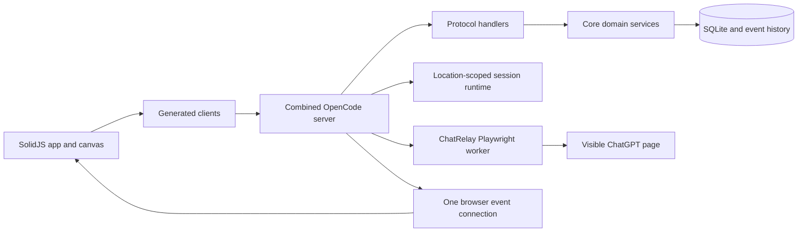

# CyberMastery Context

This document is the compact handoff for CyberMastery. Use it to orient a new
developer or coding agent before opening the detailed specifications.

## Purpose

CyberMastery is a self-hosted OpenCode fork whose primary interface is a
server-authoritative workspace canvas. A workspace combines project directories,
layouts, enabled plugins and skills, and live functionality blocks without
creating a second data authority beside OpenCode.

The product aims to make several AI and utility workflows visible at once while
preserving one durable source for shared state:

- OperatingChat and MasterAgent use native OpenCode sessions.
- ChatRelay controls a visible ChatGPT page owned by the backend.
- CtxPacks store reusable context and can be pinned, searched, attached, or
  created from selected text and messages.
- Scratchpad stores a local monologue-style stream of notes that can be copied or
  saved as CtxPacks.
- Canvas layouts arrange these functions without owning their content.

## Current design

The host owns workspaces, layouts, functionality bindings, SessionV2 history,
CtxPacks, permissions, and browser-relay page ownership. The browser renders
authoritative state and may keep drafts, camera position, display preferences,
and disposable caches.

A layout contains block identity, functionality identity, visual transform, and
revision. It does not contain session IDs, transcripts, queues, execution state,
or block-owned copies of domain data.

OperatingChat and MasterAgent are session-backed blocks. Their visible transcript
contains user-authored content. Context injected for a provider turn is stored in
private, versioned sidecars so public history remains clean and historical replay
is exact.

ChatRelay is intentionally different. It is a pseudo-block backed by a visible
ChatGPT website controlled through Playwright. The backend owns one page
incarnation per authenticated user, workspace, and ChatRelay block. Refreshing
the canvas or connecting another client joins the same page. Only explicit reset
or reinitialize replaces it. Model and effort discovery begins only when the
user chooses **Refresh options**; the subsequent browser interaction is
automated.

The CtxPack Browser opens on its pinned panel. Its search panel uses a list view
ordered by saved time, newest first. Explicit attachments are resolved and
authorized by the server rather than trusting browser-provided text. Non-trivial
OperatingChat prompts may also receive deterministic, workspace-scoped automatic
recall.

Canvas panning is a local visual transform and requires no server response.
Layout persistence occurs at mutation boundaries. Development mode shows a
rendering FPS counter at the top left. Scratchpad uses a submit-only chat layout
with copy and save-as-CtxPack actions.

## Architecture



The supported deployment boundary is the combined OpenCode server. It serves the
web application, APIs, events, and PTY connections on one origin. CyberMastery
does not add another front door, durable database, transcript store, or context
engine.

Runtime dependencies must flow in this direction:

```text
Schema -> Core and Protocol -> Server
```

Client runtime code may depend on Schema and Protocol, never Core or Server.
`sdk-next` is the composition boundary for Client, Core, and Server.

### Main packages

| Package | Responsibility |
| --- | --- |
| `packages/schema` | Shared data contracts and branded identities |
| `packages/core` | SessionV2, workspace, layout, CtxPack, context, and durable domain behavior |
| `packages/protocol` | Public HTTP contracts |
| `packages/server` | Protocol handlers, persistence wiring, ChatRelay worker integration |
| `packages/opencode` | Combined server, routing, control-plane compatibility, and synchronization |
| `packages/client` | Generated Promise and Effect clients |
| `packages/sdk/js` | Generated legacy JavaScript SDK |
| `packages/app` | SolidJS browser application and workspace canvas |
| `packages/desktop` | Electron packaging |
| `packages/tui` | Terminal client |

## Runtime flows

### Canvas and layout

1. The app loads a workspace and its server-selected layout.
2. `workspace.tsx` renders the canvas and delegates block runtime resolution.
3. `manager.ts` owns camera and block interaction state.
4. Block Runtime v3 resolves the registered functionality and renders its view.
5. Editing writes layout changes through to the host and reconciles revisions.
6. Runtime events invalidate affected data through the shared event router.

### OperatingChat prompt

1. The block resolves its server-owned FunctionalityInstance and SessionV2
   binding.
2. The shared prompt editor submits one message identity with queue or steer
   delivery semantics.
3. Core admits the prompt durably before waking execution.
4. Explicit CtxPacks are validated first; eligible automatic recall fills the
   remaining policy budget.
5. The clean user message enters public history while exact provider-facing text
   enters a private input sidecar.
6. The process-local Session drain loads Location-scoped provider, tool,
   permission, and filesystem services and makes one provider stream call per
   turn.

### Private context continuity

Public EventV2 history cannot reproduce private provider context by itself.
Session projection transfer therefore carries validated input sidecars,
compaction sidecars, and the same-workspace Context Epoch through bounded,
authenticated sync pages. Global sync events are wake hints; versioned history
pulls remain authoritative. Workspace removal and Session workspace movement
currently reject before side effects.

### ChatRelay

1. Settings opens a normal browser for a persistent ChatGPT login profile.
2. The user closes that login browser before the controlled worker opens it.
3. The first relay read acquires or joins the backend-owned page.
4. Prompt requests carry typed text plus validated CtxPack and skill references.
5. The server resolves and budgets the references, then the worker submits the
   visible ChatGPT composer exactly once for a prompt ID.
6. The worker reads the visible response and streams it to every client joined to
   that block page.
7. Refresh options inspects the visible model menu and effort control without
   changing them.

## Source-code map

Start with these files rather than searching the whole monorepo.

### Canvas and shared UI

- `packages/app/src/pages/canvas/workspace.tsx` — canvas composition and block rendering
- `packages/app/src/pages/canvas/manager.ts` — camera, panning, moving, resizing, and persistence coordination
- `packages/app/src/pages/canvas/runtime/contracts.ts` — Block Runtime v3 contracts
- `packages/app/src/pages/canvas/runtime/block-runtime-host.tsx` — runtime host
- `packages/app/src/pages/canvas/runtime/event-router.ts` — shared event invalidation
- `packages/app/src/pages/canvas/runtime/registrations/operating-chat.ts` — OperatingChat registration
- `packages/app/src/pages/canvas/runtime/registrations/static-blocks.ts` — static block registrations
- `packages/app/src/pages/canvas/scratchpad.tsx` — monologue scratchpad
- `packages/app/src/pages/canvas/fps.tsx` — development FPS display
- `packages/session-ui/src/v2/components/prompt-input/index.tsx` — shared chat editor
- `packages/app/src/context/server-sdk.tsx` — browser SDK and event connection

### CtxPack

- `packages/app/src/pages/canvas/blocks/ctxpack-browser/index.tsx` — pinned and search panels
- `packages/app/src/pages/canvas/blocks/ctxpack-browser/adapter.ts` — browser data adapter
- `packages/app/src/context/ctxpack/sdk-facade.ts` — client API boundary
- `packages/core/src/ctxpack/service.ts` — durable CtxPack operations
- `packages/core/src/ctxpack/search.ts` — search behavior
- `packages/core/src/ctxpack/recall.ts` — automatic recall policy
- `packages/schema/src/ctxpack.ts` — shared schema
- `packages/protocol/src/groups/ctxpack.ts` — HTTP contract
- `packages/server/src/handlers/ctxpack.ts` — server handler

### Workspace and native sessions

- `packages/schema/src/workspace.ts` — workspace, layout, and functionality schemas
- `packages/core/src/workspace/service.ts` — workspace authority
- `packages/core/src/workspace/functionality-instance.ts` — durable block/functionality binding
- `packages/core/src/workspace/operating-chat-session.ts` — OperatingChat binding
- `packages/core/src/workspace/master-agent.ts` — MasterAgent behavior
- `packages/core/src/session/input.ts` — durable prompt admission and sidecars
- `packages/core/src/session/context-epoch.ts` — Context Epoch persistence
- `packages/core/src/session/projection-transfer.ts` — private projection export and restore
- `packages/server/src/handlers/workspace.ts` — workspace HTTP handlers

### ChatRelay

- `packages/app/src/pages/canvas/blocks/chat-relay/runtime.ts` — block runtime adapter
- `packages/app/src/pages/canvas/blocks/chat-relay/view.tsx` — block view and lifecycle
- `packages/app/src/pages/canvas/blocks/chat-relay/composer.tsx` — shared prompt editor integration
- `packages/schema/src/chat-proxy.ts` — relay request and response schemas
- `packages/protocol/src/groups/chat-proxy.ts` — relay API contract
- `packages/server/src/handlers/chat-proxy.ts` — authorization and handler boundary
- `packages/server/src/chat-proxy.ts` — worker client and lifecycle
- `packages/server/src/chat-proxy-worker.mjs` — Playwright browser worker

### Control plane and synchronization

- `packages/opencode/src/control-plane/workspace.ts` — legacy/control-plane workspace coordination
- `packages/opencode/src/control-plane/session-context-readiness.ts` — peer readiness proof
- `packages/opencode/src/control-plane/session-context-transfer-spool.ts` — bounded transfer spool
- `packages/opencode/src/server/routes/instance/httpapi/server.ts` — combined server composition
- `packages/opencode/src/server/routes/instance/httpapi/handlers/sync.ts` — public/private sync routes
- `packages/opencode/src/server/routes/instance/httpapi/middleware/workspace-routing.ts` — local and remote routing

Generated code under `packages/client/src/generated*` and
`packages/sdk/js/src/v2/gen` must not be edited directly.

## Non-negotiable invariants

- Admit a SessionV2 prompt durably before scheduling execution.
- Keep queue and steer explicit.
- Make exactly one `llm.stream(request)` call per provider turn.
- Keep Session execution process-global and Session-ID based.
- Keep provider, tool, permission, and filesystem services Location-scoped.
- Keep public transcripts clean; private recalled context belongs in sidecars.
- Reuse stored sidecars on exact retry; never repeat automatic recall.
- Treat explicit workspace identity as Location metadata unless a registered
  remote plan is actually resolved.
- Keep one browser event connection per active OpenCode connection context.
- Keep layout JSON free of sessions and runtime state.
- Keep ChatRelay page ownership in the backend.
- Never trust client-provided CtxPack content or skill bodies.

## Development and verification

The repository requires Bun 1.3.14. From the repository root:

```powershell
bun install
bun run dev:backend
bun run dev:web
```

`dev-servers.ps1` currently hardcodes `D:\CyberMastery`; update that value before
using the script from the `D:\OpencodeDev` checkout.

Run tests and type checks from the affected package, never from the repository
root and never with `tsc` directly:

```powershell
cd packages/app
bun typecheck
bun run test

cd ../opencode
bun typecheck
bun test <specific-test-file>

cd ../core
bun typecheck
bun test <specific-test-file>
```

After changing public Protocol or Server `HttpApi`:

```powershell
cd packages/client
bun run generate
```

Regenerate the legacy JavaScript SDK from the repository root:

```powershell
bun packages/sdk/js/script/build.ts
```

## Current repository state

- Remote: `git@github.com:zhijianfan/cybermastery.git`
- Active integration branch: `feature/CyberMaster`
- Current verified commit: `25fa5f3b77e7ca3c2b0d9266a0eb7e575a19151f`
- Latest work: private Session context transfer, consistent skill mentions,
  pinned/searchable CtxPack Browser panels, canvas stabilization, scratchpad and
  FPS display, and backend-owned ChatRelay pages.
- Relevant App, Core, Server, OpenCode, SDK, and TUI type checks passed at this
  commit. Focused SDK, sync, workspace routing, and workspace API suites passed.
- The repository-wide push hook still encounters a pre-existing
  `packages/cli/src/index.ts` Effect service type mismatch.

The upstream default branch is `dev`; use `dev` or `origin/dev` for comparisons.
New branches use at most three hyphen-separated words without slash prefixes.
Commit messages use `type(scope): summary`.

## Documentation priority

Read `AGENTS.md` and the nearest package-local `AGENTS.md` before editing.
Current design references are:

1. `CONTEXT.md` for Session and context vocabulary and invariants.
2. `specs/workspace-canvas/requirements.md` for product requirements.
3. `specs/workspace-canvas/architecture.md` for canvas architecture.
4. `specs/relay/architecture.md` for the adopted ChatRelay browser relay.
5. `specs/workspace-canvas/superpowers-integration.md` for Superpowers behavior.

`specs/backend/cybermaster-host-manager-future-plan.md` contains an older
SessionV2 ChatRelay direction that conflicts with the adopted relay specification
and current source. For ChatRelay work, prefer `specs/relay/architecture.md` and
the implementation listed above.

## Compacted source header

This header-style digest transcribes the current implementation into one compact
interface. It is documentation rather than a build input. Names, ownership,
state transitions, and invariants correspond to the source paths cited in comments;
generated clients, UI markup, selectors, and mechanical adapters are omitted.

```cpp
#pragma once

// CyberMastery implementation digest
// Base commit: 25fa5f3b77e7ca3c2b0d9266a0eb7e575a19151f
// Includes the current uncommitted worktree changes described below.

#include <cstdint>
#include <functional>
#include <map>
#include <optional>
#include <string>
#include <vector>

namespace CyberMastery {

using ID = std::string;
using Json = std::string;
using Timestamp = std::int64_t;

template <class T>
struct Result;

// packages/schema/src/workspace.ts
namespace Workspace {

struct ModelSelection {
  ID providerID;
  ID modelID;
  std::optional<ID> variant;

  static std::string Encode(const ModelSelection& value);
  static std::optional<ModelSelection> Decode(const std::string& value);
};

struct BlockTransform {
  int x;
  int y;
  int w;  // positive
  int h;  // positive
  int z;
};

struct BlockRecord {
  ID id;
  ID functionality;
  BlockTransform transform;
};

enum class DeviceClass { Desktop, Mobile, Tablet };

struct LayoutTuple {
  ID user;
  ID style;
  DeviceClass deviceClass;
};

struct LayoutInfo {
  ID id;
  ID workspaceID;
  std::uint64_t revision;
  std::vector<BlockRecord> blocks;
};

struct FunctionalityInfo {
  ID id;
  enum class Kind { Builtin, Plugin } kind;
  std::string label;
  std::optional<std::string> icon;
  int minW;
  int minH;
  std::optional<int> maxW;
  std::optional<int> maxH;
};

}  // namespace Workspace

// packages/app/src/pages/canvas/fps.tsx
// packages/app/src/pages/canvas/workspace.tsx
namespace Canvas {

struct Point {
  double x;
  double y;
};

struct Camera {
  double x;
  double y;
  double scale;
};

struct PointerEvent {
  int pointerID;
  double clientX;
  double clientY;
  int button;
  enum class Type { Mouse, Touch, Pen } type;
};

struct PanSession {
  Point start;
  Camera camera;       // frozen gesture-start snapshot
  bool moved;
  double startTime;
};

inline Camera SnapshotCamera(const Camera& camera) {
  return Camera{camera.x, camera.y, camera.scale};
}

inline Camera PanCameraFree(const Camera& base, const Point& displacement) {
  return Camera{base.x + displacement.x, base.y + displacement.y, base.scale};
}

class FpsReadout {
 public:
  void OnAnimationFrame(double now) {
    ++frames_;
    if (now - sampleStart_ < 500.0) return;
    fps_ = static_cast<int>(frames_ * 1000.0 / (now - sampleStart_));
    sampleStart_ = now;
    frames_ = 0;
  }

  void OnVisibilityChange(bool hidden);
  std::optional<int> Value() const { return fps_; }

 private:
  double sampleStart_ = 0;
  int frames_ = 0;
  std::optional<int> fps_;
};

class WorkspaceController {
 public:
  void BeginPan(const PointerEvent& event) {
    CapturePointer(event.pointerID);
    pointers_[event.pointerID] = Point{event.clientX, event.clientY};
    if (pointers_.size() != 1) return BeginPinch();
    pan_ = PanSession{
      Point{event.clientX, event.clientY},
      SnapshotCamera(camera_),
      false,
      PerformanceNow(),
    };
  }

  void OnPointerMove(const PointerEvent& event) {
    if (interaction_) return MoveOrResizeBlockDirect(event);
    if (!pointers_.contains(event.pointerID)) return;

    pointers_[event.pointerID] = Point{event.clientX, event.clientY};
    if (pointers_.size() >= 2) return UpdatePinch();
    if (!pan_) return;

    const Point current{event.clientX, event.clientY};
    if (!pan_->moved && Distance(current, pan_->start) > 8.0) pan_->moved = true;

    // The browser already samples pointermove at frame cadence. Writing the
    // camera immediately avoids a second coalescing delay and needs no server.
    camera_ = PanCameraFree(
      pan_->camera,
      Point{current.x - pan_->start.x, current.y - pan_->start.y}
    );
    RecordDevPanSample(camera_);
  }

  void EndPan(const PointerEvent& event) {
    pointers_.erase(event.pointerID);
    if (pointers_.empty()) {
      FlushDevPanSamples();
      pan_.reset();
      pinchActive_ = false;
      return;
    }
    if (pointers_.size() == 1 && pinchActive_) {
      pan_ = PanSession{pointers_.begin()->second, SnapshotCamera(camera_), true, PerformanceNow()};
      pinchActive_ = false;
    }
  }

  // Block motion updates store state and DOM transforms locally. Persistence
  // is debounced through the canvas manager after interaction completes.
  void MoveOrResizeBlockDirect(const PointerEvent& event);

 private:
  void CapturePointer(int pointerID);
  void BeginPinch();
  void UpdatePinch();
  void RecordDevPanSample(const Camera& camera);
  void FlushDevPanSamples();
  static double Distance(const Point& a, const Point& b);
  static double PerformanceNow();

  Camera camera_{};
  std::map<int, Point> pointers_;
  std::optional<PanSession> pan_;
  bool pinchActive_ = false;
  bool interaction_ = false;
};

}  // namespace Canvas

// packages/app/src/pages/canvas/blocks/ctxpack-browser/index.tsx
// packages/app/src/pages/canvas/blocks/ctxpack-browser/adapter.ts
// packages/schema/src/ctxpack-limits.ts
// packages/core/src/ctxpack/validation.ts
// packages/core/src/ctxpack/service.ts
namespace CtxPack {

struct Limits {
  static constexpr int MaximumFragments = 32;
  static constexpr int MaximumFragmentBytes = 16 * 1024;
  static constexpr int MaximumPackBytes = 64 * 1024;
  static constexpr int MaximumPackEstimatedTokens = 16 * 1024;
};

struct FragmentInput {
  ID clientFragmentID;
  std::string text;
  ID source;
};

// Core normalizes each input and slices it on UTF-8 code-point boundaries.
// Concatenating the stored slices reproduces the normalized input exactly.
std::vector<FragmentInput> SliceForStorage(const FragmentInput& input);

enum class BrowserPanel { Pinned, Search };
enum class Sort {
  CreatedDescending,
  CreatedAscending,
  UpdatedDescending,
  TitleAscending,
  TokensDescending,
  MostAttached,
  RecentlyAttached,
};

struct Query {
  std::string text;
  Sort sort = Sort::CreatedDescending;
  std::optional<std::string> keyword;
  std::optional<ID> sourceBlockID;
  std::optional<ID> sourceFunctionalityID;
  bool includeDeleted = false;
  std::optional<std::string> cursor;
};

struct Summary {
  ID id;
  std::string title;
  Timestamp createdAt;
  Timestamp updatedAt;
  bool pinned;
};

class BrowserBlock {
 public:
  static constexpr int SearchDebounceMilliseconds = 200;

  BrowserPanel ActivePanel() const { return panel_; }
  void SelectPanel(BrowserPanel panel) { panel_ = panel; }
  void Search(std::string text);                 // resets search cursor after debounce
  void SetQuery(const Query& patch);             // resets cursor
  void LoadMoreSearch();                         // independent paging state
  void LoadMorePinned();                         // independent paging state
  void Select(ID ctxPackID);
  void Pin(ID ctxPackID, bool pinned);
  void AttachToFocusedInput(ID ctxPackID);

  std::vector<Summary> PinnedItems() const {
    auto items = pinnedItems_;
    SortNewestCreatedFirst(items);
    return items;
  }

 private:
  static void SortNewestCreatedFirst(std::vector<Summary>& items);

  BrowserPanel panel_ = BrowserPanel::Pinned;
  Query query_{};
  std::vector<Summary> searchItems_;
  std::vector<Summary> pinnedItems_;
  bool searchPaging_ = false;
  bool pinnedPaging_ = false;
};

}  // namespace CtxPack

// packages/server/src/chat-proxy-worker.mjs
// packages/server/src/handlers/chat-proxy.ts
namespace ChatRelay {

enum class Status { Opening, Idle, Thinking, Error, Closed, Unavailable };

struct Message {
  ID id;
  enum class Role { User, Assistant } role;
  std::string text;
  Timestamp createdAt;
};

struct Controls {
  std::optional<ID> model;
  std::optional<ID> effort;
  std::vector<ID> models;
  std::vector<ID> efforts;
  std::optional<std::string> error;
};

struct TabState {
  ID providerID = "chatgpt";
  ID workspaceID;
  ID blockID;
  ID tabID;
  Status status = Status::Opening;
  std::vector<Message> messages;
  std::map<ID, std::string> admittedRequestIdentity;
  std::optional<Controls> controls;
  std::optional<std::string> error;
  PageHandle page;
};

inline std::string SessionKey(const ID& userID) {
  return "chatgpt:" + userID;
}

inline std::string OwnerKey(const ID& workspaceID, const ID& blockID) {
  return JsonArray({workspaceID, blockID});
}

class Worker {
 public:
  Snapshot Ensure(const ID& userID, const ID& workspaceID, const ID& blockID) {
    return Relay(userID, workspaceID, blockID);
  }

  Snapshot Relay(const ID& userID, const ID& workspaceID, const ID& blockID) {
    auto* session = FindLiveSession(SessionKey(userID));
    auto* retained = FindOwnedTab(SessionKey(userID), OwnerKey(workspaceID, blockID));
    if (!session) return retained ? SnapshotOf(*retained) : Unavailable(userID, workspaceID, blockID);

    return SerializeOwnerOperation(*session, OwnerKey(workspaceID, blockID), [&] {
      auto* state = session->FindTab(OwnerKey(workspaceID, blockID));
      if (!state) return SnapshotOf(CreateTab(*session, workspaceID, blockID));
      if (state->page.IsClosed()) MarkClosedPageError(*state);
      RefreshTab(*state);
      return SnapshotOf(*state);
    });
  }

  Snapshot Reset(
    const ID& userID,
    const ID& workspaceID,
    const ID& blockID,
    const ID& expectedTabID
  ) {
    auto& session = RequireLiveSession(SessionKey(userID));
    return SerializeOwnerOperation(session, OwnerKey(workspaceID, blockID), [&] {
      auto* current = session.FindTab(OwnerKey(workspaceID, blockID));
      if (current && current->tabID != expectedTabID) throw StaleTab{};
      if (current) CloseState(*current);
      return SnapshotOf(CreateTab(session, workspaceID, blockID));
    });
  }

  Snapshot Prompt(
    const ID& userID,
    const ID& workspaceID,
    const ID& blockID,
    const ID& tabID,
    const ID& messageID,
    const std::string& text,
    const std::string& requestIdentity
  );

  // Options are read only after a manual refresh request. Configure applies
  // model/effort, reads controls again, and verifies the selected values.
  Controls RefreshOptions(const ID& userID, const ID& workspaceID, const ID& blockID, const ID& tabID);
  Controls Configure(
    const ID& userID,
    const ID& workspaceID,
    const ID& blockID,
    const ID& tabID,
    std::optional<ID> model,
    std::optional<ID> effort
  );

  void CloseBlock(const ID& userID, const ID& workspaceID, const ID& blockID);
  void CloseWorkspace(const ID& userID, const ID& workspaceID);

 private:
  TabState& CreateTab(Session& session, const ID& workspaceID, const ID& blockID) {
    TabState state;
    state.workspaceID = workspaceID;
    state.blockID = blockID;
    state.tabID = RandomUUID();
    state.page = session.context.NewPage();
    session.tabs[OwnerKey(workspaceID, blockID)] = std::move(state);
    NavigateAndInspect(session.tabs[OwnerKey(workspaceID, blockID)]);
    return session.tabs[OwnerKey(workspaceID, blockID)];
  }

  // Ownership survives canvas reloads and frontend reconnects. A page is
  // created only when its (workspace, block) owner has no retained page.
  std::map<ID, Session> liveSessions_;
  std::map<ID, Session*> retainedOwnerships_;
};

}  // namespace ChatRelay

// packages/core/src/session/input.ts
// packages/core/src/session/context-epoch.ts
// packages/core/src/session/projection-transfer.ts
namespace SessionV2 {

enum class Delivery { Steer, Queue };

struct Prompt {
  std::string text;
};

struct ContextAttachment {
  ID ctxPackID;
};

struct AdmitRequest {
  ID messageID;
  ID sessionID;
  std::optional<ID> workspaceID;
  Prompt prompt;
  Delivery delivery;
  std::vector<ContextAttachment> attachments;
  std::optional<RequestProof> contextTransferProof;
  std::optional<Actor> actor;
};

struct AdmittedInput {
  std::uint64_t admittedSeq;
  ID messageID;
  ID sessionID;
  Prompt prompt;
  Delivery delivery;
  Timestamp createdAt;
};

class InputService {
 public:
  Result<AdmittedInput> Admit(const AdmitRequest& request) {
    const auto requestHash = ContextRequestHash(request.attachments);
    if (auto existing = FindInput(request.messageID)) {
      return ReconcileExactRetry(*existing, request, requestHash);
    }

    return readiness_.WithPermit(request, [&](TransferMode mode) {
      const auto profile = profiles_.Resolve(request.sessionID);
      const auto context = assembly_.Assemble(request, profile, mode);

      // PromptAdmitted and its private context sidecar commit atomically.
      const auto event = events_.PublishPromptAdmitted(
        request,
        context.snapshotVersion,
        [&] {
          profiles_.Revalidate(request.sessionID, profile);
          PersistContextSnapshot(request, context.snapshot);
        }
      );
      return AdmittedInput{
        event.sequence,
        request.messageID,
        request.sessionID,
        request.prompt,
        request.delivery,
        event.timestamp,
      };
    });
  }

 private:
  Result<AdmittedInput> ReconcileExactRetry(
    const InputRow& existing,
    const AdmitRequest& request,
    const ID& requestHash
  );

  TransferReadiness& readiness_;
  ContextProfiles& profiles_;
  ContextAssembly& assembly_;
  DurableEvents& events_;
};

struct PublicEventV1 {
  ID id;
  std::string type;
  std::uint64_t sequence;
  ID aggregateID;
  Json data;
};

struct ContextEnvelopeV1 {
  int version = 1;
  ID eventID;
  ID aggregateID;
  std::uint64_t sequence;
  ID messageID;
  enum class Kind { Input, Compaction } kind;
  std::uint64_t sidecarSchemaVersion;
  ID contentHash;
  Json payload;
};

struct DeletionV1 {
  int version = 1;
  ID aggregateID;
  ID targetMessageID;
  enum class TargetKind { Input, Compaction } targetKind;
  EventIdentity targetEvent;
  EventIdentity deletingEvent;
  EventIdentity boundaryEvent;
  std::optional<EventIdentity> promotionEvent;
};

struct EpochEnvelopeV1 {
  int version = 1;
  ID aggregateID;
  std::uint64_t sourceSequence;
  std::uint64_t baselineSequence;
  ID contentHash;
  Json payload;
};

struct ProjectionBundleV1 {
  int version = 1;
  ID aggregateID;
  std::uint64_t sourceSequence;
  std::vector<PublicEventV1> events;
  std::vector<ContextEnvelopeV1> contexts;
  std::vector<DeletionV1> deletions;
  std::optional<EpochEnvelopeV1> epoch;
};

class ProjectionTransfer {
 public:
  Result<ProjectionBundleV1> Export(const ID& sessionID, std::optional<std::uint64_t> after);

  Result<void> RestoreBatch(
    const ProjectionBundleV1& bundle,
    std::optional<ID> expectedWorkspaceID,
    std::optional<ID> expectedOwnerID,
    bool publish
  ) {
    ValidateBundleShape(bundle);
    const auto contexts = PrepareContexts(bundle.contexts);
    const auto epoch = PrepareEpoch(bundle.epoch);

    // Durable events and private sidecars restore in one replay transaction.
    return events_.ReplayBatch(
      bundle.events,
      expectedOwnerID,
      [&] { ValidateRelationsAndManifest(bundle, contexts, epoch); },
      [&] {
        RestoreContexts(bundle, contexts);
        RestoreEpoch(bundle, epoch, expectedWorkspaceID, expectedOwnerID);
        ValidateProjection(bundle.aggregateID);
      },
      publish
    );
  }

  bool Required(std::optional<ID> workspaceID) const;

 private:
  DurableEvents& events_;
};

}  // namespace SessionV2

// packages/opencode/src/server/shared/workspace-routing.ts
// packages/opencode/src/server/routes/instance/httpapi/middleware/workspace-routing.ts
namespace Routing {

enum class RequestPlanKind { InvalidWorkspace, MissingWorkspace, Remote, Local };

struct RequestPlan {
  RequestPlanKind kind;
  std::optional<ID> workspaceID;
  std::optional<std::string> remoteTarget;
};

class WorkspaceRoutingMiddleware {
 public:
  HttpResponse RoutePrompt(const HttpRequest& request, const HttpEffect& localEffect) {
    const auto sessionID = GetWorkspaceRouteSessionID(request.url);
    if (!sessionID.has_value() || !EndsWith(request.url.path, "/prompt")) {
      return localEffect(request);
    }

    const auto session = sessionID->empty() ? std::nullopt : FindSession(*sessionID);
    const auto plan = PlanRequest(request, session);
    switch (plan.kind) {
      case RequestPlanKind::InvalidWorkspace:
        return JsonError(400, "Invalid workspace query parameter");
      case RequestPlanKind::MissingWorkspace:
        return MissingWorkspace(plan.workspaceID);
      case RequestPlanKind::Remote:
        return ProxyRemote(request, plan, CurrentTransferProof(plan.workspaceID));
      case RequestPlanKind::Local:
        return localEffect(PromptRequest(request, plan.workspaceID));
    }
    return JsonError(500, "Unreachable routing plan");
  }

 private:
  HttpRequest PromptRequest(HttpRequest request, std::optional<ID> workspaceID) {
    request.headers.erase("x-opencode-context-topology");
    request.headers.erase("x-opencode-context-lease");
    if (const auto proof = CurrentTransferProof(workspaceID)) {
      request.headers["x-opencode-context-topology"] = proof->topologyRevision;
      request.headers["x-opencode-context-lease"] = proof->requestToken;
    }
    return request;
  }
};

}  // namespace Routing
}  // namespace CyberMastery
```

---

## Compacted source update — b7c82166e (2026-09-22)

This delta extends the compacted source header above. The previous header used
base commit `25fa5f3b7`; the areas below are new or changed since then
(ChatRelay file attachments, consistent skill mentions, draft blob persistence,
private-context transfer readiness/spool). Read the cited source paths before
editing; names and ownership are authoritative, markup and adapters are omitted.

```cpp
#pragma once

// CyberMastery compacted source update
// Base commit: b7c82166e (2026-09-20)
// Covers: ChatRelay file attachments, skill selection and mentions,
// IndexedDB draft blob persistence, context readiness and transfer spool.

#include <cstdint>
#include <functional>
#include <map>
#include <optional>
#include <string>
#include <vector>

namespace CyberMastery::Update {

using ID = std::string;
using Timestamp = std::int64_t;

// packages/schema/src/chat-proxy.ts
namespace ChatProxySchema {

struct PromptPayload {
  ID tabID;
  ID messageID;
  std::string text;
  std::optional<std::vector<FileAttachment>> files;       // base64 data URIs only
  std::optional<ContextAttachments> contextAttachments;   // SessionInput sidecars
  std::optional<std::vector<SkillSelection>> skills;      // name + content hash
};

}  // namespace ChatProxySchema

// packages/server/src/handlers/chat-proxy.ts
namespace ChatProxyHandler {

// A file attachment is valid only as a base64 data URI whose MIME matches the
// declared mime exactly; anything else fails closed with kind
// "chat_proxy_file_attachment". Prompt admission requires at least one of
// files / contextAttachments / skills, and file URI hashes plus names are
// resolved server-side before the worker sees them.
bool ValidFileAttachment(const FileAttachment& file);   // /^data:([^;,]+);base64,(.*)$/
Error InvalidFileAttachment();
Result<Relay> Prompt(const PromptPayload& payload);

}  // namespace ChatProxyHandler

// packages/server/src/chat-proxy-worker.mjs
namespace ChatRelayWorkerFiles {

// Uploads go through the visible page's input#upload-files[type="file"].
// pendingUploadNames tracks names that were selected but not yet consumed, so a
// failed or superseded prompt can be cleaned before the next attempt.
struct UploadState {
  std::vector<std::string> pendingUploadNames;
};

// One upload per prompt ID. After setInputFiles the worker verifies ChatGPT
// acknowledged the upload and that the visible attachment names match the
// request exactly; otherwise it clears attachments and fails the prompt
// ("ChatGPT file upload was not acknowledged" / "attachments do not match").
Result<void> UploadAttachments(Form form, const std::vector<File>& files);
std::vector<std::string> SelectedUploadNames(FileInput input);
void ClearAttachments(Form form, FileInput input, const std::vector<std::string>& names);

}  // namespace ChatRelayWorkerFiles

// packages/app/src/utils/draft-store.ts
namespace DraftStore {

struct BlobReference { ID id; std::string url; };

// IndexedDB "opencode-drafts" with two stores (documents, blobs). Blob IDs are
// SHA-256 content digests; object URLs are memoized per ID. Encoding replaces
// inline data URLs and legacy blob ids with persisted blob references.
// Decoding rehydrates a blob only when the stored value passes a cross-realm
// API check; corrupt records degrade to { id } instead of throwing. On open,
// blob records no longer referenced by any document are swept.
class Store {
 public:
  std::string GetItem(const std::string& key);
  void SetItem(const std::string& key, const std::string& value);  // versioned writes
  void RemoveItem(const std::string& key);
  BlobReference PutBlob(const Blob& blob);
};

}  // namespace DraftStore

// packages/app/src/pages/canvas/blocks/chat-relay/composer.tsx
namespace ChatRelayComposer {

struct DraftState {
  PromptInputV2Prompt prompt;
  int revision;
  std::optional<ID> messageID;                       // stable retry identity
  std::optional<std::map<ID, ID>> verifiedSkills;    // name -> contentHash
  bool validateSkills;
};

class Block {
 public:
  // The server skill catalog loads lazily when the mention popover opens or when
  // the persisted draft already contains skill parts. Verified hashes backfill
  // missing hashes; on load error validation is disabled and the prompt can
  // still submit.
  void VerifySkills();
  // Ready only when: relay idle, no pending ctxpack attachments, selected
  // skills all verified, and either editor content or files exist.
  bool Ready() const;
  // Submits one messageID with text, files, skills, and admitted context
  // attachments; revision increments only when the prompt (not context) changes.
  void Submit();
  void OpenSkillPreview(const SkillPart& skill);   // server-rendered content dialog
 private:
  DraftStore& drafts_;             // platform.draftStore blob persistence
  AttachmentStore attachments_;    // CtxPack drop target + materialize facade
};

}  // namespace ChatRelayComposer

// packages/core/src/skill/selection.ts
namespace SkillSelection {

// Permission-filtered catalog for one agent policy: only "allow", plus "ask"
// when allowAsk is set. Candidates carry sha256(content) as contentHash.
Result<std::vector<Candidate>> Candidates(Policy policy);

// A selection is valid only when the named skill still exists with the same
// content hash; otherwise UnavailableError ("A selected skill changed or is
// unavailable. Remove it and select it again.").
Result<std::vector<Preview>> Resolve(std::vector<Selection> selections, Policy policy);

}  // namespace SkillSelection

// packages/app/src/components/prompt-input/mention-candidates.ts
namespace MentionCandidates {

std::vector<Suggestion> ContextMentionCandidates(
  /* references, agents, resources, skills, recent files */);
std::vector<Suggestion> SkillMentionCandidates(std::vector<SkillCandidate> skills);
// Suggestion kind "skill" carries name + contentHash in its mention payload.

// Catalog keyed by (identity, open): loads on demand, aborts on close, exposes
// loading/error state so the composer can gate submission.
class SkillMentionCatalog {
 public:
  std::vector<SkillCandidate> Items() const;
  bool Loading() const;
  bool Error() const;
};

}  // namespace MentionCandidates

// packages/session-ui/src/v2/components/prompt-input/types.ts
namespace PromptInputV2 {
struct SkillPart {
  std::string type = "skill";
  ID name;
  std::optional<std::string> contentHash;
};
// PromptInputV2Suggestion.kind now includes "skill"; persisted prompt state
// supports skill parts alongside text/file/agent parts and image attachments.
}

// packages/opencode/src/control-plane/session-context-readiness.ts
namespace ContextReadiness {
const char* TOPOLOGY_HEADER = "x-opencode-session-context-topology";
const char* LEASE_HEADER = "x-opencode-session-context-lease";

std::optional<Proof> CurrentProof(std::optional<WorkspaceID> workspaceID);
// Coordinator service + node gate private transfer on a peer readiness proof.
// Redirect targets are validated (PrivateRedirectError) before private
// transport executes (PrivateTransportError).
}

// packages/opencode/src/control-plane/session-context-transfer-spool.ts
namespace TransferSpool {
constexpr int MAX_SYNC_PAGE_BYTES = 512 * 1024;
constexpr int MAX_SYNC_PUBLIC_EVENTS = 256;
constexpr int MAX_SYNC_RECORD_CHUNKS = 64;
constexpr int MAX_ACTIVE_TRANSFERS = 8;
constexpr std::int64_t MAX_TRANSFER_BYTES = 512LL * 1024 * 1024;
constexpr std::int64_t MAX_TOTAL_SPOOL_BYTES = 1024LL * 1024 * 1024;
constexpr std::int64_t TRANSFER_IDLE_TTL = 5 * 60 * 1000;
constexpr std::int64_t TRANSFER_ABSOLUTE_TTL = 30 * 60 * 1000;

// Sync records are event | context | deletion | epoch. Typed failures:
// SyncTransferConflict, SyncTransferBusy, SyncTransferTooLarge,
// SyncTransferExpired. privateManifest + manifestDigest authenticate pages.
}

}  // namespace CyberMastery::Update
```

---

## Architecture and status summary — 2026-09-22

This section supersedes the "Current repository state" verification block above
(which recorded `25fa5f3b7` and a failing CLI push hook). The current verified
state is:

- Branch `feature/CyberMaster` @ `b7c82166e` (2026-09-20), fast-forwarded from
  `25fa5f3b7`; upstream base `anomalyco/dev` @ `b02acc1e3` (2026-09-17) merged
  via `ead1a67bd`.
- 146 custom commits on top of upstream; custom diff spans app, core, schema,
  protocol, server, opencode, client/SDK, session-ui, ui, specs, devplan.

### What is built on top of upstream (status)

- **Workspace canvas + Block Runtime v3** — host-authoritative layouts and
  functionality instances, four render modes, single event transport, layout
  purity. Implemented and verified.
- **OperatingChat** — SessionV2-backed block; host-side steer/queue; private
  input sidecars; explicit CtxPack attach plus bounded auto-recall. Implemented.
- **MasterAgent** — parallel coordinator (workspace model + coder model), hidden
  `parallel-master`/`parallel-worker` agents, one-turn fan-out with settlement
  barrier. Implemented; path enforcement, durable manifests, cancellation, and
  progress cards deferred.
- **CtxPack** — central limits (32 fragments, 16 KiB/fragment, 64 KiB/pack),
  pinning, pinned/search panels, server-side validation, usage recording.
  Implemented.
- **Private context continuity** — projection-transfer bundles, bounded sync
  pages, readiness proofs, transfer spool, atomic replay. Implemented.
- **ChatRelay** — backend-owned visible ChatGPT page (Playwright), reset
  semantics, streamed responses, manual model/effort refresh, server-resolved
  CtxPack/skill references, and file attachments with draft blob persistence.
  Implemented.
- **Superpowers + skills** — pinned `vendor/superpowers` v6.3.0 submodule,
  native skill integration, composer skill mentions and previews. Implemented.
- **Scratchpad, FPS overlay, glass canvas, draft store** — implemented.

### Verification (2026-09-22)

- Typecheck pass: `packages/app` (`tsgo -b`), `packages/core`, `packages/cli`
  (pre-existing CLI mismatch fixed by `9ce92133f`), `packages/opencode` (after
  `bun install` synced `@ai-sdk/amazon-bedrock@4.0.166` and its patch).
- Tests pass: core CtxPack suites 27/27; server ChatRelay handler 19/19 (after
  `git submodule update --init vendor/superpowers`); app MasterAgent
  integration 63/63.
- Blocked: `packages/app/src/pages/canvas/blocks/ctxpack-browser/ctxpack-browser.test.tsx`
  fails to load under Bun 1.3.14 on Windows because upstream's new
  `solid-js/h` Tabs mock hits a `mock.module` linker bug (`dynamicProperty` not
  found). The same failure reproduces on the pristine upstream file, so it is
  tooling/environmental, not product logic.
- Required setup after upstream merges: `bun install`, submodule init,
  `packages/client` generate when Protocol/Server HttpApi changes, and
  test-layer reconciliation.

### Open risks

- Upstream merge debt: each anomalyco/dev merge needs dependency-patch,
  generated-client, and test-layer reconciliation.
- One browser verification path blocked by the Bun mock bug.
- Spec drift: superseded docs remain in `specs/` (workspace-environments,
  host-manager future plan, requirements §7 acceptance vs FR-23; relay
  migration task T5 planned; Functionality Runtime Platform still a draft).
- ChatRelay policy: automation of a visible ChatGPT page; usage counts against
  the workspace plan; live production-account verification is separate.
- Seven local test-stability files (timeline-stability E2E, composer focus,
  browser tests, merged test edits) are still uncommitted.

### Recommendations

1. Commit the local test-stability files after one green CI pass.
2. Document and automate the post-merge setup steps above.
3. Triage the `ctxpack-browser` harness failure (Bun upgrade or Tabs-mock
   refactor) to restore executable browser coverage.
4. Choose the next milestone: MasterAgent hardening vs. Functionality Runtime
   Platform (registry, supervisor, capability service, event hub — draft).
5. Reconcile `specs/`: mark superseded documents, fix the requirements §7
   contradiction, close or re-scope relay migration T5.

Companion documents: `CYBERMASTERY_PROJECT_REPORT.md` (role-facing report),
`specs/workspace-canvas/*`, `specs/relay/*`, `devplan/*`.
