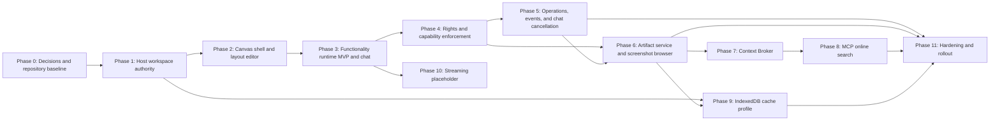

# Custom OpenCode Web Server — Implementation Plan

**Target branch:** `feature/UnrealViewer`  
**Primary stack:** TypeScript, SolidJS, Effect, Effect Schema, Drizzle/SQLite  
**Primary clients:** OpenCode web client first; TUI remains an SDK client  
**Plan status:** Proposed execution plan derived from the reviewed design documents. Reviewed 2026-08-14 — see `Alignment1.md` §Alignment2 for the validity review and residual risks.

---

## 1. Objective

Build a custom OpenCode web server and web client that make **Workspace** the product root, render server-backed functionalities as editable canvas blocks, and preserve OpenCode's existing session, agent, provider, tool, and SDK boundaries.

The target system is:

```text
Workspace
  ├── Host-owned workspace configuration
  ├── Revisioned layouts
  │     └── Block ID + functionality ID + transform only
  ├── Functionality instances
  │     └── Durable block-specific configuration
  ├── Domain services
  │     ├── Sessions / chat
  │     ├── MCP-backed online search
  │     ├── Screenshots / artifacts
  │     └── Future application streaming
  ├── Durable operations and events
  ├── Permission-filtered context capsules
  └── Optional client caches in IndexedDB
```

The implementation must preserve these governing rules:

1. The host is authoritative for workspace, layout, functionality-instance, operation, artifact, and domain state.
2. Layout JSON contains no session, queue, MCP, screenshot, file, or view state.
3. UI blocks are projections of server-owned functionality and domain state.
4. Cross-subsystem communication uses typed ports, small events, context capsules, and artifact references.
5. Large or reusable content is stored as an artifact, not embedded in events or layouts.
6. IndexedDB is a cache/local organizer layer for the web client, not the authority for shared workspace state.
7. Application-window streaming remains unavailable until a real capture and media backend is designed.

---

## 2. Source Baseline and Current State

### 2.1 Already described as implemented or landed

- Client-side workspace/environment store and workspace switcher.
- Cross-drive directory selection.
- Chat `steer` and host-side `queue` delivery behavior.
- TUI extraction into `@opencode-ai/tui`, with the SDK as its backend boundary.

### 2.2 Proposed but not yet treated as complete

- Host-owned workspace and layout persistence.
- Full-page workspace canvas and block layout editor.
- Functionality Runtime Platform.
- Functionality instances keyed by workspace and block.
- Independent `read`, `write`, and `execute` enforcement.
- Durable generic operation scheduler and workspace event hub.
- Pending chat-input cancellation.
- Artifact and screenshot domains.
- Context Broker.
- MCP search provider block.
- IndexedDB organizer/cache integration.
- Application-window streaming backend.

### 2.3 Mandatory repository verification

Before implementation, verify each claimed status against the current branch rather than relying solely on the design documents. Record each item as one of:

```text
implemented
partially implemented
proposed only
obsolete
blocked by another change
```

The verification output becomes `devplan/workspace-canvas/implementation-status.md` and is updated at every release checkpoint.

---

## 3. Delivery Strategy

Deliver the system in four releases rather than attempting the entire platform at once.

| Release | Scope | User-visible result |
|---|---|---|
| **R1 — Workspace Canvas MVP** | Host workspace storage, layout API, canvas shell, functionality runtime minimum, chat block | A user opens a host-stored workspace and arranges a persistent chat block on a canvas |
| **R2 — Secure Runtime** | Rights, capability grants, durable operations, event cursors, chat cancellation | Blocks use a consistent server-enforced runtime and long-running work survives UI lifecycle changes |
| **R3 — Artifact Workflows** | Artifact service, screenshot browser, context broker, MCP online search | Screenshots and search results can be browsed and attached to chat by reference |
| **R4 — Offline and Scale Hardening** | IndexedDB cache profile, quota management, performance/security hardening, rollout | Faster reloads, bounded bandwidth, reliable recovery, and production readiness |

The full IndexedDB organizer, application streaming, sandboxed third-party plugins, and collaborative layout editing are separate post-R4 programs.

---

## 4. Dependency Graph



Parallelism is permitted only after shared schemas and ownership boundaries have stabilized. In particular, do not independently invent artifact, operation, or event types in feature branches.

---

# 5. Phase 0 — Freeze Decisions and Establish the Baseline

## Goal

Resolve the design ambiguities that would otherwise cause schema churn or competing implementations.

## Work items

### 0.1 Repository inventory

- Locate existing workspace, environment, session-delivery, event, artifact, plugin, and SDK code.
- Confirm which paths in the architecture documents still match the monorepo.
- Identify any current server event transport that can satisfy workspace cursors and reconnect.
- Confirm whether the existing artifact/file mechanisms can store screenshots and search-result payloads.
- Confirm the current authentication identity available to self-hosted and account deployments.

### 0.2 Architecture decisions

Create short ADRs for:

1. **Workspace versus Project**
   - Workspace is the product root.
   - Existing `projectID` APIs remain compatibility/domain APIs during migration.
   - A directory-to-project adapter is used where existing session APIs still require project scope.

2. **Environment versus Style**
   - `environment`: workspace preset and functionality availability.
   - `style`: visual/density/layout preference used in layout resolution.
   - Do not use the two names interchangeably.

3. **Layout tuple**
   - Required: `(workspace, user, style, deviceClass)`.
   - Optional `deviceID` is deferred unless a concrete per-machine restore requirement is approved.

4. **Identity**
   - Self-host: authenticated username.
   - Account deployment: account user ID.
   - Local anonymous mode: reserved single-user identity such as `default`.

5. **Functionality instance retention**
   - Proposed v1 default: soft-archive on block deletion for 30 days, unless the instance has durable domain references.
   - Re-adding a new block creates a new instance; explicit restore is a separate command.

6. **Artifact authority**
   - Host Artifact Service is authoritative.
   - Client IndexedDB caches are disposable and permission-aware.

7. **Event transport**
   - Prefer the existing durable event mechanism if it supports workspace scope and cursors.
   - Otherwise implement one workspace-scoped SSE connection with cursor resume.

8. **Plugin trust classes**
   - Built-in.
   - Trusted in-process plugin.
   - Sandboxed plugin, deferred.
   - Disabled/unavailable plugin.

9. **Search-provider precedence**
   - Block instance selection.
   - Explicit workspace default.
   - No implicit provider fallback.

10. **Workspace naming collision**
    - The existing git-worktree sidebar concept ("workspaces") is renamed/disambiguated in UI copy before rollout; internal APIs are not renamed as part of this plan.

### 0.3 Architecture conformance tests

Add tests that fail if:

- Layout schemas gain arbitrary configuration or content fields.
- A renderer receives a raw unrestricted SDK client instead of `BlockBridge`.
- A functionality handler writes another domain's tables directly.
- Event payloads exceed the configured limit without artifact references.
- Browser code imports server repositories or secret-bearing MCP configuration.

## Deliverables

- `implementation-status.md`
- ADR set
- Updated terminology glossary
- Dependency map tied to current package paths
- Initial issue/epic breakdown

## Exit gate

No unresolved decision may alter the primary keys or ownership of workspace, layout, functionality instance, operation, event, or artifact records.

---

# 6. Phase 1 — Move Workspace and Layout Authority to the Host

## Goal

Replace client-owned durable workspace state with host-owned storage while keeping client persistence as a read cache and migration source.

## Server implementation

### 1.1 Schema

Add or stabilize:

```ts
Workspace.ID
Workspace.Info
Block.Record
Block.Transform
Layout.Info
Layout.Tuple
LayoutOption
Functionality.ID
```

Enforce:

- Namespaced functionality IDs.
- Non-negative integer transforms.
- Revisioned layouts.
- No content state in layout records.
- Payload size limits.

### 1.2 Database migrations

Implement the documented tables:

```text
workspace
workspace_git
layout
layout_option
```

Add indexes for:

- workspace by user
- layout by workspace
- layout option by workspace/user/style/device class
- git snapshot by workspace/directory

Keep migration steps additive and restart-safe.

### 1.3 Core services

Implement `Workspace.Service`:

```text
list
get
create
rename
remove
duplicate
activate or resolve active
update directories/plugins/skills/git
layout.get
layout.save
functionality.list
```

Rules:

- `layout.get` resolves tuple precedence and lazily creates the default full-panel chat layout.
- `layout.save` requires the expected revision.
- A revision conflict returns a typed error; it does not silently overwrite.
- Functionality references are revalidated against workspace enablement on every save.

### 1.4 Protocol, handlers, and SDK

Add the workspace group through the existing:

```text
Schema -> Core -> Protocol -> Server -> generated SDK
```

Keep handlers thin. Regenerate and test Promise and Effect clients.

## Client migration

### 1.5 One-time migration from `Persist.global`

The server cannot directly read browser-local workspace data. Implement a client migration:

```text
Detect workspaces.v1
  -> fetch host workspace list
  -> create missing host workspaces
  -> map local IDs to server IDs
  -> preserve active workspace selection
  -> write migration marker
  -> retain local data as rollback backup for one release
```

The migration must be:

- idempotent
- user-visible on failure
- non-destructive
- safe when the server already contains workspaces

### 1.6 Client store transition

Change the existing workspace context into a projection of host state:

- Initial hydration from `workspace.list/get`.
- Mutations call server APIs.
- Local persistence stores only cached response, last active ID, and migration metadata.
- Offline workspace changes fail explicitly.

## Tests

- CRUD and duplicate.
- Identity scoping.
- Default-layout creation.
- Tuple fallback resolution.
- Optimistic revision conflict.
- Unknown functionality rejection.
- Restart persistence.
- Browser-local migration retry and rollback.

## Bandwidth gate

- Layout payload remains under the documented `<10 KB for 100 blocks` target.
- Support conditional layout loading by revision or ETag.
- Workspace bootstrap excludes large domain content and artifacts.

## Exit gate

A fresh browser can log in, list host workspaces, load one workspace and its resolved layout, restart the host, and recover the same state without relying on browser local storage.

---

# 7. Phase 2 — Build the Workspace Canvas and Layout Editor

## Goal

Replace the current home/session shell with the workspace top bar and one full-page block canvas behind a feature flag.

## Work items

### 2.1 Shell and top bar

Implement:

- Left: workspace switcher, editable name, environment/style selector, edit-mode toggle.
- Right: existing connection, model, agent, theme, notification, settings, and help controls.
- Narrow-screen overflow behavior.
- Accessible keyboard navigation.

### 2.2 Canvas module

Create the proposed client module structure:

```text
pages/canvas/
  canvas-panel.tsx
  block.tsx
  block-frame.tsx
  palette.tsx
  editor/grid.ts
  editor/drag.ts
  editor/layout-store.ts
```

### 2.3 Pure layout mathematics

Implement and unit test:

```text
snap
clampBlock
resizeBlock
moveBlock
resolveOverlap
normalizeZOrder
fitDefaultLayout
```

Use native pointer events first. Introduce a drag-and-drop library only for the palette if it materially reduces complexity.

### 2.4 Editing behavior

- Grid and handles visible only in editing mode.
- Add, move, resize, remove, and snap blocks.
- Deterministic collision and z-order resolution.
- Keyboard equivalents for move and resize.
- Exiting edit mode saves the complete block set using the expected layout revision.
- Save conflicts present reload/retry choices rather than automatic loss.

### 2.5 Runtime shell states

Every block frame must support:

```text
loading
ready
suspended
permission denied
functionality disabled
functionality missing
unavailable
error
```

At this phase, only the chat renderer needs to be functional; other registry entries may show honest placeholders.

## Tests

- Grid unit tests at different panel sizes.
- Pointer and keyboard interaction tests.
- Twelve-block render smoke test.
- Save conflict test across two browser contexts.
- Narrow/mobile shell behavior.
- Unknown functionality error block.

## Performance gate

- Meet the documented target of at least 12 blocks at 60 fps on the selected reference device.
- Do not mount hidden heavy content unnecessarily.
- Editing pointer movement must not issue network requests; save only on explicit checkpoints or exit.

## Exit gate

The default workspace shows one full-panel chat block. A user can enter edit mode, add or move blocks, exit edit mode, reload from another browser, and receive the same host-stored layout.

---

# 8. Phase 3 — Implement the Functionality Runtime MVP

## Goal

Create the minimum platform layer between blocks and backend domains, then migrate chat through it without changing established session semantics.

## Server work

### 3.1 Functionality manifest schemas

Implement versioned schemas for:

- manifest metadata
- renderer identity
- block constraints
- lifecycle policy
- concurrency policy
- rights declarations
- accepted/produced context kinds
- configuration, query, command, execution, event, and projection schemas

Initial IDs:

```text
builtin:chat
builtin:online-search
builtin:screenshot-browser
builtin:application-window-stream
```

### 3.2 Registry

Implement the host registry:

- Merge built-ins and enabled trusted plugin definitions.
- Validate namespaced IDs.
- Report availability and degradation reason.
- Resolve host module and client renderer metadata.
- Validate layout constraints.

Include the plugin SDK `functionality` export (`packages/plugin`) so workspace-enabled plugins can register v1 functionalities from the start; plugin registration stays behind the trusted-plugin class (Phase 0 ADR 8).

### 3.3 Functionality instance service

Add `functionality_instance` persistence and service operations:

```text
resolve
get
patch with expected revision
reset
archive
migrate version
```

The stable association is:

```text
workspaceId + blockId + functionalityId
```

### 3.4 Generic gateway minimum

Implement schema-validated:

```text
functionality.query
functionality.command
functionality.projection.get
```

`functionality.execute` may initially route only chat operations, but its envelope and idempotency contract should be stable.

**Rights gate before exposure**: although full CASL enforcement lands in Phase 4, the gateway in this phase must already enforce a minimum mount-time rights check (registry `rights.mount`) and per-operation declarations. The gateway is never shipped flag-off before Phase 4 exits.

## Client work

### 3.5 `BlockRuntimeHost`

Implement:

- registry resolution
- lazy renderer loading
- instance resolution
- initial projection loading
- per-block error and suspense boundaries
- lifecycle suspension
- device-local view state
- narrow `BlockBridge`

### 3.6 Chat migration

Render existing chat through `builtin:chat`.

Store directory/session binding policy in the functionality instance, not the layout:

```ts
interface ChatInstanceConfiguration {
  directoryBinding:
    | { mode: "workspace-primary" }
    | { mode: "fixed"; directoryId: string };

  sessionBinding:
    | { mode: "most-recent" }
    | { mode: "fixed"; sessionId: string }
    | { mode: "manual" };
}
```

Retain existing:

- session domain ownership
- normal send behavior
- steer behavior
- host-side queue behavior
- optimistic message reconciliation

## Tests

- Renderer lazy loading.
- Instance survives move/resize/reload.
- Replacing functionality archives the prior instance.
- Configuration revision conflict.
- Chat block resolves correct directory/session policy.
- Removing or hiding the block does not cancel a running session.
- Mount-time rights check rejects a denied functionality.

## Exit gate — Release R1

The complete user path works through the new abstractions:

```text
Host workspace -> layout -> BlockRuntimeHost -> chat instance -> session domain
```

No chat content or binding state is stored in layout JSON.

---

# 9. Phase 4 — Enforce Read, Write, and Execute Rights

## Goal

Make every functionality interaction explicitly authorized and auditable before exposing external tools or sensitive artifacts.

## Work items

### 4.1 Shared policy package

Introduce `@casl/ability` as proposed, with exactly three primitive actions:

```text
read
write
execute
```

Define typed subjects for:

- Workspace
- FunctionalityInstance
- Session
- MCP server
- Artifact
- Application stream

### 4.2 Capability service

Implement opaque, short-lived capability grants bound to:

```text
user
workspace
block
functionality instance
functionality ID
rights
allowed operations
resource patterns
policy revision
expiry
```

Do not introduce signed JWT/JWS grants until multiple host processes require stateless verification.

### 4.3 Enforcement pipeline

Every request must:

1. Authenticate.
2. Decode with Effect Schema.
3. Resolve workspace and functionality instance.
4. Validate grant binding, expiry, and policy revision.
5. Check required rights.
6. Perform domain-specific validation.
7. Audit admission or denial.

### 4.4 Client projection

Return operation-level rights projections so the UI can disable controls and explain denials. The projection never authorizes a server request.

### 4.5 Default-deny rules

- New `execute` operations default to denied.
- Disabled plugins invalidate related grants.
- MCP servers require explicit workspace enablement.
- Application streaming stays unavailable and denied.
- Thumbnail access is protected like original artifact access.

### 4.6 Audit persistence

Add an `audit_event` table (schema/scope per the audit list in the subsystem architecture §27.2) so denials, grant issuance/revocation, and sensitive operations are durable, queryable, and redactable — not log lines only.

## Tests

- Read-only, write-only, and execute-only combinations.
- Stale rights projection cannot bypass host checks.
- Grant expiry and revocation.
- Plugin disable revokes grants.
- Cross-workspace request rejection.
- Audit events for sensitive operations.

## Exit gate

Every query, command, execution, cancellation, context materialization, and artifact read has a documented rights requirement and a host-side test.

---

# 10. Phase 5 — Durable Operations, Events, and Chat Cancellation

## Goal

Support cancellable long-running work and cursor-based UI projections without replacing domain-specific session semantics.

## Work items

### 5.1 Durable operation records

Add:

```text
functionality_operation
functionality_operation_event
```

Support statuses:

```text
admitted
queued
running
cancel-requested
cancelled
succeeded
failed
interrupted
```

Require idempotency keys and unique `(instance, idempotencyKey)` admission.

### 5.2 Functionality supervisor

Use Effect:

- Services/Layers for dependencies.
- Fibers for active work.
- Scope/finalizers for cleanup.
- Queue for active dispatch only.
- PubSub for in-process fan-out.
- Schedule for retry.

SQLite remains the durable authority; in-memory queues are reconstructed after restart.

### 5.3 Workspace event hub

Implement:

- workspace-scoped cursor
- event IDs and schema versions
- SSE or existing durable transport
- reconnect from last cursor
- idempotent reducers
- resnapshot after cursor expiry
- progress-event coalescing

### 5.4 Event-size enforcement

Adopt the proposed initial limit:

```text
16 KiB encoded JSON per event, excluding artifact references
```

Terminal events are never dropped. High-frequency progress events are coalesced.

### 5.5 Chat pending inputs and cancellation

Extend the session domain rather than duplicating chat inputs in the generic operation table.

Add:

```text
session.input.listPending
session.input.cancel
session.run.cancel
```

Implement serialized promotion-versus-cancellation behavior:

- cancellation wins: input never reaches provider context
- promotion wins: return `already-promoted`, then offer run cancellation

The pending list is a host projection, not a client queue.

### 5.6 Restart policies

Each generic execution declares:

```text
resume
retry-idempotently
mark-interrupted
domain-managed
```

Chat remains `domain-managed`.

## Tests

- Cancel queued operation.
- Interrupt running Effect fiber and run finalizer.
- Retry duplicate idempotency key.
- Restart with admitted operations.
- SSE disconnect/reconnect and deduplication.
- Cursor expiry and resnapshot.
- Chat cancel/promotion race.
- Remove block while operation continues.

## Bandwidth gate

- One multiplexed workspace event stream per client unless an existing transport already multiplexes it.
- No binary or full result set in events.
- Heartbeats and idle traffic are measured and bounded.

## Exit gate — Release R2

A running or queued operation remains correctly represented across block unmount, browser reconnect, and host restart according to its declared recovery policy. Chat queue/steer cancellation remains domain-correct.

---

# 11. Phase 6 — Artifact Service and Screenshot Browser

## Goal

Create one authoritative host boundary for large/reusable outputs, then deliver screenshot browsing as the first artifact workflow.

## Server work

### 6.1 Artifact model

Add:

```text
artifact
artifact_link
```

Required metadata:

- workspace
- kind and MIME type
- content hash
- byte length
- payload reference
- sensitivity
- metadata
- creation/deletion timestamps

### 6.2 Payload-store abstraction

Define an adapter capable of using:

- local content-addressed filesystem for self-hosted v1
- existing artifact storage, if suitable
- object storage for remote deployment later

Do not expose storage paths directly to clients.

### 6.3 Artifact API

Implement:

```text
artifact.list
artifact.getMetadata
artifact.open
artifact.thumbnail
artifact.updateMetadata
artifact.remove
artifact.restore
artifact.link
```

Use streaming/range access for originals where practical. Support content hashes and conditional requests.

### 6.4 Screenshot domain

Store provenance for:

- session tool
- manual import
- test run
- future application stream

Generate derivatives with `sharp`:

```text
thumbnail: maximum edge 320 px
preview: maximum edge 1600 px
original: unchanged
```

Apply the same permission check to thumbnails and originals.

### 6.5 Artifact payload GC

Define the mark-and-sweep roots (artifact links, unresolved conflicts, active operations, explicit pins) and a sweep policy before R3 ships; deleting metadata without deleting payload is not sufficient.

## Client work

### 6.6 Screenshot Browser block

Implement:

- cursor-pagination
- virtualized grid through `@tanstack/solid-virtual`
- thumbnail-first loading
- metadata and provenance detail
- tag/update/delete/restore controls
- original/preview viewer
- explicit unavailable and access-denied states

Keep current filter, scroll, selected screenshot, and zoom as local view state unless the user explicitly saves a preference.

## Tests

- 10,000 screenshot metadata records.
- Virtualized mount count.
- Missing derivative generation.
- Metadata visible while original access denied.
- Tag revision conflict.
- Delete/restore.
- Range/conditional artifact reads.
- Payload cleanup policy.

## Bandwidth gate

- Grid never downloads originals.
- Thumbnails and previews use immutable content-hash URLs or equivalent cache keys.
- Original access is user initiated and streamable.
- No Base64 payloads in JSON.
- Browser cache revocation does not bypass current authorization for new reads.

## Exit gate

A user can browse thousands of screenshots, inspect provenance, open an authorized original, and reload without transferring full-resolution images for the grid.

---

# 12. Phase 7 — Context Broker and Cross-Block Transfers

## Goal

Allow blocks and agent runs to exchange compact, permission-filtered context without copying complete domain state.

## Work items

### 7.1 Context schemas and storage

Implement:

- budget
- sensitivity
- fact
- reference
- artifact reference
- recent compact event
- immutable capsule
- materialization request

Use the proposed interactive default:

```text
maximum bytes: 32 KiB
maximum estimated tokens: 6,000
maximum facts: 32
maximum references: 16
maximum artifacts: 8
maximum recent events: 8
```

Persist only capsules referenced by durable operations or explicit user transfers. Use a bounded cache for transient capsules.

### 7.2 Contribution ports

Allow approved domains to contribute deterministic summaries and references. Do not let the broker inspect arbitrary database tables.

### 7.3 Permission filtering

Filter before summarization. Re-check rights when a target materializes references. Record sensitive materialization in audit logs.

### 7.4 Screenshot-to-chat flow

Deliver the first complete cross-block path:

```text
select screenshot
  -> create artifact.screenshot capsule
  -> select target chat block
  -> target accepts offer
  -> composer shows attachment chip
  -> prompt admission snapshots authorized reference
```

The source block may unmount after attachment.

### 7.5 Context lifecycle

- Immutable content hash.
- Expiry for temporary capsules.
- Revocation of offered but unused capsules.
- Explicit unresolved references after rights changes.

## Tests

- Byte/token/fact/reference limits.
- Deduplication by entity and content hash.
- Permission revoked after capsule creation.
- Binary payload absent from event/capsule JSON.
- Source block removal after attachment.
- Sensitive materialization audit.

## Exit gate

A screenshot can be attached to chat by reference, the prompt can consume it after the screenshot block unmounts, and revoked access is denied at materialization time.

---

# 13. Phase 8 — MCP Online Search Block

## Goal

Expose approved online-search MCP servers through a host-managed, cancellable, artifact-producing block.

## Server work

### 8.1 MCP profile and secrets

Add workspace-scoped profiles for:

```text
stdio
streamable HTTP
```

Store secret references, never credentials, in profile data returned to clients.

### 8.2 MCP adapter boundary

Wrap the official MCP TypeScript SDK behind `McpClientAdapter`:

- connection lifecycle
- discovery
- tool invocation
- cancellation/abort
- authorization status
- schema hashing

Pin and test a release; do not leak SDK-specific types into functionality contracts.

### 8.3 Explicit search-tool binding

- Administrator mapping wins.
- Auto-detection may propose, never silently execute.
- Discovered input schema hash is stored.
- Schema change disables stale binding until revalidated.

### 8.4 Search operation

At admission, snapshot:

- server ID
- server configuration revision
- tool name
- input schema hash
- query and limits

A later provider switch must not reroute the admitted operation.

Normalize results into `SearchResultSet`. Store full normalized/raw output as artifacts; events and projections carry compact top results only.

### 8.5 Client block

Implement:

- provider selector
- connection/authorization state
- test connection
- query and limits
- Search/Cancel
- compact results
- open full result artifact
- send result set to chat

### 8.6 Security and reliability

- Host is the MCP broker.
- Tokens are audience-bound.
- Token passthrough is prohibited.
- Tool output is untrusted and size limited.
- Late output from a cancelled operation is quarantined.
- Rate limits exist per user/workspace/provider.

## Tests

- stdio and Streamable HTTP.
- Authorization-required state.
- Invalid token audience.
- Schema change after selection.
- Provider switch during active search.
- Cooperative and non-cooperative cancellation.
- Oversized/malformed output.
- Attach results to authorized chat.
- Deny transfer without target rights.

## Bandwidth gate

- Browser receives normalized compact results by default, not complete raw provider output.
- Complete result sets are fetched on demand as artifacts.
- Search-to-chat uses a context capsule within its configured budget.

## Exit gate — Release R3

An authorized user can select an approved search server, run and cancel a search, inspect results, and attach a stable result-set reference to chat without exposing MCP credentials to the browser.

---

# 14. Phase 9 — IndexedDB Cache Profile, Then Optional Organizer

## Goal

Use browser storage to improve reload, offline read-only behavior, and artifact caching without creating a second authority for shared workspace data.

## 9A. Required cache profile

Implement a deliberately small Dexie database for:

- cached workspace and layout projections with revisions
- last event cursor and resnapshot metadata
- artifact metadata already viewed
- permission-aware thumbnail/preview cache metadata
- local UI preferences
- local drafts where already supported
- cache version and migration state

Rules:

- Host responses always override cache.
- Offline writes/executions fail explicitly.
- Cached sensitive assets are inaccessible through the application after grant revocation, even though browser eviction cannot be guaranteed immediately.
- Do not store access tokens in IndexedDB.
- Quota pressure evicts derived/cache data before drafts or unsynchronized local-only content.

## 9B. Optional full organizer program

Implement the broader organizer architecture only when a product requirement exists for importing and organizing large local text, JSON, binary, and picture assets.

Sequence:

1. Dexie catalog and immutable revisions.
2. Fixed-size content-addressed chunks.
3. Incremental hashing in workers.
4. Crash-safe import sessions.
5. Text/JSON/image processors.
6. FlexSearch worker.
7. Outbox/cursor synchronization.
8. Optional OPFS payloads and SQLite FTS5.

Do not block R1-R3 on 9B.

## Tests

- Cold load from network.
- Warm load from cache with revision validation.
- Offline read-only layout rendering.
- Revoked artifact access.
- Quota warning/critical behavior.
- Cache schema upgrade and recovery.
- Multi-tab leader coordination if background indexing/sync is enabled.

## Bandwidth gate

- Conditional requests prevent unchanged layouts/projections from downloading again.
- Immutable thumbnails/previews are reusable across sessions.
- Cache does not poll or resynchronize entire databases.

## Exit gate

A previously opened workspace can render a clearly marked read-only cached shell while offline, and reconnect validates revisions before applying queued server events. No server mutation is falsely represented as accepted.

---

# 15. Phase 10 — Application Window Streaming Placeholder

## Goal

Stabilize the functionality identity and UI contract without implementing media capture or implying that streaming works.

## Work items

- Register `builtin:application-window-stream`.
- Add the documented service interface.
- Implement `FeatureUnavailable` for all calls.
- Render an honest placeholder block.
- Declare `read`, `write`, and `execute` requirements for future operations.
- Keep maximum queued operations at zero.

## Explicitly excluded

- window enumeration
- capture
- encoding
- WebRTC
- video/audio transport
- input forwarding
- stream screenshots

## Exit gate

The block can be placed, persisted, and reloaded, but every execution path truthfully reports that no backend is installed.

Streaming must later be a separate architecture and capacity project because it changes the system from a mostly event/artifact server into a real-time media service.

---

# 16. Phase 11 — Hardening, Production Rollout, and Release R4

## Goal

Prove correctness, security, performance, recovery, and bounded bandwidth before making the canvas the default UI.

## 16.1 Test pyramid

### Unit

- Effect Schemas and tagged errors.
- Grid/collision math.
- tuple resolution.
- policy rules.
- context budgeting.
- event reducers.
- artifact metadata validation.
- MCP normalization.

### Integration

- Schema/Core/Protocol/Handler/SDK contract.
- SQLite migrations and restart recovery.
- workspace migration from browser cache.
- capability revocation.
- operation recovery.
- artifact streaming.
- MCP adapters.

### End-to-end

- Create workspace to chat prompt.
- Multi-device layout conflict.
- Pending-input cancellation race.
- Screenshot-to-chat.
- Search-to-chat.
- Offline cached load and reconnect.
- plugin disable and missing block state.

### Failure injection

- Host exit during layout save.
- Host exit after operation admission.
- event disconnect before cursor acknowledgement.
- artifact derivative failure.
- MCP server timeout or malformed result.
- browser quota exhaustion.
- client migration interrupted halfway.

## 16.2 Performance gates

Retain source requirements and add measurable budgets:

| Concern | Gate |
|---|---|
| Local-host default layout load | `<300 ms p95` target |
| Layout save acknowledgement | best effort within 1 second |
| Layout payload | `<10 KB` for 100 blocks |
| Canvas | at least 12 blocks at 60 fps on reference device |
| Event JSON | maximum 16 KiB excluding artifact refs |
| Interactive context capsule | maximum 32 KiB by default |
| Screenshot grid | thumbnails only; virtualized |
| Hidden blocks | heavy renderer suspended unless keep-alive is declared |
| Main thread | no large hashing, image decoding, or index building |

## 16.3 Network and bandwidth controls

Implement before production:

- Brotli or gzip for JSON, schemas, manifests, and events where supported.
- HTTP/2 or HTTP/3 connection reuse.
- One workspace event stream per client.
- ETag/revision validation for layouts and projections.
- Immutable cache keys for derivatives.
- Range/streaming access for large artifacts.
- Per-operation input/output caps.
- Search result and context budgets.
- Progress-event coalescing.
- No Base64 binary transport.
- No automatic original-image prefetch.
- Per-user/workspace MCP rate limits.

Proposed operational alerts:

```text
workspace event lag
reconnect frequency
bytes per event type
artifact egress by kind
thumbnail/original ratio
context capsule bytes/tokens
MCP output bytes
layout conflict rate
operation queue depth
```

## 16.4 Security review

- Authentication and cross-workspace isolation.
- Server-side rights checks for every operation.
- MCP credential and OAuth handling.
- Artifact path traversal and content-disposition behavior.
- External content escaping and prompt-injection labeling.
- Screenshot sensitivity defaults.
- Plugin trust boundary.
- Denial-of-service limits on schemas, events, artifacts, and queues.
- Audit retention and secret redaction.

## 16.5 Rollout

1. Ship additive schemas and APIs.
2. Enable canvas behind `newLayoutDesigns` or a dedicated feature flag.
3. Migrate internal/test users.
4. Keep legacy routes available and linkable.
5. Collect layout, event, operation, and bandwidth telemetry.
6. Make canvas opt-in for self-hosted users.
7. Promote to default after parity and rollback tests.
8. Remove legacy persistence only after at least one stable release with successful migration metrics.

## Exit gate — Release R4

The canvas can become the default without losing workspace/session state, violating permission boundaries, saturating normal connections with projection traffic, or requiring the IndexedDB cache for correctness.

---

# 17. API and Persistence Checklist

## Required server groups

```text
workspace.*
functionality.*
context.*
artifact.*
mcp.*
session.input.listPending
session.input.cancel
session.run.cancel
```

## Required core stores

```text
workspace
workspace_git
layout
layout_option
functionality_instance
workspace_permission_rule
functionality_operation
functionality_operation_event
context_capsule
artifact
artifact_link
mcp_server_profile
audit_event
session input state extensions
```

## Versioning rules

- Every network schema has a version.
- Every functionality manifest has a version.
- Functionality configuration has a revision and migration path.
- Layout has an optimistic concurrency revision.
- Events have schema version, event ID, and cursor.
- Artifact content is immutable by content hash; metadata changes by entity revision.
- MCP bindings include the discovered schema hash.

---

# 18. Suggested Epic and Ticket Order

## First implementation tickets

1. Repository implementation-status audit.
2. ADR: Environment versus Style.
3. ADR: Workspace/Project compatibility and session directory mapping.
4. Add workspace schema and database migration.
5. Implement `Workspace.Service.list/get/create/update/remove`.
6. Implement revisioned `layout.get/save` and default layout factory.
7. Add protocol group, handlers, and generated SDK.
8. Implement client migration from `workspaces.v1`.
9. Convert workspace context to host projection.
10. Build canvas panel and pure grid tests.
11. Add layout editor and save-conflict UI.
12. Add functionality manifest and registry schemas.
13. Add functionality instance table/service.
14. Implement `BlockRuntimeHost` and `BlockBridge`.
15. Route existing chat through `builtin:chat`.

Do not begin MCP search or the screenshot browser before tickets 1-15 establish the shared runtime boundary.

---

# 19. Planning Estimate

The design documents do not provide staffing or delivery dates. The following is a planning estimate, not a source requirement.

Assumption:

- 2 experienced TypeScript/Effect/Solid full-stack engineers
- 1 backend/infrastructure engineer
- access to the current OpenCode maintainers or equivalent domain knowledge
- existing steer/queue and TUI work remains usable

| Release | Engineering effort | Approximate calendar duration with the assumed team |
|---|---:|---:|
| R1 — Workspace Canvas MVP | 16–23 engineer-weeks | 8–12 weeks |
| R2 — Secure Runtime | 10–14 engineer-weeks | 5–8 weeks |
| R3 — Artifact Workflows | 16–25 engineer-weeks | 8–13 weeks |
| R4 — Cache and hardening | 10–16 engineer-weeks | 6–10 weeks |
| **Core total** | **52–78 engineer-weeks** | **27–40 calendar weeks** |

A solo implementation is more realistically a **12–18 month** effort for the core plan, depending on familiarity with OpenCode internals and the amount of reusable artifact/event infrastructure already present.

The optional full IndexedDB organizer and real application streaming are not included in this estimate.

---

# 20. Scope-Control Rules

To prevent the project from becoming unshippable:

- Do not implement application streaming in the core plan.
- Do not introduce multi-user collaborative layout editing.
- Do not build a plugin sandbox before trusted built-ins work through the runtime.
- Do not replace the existing session/agent/provider/tool domains.
- Do not make generic operations duplicate session-input state.
- Do not make IndexedDB authoritative for host workspace data.
- Do not add Kafka, Redis, NATS, or another broker for single-host v1.
- Do not place large payloads in events or context capsules.
- Do not permit implicit MCP provider selection.
- Do not remove legacy routes before migration and rollback are proven.

---

# 21. Final Definition of Done

The custom OpenCode web server is ready for general use when all of the following are true:

- [ ] Workspace is the host-owned product root.
- [ ] Existing browser-local workspaces migrate safely.
- [ ] Layouts contain only block identity, functionality identity, and transforms.
- [ ] Layouts resolve per user, style, and device class with revision conflicts handled explicitly.
- [ ] The canvas meets accessibility and 12-block performance targets.
- [ ] Every block resolves a versioned functionality manifest and separate instance.
- [ ] Chat runs through `builtin:chat` while retaining host-side steer and queue semantics.
- [ ] `read`, `write`, and `execute` are independently enforced on the host.
- [ ] Generic long-running work has durable operation state, cancellation, and recovery policy.
- [ ] Chat pending inputs can be listed and race-safely cancelled.
- [ ] Workspace events are cursor-aware, idempotent, bounded, and reconnectable.
- [ ] Artifacts are the authoritative boundary for large outputs.
- [ ] Screenshot browsing is virtualized and thumbnail-first.
- [ ] Context capsules are immutable, budgeted, permission-filtered, and reference-oriented.
- [ ] Approved MCP search providers can be selected, executed, cancelled, and audited.
- [ ] Search and screenshot results attach to chat by reference.
- [ ] The IndexedDB layer is optional for correctness and supports read-only cached rendering.
- [ ] Application streaming reports unavailable rather than simulating functionality.
- [ ] Network payloads, event rates, artifact egress, and context sizes are monitored.
- [ ] Legacy UI rollback remains available through the first stable canvas release.

The implementation order is intentionally conservative: first establish host authority and layout purity, then the functionality boundary, then security and operations, and only afterward add artifacts, context exchange, and external MCP capabilities.
