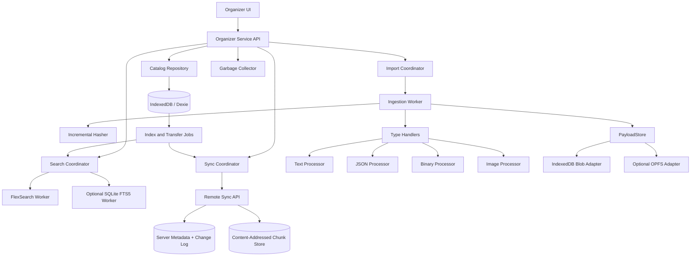

# IndexedDB Organizer Backend Architecture

**Status:** Proposed architecture  
**Primary language:** TypeScript  
**Primary environment:** Chromium, Firefox, Safari, desktop and mobile browsers  
**Data focus:** Large text files, JSON documents, arbitrary binary files, and pictures  
**Core capabilities:** Local organization, deduplication, incremental change detection, search, offline operation, resumable synchronization, revision history, and conflict handling

---

## 1. Executive Decision

Use **IndexedDB as the local catalog, revision store, transaction log, and synchronization state database** — a replica and offline buffer. **When a host server is configured, its database is always authoritative for shared state**: it assigns `serverVersion`, orders the global change log, resolves conflicts, and is the recovery source for every synchronized entity. The client catalog must converge to the server on every synchronization; it is authoritative only for unsynchronized local content until the server acknowledges it.

Store file content as immutable, content-addressed chunks:

```text
Asset
  └── Current Revision
        └── Manifest
              ├── Chunk SHA-256:A
              ├── Chunk SHA-256:B
              └── Chunk SHA-256:C
```

Recommended implementation stack:

- **Dexie** for the IndexedDB schema, transactions, bulk operations, and reactive queries.
- **hash-wasm** for incremental SHA-256 hashing without loading entire large files into memory.
- **FlexSearch** as the default worker-based full-text index.
- **SQLite WASM with FTS5** as an optional scale-up search backend for very large text collections.
- **Comlink** for typed communication with ingestion, image, hashing, and search workers.
- **@streamparser/json** for streaming large JSON documents.
- **json-canonicalize** for RFC 8785-compatible semantic JSON hashes.
- **Ajv** for optional JSON Schema validation.
- **exifr** for picture metadata.
- Native `createImageBitmap()` and `OffscreenCanvas` for image previews and thumbnails.
- **tus-js-client** for optional resumable uploads of large chunks.

Dexie provides a higher-level IndexedDB API, bulk operations, transactions, and reactive `liveQuery()` observation. A critical Dexie constraint is that transactions can auto-commit if application code awaits unrelated asynchronous work, so hashing, network access, image processing, and worker calls must happen outside write transactions.

IndexedDB can store strings, objects, `Blob`, `ArrayBuffer`, and typed arrays through the structured-clone mechanism. Binary payloads therefore do not need Base64 encoding.

### Core invariants

1. **Asset IDs are stable.** Renaming or moving a file does not change its identity.
2. **Revisions are immutable.** Editing content creates a new revision.
3. **Chunks are immutable and content-addressed.**
4. **Derived data is disposable.** Search indexes, thumbnails, previews, and parsed caches can be rebuilt.
5. **Hashes detect identical content; versions detect conflicts.**
6. **Unsynchronized content must never be garbage-collected.**
7. **Large files are processed incrementally.** No subsystem may require a complete multi-gigabyte file in JavaScript memory.
8. **The server is optional for local-only use but required for cross-device synchronization.**
9. **The IndexedDB catalog stays the local authority over OPFS and SQLite derived data.**
10. **With a host server configured, the server database is the authority for all shared entities** (assets, revisions, manifests, tombstones, versions, cursor). Clients never assign `serverVersion`; on pull, local state never overrides server state.

---

## 2. Goals

The organizer should support:

- Hierarchical folders.
- Tags, favorites, pinning, and custom metadata.
- Exact duplicate detection.
- Near-duplicate image grouping as an optional feature.
- Large text-file search.
- Structured JSON search and record-level updates.
- Binary-file storage and chunk-level synchronization.
- Picture metadata, thumbnails, and previews.
- Offline writes.
- Crash-safe imports.
- Incremental uploads and downloads.
- Cross-device revision and metadata synchronization.
- Lazy downloading of remote files.
- Revision history.
- Conflict preservation rather than silent data loss.
- Storage quota monitoring.
- Garbage collection of unreachable chunks and derived data.
- Migration between IndexedDB payload storage and OPFS payload storage.

### Non-goals for the first release

- Real-time collaborative text editing.
- Arbitrary binary diff generation.
- Automatic semantic merge of every JSON structure.
- Serverless cross-device synchronization.
- Making perceptual image hashes authoritative.
- Making the full-text index authoritative.
- Depending on one browser-specific storage implementation.

---

## 3. Recommended Operating Profiles

### 3.1 Portable profile

Use this first:

```text
IndexedDB through Dexie
├── Catalog and folders
├── Revisions and manifests
├── Blob chunks
├── Text blocks
├── JSON records
├── Picture metadata and variants
├── Outbox and sync cursor
└── FlexSearch snapshots
```

This profile has the fewest components and keeps all local catalog and derived data inside IndexedDB.

### 3.2 Large-corpus profile

Use this when the collection contains many gigabytes of text or hundreds of thousands of searchable documents:

```text
IndexedDB through Dexie
├── Local catalog replica
├── Revisions and manifests
├── Outbox, cursor, and conflicts
└── Derived-data job queues

PayloadStore
└── OPFS content-addressed chunks

SearchStore
└── SQLite WASM + FTS5 database in OPFS
```

OPFS is private to the site origin and provides file-oriented browser storage intended for efficient byte access. It is accessed through `navigator.storage.getDirectory()` and is especially suitable for worker-based storage engines. Browser storage remains quota-controlled, so the application must continue monitoring usage and handling unavailable features.

SQLite’s browser persistence documentation describes OPFS-backed virtual file systems and their worker requirements. In this architecture, SQLite is used only for a rebuildable search index, not as the authoritative organizer database.

---

## 4. High-Level Architecture



### Separation of responsibilities

| Layer | Authoritative? | Responsibility |
|---|---:|---|
| Server metadata store | **Yes — single authority** | Assets, revisions, manifests, versions, global cursor, tombstones, conflict arbitration |
| IndexedDB catalog | Local replica | Serves reads and offline writes; authoritative only for unsynchronized local content |
| IndexedDB or OPFS payload store | Replica of synced content | Immutable chunks and derived picture files; re-downloadable from the server |
| Full-text search index | No | Fast term, phrase, prefix, and field search |
| Thumbnail and preview cache | No | Fast picture display |
| Server chunk store | Yes for synchronized content | Content-addressed chunk persistence |
| Client outbox | Yes until acknowledged | Durable pending mutations |
| Client import session | Yes during import | Crash recovery and staging state |

---

## 5. Library Selection

### 5.1 Core dependencies

```bash
npm install dexie
npm install comlink
npm install hash-wasm
npm install flexsearch
npm install @streamparser/json
npm install json-canonicalize
npm install ajv
npm install exifr
```

Optional scale and transport dependencies:

```bash
npm install @sqlite.org/sqlite-wasm
npm install tus-js-client
npm install browser-image-compression
```

### 5.2 Library decision matrix

| Requirement | Selected library or API | Decision |
|---|---|---|
| IndexedDB wrapper | Dexie | Recommended |
| Minimal IndexedDB wrapper | `idb` | Alternative |
| Reactive replicated database | RxDB | Alternative when replication should be framework-managed |
| CouchDB-compatible synchronization | PouchDB | Alternative when CouchDB is a fixed requirement |
| Streaming hash | hash-wasm | Recommended |
| JSON semantic hash | json-canonicalize | Recommended |
| Streaming JSON parser | @streamparser/json | Recommended |
| JSON Schema | Ajv | Recommended when validation is required |
| Moderate full-text index | FlexSearch | Default |
| Very large full-text index | SQLite WASM + FTS5 | Optional scale tier |
| Worker RPC | Comlink | Recommended |
| Picture metadata | exifr | Recommended |
| Picture resizing | Native worker APIs | Default |
| Convenience image compression | browser-image-compression | Optional |
| Resumable upload | tus-js-client | Optional but recommended for very large transfers |

`idb` is a small promise-oriented wrapper around IndexedDB and is appropriate when the application wants to implement nearly every repository and transaction abstraction itself.

RxDB provides a reactive database abstraction and a replication protocol intended to synchronize local collections with a backend in batches. It is a reasonable replacement for the custom outbox layer when application-managed replication details are not required.

PouchDB provides CouchDB-style replication and attachment handling. It is a good choice when the backend is CouchDB-compatible, but its document-revision and attachment model is less direct than the custom immutable-manifest model proposed here.

FlexSearch supports plain indexes, document indexes, worker-backed indexes, and index export/import. It is suitable as the default in-browser search engine, provided its index remains derived and rebuildable.

Comlink exposes worker objects through a proxy-style RPC abstraction over `postMessage`, reducing custom message-protocol code between the main thread and workers.

---

## 6. Domain Model

### 6.1 Asset

An asset represents the user-visible organizer entry.

```ts
export type AssetKind =
  | "folder"
  | "text"
  | "json"
  | "binary"
  | "image";

export interface Asset {
  id: string;
  parentId: string | null;

  name: string;
  normalizedName: string;

  kind: AssetKind;
  mimeType: string | null;

  tags: string[];
  favorite: boolean;
  pinned: boolean;

  currentRevisionId: string | null;

  createdAt: number;
  modifiedAt: number;
  deletedAt: number | null;

  // Server-controlled optimistic-concurrency version.
  serverVersion: number;

  // Local UI hint, not the synchronization authority.
  syncState:
    | "local"
    | "pending"
    | "synced"
    | "conflict"
    | "remote-only";
}
```

Changing the following fields does not rewrite file content:

- `name`
- `parentId`
- `tags`
- `favorite`
- `pinned`
- Custom organizer metadata

### 6.2 Revision

A revision represents one immutable content state.

```ts
export interface Revision {
  id: string;
  assetId: string;

  parentRevisionIds: string[];

  manifestId: string;

  // SHA-256 of the exact original bytes.
  byteHash: string;

  // Optional normalized text or canonical JSON hash.
  semanticHash: string | null;

  totalBytes: number;

  createdAt: number;
  sourceModifiedAt: number | null;
  createdByClientId: string;

  processingState:
    | "staging"
    | "ready"
    | "failed";

  metadataId: string | null;
}
```

### 6.3 Manifest

A manifest describes how to reconstruct a revision.

```ts
export interface ContentManifest {
  id: string;

  version: 1;
  hashAlgorithm: "sha256";
  chunkingAlgorithm: "fixed-v1" | "content-defined-v1";

  totalBytes: number;
  partCount: number;

  // Hash of the canonical manifest description.
  rootHash: string;

  state: "staging" | "ready";
  importSessionId: string | null;
}

export interface ManifestPart {
  manifestId: string;
  ordinal: number;

  chunkHash: string;

  // Allows a revision to reference only part of an existing chunk.
  chunkOffset: number;
  length: number;
}
```

The manifest root hash should cover:

```json
{
  "version": 1,
  "hashAlgorithm": "sha256",
  "chunkingAlgorithm": "fixed-v1",
  "totalBytes": 123456,
  "parts": [
    {
      "chunkHash": "sha256:...",
      "chunkOffset": 0,
      "length": 4194304
    }
  ]
}
```

Canonicalizing this structure before hashing makes the manifest hash independent of JavaScript object property insertion order. RFC 8785 defines a JSON Canonicalization Scheme intended for repeatable hashing and signing; `json-canonicalize` provides an implementation of that scheme.

### 6.4 Chunk

```ts
export interface ChunkRecord {
  // Example: "sha256:9d17..."
  hash: string;

  size: number;

  storage:
    | "indexeddb"
    | "opfs";

  // Used only for IndexedDB-backed chunks.
  blob?: Blob;

  // Used only for OPFS-backed chunks.
  opfsPath?: string;

  state:
    | "staging"
    | "ready"
    | "missing"
    | "corrupt";

  synchronized: boolean;
  createdAt: number;
  lastAccessedAt: number;

  // Cache only. Reachability scanning remains authoritative.
  approximateRefCount: number;
}
```

### 6.5 Derived records

```ts
export interface TextBlock {
  revisionId: string;
  ordinal: number;

  text: string;
  normalizedText: string;

  byteStart: number;
  byteEnd: number;

  characterStart: number;
  characterEnd: number;

  lineStart: number;
  lineEnd: number;

  hash: string;
}

export interface JsonRecord {
  revisionId: string;
  recordKey: string;

  value: unknown;
  semanticHash: string;

  sourceByteStart: number | null;
  sourceByteEnd: number | null;
}

export interface ImageVariant {
  revisionId: string;

  variant:
    | "thumbnail"
    | "preview"
    | "screen"
    | "custom";

  contentHash: string;

  width: number;
  height: number;
  mimeType: string;
  bytes: number;
}

export interface ImageMetadata {
  revisionId: string;

  width: number;
  height: number;

  orientation: number | null;

  capturedAt: number | null;
  cameraMake: string | null;
  cameraModel: string | null;

  latitude: number | null;
  longitude: number | null;

  colorSpace: string | null;

  // Optional near-duplicate identifier.
  perceptualHash: string | null;
}
```

---

## 7. Dexie Schema

```ts
import Dexie, { type EntityTable } from "dexie";

export interface PendingMutation {
  entityKey: string;
  mutationId: string;

  entityType:
    | "asset"
    | "revision"
    | "manifest"
    | "tombstone";

  operation:
    | "put"
    | "delete";

  baseServerVersion: number;
  payload: unknown;

  createdAt: number;
}

export interface ConflictRecord {
  entityKey: string;
  localValue: unknown;
  remoteValue: unknown;
  remoteServerVersion: number;
  detectedAt: number;
}

export interface IndexJob {
  id: string;
  assetId: string;
  revisionId: string;

  operation:
    | "index"
    | "remove"
    | "rebuild";

  state:
    | "pending"
    | "running"
    | "failed";

  attempts: number;
  createdAt: number;
  lastError: string | null;
}

export interface ImportSession {
  id: string;
  assetId: string | null;
  manifestId: string;

  sourceName: string;
  sourceSize: number;

  processedBytes: number;

  state:
    | "created"
    | "reading"
    | "deriving"
    | "committing"
    | "complete"
    | "failed"
    | "cancelled";

  startedAt: number;
  updatedAt: number;
  lastError: string | null;
}

export interface SyncMeta {
  key: string;
  value: unknown;
}

export class OrganizerDatabase extends Dexie {
  assets!: EntityTable<Asset, "id">;
  revisions!: EntityTable<Revision, "id">;

  manifests!: EntityTable<ContentManifest, "id">;
  manifestParts!: EntityTable<
    ManifestPart,
    [string, number]
  >;

  chunks!: EntityTable<ChunkRecord, "hash">;

  textBlocks!: EntityTable<
    TextBlock,
    [string, number]
  >;

  jsonRecords!: EntityTable<
    JsonRecord,
    [string, string]
  >;

  imageVariants!: EntityTable<
    ImageVariant,
    [string, string]
  >;

  imageMetadata!: EntityTable<
    ImageMetadata,
    "revisionId"
  >;

  outbox!: EntityTable<
    PendingMutation,
    "entityKey"
  >;

  conflicts!: EntityTable<
    ConflictRecord,
    "entityKey"
  >;

  indexJobs!: EntityTable<IndexJob, "id">;
  imports!: EntityTable<ImportSession, "id">;
  syncMeta!: EntityTable<SyncMeta, "key">;

  constructor() {
    super("organizer-db");

    this.version(1).stores({
      assets: [
        "id",
        "parentId",
        "[parentId+normalizedName]",
        "kind",
        "mimeType",
        "modifiedAt",
        "*tags",
        "currentRevisionId",
        "deletedAt",
        "serverVersion",
      ].join(","),

      revisions: [
        "id",
        "assetId",
        "[assetId+createdAt]",
        "byteHash",
        "semanticHash",
        "manifestId",
        "createdAt",
      ].join(","),

      manifests: [
        "id",
        "rootHash",
        "state",
        "importSessionId",
      ].join(","),

      manifestParts: [
        "[manifestId+ordinal]",
        "manifestId",
        "chunkHash",
      ].join(","),

      chunks: [
        "hash",
        "storage",
        "size",
        "state",
        "synchronized",
        "lastAccessedAt",
      ].join(","),

      textBlocks: [
        "[revisionId+ordinal]",
        "revisionId",
        "hash",
        "[revisionId+lineStart]",
      ].join(","),

      jsonRecords: [
        "[revisionId+recordKey]",
        "revisionId",
        "recordKey",
        "semanticHash",
      ].join(","),

      imageVariants: [
        "[revisionId+variant]",
        "revisionId",
        "contentHash",
      ].join(","),

      imageMetadata: [
        "revisionId",
        "capturedAt",
        "cameraMake",
        "cameraModel",
        "perceptualHash",
      ].join(","),

      // One entry per logical entity. Newer pending metadata edits
      // replace older unsynchronized edits for the same entity.
      outbox: [
        "entityKey",
        "mutationId",
        "entityType",
        "createdAt",
      ].join(","),

      conflicts: [
        "entityKey",
        "detectedAt",
      ].join(","),

      indexJobs: [
        "id",
        "[state+createdAt]",
        "assetId",
        "revisionId",
      ].join(","),

      imports: [
        "id",
        "state",
        "startedAt",
        "updatedAt",
      ].join(","),

      syncMeta: "key",
    });
  }
}
```

### Schema rules

- Do not index large text, binary values, or complete JSON objects directly in IndexedDB.
- Index only values used for navigation, filtering, job selection, and synchronization.
- Use multi-entry indexes for tags.
- Keep full-text terms in the selected search backend.
- Keep raw payloads in `chunks`.
- Keep derived structured records in separate tables.
- Make migration code resumable; never assume a browser upgrade transaction can process gigabytes of content.

---

## 8. Payload Storage Abstraction

The catalog must not know whether a chunk is physically stored as an IndexedDB `Blob` or an OPFS file.

```ts
export interface PayloadStore {
  readonly kind: "indexeddb" | "opfs";

  has(hash: string): Promise<boolean>;

  put(
    hash: string,
    data: Blob,
    options?: {
      signal?: AbortSignal;
    },
  ): Promise<void>;

  get(hash: string): Promise<Blob | null>;

  openStream(
    parts: readonly ManifestPart[],
    options?: {
      signal?: AbortSignal;
    },
  ): Promise<ReadableStream<Uint8Array>>;

  delete(hash: string): Promise<void>;

  verify(hash: string): Promise<boolean>;
}
```

### IndexedDB adapter

Recommended for the portable profile:

```text
chunks[hash] = {
  hash,
  size,
  storage: "indexeddb",
  blob
}
```

Advantages:

- One storage API.
- Straightforward backup and export.
- Works naturally with Dexie.
- Atomic metadata plus small payload operations.

Limitations:

- Large `Blob` behavior and quota characteristics must be tested on every supported browser.
- Reconstructing or moving large content can create temporary memory and storage pressure.
- Long-running, giant transactions must be avoided.

### OPFS adapter

Recommended as a scale option:

```text
/opfs/organizer/chunks/sha256/9d/17/9d17...
```

IndexedDB stores only:

```ts
{
  hash: "sha256:9d17...",
  size: 4194304,
  storage: "opfs",
  opfsPath: "organizer/chunks/sha256/9d/17/9d17..."
}
```

OPFS access should be:

- Feature-detected.
- Encapsulated behind `PayloadStore`.
- Performed in a worker where possible.
- Treated as origin-private, quota-controlled storage.
- Recoverable from the remote chunk store when synchronized.

### Hybrid policy

A deployment may configure:

```ts
export interface StoragePolicy {
  payloadBackend:
    | "indexeddb"
    | "opfs"
    | "hybrid";

  opfsMinimumAssetBytes: number;
}
```

In hybrid mode:

- Small assets and thumbnails remain in IndexedDB.
- Large original payload chunks use OPFS.
- The location of each chunk is recorded individually.
- Background migration can move chunks between stores without changing manifests.

---

## 9. Hashing and Chunking

### 9.1 Hash types

Maintain separate hashes for separate meanings.

| Hash | Input | Purpose |
|---|---|---|
| `byteHash` | Exact complete original bytes | Exact file identity |
| `chunkHash` | Exact chunk bytes | Deduplication and transfer |
| `manifestHash` | Canonical manifest | Revision reconstruction identity |
| `semanticHash` | Normalized text or canonical JSON | Logical equivalence |
| `perceptualHash` | Decoded picture appearance | Near-duplicate grouping only |

Do not use `semanticHash` to reconstruct content.

Do not use `perceptualHash` for:

- Synchronization identity.
- Security verification.
- Exact duplicate detection.
- Chunk addressing.

### 9.2 Hash algorithm

Use SHA-256 for protocol-level identities:

```text
sha256:<lowercase hexadecimal digest>
```

The browser Web Crypto `digest()` API computes SHA-256 but requires the complete input buffer, making it inconvenient for multi-gigabyte streaming. `hash-wasm` supports incremental hashing and includes browser, TypeScript, worker, SHA-256, and BLAKE3 support. Use its incremental SHA-256 API for large imports.

Example worker-side interface:

```ts
export interface HashSession {
  update(bytes: Uint8Array): void;
  digestHex(): string;
}
```

### 9.3 Default chunking configuration

These are starting values and must be benchmarked against target devices:

```ts
const MiB = 1024 * 1024;

export const DEFAULT_STORAGE_CONFIG = {
  binaryChunkBytes: 4 * MiB,
  textPayloadChunkBytes: 2 * MiB,
  indexedDbWriteBatchBytes: 32 * MiB,

  textSearchBlockCharacters: 64 * 1024,
  textSearchOverlapCharacters: 256,

  inlineJsonMaximumBytes: 8 * MiB,

  thumbnailMaximumEdge: 256,
  previewMaximumEdge: 1600,
} as const;
```

### 9.4 Fixed-size chunks

Use fixed-size chunks for the first release.

Advantages:

- Simple implementation.
- Predictable memory.
- Easy random access.
- Easy resumable transfer.
- Straightforward server verification.

Limitation:

- Inserting one byte near the beginning of a file shifts later boundaries and may change most chunk hashes.

### 9.5 Optional content-defined chunks

Add a `Chunker` abstraction before adding a content-defined algorithm:

```ts
export interface ChunkBoundary {
  offset: number;
  length: number;
}

export interface Chunker {
  readonly algorithmId:
    | "fixed-v1"
    | "content-defined-v1";

  consume(
    bytes: Uint8Array,
    absoluteOffset: number,
  ): ChunkBoundary[];

  finish(): ChunkBoundary[];
}
```

Content-defined chunking is useful for:

- Large appendable logs.
- Virtual-machine images.
- Archives that experience insertion near the beginning.
- Large binary formats whose internal blocks move.

Do not make a niche browser content-defined-chunking package a mandatory v1 dependency. Preserve the manifest algorithm ID so a later implementation can coexist with fixed-size manifests.

### 9.6 Deduplication

Before storing a chunk:

```text
1. Compute chunk hash.
2. Check chunks[hash].
3. If a ready chunk already exists:
   - Reuse it.
   - Do not rewrite its bytes.
4. Otherwise:
   - Store it with state=staging.
   - Verify its stored hash.
   - Change state to ready.
5. Add the manifest part.
```

Deduplication applies across:

- Different assets.
- Different revisions.
- Picture originals and derived variants when bytes match.
- Local imports and remotely downloaded content.

---

## 10. Crash-Safe Import Pipeline

A multi-gigabyte import must not be one IndexedDB transaction.

### 10.1 Import states

```text
created
  ↓
reading
  ↓
deriving
  ↓
committing
  ↓
complete
```

Error states:

```text
failed
cancelled
```

### 10.2 Import algorithm

```text
1. Create ImportSession.
2. Create staging Manifest.
3. Start ingestion worker.
4. Read the source incrementally.
5. Update complete-file hasher.
6. Split input into chunks.
7. Hash and store each chunk.
8. Write ManifestPart batches.
9. Produce type-specific derived records.
10. Compute manifest root hash.
11. Verify stored chunk reachability.
12. Execute one final small Dexie transaction:
    a. Mark manifest ready.
    b. Create immutable revision.
    c. Create or update asset.
    d. Set asset.currentRevisionId.
    e. Queue one outbox mutation.
    f. Queue index jobs.
    g. Mark import complete.
13. Notify the UI.
```

### 10.3 Final commit transaction

```ts
await db.transaction(
  "rw",
  db.assets,
  db.revisions,
  db.manifests,
  db.outbox,
  db.indexJobs,
  db.imports,
  async () => {
    const session = await db.imports.get(importSessionId);

    if (!session || session.state !== "committing") {
      throw new Error("Import is not ready to commit");
    }

    await db.manifests.update(manifest.id, {
      state: "ready",
      importSessionId: null,
    });

    await db.revisions.add(revision);

    await db.assets.put({
      ...asset,
      currentRevisionId: revision.id,
      modifiedAt: Date.now(),
      syncState: "pending",
    });

    await db.outbox.put(assetMutation);

    await db.indexJobs.bulkPut(indexJobs);

    await db.imports.update(importSessionId, {
      state: "complete",
      updatedAt: Date.now(),
      lastError: null,
    });
  },
);
```

All hashing, parsing, image decoding, worker messages, and network access must finish before this transaction starts.

### 10.4 Recovery

On startup:

```text
For each non-complete import:
  - If it can resume, restore worker state from the last completed part.
  - Otherwise mark it failed or cancelled.
  - Keep chunks that are referenced by any ready manifest.
  - Delete unreachable staging manifests and parts after a grace period.
  - Let mark-and-sweep remove orphan chunks.
```

Never infer that an interrupted chunk is valid only because its filename or key exists. Recompute or verify its hash.

---

## 11. Large Text-File Pipeline

### 11.1 Preserve exact bytes

The original text file is stored exactly as imported.

This preserves:

- Encoding.
- Byte-order mark.
- Line endings.
- Invalid byte sequences.
- Trailing whitespace.
- Final newline state.

### 11.2 Text metadata

```ts
export interface TextMetadata {
  revisionId: string;

  detectedEncoding: string;
  hasByteOrderMark: boolean;

  dominantLineEnding:
    | "lf"
    | "crlf"
    | "cr"
    | "mixed"
    | "none";

  lineCount: number;
  characterCount: number;

  decodingWarnings: number;
}
```

### 11.3 Dual representation

Maintain two forms:

```text
Raw byte chunks
    Used for reconstruction, download, exact hashing, and synchronization.

Decoded text blocks
    Used for search, snippets, line navigation, and text editing.
```

### 11.4 Search-block generation

Generate blocks near newline boundaries:

```text
Target: approximately 64 Ki characters
Overlap: approximately 256 characters
```

The overlap allows phrase matching near a block boundary.

Each block records:

- Raw-byte range.
- Character range.
- Line range.
- Original decoded text.
- Search-normalized text.
- Block hash.

Possible search normalization:

```ts
function normalizeTextForSearch(text: string): string {
  return text
    .normalize("NFC")
    .replace(/\r\n?/g, "\n");
}
```

Do not use this normalized form for exact file reconstruction.

### 11.5 Line index

For fast line navigation, create sparse checkpoints:

```ts
export interface TextLineCheckpoint {
  revisionId: string;
  line: number;
  byteOffset: number;
  characterOffset: number;
}
```

A checkpoint every 512 or 1,024 lines is a reasonable initial setting.

### 11.6 Incremental text editing

For an editable large text file, use manifest slices as a piece table:

```text
Original:
[A][B][C][D]

Edit inside B:
[A][B-prefix][new bytes][B-suffix][C][D]
```

Only the new inserted bytes require a new chunk. Existing chunks or slices remain referenced.

An edit commit should:

1. Create new chunks for inserted content.
2. Construct a new manifest from existing and new parts.
3. Create a new revision.
4. Rebuild only affected text blocks and neighboring overlap blocks.
5. Queue only the new chunk hashes for upload.
6. Preserve the old revision.

Periodic compaction can rewrite heavily fragmented manifests into larger chunks.

### 11.7 Full-text strategy

Index one search document per text block:

```ts
export interface TextSearchDocument {
  id: string; // `${revisionId}:${ordinal}`

  assetId: string;
  revisionId: string;
  blockOrdinal: number;

  name: string;
  path: string;
  tags: string[];

  body: string;

  lineStart: number;
  lineEnd: number;
}
```

When an asset receives a new current revision:

- Remove or deactivate old current-revision search documents.
- Add new or changed block documents.
- Keep old revision blocks in IndexedDB if revision-history search is enabled.
- Search current revisions by default.

---

## 12. JSON Pipeline

### 12.1 Two JSON identities

Maintain:

```text
byteHash
  Hash of exact original file bytes.

semanticHash
  Hash of canonical parsed JSON.
```

These files may have different `byteHash` values but the same `semanticHash`:

```json
{"a":1,"b":2}
```

```json
{
  "b": 2,
  "a": 1
}
```

### 12.2 Small and medium JSON

For documents below a configurable threshold:

```text
1. Read complete file.
2. Parse JSON.
3. Optionally validate it with Ajv.
4. Canonicalize it.
5. Compute semantic hash.
6. Store raw byte chunks.
7. Store selected structured fields.
8. Generate search documents.
```

Ajv supports JSON Schema validation and TypeScript integration and should be used when the organizer has a known schema or accepts user-supplied schemas.

### 12.3 Large JSON

Use a streaming parser when the document cannot safely fit in memory. `@streamparser/json` is designed for incremental JSON parsing in browser and server JavaScript environments.

Supported large-JSON modes:

#### Mode A: Top-level array with stable record key

Example:

```json
[
  {
    "id": "item-1",
    "name": "First"
  },
  {
    "id": "item-2",
    "name": "Second"
  }
]
```

Configuration:

```ts
export interface JsonRecordMode {
  mode: "top-level-array";
  recordKeyPointer: "/id";
  indexedPointers: [
    "/name",
    "/description",
    "/category"
  ];
}
```

Store each object as an independently hashable record:

```text
jsonRecords[
  revisionId,
  "item-1"
]
```

Benefits:

- Record-level comparison.
- Record-level search indexing.
- Record-level synchronization in application-native JSON datasets.
- Efficient change inspection.
- No need to index every JSON leaf.

#### Mode B: Top-level object keyed by stable names

Example:

```json
{
  "item-1": {
    "name": "First"
  },
  "item-2": {
    "name": "Second"
  }
}
```

Use the top-level property as `recordKey`.

#### Mode C: Arbitrary JSON document

When no stable records exist:

- Preserve raw chunks.
- Generate selected JSON-path search fields.
- Treat the document as one logical content revision.
- Use chunk-level transfer, not record-level merge.
- Reparse affected content when it changes.

### 12.4 JSON search indexing

Do not index every primitive by default. Large telemetry or generated JSON can contain millions of low-value leaves.

Use an explicit policy:

```ts
export interface JsonIndexPolicy {
  includePointers: string[];
  excludePointers: string[];

  includePropertyNames: boolean;

  maximumStringLength: number;
  maximumValuesPerRecord: number;
}
```

Example search document:

```ts
export interface JsonSearchDocument {
  id: string;

  assetId: string;
  revisionId: string;
  recordKey: string | null;

  name: string;
  path: string;
  tags: string[];

  indexedText: string;

  fields: Record<string, string | number | boolean>;
}
```

### 12.5 JSON updates

For stable-record JSON datasets:

```text
Changed record semantic hash
        ↓
Write changed JsonRecord
        ↓
Create new file revision or dataset revision
        ↓
Update only that record's search document
        ↓
Queue only changed chunks or record mutation
```

The system should distinguish:

- **File synchronization:** preserves exact original JSON formatting and bytes.
- **Dataset synchronization:** synchronizes logical JSON records and can regenerate serialized output.

Do not silently switch between these modes.

---

## 13. Arbitrary Binary Pipeline

Generic binary files receive:

- Exact byte hash.
- Chunk hashes.
- MIME type.
- Filename and extension.
- File size.
- User tags.
- Optional format-extractor metadata.

They do not receive full-text indexing unless a format plugin extracts text.

### 13.1 Binary rules

- Store raw bytes, never Base64.
- Never interpret the file merely from its extension.
- Do not execute imported binaries.
- Verify chunk hashes after remote downloads.
- Treat unknown data as `application/octet-stream`.
- Use chunk-level transfer.
- Preserve source bytes exactly.

### 13.2 Extractor plugin interface

```ts
export interface BinaryExtractorResult {
  metadata: Record<string, unknown>;
  searchableText: string[];
  childResources: ExtractedResource[];
}

export interface ExtractedResource {
  name: string;
  mimeType: string;
  bytes: Blob;
}

export interface BinaryFormatExtractor {
  readonly id: string;
  readonly supportedMimeTypes: readonly string[];

  canHandle(
    header: Uint8Array,
    declaredMimeType: string,
    fileName: string,
  ): boolean;

  extract(
    source: AsyncIterable<Uint8Array>,
    context: {
      signal: AbortSignal;
    },
  ): Promise<BinaryExtractorResult>;
}
```

Possible future extractors:

- ZIP entry catalog.
- PDF text and page metadata.
- Audio tags.
- Video duration and codecs.
- Game-asset package metadata.
- Source-map symbols.
- Custom application project formats.

Extracted resources should be treated as derived data unless the user explicitly imports them as independent assets.

---

## 14. Picture Pipeline

### 14.1 Original picture

The original picture is immutable and stored as normal content-addressed chunks.

Store:

- Exact `byteHash`.
- Width and height.
- MIME type.
- EXIF orientation.
- Capture date when present.
- Camera metadata when allowed.
- Optional GPS metadata.
- Optional perceptual hash.

### 14.2 Worker processing

Recommended pipeline:

```text
Original Blob
    ↓
createImageBitmap()
    ↓
Apply orientation
    ↓
OffscreenCanvas
    ├── Thumbnail
    └── Preview
          ↓
convertToBlob()
```

`createImageBitmap()` is available in worker contexts, and `OffscreenCanvas.convertToBlob()` can encode a rendered result without depending on a visible DOM canvas.

### 14.3 Variants

Initial variants:

| Variant | Suggested maximum edge | Purpose |
|---|---:|---|
| Thumbnail | 256 px | Grid and list display |
| Preview | 1,600 px | Fast viewer display |
| Original | Unchanged | Export, editing, synchronization |

Variant encoding policy:

```text
1. Prefer a browser-supported modern image format when configured.
2. Preserve alpha when required.
3. Fall back to JPEG or PNG as appropriate.
4. Store the resulting variant as a content-addressed object.
5. Record width, height, MIME type, and size.
```

`browser-image-compression` can be used as a convenience layer for worker-based client image resizing and compression, but the native pipeline should remain available to reduce mandatory dependencies.

### 14.4 EXIF

Use exifr to extract supported picture metadata. Treat GPS as sensitive information and make its retention and synchronization configurable.

```ts
export interface ImagePrivacyPolicy {
  retainGpsLocally: boolean;
  synchronizeGps: boolean;
  retainCameraSerialNumber: boolean;
}
```

### 14.5 Exact and visual duplicates

Use:

```text
byteHash
  Exact duplicate.

decodedPixelHash
  Optional same-pixel duplicate after decode and orientation.

perceptualHash
  Optional visually similar grouping.
```

Examples:

- Two copies of one JPEG: same `byteHash`.
- PNG and JPEG of the same picture: different `byteHash`, possibly similar perceptual hash.
- Rotated EXIF representation: different bytes, potentially same normalized pixel hash.
- Resized picture: different bytes and pixels, potentially similar perceptual hash.

Visual hashes should only suggest duplicates. The user decides whether to consolidate them.

---

## 15. Search Architecture

Search consists of three layers.

### 15.1 Layer 1: IndexedDB metadata indexes

Use IndexedDB for:

- Folder contents.
- Exact name lookup.
- Prefix name browsing.
- Tag lookup.
- Asset kind.
- MIME type.
- Modified date.
- Favorites and pinning.
- Current revision.
- Sync state.
- Deleted items.

Do not use IndexedDB cursors to scan every text block for each search query.

### 15.2 Layer 2: Full-text adapter

```ts
export interface FullTextDocument {
  id: string;
  assetId: string;
  revisionId: string;

  type:
    | "text-block"
    | "json-record"
    | "image-metadata"
    | "binary-extract";

  title: string;
  path: string;
  tags: string[];
  body: string;

  fields: Record<
    string,
    string | number | boolean
  >;
}

export interface FullTextHit {
  documentId: string;
  assetId: string;
  revisionId: string;

  score: number;
  matchedFields: string[];
  snippet: string | null;
}

export interface FullTextSearchAdapter {
  initialize(): Promise<void>;

  put(
    documents: readonly FullTextDocument[],
  ): Promise<void>;

  remove(
    documentIds: readonly string[],
  ): Promise<void>;

  search(
    request: {
      query: string;
      limit: number;
      offset: number;
    },
  ): Promise<FullTextHit[]>;

  checkpoint(): Promise<void>;
  rebuild(): Promise<void>;
}
```

### 15.3 FlexSearch adapter

Use FlexSearch as the default adapter:

- Run it in a dedicated worker.
- Use document mode.
- Index `title`, `path`, `tags`, `body`, and selected structured fields.
- Store exported checkpoints in IndexedDB.
- Replay `indexJobs` after restoring a checkpoint.
- Rebuild from IndexedDB if the checkpoint is missing or incompatible.
- Avoid importing a huge serialized index on the UI thread.

Suitable for:

- Thousands to low hundreds of thousands of records.
- Moderate text-block counts.
- Applications favoring simple deployment.
- Mobile clients where SQLite WASM would add too much complexity.

The exact capacity depends on device memory, tokenizer settings, indexed text size, and query configuration and must be benchmarked with the target corpus.

### 15.4 SQLite FTS5 adapter

Use the optional adapter when:

- Search data significantly exceeds comfortable in-memory index size.
- The collection contains millions of text blocks or JSON records.
- Disk-backed full-text search is preferred.
- Search persistence and bounded JavaScript heap usage are more important than deployment simplicity.

Architecture:

```text
IndexedDB textBlocks/jsonRecords
        ↓ indexJobs
SQLite WASM worker
        ↓
FTS5 tables in OPFS
```

Example derived schema:

```sql
CREATE TABLE search_documents (
  document_id TEXT PRIMARY KEY,
  asset_id TEXT NOT NULL,
  revision_id TEXT NOT NULL,
  document_type TEXT NOT NULL,
  line_start INTEGER,
  line_end INTEGER
);

CREATE VIRTUAL TABLE search_fts
USING fts5(
  document_id UNINDEXED,
  title,
  path,
  tags,
  body,
  tokenize = 'unicode61'
);
```

The SQLite database must be considered disposable:

```text
IndexedDB is correct + SQLite index missing
  → rebuild SQLite.

SQLite index exists + IndexedDB catalog missing
  → do not reconstruct authority from SQLite.
```

### 15.5 Query planner

Parse a query into metadata and content components.

Example:

```text
kind:image tag:vacation modified:>=2026-01-01 "golden gate"
```

Parsed form:

```ts
export interface OrganizerSearchQuery {
  text: string | null;

  kinds: AssetKind[];
  tags: string[];

  mimeTypes: string[];

  modifiedAfter: number | null;
  modifiedBefore: number | null;

  parentId: string | null;
  recursive: boolean;

  includeDeleted: boolean;

  limit: number;
  cursor: string | null;
}
```

Execution:

```text
1. Query full-text adapter for ranked asset IDs.
2. Query IndexedDB metadata indexes for filters.
3. Intersect candidates.
4. Load current asset and revision metadata.
5. Generate or reuse snippets.
6. Return stable cursor and ranked results.
```

When no text term exists, skip the full-text adapter.

When the metadata filter is very selective, obtain candidates first and pass a candidate-set hint to the full-text adapter when supported.

### 15.6 Index job model

```text
Content commit
    ↓
indexJobs.put(job)
    ↓
Search worker claims job
    ↓
Index derived records
    ↓
Mark job complete
```

Jobs must be idempotent. Reprocessing one job should produce the same index state.

Use an index-generation number:

```ts
interface SearchIndexState {
  key: "search-index";
  generation: number;
  adapter: "flexsearch" | "sqlite-fts5";
  schemaVersion: number;
  lastCheckpointAt: number | null;
}
```

A tokenizer or schema change increments `schemaVersion` and schedules a rebuild.

---

## 16. Incremental Synchronization Architecture

Hashes answer:

```text
Does the content match?
```

Versions answer:

```text
Did another client change the logical entity after my local copy?
```

Both are required.

**Server authority rules:**

- The server assigns every `serverVersion` and orders the global change log;
  clients never set or increment versions themselves.
- Every mutation carries `baseServerVersion`; the server rejects stale writes
  whose base does not match the current version.
- The client applies a pull in the same transaction as the cursor advance —
  server state is never overwritten by local state.
- On startup or reconnect, the client reconciles against the server first;
  local-only data exists only in the outbox until acknowledged.
- If the local catalog is lost or corrupt, the server is the recovery source;
  IndexedDB is never used to reconstruct server state.
- The server arbitrates conflicts: it records both values and its resolution
  becomes the next authoritative version that all clients pull.

### 16.1 Remote backend components

```text
Authenticated Sync API
├── Metadata database
│   ├── Assets
│   ├── Revisions
│   ├── Manifests
│   ├── Tombstones
│   ├── Processed mutation IDs
│   └── Global ordered change log
│
└── Content-addressed object store
    └── Chunks keyed by SHA-256
```

### 16.2 Suggested endpoints

```http
POST /v1/chunks/exists
PUT  /v1/chunks/{hash}
GET  /v1/chunks/{hash}

POST /v1/manifests/commit

POST /v1/sync/push
GET  /v1/sync/pull?cursor={cursor}&limit={limit}
```

Optional resumable transport:

```http
POST  /v1/uploads
PATCH /v1/uploads/{uploadId}
HEAD  /v1/uploads/{uploadId}
```

`tus-js-client` implements the tus resumable upload protocol and can resume prior uploads, making it suitable for large chunks or unchunked compatibility uploads.

### 16.3 Push sequence

```text
1. Read a stable outbox batch.
2. Collect referenced chunk hashes.
3. Ask server which chunks are missing.
4. Upload missing chunks.
5. Commit manifests.
6. Push revisions and asset mutations.
7. Server validates base versions.
8. Server records mutation IDs.
9. Server appends accepted changes to global change log.
10. Client applies acknowledgements.
11. Client removes only acknowledged mutation IDs.
```

### 16.4 Chunk-existence request

```json
{
  "hashAlgorithm": "sha256",
  "hashes": [
    "sha256:1111...",
    "sha256:2222...",
    "sha256:3333..."
  ]
}
```

Response:

```json
{
  "missing": [
    "sha256:2222..."
  ]
}
```

This endpoint must be authenticated and scoped to the user or tenant to avoid exposing a cross-tenant content-presence oracle.

### 16.5 Mutation request

```json
{
  "clientId": "client-3ce7",
  "mutations": [
    {
      "mutationId": "mutation-f221",
      "entityKey": "asset:asset-123",
      "entityType": "asset",
      "operation": "put",
      "baseServerVersion": 8,
      "payload": {
        "id": "asset-123",
        "name": "notes.txt",
        "parentId": "folder-12",
        "currentRevisionId": "revision-29"
      }
    }
  ]
}
```

### 16.6 Acknowledgement

```json
{
  "acknowledgements": [
    {
      "mutationId": "mutation-f221",
      "entityKey": "asset:asset-123",
      "serverVersion": 9
    }
  ],
  "conflicts": []
}
```

The server must retain processed mutation IDs so retries are idempotent.

### 16.7 Pull sequence

```text
1. Client sends its global server cursor.
2. Server returns ordered changes after that cursor.
3. Client applies one page in an IndexedDB transaction.
4. Client updates the cursor in that same transaction.
5. Client schedules missing-chunk downloads.
6. Client schedules search-index updates.
7. Repeat while hasMore=true.
```

Response:

```json
{
  "changes": [
    {
      "cursor": "81922",
      "entityKey": "asset:asset-456",
      "operation": "put",
      "serverVersion": 12,
      "payload": {}
    }
  ],
  "nextCursor": "81922",
  "hasMore": false
}
```

Do not use client timestamps as the pull cursor. Use a server-generated ordered sequence.

### 16.8 Lazy payload download

Remote metadata can be available before all payload chunks.

Asset states:

```text
remote-only
  Metadata and manifest exist locally.
  Payload chunks have not been downloaded.

partial
  Some chunks are available.

available
  All required chunks are available and verified.
```

Opening a remote-only asset:

```text
1. Read manifest.
2. Find missing chunk hashes.
3. Download chunks in priority order.
4. Verify each hash.
5. Persist chunk.
6. Stream available content to the consumer.
7. Mark revision available when complete.
```

Pinned assets are downloaded eagerly.

---

## 17. Conflict Policy

### 17.1 Conflict matrix

| Local change | Remote change | Default result |
|---|---|---|
| Rename | Content edit | Merge both |
| Move | Tag edit | Merge both |
| Tag add | Different tag add | Union when policy permits |
| Content edit | Content edit | Preserve both revisions |
| Delete | Content edit | Explicit conflict |
| Delete | Rename | Delete policy or explicit conflict |
| Same exact content | Same exact content | Deduplicate |
| Same semantic JSON | Different formatting | Preserve exact-byte policy; optionally mark semantic match |

### 17.2 Content conflict

Do not overwrite either revision.

```text
Asset
├── Local revision
└── Remote revision
```

Create:

```ts
export interface ContentConflict {
  entityKey: string;
  assetId: string;

  localRevisionId: string;
  remoteRevisionId: string;

  remoteServerVersion: number;
  detectedAt: number;

  resolution:
    | "unresolved"
    | "keep-local"
    | "keep-remote"
    | "keep-both"
    | "merged";
}
```

Resolution options:

- Keep local as current.
- Keep remote as current.
- Keep both by duplicating the logical asset.
- Merge text.
- Merge stable-record JSON.
- Retain both binary or picture variants.

### 17.3 Text merge

A future text merge can use:

- Base revision.
- Local revision.
- Remote revision.
- Three-way merge.
- Manual conflict markers when automatic merge fails.

### 17.4 JSON merge

Stable-record JSON can merge per record:

```text
Local changes record A.
Remote changes record B.
    → Merge automatically.

Local and remote change record A differently.
    → Record-level conflict.
```

Within one record, optional JSON-pointer patches can support field-level comparison.

### 17.5 Hash equality during conflict

When local and remote versions differ but exact hashes match:

```text
- Treat content as converged.
- Advance the server version.
- Remove redundant local content mutation.
- Preserve independent metadata changes.
```

---

## 18. Deletion and Tombstones

Deleting an asset must not immediately destroy its content.

```ts
export interface Tombstone {
  entityKey: string;
  deletedAt: number;
  serverVersion: number;
  mutationId: string;
}
```

Deletion process:

```text
1. Set asset.deletedAt.
2. Queue tombstone mutation.
3. Hide from normal browsing.
4. Preserve current revision and chunks.
5. Synchronize tombstone.
6. Retain according to trash policy.
7. Garbage-collect only when no live roots reference the content.
```

A remote offline device needs the tombstone to learn that the asset was deleted.

---

## 19. Garbage Collection

Do not rely solely on reference counts. Interrupted operations can leave counts inaccurate.

Use mark-and-sweep.

### 19.1 Roots

Mark chunks reachable from:

- Current revisions.
- Retained historical revisions.
- Pinned revisions.
- Unsynchronized revisions.
- Unresolved conflicts.
- Active import sessions.
- Active exports.
- Pending transfer jobs.
- Trash items inside the retention period.

### 19.2 Sweep

Delete unmarked data in this order:

1. Obsolete search-index checkpoints.
2. Regenerable thumbnails and previews.
3. Failed or abandoned import products.
4. Remote-backed, unpinned cached chunks.
5. Historical revisions beyond retention policy.
6. Orphan chunks.

Never delete:

- Unsynchronized chunks.
- Chunks referenced by unresolved conflicts.
- A chunk currently being read or uploaded.
- The only local copy of an asset unless policy explicitly allows it.

### 19.3 Lease protection

Long reads and exports should create short-lived leases:

```ts
export interface ChunkLease {
  id: string;
  chunkHash: string;
  owner: string;
  expiresAt: number;
}
```

The garbage collector skips chunks with active leases.

---

## 20. Quota and Storage Health

Use:

- `navigator.storage.estimate()` to inspect approximate usage and quota.
- `navigator.storage.persist()` after a meaningful user action such as enabling offline storage or importing important content.
- Internal accounting by chunk, derived cache, and unsynchronized data category.

The Storage API exposes usage/quota estimation and a persistent-storage request, but persistence remains subject to browser policy.

```ts
export interface StorageHealth {
  estimatedUsageBytes: number | null;
  estimatedQuotaBytes: number | null;

  persistent: boolean | null;

  indexedDbPayloadBytes: number;
  opfsPayloadBytes: number;

  derivedBytes: number;
  unsynchronizedBytes: number;

  state:
    | "healthy"
    | "warning"
    | "critical";
}
```

Suggested policy:

```text
Healthy:
  More than 20% estimated quota free.

Warning:
  10–20% estimated quota free.

Critical:
  Less than 10% estimated quota free.
```

These are organizer policy defaults, not browser guarantees.

At warning level:

- Stop speculative remote prefetch.
- Reduce preview-cache retention.
- Schedule derived-cache cleanup.

At critical level:

- Prevent large imports unless the user overrides.
- Remove regenerable data.
- Preserve unsynchronized and pinned content.
- Explain which categories consume storage.

---

## 21. Workers and Concurrency

### 21.1 Worker layout

```text
Main thread
├── UI and routing
├── Small IndexedDB metadata reads
└── Organizer API facade

Ingestion worker
├── File reads
├── Incremental hashing
├── Chunking
├── Text decoding
└── Streaming JSON parsing

Image worker
├── createImageBitmap
├── EXIF extraction
├── Orientation
├── Thumbnail generation
└── Preview generation

Search worker
├── FlexSearch
└── Or SQLite WASM + FTS5

Sync worker
├── Missing-chunk checks
├── Uploads and downloads
├── Push and pull
└── Retry and backoff
```

### 21.2 Main-thread rule

The main thread should never:

- Hash a multi-megabyte buffer repeatedly.
- Parse multi-gigabyte JSON.
- Decode large pictures.
- Build or import a large search index.
- Concatenate a complete large file.
- Run garbage-collection scans synchronously.

### 21.3 Multi-tab coordination

Use one active leader for:

- Synchronization.
- Search-index mutation.
- Garbage collection.
- Background migration.

Coordination strategy:

```text
1. Attempt browser lock.
2. Maintain an IndexedDB lease as a fallback.
3. Broadcast changes to other tabs.
4. Expire stale leases.
5. Keep all jobs idempotent in case two leaders briefly overlap.
```

Each tab may perform independent user-requested imports, provided import session IDs and staging manifests are unique.

### 21.4 Reactive UI

Use Dexie `liveQuery()` for:

- Folder contents.
- Import progress.
- Pending synchronization count.
- Conflicts.
- Storage state.
- Transfer progress.

The full-text worker returns result IDs; the UI resolves current asset metadata reactively from IndexedDB.

---

## 22. Public TypeScript API

```ts
export interface ImportOptions {
  parentId: string | null;
  desiredName?: string;

  tags?: string[];

  jsonMode?: JsonRecordMode;
  jsonIndexPolicy?: JsonIndexPolicy;

  imagePrivacy?: ImagePrivacyPolicy;

  signal?: AbortSignal;
}

export interface ImportProgress {
  importId: string;

  phase:
    | "reading"
    | "hashing"
    | "storing"
    | "deriving"
    | "committing"
    | "complete";

  processedBytes: number;
  totalBytes: number;

  chunksCreated: number;
  chunksReused: number;
}

export interface AssetReadOptions {
  revisionId?: string;
  byteStart?: number;
  byteEnd?: number;
  signal?: AbortSignal;
}

export interface OrganizerBackend {
  initialize(): Promise<void>;

  importFile(
    file: File,
    options: ImportOptions,
  ): AsyncIterable<ImportProgress>;

  createFolder(
    parentId: string | null,
    name: string,
  ): Promise<Asset>;

  listChildren(
    parentId: string | null,
  ): Promise<Asset[]>;

  getAsset(
    assetId: string,
  ): Promise<Asset | null>;

  moveAsset(
    assetId: string,
    parentId: string | null,
  ): Promise<void>;

  renameAsset(
    assetId: string,
    name: string,
  ): Promise<void>;

  updateTags(
    assetId: string,
    tags: string[],
  ): Promise<void>;

  deleteAsset(
    assetId: string,
  ): Promise<void>;

  restoreAsset(
    assetId: string,
  ): Promise<void>;

  openAssetStream(
    assetId: string,
    options?: AssetReadOptions,
  ): Promise<ReadableStream<Uint8Array>>;

  readTextRange(
    assetId: string,
    request: {
      revisionId?: string;
      lineStart: number;
      lineCount: number;
    },
  ): Promise<{
    text: string;
    actualLineStart: number;
    actualLineEnd: number;
  }>;

  getJsonRecord(
    assetId: string,
    recordKey: string,
  ): Promise<JsonRecord | null>;

  search(
    query: OrganizerSearchQuery,
  ): Promise<{
    hits: Array<{
      asset: Asset;
      revision: Revision;
      score: number | null;
      snippet: string | null;
    }>;
    nextCursor: string | null;
  }>;

  synchronize(): Promise<{
    pushedMutations: number;
    uploadedChunks: number;
    pulledChanges: number;
    downloadedChunks: number;
    conflicts: number;
  }>;

  collectGarbage(): Promise<{
    deletedChunks: number;
    deletedDerivedRecords: number;
    freedBytes: number;
  }>;

  getStorageHealth(): Promise<StorageHealth>;
}
```

---

## 23. Repository and Module Layout

```text
src/
├── organizer/
│   ├── OrganizerBackend.ts
│   ├── OrganizerService.ts
│   └── types.ts
│
├── database/
│   ├── OrganizerDatabase.ts
│   ├── migrations/
│   │   ├── v1.ts
│   │   └── index.ts
│   └── repositories/
│       ├── AssetRepository.ts
│       ├── RevisionRepository.ts
│       ├── ManifestRepository.ts
│       ├── ChunkRepository.ts
│       ├── ImportRepository.ts
│       ├── SearchJobRepository.ts
│       └── SyncRepository.ts
│
├── payload/
│   ├── PayloadStore.ts
│   ├── IndexedDbPayloadStore.ts
│   ├── OpfsPayloadStore.ts
│   ├── HybridPayloadStore.ts
│   └── ManifestStream.ts
│
├── ingestion/
│   ├── ImportCoordinator.ts
│   ├── Chunker.ts
│   ├── FixedChunker.ts
│   ├── Hashing.ts
│   ├── ImportRecovery.ts
│   └── type-handlers/
│       ├── TypeHandler.ts
│       ├── TextHandler.ts
│       ├── JsonHandler.ts
│       ├── BinaryHandler.ts
│       └── ImageHandler.ts
│
├── search/
│   ├── SearchCoordinator.ts
│   ├── QueryParser.ts
│   ├── FullTextSearchAdapter.ts
│   ├── FlexSearchAdapter.ts
│   ├── SqliteFts5Adapter.ts
│   ├── SearchIndexer.ts
│   └── SnippetBuilder.ts
│
├── sync/
│   ├── SyncCoordinator.ts
│   ├── SyncApiClient.ts
│   ├── OutboxProcessor.ts
│   ├── ChunkTransferManager.ts
│   ├── ConflictResolver.ts
│   └── RetryPolicy.ts
│
├── images/
│   ├── ImageMetadataExtractor.ts
│   ├── ImageVariantGenerator.ts
│   └── ImagePrivacyPolicy.ts
│
├── json/
│   ├── JsonStreamProcessor.ts
│   ├── JsonCanonicalizer.ts
│   ├── JsonRecordExtractor.ts
│   └── JsonSchemaValidator.ts
│
├── maintenance/
│   ├── GarbageCollector.ts
│   ├── StorageMonitor.ts
│   ├── IntegrityVerifier.ts
│   └── BackendMigrator.ts
│
└── workers/
    ├── ingestion.worker.ts
    ├── image.worker.ts
    ├── search.worker.ts
    └── sync.worker.ts
```

---

## 24. Incremental-Change Examples

### Rename a 5 GB binary

```text
Changed:
  Asset.name
  Asset.normalizedName
  Asset.serverVersion

Unchanged:
  Revision
  Manifest
  Chunks

Network:
  One metadata mutation
```

### Copy an existing file into another folder

```text
Changed:
  New Asset

Reused:
  Existing Revision
  Existing Manifest
  Existing Chunks

Network:
  One asset mutation
  No chunk upload
```

### Import an exact duplicate

```text
Complete-file byteHash matches existing revision.

Policy options:
  - Create another Asset referencing the same revision.
  - Warn user and focus existing asset.
  - Add a new organizer location/reference.

No duplicate chunk storage.
```

### Modify 3 MiB in a 5 GB binary

With fixed 4 MiB chunks:

```text
Approximately one or a few chunks change,
provided byte offsets after the modification remain stable.
```

With an insertion near the start:

```text
Many later fixed chunk boundaries shift.
A future content-defined chunker may reduce transfer size.
```

### Change one record in large JSON

With stable-record mode:

```text
Changed:
  One JsonRecord
  One or a few serialized payload chunks
  One search document
  New revision and manifest

Unchanged:
  Other JsonRecord rows
  Other search documents
  Reused chunks
```

### Change text inside one block

```text
Changed:
  New inserted text chunk
  New manifest
  Affected text block
  Previous and next overlap blocks
  New revision

Reused:
  All untouched manifest parts
  Most search documents
```

### Re-encode a picture

Even when the picture appears visually identical:

```text
Likely changed:
  byteHash
  Most or all content chunks

Possibly similar:
  perceptualHash
  decodedPixelHash
```

---

## 25. Integrity Verification

### On chunk write

```text
1. Compute expected hash.
2. Write chunk.
3. Read or stream verification according to policy.
4. Mark ready only after verification.
```

### On remote download

Always verify the downloaded bytes against the requested content hash.

### Periodic audit

```text
Quick audit:
  Verify manifest structure and chunk existence.

Sample audit:
  Rehash a rotating sample of chunks.

Full audit:
  Rehash all chunks while the app is idle and externally powered,
  when the platform permits.
```

Corrupt chunk response:

```text
If synchronized:
  Delete local corrupt bytes and redownload.

If unsynchronized:
  Preserve evidence, mark conflict/corruption, and notify the user.
  Do not silently delete the only copy.
```

---

## 26. Security and Privacy

- Validate all server responses.
- Authenticate every metadata and chunk request.
- Scope chunk-existence checks to the authenticated tenant.
- Verify hashes after download.
- Never execute imported HTML, JavaScript, binaries, or document macros.
- Escape filenames and extracted metadata in the UI.
- Enforce maximum derived-text and metadata sizes per asset.
- Prevent decompression bombs in format extractors.
- Run complex parsers in workers.
- Treat EXIF GPS and camera identifiers as private.
- Do not use MIME type alone as a trust boundary.
- Keep access tokens out of IndexedDB when a safer session mechanism is available.
- Consider client-side encryption as a separate protocol version because encryption changes deduplication, chunk identity, key rotation, and server verification.

---

## 27. Testing and Benchmark Plan

### 27.1 Large text fixtures

Test:

- 2 GiB UTF-8 text.
- CRLF, LF, and mixed line endings.
- Emoji and multi-byte characters at chunk boundaries.
- Invalid UTF-8 sequences.
- One line larger than a normal search block.
- Search phrase crossing a block boundary.
- Insertions near the beginning and end.
- Millions of short lines.
- One extremely long line.

Verify:

- Exact exported bytes match the source.
- Peak memory remains bounded.
- Line navigation returns correct offsets.
- Search snippets map to correct lines.
- Only affected blocks are reindexed after an edit.

### 27.2 JSON fixtures

Test:

- Multi-gigabyte top-level array.
- Ten million stable records.
- Duplicate record keys.
- Missing configured key.
- Deep nesting.
- Large strings.
- Large numbers and numeric edge cases.
- Invalid JSON near the end.
- Schema-valid and schema-invalid records.
- Same semantic JSON with different property order and whitespace.

Verify:

- Streaming parser does not require the whole document.
- Semantic hashes are deterministic.
- Exact byte hashes remain distinct when formatting differs.
- One changed stable record does not rebuild the entire logical index.
- Import failure does not expose a partially committed asset.

### 27.3 Binary fixtures

Test:

- 5 GiB random binary.
- Exact duplicate.
- One changed byte.
- One inserted byte near the beginning.
- Appended data.
- Truncated data.
- Repeated chunks.
- Sparse-like repeated zero ranges.

Verify:

- Exact duplicate chunks are reused.
- One in-place change uploads only affected chunks.
- Insert behavior is recorded for fixed-size chunk benchmarking.
- Export hash matches import hash.

### 27.4 Picture fixtures

Test:

- JPEG, PNG, WebP, and browser-supported picture formats.
- EXIF rotations.
- Very large dimensions.
- Transparency.
- Color profiles.
- GPS metadata.
- Same pixels in different encodings.
- Resized and recompressed variants.
- Corrupt headers.
- Ten thousand pictures in one folder.

Verify:

- UI uses thumbnail rather than original.
- Orientation is correct.
- Original bytes remain unchanged.
- GPS follows privacy policy.
- Exact and perceptual duplicate results remain distinct concepts.

### 27.5 Failure injection

Interrupt at every stage:

- Before first chunk.
- After chunk write but before manifest part.
- After manifest parts but before revision.
- During thumbnail generation.
- During search-index update.
- During chunk upload.
- After server acceptance but before client acknowledgement.
- During pull before cursor update.
- During garbage collection.
- During IndexedDB-to-OPFS migration.

Verify:

- No visible partial revision.
- Retrying is idempotent.
- Cursor never advances without applied data.
- Acknowledged mutation IDs are not reapplied.
- Unsynchronized content survives.
- Garbage collection does not remove active content.

### 27.6 Browser matrix

Test the portable profile on all supported browser families.

Test the large-corpus profile separately because:

- OPFS behavior can differ.
- Available quota can differ.
- SQLite WASM persistence requires additional capability checks.
- Worker and memory constraints differ on mobile devices.

### 27.7 Initial performance objectives

Treat these as validation targets rather than universal guarantees:

- No complete-file allocation for files larger than the configured chunk.
- Main-thread work stays short enough to preserve interaction.
- Import memory is bounded by a small number of chunks, decoding buffers, and pending write batches.
- Duplicate import avoids rewriting existing chunk bytes.
- Search opens without rebuilding when a valid checkpoint exists.
- Search remains usable while indexing proceeds.
- Sync resumes after interruption without restarting completed chunk uploads.
- Folder navigation depends on metadata size, not total payload size.

---

## 28. Delivery Phases

### Phase 1: Catalog and immutable content

Implement:

- Dexie schema.
- Folder and asset operations.
- Revisions.
- Fixed-size chunks.
- IndexedDB `Blob` payload adapter.
- SHA-256 incremental hashing.
- Crash-safe import sessions.
- Binary export.
- Exact duplicate detection.
- Basic storage health.

Exit criteria:

- Large binary and text import without full-file allocation.
- Exact byte export.
- Duplicate chunk reuse.
- Recovery after interrupted import.

### Phase 2: Type processors

Implement:

- Text decoding and blocks.
- Line checkpoints.
- Streaming JSON.
- Stable-record JSON mode.
- JSON canonicalization.
- Ajv validation.
- Picture metadata.
- Thumbnail and preview generation.

Exit criteria:

- Correct text line navigation.
- Record-level JSON inspection.
- Picture grid never loads full originals unnecessarily.

### Phase 3: Search

Implement:

- Metadata query planner.
- FlexSearch worker.
- Index jobs.
- Checkpoints.
- Snippets.
- Rebuild and migration.

Exit criteria:

- Content search across text, selected JSON, and extracted metadata.
- Search index can be deleted and rebuilt without data loss.

### Phase 4: Synchronization

Implement:

- Outbox.
- Mutation IDs.
- Per-asset versions.
- Global pull cursor.
- Chunk-existence batching.
- Chunk uploads and downloads.
- Lazy remote payload.
- Conflicts.
- Tombstones.

Exit criteria:

- Offline edits synchronize.
- Interrupted transfers resume.
- Concurrent content changes preserve both revisions.
- No duplicate server mutation on retry.

### Phase 5: Scale profile

Implement:

- OPFS payload adapter.
- Payload migration.
- SQLite WASM FTS5 adapter.
- Disk-backed search.
- Storage-tier policy.
- Expanded garbage collection.

Exit criteria:

- Large-corpus operation does not require the full search index in JavaScript heap.
- IndexedDB remains the local authority over derived data; the server DB remains the sync authority.
- Removing the SQLite database triggers a successful rebuild.

### Phase 6: Advanced incremental editing

Implement as needed:

- Text piece-table editing.
- JSON patches.
- Content-defined chunker.
- Picture perceptual hashes.
- Format extractor plugins.
- Advanced revision merge.

---

## 29. Acceptance Checklist

- [ ] With a host configured, the server database is the authority for all shared entities; IndexedDB is the local replica and offline buffer.
- [ ] Every user-visible file has a stable asset ID.
- [ ] Every content edit creates an immutable revision.
- [ ] Every revision references a canonical manifest.
- [ ] Every payload chunk is addressed by an exact byte hash.
- [ ] Large files are never loaded completely into memory.
- [ ] Raw text bytes are preserved separately from normalized search text.
- [ ] JSON byte identity and semantic identity are separate.
- [ ] Generic binaries are never Base64-encoded for storage.
- [ ] Picture originals are never replaced by thumbnails.
- [ ] Perceptual picture hashes are advisory only.
- [ ] Search indexes are derived and rebuildable.
- [ ] Search updates are durable jobs.
- [ ] Hashing and worker operations happen outside IndexedDB write transactions.
- [ ] Import finalization is one small atomic transaction.
- [ ] Interrupted imports are recoverable or safely removable.
- [ ] The outbox survives reloads and offline operation.
- [ ] Mutation retries are idempotent.
- [ ] Server versions, not timestamps, detect conflicts.
- [ ] Clients never assign `serverVersion`; stale `baseServerVersion` writes are rejected by the server.
- [ ] Server conflict resolution becomes the next authoritative version.
- [ ] A lost local catalog is rebuilt from the server, never the reverse.
- [ ] The pull cursor advances atomically with applied changes.
- [ ] Missing remote chunks can be downloaded lazily.
- [ ] Every downloaded chunk is hash-verified.
- [ ] Deletes synchronize through tombstones.
- [ ] Concurrent content edits preserve both revisions.
- [ ] Garbage collection uses reachability, not reference counts alone.
- [ ] Unsynchronized content is never automatically evicted.
- [ ] Storage use and quota estimates are visible.
- [ ] IndexedDB and OPFS payload adapters share one interface.
- [ ] Multi-tab search and sync workers use leader coordination.
- [ ] All long operations support cancellation and progress.
- [ ] Browser capability differences are feature-detected.
- [ ] Large text, JSON, binary, image, crash, and quota fixtures are automated.

---

## 30. Final Recommendation

Build the first release with:

```text
Dexie
+ IndexedDB Blob chunks
+ hash-wasm SHA-256
+ fixed-size chunk manifests
+ Comlink workers
+ FlexSearch
+ @streamparser/json
+ json-canonicalize
+ Ajv
+ exifr
+ native image workers
+ custom outbox/cursor synchronization
```

Keep these interfaces stable from the beginning:

```text
PayloadStore
Chunker
FullTextSearchAdapter
BinaryFormatExtractor
SyncApiClient
```

That permits later migration to:

```text
OPFS payloads
SQLite WASM + FTS5
content-defined chunking
format-specific metadata extraction
tus resumable transfers
```

without changing the organizer's server-authoritative asset, revision, manifest, and synchronization model.

The most important architectural boundary is:

```text
The host server DB is the single authority for shared state.

IndexedDB stores the local replica, offline buffer, and coordination.

Chunks store immutable bytes.

Search indexes and thumbnails are disposable derivatives.

Clients converge to server versions, cursors, and resolutions —
the server never trusts client state as truth.
```

### Reference notes

- IndexedDB structured-clone storage supports browser-native structured and binary values.
- Dexie provides the selected IndexedDB transaction, bulk-operation, and reactive-query layer.
- OPFS and the Storage API provide the optional large-payload and quota-management layer.
- hash-wasm provides incremental browser hashing; Web Crypto remains useful for smaller complete buffers.
- FlexSearch provides the default document and worker search implementation.
- SQLite WASM with OPFS persistence provides the optional disk-backed search direction.
- RFC 8785 canonicalization supports deterministic JSON semantic hashes.
- @streamparser/json and Ajv cover streaming parsing and optional schema validation.
- Native worker image APIs and exifr cover picture decoding, variants, and metadata.
- tus-js-client provides the optional resumable large-transfer layer.