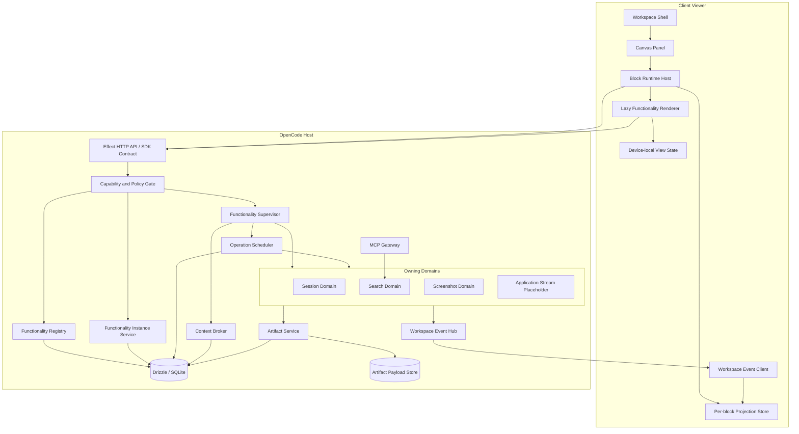
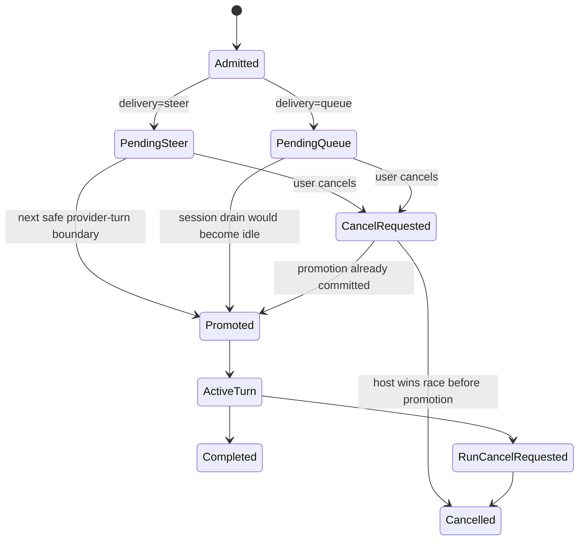
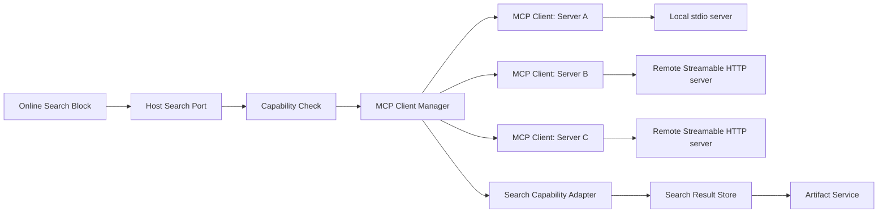
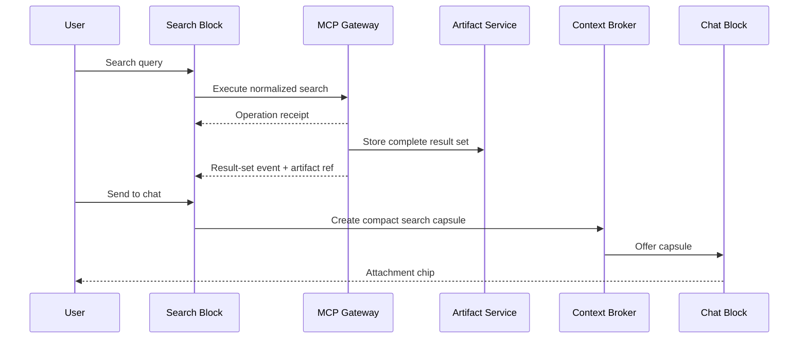
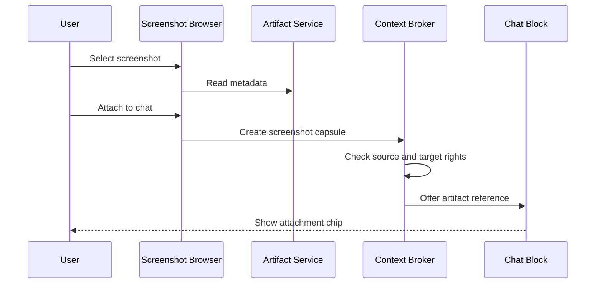
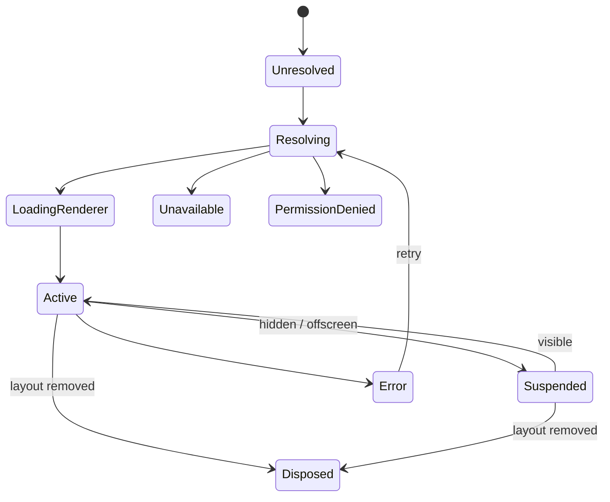

# Workspace Functionality Subsystem Management Architecture

**Status:** draft for review  
**Branch context:** `feature/UnrealViewer`  
**Scope:** Management layer between workspace-canvas UI blocks and backend domain data  
**Primary stack:** TypeScript, SolidJS, Effect, Effect Schema, Drizzle/SQLite  
**Initial built-in blocks:** Chat, Online Search MCP Switcher, Screenshot Browser, Application Window Streaming Placeholder  
**Source basis:** [UIDesign.md](./UIDesign.md), [workspace-canvas/requirements.md](./requirements.md), and [workspace-canvas/architecture.md](./architecture.md)

---

## 1. Executive Decision

Introduce a **Functionality Runtime Platform** between canvas blocks and backend domains.

The platform has six central services:

1. **Functionality Registry** — describes every built-in or plugin-contributed functionality.
2. **Block Runtime Host** — resolves a canvas block into a client renderer and a host-side functionality instance.
3. **Functionality Supervisor** — owns lifecycle, queues, cancellable executions, and projections for active functionality instances.
4. **Capability Service** — grants and enforces scoped `read`, `write`, and `execute` rights.
5. **Context Broker** — lets subsystems exchange compact, permission-filtered context capsules and artifact references instead of copying complete domain state.
6. **Workspace Event Hub** — distributes small typed events while large content remains in its owning domain or artifact store.

The design preserves the existing workspace rules:

- The host remains authoritative for workspace and layout storage.
- A layout continues to contain only block IDs, functionality references, and transforms.
- A block carries no session, terminal, file, screenshot, or provider content in the layout.
- A block ID becomes the stable runtime handle used to resolve backing state stored elsewhere.
- UI blocks remain projections of domain state rather than owners of that state.
- Chat queue admission and ordering stay host-side.

The key separation is:

```text
Layout plane
  Where a block is and which functionality it renders.

Instance plane
  Which directory, session policy, MCP server, filters, or other runtime binding
  a block currently uses. Stored separately from layout JSON.

Domain plane
  Sessions, messages, files, screenshots, MCP profiles, search results, and
  future streams. Each domain owns its own durable state.

Operation plane
  Queued, active, completed, failed, and cancelled work.

Context plane
  Small immutable summaries, facts, and references exchanged between subsystems.

Projection plane
  Read-optimized state sent to a specific UI block.
```

No subsystem may treat a context capsule or a UI projection as authoritative data.

---

## 2. Relationship to the Existing Design

### 2.1 Decisions retained without change

| Existing decision | Treatment in this design |
|---|---|
| Workspace is the outermost product container | Retained |
| Host owns durable workspace and layout storage | Retained |
| Client viewer is a thin projection | Retained |
| Layout stores only `{ id, functionality, transform }` | Retained |
| Content state survives layout changes | Retained |
| Default layout is a full-panel chat block | Retained |
| Functionality IDs are validated against the enabled registry | Retained |
| Non-visible blocks may suspend unless declared keep-alive | Retained and formalized |
| Queue and steer prompts are admitted immediately by the host | Retained |
| Queue ordering and promotion live on the host | Retained |
| Queue is an explicit per-message choice | Retained |
| Unreal/application streaming content model is not yet defined | Retained as an empty contract and placeholder block |

### 2.2 Deliberate extensions

| Extension | Reason |
|---|---|
| Functionality instance store keyed by block ID | Gives each block durable configuration without contaminating layout data |
| Typed query, command, execution, and event ports | Prevents blocks from importing each other’s repositories or backend internals |
| Compact context broker | Lets chat, search, screenshots, and future viewers cooperate without transmitting entire sessions or binary assets |
| `read`, `write`, `execute` capability enforcement | Gives every functionality explicit, auditable authority |
| Host-projected pending-input list | Enables cancellable queued and steer inputs without recreating a client-owned queue |
| Generic cancellable operation scheduler | Supports search, processing, and future streaming in addition to chat |
| MCP gateway and provider-selection block | Adds online search through host-managed MCP clients |
| Screenshot artifact domain and browser block | Makes generated screenshots reusable across sessions and blocks |
| Application streaming interface with no backend implementation | Stabilizes the UI and subsystem contract without pretending streaming exists |

### 2.3 Important boundary

The existing requirements state that layouts contain no content state. This proposal does **not** add content state to layouts.

A layout record remains:

```ts
interface BlockRecord {
  id: BlockId;
  functionality: FunctionalityId;
  transform: {
    x: number;
    y: number;
    w: number;
    h: number;
    z: number;
  };
}
```

Backing configuration is resolved separately:

```ts
interface FunctionalityInstance {
  id: FunctionalityInstanceId;
  workspaceId: WorkspaceId;
  blockId: BlockId;
  functionalityId: FunctionalityId;

  configurationRevision: number;
  configuration: unknown;

  createdAt: number;
  updatedAt: number;
  deletedAt: number | null;
}
```

The stable default instance key is derived from:

```text
(workspaceId, blockId, functionalityId)
```

Moving or resizing a block changes only its layout record. Renaming a workspace does not change the instance. Replacing a block’s functionality archives the old instance and creates a new instance for that block ID and functionality ID pair.

---

## 3. Goals

The management layer must:

- Resolve every block to a validated functionality definition.
- Keep block layout state separate from functionality content and configuration.
- Give subsystems typed, versioned communication ports.
- Permit compact context exchange without direct cross-domain database access.
- Enforce `read`, `write`, and `execute` rights on the host.
- Give the client enough permission information to render correct affordances without making the client authoritative.
- Support cancellable queued and running work.
- Preserve host-side chat queue semantics.
- Allow a block to be suspended and recreated without losing work.
- Keep long-running work alive when its UI block unmounts, where policy permits.
- Return large outputs as artifact references rather than event payloads.
- Support optimistic UI only where reconciliation is deterministic.
- Keep the default deployment inside the existing single-host Effect and SQLite architecture.
- Avoid introducing an external message broker for v1.
- Make MCP transport, screenshot storage, and future window streaming replaceable adapters.
- Support built-in and workspace-enabled plugin functionality definitions.

---

## 4. Non-goals for the First Release

- Running untrusted plugin UI code safely in the same JavaScript realm.
- Real-time multi-user collaborative layout editing.
- Real-time collaborative document editing.
- Passing raw database handles between subsystems.
- Passing MCP credentials to the browser or model sandbox.
- Persisting full model prompts as generic cross-subsystem context.
- Implementing native application-window capture or video transport.
- Automatically selecting an arbitrary MCP tool solely by tool name.
- Allowing a search provider switch to mutate an already admitted search operation.
- Using the client cache as a durable queue.
- Making screenshots or search indexes part of layout JSON.

---

## 5. Terminology

| Term | Meaning |
|---|---|
| **Functionality** | Registered block type such as chat, search provider, screenshot browser, or application stream |
| **Functionality manifest** | Static metadata, schemas, constraints, lifecycle policy, and permission declaration for one functionality |
| **Functionality instance** | Durable configuration associated with one block and functionality inside a workspace |
| **Block runtime** | Client-side renderer plus its connection to a host-side functionality instance |
| **Subsystem** | Host-side module that owns one domain or functionality port implementation |
| **Projection** | Read-optimized state emitted for a block; never authoritative |
| **Query** | Read-only request; requires `read` |
| **Command** | Durable state mutation; requires `write` |
| **Execution** | Starts, steers, interrupts, or otherwise controls side-effectful work; requires `execute` and sometimes `write` |
| **Operation** | Durable record representing queued or active execution |
| **Context capsule** | Compact immutable package of facts, summaries, and references intended for another subsystem or model run |
| **Artifact** | Addressable large or reusable output such as a screenshot, search-result set, log, file, or thumbnail |
| **Capability grant** | Short-lived authority for one user, workspace, functionality instance, set of rights, resources, and operations |
| **Safe provider-turn boundary** | Existing chat-run point at which an admitted steer input can be promoted |
| **Session drain** | Existing chat continuation cycle that controls when queued inputs may be promoted |

---

## 6. System Context



---

## 7. Architectural Principles

### 7.1 Layout purity

A layout answers only:

```text
Which functionality should render in this block?
Where is the block?
```

It does not answer:

```text
Which chat session is open?
Which MCP server is selected?
Which screenshot is selected?
Which stream is connected?
What is the scroll position?
```

### 7.2 Domain ownership

Each subsystem owns its durable data and exposes ports. Other subsystems do not import its repository or write its tables directly.

Examples:

- Session domain owns session inputs, messages, turns, queue state, and run state.
- MCP gateway owns MCP connections and credentials.
- Search domain owns normalized search operations and result sets.
- Screenshot domain owns screenshot metadata, provenance, and lifecycle.
- Artifact service owns payload references, thumbnails, and streaming access.
- Layout service owns block transforms.
- Functionality instance service owns block-specific configuration.

### 7.3 Query, command, and execution separation

Every functionality operation is classified before implementation:

```text
Query
  Reads state without durable mutation or external side effects.

Command
  Mutates durable internal state.

Execution
  Starts or controls side-effectful, asynchronous, external, or interruptible work.
```

This classification drives permissions, idempotency, logging, queueing, and cancellation.

### 7.4 References instead of copies

Cross-subsystem events and context capsules carry:

- IDs.
- Small facts.
- Small summaries.
- Content hashes.
- Artifact references.
- Cursor and revision values.

They do not carry:

- Complete sessions.
- Full web pages.
- Raw screenshots.
- Video frames.
- Complete file trees.
- Complete search indexes.

### 7.5 Server enforcement

The client can hide or disable controls based on projected rights, but every host query, command, execution, cancellation, artifact read, and context materialization is checked again.

### 7.6 Cancellable work is structured work

Long-running operations execute inside supervised Effect fibers with scoped finalizers. Durable operation state is stored in SQLite; Effect queues and fibers manage active in-memory dispatch and cancellation.

An Effect `Queue` is not used as the only durable queue.

### 7.7 Large results become artifacts

If an output exceeds the event or context budget, the subsystem stores it and emits an `ArtifactRef`.

### 7.8 Block unmount does not imply operation cancellation

A block may be moved, hidden, suspended, or removed from the current device layout while a host operation continues. Cancellation is explicit and permission checked.

---

## 8. State Ownership Model

### 8.1 State planes

| State | Owner | Persistence | Example |
|---|---|---|---|
| Layout | Layout service | Host SQLite | `{ x, y, w, h, z, functionality }` |
| Instance configuration | Functionality instance service | Host SQLite | Selected MCP server, chat directory binding policy |
| Domain content | Owning domain | Host SQLite/artifact store | Messages, screenshots, search results |
| Operation | Operation scheduler + owning subsystem | Host SQLite | Queued search, running tool call, cancelled task |
| Context capsule | Context broker | Ephemeral or host SQLite when referenced by durable work | Compact chat-to-search request context |
| Projection | Projector/client store | Client memory; optional cache | Current queue count, selected screenshot metadata |
| View state | Client block | Device-local memory/cache | Scroll, zoom, expanded panels |

### 8.2 Concrete ownership examples

| Value | Stored in layout? | Actual owner |
|---|---:|---|
| Chat block position | Yes | Layout service |
| Chat block ID | Yes | Layout service |
| Current session ID | No | Chat functionality instance or runtime selection policy |
| Chat messages | No | Session domain |
| Pending queue item IDs | No | Session input domain |
| Search block selected MCP server | No | Search functionality instance |
| MCP credentials | No | MCP gateway secret store |
| Search result URLs and snippets | No | Search domain/artifact store |
| Screenshot grid filter | No | Client view state unless explicitly saved as instance preference |
| Screenshot metadata | No | Screenshot domain |
| Screenshot binary | No | Artifact payload store |
| Application stream connection | No | Future streaming subsystem |

---

## 9. Functionality Registry

### 9.1 Registry responsibilities

The registry:

- Merges built-ins with functionality definitions from enabled workspace plugins.
- Validates namespaced IDs.
- Validates block constraints during layout writes.
- Resolves a client renderer module.
- Resolves a host subsystem module.
- Exposes availability and degradation reasons.
- Declares required rights by operation.
- Declares lifecycle and queue policy.
- Declares accepted and produced context kinds.
- Declares query, command, execution, event, configuration, and projection schemas.

### 9.2 Manifest contract

```ts
type Right = "read" | "write" | "execute";

type FunctionalityAvailability =
  | { status: "available" }
  | { status: "degraded"; reason: string }
  | { status: "unavailable"; reason: string };

interface FunctionalityManifest {
  id: FunctionalityId;
  version: number;

  label: string;
  description: string;
  icon: string;

  kind: "builtin" | "plugin";

  renderer: {
    moduleId: string;
    exportName: string;
  };

  constraints: {
    initialAspect: "square" | "free";
    minW: number;
    minH: number;
    maxW: number | null;
    maxH: number | null;
  };

  lifecycle: {
    clientWhenHidden: "suspend" | "keep-mounted";
    hostWhenNoViewers: "keep-running" | "idle" | "stop";
    idleTimeoutMs: number | null;
  };

  concurrency: {
    policy: "serial" | "parallel" | "latest-wins" | "singleton";
    maximumActive: number;
    maximumQueued: number;
  };

  rights: {
    mount: Right[];
    operations: Record<string, Right[]>;
  };

  context: {
    accepts: string[];
    produces: string[];
    defaultBudget: ContextBudget;
  };

  schemas: {
    configuration: SchemaId;
    projection: SchemaId;
    queries: Record<string, SchemaId>;
    commands: Record<string, SchemaId>;
    executions: Record<string, SchemaId>;
    events: Record<string, SchemaId>;
  };
}
```

All schemas are defined with the monorepo’s Effect Schema conventions and included in the SDK contract generation path where they cross the network.

### 9.3 Built-in IDs

```text
builtin:chat
builtin:online-search
builtin:screenshot-browser
builtin:application-window-stream
```

Existing built-ins such as terminal, file tree, diff, todos, and viewer can migrate to the same interface incrementally.

### 9.4 Plugin trust boundary

Rights restrict access through the host API. They do not make arbitrary in-process plugin JavaScript safe.

V1 policy:

- Built-in and explicitly trusted workspace plugins may render in the main client realm.
- A renderer receives a narrow `BlockBridge`; it does not receive the raw SDK client.
- Untrusted plugin renderers require a future sandboxed iframe or worker protocol.
- Plugin host handlers are registered through validated functionality ports.
- Plugin functionality references are valid only while the plugin is enabled in the workspace.

---

## 10. Functionality Instance Service

### 10.1 Instance responsibilities

The service:

- Resolves or lazily creates backing configuration for a block.
- Keeps configuration revisioned.
- Validates configuration against the functionality manifest.
- Persists configuration independently of layout.
- Supports explicit duplication, reset, archive, and migration.
- Emits configuration-change events.
- Does not store domain content that belongs to sessions, artifacts, MCP, or another subsystem.

### 10.2 Proposed table

```sql
CREATE TABLE functionality_instance (
  id TEXT PRIMARY KEY,
  workspace_id TEXT NOT NULL,
  block_id TEXT NOT NULL,
  functionality_id TEXT NOT NULL,
  functionality_version INTEGER NOT NULL,
  configuration_revision INTEGER NOT NULL,
  configuration_json TEXT NOT NULL,
  time_created INTEGER NOT NULL,
  time_updated INTEGER NOT NULL,
  time_deleted INTEGER NULL,
  UNIQUE(workspace_id, block_id, functionality_id)
);
```

### 10.3 Instance resolution

```text
BlockHost receives Block.Record
  ↓
Registry validates functionality ID
  ↓
InstanceService.resolve(workspaceId, blockId, functionalityId)
  ↓
Create default configuration if absent
  ↓
Return manifest + instance projection + capability grant
```

### 10.4 Configuration updates

Configuration writes use optimistic concurrency:

```ts
interface PatchInstanceRequest {
  instanceId: FunctionalityInstanceId;
  expectedRevision: number;
  patch: unknown;
  idempotencyKey: string;
}
```

A stale update returns `ConfigurationRevisionConflict`; the client reloads and presents an explicit conflict rather than silently replacing a newer device state.

---

## 11. Block Runtime Host on the Client

### 11.1 Responsibilities

`BlockRuntimeHost`:

- Receives a validated layout block.
- Loads the functionality renderer lazily.
- Resolves the functionality instance and capability projection.
- Provides a narrow typed `BlockBridge`.
- Subscribes to workspace events for that instance.
- Maintains a per-block projection store.
- Owns device-local view state.
- Suspends or disposes the renderer according to manifest lifecycle policy.
- Wraps each renderer in loading and error boundaries.
- Renders missing, disabled, permission-denied, and unavailable states consistently.

### 11.2 Block bridge

```ts
interface BlockBridge {
  readonly workspaceId: WorkspaceId;
  readonly blockId: BlockId;
  readonly instanceId: FunctionalityInstanceId;
  readonly functionalityId: FunctionalityId;

  rights(): ReadonlySet<Right>;

  query<TInput, TOutput>(
    port: string,
    input: TInput,
  ): Promise<TOutput>;

  command<TInput, TOutput>(
    port: string,
    input: TInput,
    options?: {
      idempotencyKey?: string;
      optimisticEvent?: unknown;
    },
  ): Promise<TOutput>;

  execute<TInput>(
    port: string,
    input: TInput,
    options?: {
      contextCapsuleId?: ContextCapsuleId;
      idempotencyKey?: string;
    },
  ): Promise<OperationReceipt>;

  cancel(operationId: OperationId): Promise<void>;

  createContext(
    request: ContextCreateRequest,
  ): Promise<ContextCapsuleRef>;

  offerContext(
    target: FunctionalityInstanceId,
    capsule: ContextCapsuleRef,
  ): Promise<void>;

  openArtifact(
    artifactId: ArtifactId,
  ): Promise<ArtifactAccess>;
}
```

The bridge binds the request to the current authenticated user, workspace, block, functionality instance, and capability grant. A renderer cannot ask the bridge to impersonate a different block.

### 11.3 SolidJS integration

Use existing SolidJS primitives rather than adding a second UI state framework:

- Lazy renderer modules.
- `<Suspense>` for renderer and initial projection loading.
- `<ErrorBoundary>` per block so one broken functionality does not break the canvas.
- `createStore` for structured projection state.
- Fine-grained event reducers keyed by instance and entity revision.

Do not put authoritative server data into a global mutable client store without revision or cursor metadata.

---

## 12. Host Functionality Supervisor

### 12.1 Responsibilities

The supervisor:

- Resolves the subsystem handler for an instance.
- Creates a scoped Effect runtime for active work.
- Maintains active operation fibers by operation ID.
- Applies the manifest’s concurrency policy.
- Connects durable operation records to in-memory dispatch.
- Publishes typed events.
- Runs finalizers on interruption.
- Recovers pending operations after restart according to subsystem policy.
- Suspends idle resources while preserving durable state.

### 12.2 Effect mapping

Use the existing Effect stack as follows:

| Need | Effect facility |
|---|---|
| Dependency graph | Services, Context, and Layers |
| Wire validation | Effect Schema |
| Active work | Fibers |
| Cancellation | Fiber interruption and interruptible async adapters |
| Resource cleanup | Scope and finalizers |
| Active dispatch and backpressure | Queue |
| In-process fan-out | PubSub |
| Event stream composition | Stream |
| Retries | Schedule |
| Typed expected failures | Effect error channel / tagged errors |

SQLite remains the durable source for queued operations and events. Effect queues are reconstructed from durable records during recovery.

### 12.3 Functionality module contract

```ts
interface FunctionalityModule {
  manifest: FunctionalityManifest;

  createDefaultConfiguration(
    input: FunctionalityCreateContext,
  ): Effect.Effect<unknown, FunctionalityError>;

  query(
    request: FunctionalityQueryEnvelope,
  ): Effect.Effect<unknown, FunctionalityError, FunctionalityServices>;

  command(
    request: FunctionalityCommandEnvelope,
  ): Effect.Effect<unknown, FunctionalityError, FunctionalityServices>;

  execute(
    request: FunctionalityExecutionEnvelope,
  ): Effect.Effect<ExecutionResult, FunctionalityError, FunctionalityServices>;

  project(
    request: ProjectionRequest,
  ): Effect.Effect<unknown, FunctionalityError, FunctionalityServices>;

  compactContext?(
    request: ContextContributionRequest,
  ): Effect.Effect<ContextContribution, FunctionalityError, FunctionalityServices>;
}
```

---

## 13. Typed Communication Ports

### 13.1 Envelopes

```ts
interface FunctionalityEnvelopeBase {
  requestId: string;
  correlationId: string;
  causationId: string | null;

  workspaceId: WorkspaceId;
  blockId: BlockId;
  instanceId: FunctionalityInstanceId;
  functionalityId: FunctionalityId;

  userId: UserId;
  capabilityGrantId: CapabilityGrantId;

  schemaVersion: number;
  requestedAt: number;
}

interface FunctionalityQueryEnvelope extends FunctionalityEnvelopeBase {
  kind: "query";
  port: string;
  input: unknown;
}

interface FunctionalityCommandEnvelope extends FunctionalityEnvelopeBase {
  kind: "command";
  port: string;
  idempotencyKey: string;
  expectedRevision?: number;
  input: unknown;
}

interface FunctionalityExecutionEnvelope extends FunctionalityEnvelopeBase {
  kind: "execution";
  port: string;
  idempotencyKey: string;
  contextCapsuleId?: ContextCapsuleId;
  input: unknown;
}
```

### 13.2 Result forms

```ts
interface QueryResult<T> {
  value: T;
  projectionRevision: number;
  eventCursor: string;
}

interface CommandResult<T> {
  value: T;
  entityRevision: number;
  eventCursor: string;
}

interface OperationReceipt {
  operationId: OperationId;
  status: "queued" | "running";
  admittedAt: number;
  eventCursor: string;
}
```

### 13.3 Cross-subsystem rule

A subsystem may communicate with another subsystem only through:

1. A typed internal port.
2. A compact context capsule.
3. An artifact reference.
4. A workspace event containing IDs or small projections.

It may not directly mutate another subsystem’s tables.

---

## 14. Context Broker

### 14.1 Purpose

The Context Broker solves two different problems:

- Subsystems need to pass useful context to each other without becoming tightly coupled.
- Agent/model executions need compact context instead of the complete state of every visible block.

The broker is not a message history, database, or generic object dump.
It is also not a provider-context engine. It owns compact cross-functionality
capsules and references; SessionV2 alone owns prompt admission, exact
model-facing input sidecars, chronological replay, tool history, and
compaction. A chat target materializes an offered capsule during Session input
admission rather than delegating its transcript or provider request to the
broker.

### 14.2 Context capsule

```ts
interface ContextBudget {
  maximumBytes: number;
  maximumEstimatedTokens: number;
  maximumFacts: number;
  maximumReferences: number;
  maximumArtifacts: number;
  maximumRecentEvents: number;
}

type ContextSensitivity =
  | "public"
  | "workspace"
  | "private"
  | "secret";

interface ContextFact {
  key: string;
  value: string | number | boolean | null;
  sourceRef: EntityRef;
  sensitivity: ContextSensitivity;
  confidence?: number;
}

interface ContextReference {
  kind: string;
  ref: EntityRef | ArtifactRef;
  label: string;
  summary?: string;
  contentHash?: string;
  sensitivity: ContextSensitivity;
}

interface ContextCapsule {
  id: ContextCapsuleId;
  version: 1;

  workspaceId: WorkspaceId;
  createdBy: {
    userId: UserId;
    instanceId: FunctionalityInstanceId;
    operationId?: OperationId;
  };

  purpose: string;
  audience: FunctionalityId[];

  summary: string | null;
  facts: ContextFact[];
  references: ContextReference[];
  artifactRefs: ArtifactRef[];
  recentEvents: CompactEvent[];

  budget: ContextBudget;
  contentHash: string;

  createdAt: number;
  expiresAt: number | null;
}
```

The capsule contains no reusable broad authorization token. The target subsystem’s own grant controls what references it may materialize.

### 14.3 Context creation pipeline

```text
1. Requester declares purpose and target functionality.
2. Context Broker asks allowed source subsystems for contributions.
3. Capability Service filters inaccessible entities and fields.
4. Broker removes duplicates by entity reference and content hash.
5. Broker ranks facts and references by purpose.
6. Deterministic compactors shorten domain data.
7. Optional model summarization may create a derived summary artifact.
8. Broker enforces byte, token, fact, reference, and artifact budgets.
9. Broker stores an immutable capsule when durable work references it.
10. Target receives only the capsule ID or small capsule projection.
```

### 14.4 Default compact budgets

Initial defaults, subject to profiling:

```ts
const DefaultInteractiveContextBudget: ContextBudget = {
  maximumBytes: 32 * 1024,
  maximumEstimatedTokens: 6_000,
  maximumFacts: 32,
  maximumReferences: 16,
  maximumArtifacts: 8,
  maximumRecentEvents: 8,
};
```

A capsule may reference large data without embedding it.

### 14.5 Materialization

```ts
interface ContextMaterializeRequest {
  capsuleId: ContextCapsuleId;
  requesterInstanceId: FunctionalityInstanceId;
  requestedRefs: string[];
  budget: ContextBudget;
}
```

The broker:

- Re-checks current rights.
- Applies field redaction.
- Rejects expired or revoked references.
- Limits total bytes and tokens.
- Returns structured content plus unresolved references.
- Records an audit event for sensitive materialization.

### 14.6 Example: screenshot to chat

The screenshot browser sends:

```json
{
  "summary": "Selected Unreal viewport screenshot",
  "artifactRefs": [
    {
      "artifactId": "artifact-shot-123",
      "kind": "image",
      "mimeType": "image/png",
      "contentHash": "sha256:..."
    }
  ],
  "facts": [
    {
      "key": "dimensions",
      "value": "1920x1080"
    }
  ]
}
```

It does not send PNG bytes through the event bus or place them in the chat block’s instance configuration.

### 14.7 Example: search to chat

The search subsystem returns:

```text
SearchResultSetRef
  provider ID
  query
  result count
  top titles and URLs within budget
  artifact reference to the complete normalized result set
```

The chat subsystem includes the compact top results and keeps the complete result set as a reference that can be materialized only when needed.

---

## 15. Capability and Rights Model

### 15.1 Rights

The platform has exactly three primitive rights:

| Right | Meaning |
|---|---|
| `read` | Query metadata or content and materialize authorized references |
| `write` | Create, update, delete, tag, bind, or otherwise mutate durable internal state |
| `execute` | Start, steer, cancel, connect, invoke a tool, stream, capture, or perform another side effect |

Rights are independent:

- `write` does not imply `execute`.
- `execute` does not imply broad `read`.
- Some operations require more than one right.

Examples:

```text
Send chat prompt:
  write session input
  execute model run

Cancel queued input before promotion:
  write session input

Stop active chat run:
  execute session run

Select an MCP server for a block:
  write functionality instance

Run online search:
  execute selected MCP server tool
  read resulting search artifact

Tag a screenshot:
  write screenshot metadata

Open screenshot original:
  read screenshot artifact

Start future window stream:
  execute application stream
```

### 15.2 Policy model

Use a hybrid:

1. **Role and attribute policy** computes what the user may do.
2. **Capability grant** narrows that authority for a particular block instance and operation set.
3. **Domain handler** performs operation-specific validation.

Use `@casl/ability` in a shared policy package for isomorphic policy construction and UI affordance checks. CASL actions are the three rights; subjects are typed resource descriptors with workspace, owner, provider, and classification attributes.

The host remains authoritative even though the client uses the same policy representation.

### 15.3 Subject model

```ts
type CapabilitySubject =
  | {
      type: "Workspace";
      workspaceId: WorkspaceId;
    }
  | {
      type: "FunctionalityInstance";
      workspaceId: WorkspaceId;
      instanceId: FunctionalityInstanceId;
      functionalityId: FunctionalityId;
    }
  | {
      type: "Session";
      workspaceId: WorkspaceId;
      sessionId: SessionId;
      directoryId: DirectoryId;
    }
  | {
      type: "McpServer";
      workspaceId: WorkspaceId;
      serverId: McpServerId;
      classification: "local" | "remote";
    }
  | {
      type: "Artifact";
      workspaceId: WorkspaceId;
      artifactId: ArtifactId;
      kind: string;
      sensitivity: ContextSensitivity;
    }
  | {
      type: "ApplicationStream";
      workspaceId: WorkspaceId;
      streamId?: string;
    };
```

### 15.4 Capability grant

```ts
interface CapabilityGrant {
  id: CapabilityGrantId;

  userId: UserId;
  workspaceId: WorkspaceId;
  blockId: BlockId;
  instanceId: FunctionalityInstanceId;
  functionalityId: FunctionalityId;

  rights: Right[];
  resourcePatterns: string[];
  allowedOperations: string[];

  policyRevision: number;
  issuedAt: number;
  expiresAt: number;
  revokedAt: number | null;
}
```

Initial deployment should use an opaque grant ID resolved by the host. This is easy to revoke and appropriate for one host process.

If the architecture later becomes multi-process and requires stateless verification, a signed grant token can be introduced behind `CapabilityGrantCodec`; `jose` is an appropriate library for JWS/JWT signing and claim verification. A signed token must still carry audience, expiry, policy revision, and narrow resource scope.

### 15.5 Enforcement pipeline

```text
HTTP/SDK request
  ↓
Authenticate user
  ↓
Decode Effect Schema
  ↓
Resolve workspace and instance
  ↓
Validate capability grant binding and expiry
  ↓
CASL policy check for required rights and subject
  ↓
Operation-specific validation
  ↓
Admit query, command, or execution
  ↓
Audit result
```

### 15.6 Permission projection to the UI

The client receives an operation map, not the full policy engine state:

```ts
interface FunctionalityRightsProjection {
  policyRevision: number;
  canRead: boolean;
  canWrite: boolean;
  canExecute: boolean;
  operations: Record<
    string,
    {
      allowed: boolean;
      reason?: string;
    }
  >;
}
```

The projection can disable buttons and explain denials, but a stale projection cannot authorize a request.

### 15.7 Deny rules

- Explicit deny wins.
- `execute` defaults to denied for newly introduced functionality.
- MCP servers are denied until enabled for the workspace.
- Remote MCP servers require an approved profile.
- Screenshot originals inherit workspace scope and sensitivity.
- Application window streaming is denied and unavailable until a backend is installed.
- A removed plugin immediately invalidates grants for its functionality IDs.

---

## 16. Operation Scheduler and Cancellation

### 16.1 Durable operation model

```ts
type OperationStatus =
  | "admitted"
  | "queued"
  | "running"
  | "cancel-requested"
  | "cancelled"
  | "succeeded"
  | "failed"
  | "interrupted";

interface OperationRecord {
  id: OperationId;
  workspaceId: WorkspaceId;
  instanceId: FunctionalityInstanceId;
  functionalityId: FunctionalityId;

  port: string;
  status: OperationStatus;
  priority: number;

  idempotencyKey: string;
  inputJson: unknown;
  contextCapsuleId: ContextCapsuleId | null;

  requestedByUserId: UserId;
  requestedAt: number;
  startedAt: number | null;
  finishedAt: number | null;
  cancelRequestedAt: number | null;

  resultRef: EntityRef | ArtifactRef | null;
  errorJson: unknown | null;
}
```

### 16.2 Tables

```sql
CREATE TABLE functionality_operation (
  id TEXT PRIMARY KEY,
  workspace_id TEXT NOT NULL,
  instance_id TEXT NOT NULL,
  functionality_id TEXT NOT NULL,
  port TEXT NOT NULL,
  status TEXT NOT NULL,
  priority INTEGER NOT NULL,
  idempotency_key TEXT NOT NULL,
  input_json TEXT NOT NULL,
  context_capsule_id TEXT NULL,
  requested_by_user_id TEXT NOT NULL,
  requested_at INTEGER NOT NULL,
  started_at INTEGER NULL,
  finished_at INTEGER NULL,
  cancel_requested_at INTEGER NULL,
  result_ref_json TEXT NULL,
  error_json TEXT NULL,
  UNIQUE(instance_id, idempotency_key)
);

CREATE TABLE functionality_operation_event (
  cursor INTEGER PRIMARY KEY AUTOINCREMENT,
  operation_id TEXT NOT NULL,
  workspace_id TEXT NOT NULL,
  instance_id TEXT NOT NULL,
  event_type TEXT NOT NULL,
  event_json TEXT NOT NULL,
  time_created INTEGER NOT NULL
);
```

### 16.3 Dispatch

```text
Durable admission transaction
  ↓
Publish small operation-admitted event
  ↓
Offer operation ID to active Effect Queue
  ↓
Supervisor takes operation ID
  ↓
Re-read durable record
  ↓
Check current grant/policy where required
  ↓
Run in supervised Fiber and Scope
  ↓
Persist terminal state and result reference
  ↓
Publish operation event
```

### 16.4 Concurrency policies

| Policy | Behavior |
|---|---|
| `serial` | One active operation per instance; FIFO unless priorities differ |
| `parallel` | Up to `maximumActive`; remaining work is queued |
| `latest-wins` | New execution cancels or supersedes the previous compatible execution |
| `singleton` | At most one active or queued operation of that port |

Initial block policies:

| Functionality | Policy |
|---|---|
| Chat session run | Existing session drain semantics; serial per session |
| Online search | Parallel, default maximum 2 per block |
| Screenshot thumbnail generation | Parallel worker pool |
| Screenshot browsing | Queries only; no operation queue |
| Application window stream | Singleton, but implementation unavailable |

### 16.5 Cancellation semantics

Cancellation is idempotent.

```text
Queued operation:
  Mark cancelled in SQLite.
  Dispatcher skips it.

Running operation:
  Mark cancel-requested.
  Interrupt the owning Effect fiber.
  Run scoped finalizers.
  Abort external request when adapter supports it.
  Persist cancelled or interrupted state.

Completed operation:
  Return AlreadyTerminal as an idempotent success projection.
```

Atomic database commits are not interrupted halfway. A cancellation received during a small non-interruptible commit is applied immediately after the atomic section.

### 16.6 Restart recovery

Each port declares a recovery policy:

```ts
type RecoveryPolicy =
  | "resume"
  | "retry-idempotently"
  | "mark-interrupted"
  | "domain-managed";
```

Chat input promotion remains domain-managed by the session subsystem. Search tool calls normally become `mark-interrupted` unless the MCP server and adapter expose a resumable operation. Artifact downloads may use `resume`.

---

## 17. Workspace Event Hub

### 17.1 Event purpose

Events update UI projections and notify other subsystems. They are not a replacement for domain tables or artifacts.

### 17.2 Event envelope

```ts
interface WorkspaceEvent {
  cursor: string;
  eventId: string;

  workspaceId: WorkspaceId;
  instanceId: FunctionalityInstanceId | null;

  entityRef: EntityRef | null;
  eventType: string;
  schemaVersion: number;

  correlationId: string;
  causationId: string | null;

  payload: unknown;
  artifactRefs: ArtifactRef[];

  createdAt: number;
}
```

### 17.3 Size policy

Initial event payload limit:

```text
16 KiB encoded JSON, excluding referenced artifacts.
```

Larger output must be stored and referenced.

### 17.4 Delivery

- In-process fan-out uses Effect `PubSub`.
- Durable events use SQLite cursors.
- Networked viewers consume a workspace-scoped SSE or the project’s existing durable event transport.
- Reconnect passes the last cursor.
- Projectors are idempotent and deduplicate by event ID and entity revision.
- A compact resnapshot endpoint handles cursor expiration.

---

## 18. Client Projection Management

### 18.1 Initial load

```text
workspace.get + resolved layout
  ↓
render BlockHost shells
  ↓
for each visible block:
  resolve functionality instance
  query compact initial projection
  subscribe from returned event cursor
  lazy-load renderer
```

### 18.2 Projection store

```ts
interface BlockProjectionState<T> {
  instanceId: FunctionalityInstanceId;
  projectionRevision: number;
  eventCursor: string;

  status:
    | "loading"
    | "ready"
    | "stale"
    | "permission-denied"
    | "unavailable"
    | "error";

  rights: FunctionalityRightsProjection;
  value: T | null;
  error: FunctionalityClientError | null;
}
```

### 18.3 Optimistic updates

Optimistic UI is allowed only when:

- The command has a stable client-generated ID.
- The server deduplicates by that ID.
- The authoritative event contains the same ID.
- Rollback is deterministic.

Chat admitted messages already follow this pattern. Search-server selection can optimistically update the selector if the expected configuration revision is included. Screenshot deletion should not disappear permanently until confirmed; it may show a pending state.

### 18.4 Offline behavior

Preserve the existing layout rule:

- Last cached layout may render read-only.
- Host-backed writes and executions fail explicitly while offline.
- Chat drafts may remain local, but pressing Queue or Steer does not pretend host admission succeeded.
- No generic offline command queue is introduced in v1.
- Cached screenshots or search results may be viewed only if their payload is already local and access was previously granted.

---

## 19. Host API Surface

The public API follows the existing Schema → Core → Protocol → Server layering.

### 19.1 Registry and instance endpoints

```text
workspace.functionality.list
functionality.instance.resolve
functionality.instance.get
functionality.instance.patch
functionality.instance.reset
functionality.instance.archive
```

### 19.2 Generic typed gateway

```text
functionality.query
functionality.command
functionality.execute
functionality.operation.get
functionality.operation.cancel
functionality.projection.get
functionality.events
```

The generic gateway routes to registered typed ports. It does not contain business logic.

### 19.3 Context endpoints

```text
context.create
context.getProjection
context.materialize
context.offer
context.revoke
```

Most context calls are internal SDK calls. The browser receives only the operations required by block interaction.

### 19.4 Artifact endpoints

```text
artifact.list
artifact.getMetadata
artifact.open
artifact.thumbnail
artifact.updateMetadata
artifact.remove
artifact.link
```

### 19.5 Chat extensions

```text
session.input.listPending
session.input.cancel
session.run.cancel
```

### 19.6 MCP endpoints

```text
mcp.server.list
mcp.server.get
mcp.server.capabilities
mcp.server.test
mcp.search.execute
mcp.operation.cancel
```

MCP credentials and OAuth tokens never appear in these client responses.

---

## 20. Built-in Block 1 — Regular Chat

### 20.1 Manifest

```ts
const ChatManifest: FunctionalityManifest = {
  id: "builtin:chat",
  version: 1,
  label: "Chat",
  description: "Agentic chat with steer, durable queue, cancellation, and context attachments.",
  icon: "message-square",
  kind: "builtin",

  renderer: {
    moduleId: "packages/app/src/functionalities/chat",
    exportName: "ChatBlock",
  },

  constraints: {
    initialAspect: "square",
    minW: 4,
    minH: 4,
    maxW: null,
    maxH: null,
  },

  lifecycle: {
    clientWhenHidden: "suspend",
    hostWhenNoViewers: "keep-running",
    idleTimeoutMs: null,
  },

  concurrency: {
    policy: "serial",
    maximumActive: 1,
    maximumQueued: 100,
  },

  rights: {
    mount: ["read"],
    operations: {
      "chat.read": ["read"],
      "chat.send.steer": ["write", "execute"],
      "chat.send.queue": ["write", "execute"],
      "chat.input.cancel": ["write"],
      "chat.run.cancel": ["execute"],
      "chat.context.attach": ["write"],
    },
  },

  context: {
    accepts: [
      "workspace.selection",
      "search.result-set",
      "artifact.screenshot",
      "file.reference",
    ],
    produces: [
      "conversation.summary",
      "conversation.selection",
      "artifact.reference",
    ],
    defaultBudget: DefaultInteractiveContextBudget,
  },

  schemas: {} as never,
};
```

### 20.2 Instance configuration

```ts
interface ChatInstanceConfiguration {
  directoryBinding:
    | { mode: "workspace-primary" }
    | { mode: "fixed"; directoryId: DirectoryId };

  sessionBinding:
    | { mode: "most-recent" }
    | { mode: "fixed"; sessionId: SessionId }
    | { mode: "manual" };

  defaultContextSources: FunctionalityInstanceId[];
}
```

This configuration is stored in the functionality instance, not in layout JSON.

### 20.3 UI

Normal composer behavior:

- When idle, primary Send starts a normal prompt.
- When busy and input is non-empty, primary Send or Enter submits `delivery: "steer"`.
- When busy and eligible, the secondary Queue button submits `delivery: "queue"`.
- When input is empty and a run is active, the primary control may render Stop according to the existing composer behavior.
- Shell and command modes retain their existing special handling.

New server-projected controls:

- Pending Inputs button with count.
- Pending list containing admitted steer and queue inputs not yet promoted.
- Cancel action for each pending input when permitted.
- Status badges: `steer`, `queued`, `cancel-requested`, `cancelled`.
- Stop current run action.

The pending list is **not** a client-side queue. It is a projection returned by `session.input.listPending` and updated by server events.

### 20.4 Input lifecycle



### 20.5 Cancellation contract

```ts
interface CancelSessionInputRequest {
  sessionId: SessionId;
  inputId: SessionInputId;
  expectedState: "admitted" | "pending-steer" | "pending-queue";
  idempotencyKey: string;
}

type CancelSessionInputResult =
  | { status: "cancelled" }
  | { status: "already-cancelled" }
  | {
      status: "already-promoted";
      activeRunId: SessionRunId | null;
    };
```

Race handling:

- Cancellation and promotion use one host transaction or equivalent serialized domain operation.
- If cancellation commits first, the input is never added to provider context.
- If promotion commits first, the API returns `already-promoted`; the UI offers Stop Current Run when a run exists.
- A cancelled optimistic timeline message remains visible with a cancelled state or is removed according to product policy, but it must never be mistaken for a provider-visible message.

### 20.6 Steer semantics

Steer retains the existing contract:

- It is admitted durably immediately.
- It is promoted only at the next safe provider-turn boundary.
- It may be cancelled while still pending.
- After promotion, cancelling the input itself no longer rewrites history; the user must stop the active run.

### 20.7 Queue semantics

Queue retains the existing contract:

- It is admitted durably immediately.
- It remains pending while the current session drain requires continuation.
- The host promotes one queue item when the session would otherwise become idle.
- Multiple queue items preserve host order.
- Removing the chat block does not remove queued inputs.

### 20.8 Context attachments

The chat composer can attach context capsules or artifacts from another block.

An attachment chip stores:

```ts
interface ChatContextAttachment {
  contextCapsuleId?: ContextCapsuleId;
  artifactId?: ArtifactId;
  label: string;
  contentHash?: string;
}
```

On first prompt admission, SessionV2 materializes explicit references through
the Context Broker/CtxPack capability boundary and stores an immutable,
versioned model-facing sidecar on the durable Session input. The visible user
message remains clean. The sidecar preserves exact canonical provider-facing
user text, hashes, renderer version, and compact provenance, so later provider
turns replay the same representation without depending on the source block,
capsule, or CtxPack remaining mounted or unchanged.

For the approved `builtin:operating-chat-session` profile, SessionV2 may fill
the remaining attachment and token budget with deterministic automatic CtxPack
recall after explicit materialization from a fixed scan of at most 16
candidates. Automatic recall is workspace-scoped,
permission/sensitivity filtered, first-admission-only, and fail-open; explicit
selection remains fail-closed. Automatic candidates use a validated immutable
read and do not create ContextCapsule rows; the admitted sidecar is the durable
copy. The final rendered envelope is budgeted, including wrapper/provenance.
Generic chat Sessions receive no automatic recall unless a separate profile is
designed.

The App projects the target only to support explicit capsule materialization:
OperatingChat uses its live FunctionalityInstance, an established generic
Session uses `chat-instance:<sessionID>`, and a no-Session composer disables
CtxPack drop. SessionV2 independently reruns the authoritative lookup and
revalidates the complete Session workspace/location/directory plus binding
generation/revision proof, so this projection never becomes an authorization
source.

The broker continues to own source capsules and references. SessionV2 owns the
admitted copy and exact replay. Neither domain may create a second transcript,
put recalled text into layout/browser persistence, or emit fragment text in
events and diagnostics. When compaction includes recalled content, SessionV2
stores the enriched summary/recent form in a private nullable message sidecar;
the public compaction event contains only a fixed sentinel and clean transcript
serialization. Required V2 input has only a content-free public marker. Local
empty-destination import and same-workspace replication carry input/compaction sidecars plus the
Context Epoch through the typed private Session-transfer bundle. Network repair
requires a configured valid host credential over HTTPS, literal
`127.0.0.0/8`/`::1`, or an equivalent confidential transport, never follows
redirects, is sequence-paged, and activates only after
all managed peers negotiate v1. Each snapshot is bounded to 128 aggregates;
every serialized page is at most 512 KiB and carries at most 256 complete public
events or 64 chunks for one oversized public/private record. Pages spool and
apply atomically, and replay is idempotent begin/append/finalize. A missing
private target is valid only when that frozen snapshot contains a later
authoritative revert whose projector boundary deletes the exact target; every
other absence fails as a projection defect. A retained revert with a still-
present target is likewise a defect and never triggers implicit replay. Global SSE
remains a wake hint, and peer attachment unions transfer-required state from
every drained worker, including retained durable V2 marker/private-sentinel
events whose projections were later reverted. Phase 1 rejects every Session workspace/location warp
unconditionally before final sync, prompt cancellation, replay, claim, or
filesystem mutation. See the
[OperatingChat Session Context Assembly Design](../../docs/superpowers/specs/2026-08-25-operating-chat-context-assembly-design.md).

---

## 21. Built-in Block 2 — Online Search MCP Switcher

### 21.1 Purpose

The block:

- Lists host-configured MCP servers approved for online search.
- Shows connection and authorization state.
- Lets an authorized user select the server used by this block.
- Displays discovered normalized search capability.
- Can test the selected connection.
- Can issue a search and produce a reusable search-result-set artifact.
- Can offer that result set to a chat block as compact context.

The browser never connects directly to a local stdio MCP server and never receives MCP credentials.

### 21.2 MCP architecture



Use the official MCP TypeScript SDK behind a host adapter. Current MCP TypeScript SDK documentation identifies a stable v2 line implementing the 2026-07-28 specification. Pin a tested release in the lockfile and isolate SDK calls inside `McpClientAdapter` so future protocol changes do not leak into block or domain contracts.

### 21.3 MCP server profile

```ts
type McpTransportProfile =
  | {
      kind: "stdio";
      command: string;
      arguments: string[];
      environmentSecretRefs: string[];
    }
  | {
      kind: "streamable-http";
      endpoint: string;
      authorizationProfileId: string | null;
    };

interface McpServerProfile {
  id: McpServerId;
  workspaceId: WorkspaceId;

  name: string;
  enabled: boolean;
  purposeTags: string[];

  transport: McpTransportProfile;

  searchBinding: SearchToolBinding | null;

  configurationRevision: number;
  createdAt: number;
  updatedAt: number;
}
```

Secrets are stored as host secret references, never inline in profile JSON returned to the client.

### 21.4 Search tool binding

MCP tool names are not standardized as `search`. A server must be explicitly mapped or confidently normalized from discovered schemas.

```ts
interface SearchToolBinding {
  toolName: string;
  discoveredInputSchemaHash: string;

  fields: {
    query: string;
    maximumResults?: string;
    freshness?: string;
    domains?: string;
  };

  fetchToolName?: string;
  resultAdapterId: string;
}
```

Rules:

- Manual administrator mapping wins.
- Auto-detection may propose a mapping but cannot silently execute an unknown tool.
- If the discovered input schema hash changes, the binding becomes stale and execution is disabled until revalidated.
- Tool descriptions and results are treated as untrusted external data.

### 21.5 Instance configuration

```ts
interface OnlineSearchInstanceConfiguration {
  selectedServerId: McpServerId | null;
  defaultMaximumResults: number;
  defaultFreshness: "any" | "day" | "week" | "month";
  allowedDomainPatterns: string[];
}
```

Changing the selected server is a `write` command on the functionality instance. It does not mutate workspace-wide defaults unless the user invokes a separate authorized command.

### 21.6 Switch semantics

- Selection changes affect only operations admitted afterward.
- Every search operation snapshots `serverId`, tool name, capability schema hash, and server configuration revision at admission.
- Changing the selector does not reroute an in-flight search.
- If the selected server becomes disabled, the block enters `unavailable-selection` and requires another choice.
- If no eligible server exists, the block renders setup guidance rather than silently using direct web access.

### 21.7 UI states

```text
Loading profiles
No configured search server
Permission denied
Selected and disconnected
Authorization required
Connecting
Ready
Searching
Cancelling
Result available
Provider schema changed
Provider unavailable
Error
```

Recommended UI:

```text
┌─────────────────────────────────────────────┐
│ Online Search                              │
│ Server: [ Search MCP A             ▾ ] ●   │
│ Capability: web-search / 2026-07-28        │
│ [Test] [Use as this block's provider]      │
├─────────────────────────────────────────────┤
│ [query...................................]  │
│ [Search] [Cancel]                          │
├─────────────────────────────────────────────┤
│ Result set summary / recent searches       │
│ [Open results] [Send to chat]              │
└─────────────────────────────────────────────┘
```

### 21.8 Search execution

```ts
interface ExecuteOnlineSearchRequest {
  query: string;
  maximumResults: number;
  freshness: "any" | "day" | "week" | "month";
  domains: string[];
  selectedServerRevision: number;
}
```

Admission validates:

- `execute` on the selected MCP server.
- `read` on the resulting artifact classification.
- Server enabled for the workspace.
- Search binding valid for the current discovered schema.
- Input size, result limit, domain filters, and rate limits.

### 21.9 Normalized result set

```ts
interface SearchResultItem {
  rank: number;
  title: string;
  url: string;
  snippet: string | null;
  publishedAt: number | null;
  sourceLabel: string | null;
  rawItemArtifactId: ArtifactId | null;
}

interface SearchResultSet {
  id: SearchResultSetId;
  workspaceId: WorkspaceId;
  operationId: OperationId;

  providerServerId: McpServerId;
  providerToolName: string;
  providerSchemaHash: string;

  query: string;
  items: SearchResultItem[];

  createdAt: number;
  completeArtifactId: ArtifactId;
}
```

The complete normalized response and optional raw provider response are artifacts. Events carry only the result-set ID and compact top-result projection.

### 21.10 Cancellation

- Cancelling marks the host operation `cancel-requested`.
- The MCP adapter sends protocol cancellation or aborts the underlying request/transport when supported.
- If the remote server continues after cancellation, late output is quarantined and not projected as a successful user result.
- The connection manager may retain a healthy shared client after one operation is cancelled.
- Stdio child processes are not killed globally unless the adapter determines the process is dedicated and unrecoverable.

### 21.11 MCP security

- Host is the MCP broker.
- One MCP client instance communicates with one MCP server connection/profile.
- HTTP-based authorization follows MCP’s authorization model and OAuth security requirements.
- Tokens must be audience-bound to the target MCP server.
- Token passthrough is prohibited.
- Third-party credentials remain at the MCP server or host integration that owns them.
- Tool calls are capability checked and auditable.
- Tool output is size-limited, schema-validated where possible, and marked external/untrusted before entering a model context.

### 21.12 Rights

| Operation | Required rights |
|---|---|
| List eligible servers | `read` on MCP server profiles |
| Read discovered capability | `read` on selected server |
| Select server for this block | `write` on functionality instance |
| Test connection | `execute` on selected server |
| Execute search | `execute` on selected server and `read` on output artifact |
| Cancel search | `execute` on operation |
| Offer result set to chat | `read` result set and `write` target chat context attachment |

---

## 22. Built-in Block 3 — Screenshot Browser

### 22.1 Purpose

The block browses screenshots created by:

- Agent or tool executions.
- Existing screenshot-generation workflows.
- Manual import.
- Test automation.
- Future application-window streaming or capture plugins.

It provides:

- Virtualized grid or timeline.
- Thumbnail-first loading.
- Filters by workspace, session, run, source, tag, and time.
- Detail view with provenance.
- Original-image opening through an authorized artifact stream.
- Tagging and deletion where permitted.
- Selection and transfer to chat through context capsules.

### 22.2 Artifact model

```ts
interface ArtifactRef {
  artifactId: ArtifactId;
  kind: string;
  mimeType: string;
  contentHash: string;
  byteLength?: number;
}

interface ScreenshotArtifact {
  id: ArtifactId;
  workspaceId: WorkspaceId;

  kind: "screenshot";
  mimeType: "image/png" | "image/jpeg" | "image/webp";
  contentHash: string;
  byteLength: number;

  width: number;
  height: number;

  originalPayloadRef: string;
  thumbnailArtifactId: ArtifactId | null;
  previewArtifactId: ArtifactId | null;

  source:
    | {
        kind: "session-tool";
        sessionId: SessionId;
        messageId: MessageId | null;
        operationId: OperationId | null;
        toolName: string;
      }
    | {
        kind: "manual-import";
        importedByUserId: UserId;
      }
    | {
        kind: "test-run";
        runId: string;
      }
    | {
        kind: "application-stream";
        streamId: string;
        frameTimestamp: number;
      };

  tags: string[];
  sensitivity: ContextSensitivity;

  createdAt: number;
  deletedAt: number | null;
}
```

### 22.3 Storage

The host artifact store is authoritative.

A payload adapter may use:

- Existing host file/artifact storage.
- A content-addressed filesystem directory.
- Object storage in a remote deployment.

The client may cache thumbnails in IndexedDB, but that cache is disposable and does not grant access after rights are revoked.

### 22.4 Thumbnail generation

Use `sharp` on the host for consistent thumbnail and preview generation when the runtime supports its Node-API requirements.

Recommended derivatives:

```text
thumbnail: maximum edge 320 px
preview: maximum edge 1600 px
original: unchanged
```

Derived images receive their own content hashes and artifact records. Metadata stripping and retention must be explicit because image libraries may remove metadata by default.

### 22.5 UI virtualization

Use `@tanstack/solid-virtual` for a large screenshot collection. Only visible or overscan thumbnails are mounted and requested.

The block does not decode full-resolution originals in the grid.

### 22.6 Instance configuration

Most filters are view state. Only explicit user preferences should be stored in the functionality instance:

```ts
interface ScreenshotBrowserInstanceConfiguration {
  defaultScope:
    | { mode: "workspace" }
    | { mode: "session"; sessionId: SessionId };

  defaultSort: "newest" | "oldest";
  thumbnailSize: "small" | "medium" | "large";
}
```

Current query, scroll position, selected item, and lightbox zoom stay device-local.

### 22.7 Queries

```text
screenshot.list
screenshot.getMetadata
screenshot.getProvenance
screenshot.getThumbnailAccess
screenshot.getOriginalAccess
```

List response uses cursor pagination:

```ts
interface ScreenshotListRequest {
  cursor: string | null;
  limit: number;

  sessionId?: SessionId;
  operationId?: OperationId;
  sourceKinds?: string[];
  tags?: string[];
  createdAfter?: number;
  createdBefore?: number;
  text?: string;
}
```

### 22.8 Commands

```text
screenshot.updateTags
screenshot.updateSensitivity
screenshot.remove
screenshot.restore
screenshot.linkToEntity
```

### 22.9 Executions

```text
screenshot.generateThumbnail
screenshot.exportArchive
```

Browsing and opening are reads, not executions. Expensive derivative generation is an execution.

### 22.10 Send screenshot to chat

```text
User selects screenshot
  ↓
Screenshot block creates `artifact.screenshot` capsule
  ↓
Context Broker filters metadata and records artifact reference
  ↓
User selects target chat block or active chat block
  ↓
Broker offers capsule to target
  ↓
Chat composer displays attachment chip
  ↓
Prompt admission snapshots authorized reference
```

If the chat user lacks read access to the screenshot artifact, the offer is denied before attachment.

### 22.11 Rights

| Operation | Required rights |
|---|---|
| List metadata | `read` screenshot collection |
| Open thumbnail/original | `read` artifact |
| Change tags | `write` screenshot metadata |
| Delete or restore | `write` screenshot artifact |
| Generate missing derivative | `execute` screenshot processing plus `read` original |
| Attach to chat | `read` artifact plus `write` target chat attachment |

---

## 23. Built-in Block 4 — Application Window Streaming Placeholder

### 23.1 Purpose

This block reserves the functionality identity, UI state model, permissions, and backend interface for future application-window streaming.

It does **not** implement:

- Window enumeration.
- Native capture.
- Encoding.
- WebRTC.
- Video frame transport.
- Audio capture.
- Input forwarding.
- Screenshot capture from a stream.

### 23.2 Manifest

```ts
const ApplicationWindowStreamManifest: FunctionalityManifest = {
  id: "builtin:application-window-stream",
  version: 1,
  label: "Application Window",
  description: "Application-window streaming contract. No backend is installed.",
  icon: "monitor-play",
  kind: "builtin",

  renderer: {
    moduleId: "packages/app/src/functionalities/application-window-stream",
    exportName: "ApplicationWindowStreamBlock",
  },

  constraints: {
    initialAspect: "free",
    minW: 4,
    minH: 3,
    maxW: null,
    maxH: null,
  },

  lifecycle: {
    clientWhenHidden: "suspend",
    hostWhenNoViewers: "stop",
    idleTimeoutMs: 0,
  },

  concurrency: {
    policy: "singleton",
    maximumActive: 1,
    maximumQueued: 0,
  },

  rights: {
    mount: ["read"],
    operations: {
      "application-stream.list-sources": ["read"],
      "application-stream.configure": ["write"],
      "application-stream.start": ["execute"],
      "application-stream.stop": ["execute"],
    },
  },

  context: {
    accepts: [],
    produces: ["application-stream.reference", "artifact.screenshot"],
    defaultBudget: DefaultInteractiveContextBudget,
  },

  schemas: {} as never,
};
```

### 23.3 Backend interface

```ts
interface ApplicationWindowStreamingService {
  availability(): Effect.Effect<FunctionalityAvailability>;

  listSources(
    request: ListApplicationWindowsRequest,
  ): Effect.Effect<
    readonly ApplicationWindowDescriptor[],
    ApplicationStreamingError
  >;

  start(
    request: StartApplicationWindowStreamRequest,
  ): Effect.Effect<
    ApplicationWindowStreamSession,
    ApplicationStreamingError
  >;

  stop(
    request: StopApplicationWindowStreamRequest,
  ): Effect.Effect<void, ApplicationStreamingError>;

  events(
    streamId: string,
  ): Stream.Stream<
    ApplicationWindowStreamEvent,
    ApplicationStreamingError
  >;
}
```

### 23.4 Empty implementation

```ts
class ApplicationWindowStreamingUnavailable
  implements ApplicationWindowStreamingService {

  availability() {
    return Effect.succeed({
      status: "unavailable" as const,
      reason: "No application-window streaming backend is installed.",
    });
  }

  listSources() {
    return Effect.fail(
      new FeatureUnavailable({
        feature: "application-window-streaming",
      }),
    );
  }

  start() {
    return Effect.fail(
      new FeatureUnavailable({
        feature: "application-window-streaming",
      }),
    );
  }

  stop() {
    return Effect.fail(
      new FeatureUnavailable({
        feature: "application-window-streaming",
      }),
    );
  }

  events() {
    return Stream.fail(
      new FeatureUnavailable({
        feature: "application-window-streaming",
      }),
    );
  }
}
```

### 23.5 Placeholder UI

```text
┌─────────────────────────────────────────────┐
│ Application Window                         │
├─────────────────────────────────────────────┤
│                                             │
│   Streaming backend is not installed.       │
│                                             │
│   This block currently defines only the     │
│   future integration contract.              │
│                                             │
│   [Open setup documentation]                 │
│                                             │
└─────────────────────────────────────────────┘
```

The block may be added to a layout and remains stable across upgrades. It never shows fake windows or a fake connected state.

### 23.6 Future adapter boundary

A future implementation may plug in:

```ts
interface ApplicationWindowStreamingAdapter {
  id: string;
  platform: string;

  listSources(...): Effect.Effect<...>;
  startCapture(...): Effect.Effect<...>;
  stopCapture(...): Effect.Effect<...>;
  createViewerOffer(...): Effect.Effect<...>;
}
```

The future transport could use WebRTC or another protocol, but that decision is intentionally deferred.

---

## 24. Cross-subsystem Communication Scenarios

### 24.1 Search result to chat



### 24.2 Screenshot to chat



### 24.3 Chat requests online search

The chat subsystem does not directly instantiate an MCP client.

```text
Chat operation requires online search
  ↓
Tool/router resolves an eligible online-search functionality or workspace provider
  ↓
Capability Service checks execute rights
  ↓
Context Broker creates a compact search request capsule
  ↓
Search domain executes through MCP Gateway
  ↓
Search result artifact returned
  ↓
Chat materializes compact result projection
```

The selected search block may provide the user’s preferred server. If no block-specific provider is available, a workspace default may be used only when explicitly configured.

### 24.4 Application stream to screenshot browser

Not implemented.

Future intended flow:

```text
Application stream frame capture
  ↓
Screenshot artifact created
  ↓
Screenshot-created workspace event
  ↓
Screenshot Browser projection updates
```

No code should depend on this flow until the streaming adapter exists.

---

## 25. Persistence Additions

### 25.1 Functionality instance

Described in Section 10.

### 25.2 Capability policy and overrides

CASL rules may be built from existing roles plus persisted workspace overrides:

```sql
CREATE TABLE workspace_permission_rule (
  id TEXT PRIMARY KEY,
  workspace_id TEXT NOT NULL,
  principal_type TEXT NOT NULL,
  principal_id TEXT NOT NULL,
  effect TEXT NOT NULL,
  right TEXT NOT NULL,
  subject_type TEXT NOT NULL,
  conditions_json TEXT NULL,
  fields_json TEXT NULL,
  time_created INTEGER NOT NULL,
  time_updated INTEGER NOT NULL
);
```

Capability grants may remain in memory initially. Persist only when cross-process or long-lived grants become necessary.

### 25.3 Context capsule

```sql
CREATE TABLE context_capsule (
  id TEXT PRIMARY KEY,
  workspace_id TEXT NOT NULL,
  created_by_user_id TEXT NOT NULL,
  created_by_instance_id TEXT NOT NULL,
  purpose TEXT NOT NULL,
  audience_json TEXT NOT NULL,
  summary TEXT NULL,
  facts_json TEXT NOT NULL,
  references_json TEXT NOT NULL,
  artifact_refs_json TEXT NOT NULL,
  recent_events_json TEXT NOT NULL,
  budget_json TEXT NOT NULL,
  content_hash TEXT NOT NULL,
  time_created INTEGER NOT NULL,
  time_expires INTEGER NULL
);
```

Only capsules referenced by durable operations or explicit user transfers need durable storage. Others may live in a bounded cache.

### 25.4 Artifact metadata

```sql
CREATE TABLE artifact (
  id TEXT PRIMARY KEY,
  workspace_id TEXT NOT NULL,
  kind TEXT NOT NULL,
  mime_type TEXT NOT NULL,
  content_hash TEXT NOT NULL,
  byte_length INTEGER NOT NULL,
  payload_ref TEXT NOT NULL,
  sensitivity TEXT NOT NULL,
  metadata_json TEXT NOT NULL,
  time_created INTEGER NOT NULL,
  time_deleted INTEGER NULL
);

CREATE TABLE artifact_link (
  artifact_id TEXT NOT NULL,
  entity_type TEXT NOT NULL,
  entity_id TEXT NOT NULL,
  relation TEXT NOT NULL,
  time_created INTEGER NOT NULL,
  PRIMARY KEY(artifact_id, entity_type, entity_id, relation)
);
```

### 25.5 MCP profile and selection

```sql
CREATE TABLE mcp_server_profile (
  id TEXT PRIMARY KEY,
  workspace_id TEXT NOT NULL,
  name TEXT NOT NULL,
  enabled INTEGER NOT NULL,
  purpose_tags_json TEXT NOT NULL,
  transport_json TEXT NOT NULL,
  search_binding_json TEXT NULL,
  configuration_revision INTEGER NOT NULL,
  time_created INTEGER NOT NULL,
  time_updated INTEGER NOT NULL
);
```

The block’s selected server remains in `functionality_instance.configuration_json`.

### 25.6 Session input extension

The existing session input table requires enough state to support listing and cancellation:

```text
input ID
session ID
delivery: steer | queue
state: admitted | pending | promoted | cancel-requested | cancelled | failed
admission sequence
promotion sequence nullable
cancelled by user nullable
cancelled at nullable
message ID / optimistic reconciliation ID
```

Exact migration should follow the existing session domain schema rather than duplicating input records in the generic operation table.

---

## 26. Error Model

Use tagged, serializable errors.

```ts
type FunctionalityError =
  | PermissionDenied
  | CapabilityExpired
  | CapabilityRevoked
  | FunctionalityUnavailable
  | FunctionalityNotEnabled
  | MissingFunctionality
  | InvalidFunctionalityConfiguration
  | ConfigurationRevisionConflict
  | SchemaDecodeFailed
  | EntityNotFound
  | OperationNotFound
  | OperationAlreadyTerminal
  | OperationQueueFull
  | OperationCancelled
  | OperationInterrupted
  | ContextBudgetExceeded
  | ContextReferenceDenied
  | ArtifactAccessDenied
  | ArtifactNotFound
  | McpServerUnavailable
  | McpAuthorizationRequired
  | McpCapabilityChanged
  | McpToolCallFailed
  | FeatureUnavailable;
```

Client error projection:

```ts
interface FunctionalityClientError {
  code: string;
  message: string;
  retryable: boolean;
  action?:
    | "reload"
    | "reauthorize"
    | "choose-provider"
    | "request-access"
    | "open-settings";
  correlationId: string;
}
```

Do not send stack traces, secrets, MCP tokens, shell arguments containing secrets, or raw provider responses in UI errors.

---

## 27. Observability and Audit

### 27.1 Structured fields

Every request and operation should log:

```text
correlationId
causationId
workspaceId
blockId
instanceId
functionalityId
userId
port
requiredRights
policyRevision
operationId
status
latency
resultRef
errorCode
```

### 27.2 Audit events

Audit at minimum:

- Permission denials.
- Capability issuance and revocation.
- MCP server selection changes.
- MCP tool execution.
- Search-result transfer to chat.
- Screenshot original reads for sensitive artifacts.
- Screenshot deletion.
- Pending chat input cancellation.
- Active run cancellation.
- Context materialization involving private or secret data.
- Future application stream start and stop.

### 27.3 Metrics

```text
functionality_operations_total{functionality,port,status}
functionality_operation_duration_ms{functionality,port}
functionality_queue_depth{functionality,instance}
functionality_active_fibers{functionality}
context_capsule_bytes
context_capsule_estimated_tokens
context_reference_denials_total
mcp_connections{server,status}
mcp_tool_calls_total{server,tool,status}
screenshot_artifacts_total
screenshot_thumbnail_queue_depth
workspace_event_lag
```

---

## 28. Security Considerations

### 28.1 Server-side authority

- Never trust a block-supplied workspace, user, or functionality identity without resolving it from the authenticated request and grant.
- Revalidate functionality refs and enabled plugins on each relevant write.
- Revalidate rights on cancellation as well as admission.
- Invalidate grants when workspace membership, policy, plugin enablement, or instance ownership changes.

### 28.2 MCP

- Host acts as broker; model-generated code has no direct network path to MCP servers.
- HTTP MCP authorization must use audience-bound tokens intended for the target resource server.
- Do not pass one MCP server’s token to another server.
- Do not pass third-party service credentials through the MCP client.
- Treat tool metadata and output as untrusted.
- Require explicit approval or policy for high-impact tools.
- Cap tool input and output size.
- Apply URL and content safety policy before rendering results.
- Store remote OAuth credentials in the host secret store.

### 28.3 Context

- Apply permission filtering before summarization so a summary cannot leak inaccessible data.
- Label external content as untrusted when inserted into model context.
- Never embed secrets in a generic context capsule.
- Use artifact references for binary data.
- Expire temporary capsules.
- Hash immutable capsules for deduplication and audit.

### 28.4 Screenshots

- Screenshots may contain credentials, source code, personal information, or private application windows.
- Default sensitivity should be `workspace` or stricter.
- Thumbnail access must be checked like original access.
- Deleting metadata without deleting payload is not sufficient; artifact garbage collection must be policy aware.
- Do not automatically expose future stream frames to chat.

### 28.5 Plugins

- A capability-scoped API is necessary but not a complete sandbox for code running in the main realm.
- Untrusted UI plugins need iframe or worker isolation.
- Host plugins need process or permission isolation if they are not trusted.
- Plugin removal revokes functionality instances and grants but does not silently destroy associated user data.

---

## 29. Performance and Lifecycle

### 29.1 Twelve-block target

To retain the existing 12-block/60-fps target:

- Lazy-load renderer bundles.
- Use fine-grained Solid projections.
- Suspend non-visible renderers.
- Keep host work independent of component mount.
- Use thumbnail-only screenshot grids.
- Virtualize large result lists and screenshot grids.
- Send delta events rather than full projections.
- Coalesce high-frequency progress events.
- Do not render streaming token updates into blocks that are not visible.

### 29.2 Block lifecycle



Host operations have their own lifecycle and do not inherit this UI lifecycle.

### 29.3 Keep-alive decisions

| Block | Client hidden | Host with no viewers |
|---|---|---|
| Chat | Suspend rendering | Keep session run and pending inputs alive |
| Online search | Suspend renderer | Keep admitted search operation; idle client connections may close |
| Screenshot browser | Dispose heavy grid state | No long-running host resource required |
| Application stream placeholder | Suspend | No resource exists |

### 29.4 Event coalescing

Progress events should be coalesced by operation and interval. Terminal state events are never dropped.

Example:

```text
Search progress: at most 5 events/second per operation.
Thumbnail generation progress: aggregate counts every 250 ms.
Chat token stream: existing behavior for visible chat; compact snapshot on resume.
```

---

## 30. Recommended Libraries

### 30.1 Keep and reuse

| Library/system | Use |
|---|---|
| **Effect** | Services, Layers, typed errors, fibers, interruption, Queue, PubSub, Stream, Scope, retries |
| **Effect Schema** | Port, event, configuration, API, and error validation |
| **Drizzle + SQLite** | Durable instance, operation, artifact, policy, and event metadata |
| **SolidJS** | Renderer components, fine-grained projection state, lazy loading, Suspense, ErrorBoundary |

### 30.2 Add

| Library | Use | Boundary |
|---|---|---|
| **`@casl/ability`** | Shared TypeScript authorization rules for `read`, `write`, `execute` | Policy evaluation; host remains authoritative |
| **Official MCP TypeScript SDK v2** | Host MCP clients, stdio and Streamable HTTP adapters, discovery, tool calls, cancellation | Wrapped in `McpClientAdapter` |
| **`@tanstack/solid-virtual`** | Screenshot grid and large search-result virtualization | Client presentation only |
| **`sharp`** | Host thumbnail and preview generation | Artifact derivative worker |

### 30.3 Optional

| Library | Use | When |
|---|---|---|
| **`jose`** | Signed JWS/JWT capability grants | Only if grants must be verified across processes |
| **MCP Inspector** | Manual and automated MCP integration testing | Development and CI |

### 30.4 Libraries intentionally not added

- No XState requirement: Effect fibers plus explicit durable operation states are sufficient for the host, while Solid stores handle client projections.
- No Kafka, NATS, or Redis requirement for the single-host v1 architecture.
- No client-owned queue library for chat.
- No WebRTC library until application streaming requirements are defined.
- No generic global state library beyond existing Solid patterns.

---

## 31. Proposed Module Layout

```text
packages/schema/src/functionality/
  id.ts
  manifest.ts
  instance.ts
  capability.ts
  context.ts
  operation.ts
  event.ts
  artifact.ts
  errors.ts

packages/core/src/functionality/
  registry.ts
  instance-service.ts
  supervisor.ts
  operation-scheduler.ts
  event-hub.ts
  projection-service.ts
  context-broker.ts
  capability-service.ts
  policy/
    ability.ts
    rules.ts
    subjects.ts
  persistence/
    sql.ts
    migrations.ts

packages/protocol/src/groups/
  functionality.ts
  context.ts
  artifact.ts
  mcp.ts

packages/server/src/handlers/
  functionality.ts
  context.ts
  artifact.ts
  mcp.ts

packages/app/src/pages/canvas/
  block-runtime-host.tsx
  block-unavailable.tsx
  block-permission-denied.tsx
  block-error-boundary.tsx
  block-loading.tsx

packages/app/src/context/functionality/
  bridge.ts
  registry.ts
  projection-store.ts
  event-reducer.ts
  rights.ts

packages/app/src/functionalities/chat/
  index.tsx
  manifest.ts
  pending-inputs.tsx
  context-attachments.tsx

packages/app/src/functionalities/online-search/
  index.tsx
  manifest.ts
  server-selector.tsx
  search-form.tsx
  results.tsx

packages/app/src/functionalities/screenshot-browser/
  index.tsx
  manifest.ts
  screenshot-grid.tsx
  screenshot-detail.tsx
  filters.ts

packages/app/src/functionalities/application-window-stream/
  index.tsx
  manifest.ts
  unavailable.tsx

packages/core/src/mcp/
  client-manager.ts
  client-adapter.ts
  profile-service.ts
  capability-discovery.ts
  search-binding.ts
  search-normalizer.ts

packages/core/src/artifact/
  service.ts
  payload-store.ts
  screenshot-service.ts
  image-derivatives.ts

packages/core/src/session/
  input-cancel.ts
  pending-input-projection.ts
```

---

## 32. Implementation Phases

### Phase 1 — Runtime contracts and registry

Implement:

- Functionality manifest schemas.
- Built-in registry entries.
- Functionality instance table and service.
- Block Runtime Host.
- Query/command/execution gateway.
- Effect Schema validation.
- Standard block loading, error, unavailable, and permission states.

Exit criteria:

- Existing chat can render through `builtin:chat` without moving session state into layout.
- Reordering and resizing blocks do not reset functionality configuration.
- Unknown functionality IDs render a recoverable error block.

### Phase 2 — Rights and capability grants

Implement:

- Shared CASL policy package.
- Host capability service.
- Client rights projection.
- Audit logging.
- Revocation on workspace/plugin/policy change.

Exit criteria:

- Every query, command, execution, and cancellation is checked.
- Client affordances match current rights but cannot bypass server enforcement.
- `execute` is independently denyable.

### Phase 3 — Operation scheduler and event hub

Implement:

- Durable operation and operation-event tables.
- Supervisor and active fiber map.
- Cancellation.
- SSE cursor projection.
- Restart recovery policies.

Exit criteria:

- Queued and active generic operations survive UI block unmount.
- Running interruptible work can be cancelled and finalizers run.
- Client reconnect resumes from cursor.

### Phase 4 — Cancellable chat inputs

Implement:

- Pending-input query.
- `session.input.cancel`.
- Race-safe promotion/cancellation serialization.
- Server-projected pending-input UI.
- Active run cancellation integration.

Exit criteria:

- Queue and steer remain host-admitted.
- A pending queue or steer item can be cancelled.
- No cancelled item enters provider context.
- Promotion-vs-cancel race returns a deterministic result.
- No client-side queue is reintroduced.

### Phase 5 — Context Broker

Implement:

- Context capsule schemas and budgets.
- Contribution ports.
- Permission filtering.
- Artifact references.
- Offer and target acceptance.
- Chat attachment integration.

Exit criteria:

- Search and screenshot blocks can send compact references to chat.
- Raw binary content never travels in workspace events.
- Target materialization re-checks current rights.

### Phase 6 — Online Search MCP block

Implement:

- MCP profile service.
- Official SDK adapter.
- stdio and Streamable HTTP profiles.
- Capability discovery.
- Explicit search-tool mapping.
- Server selector block.
- Search operation, normalization, artifacts, and cancellation.
- OAuth/authorization status projection for remote servers.

Exit criteria:

- Authorized user can switch among eligible servers.
- In-flight search remains pinned to its admitted server.
- Schema changes disable stale mappings.
- Credentials never reach the browser.
- Search result set can be attached to chat.

### Phase 7 — Screenshot Browser

Implement:

- Screenshot artifact schema and provenance.
- Artifact payload adapter.
- Sharp derivative worker.
- Cursor queries.
- Solid virtualized grid.
- Detail viewer.
- Tags, deletion, and chat attachment.

Exit criteria:

- Thousands of screenshots can be browsed without loading originals.
- Access checks apply to thumbnails and originals.
- Screenshot attachments use context/artifact references.

### Phase 8 — Application stream placeholder

Implement:

- Manifest.
- Service interface.
- `FeatureUnavailable` implementation.
- Placeholder renderer.
- Permission declarations.

Exit criteria:

- Block can be placed in layouts.
- It truthfully reports that no backend is installed.
- No capture or streaming behavior is implied.

---

## 33. Test Plan

### 33.1 Registry and layout

- Add each built-in block.
- Move, resize, and reload.
- Confirm layout JSON contains only IDs, functionality refs, and transforms.
- Disable a plugin and verify its block renders a missing/disabled state.
- Replace functionality in a block and verify old backing state is archived according to policy.

### 33.2 Rights

- Read-only user can view but cannot mutate or execute.
- Writer without execute can change block configuration but cannot run search or chat.
- Operator with execute but without screenshot read cannot attach a screenshot.
- Permission change revokes active grants.
- Stale client permission projection cannot bypass host checks.

### 33.3 Chat

- Steer while busy promotes at the next safe boundary.
- Queue while busy promotes only when the drain idles.
- Multiple queue items preserve host ordering.
- Cancel pending steer.
- Cancel pending queue item.
- Race cancellation against promotion.
- Cancel active run.
- Reload client and confirm pending list comes from host.
- Remove chat block and confirm host work survives.

### 33.4 Operations

- Cancel queued operation.
- Cancel running Effect fiber.
- Confirm finalizer runs.
- Restart host with admitted operations.
- Verify recovery policy.
- Duplicate idempotency key returns original receipt.
- Queue-capacity denial is explicit.

### 33.5 Context

- Enforce byte/token/fact/reference limits.
- Deduplicate references.
- Deny inaccessible artifact.
- Revoke access after capsule creation and deny later materialization.
- Ensure binary payload does not appear in event JSON.
- Preserve source provenance and content hash.

### 33.6 MCP

- Local stdio server.
- Remote Streamable HTTP server.
- Authorization required.
- Invalid audience token rejected.
- Tool schema changes after selection.
- Server disabled while block is mounted.
- Server switch during active search.
- Cancellation with cooperative server.
- Cancellation with non-cooperative server.
- Oversized and malformed tool output.
- MCP Inspector compatibility test.

### 33.7 Screenshots

- Browse 10,000 metadata records.
- Confirm virtualized mounting.
- Thumbnail missing then generated.
- Original access denied while metadata is visible.
- Tag update revision conflict.
- Delete and restore.
- Attach screenshot to authorized chat.
- Deny attachment to unauthorized target.
- Remove source session while preserving artifact provenance.

### 33.8 Placeholder streaming

- Block renders unavailable state.
- All service calls return typed `FeatureUnavailable`.
- No mock source or stream is produced.
- Permission projection remains stable for future adapter installation.

---

## 34. Acceptance Criteria

- [ ] Workspace and layout authority remains on the host.
- [ ] Layout records contain no session, MCP, screenshot, queue, or stream content state.
- [ ] Every block resolves a separate functionality instance by workspace and block ID.
- [ ] Every functionality defines versioned schemas and a manifest.
- [ ] Every host operation is classified as query, command, or execution.
- [ ] `read`, `write`, and `execute` are independently enforced on the host.
- [ ] Renderers receive only a narrow block bridge.
- [ ] Rights projection controls UI affordances but is not authoritative.
- [ ] Cross-subsystem communication uses typed ports, compact context, artifact refs, or small events.
- [ ] Context capsules are immutable, budgeted, permission-filtered, and reference-oriented.
- [ ] Large output is stored as an artifact rather than placed in event payloads.
- [ ] Generic executions have durable operation records and cancellable supervised fibers.
- [ ] Chat queue and steer inputs remain host-side and durable.
- [ ] Pending chat inputs are projected from the host.
- [ ] A pending steer or queue input can be cancelled.
- [ ] Cancellation-vs-promotion races are deterministic.
- [ ] Active chat runs can be cancelled separately from pending inputs.
- [ ] Online Search block can switch among approved MCP search servers.
- [ ] A server switch does not reroute an admitted search.
- [ ] MCP credentials never reach the browser or generic context capsule.
- [ ] MCP tool schemas are discovered and mapped explicitly.
- [ ] Search results are normalized and stored as reusable result-set artifacts.
- [ ] Screenshot Browser can browse generated screenshots with virtualized thumbnails.
- [ ] Thumbnail and original reads are both permission checked.
- [ ] Screenshots can be offered to chat by reference.
- [ ] Application Window Streaming block has a stable contract and an honest empty implementation.
- [ ] Removing or hiding a block does not implicitly cancel host work.
- [ ] All event reducers are cursor-aware and idempotent.
- [ ] The client can render a cached layout read-only while offline without pretending commands were admitted.
- [ ] At least 12 mixed blocks remain responsive under the existing performance target.

---

## 35. Open Decisions

Items marked **Resolved** track `../devplan/workspace-canvas/ImplementationPlan.md` Phase 0 ADRs.

1. **Instance retention after block deletion** — archive indefinitely, retain for a time window, or delete immediately when no domain references remain. **Resolved**: soft-archive for 30 days unless durable domain references exist; re-adding a block creates a new instance; explicit restore is a separate command (ADR-5).
2. **Per-block versus workspace-default search provider** — this design supports both but requires explicit precedence. **Resolved**: block instance selection → explicit workspace default → no implicit provider fallback (ADR-9).
3. **Who may configure MCP profiles** — likely owner/admin-equivalent via `write` on the workspace permission/configuration resource.
4. **Search result retention** — session lifetime, workspace history, or explicit pinning.
5. **Screenshot payload store** — existing artifact mechanism, content-addressed filesystem, or deployment-specific object storage.
6. **Sensitive screenshot defaults** — `workspace` versus `private` sensitivity.
7. **Cancelled optimistic chat message presentation** — keep with cancelled badge or remove after acknowledgement.
8. **Plugin sandboxing timeline** — trusted-only v1 versus iframe/worker isolation before external plugin distribution.
9. **Context token estimation** — provider-specific estimator adapters versus one conservative generic estimator.
10. **Application streaming backend** — native sidecar, Unreal-specific plugin, desktop capture service, encoding, and transport remain deliberately undefined.

---

## 36. Reference Architecture Summary

```text
Canvas Layout
  stores block ID + functionality ID + transform only
        │
        ▼
Block Runtime Host
  resolves renderer + functionality instance + rights projection
        │
        ▼
Typed Functionality Gateway
  query / command / execute / cancel
        │
        ▼
Capability Service
  CASL policy + narrow capability grant
        │
        ▼
Functionality Supervisor
  Effect services + durable operation record + Fiber/Scope
        │
        ├── Session Domain
        ├── MCP Gateway / Search Domain
        ├── Screenshot / Artifact Domain
        └── Application Streaming Placeholder
        │
        ▼
Workspace Event Hub
  small revisioned events and artifact references
        │
        ▼
Per-block Projection Store
```

The governing rule is:

```text
Blocks render functionality.
Functionality instances store configuration.
Domains own data.
Operations own work.
Capabilities own authority.
Context capsules carry compact references.
Artifacts carry large content.
Layouts carry none of those things.
```

---

## 37. External Library and Protocol References

The following official documentation was reviewed for this proposal on 2026-08-14:

### Effect

- [Effect — Managing Layers](https://effect.website/docs/v3/requirements-management/layers)
- [Effect — Queue](https://www.effect.website/docs/concurrency/queue)
- [Effect — PubSub](https://www.effect.website/docs/v3/concurrency/pubsub)
- [Effect — Fibers](https://www.effect.website/docs/v3/concurrency/fibers)
- [Effect — Scope](https://www.effect.website/docs/v3/resource-management/scope)
- [Effect — Schema introduction](https://effect.website/docs/v3/schema/introduction)

### Model Context Protocol

- [MCP TypeScript SDK v2](https://ts.sdk.modelcontextprotocol.io/v2/)
- [MCP architecture](https://modelcontextprotocol.io/specification/2026-07-28/architecture)
- [MCP transports](https://modelcontextprotocol.io/specification/2026-07-28/basic/transports)
- [MCP tools](https://modelcontextprotocol.io/specification/2026-07-28/server/tools)
- [MCP resources](https://modelcontextprotocol.io/specification/2026-07-28/server/resources)
- [MCP authorization](https://modelcontextprotocol.io/specification/2026-07-28/basic/authorization)
- [MCP authorization security considerations](https://modelcontextprotocol.io/specification/2026-07-28/basic/authorization/security-considerations)
- [MCP client best practices](https://modelcontextprotocol.io/docs/2026-07-28/develop/clients/client-best-practices)
- [MCP Inspector](https://modelcontextprotocol.io/docs/2026-07-28/tools/inspector)

### Authorization

- [CASL v6 introduction](https://casl.js.org/v6/en/guide/intro/)
- [CASL v6 defining rules](https://casl.js.org/v6/en/guide/define-rules/)
- [CASL v6 TypeScript support](https://casl.js.org/v6/en/advanced/typescript/)
- [jose](https://github.com/panva/jose)

### SolidJS and UI performance

- [SolidJS lazy](https://docs.solidjs.com/reference/component-apis/lazy)
- [SolidJS Suspense](https://docs.solidjs.com/reference/components/suspense)
- [SolidJS ErrorBoundary](https://docs.solidjs.com/reference/components/error-boundary)
- [SolidJS createStore](https://docs.solidjs.com/reference/store-utilities/create-store)
- [TanStack Solid Virtual](https://tanstack.com/virtual/latest/docs/framework/solid/solid-virtual)

### Image processing

- [sharp](https://sharp.pixelplumbing.com/)

---

## 38. Source Documents

This proposal extends, rather than replaces:

- [UIDesign.md](./UIDesign.md) — current chat delivery UI and host-side steer/queue semantics (implemented; this document adds the pending-input projection and cancellation extension).
- [workspace-canvas/requirements.md](./requirements.md) — workspace-canvas product requirements, layout purity, block model, host authority, and open questions (§8 ambiguities marked **Resolved** track this document or the ImplementationPlan ADRs).
- [workspace-canvas/architecture.md](./architecture.md) — current Schema → Core → Protocol → Server layering, workspace storage, functionality registry direction, client canvas design, and chat delivery architecture.
- [ImplementationPlan.md](../../devplan/workspace-canvas/ImplementationPlan.md) — phased delivery plan whose Phase 0 ADRs resolve the open decisions below (§35).

